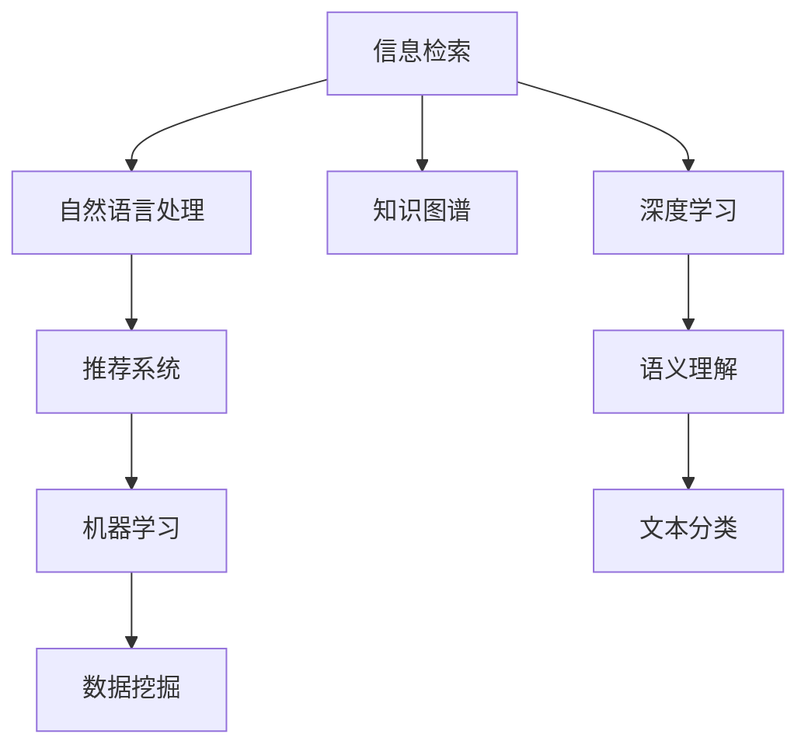

                 

## 1. 背景介绍

在信息化时代，信息无处不在，几乎每时每刻都有新的数据产生。从搜索结果、新闻资讯、社交媒体、电子邮件到各种通知，我们都面临着信息过载的困扰。在专业领域，信息过载更是一个普遍现象，科研人员、专业人士、企业决策者等必须从大量的研究论文、案例分析、市场报告中寻找有价值的信息，才能做出准确的决策。

如何在这个信息海洋中找到所需信息，成为了一个重要的研究课题。本文将从信息搜索的核心概念、关键算法、具体操作、数学模型、项目实践、实际应用场景、推荐资源、总结与展望等多个维度，深入探讨信息搜索策略与指南，帮助读者在庞大的信息海洋中找到所需信息。

## 2. 核心概念与联系

### 2.1 核心概念概述

信息搜索是利用计算机技术，通过索引、算法和人工智能等手段，从海量的数据中快速、准确地找到有价值信息的過程。它涉及到的核心概念包括：

- **信息检索（Information Retrieval, IR）**：通过文本匹配和排序算法，从大量文档中检索出与用户查询相关的文档。
- **自然语言处理（Natural Language Processing, NLP）**：通过处理和理解人类语言，将用户查询转换为机器能够理解的形式，并从中提取有用的信息。
- **推荐系统（Recommender Systems）**：根据用户的历史行为和偏好，推荐最相关的信息。
- **知识图谱（Knowledge Graphs）**：利用图结构表示实体及其关系，通过推理和关联提取有用的信息。
- **深度学习（Deep Learning）**：通过神经网络模型，提取和理解深层次的语义信息。

这些核心概念相互交织，构成了一个复杂的信息搜索系统。

### 2.2 核心概念原理和架构的 Mermaid 流程图(Mermaid 流程节点中不要有括号、逗号等特殊字符)



此图展示了信息搜索中各个核心概念之间的联系和作用。

## 3. 核心算法原理 & 具体操作步骤

### 3.1 算法原理概述

信息搜索算法主要包括：

- **文本检索算法**：通过索引和倒排索引（Inverted Index），实现快速检索。
- **文本匹配算法**：如BM25、TF-IDF、LSI等，用于衡量查询与文档的相关性。
- **信息过滤算法**：如协同过滤（Collaborative Filtering），用于提高搜索结果的相关性和排序。
- **自然语言处理算法**：如命名实体识别（Named Entity Recognition, NER）、情感分析（Sentiment Analysis）等，用于提取和理解文本内容。

### 3.2 算法步骤详解

信息搜索的主要步骤包括：

1. **数据预处理**：清洗和标准化数据，去除噪音，分词和标注实体。
2. **索引构建**：构建倒排索引，将文档中的每个词与文档位置关联。
3. **查询处理**：使用NLP技术处理用户查询，提取关键信息。
4. **文档检索**：使用文本匹配算法，根据查询与文档的相关性进行排序。
5. **结果返回**：根据排序结果返回最相关的文档列表。

### 3.3 算法优缺点

信息搜索算法的主要优点包括：

- 高效性：通过索引和倒排索引，可以快速检索和排序。
- 准确性：使用文本匹配和NLP技术，能够精准地理解查询和文档。

其主要缺点包括：

- 数据稀疏性：对新领域或小众主题的数据稀疏，可能导致检索效果不佳。
- 语义理解局限：虽然NLP技术不断进步，但对复杂语义的理解仍有局限。
- 冷启动问题：新用户的初始行为数据较少，难以进行精准推荐。

### 3.4 算法应用领域

信息搜索算法广泛应用于以下领域：

- **搜索引擎**：如Google、Bing、百度等，使用文本检索和匹配算法。
- **学术搜索**：如Web of Science、Google Scholar等，使用索引和文本分类技术。
- **知识管理**：如维基百科、百度百科等，使用知识图谱和语义理解技术。
- **个性化推荐**：如Amazon、Netflix、YouTube等，使用协同过滤和深度学习技术。

## 4. 数学模型和公式 & 详细讲解 & 举例说明

### 4.1 数学模型构建

信息搜索的数学模型包括：

- **TF-IDF模型**：用于衡量查询和文档之间的相关性。
- **BM25模型**：结合长度惩罚，用于改进TF-IDF模型。
- **LSI模型**：利用奇异值分解（SVD），进行主题模型构建。

### 4.2 公式推导过程

TF-IDF模型的公式为：

$$
TF(x_i, t_j) = \frac{\text{次数}}{\text{总词数}}
$$

$$
IDF(t_j) = \log \frac{N}{1 + \text{包含该词的文档数}}
$$

$$
score(x_i, t_j) = TF(x_i, t_j) \times IDF(t_j)
$$

其中，$x_i$ 表示第$i$个文档，$t_j$ 表示第$j$个词。

### 4.3 案例分析与讲解

假设我们有一个包含100个文档的集合，每个文档有5个词。对于查询"Python编程语言"，我们首先计算每个词的TF-IDF分数，然后根据分数对文档进行排序，返回前10个最相关的文档。

## 5. 项目实践：代码实例和详细解释说明

### 5.1 开发环境搭建

在信息搜索项目中，我们通常使用Python语言和其相关库，如Scikit-Learn、NLTK、SciPy等。首先需要安装这些库，可以使用以下命令：

```bash
pip install scikit-learn nltk scipy
```

### 5.2 源代码详细实现

以下是一个简单的Python代码实现，使用TF-IDF模型进行文档检索：

```python
from sklearn.feature_extraction.text import TfidfVectorizer
from sklearn.metrics.pairwise import cosine_similarity

# 文档列表
documents = [
    "Python is a popular programming language.",
    "Java is another popular programming language.",
    "Scikit-learn is a machine learning library.",
    "TensorFlow is a deep learning library.",
    "NLP is the field of natural language processing."
]

# 初始化TF-IDF向量器
vectorizer = TfidfVectorizer()

# 构建TF-IDF矩阵
tfidf_matrix = vectorizer.fit_transform(documents)

# 查询
query = "Python programming language"

# 将查询转换为向量
query_vector = vectorizer.transform([query])

# 计算相似度
similarity_matrix = cosine_similarity(query_vector, tfidf_matrix)

# 返回最相关文档
most_similar_indices = (-similarity_matrix).argsort()[:10]
most_similar_documents = [documents[i] for i in most_similar_indices]
```

### 5.3 代码解读与分析

上述代码中，我们首先使用Scikit-Learn库中的`TfidfVectorizer`构建TF-IDF向量器，将文档列表转换为TF-IDF矩阵。然后，将查询转换为向量，计算查询与文档的相似度，返回最相关的文档。

## 6. 实际应用场景

### 6.1 搜索引擎

搜索引擎是信息搜索技术最广泛的应用之一，如Google、Bing、百度等。它们通过文本检索和匹配算法，实时响应用户查询，返回相关搜索结果。

### 6.2 学术搜索

学术搜索平台如Web of Science、Google Scholar，使用索引和文本分类技术，帮助研究人员快速找到相关论文和报告。

### 6.3 知识管理

维基百科、百度百科等知识管理平台，利用知识图谱和语义理解技术，提供准确的信息检索和推荐。

### 6.4 个性化推荐

Amazon、Netflix、YouTube等平台使用协同过滤和深度学习技术，根据用户行为进行个性化推荐。

## 7. 工具和资源推荐

### 7.1 学习资源推荐

1. **《信息检索原理》**：这本书全面介绍了信息检索的理论和实践，是信息搜索领域的经典教材。
2. **Coursera上的《信息检索》课程**：由斯坦福大学开设，详细讲解了信息检索的基本原理和算法。
3. **Kaggle上的信息检索竞赛**：通过实际比赛，锻炼信息搜索的实践能力。

### 7.2 开发工具推荐

1. **Python**：Python语言简洁高效，是信息搜索开发的首选语言。
2. **Scikit-Learn**：Python中的机器学习库，提供了各种文本处理和分类算法。
3. **NLTK**：自然语言处理库，提供了分词、标注、语义理解等工具。

### 7.3 相关论文推荐

1. **《The SMART Retrieval Model》**：介绍了一种基于语义匹配的信息检索模型。
2. **《Using Matrix Factorization to Detect and Filter Web Spam》**：利用矩阵分解技术，提高信息检索的准确性。
3. **《Semantic-Based Query Expansion in Information Retrieval》**：研究如何通过语义扩展，提升信息检索的效率和效果。

## 8. 总结：未来发展趋势与挑战

### 8.1 未来发展趋势

信息搜索技术在未来将呈现以下几个趋势：

1. **深度学习和大规模预训练模型**：利用预训练的BERT、GPT等模型，提高语义理解和检索的精度。
2. **多模态信息检索**：结合文本、图像、音频等多种数据，提供更全面的信息检索服务。
3. **跨语言信息检索**：实现不同语言之间的信息检索和翻译，打破语言障碍。
4. **个性化和主动学习**：根据用户行为和反馈，动态调整检索策略，提高用户体验。

### 8.2 面临的挑战

信息搜索技术在发展过程中，仍面临以下挑战：

1. **数据稀疏性**：对于新领域或小众主题的数据稀疏，导致检索效果不佳。
2. **语义理解**：对复杂语义的理解仍存在局限，难以处理双关语、歧义等。
3. **计算资源**：大规模数据集和高维矩阵的计算消耗巨大，需要高效的算法和硬件支持。
4. **隐私和安全**：保护用户隐私和数据安全，防止数据泄露和滥用。

### 8.3 研究展望

未来，信息搜索技术的研究方向包括：

1. **弱监督学习和半监督学习**：利用较少标注数据，提高模型的泛化能力。
2. **自适应和自学习**：根据用户反馈和行为，动态调整检索策略。
3. **多任务学习和跨任务学习**：利用单一模型同时处理多个任务，提高资源的利用效率。
4. **知识图谱和逻辑推理**：结合知识图谱和逻辑推理，提升信息检索的准确性和完备性。

## 9. 附录：常见问题与解答

**Q1: 什么是信息检索？**

A: 信息检索是利用计算机技术，从大量文档集合中查找与用户查询相关的文档，通常使用文本匹配和排序算法。

**Q2: TF-IDF模型和BM25模型有什么区别？**

A: TF-IDF模型计算词在文档中的重要性，BM25模型在TF-IDF基础上加入了长度惩罚，用于改进检索效果。

**Q3: 如何在信息搜索中应用深度学习？**

A: 深度学习可以用于特征提取和语义理解，如使用BERT进行文本分类、命名实体识别等。

**Q4: 如何处理冷启动问题？**

A: 可以通过向新用户推荐已知用户的相似文档，或使用协同过滤推荐系统。

**Q5: 信息搜索技术的未来发展方向有哪些？**

A: 深度学习和大规模预训练模型、多模态信息检索、跨语言信息检索、个性化和主动学习等。

---

作者：禅与计算机程序设计艺术 / Zen and the Art of Computer Programming

