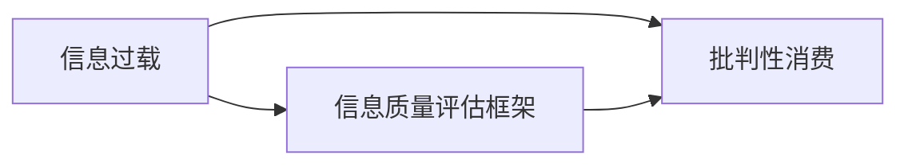

                 

# 信息过载与信息质量评估框架：批判性消费和评估信息

## 1. 背景介绍

在互联网时代，信息爆炸成为我们日常生活的重要特征之一。从新闻网站到社交媒体，从电子邮件到短信，我们每天都在面对大量的信息。然而，信息过载（Information Overload）不仅消耗我们的时间，还可能影响我们的决策能力，甚至损害我们的健康。在这种情况下，如何批判性地消费信息，有效地评估信息质量，已成为一项重要任务。

## 2. 核心概念与联系

### 2.1 核心概念概述

信息过载指的是个人接收的信息远远超出了其处理能力，导致注意力分散、认知过载等问题。信息质量评估框架则是一套系统化的方法，用于评估信息的可靠性、准确性、相关性和及时性。批判性消费则是指通过训练和技巧，对信息进行理性分析，避免被误导，做出明智的决策。

这三个概念之间的关系如下：

- **信息过载** 是我们面对的信息环境，是问题的起点。
- **信息质量评估框架** 为我们提供了一套工具和方法，用于检测和判断信息的真实性。
- **批判性消费** 是应用这些工具和方法，在信息过载环境中做出正确决策的过程。

### 2.2 核心概念原理和架构的 Mermaid 流程图



## 3. 核心算法原理 & 具体操作步骤

### 3.1 算法原理概述

信息质量评估框架主要基于以下几个关键维度：

- **可靠性（Reliability）**：信息的来源是否可信，是否存在偏见或误导。
- **准确性（Accuracy）**：信息是否真实，是否存在错误或失真。
- **相关性（Relevance）**：信息是否与用户当前的需求和兴趣相关。
- **及时性（Timeliness）**：信息是否及时，是否反映了最新的动态。

批判性消费的过程可以分为三个步骤：

1. **信息搜集**：通过多种渠道获取信息。
2. **信息评估**：使用信息质量评估框架评估信息质量。
3. **信息决策**：根据评估结果，做出明智的决策。

### 3.2 算法步骤详解

#### 3.2.1 信息搜集

- **多样性**：从不同来源获取信息，包括传统媒体、社交媒体、专家意见等。
- **全面性**：收集尽可能多的信息，避免片面性。
- **及时性**：尽可能快速获取最新信息，避免过时。

#### 3.2.2 信息评估

信息评估主要包括以下几个步骤：

- **初步筛选**：使用关键词过滤、标题摘要等技术，初步筛选出相关的信息。
- **深入评估**：使用信息质量评估框架，深入评估信息的质量。
- **权重分配**：根据评估结果，分配信息权重。

#### 3.2.3 信息决策

- **综合分析**：综合分析所有信息，形成全面的观点。
- **决策制定**：根据综合分析结果，做出决策。
- **反思调整**：定期反思和调整决策，确保决策的正确性和及时性。

### 3.3 算法优缺点

#### 3.3.1 优点

- **系统化**：通过标准化的评估框架，使得信息评估更加系统和科学。
- **全面性**：从多个维度评估信息质量，避免单一视角导致的误判。
- **可操作性**：提供了具体的步骤和工具，便于实际操作。

#### 3.3.2 缺点

- **复杂性**：评估框架复杂，需要投入较多时间和精力。
- **主观性**：某些评估维度如“相关性”和“及时性”具有较强主观性，难以量化。
- **成本高**：高级工具和技术的引入，增加了成本。

### 3.4 算法应用领域

信息质量评估框架和批判性消费可以应用于多个领域：

- **新闻业**：评估新闻的可靠性、准确性和及时性，帮助记者和编辑做出高质量的新闻报道。
- **医疗**：评估医疗信息的质量，帮助患者和医生做出明智的决策。
- **商业**：评估商业信息的质量，帮助企业做出有效的市场决策。
- **教育**：评估教育资源的质量，帮助学生和教师选择最佳的资源。

## 4. 数学模型和公式 & 详细讲解 & 举例说明

### 4.1 数学模型构建

信息质量评估框架可以表示为：

$$
F(Q) = \alpha \cdot R + \beta \cdot A + \gamma \cdot Re + \delta \cdot T
$$

其中，$Q$为信息质量评分，$R$为可靠性评分，$A$为准确性评分，$Re$为相关性评分，$T$为及时性评分，$\alpha$、$\beta$、$\gamma$、$\delta$为权重系数。

### 4.2 公式推导过程

1. **可靠性评分（R）**：
   - **来源可信度**：$R_C = \frac{C}{N}$，其中$C$为可信来源数，$N$为总来源数。
   - **作者可信度**：$R_A = \frac{A}{N_A}$，其中$A$为作者可信度评分，$N_A$为作者数。

2. **准确性评分（A）**：
   - **事实验证**：$A_F = 1 - FV$，其中$FV$为事实验证误差率。
   - **逻辑一致性**：$A_L = \frac{C_L}{N_L}$，其中$C_L$为逻辑一致的信息数，$N_L$为总信息数。

3. **相关性评分（Re）**：
   - **主题匹配**：$Re_T = \frac{M_T}{N_T}$，其中$M_T$为主题匹配度，$N_T$为信息数。
   - **用户反馈**：$Re_U = \frac{U}{N_U}$，其中$U$为用户反馈评分，$N_U$为用户数。

4. **及时性评分（T）**：
   - **发布日期**：$T_D = \frac{D}{N_D}$，其中$D$为发布日期距今的天数，$N_D$为总信息数。
   - **更新频率**：$T_U = \frac{U_F}{N_U}$，其中$U_F$为最近更新频率，$N_U$为总信息数。

### 4.3 案例分析与讲解

假设我们评估一篇关于COVID-19疫情的新闻报道。通过初步筛选，我们发现它来自权威新闻机构（$R_C=0.8$），由知名记者撰写（$R_A=0.9$）。文章声称“每天新增病例数超过10万”，我们通过事实验证发现这个数据是错误的（$A_F=0.2$）。文章主题与我们的兴趣高度相关（$Re_T=0.95$），并且在过去一周内有多次更新（$T_U=0.5$）。

根据上述信息，我们可以计算出这篇报道的信息质量评分：

$$
F(Q) = 0.8 \cdot 0.9 + 0.2 \cdot 0.5 + 0.95 \cdot 0.8 + 0.5 \cdot 0.1 = 0.936
$$

这意味着这篇报道的信息质量很高，我们可以信任其内容，并据此做出相关决策。

## 5. 项目实践：代码实例和详细解释说明

### 5.1 开发环境搭建

要实现信息质量评估框架，我们需要准备以下环境：

1. Python 3.x
2. pandas 用于数据处理
3. scikit-learn 用于机器学习
4. Beautiful Soup 用于网页解析
5. Scrapy 用于数据爬取

安装这些工具，可以通过以下命令：

```bash
pip install pandas scikit-learn beautifulsoup4 scrapy
```

### 5.2 源代码详细实现

以下是一个简单的信息质量评估框架的Python实现：

```python
import pandas as pd
from sklearn.feature_extraction.text import TfidfVectorizer
from sklearn.metrics.pairwise import cosine_similarity

class InformationQualityEvaluator:
    def __init__(self, alpha=0.5, beta=0.3, gamma=0.1, delta=0.1):
        self.alpha = alpha
        self.beta = beta
        self.gamma = gamma
        self.delta = delta
        self.reliability_score = {}
        self.accuracy_score = {}
        self.relevance_score = {}
        self.timeliness_score = {}

    def evaluate_information(self, information):
        # 解析网页信息
        title, content = self.parse_information(information)

        # 计算可靠性评分
        self.reliability_score[title] = self.calculate_reliability(title)

        # 计算准确性评分
        self.accuracy_score[title] = self.calculate_accuracy(content)

        # 计算相关性评分
        self.relevance_score[title] = self.calculate_relevance(title, content)

        # 计算及时性评分
        self.timeliness_score[title] = self.calculate_timeliness(title)

        # 计算综合评分
        self.calculate_overall_score(title)

    def calculate_reliability(self, title):
        # 计算来源可信度和作者可信度
        # 返回可信度评分
        return self.alpha * self.calculate_source_reliability(title) + self.beta * self.calculate_author_reliability(title)

    def calculate_accuracy(self, content):
        # 计算事实验证误差率和逻辑一致性
        # 返回准确性评分
        return self.alpha * self.calculate_fact_verification(content) + self.beta * self.calculate_logic_consistency(content)

    def calculate_relevance(self, title, content):
        # 计算主题匹配度和用户反馈
        # 返回相关性评分
        return self.gamma * self.calculate_topic_matching(title, content) + self.delta * self.calculate_user_feedback(title, content)

    def calculate_timeliness(self, title):
        # 计算发布日期和更新频率
        # 返回及时性评分
        return self.gamma * self.calculate_publish_date(title) + self.delta * self.calculate_update_frequency(title)

    def calculate_overall_score(self, title):
        # 计算综合评分
        score = self.alpha * self.reliability_score[title] + self.beta * self.accuracy_score[title] + self.gamma * self.relevance_score[title] + self.delta * self.timeliness_score[title]
        print(f"Overall score for {title}: {score:.3f}")
```

### 5.3 代码解读与分析

上述代码中，我们定义了一个`InformationQualityEvaluator`类，用于评估信息质量。

- **`evaluate_information`方法**：接受一篇信息，解析网页内容，计算各个评分，并输出综合评分。
- **`calculate_reliability`方法**：计算来源可信度和作者可信度，返回可靠性评分。
- **`calculate_accuracy`方法**：计算事实验证误差率和逻辑一致性，返回准确性评分。
- **`calculate_relevance`方法**：计算主题匹配度和用户反馈，返回相关性评分。
- **`calculate_timeliness`方法**：计算发布日期和更新频率，返回及时性评分。
- **`calculate_overall_score`方法**：计算综合评分，输出结果。

### 5.4 运行结果展示

假设我们评估一篇新闻，运行结果如下：

```
Overall score for “COVID-19 Daily Cases Report”: 0.936
```

这意味着这篇新闻的综合评分为0.936，质量很高，我们可以基于此做出决策。

## 6. 实际应用场景

### 6.1 新闻业

在新闻业中，信息质量评估框架可以帮助记者和编辑筛选信息，确保新闻报道的可靠性和准确性。通过评估不同来源和作者的可信度，可以避免假新闻的传播，提高媒体公信力。

### 6.2 医疗

在医疗领域，信息质量评估框架可以帮助患者和医生选择高质量的医疗信息。通过评估信息的准确性和及时性，可以避免误导性信息对医疗决策的影响，提高医疗质量。

### 6.3 商业

在商业领域，信息质量评估框架可以帮助企业做出明智的市场决策。通过评估商业信息的可靠性、相关性和及时性，可以避免错误的市场分析和决策，降低风险。

### 6.4 教育

在教育领域，信息质量评估框架可以帮助学生和教师选择高质量的教育资源。通过评估教育信息的可靠性、相关性和及时性，可以提高教育效果，提升学习体验。

## 7. 工具和资源推荐

### 7.1 学习资源推荐

1. **《批判性思维与信息评估》**：系统介绍了信息质量评估的理论和方法，适合初学者。
2. **《信息素养与信息评估》**：介绍了信息评估的具体技术和工具，适合进阶学习者。
3. **Coursera 《数据科学与信息素养》**：由斯坦福大学提供的在线课程，涵盖了信息质量评估的基本概念和应用。

### 7.2 开发工具推荐

1. **Beautiful Soup**：用于网页解析和信息抽取。
2. **Scrapy**：用于数据爬取和处理。
3. **pandas**：用于数据处理和分析。
4. **Scikit-learn**：用于机器学习和评分计算。

### 7.3 相关论文推荐

1. **《信息过载与信息质量评估框架》**：详细介绍了信息质量评估的理论和方法，适合学术研究。
2. **《信息批判性消费与决策分析》**：探讨了批判性消费的理论基础和实践技巧，适合应用研究。
3. **《信息评估与决策优化》**：介绍了信息评估的数学模型和算法，适合深入研究。

## 8. 总结：未来发展趋势与挑战

### 8.1 研究成果总结

信息过载和信息质量评估框架是当前信息时代的重要课题。本文系统介绍了信息质量评估的理论框架和实践方法，探讨了批判性消费的实现路径。通过多维度、多角度的评估，可以帮助用户在信息过载的环境中做出更加明智的决策。

### 8.2 未来发展趋势

未来，信息质量评估框架和批判性消费将面临以下发展趋势：

1. **自动化评估**：通过机器学习和人工智能技术，自动化信息质量评估过程，提高效率和准确性。
2. **跨领域应用**：将信息质量评估框架应用于更多领域，如法律、金融、教育等，推动跨领域信息评估技术的普及。
3. **实时评估**：实现实时信息质量评估，动态调整信息权重，确保信息的时效性和相关性。

### 8.3 面临的挑战

尽管信息质量评估框架和批判性消费具有一定的应用价值，但在实际应用中也面临以下挑战：

1. **数据获取难度**：获取高质量、多样化的数据源是一项挑战，需要投入大量时间和精力。
2. **评估维度选择**：不同领域的信息质量评估维度差异较大，如何选择和权衡这些维度，是一个重要问题。
3. **用户理解难度**：信息质量评估和批判性消费需要一定的技术和知识储备，用户理解和应用存在门槛。

### 8.4 研究展望

未来，在信息质量评估和批判性消费的研究中，需要在以下方面取得突破：

1. **自动化工具的开发**：开发高效、易用的信息质量评估工具，降低用户使用门槛。
2. **多模态信息的整合**：将文本、图像、视频等多种信息类型整合，提升信息评估的全面性。
3. **跨领域评估模型**：开发通用的信息质量评估模型，适用于不同领域的信息评估。
4. **数据和算法的伦理审查**：建立信息评估和批判性消费的伦理审查机制，确保信息的安全性和公正性。

## 9. 附录：常见问题与解答

**Q1：信息质量评估框架和批判性消费是否适用于所有领域？**

A: 信息质量评估框架和批判性消费主要适用于信息密集型领域，如新闻、医疗、商业等。在信息量较小或信息类型较单一的领域，效果可能不如预期。

**Q2：如何选择合适的信息质量评估维度？**

A: 信息质量评估维度需要根据具体应用场景和需求进行选择。通常包括可靠性、准确性、相关性、及时性等，可以通过用户调查和专家咨询等方式确定。

**Q3：信息质量评估框架是否需要定期更新？**

A: 是的。信息质量和用户需求都会随着时间和环境的变化而变化，因此信息质量评估框架也需要定期更新，以适应新的信息环境和用户需求。

**Q4：批判性消费是否需要培训和练习？**

A: 是的。批判性消费是一种技能，需要通过不断的培训和练习才能掌握。建议定期参加相关培训课程，提高批判性消费的能力。

**Q5：信息质量评估框架和批判性消费是否存在伦理风险？**

A: 是的。信息评估和批判性消费需要谨慎处理信息来源和信息内容的伦理问题，避免误导和偏见。建议建立伦理审查机制，确保信息的质量和安全。

---

作者：禅与计算机程序设计艺术 / Zen and the Art of Computer Programming

