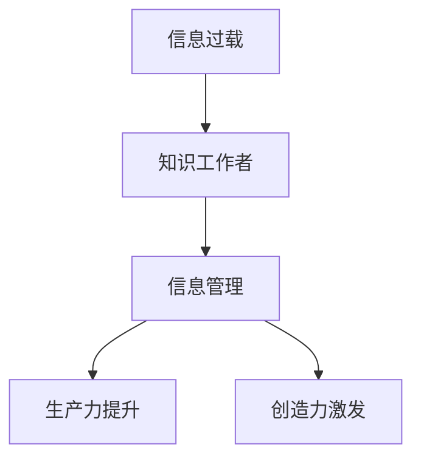

                 

# 信息过载与知识工作者的指南：管理信息以提高生产力和创造力

> 关键词：信息过载,知识工作者,知识管理,生产力提升,信息处理,创造力激发

## 1. 背景介绍

### 1.1 问题由来

随着信息技术的发展，信息过载已成为信息社会的主要问题之一。知识工作者，如软件开发人员、数据科学家、市场分析师等，每天都要面对海量数据的处理与分析。这些数据中不仅包含重要的决策信息，还混杂着无关的噪声和冗余信息，给工作带来巨大的压力。信息过载不仅消耗了知识工作者的精力，还可能影响其认知能力、创新力和决策质量。因此，如何有效管理信息，降低信息过载的影响，提高知识工作者的生产力与创造力，是当前信息技术领域的重要挑战。

### 1.2 问题核心关键点

信息过载的核心在于“信息泛滥与认知资源有限”的矛盾。知识工作者面临的主要问题是：

1. **海量数据处理**：如何从海量数据中筛选出有价值的信息，进行高效处理和分析。
2. **认知负荷过重**：如何减轻因信息过载带来的认知负担，避免认知疲劳。
3. **决策支持不足**：如何在数据中找到关键信息和洞见，辅助决策。
4. **知识获取困难**：如何有效地存储、检索和重用知识，支持持续学习。

### 1.3 问题研究意义

解决信息过载问题，对于提升知识工作者的生产力与创造力具有重要意义：

1. **提升效率**：通过有效的信息管理，知识工作者可以更快地找到所需信息，减少重复性劳动。
2. **减轻压力**：合理的信息管理策略可以减少认知负荷，提高工作效率。
3. **增强决策质量**：高质量的信息管理能提供更准确的数据支持，帮助知识工作者做出更好的决策。
4. **促进创新**：有效的信息管理能激发新的思维火花，支持创新活动。
5. **推动知识共享**：良好的信息管理机制可以促进知识的共享与传播，提升团队整体能力。

## 2. 核心概念与联系

### 2.1 核心概念概述

为更好地理解信息过载问题的管理方法，本节将介绍几个密切相关的核心概念：

- **信息过载(Information Overload)**：指信息量超过个人或系统的处理能力，导致信息利用率下降和决策困难的问题。
- **知识工作者(Knowledge Worker)**：指那些需要大量信息输入，并依赖知识进行决策和创新的职业，如IT专业人士、研究人员等。
- **信息管理(Information Management)**：指通过组织、存储、检索、分析和管理信息，以支持决策和知识共享的过程。
- **生产力提升(Productivity Improvement)**：指通过优化工作流程和信息管理，提升知识工作者完成工作任务的速度和质量。
- **创造力激发(Creativity Enhancement)**：指通过合理的信息管理策略，激发新的想法和创新，推动知识工作者的创造性工作。

这些概念之间的关系可以通过以下Mermaid流程图来展示：



这个流程图展示了信息过载与知识工作者之间的联系，以及信息管理在提升生产力和激发创造力中的关键作用。

## 3. 核心算法原理 & 具体操作步骤

### 3.1 算法原理概述

管理信息以应对信息过载的核心在于“过滤、组织、提取、利用信息”。这一过程可以通过算法自动化实现，从而提高信息处理的效率和准确性。信息管理的算法可以分为以下几类：

- **过滤算法**：从海量数据中筛选出重要信息，如文本挖掘、垃圾邮件过滤等。
- **组织算法**：将信息组织成结构化的形式，便于存储和检索，如数据库、知识图谱等。
- **提取算法**：从信息中提取关键特征和洞见，支持决策，如模式识别、聚类分析等。
- **利用算法**：将提取的信息用于支持知识工作者的工作，如智能推荐、辅助决策等。

### 3.2 算法步骤详解

信息管理的算法步骤通常包括以下几个关键环节：

1. **数据预处理**：对原始数据进行清洗、归一化、格式化等预处理，确保数据质量。
2. **信息筛选**：使用过滤算法从数据中筛选出有价值的信息，如基于关键词、主题等的筛选。
3. **信息组织**：使用组织算法将信息结构化，便于检索和重用，如使用RDF、JSON等格式。
4. **信息提取**：使用提取算法从信息中提取关键特征和洞见，如文本摘要、关键词提取等。
5. **信息利用**：使用利用算法将提取的信息转化为具体的应用，如智能推荐、决策支持等。

### 3.3 算法优缺点

信息管理算法具有以下优点：

- **效率提升**：自动化信息筛选和组织可以显著提高信息处理的效率。
- **准确性提高**：算法可以处理大量数据，减少人工操作的错误。
- **灵活性增强**：算法可以根据需求灵活调整参数，适应不同的信息管理场景。

同时，这些算法也存在一定的局限性：

- **依赖高质量数据**：算法的效果高度依赖于输入数据的质量和量。
- **可能引入偏见**：算法的设计和实现可能引入人类偏见，影响结果的公平性。
- **复杂度较高**：部分算法需要较复杂的计算资源，可能不适用于小规模应用。

### 3.4 算法应用领域

信息管理算法在多个领域具有广泛的应用，例如：

- **医疗健康**：如电子健康记录管理、病历数据分析等。
- **金融服务**：如风险管理、交易数据分析等。
- **电子商务**：如客户行为分析、推荐系统等。
- **教育培训**：如学习内容推荐、教学效果评估等。
- **企业运营**：如市场分析、业务流程优化等。

## 4. 数学模型和公式 & 详细讲解 & 举例说明

### 4.1 数学模型构建

信息管理算法的数学模型通常基于以下几个关键要素：

- **输入数据**：表示为 $D = \{x_1, x_2, ..., x_n\}$，其中 $x_i$ 为第 $i$ 个数据样本。
- **过滤模型**：用于筛选重要信息的模型，如 $f(D)$。
- **组织模型**：将信息组织成结构化形式的模型，如 $g(D)$。
- **提取模型**：从信息中提取关键特征和洞见的模型，如 $h(D)$。
- **利用模型**：将提取的信息转化为具体应用的形式，如 $u(D)$。

### 4.2 公式推导过程

以文本摘要为例，推导信息提取模型的公式。假设我们有一个文本集合 $D = \{d_1, d_2, ..., d_n\}$，每个文本 $d_i = (x_i, y_i)$，其中 $x_i$ 为文本内容，$y_i$ 为对应的摘要。

信息提取模型 $h(D)$ 可以通过以下步骤推导：

1. 文本预处理：对文本进行分词、去除停用词、词性标注等预处理。
2. 特征提取：提取文本的关键特征，如TF-IDF、Word2Vec等。
3. 摘要生成：使用机器学习模型或规则方法，从提取的特征中生成摘要。

常用的机器学习模型包括：

- 文本分类模型：如朴素贝叶斯、支持向量机等。
- 序列模型：如RNN、LSTM等。
- 生成模型：如GAN、VAE等。

### 4.3 案例分析与讲解

以推荐系统为例，说明信息管理算法在实际中的应用。推荐系统通常包括以下几个步骤：

1. **用户画像**：通过用户的历史行为数据，构建用户画像，表示为 $P$。
2. **商品信息**：获取商品的描述、评分等信息，表示为 $I$。
3. **相似性计算**：计算用户画像与商品信息之间的相似性，如余弦相似度。
4. **推荐排序**：根据相似性排序，推荐给用户最可能感兴趣的商品，表示为 $R$。

推荐系统使用的算法包括：

- 协同过滤算法：基于用户行为或商品属性，推荐相似商品。
- 基于内容的推荐算法：通过商品特征匹配用户偏好。
- 混合推荐算法：结合多种算法，综合考虑用户和商品信息。

## 5. 项目实践：代码实例和详细解释说明

### 5.1 开发环境搭建

在进行信息管理项目实践前，我们需要准备好开发环境。以下是使用Python进行PyTorch开发的环境配置流程：

1. 安装Anaconda：从官网下载并安装Anaconda，用于创建独立的Python环境。

2. 创建并激活虚拟环境：
```bash
conda create -n pytorch-env python=3.8 
conda activate pytorch-env
```

3. 安装PyTorch：根据CUDA版本，从官网获取对应的安装命令。例如：
```bash
conda install pytorch torchvision torchaudio cudatoolkit=11.1 -c pytorch -c conda-forge
```

4. 安装TensorFlow：
```bash
pip install tensorflow
```

5. 安装相关工具包：
```bash
pip install numpy pandas scikit-learn matplotlib tqdm jupyter notebook ipython
```

完成上述步骤后，即可在`pytorch-env`环境中开始信息管理项目的开发。

### 5.2 源代码详细实现

下面我们以推荐系统为例，给出使用TensorFlow进行推荐模型训练的PyTorch代码实现。

首先，定义推荐系统所需的数据处理函数：

```python
import pandas as pd
from sklearn.preprocessing import MinMaxScaler

# 读取数据集
train_df = pd.read_csv('train.csv')
test_df = pd.read_csv('test.csv')

# 数据预处理
train_df = train_df.dropna()  # 删除缺失值
train_df['user'] = train_df['user'].astype(str)  # 类型转换
train_df['item'] = train_df['item'].astype(str)  # 类型转换
train_df = train_df.groupby(['user', 'item'], as_index=False).apply(lambda x: MinMaxScaler().fit_transform(x[['rating']]), axis=1)  # 数据标准化
```

然后，定义推荐模型的训练函数：

```python
from tensorflow.keras.layers import Input, Dense, Dropout, Embedding, Concatenate, Flatten, Dense
from tensorflow.keras.models import Model
from tensorflow.keras.optimizers import Adam

# 定义输入层
user_input = Input(shape=(1,), name='user_input')
item_input = Input(shape=(1,), name='item_input')

# 定义嵌入层
user_embedding = Embedding(input_dim=train_df['user'].nunique(), output_dim=128, name='user_embedding')
item_embedding = Embedding(input_dim=train_df['item'].nunique(), output_dim=128, name='item_embedding')

# 定义全连接层
user_vec = Flatten()(user_embedding(user_input))
item_vec = Flatten()(item_embedding(item_input))
concat = Concatenate()([user_vec, item_vec])
dense = Dense(128, activation='relu')(concat)
dense = Dropout(0.2)(dense)
output = Dense(1, activation='sigmoid')(dense)

# 定义模型
model = Model(inputs=[user_input, item_input], outputs=output)
model.compile(optimizer=Adam(learning_rate=0.001), loss='binary_crossentropy', metrics=['accuracy'])

# 训练模型
model.fit([train_df['user'].values, train_df['item'].values], train_df['rating'].values, epochs=10, batch_size=32, validation_split=0.2)
```

最后，启动推荐系统的测试：

```python
# 加载测试集
test_df = pd.read_csv('test.csv')

# 数据预处理
test_df = test_df.dropna()  # 删除缺失值
test_df['user'] = test_df['user'].astype(str)  # 类型转换
test_df['item'] = test_df['item'].astype(str)  # 类型转换
test_df = test_df.groupby(['user', 'item'], as_index=False).apply(lambda x: MinMaxScaler().fit_transform(x[['rating']]), axis=1)  # 数据标准化

# 预测结果
predictions = model.predict([test_df['user'].values, test_df['item'].values])
```

以上代码实现了基本的推荐系统，包含了数据预处理、模型定义和训练。开发者可以根据具体任务的需求，进一步优化模型和算法。

### 5.3 代码解读与分析

让我们再详细解读一下关键代码的实现细节：

**数据预处理**：
- 使用Pandas读取数据集，并进行必要的预处理，如删除缺失值、类型转换、数据标准化等。

**模型定义**：
- 使用Keras定义推荐系统的模型结构，包括输入层、嵌入层、全连接层、输出层等。
- 使用Adam优化器和二元交叉熵损失函数进行模型训练。

**模型测试**：
- 加载测试集，进行必要的数据预处理。
- 使用训练好的模型对测试集进行预测。

## 6. 实际应用场景

### 6.1 智能客服系统

智能客服系统通过信息管理技术，能够有效处理海量客户咨询，提供快速准确的答复。具体实现如下：

1. **数据收集**：收集历史客户咨询记录，提取问题和答案。
2. **信息过滤**：使用文本挖掘技术，过滤掉无用的噪声信息，提取关键问题。
3. **信息组织**：使用知识图谱等技术，将问题与答案组织成结构化形式。
4. **信息利用**：构建问答系统，根据输入问题，从知识图谱中查找最相关的答案。

通过信息管理技术，智能客服系统能够快速响应客户咨询，提供高质量的服务，减轻客服人员的工作压力，提升客户满意度。

### 6.2 金融风险管理

金融风险管理中，信息管理技术可以帮助机构实时监测市场风险。具体实现如下：

1. **数据收集**：收集各类金融数据，包括股票价格、市场指数、经济指标等。
2. **信息筛选**：使用统计分析和机器学习技术，筛选出与风险相关的关键指标。
3. **信息组织**：使用数据库和数据仓库，将信息结构化，便于检索和分析。
4. **信息利用**：构建风险监控系统，实时监测市场变化，及时发出预警。

通过信息管理技术，金融机构能够及时发现市场风险，采取相应的风险控制措施，减少潜在的经济损失。

### 6.3 内容推荐系统

内容推荐系统通过信息管理技术，为用户推荐感兴趣的内容。具体实现如下：

1. **数据收集**：收集用户的行为数据，如浏览记录、评分记录等。
2. **信息筛选**：使用协同过滤和基于内容的推荐算法，筛选出用户感兴趣的内容。
3. **信息组织**：使用元数据管理技术，将内容组织成结构化形式。
4. **信息利用**：构建推荐系统，根据用户兴趣，推荐相关内容。

通过信息管理技术，内容推荐系统能够为用户推荐个性化的内容，提升用户体验，增加平台粘性。

### 6.4 未来应用展望

随着信息管理技术的不断发展，其在多个领域的应用将更加广泛，为社会带来深远的影响。

1. **医疗健康**：通过医疗数据的精细化管理，提升医疗服务的质量和效率。
2. **教育培训**：通过学习数据的深度挖掘，提供个性化的学习内容和推荐。
3. **城市管理**：通过城市数据的综合分析，优化城市资源配置和管理。
4. **环境保护**：通过环境数据的全面监测，推动环境保护政策的制定和实施。

## 7. 工具和资源推荐

### 7.1 学习资源推荐

为了帮助开发者系统掌握信息管理技术的理论基础和实践技巧，这里推荐一些优质的学习资源：

1. 《信息管理与知识工程》书籍：系统介绍信息管理的基本概念和常用技术，适合入门学习。
2. 《深度学习与信息提取》课程：斯坦福大学开设的NLP课程，涵盖文本挖掘、知识图谱等前沿技术。
3. 《Python for Data Analysis》书籍：展示Python在数据管理和分析中的强大功能，适合实用学习。
4. 《Kaggle数据科学大赛》：通过实际数据竞赛，提升数据分析和信息管理能力。
5. 《Python Data Science Handbook》书籍：详细介绍Python在数据科学中的应用，适合深入学习。

通过对这些资源的学习实践，相信你一定能够快速掌握信息管理技术的精髓，并用于解决实际的信息过载问题。

### 7.2 开发工具推荐

高效的开发离不开优秀的工具支持。以下是几款用于信息管理开发的常用工具：

1. Python：灵活且功能强大的编程语言，适合数据处理和信息管理。
2. TensorFlow：谷歌开源的深度学习框架，支持分布式计算，适合大规模数据处理。
3. Apache Hadoop：开源的分布式计算平台，适合大数据量的信息处理。
4. Apache Spark：开源的大数据处理引擎，支持多种数据格式和计算模型。
5. Elasticsearch：开源的搜索引擎，支持结构化和非结构化数据的检索。

合理利用这些工具，可以显著提升信息管理项目的开发效率，加快创新迭代的步伐。

### 7.3 相关论文推荐

信息管理技术的发展源于学界的持续研究。以下是几篇奠基性的相关论文，推荐阅读：

1. 《Information Retrieval: A Survey》：对信息检索技术的全面综述，涵盖经典算法和最新进展。
2. 《Data Mining: Concepts and Techniques》：介绍数据挖掘技术的经典教材，涵盖分类、聚类、关联规则等算法。
3. 《Knowledge Graphs in Information Retrieval》：介绍知识图谱在信息检索中的应用，展示其在提升检索效果方面的潜力。
4. 《Semantic Web Technology》：介绍语义网技术的最新进展，涵盖知识表示、链接分析等方法。
5. 《Collaborative Filtering》：介绍协同过滤算法的经典研究，涵盖矩阵分解、梯度下降等技术。

这些论文代表了大数据管理技术的发展脉络。通过学习这些前沿成果，可以帮助研究者把握学科前进方向，激发更多的创新灵感。

## 8. 总结：未来发展趋势与挑战

### 8.1 总结

本文对信息管理技术在应对信息过载问题中的应用进行了全面系统的介绍。首先阐述了信息过载问题对知识工作者生产力和创造力的影响，明确了信息管理在提升信息利用效率、减轻认知负荷、增强决策质量、促进知识共享等方面的重要意义。其次，从原理到实践，详细讲解了信息管理算法的核心步骤和关键技术，给出了信息管理项目开发的完整代码实例。同时，本文还广泛探讨了信息管理技术在智能客服、金融风险管理、内容推荐等多个行业领域的应用前景，展示了信息管理技术的广泛应用潜力。最后，本文精选了信息管理技术的各类学习资源，力求为读者提供全方位的技术指引。

通过本文的系统梳理，可以看到，信息管理技术在应对信息过载问题中发挥着不可替代的作用。这些技术的不断演进，将显著提升知识工作者的生产力和创造力，推动社会整体的智能化发展。

### 8.2 未来发展趋势

展望未来，信息管理技术将呈现以下几个发展趋势：

1. **数据融合**：通过数据融合技术，整合多种数据源，提升信息管理的效果和准确性。
2. **自动化提升**：自动化信息处理技术将进一步发展，实现更高效的数据清洗、分析和检索。
3. **实时化处理**：实时数据处理技术将得到广泛应用，支持即时信息管理和决策支持。
4. **智能化扩展**：引入人工智能技术，如自然语言处理、知识图谱等，提升信息管理的智能化水平。
5. **跨领域应用**：信息管理技术将在更多领域得到应用，如智慧医疗、智慧城市等，推动行业智能化发展。

以上趋势凸显了信息管理技术的广阔前景。这些方向的探索发展，必将进一步提升信息管理系统的性能和应用范围，为信息时代的智能化发展提供坚实的基础。

### 8.3 面临的挑战

尽管信息管理技术已经取得了一定的进展，但在迈向更加智能化、普适化应用的过程中，它仍面临诸多挑战：

1. **数据质量瓶颈**：高质量的数据是信息管理的前提，如何获取、清洗和处理大规模、复杂的数据，仍然是一大难题。
2. **模型复杂性增加**：信息管理模型的复杂度不断提升，需要更多的计算资源和专业知识。
3. **隐私与安全问题**：信息管理过程中涉及大量敏感数据，如何保障数据隐私和安全，成为重要问题。
4. **用户接受度**：信息管理技术的应用需要用户的积极参与，如何提高用户接受度和使用体验，是关键挑战。
5. **多模态融合**：信息管理需要处理多种数据源，如文本、图像、语音等，如何实现多模态数据的融合和分析，有待深入研究。

这些挑战需要技术界和产业界的共同努力，推动信息管理技术的不断完善和优化。

### 8.4 研究展望

面向未来，信息管理技术需要在以下几个方面寻求新的突破：

1. **融合大数据与人工智能**：结合大数据分析和人工智能技术，提升信息管理的智能化水平。
2. **推动多模态数据融合**：开发多模态数据融合算法，提升信息管理的全面性和准确性。
3. **实现数据隐私保护**：研究数据隐私保护技术，保障数据在信息管理过程中的安全性和隐私性。
4. **优化用户交互体验**：提升信息管理系统的易用性和用户体验，增加用户参与度和满意度。
5. **拓展应用场景**：推动信息管理技术在更多行业和领域的应用，支持社会智能化发展。

这些研究方向的探索，必将引领信息管理技术迈向更高的台阶，为构建智能化的信息管理系统铺平道路。相信随着技术的不断进步，信息管理技术必将在更广泛的场景中发挥作用，推动社会智能化进程。

## 9. 附录：常见问题与解答

**Q1：信息管理技术是否适用于所有数据类型？**

A: 信息管理技术主要适用于结构化和半结构化数据，如文本、图像、音频等。对于非结构化数据，如社交媒体评论、视频内容等，需要使用特定的技术和算法进行处理。

**Q2：如何选择合适的信息管理工具？**

A: 选择信息管理工具需要考虑数据类型、数据量、计算资源、用户需求等因素。例如，对于大规模数据处理，可以选择Hadoop、Spark等分布式计算平台；对于实时数据处理，可以选择Kafka、Flink等流处理工具。

**Q3：信息管理技术在实际应用中是否容易实现？**

A: 信息管理技术需要一定的技术基础和实践经验，但随着开源工具和框架的不断完善，其实现门槛正在逐步降低。通过系统的学习实践，可以快速掌握信息管理技术，应用于实际项目。

**Q4：信息管理技术在处理大量数据时，如何避免过拟合？**

A: 信息管理技术需要通过交叉验证、正则化、降维等方法，避免过拟合。同时，需要合理的模型选择和参数调整，确保模型在测试集上表现稳定。

**Q5：信息管理技术在实际应用中，如何确保数据隐私和安全？**

A: 信息管理技术需要采用数据脱敏、加密、访问控制等技术手段，确保数据隐私和安全。同时，需要建立完善的数据安全管理体系，定期进行安全审计和风险评估。

---

作者：禅与计算机程序设计艺术 / Zen and the Art of Computer Programming

