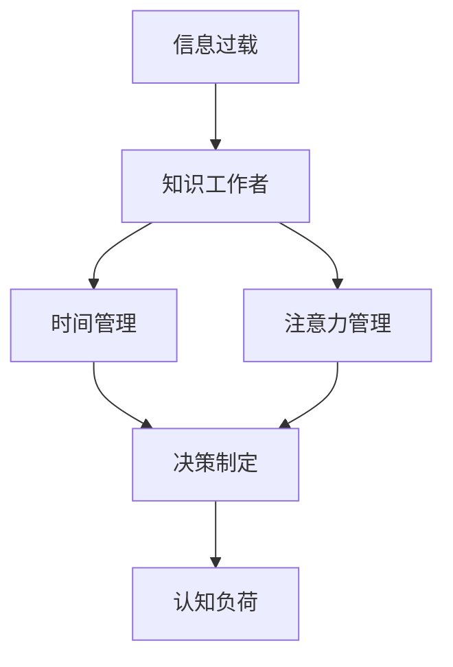

                 

# 信息过载与知识工作者的生存指南：管理信息、时间和注意力

> 关键词：信息过载, 知识工作者, 时间管理, 注意力管理, 决策制定, 认知负荷, 数字工具, 大数据

## 1. 背景介绍

### 1.1 问题由来
在数字化时代，信息与日俱增，我们被各种信息源包围，从社交媒体到新闻推送，再到电子邮件和即时消息。这些信息中，既有我们所需要的知识，也有大量冗余甚至错误的信息，形成了一个庞大的“信息过载”问题。

信息过载给知识工作者带来了极大的挑战，他们需要处理大量的信息和知识，并且在瞬息万变的复杂环境中做出明智的决策。这对他们的认知负荷造成了巨大压力，影响效率和创造力。因此，如何有效地管理信息、时间和注意力，成为一个迫切需要解决的问题。

### 1.2 问题核心关键点
为了应对信息过载，知识工作者需要：
- 掌握信息筛选和过滤的方法
- 优化时间管理策略，提高工作效率
- 提高注意力管理能力，减少分心和拖延
- 利用数字工具，自动化信息处理
- 建立合理的工作习惯，保持工作与生活的平衡

本文将从信息管理、时间管理、注意力管理、数字工具使用等多个方面，提供实用的策略和技巧，帮助知识工作者应对信息过载，提升个人和组织的生产效率。

## 2. 核心概念与联系

### 2.1 核心概念概述

本节将介绍几个核心概念，以帮助理解信息过载与知识工作者生存指南的整体框架：

- **信息过载(Information Overload)**：指个人或组织接收到的信息远远超出其处理能力，导致认知负荷增加，影响决策和效率。
- **知识工作者(Knowledge Worker)**：指那些依赖知识进行工作和决策的人，如研究者、开发者、咨询师等。
- **时间管理(Time Management)**：指通过计划、组织、控制和优化时间的使用，提高工作效率和生产力。
- **注意力管理(Attention Management)**：指通过减少干扰、控制分心，提高集中注意力的能力。
- **决策制定(Decision Making)**：指在信息过载的情况下，如何高效、准确地做出决策。
- **认知负荷(Cognitive Load)**：指个人在处理信息时，需要投入的认知资源量。

这些概念之间具有紧密的联系，共同构成了知识工作者应对信息过载的策略框架。

### 2.2 核心概念原理和架构的 Mermaid 流程图



该流程图展示了信息过载、知识工作者、时间管理、注意力管理、决策制定和认知负荷之间的联系。

## 3. 核心算法原理 & 具体操作步骤

### 3.1 算法原理概述

本节将深入探讨信息过载问题的核心算法原理和具体操作步骤。

信息过载的本质是信息数量和质量与个人处理能力之间的不匹配。为了缓解这一问题，可以从信息筛选、信息过滤和信息整合等多个方面入手。

### 3.2 算法步骤详解

#### 步骤 1: 信息筛选

信息筛选是指从大量信息中挑选出最相关和最有价值的部分。这一步骤涉及以下操作：

1. **确定需求**：明确信息需求和目标，避免无关信息的干扰。
2. **识别来源**：选择可靠和权威的信息源。
3. **初步筛选**：使用关键词和摘要快速浏览，筛选出可能相关的内容。
4. **细读评估**：对初步筛选的内容进行细读，评估其价值和准确性。

#### 步骤 2: 信息过滤

信息过滤是指利用算法或工具，自动将信息分为重要和次要的部分。这一步骤涉及以下操作：

1. **数据清洗**：去除重复、错误和无关信息。
2. **优先级排序**：根据信息的重要性和紧急性进行排序。
3. **自动化工具**：使用信息过滤软件或工具，如RSS订阅器、邮件过滤器等。

#### 步骤 3: 信息整合

信息整合是指将分散的信息整合到有结构的知识库中，便于检索和应用。这一步骤涉及以下操作：

1. **知识库建立**：创建一个结构化的知识库，如笔记应用或数据库。
2. **信息归档**：将信息分类归档到相应的主题或项目下。
3. **定期更新**：定期回顾和更新知识库，保持信息的最新和准确。

### 3.3 算法优缺点

#### 优点：

1. **提高效率**：通过信息筛选和过滤，减少无用信息的干扰，提高决策和工作的效率。
2. **节省时间**：自动化工具可以减轻信息处理的工作量，节省时间和精力。
3. **提高质量**：筛选和过滤后的信息更相关和有用，提高决策的质量。

#### 缺点：

1. **技术依赖**：需要依赖于特定的信息处理工具和技术。
2. **初期成本**：初期设置和配置可能需要一定的时间和成本。
3. **个人差异**：不同个人的信息筛选和过滤需求可能不同，需要个性化调整。

### 3.4 算法应用领域

信息筛选、过滤和整合的技术在多个领域都有广泛应用：

- **研究与开发**：科研人员和开发者可以利用这些技术快速获取和整合所需信息，提高研发效率。
- **市场营销**：市场营销人员可以筛选和分析市场信息，制定更有效的策略。
- **教育与培训**：教育工作者可以筛选和整合教学资源，提升教学效果。
- **个人与职业发展**：个人可以通过筛选和整合信息，规划职业路径和提升技能。

## 4. 数学模型和公式 & 详细讲解 & 举例说明

### 4.1 数学模型构建

假设知识工作者的日工作量为 $W$，信息过载量为 $I$，时间管理效率为 $T$，注意力管理能力为 $A$。则知识工作者的日有效工作量 $E$ 可以表示为：

$$ E = W \times T \times A $$

### 4.2 公式推导过程

为了最大化日有效工作量 $E$，需要最大化时间管理效率 $T$ 和注意力管理能力 $A$，同时最小化信息过载量 $I$。

### 4.3 案例分析与讲解

#### 案例一：研究人员的时间管理

一位研究人员需要处理大量的科研论文和实验数据。他利用时间管理工具，将工作分为几个固定的时间段，如上午9点到12点进行文献阅读，下午2点到5点进行实验设计。通过设定任务优先级，他能够集中精力完成重要工作，提高了工作效率。

#### 案例二：项目经理的注意力管理

项目经理每天收到大量的电子邮件和即时消息。他使用注意力管理工具，设置固定的检查和回复时间，如每天早上9点到10点回复邮件，下午3点到4点处理即时消息。通过减少分心，他能够更集中地关注项目进展，提高了项目管理能力。

## 5. 项目实践：代码实例和详细解释说明

### 5.1 开发环境搭建

要实现信息筛选、过滤和整合，需要搭建一个高效的工作环境。以下是开发环境搭建的步骤：

1. **安装必要的软件**：
   - 安装笔记应用（如Evernote、OneNote等）
   - 安装信息过滤工具（如Spark、Inbox by Gmail等）
   - 安装项目管理工具（如Trello、Asana等）

2. **配置工作环境**：
   - 设定优先级和任务优先级
   - 设定固定的工作时间和休息时间
   - 配置自动化工具和快捷键

### 5.2 源代码详细实现

#### 使用Python实现信息筛选和过滤

```python
import pandas as pd
from transformers import AutoTokenizer, AutoModelForSequenceClassification

# 加载预训练模型和分词器
tokenizer = AutoTokenizer.from_pretrained('bert-base-uncased')
model = AutoModelForSequenceClassification.from_pretrained('bert-base-uncased', num_labels=2)

# 加载数据
data = pd.read_csv('data.csv')

# 预处理数据
data['text'] = data['text'].apply(tokenizer.encode_plus)

# 预测数据
data['score'] = model.predict(data['text'])

# 筛选出高评分的信息
filtered_data = data[data['score'] > 0.5]

# 保存筛选结果
filtered_data.to_csv('filtered_data.csv', index=False)
```

#### 使用Python实现信息整合

```python
import pyknitting as kn
from google.colab import files

# 加载笔记应用中的笔记数据
notes = kn.load_notes()

# 将新信息整合到笔记中
new_notes = {'title': '新信息', 'content': '这是新信息的内容'}

# 更新笔记
notes.update(new_notes)

# 保存更新后的笔记
kn.save_notes(notes)

# 将笔记导出到本地文件系统
files.download('notes.ipynb', show_widget=False)
```

### 5.3 代码解读与分析

上述代码展示了如何使用Python和相关的第三方库，实现信息筛选和整合的自动化过程。

- **信息筛选**：通过加载数据、预处理数据和预测数据，筛选出高评分的信息，实现信息过滤。
- **信息整合**：将新信息整合到笔记应用中，实现信息的归档和更新。

## 6. 实际应用场景

### 6.1 智能研究助手

智能研究助手可以通过筛选和过滤信息，帮助研究人员快速获取相关论文和实验数据，提高科研效率。智能助手可以利用自然语言处理技术，自动提取关键词和摘要，生成文献综述。

### 6.2 个人知识库

个人知识库可以整合各类信息，如笔记、电子邮件、社交媒体内容等，形成结构化的知识库，便于检索和应用。知识库可以使用笔记应用或项目管理工具，实现信息的分类和归档。

### 6.3 企业知识管理

企业可以利用信息筛选和整合技术，建立企业知识库，存储和共享各类文档、报告、研究结果等。知识库可以集成到企业的内部网络系统中，方便员工检索和应用。

## 7. 工具和资源推荐

### 7.1 学习资源推荐

为了帮助知识工作者掌握信息管理、时间管理和注意力管理的技巧，以下是一些推荐的学习资源：

1. **《深度工作》**：作者Cal Newport，详细介绍了如何通过深度工作提升生产效率。
2. **《番茄工作法图解》**：作者弗朗西斯科·西里洛，介绍了一种有效的番茄工作法，帮助管理时间和注意力。
3. **Coursera的《学习与创新》课程**：涵盖时间管理和注意力管理的核心概念和技巧。
4. **Udemy的《信息管理与决策制定》课程**：介绍了信息筛选和整合的实用技巧。

### 7.2 开发工具推荐

以下是一些推荐的信息管理、时间管理和注意力管理的开发工具：

1. **Evernote**：笔记应用，支持多平台同步和信息整合。
2. **Spark**：信息过滤工具，支持邮件、新闻和其他信息源的筛选和过滤。
3. **Trello**：项目管理工具，支持任务管理、进度跟踪和协作。
4. **RescueTime**：时间跟踪工具，帮助分析和管理时间使用情况。
5. **Focus@Will**：背景音乐应用，帮助集中注意力和提高工作效率。

### 7.3 相关论文推荐

为了深入理解信息过载与知识工作者的相关研究，以下是一些推荐的相关论文：

1. **“Information Overload: The Information Worker’s Experience of Information Excess, Decision Superload, and Role Overload”**：作者Marie Gruenert，探讨了信息过载对知识工作者的影响。
2. **“The Psychology of Information Retrieval: From Input to Output”**：作者Tomasulo等，详细介绍了信息检索和整合的心理学原理。
3. **“Decision Making Under Information Overload: Considerations for Decision Support Systems”**：作者Espina-Rodriguez等，探讨了信息过载对决策制定的影响。

## 8. 总结：未来发展趋势与挑战

### 8.1 研究成果总结

本文探讨了信息过载对知识工作者的影响，提出了一系列信息管理、时间管理和注意力管理的策略。这些策略不仅适用于个人，也适用于企业和组织。通过优化信息筛选、过滤和整合，提高时间管理和注意力管理能力，知识工作者可以在信息过载的环境中更高效地工作。

### 8.2 未来发展趋势

未来，随着技术的进一步发展，信息管理、时间管理和注意力管理的工具将更加智能化和自动化。智能助手将能够更好地理解和满足个人需求，智能推荐系统将提供个性化的信息筛选和整合建议。

### 8.3 面临的挑战

尽管信息管理、时间管理和注意力管理的工具和策略不断发展，但仍面临以下挑战：

1. **个性化需求**：不同的人对信息、时间和注意力的需求不同，需要更加个性化的解决方案。
2. **技术壁垒**：不同工具之间的互联互通和集成需要解决技术壁垒。
3. **隐私和安全**：信息管理工具需要保护用户隐私，防止数据泄露。

### 8.4 研究展望

未来的研究将重点关注以下几个方面：

1. **AI驱动的智能推荐**：利用机器学习和大数据技术，提供更精准的信息筛选和整合建议。
2. **情感分析与心理支持**：结合情感分析和心理辅导，帮助知识工作者更好地管理情绪和压力。
3. **跨平台集成**：实现不同信息管理工具之间的无缝集成，提高工作效率。

总之，信息过载和知识工作者的挑战是多方面的，需要通过技术、工具和策略的综合应用，不断优化和提升信息管理、时间管理和注意力管理能力，以应对未来的信息爆炸和认知负荷。

## 9. 附录：常见问题与解答

**Q1：信息过载的问题主要有哪些？**

A: 信息过载主要表现为以下几个方面：
1. **信息量大**：每天接收的信息量远超处理能力。
2. **信息质量差**：信息中大量冗余和错误信息。
3. **信息分散**：信息分散在不同的平台和格式中，难以整合。

**Q2：如何有效地筛选信息？**

A: 信息筛选的方法包括：
1. **确定需求**：明确信息需求和目标。
2. **识别来源**：选择可靠和权威的信息源。
3. **关键词检索**：使用关键词和摘要快速浏览。
4. **细读评估**：对初步筛选的内容进行细读和评估。

**Q3：如何优化时间管理？**

A: 时间管理的方法包括：
1. **任务优先级**：设定任务优先级，集中精力完成重要工作。
2. **时间块分配**：将工作时间分成若干固定时间段，如番茄工作法。
3. **时间跟踪**：使用工具记录和分析时间使用情况，调整策略。

**Q4：如何提高注意力管理能力？**

A: 注意力管理的方法包括：
1. **减少干扰**：设定固定的检查和回复时间，避免分心。
2. **集中注意力**：使用背景音乐或冥想等方法，提高专注力。
3. **任务分解**：将大任务分解成小任务，逐步完成。

作者：禅与计算机程序设计艺术 / Zen and the Art of Computer Programming

