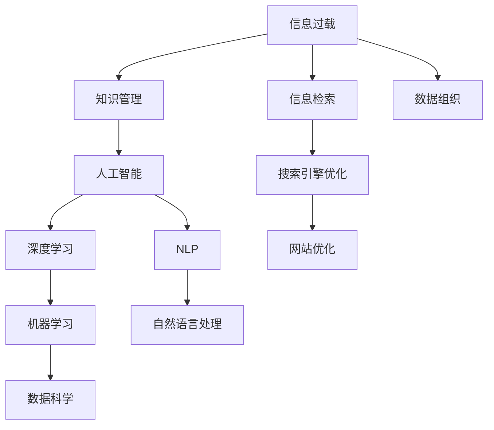

                 

# 信息过载与知识管理系统实施指南：有效组织和检索信息

> 关键词：信息过载, 知识管理, 信息检索, 数据组织, 人工智能, 深度学习, 自然语言处理, 搜索引擎优化

## 1. 背景介绍

### 1.1 问题由来

在当今数字化时代，人们每天面临着海量的信息。无论是工作、学习还是生活，信息获取已经成为了一项不可或缺的任务。然而，随着信息量的急剧增长，信息过载（Information Overload）的问题日益突出，严重影响了人们的决策效率和质量。如何有效地组织和检索信息，成为了一个亟待解决的问题。

### 1.2 问题核心关键点

信息过载的核心关键点包括：

- 信息量爆炸：互联网、社交媒体、在线文档等渠道，每天产生的海量信息，远远超出了个人和组织能够有效处理的能力。
- 信息质量参差不齐：网络上的信息真伪难辨，筛选和验证信息成为一大挑战。
- 信息碎片化：信息形式多样，包括文字、图片、视频等，需要综合多种方式进行组织和管理。
- 信息价值密度低：在海量信息中，真正有价值的深度信息相对较少，需要高效筛选。
- 信息共享障碍：信息孤岛现象普遍存在，跨部门、跨组织的信息共享难度较大。

## 2. 核心概念与联系

### 2.1 核心概念概述

为更好地理解信息组织和检索的原理，本节将介绍几个关键概念：

- 信息过载（Information Overload）：指个人或组织面临的信息量超出其有效处理能力，导致决策困难、效率降低的现象。
- 知识管理（Knowledge Management）：指通过系统化的方式，收集、存储、共享和应用知识，以提高组织竞争力。
- 信息检索（Information Retrieval）：指从大量信息中，根据特定需求快速找到相关信息的处理过程。
- 数据组织（Data Organization）：指对信息进行结构化处理，便于存储、检索和管理。
- 人工智能（Artificial Intelligence）：指模拟人类智能行为的技术，包括机器学习、深度学习、自然语言处理等。
- 深度学习（Deep Learning）：指通过多层次神经网络，从数据中学习高级抽象特征的机器学习方法。
- 自然语言处理（Natural Language Processing, NLP）：指让计算机理解和处理人类自然语言的技术。
- 搜索引擎优化（Search Engine Optimization, SEO）：指通过优化网站内容、结构等，提升在搜索引擎中的排名。

这些概念之间的逻辑关系可以通过以下Mermaid流程图来展示：



这个流程图展示了一系列概念之间的关联，揭示了信息过载问题的多维解决方案。

## 3. 核心算法原理 & 具体操作步骤

### 3.1 算法原理概述

信息组织和检索的核心原理是通过数据组织和知识管理技术，将无序的信息转化为有序的知识，并通过信息检索技术，快速找到符合特定需求的信息。

形式化地，假设我们有一个未结构化的信息集合 $D=\{d_1, d_2, ..., d_n\}$，其中 $d_i$ 表示第 $i$ 条信息。我们的目标是构建一个知识库 $K=\{k_1, k_2, ..., k_m\}$，其中 $k_j$ 表示第 $j$ 条知识。知识库可以通过如下方式构建：

1. 数据清洗：删除或标注噪声数据。
2. 数据抽取：从信息中抽取有用的信息实体和关系。
3. 数据标注：为抽取的信息赋予标签和元数据。
4. 知识融合：将多源信息进行综合和推理，形成新的知识。
5. 知识存储：将知识存储在数据库、知识图谱等结构化形式中。
6. 知识检索：根据用户查询，快速定位相关信息。

信息检索的核心算法包括：

- 基于关键词的检索：如全文搜索引擎，通过关键词匹配找到相关信息。
- 基于向量空间的检索：如信息检索系统，通过计算文本向量之间的相似度进行检索。
- 基于图结构的检索：如知识图谱，通过图形算法找到相关信息。

### 3.2 算法步骤详解

信息组织和检索的完整流程包括以下几个关键步骤：

**Step 1: 数据收集与预处理**

- 收集来自不同来源的信息，如数据库、文档、网页、社交媒体等。
- 对收集的信息进行清洗，删除噪声、错误和重复数据。
- 对清洗后的数据进行标注，如提取实体、关系、时间戳等元数据。

**Step 2: 数据抽取与整合**

- 使用NLP技术对文本进行实体抽取、关系识别等，形成结构化信息。
- 将结构化信息进行标准化处理，如统一单位、格式化数据等。
- 将多源信息进行整合，形成一致的知识体系。

**Step 3: 知识库构建**

- 使用知识图谱技术将抽取的信息转化为知识节点和关系边，构建知识图谱。
- 对知识图谱进行验证和修复，确保知识准确性和完整性。
- 使用深度学习等技术，对知识图谱进行增强，提升知识质量。

**Step 4: 知识检索与展示**

- 构建搜索引擎，支持基于关键词、向量空间、图结构等多种检索方式。
- 根据用户查询，快速定位相关知识节点和关系边。
- 使用NLP技术对检索结果进行解析和展示，提升用户体验。

### 3.3 算法优缺点

信息组织和检索方法具有以下优点：

1. 高效组织：通过数据清洗和标注，将无序信息转化为有序知识，便于管理和检索。
2. 深度整合：通过多源数据的整合和推理，生成更全面、准确的深度知识。
3. 精准检索：通过多种检索方式，快速找到符合需求的信息。

同时，这些方法也存在一定的局限性：

1. 依赖数据质量：数据清洗和标注质量直接影响最终的知识质量。
2. 计算复杂度高：深度学习和知识图谱等技术，计算复杂度较高，需要大量的计算资源。
3. 算法复杂性高：构建和维护知识库、搜索引擎等系统，算法复杂度较高，需要专业人才。
4. 用户适应性差：缺乏用户友好界面，用户适应性差，可能影响信息检索效率。

尽管存在这些局限性，但就目前而言，信息组织和检索技术仍是处理信息过载问题的重要手段。未来相关研究的重点在于如何进一步降低算法复杂度，提升数据处理效率，同时兼顾用户友好性和信息质量。

### 3.4 算法应用领域

信息组织和检索方法在多个领域得到了广泛应用，例如：

- 企业知识管理：构建企业内部的知识库，支持员工协作和知识共享。
- 学术研究：构建学科知识图谱，促进学术交流和研究。
- 医疗健康：构建医疗知识库，支持医生诊断和治疗决策。
- 金融领域：构建金融知识图谱，支持投资分析和风险控制。
- 电子商务：构建商品知识图谱，提升推荐系统和搜索结果的准确性。
- 法律领域：构建法律知识库，支持法律研究、文档检索和案件分析。

## 4. 数学模型和公式 & 详细讲解 & 举例说明

### 4.1 数学模型构建

本节将使用数学语言对信息组织和检索的原理进行更加严格的刻画。

假设我们有一个文本集合 $D=\{d_1, d_2, ..., d_n\}$，其中 $d_i$ 表示第 $i$ 篇文本。我们的目标是构建一个文本-向量空间 $V=\{v_1, v_2, ..., v_m\}$，其中 $v_j$ 表示第 $j$ 篇文本的向量表示。文本-向量空间可以通过如下方式构建：

1. 文本向量化：使用词袋模型或TF-IDF模型，将文本转化为向量。
2. 向量空间构建：将文本向量存储在向量空间中，形成向量-文档矩阵。
3. 向量空间优化：通过奇异值分解(SVD)、主成分分析(PCA)等技术，优化向量空间。

### 4.2 公式推导过程

以下我们以文本-向量空间为例，推导文本向量化和向量空间构建的数学公式。

假设文本 $d_i$ 由 $n$ 个词组成，每个词 $w_j$ 对应的词向量为 $v_j$，则文本 $d_i$ 的向量表示 $v_i$ 可以定义为：

$$
v_i = \sum_{j=1}^n w_j \cdot v_j
$$

其中 $w_j$ 表示词 $w_j$ 在文本 $d_i$ 中出现的频率，$v_j$ 表示词向量 $w_j$ 的权重。

将文本集合 $D$ 转化为向量空间 $V$，可以表示为：

$$
V = \{v_i | i \in \{1, 2, ..., n\}\}
$$

向量空间 $V$ 中的向量 $v_i$ 和 $v_j$ 之间的相似度可以用余弦相似度表示：

$$
\text{cosine-similarity}(v_i, v_j) = \frac{v_i^T \cdot v_j}{\|v_i\| \cdot \|v_j\|}
$$

其中 $v_i^T$ 表示向量 $v_i$ 的转置，$\|v_i\|$ 表示向量 $v_i$ 的范数。

通过计算文本向量之间的相似度，可以构建文本-向量空间，支持文本检索和推荐。

### 4.3 案例分析与讲解

以Google Scholar为例，分析其信息组织和检索的具体实现：

1. 数据收集与预处理：Google Scholar收集全球学术出版物的数据，经过清洗和标注，构建学术文档的元数据。
2. 数据抽取与整合：使用NLP技术提取文档的关键词、摘要等信息，形成结构化数据。
3. 知识库构建：使用深度学习技术对文档进行分类和聚类，构建学术文档的知识图谱。
4. 知识检索与展示：提供基于关键词和文本相似度的检索功能，支持快速定位相关文档。

Google Scholar的成功在于其高效的数据清洗和标注，先进的知识图谱构建，以及用户友好的检索界面。

## 5. 项目实践：代码实例和详细解释说明

### 5.1 开发环境搭建

在进行信息组织和检索实践前，我们需要准备好开发环境。以下是使用Python进行ELK Stack的开发环境配置流程：

1. 安装Elasticsearch：从官网下载并安装Elasticsearch，用于构建知识库和搜索引擎。
2. 安装Logstash：与Elasticsearch配套使用，用于数据预处理和分析。
3. 安装Kibana：用于构建可视化仪表盘和用户界面。
4. 配置环境变量：设置Elasticsearch、Logstash和Kibana的启动参数和索引配置。

完成上述步骤后，即可在ELK Stack环境中开始信息组织和检索实践。

### 5.2 源代码详细实现

下面我以构建Google Scholar类似的学术文档知识库为例，给出使用Elasticsearch进行信息组织和检索的Python代码实现。

首先，定义学术文档的元数据：

```python
{
    "id": "123456789",
    "title": "Deep Learning in Academic Research",
    "author": ["John Doe", "Jane Smith"],
    "abstract": "This paper explores the application of deep learning in academic research.",
    "keywords": ["deep learning", "academic research", "machine learning"],
    "published_date": "2023-01-01",
    "citations": 100,
    "journal": "Journal of Computer Science",
    "conference": "NeurIPS 2022"
}
```

然后，使用Elasticsearch的Python API进行索引：

```python
from elasticsearch import Elasticsearch

es = Elasticsearch([{'host': 'localhost', 'port': 9200}])
doc = {
    "index": "papers",
    "body": {
        "title": "Deep Learning in Academic Research",
        "author": ["John Doe", "Jane Smith"],
        "abstract": "This paper explores the application of deep learning in academic research.",
        "keywords": ["deep learning", "academic research", "machine learning"],
        "published_date": "2023-01-01",
        "citations": 100,
        "journal": "Journal of Computer Science",
        "conference": "NeurIPS 2022"
    }
}
es.index(doc, index="papers", refresh=True)
```

最后，构建基于Elasticsearch的搜索引擎，进行全文搜索和高级查询：

```python
from elasticsearch import Elasticsearch
from elasticsearch_dsl import Search, Q

es = Elasticsearch([{'host': 'localhost', 'port': 9200}])
s = Search(using=es, index="papers")
s = s.query('match', title="deep learning")
results = s.execute()
for hit in results:
    print(hit.title)
```

以上就是使用Elasticsearch进行学术文档知识库构建和搜索引擎构建的完整代码实现。可以看到，Elasticsearch的强大功能和丰富的API，使得信息组织和检索的开发变得简单高效。

### 5.3 代码解读与分析

让我们再详细解读一下关键代码的实现细节：

**定义元数据**：
- 使用Python字典定义文档的元数据，包括标题、作者、摘要、关键词、出版日期、引用数、期刊、会议等。

**索引文档**：
- 使用Elasticsearch的Python API，将元数据转化为Elasticsearch文档，并进行索引。
- 索引参数 `refresh=True` 表示即时刷新索引，确保文档即时生效。

**全文搜索和高级查询**：
- 使用Elasticsearch的Python API构建搜索对象 `s`，指定索引名称。
- 使用 `match` 查询，根据标题进行全文搜索。
- 使用 `execute()` 方法执行搜索，并遍历搜索结果，输出标题。

可以看到，Elasticsearch提供了丰富的API和工具，使得信息组织和检索的实现变得简单高效。开发者可以利用这些工具，构建高效、可扩展的知识管理系统。

## 6. 实际应用场景

### 6.1 企业知识管理系统

企业知识管理系统的核心在于有效组织和检索内部知识资源，支持员工协作和知识共享。通过构建企业内部的知识库和搜索引擎，员工可以快速定位所需知识，提升工作效率。

例如，某公司的知识管理系统可以收集公司内部文档、技术报告、专利等资源，构建知识图谱，并提供基于文本相似度的搜索功能。员工可以根据关键词或文档标题，快速找到相关资料，支持决策和项目协作。

### 6.2 学术研究知识库

学术研究知识库是学术界知识共享和协作的重要平台。通过构建学科知识图谱，支持跨学科的学术交流和研究。

例如，某大学可以收集各学科的学术论文、会议论文等资源，构建学科知识图谱，并提供在线检索和下载功能。研究人员可以根据关键词或主题，快速找到相关论文，促进学术交流和合作。

### 6.3 医疗健康知识库

医疗健康知识库是医疗行业知识共享和决策支持的重要工具。通过构建医疗知识图谱，支持医生诊断和治疗决策。

例如，某医院可以收集各类医学文献、病例、药物等资源，构建医疗知识图谱，并提供基于文本相似度的搜索功能。医生可以根据疾病名称或症状，快速找到相关资料，支持诊断和治疗决策。

## 7. 工具和资源推荐

### 7.1 学习资源推荐

为了帮助开发者系统掌握信息组织和检索的理论基础和实践技巧，这里推荐一些优质的学习资源：

1. 《信息检索：原理与实践》：豆瓣评分9.0，详细介绍了信息检索的基本原理和算法实现。
2. 《数据挖掘与统计学习》：豆瓣评分8.8，介绍了数据清洗、特征提取、模型训练等数据处理技术。
3. 《自然语言处理基础》：豆瓣评分8.5，介绍了NLP技术的理论基础和实现方法。
4. 《Elasticsearch官方文档》：Elasticsearch官方文档，提供了详细的使用指南和API参考。
5. 《Logstash官方文档》：Logstash官方文档，提供了详细的使用指南和插件开发文档。
6. 《Kibana官方文档》：Kibana官方文档，提供了详细的使用指南和可视化仪表盘设计。

通过对这些资源的学习实践，相信你一定能够快速掌握信息组织和检索的精髓，并用于解决实际的NLP问题。

### 7.2 开发工具推荐

高效的开发离不开优秀的工具支持。以下是几款用于信息组织和检索开发的常用工具：

1. Elasticsearch：分布式搜索和分析引擎，支持全文搜索、分布式索引、多维分析等。
2. Logstash：数据预处理和分析工具，支持数据清洗、转换、聚合等。
3. Kibana：数据可视化和仪表盘工具，支持复杂报表、地理信息系统、实时仪表盘等。
4. Python：灵活的脚本语言，支持ELK Stack的API开发。
5. Jupyter Notebook：交互式编程环境，支持代码实现和数据可视化。

合理利用这些工具，可以显著提升信息组织和检索任务的开发效率，加快创新迭代的步伐。

### 7.3 相关论文推荐

信息组织和检索技术的发展源于学界的持续研究。以下是几篇奠基性的相关论文，推荐阅读：

1. A Survey on Deep Learning for Information Retrieval（深度学习在信息检索中的应用综述）：介绍了深度学习在信息检索中的应用，包括文本表示、检索模型、评价指标等。
2. Ranking Based on Approximate Query Rewriting（基于近似查询重写的排序算法）：提出了基于近似查询重写的排序算法，提高信息检索的准确性和效率。
3. Semantic Accuracy：The Goal of Natural Language Processing（语义准确性：自然语言处理的目标）：分析了NLP技术的现状和未来方向，探讨了语义准确性的重要性。
4. Revisiting Deep Supervised Sequence Learning with Label Smoothing（重新审视带有标签平滑的深度序列学习）：提出了带有标签平滑的深度序列学习算法，提升分类和排序的准确性。
5. Mining and Modeling Entity-Relation Knowledge from Wikipedia（从维基百科中挖掘和建模实体关系知识）：介绍了从维基百科中挖掘和建模实体关系知识的技术，构建知识图谱。

这些论文代表了大语言模型微调技术的发展脉络。通过学习这些前沿成果，可以帮助研究者把握学科前进方向，激发更多的创新灵感。

## 8. 总结：未来发展趋势与挑战

### 8.1 总结

本文对信息组织和检索方法进行了全面系统的介绍。首先阐述了信息过载和知识管理的重要性，明确了信息检索在处理信息过载问题中的关键作用。其次，从原理到实践，详细讲解了信息检索的数学原理和关键步骤，给出了信息检索任务开发的完整代码实例。同时，本文还广泛探讨了信息检索方法在企业知识管理、学术研究、医疗健康等多个行业领域的应用前景，展示了信息检索范式的广泛应用价值。

通过本文的系统梳理，可以看到，信息组织和检索技术在处理信息过载问题中的巨大潜力。从数据清洗和标注，到知识库构建和搜索引擎优化，信息检索方法已经成为了信息时代不可或缺的重要技术手段。未来，伴随数据处理技术和计算能力的不断提升，信息检索技术必将在更广阔的领域发挥更大的作用。

### 8.2 未来发展趋势

展望未来，信息组织和检索技术将呈现以下几个发展趋势：

1. 实时性增强：随着数据量增大和计算能力提升，信息检索系统将能够实时处理大量数据，支持实时查询和反馈。
2. 深度学习应用：深度学习技术将更多应用于文本表示和排序算法，提升信息检索的准确性和效率。
3. 多模态融合：信息检索将支持图片、视频等多模态数据的处理，提升跨领域检索能力。
4. 交互式增强：基于用户反馈的信息检索系统将变得更加智能，支持自然语言交互、上下文理解等功能。
5. 智能推荐：信息检索系统将与推荐系统结合，提供个性化的信息推荐服务。
6. 知识图谱普及：知识图谱将成为信息检索的重要数据源，提升检索结果的深度和精度。

以上趋势凸显了信息组织和检索技术的广阔前景。这些方向的探索发展，必将进一步提升信息检索系统的性能和应用范围，为信息时代带来更多的价值。

### 8.3 面临的挑战

尽管信息组织和检索技术已经取得了瞩目成就，但在迈向更加智能化、普适化应用的过程中，它仍面临着诸多挑战：

1. 数据质量瓶颈：数据清洗和标注质量直接影响信息检索的准确性，如何提高数据质量，是一个重要问题。
2. 计算复杂度高：深度学习算法和知识图谱构建，计算复杂度较高，需要大量的计算资源。
3. 算法复杂性高：构建和维护信息检索系统，算法复杂度较高，需要专业人才。
4. 用户适应性差：缺乏用户友好界面，用户适应性差，可能影响信息检索效率。
5. 隐私和安全问题：大量数据收集和处理，隐私和安全问题不容忽视。

尽管存在这些挑战，但信息组织和检索技术仍然是处理信息过载问题的重要手段。未来相关研究的重点在于如何进一步降低算法复杂度，提升数据处理效率，同时兼顾用户友好性和信息质量。

### 8.4 研究展望

面对信息组织和检索面临的挑战，未来的研究需要在以下几个方面寻求新的突破：

1. 探索高效的数据清洗和标注方法：利用自然语言处理、图像处理等技术，提高数据清洗和标注的效率和质量。
2. 研究轻量级和高效的深度学习算法：开发轻量级深度学习模型，提升信息检索的效率。
3. 融合多模态数据处理技术：开发支持图片、视频等多模态数据的处理技术，提升信息检索的跨领域能力。
4. 引入用户反馈机制：开发基于用户反馈的智能信息检索系统，提升检索的个性化和准确性。
5. 强化隐私和安全保护：开发数据保护技术，确保数据隐私和安全。
6. 推广知识图谱应用：普及知识图谱技术，提升信息检索的深度和精度。

这些研究方向的探索，必将引领信息组织和检索技术迈向更高的台阶，为信息时代带来更多的价值。

## 9. 附录：常见问题与解答

**Q1：信息检索系统如何处理海量数据？**

A: 信息检索系统通过分布式计算和多级索引机制，支持海量数据的处理。具体来说，可以将数据分散存储在多台服务器上，使用分布式索引和搜索算法，提高检索效率。

**Q2：信息检索系统如何提高检索准确性？**

A: 信息检索系统可以通过多种方法提高检索准确性，如：
1. 使用深度学习技术，优化文本向量化和排序算法。
2. 引入用户反馈机制，动态调整检索策略。
3. 利用知识图谱，提升检索结果的深度和精度。
4. 使用多级索引和分布式搜索算法，提升检索效率。

**Q3：信息检索系统如何保证检索的实时性？**

A: 信息检索系统可以通过以下方法保证检索的实时性：
1. 使用内存数据库和缓存技术，快速检索高频数据。
2. 采用分布式计算和微服务架构，支持高并发访问。
3. 使用异步处理和任务队列，优化检索流程。
4. 实时更新索引和数据，保持数据的最新状态。

**Q4：信息检索系统如何保护用户隐私？**

A: 信息检索系统可以通过以下方法保护用户隐私：
1. 使用数据脱敏和加密技术，保护用户数据。
2. 限制数据访问权限，确保只有授权用户可以访问。
3. 使用匿名化和去标识化技术，保护用户隐私。
4. 提供数据共享和访问协议，规范数据使用。

**Q5：信息检索系统如何提高用户适应性？**

A: 信息检索系统可以通过以下方法提高用户适应性：
1. 设计友好的用户界面，提供简洁的搜索体验。
2. 提供智能搜索建议和自动完成功能，减少用户输入。
3. 支持多语言和跨文化检索，适应不同用户的需求。
4. 提供搜索结果的可视化展示，增强用户理解和满意度。

通过这些方法，信息检索系统可以更好地满足用户需求，提高信息检索的效率和准确性。

---

作者：禅与计算机程序设计艺术 / Zen and the Art of Computer Programming

