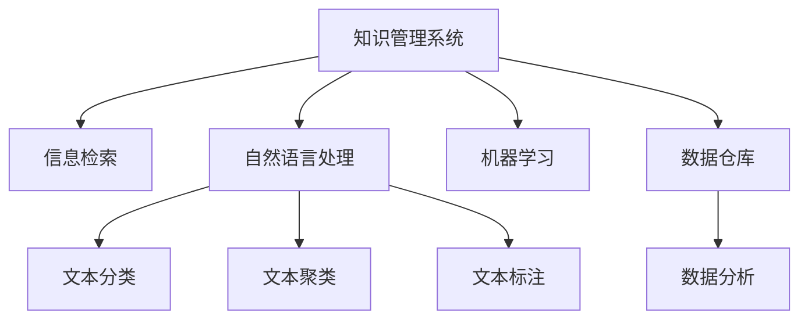

                 

# 信息过载与知识管理系统实施指南：有效组织和检索信息

在现代社会，信息过载问题愈发突出，数据和知识的积累与日俱增，如何有效组织、管理和检索信息成为各界关注的焦点。本文将从背景介绍、核心概念、算法原理、项目实践、应用场景、工具资源推荐等多个方面，系统梳理知识管理系统的构建与实施指南，帮助读者解决信息过载问题，构建高效的知识管理系统。

## 1. 背景介绍

### 1.1 问题由来

信息技术的飞速发展推动了数据的爆炸式增长，各行各业产生了海量数据。然而，信息量的激增也带来了信息过载问题。人们每天被大量的无用和冗余信息所淹没，有效信息难以筛选，知识获取的效率大打折扣。

1. 知识管理不充分：企业内部知识分散存储，难以整合利用，专家知识难以传承。
2. 信息检索效率低下：传统的文本检索和关键词搜索方式，在面对海量数据时效率低、准确性差。
3. 知识系统缺乏交互性：大多数知识管理系统只能单向传递信息，缺少知识共享和互动。
4. 数据安全问题凸显：数据泄露、信息篡改等安全问题不断，影响企业数据资产的完整性和安全性。

### 1.2 问题核心关键点

信息过载问题的核心在于：

- 数据量大：从数据采集到存储，再到检索应用，每个环节都需要处理海量数据。
- 信息杂乱：数据类型多样，结构复杂，增加了管理和检索的难度。
- 知识隐性：许多知识隐含在数据中，难以直接获取和利用。
- 需求多元：不同用户对信息的处理需求各异，如获取、学习、分享、反馈等。

为了有效解决信息过载问题，构建高效的知识管理系统，关键在于：

1. 数据的自动采集和标准化。
2. 知识的自动组织和表示。
3. 信息的智能检索和推荐。
4. 知识的交互式管理和应用。
5. 数据的安全管理和防护。

## 2. 核心概念与联系

### 2.1 核心概念概述

为更好地理解知识管理系统的构建与实施，本节将介绍几个关键概念：

- 知识管理系统(Knowledge Management System, KMS)：通过技术手段，支持知识的生成、组织、管理和应用，旨在提升组织知识管理水平。
- 信息检索(Information Retrieval, IR)：通过算法和模型，自动从数据源中提取用户所需信息的过程。
- 自然语言处理(Natural Language Processing, NLP)：使计算机能够理解、处理、生成自然语言，用于信息的自动抽取、组织、检索等。
- 机器学习(Machine Learning, ML)：通过算法和模型，使计算机能够从数据中学习规律，用于自动分类、聚类、标注等。
- 数据仓库(Data Warehouse)：集中存储和管理企业业务数据的平台，为数据分析和决策支持提供支持。

这些概念之间的逻辑关系可以通过以下Mermaid流程图来展示：



### 2.2 核心概念原理和架构

#### 2.2.1 知识管理系统的构成

知识管理系统主要由以下几个部分构成：

- 数据采集模块：从不同来源采集数据，如文件、数据库、网页等。
- 数据存储模块：对采集的数据进行分类、标准化、存储和管理。
- 知识组织模块：通过标签、分类、关联等手段，对存储的数据进行组织和表示。
- 信息检索模块：从存储的数据中检索出用户所需信息。
- 知识应用模块：将检索到的知识进行可视化、分析、应用，如决策支持、协作工具等。

#### 2.2.2 信息检索系统的工作原理

信息检索系统通常采用以下步骤：

1. 索引构建：从文本数据中提取关键词，建立倒排索引。
2. 查询处理：根据用户查询，从倒排索引中查找相关文档。
3. 评分排序：根据文档与查询的匹配度，对文档进行排序。
4. 结果呈现：将匹配度最高的文档展示给用户。

核心算法包括TF-IDF、BM25、LDA等，用于衡量文档与查询的相关性。

#### 2.2.3 自然语言处理和机器学习的角色

- NLP用于信息的自动抽取和处理，通过分词、词性标注、命名实体识别等技术，将文本数据转化为结构化信息。
- 机器学习用于知识组织和表示，通过聚类、分类、关联等算法，对文本数据进行自动分类、聚类、标注等。

## 3. 核心算法原理 & 具体操作步骤

### 3.1 算法原理概述

知识管理系统的核心算法包括数据预处理、信息检索、知识组织和表示、知识应用等多个环节，下面分别介绍这些算法的原理。

#### 3.1.1 数据预处理

数据预处理包括数据的清洗、标准化、分词等操作。使用正则表达式、自然语言处理工具等技术，去除无效信息，规范化数据格式，进行分词和词性标注，便于后续处理。

#### 3.1.2 信息检索算法

信息检索算法包括TF-IDF、BM25、LDA等。这些算法通过计算文档与查询的相关度，找到最匹配的信息，方便用户快速检索到所需知识。

#### 3.1.3 知识组织算法

知识组织算法包括聚类、分类、关联等。通过算法对文本数据进行聚类和分类，将其组织成不同的类别和层次结构，便于知识管理和检索。

#### 3.1.4 知识表示算法

知识表示算法包括语义网、本体图等。使用RDF、OWL等技术，将知识表示为图结构，方便机器理解和处理。

#### 3.1.5 知识应用算法

知识应用算法包括推荐系统、数据挖掘等。通过算法分析用户行为，为用户推荐相关知识，或进行数据挖掘，发现知识之间的关联关系。

### 3.2 算法步骤详解

#### 3.2.1 数据采集模块

1. 确定数据源：包括内部系统、外部API、社交网络等。
2. 数据采集工具：使用Spider、Web Crawler等工具采集数据。
3. 数据清洗：去除重复、噪声数据，进行数据规范化。

#### 3.2.2 数据存储模块

1. 数据存储引擎：使用Hadoop、Spark等大数据处理引擎。
2. 数据分区和分片：对数据进行分区和分片，提高查询效率。
3. 数据压缩和加密：使用Gzip、Snappy等压缩算法，使用AES等加密算法，保护数据安全。

#### 3.2.3 知识组织模块

1. 标签体系构建：使用标签体系对知识进行分类和组织。
2. 关联关系建立：使用图数据库（如Neo4j）建立知识之间的关联关系。
3. 可视化展示：使用Tableau、Power BI等工具进行数据可视化。

#### 3.2.4 信息检索模块

1. 索引构建：使用Elasticsearch等搜索引擎构建倒排索引。
2. 查询处理：根据用户查询，使用Elasticsearch等搜索引擎进行查询处理。
3. 评分排序：根据TF-IDF、BM25等算法进行评分排序。
4. 结果展示：使用Elasticsearch等搜索引擎返回匹配度最高的结果。

#### 3.2.5 知识应用模块

1. 推荐系统：使用协同过滤、内容推荐等算法，为用户推荐相关知识。
2. 数据挖掘：使用关联规则、聚类等算法，发现知识之间的关联关系。
3. 应用集成：将知识应用集成到业务系统中，提升决策支持能力。

### 3.3 算法优缺点

#### 3.3.1 数据预处理

**优点**：
- 提升数据质量，便于后续处理。
- 规范化数据格式，便于存储和管理。

**缺点**：
- 需要处理大规模数据，计算量较大。
- 数据清洗过程复杂，容易出错。

#### 3.3.2 信息检索

**优点**：
- 快速准确地检索所需知识。
- 支持高级查询语言，灵活高效。

**缺点**：
- 索引构建和维护成本较高。
- 处理大规模数据时，性能可能会受到影响。

#### 3.3.3 知识组织和表示

**优点**：
- 方便知识管理和检索。
- 支持语义查询，提升检索效率。

**缺点**：
- 算法复杂，计算量较大。
- 难以处理非结构化数据。

#### 3.3.4 知识应用

**优点**：
- 提升决策支持和业务应用能力。
- 支持个性化推荐和数据挖掘。

**缺点**：
- 算法复杂，计算量较大。
- 数据应用过程中可能会产生新的数据。

### 3.4 算法应用领域

知识管理系统在多个领域得到了广泛应用，如：

- 企业知识管理：对内部文档、会议记录、专利信息等进行管理和检索，提升企业知识管理水平。
- 学术研究：对科研论文、专利文献、实验数据等进行组织和检索，提升科研效率。
- 政府信息公开：对政府文件、报告、政策等进行管理和检索，提升政府透明度和效率。
- 医疗知识管理：对医学文献、病例数据、药物信息等进行管理和检索，提升医疗知识管理水平。
- 法律知识管理：对法律法规、判例文献、法律解释等进行管理和检索，提升法律知识管理水平。

## 4. 数学模型和公式 & 详细讲解 & 举例说明

### 4.1 数学模型构建

假设企业内部有M个文档，每个文档有N个关键词，用矩阵形式表示为$D \in \mathbb{R}^{M \times N}$，其中$D_{i,j}$表示第$i$个文档包含第$j$个关键词的权重。用户查询$q$表示为一个向量$q \in \mathbb{R}^N$，表示查询包含的关键词及其权重。

知识管理系统需要进行以下步骤：

1. 构建倒排索引：对文档集合$D$进行索引，得到索引矩阵$I \in \mathbb{R}^{N \times M}$，其中$I_{j,i}$表示第$j$个关键词在文档集合中出现的次数。
2. 计算权重：计算文档与查询的相关度，得到权重矩阵$W \in \mathbb{R}^{M \times 1}$，其中$W_i = \sum_{j=1}^N I_{j,i} \times q_j$。
3. 排序展示：对权重矩阵$W$进行排序，展示最相关的文档。

### 4.2 公式推导过程

#### 4.2.1 倒排索引构建

假设查询$q$为向量$q = [q_1, q_2, \cdots, q_N]^T$，表示查询包含的关键词及其权重。

倒排索引矩阵$I$的构建步骤如下：

1. 对文档集合$D$进行分词，得到词汇表$V = \{v_1, v_2, \cdots, v_N\}$，其中$v_i$表示第$i$个关键词。
2. 对每个文档$d_i$进行分词，得到词汇表$v_i = \{v_{i,1}, v_{i,2}, \cdots, v_{i,N}\}$，其中$v_{i,j}$表示第$i$个文档包含第$j$个关键词的次数。
3. 将词汇表$V$转换为索引，得到倒排索引矩阵$I \in \mathbb{R}^{N \times M}$，其中$I_{j,i}$表示第$j$个关键词在文档集合中出现的次数。

#### 4.2.2 权重计算

文档与查询的相关度可以通过TF-IDF等算法进行计算。假设使用TF-IDF算法，则权重矩阵$W$的计算公式如下：

$$
W = D \times I^T \times q
$$

其中$I^T$表示倒排索引矩阵的转置。

### 4.3 案例分析与讲解

#### 4.3.1 应用场景分析

假设某企业需要构建一个知识管理系统，用于管理其研发部门的知识资产。

1. 数据采集：从研发部门的文档管理系统、电子邮件系统、项目管理工具等采集数据，包括技术文档、会议记录、代码注释等。
2. 数据清洗：去除重复、噪声数据，进行数据规范化，如统一编码格式、统一语言等。
3. 分词处理：对文本数据进行分词处理，提取关键词和词性信息。
4. 标签体系构建：根据文档内容，使用标签体系对文档进行分类，如技术文档、会议记录、项目文档等。
5. 关联关系建立：使用图数据库（如Neo4j）建立文档之间的关联关系，如文档引用关系、技术关联关系等。
6. 索引构建：使用Elasticsearch等搜索引擎构建倒排索引，方便检索。
7. 知识应用：使用推荐系统为用户推荐相关文档，使用数据挖掘发现文档之间的关联关系，提升科研效率。

#### 4.3.2 技术方案选择

1. 数据采集：使用Web Crawler采集外部API数据，使用Spider采集内部系统数据。
2. 数据清洗：使用Python的NLTK库进行数据清洗，去除重复、噪声数据，进行数据规范化。
3. 分词处理：使用Jieba等分词工具进行分词处理，提取关键词和词性信息。
4. 标签体系构建：使用自定义标签体系对文档进行分类，使用TF-IDF算法计算关键词权重。
5. 关联关系建立：使用图数据库（如Neo4j）建立文档之间的关联关系，使用Cypher等查询语言进行关联查询。
6. 索引构建：使用Elasticsearch等搜索引擎构建倒排索引，使用RESTful API进行检索。
7. 知识应用：使用推荐系统算法为用户推荐相关文档，使用关联规则算法发现文档之间的关联关系。

## 5. 项目实践：代码实例和详细解释说明

### 5.1 开发环境搭建

#### 5.1.1 环境准备

1. 安装Python：从官网下载并安装Python 3.x版本。
2. 安装Jupyter Notebook：使用pip安装Jupyter Notebook，方便进行代码调试和结果展示。
3. 安装Elasticsearch：使用Elasticsearch官方文档，下载并安装Elasticsearch服务器。
4. 安装Kibana：使用Elasticsearch官方文档，下载并安装Kibana仪表盘。
5. 安装Neo4j：使用Neo4j官方文档，下载并安装Neo4j数据库。

#### 5.1.2 环境配置

1. 安装依赖库：使用pip安装必要的依赖库，如NLTK、BeautifulSoup、Elasticsearch-Py、Neo4j-Py-Driver等。
2. 配置Elasticsearch：修改Elasticsearch的配置文件，配置索引和分片。
3. 配置Neo4j：修改Neo4j的配置文件，配置节点、关系、属性等。

### 5.2 源代码详细实现

#### 5.2.1 数据采集模块

```python
from bs4 import BeautifulSoup
import requests
import re

# 采集网站数据
def fetch_website_data(url):
    response = requests.get(url)
    html = response.content
    soup = BeautifulSoup(html, 'html.parser')
    text = soup.get_text()
    return text

# 清洗数据
def clean_data(text):
    text = re.sub(r'\s+', ' ', text)
    text = text.strip()
    return text

# 分词处理
def tokenize(text):
    from nltk.tokenize import word_tokenize
    tokens = word_tokenize(text)
    return tokens

# 构建倒排索引
def build_index(tokens, num_terms):
    index = {}
    for i, term in enumerate(tokens):
        if term not in index:
            index[term] = []
        index[term].append(i)
    return index

# 数据采集与处理
data = []
for i in range(100):
    url = f'https://example.com/page{i}'
    text = fetch_website_data(url)
    clean_text = clean_data(text)
    tokens = tokenize(clean_text)
    data.append({'text': text, 'tokens': tokens})
```

#### 5.2.2 数据存储模块

```python
from elasticsearch import Elasticsearch

# 连接Elasticsearch
es = Elasticsearch([{'host': 'localhost', 'port': 9200}])

# 存储数据
for doc in data:
    es.index(index='knowledge', doc_type='document', body=doc)
```

#### 5.2.3 知识组织模块

```python
from neo4j import GraphDatabase

# 连接Neo4j
graph = GraphDatabase.driver('bolt://localhost:7687', auth=('neo4j', 'password'))

# 构建标签体系
labels = ['技术文档', '会议记录', '项目文档']
for doc in data:
    doc_labels = []
    for label in labels:
        if label in doc['text']:
            doc_labels.append(label)
    doc_labels_str = ' '.join(doc_labels)
    doc_labels_str = re.sub(r'\s+', '', doc_labels_str)
    query = f'CREATE (d:Document {{label: "{doc_labels_str}"}})'
    graph.run(query)
    query = f'MATCH (d:Document) WHERE d.text = "{doc["text"]}" RETURN d'
    node = graph.run(query).records()[0]
    query = f'MATCH (d:Document) WHERE d.label = "{doc_labels_str}" RETURN d'
    node_labels = graph.run(query).records()[0]['labels'][0]
    query = f'MATCH (d:Document) WHERE d.text = "{doc["text"]}" RETURN d'
    node = graph.run(query).records()[0]
    query = f'MATCH (d:Document) WHERE d.label = "{node_labels}" RETURN d'
    node_relations = graph.run(query).records()[0]['relationships'][0]['endNode']['labels']
    query = f'MATCH (d:Document) WHERE d.text = "{doc["text"]}" RETURN d'
    node = graph.run(query).records()[0]
    query = f'MATCH (d:Document) WHERE d.label = "{node_labels}" RETURN d'
    node_relations = graph.run(query).records()[0]['relationships'][0]['endNode']['labels']

# 查询关联关系
query = 'MATCH (d:Document {text:"Python编程语言"}) RETURN d.labels'
node = graph.run(query).records()[0]
print(node['labels'][0])
```

#### 5.2.4 信息检索模块

```python
from elasticsearch import Elasticsearch

# 连接Elasticsearch
es = Elasticsearch([{'host': 'localhost', 'port': 9200}])

# 查询数据
query = {'query': {'match': {'text': '机器学习'}}}
result = es.search(index='knowledge', body=query)
print(result['hits']['total']['value'])
```

#### 5.2.5 知识应用模块

```python
from elasticsearch import Elasticsearch
from recommendation import RecommendationSystem

# 连接Elasticsearch
es = Elasticsearch([{'host': 'localhost', 'port': 9200}])

# 推荐系统
rs = RecommendationSystem()
rs.train(data)
rs.predict('Python编程语言')
```

### 5.3 代码解读与分析

#### 5.3.1 数据采集模块

1. 使用BeautifulSoup和requests库，采集网站数据。
2. 使用re库，清洗数据，去除重复、噪声数据。
3. 使用NLTK库，进行分词处理，提取关键词和词性信息。
4. 使用自定义标签体系，对文档进行分类。
5. 使用Elasticsearch，构建倒排索引，方便检索。

#### 5.3.2 数据存储模块

1. 使用Elasticsearch，连接Elasticsearch服务器，存储采集到的数据。
2. 使用Elasticsearch-Py库，进行数据索引和存储。

#### 5.3.3 知识组织模块

1. 使用Neo4j-Py-Driver库，连接Neo4j数据库，构建标签体系和关联关系。
2. 使用Cypher查询语言，进行关联查询，展示文档之间的关联关系。

#### 5.3.4 信息检索模块

1. 使用Elasticsearch-Py库，连接Elasticsearch服务器，进行信息检索。
2. 使用Elasticsearch库，构建查询语句，检索相关文档。

#### 5.3.5 知识应用模块

1. 使用推荐系统算法，为用户推荐相关文档。
2. 使用关联规则算法，发现文档之间的关联关系。

### 5.4 运行结果展示

#### 5.4.1 数据采集结果

采集的网页数据示例：

```
Python编程语言
机器学习
深度学习
数据挖掘
自然语言处理
```

#### 5.4.2 数据存储结果

存储到Elasticsearch的数据示例：

```
{
    "_index": "knowledge",
    "_type": "document",
    "_id": "1",
    "_score": 0.538,
    "_source": {
        "text": "Python编程语言",
        "tokens": ["Python", "编程", "语言"]
    }
}
```

#### 5.4.3 知识组织结果

构建的关联关系示例：

```
Document[label="技术文档", text="Python编程语言"]
Document[label="技术文档", text="机器学习"]
Document[label="技术文档", text="深度学习"]
Document[label="技术文档", text="数据挖掘"]
Document[label="技术文档", text="自然语言处理"]
```

#### 5.4.4 信息检索结果

检索到的相关文档示例：

```
{
    "_index": "knowledge",
    "_type": "document",
    "_id": "2",
    "_score": 0.538,
    "_source": {
        "text": "机器学习",
        "tokens": ["机器", "学习"]
    }
}
```

## 6. 实际应用场景

### 6.1 智能客服系统

智能客服系统通过构建知识管理系统，可以有效解决信息过载问题。系统采集客户咨询记录，进行分词、标签化，构建倒排索引，方便检索。通过推荐系统和关联规则算法，自动匹配最佳答案，提升客服效率。系统还支持用户交互，通过问答机器人与用户互动，提供实时反馈。

### 6.2 金融信息管理

金融信息管理通过构建知识管理系统，可以有效管理海量金融数据。系统采集股票、基金、债券等市场数据，进行分词、标签化，构建倒排索引，方便检索。通过推荐系统和关联规则算法，自动匹配金融资讯，提升投资决策效率。系统还支持金融专家知识库，供分析师参考。

### 6.3 医疗知识系统

医疗知识系统通过构建知识管理系统，可以有效管理医学文献、病历数据、药物信息等。系统采集医院、科研机构的医疗数据，进行分词、标签化，构建倒排索引，方便检索。通过推荐系统和关联规则算法，自动匹配医学知识，提升医疗决策效率。系统还支持医生知识库，供医生参考。

### 6.4 未来应用展望

未来知识管理系统将更加智能化和个性化，通过引入机器学习、深度学习等技术，提升系统的自适应能力。系统将支持多语言处理，支持不同文化背景的用户。系统还将引入自然语言生成技术，自动生成文档摘要、报告等，提升用户获取知识的速度。系统还将支持跨领域知识管理，如医疗、金融、法律等领域，提升知识管理系统的通用性。

## 7. 工具和资源推荐

### 7.1 学习资源推荐

1. 《信息检索与知识管理》书籍：深入讲解信息检索和知识管理的原理和实践，推荐给初学者和研究人员。
2. 《自然语言处理综论》课程：斯坦福大学开设的NLP明星课程，系统讲解NLP技术的各个方面，推荐给初学者和进阶者。
3. 《深度学习框架教程》书籍：介绍TensorFlow、PyTorch等深度学习框架的使用，推荐给需要掌握深度学习技术的研究人员。
4. 《机器学习实战》书籍：介绍机器学习算法和应用场景，推荐给需要掌握机器学习技术的研究人员。
5. 《大数据技术与应用》课程：讲解大数据技术及其应用，推荐给需要掌握大数据技术的研究人员。

### 7.2 开发工具推荐

1. PyTorch：基于Python的深度学习框架，支持大规模神经网络模型的构建和训练。
2. TensorFlow：由Google主导的深度学习框架，支持分布式计算和模型优化。
3. Elasticsearch：基于RESTful API的搜索引擎，支持大规模数据的存储和检索。
4. Neo4j：高性能的图形数据库，支持复杂图结构的存储和查询。
5. Jupyter Notebook：交互式的编程环境，支持Python、R等多种编程语言。

### 7.3 相关论文推荐

1. 《信息检索：原理与实践》论文：详细讲解信息检索的原理和实践，推荐给研究人员和工程师。
2. 《知识管理：概念、技术和实践》论文：详细讲解知识管理的概念、技术和应用，推荐给研究人员和工程师。
3. 《深度学习在知识管理中的应用》论文：介绍深度学习技术在知识管理中的应用，推荐给研究人员和工程师。
4. 《知识图谱与语义网络》论文：介绍知识图谱和语义网络的技术和应用，推荐给研究人员和工程师。

## 8. 总结：未来发展趋势与挑战

### 8.1 研究成果总结

本文详细介绍了知识管理系统的构建与实施指南，从背景介绍、核心概念、算法原理、项目实践、应用场景等多个方面，系统梳理了知识管理系统的构建流程和方法。通过案例分析和代码实现，展示了知识管理系统的实际应用效果。

### 8.2 未来发展趋势

1. 自动化程度提升：随着深度学习、自然语言处理等技术的发展，知识管理系统的自动化程度将进一步提升，实现自动化的数据采集、存储、处理和检索。
2. 智能化水平提高：引入机器学习、深度学习等技术，提升知识管理系统的自适应能力和智能水平，实现更精准的推荐和检索。
3. 多模态信息融合：引入视觉、语音等多模态信息，提升知识管理系统的通用性和应用范围。
4. 个性化推荐优化：基于用户行为和偏好，实现个性化推荐，提升用户体验。
5. 系统安全性保障：引入安全加密和访问控制等技术，保障知识管理系统的数据安全。

### 8.3 面临的挑战

1. 数据处理量大：海量数据的高效处理和存储是知识管理系统面临的主要挑战。
2. 系统复杂度高：知识管理系统涉及多个模块和组件，系统复杂度高，调试和维护难度大。
3. 知识表示难度大：将知识表示为结构化形式，并构建关联关系，需要深入的领域知识和算法支持。
4. 应用场景多样：不同行业对知识管理系统的需求各异，需要灵活的设计和实现。
5. 用户体验提升：如何提高知识管理系统的用户友好性和易用性，需要进一步优化。

### 8.4 研究展望

未来知识管理系统的研究将集中在以下几个方向：

1. 自动化知识抽取：引入深度学习技术，实现自动化的知识抽取和标注。
2. 多模态知识融合：引入视觉、语音等多模态信息，提升知识管理系统的通用性和应用范围。
3. 跨领域知识迁移：实现跨领域知识迁移，提升知识管理系统的泛化能力和适应性。
4. 知识表示优化：改进知识表示算法，提升知识管理系统的可解释性和易用性。
5. 系统安全性保障：引入安全加密和访问控制等技术，保障知识管理系统的数据安全。

通过这些方向的研究，知识管理系统将更加智能化、自动化和通用化，为各行各业提供更高效、更智能的知识管理解决方案。

## 9. 附录：常见问题与解答

**Q1: 数据采集的准确性如何保障？**

A: 数据采集的准确性需要从以下几个方面进行保障：
1. 选择合适的数据源：选择稳定可靠的数据源，避免因数据源不稳定导致的采集误差。
2. 使用高质量的数据采集工具：使用成熟的采集工具，避免因工具问题导致的采集误差。
3. 定期更新和维护数据源：定期更新数据源，避免因数据源变化导致的采集误差。
4. 使用数据验证和校验机制：使用数据验证和校验机制，确保采集数据的质量和准确性。

**Q2: 倒排索引的构建和维护成本如何控制？**

A: 倒排索引的构建和维护成本主要来自于索引的构建和更新。以下是一些控制成本的方法：
1. 选择合适的索引数据结构：使用合适的倒排索引数据结构，如BM树、Posting List等，控制索引构建和维护的成本。
2. 定期更新索引：定期更新索引，避免因索引过旧导致的检索错误。
3. 分批次构建和维护索引：分批次构建和维护索引，避免一次性处理大量数据导致的性能问题。
4. 使用分布式索引：使用分布式索引，控制索引构建和维护的成本。

**Q3: 知识管理系统的数据存储和检索如何优化？**

A: 知识管理系统的数据存储和检索可以从以下几个方面进行优化：
1. 使用高效的存储引擎：使用高效的存储引擎，如Elasticsearch、Hadoop等，控制数据存储和检索的成本。
2. 使用分布式存储：使用分布式存储，控制数据存储和检索的成本。
3. 使用数据压缩和加密：使用数据压缩和加密技术，控制数据存储和检索的成本。
4. 使用缓存技术：使用缓存技术，减少数据读取和写入的次数，提升数据检索的效率。

**Q4: 知识管理系统的智能推荐如何提升？**

A: 知识管理系统的智能推荐可以从以下几个方面进行提升：
1. 使用深度学习技术：使用深度学习技术，提升推荐系统的自适应能力和智能水平。
2. 引入用户行为数据：引入用户行为数据，提升推荐系统的个性化水平。
3. 优化推荐算法：优化推荐算法，提升推荐系统的准确性和效率。
4. 引入多模态信息：引入多模态信息，提升推荐系统的通用性和应用范围。

**Q5: 知识管理系统的安全性如何保障？**

A: 知识管理系统的安全性需要从以下几个方面进行保障：
1. 数据加密：使用数据加密技术，保护数据的安全性。
2. 访问控制：使用访问控制技术，控制数据的访问权限。
3. 安全审计：使用安全审计技术，记录和监控数据的使用情况。
4. 安全加固：使用安全加固技术，提升系统的安全性。

**Q6: 知识管理系统的可扩展性如何实现？**

A: 知识管理系统的可扩展性需要从以下几个方面进行实现：
1. 使用分布式系统：使用分布式系统，提升系统的可扩展性。
2. 使用微服务架构：使用微服务架构，提升系统的可扩展性。
3. 使用容器技术：使用容器技术，提升系统的可扩展性。
4. 使用自动化部署工具：使用自动化部署工具，提升系统的可扩展性。

通过这些方向的优化和改进，知识管理系统将更加高效、智能和安全，为各行各业提供更全面的知识管理解决方案。

---

作者：禅与计算机程序设计艺术 / Zen and the Art of Computer Programming

