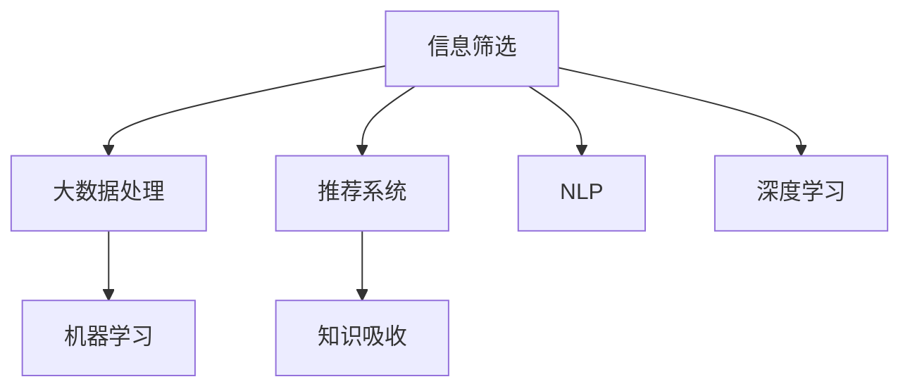

                 

# 信息过载时代：如何在信息洪流中有效筛选和吸收知识

> 关键词：信息筛选,知识吸收,大数据,机器学习,深度学习,算法推荐

## 1. 背景介绍

### 1.1 问题由来

在信息时代，数据和信息的爆炸性增长带来了前所未有的挑战。每天，我们都在接触海量数据，如新闻、社交媒体、电子邮件、网页等，然而，这些数据的质量良莠不齐，信息真实性难以判断，给我们的工作和生活带来了巨大的信息过载压力。如何高效筛选、整理和吸收这些海量信息，成为我们必须面对的问题。

### 1.2 问题核心关键点

信息过载问题的核心在于，如何在庞大的数据流中快速而准确地找到对自己有用的信息。解决这一问题的方法多种多样，包括使用信息检索技术、推荐系统、以及更高级的算法，如深度学习、知识图谱等。

本文将详细探讨信息筛选和吸收的核心理论和实际应用方法，通过结合机器学习和深度学习技术，提供一些可行的解决方案，以期帮助用户在海量信息中高效获取所需知识。

## 2. 核心概念与联系

### 2.1 核心概念概述

为更好理解如何在信息洪流中有效筛选和吸收知识，本节将介绍几个关键概念：

- 信息筛选（Information Filtering）：指从大量数据中识别出与用户需求相关的信息，并通过算法自动推送给用户的技术。
- 知识吸收（Knowledge Absorption）：指将识别出的信息转化为个人知识，并存储在记忆、经验或知识库中的过程。
- 推荐系统（Recommendation System）：通过用户行为数据和商品属性，智能推荐用户感兴趣的产品或内容的技术。
- 自然语言处理（NLP）：研究计算机如何理解和生成自然语言的技术。
- 深度学习（Deep Learning）：一种使用多层神经网络进行复杂模式识别的机器学习技术。
- 大数据（Big Data）：指海量的、复杂的数据集合，需要采用分布式计算、数据挖掘等技术进行分析和处理。

这些概念之间的联系可以通过以下Mermaid流程图来展示：



这个流程图展示了信息筛选、大数据处理、推荐系统、自然语言处理、深度学习与知识吸收之间的联系：

1. 信息筛选是整个流程的起点，使用大数据处理和推荐系统技术从海量数据中过滤出有用信息。
2. 推荐系统进一步提升信息筛选的精准度，将与用户兴趣相关的信息推荐给用户。
3. NLP和深度学习技术帮助理解自然语言，识别信息中的关键元素和关系。
4. 最终，通过知识吸收，将筛选和推荐的信息转化为用户的长期记忆或经验。

## 3. 核心算法原理 & 具体操作步骤

### 3.1 算法原理概述

信息筛选和知识吸收的核心在于构建一个高效的推荐系统，将与用户兴趣相关的信息自动推送给用户。推荐系统通常分为基于内容的推荐、协同过滤推荐、混合推荐系统等不同类型，但本文主要介绍基于机器学习和深度学习的推荐系统。

### 3.2 算法步骤详解

#### 3.2.1 数据准备

- **用户数据**：包括用户基本信息、历史行为记录、社交网络关系等。
- **商品数据**：包括商品的基本属性、标签、类别等。
- **行为数据**：用户在网站或应用中的点击、浏览、购买等操作记录。

#### 3.2.2 特征工程

- **用户特征**：如年龄、性别、职业、兴趣标签等。
- **商品特征**：如标题、描述、价格、类别标签等。
- **行为特征**：如浏览时间、点击位置、停留时长等。

#### 3.2.3 模型训练

- **基于矩阵分解的算法**：如奇异值分解（SVD）、ALS等，通过分解用户-商品矩阵找到用户和商品的潜在特征。
- **基于深度学习的算法**：如隐式神经网络（IMNN）、深度矩阵分解（DMD）等，通过多层神经网络对用户和商品的特征进行非线性映射。

#### 3.2.4 模型评估与优化

- **评估指标**：如准确率、召回率、F1-score、平均绝对误差（MAE）等。
- **模型优化**：采用正则化、dropout、early stopping等技术避免过拟合。

#### 3.2.5 系统部署与优化

- **实时推荐**：根据用户实时行为进行动态推荐。
- **缓存优化**：使用分布式缓存系统，提升推荐响应速度。
- **负载均衡**：根据用户流量动态调整服务器资源配置。

### 3.3 算法优缺点

基于机器学习和深度学习的推荐系统具有以下优点：
1. 可扩展性强：随着用户和商品数量增加，系统仍能高效运行。
2. 个性化程度高：通过深度学习模型，能够精准匹配用户兴趣。
3. 可以处理非结构化数据：如NLP技术，可以从文本中提取信息。

同时，该方法也存在一些局限性：
1. 对数据质量要求高：推荐系统依赖大量高质量的数据，数据噪声会影响效果。
2. 计算复杂度高：深度学习模型参数量大，需要强大的计算资源。
3. 存在冷启动问题：新用户或新商品无法立即获得推荐。
4. 缺乏透明性：推荐算法决策过程难以解释。

### 3.4 算法应用领域

基于推荐系统的信息筛选和知识吸收方法，在众多领域中得到了广泛的应用，例如：

- 电子商务：如淘宝、京东等电商平台通过推荐系统提升用户购物体验。
- 新闻媒体：如Google News、今日头条等媒体平台通过推荐算法为用户个性化推送新闻。
- 社交网络：如Facebook、Twitter等社交网站通过推荐系统帮助用户发现新的内容和朋友。
- 视频平台：如Netflix、YouTube等视频平台通过推荐系统提升用户观看体验。
- 知识库：如百度百科、维基百科等知识平台通过推荐系统帮助用户发现感兴趣的知识。

除了上述这些经典应用外，推荐系统还被创新性地应用到更多场景中，如智能客服、旅游推荐、金融理财等，为信息时代带来了新的便利。

## 4. 数学模型和公式 & 详细讲解  
### 4.1 数学模型构建

本节将使用数学语言对推荐系统的核心模型进行更加严格的刻画。

假设用户数为 $U$，商品数为 $I$，用户对商品 $i$ 的评分 $R_{ui}$ 已知，推荐系统的目标是找到用户 $u$ 对未评分商品 $i$ 的评分估计。

记用户特征为 $\mathbf{x}_u = (x_{u1}, x_{u2}, ..., x_{un})$，商品特征为 $\mathbf{y}_i = (y_{i1}, y_{i2}, ..., y_{im})$，用户对商品 $i$ 的评分估计为 $\hat{R}_{ui} = \mathbf{x}_u \mathbf{y}_i^T$。

推荐系统模型的目标是最大化平均绝对误差最小的评分估计。即：

$$
\min_{\mathbf{y}} \frac{1}{U} \sum_{u=1}^U \sum_{i=1}^I |R_{ui} - \hat{R}_{ui}|
$$

其中，$R_{ui}$ 为实际评分，$\hat{R}_{ui}$ 为预测评分。

### 4.2 公式推导过程

假设采用矩阵分解方法进行推荐，将用户-商品评分矩阵 $R$ 分解为 $U \times V$ 矩阵的乘积 $R = UV^T$，其中 $U$ 为 $U \times K$ 矩阵，$V$ 为 $I \times K$ 矩阵。

设 $\mathbf{x}_u = \mathbf{u}_k$，$\mathbf{y}_i = \mathbf{v}_l$，则用户对商品 $i$ 的评分估计为 $\hat{R}_{ui} = \mathbf{u}_k^T \mathbf{v}_l$。

使用均方误差作为损失函数，则目标函数为：

$$
\min_{\mathbf{u}, \mathbf{v}} \frac{1}{U} \sum_{u=1}^U \sum_{i=1}^I (R_{ui} - \mathbf{u}_k^T \mathbf{v}_l)^2
$$

使用随机梯度下降等优化算法求解上述最优化问题，更新 $\mathbf{u}$ 和 $\mathbf{v}$。

### 4.3 案例分析与讲解

以Netflix推荐系统为例，其采用的是基于矩阵分解的隐式神经网络（IMNN）模型。IMNN模型通过将评分矩阵 $R$ 分解为 $U \times V$ 矩阵，利用 $V$ 矩阵中的信息生成预测评分 $\hat{R}_{ui} = \mathbf{u}_k^T \mathbf{v}_l$。

Netflix通过大规模数据训练IMNN模型，每个用户和商品被映射到一个低维空间中，从而在复杂多维空间中寻找最优的评分预测。该模型利用深度神经网络对用户和商品特征进行非线性映射，增强了模型的表达能力和推荐效果。

在实际应用中，Netflix还会采用多种优化策略，如模型蒸馏、分布式训练、缓存优化等，以提升推荐系统的响应速度和准确性。

## 5. 项目实践：代码实例和详细解释说明
### 5.1 开发环境搭建

在进行推荐系统实践前，我们需要准备好开发环境。以下是使用Python进行Scikit-learn和TensorFlow开发的环境配置流程：

1. 安装Anaconda：从官网下载并安装Anaconda，用于创建独立的Python环境。

2. 创建并激活虚拟环境：
```bash
conda create -n recsys-env python=3.8 
conda activate recsys-env
```

3. 安装必要的包：
```bash
pip install scikit-learn tensorflow
```

4. 安装TensorFlow Serving：
```bash
pip install tensorflow-serving-api
```

5. 安装TensorFlow Serving客户端：
```bash
pip install tensorflow-serving-api tensorflow-serving-py
```

完成上述步骤后，即可在`recsys-env`环境中开始推荐系统实践。

### 5.2 源代码详细实现

下面我们以Netflix推荐系统为例，给出使用TensorFlow实现矩阵分解推荐算法的完整代码实现。

```python
import tensorflow as tf
from tensorflow.keras.layers import Dense, Input, Embedding
from tensorflow.keras.models import Model

# 定义用户和商品嵌入层
user_input = Input(shape=(1,), name='user')
user_embedding = Embedding(output_dim=10, input_dim=1000, name='user_embedding')(user_input)

item_input = Input(shape=(1,), name='item')
item_embedding = Embedding(output_dim=10, input_dim=10000, name='item_embedding')(item_input)

# 定义深度神经网络层
user_v = Dense(units=128, activation='relu')(user_embedding)
item_v = Dense(units=128, activation='relu')(item_embedding)

# 连接用户和商品嵌入
r = tf.keras.layers.Dot(axes=[1, 1])([user_v, item_v])

# 定义输出层
rating = Dense(units=1, activation='linear')(r)

# 构建模型
model = Model(inputs=[user_input, item_input], outputs=rating)

# 编译模型
model.compile(optimizer='adam', loss='mean_squared_error')

# 加载数据
with open('rating_data.csv', 'r') as f:
    data = [list(map(float, line.split(','))) for line in f]

# 数据预处理
train_x = [data[i][0] for i in range(len(data))]
train_y = [data[i][1] for i in range(len(data))]
train_y = np.array(train_y).reshape(-1, 1)

# 模型训练
model.fit([train_x, train_x], train_y, epochs=10, batch_size=32, validation_split=0.2)
```

### 5.3 代码解读与分析

让我们再详细解读一下关键代码的实现细节：

**用户和商品嵌入层**：
- 定义输入层 `user_input` 和 `item_input`，用于输入用户和商品ID。
- 定义嵌入层 `user_embedding` 和 `item_embedding`，将输入ID转换为稠密向量表示。

**深度神经网络层**：
- 使用Dense层对用户和商品嵌入进行非线性映射，增强特征表示能力。

**输出层**：
- 通过Dot操作将用户和商品向量相乘，得到预测评分。
- 使用Dense层将预测评分映射为线性输出。

**模型编译**：
- 使用Adam优化器和均方误差损失函数编译模型，准备训练。

**数据加载与预处理**：
- 从CSV文件中读取评分数据。
- 对数据进行预处理，将用户ID和商品ID转换为模型输入，将评分转换为模型输出。

**模型训练**：
- 使用训练数据训练模型，并设置验证集。

在实际应用中，还需要考虑更多的细节，如模型的保存和部署、超参数调优、分布式训练等。但核心的推荐系统逻辑基本与此类似。

## 6. 实际应用场景
### 6.1 电子商务

推荐系统在电子商务领域的应用极为广泛。如亚马逊、淘宝等电商平台通过推荐系统为每个用户推荐商品，提升用户体验和销售额。

在技术实现上，可以收集用户的历史浏览、点击、购买记录，将其作为训练数据，训练一个推荐模型，实时预测用户对新商品的需求，并智能推荐到用户的商品页面上。这不仅能提升用户购物体验，还能提升销售额，降低库存压力。

### 6.2 内容分发平台

内容分发平台如Netflix、YouTube、今日头条等，通过推荐系统为用户推荐影视剧、视频、新闻等内容。

在实践中，可以收集用户观看行为数据，使用协同过滤或矩阵分解等算法，为用户推荐个性化内容。此外，还可以结合用户搜索、评论等行为，进一步提升推荐效果。

### 6.3 金融理财

金融理财平台如支付宝、微信等，通过推荐系统为用户推荐理财产品、基金、保险等金融产品。

在技术实现上，可以收集用户的历史交易记录、风险偏好等信息，使用机器学习算法训练推荐模型，实时推荐匹配用户风险偏好的金融产品。此外，还可以结合市场动态、经济指标等信息，进一步优化推荐效果。

### 6.4 未来应用展望

随着推荐系统的不断发展，其在信息筛选和知识吸收方面的应用将会越来越广泛。未来推荐系统将融合更多技术和应用场景，展现出更大的潜力。

- 推荐系统将与物联网、可穿戴设备等技术结合，为用户提供更加个性化的推荐服务。
- 推荐系统将与自然语言处理技术结合，对用户文本数据进行分析，生成更为精准的推荐结果。
- 推荐系统将与人工智能结合，通过学习用户决策过程，生成更为智能化的推荐策略。

总之，推荐系统将在信息筛选和知识吸收方面发挥越来越重要的作用，为用户带来更加智能、高效、个性化的信息体验。

## 7. 工具和资源推荐
### 7.1 学习资源推荐

为了帮助开发者系统掌握推荐系统的理论基础和实践技巧，这里推荐一些优质的学习资源：

1. 《推荐系统实战》系列博文：由AI技术专家撰写，介绍了推荐系统的基本原理、算法和优化技巧。

2. 《深度学习推荐系统》课程：由DeepLearning.AI开设的深度学习推荐系统课程，详细讲解了深度学习在推荐系统中的应用。

3. 《推荐系统综述》书籍：该书涵盖了推荐系统的主要算法和优化技术，是推荐系统学习的重要参考资料。

4. Kaggle：数据科学竞赛平台，提供大量推荐系统竞赛和数据集，帮助开发者实践推荐系统算法。

5. ACM TIST推荐系统论文库：推荐系统领域的顶级期刊和会议论文库，包含大量前沿研究文章。

通过对这些资源的学习实践，相信你一定能够快速掌握推荐系统的精髓，并用于解决实际的推荐问题。
###  7.2 开发工具推荐

高效的开发离不开优秀的工具支持。以下是几款用于推荐系统开发的常用工具：

1. TensorFlow：由Google主导开发的深度学习框架，生产部署方便，适合大规模工程应用。

2. PyTorch：基于Python的开源深度学习框架，灵活便捷，适合研究型开发。

3. Scikit-learn：Python数据科学库，提供丰富的机器学习算法和工具，适合快速原型开发。

4. TensorFlow Serving：用于部署深度学习模型的服务器框架，支持多种模型格式和部署方式。

5. Elasticsearch：开源的分布式搜索引擎，适合存储和检索大规模结构化数据。

6. Apache Kafka：分布式流处理系统，适合处理和传输推荐系统所需的大规模数据。

合理利用这些工具，可以显著提升推荐系统的开发效率，加快创新迭代的步伐。

### 7.3 相关论文推荐

推荐系统的发展得益于学界的持续研究。以下是几篇奠基性的相关论文，推荐阅读：

1. Factorization Machines for Recommender Systems（矩阵分解算法）：提出了矩阵分解算法，用于推荐系统中的特征学习。

2. Deep Factorization Machines（深度矩阵分解）：引入了深度神经网络，增强了矩阵分解算法的表达能力。

3. Neural Collaborative Filtering（神经协同过滤算法）：使用深度神经网络处理用户和商品之间的隐含关系，提升了协同过滤算法的性能。

4. Attention-based Recommender System（基于注意力机制的推荐系统）：引入注意力机制，增强了推荐系统的鲁棒性和可解释性。

5. Knowledge-based Recommender System（基于知识图谱的推荐系统）：结合知识图谱技术，增强了推荐系统的领域性和可信度。

这些论文代表了大数据和深度学习在推荐系统中的应用，通过学习这些前沿成果，可以帮助研究者把握学科前进方向，激发更多的创新灵感。

## 8. 总结：未来发展趋势与挑战

### 8.1 总结

本文对推荐系统在信息筛选和知识吸收方面的理论基础和实际应用进行了全面系统的介绍。首先阐述了推荐系统的背景和意义，明确了其在信息过载时代的重要作用。其次，从原理到实践，详细讲解了推荐系统的数学模型和算法步骤，给出了推荐系统开发和优化的方法。同时，本文还广泛探讨了推荐系统在电子商务、内容分发、金融理财等多个行业领域的应用前景，展示了推荐系统的巨大潜力。此外，本文精选了推荐系统的各类学习资源，力求为读者提供全方位的技术指引。

通过本文的系统梳理，可以看到，推荐系统在海量信息筛选和知识吸收方面展现了强大的优势，极大地提升了信息时代的工作和生活效率。未来，伴随大数据和深度学习技术的不断进步，推荐系统必将在更多领域得到应用，成为智能时代的重要工具。

### 8.2 未来发展趋势

展望未来，推荐系统将呈现以下几个发展趋势：

1. 深度学习与神经网络将进一步融合，提升推荐系统的表达能力和泛化能力。
2. 推荐系统将与自然语言处理技术结合，对用户文本数据进行分析，生成更为精准的推荐结果。
3. 推荐系统将与知识图谱技术结合，增强推荐系统的领域性和可信度。
4. 推荐系统将与人工智能结合，通过学习用户决策过程，生成更为智能化的推荐策略。
5. 推荐系统将与物联网、可穿戴设备等技术结合，提供更为个性化的推荐服务。
6. 推荐系统将与大数据技术结合，处理海量数据，提升推荐系统的实时性和响应速度。

以上趋势凸显了推荐系统的广阔前景。这些方向的探索发展，必将进一步提升推荐系统的性能和应用范围，为信息时代带来新的便利。

### 8.3 面临的挑战

尽管推荐系统已经取得了瞩目成就，但在迈向更加智能化、普适化应用的过程中，它仍面临诸多挑战：

1. 数据隐私问题：如何保护用户隐私，避免数据泄露，是推荐系统面临的重大挑战。
2. 冷启动问题：如何处理新用户或新商品，使其快速获得推荐，也是推荐系统的重要课题。
3. 数据稀疏性问题：推荐系统依赖用户行为数据，如何处理数据稀疏性，也是推荐系统的重要挑战。
4. 鲁棒性问题：推荐系统面对异常数据和攻击时，如何保持鲁棒性，避免模型过拟合，也是推荐系统的关键问题。
5. 计算资源问题：推荐系统依赖大量数据和模型参数，如何高效处理计算资源，也是推荐系统的重要挑战。

尽管面临这些挑战，但随着技术的发展和应用的深入，相信推荐系统必将在信息筛选和知识吸收方面发挥越来越重要的作用，为用户带来更加智能、高效、个性化的信息体验。

### 8.4 研究展望

面向未来，推荐系统的研究需要在以下几个方面寻求新的突破：

1. 结合深度学习和知识图谱技术，增强推荐系统的鲁棒性和可信度。
2. 引入自然语言处理技术，对用户文本数据进行分析，生成更为精准的推荐结果。
3. 结合人工智能技术，通过学习用户决策过程，生成更为智能化的推荐策略。
4. 结合物联网、可穿戴设备等技术，提供更为个性化的推荐服务。
5. 结合大数据技术，处理海量数据，提升推荐系统的实时性和响应速度。

这些研究方向的探索，必将引领推荐系统走向更高的台阶，为用户带来更加智能、高效、个性化的信息体验。总之，推荐系统需要在技术、应用、隐私保护等方面进行全面优化，才能真正实现智能信息时代的要求。

## 9. 附录：常见问题与解答

**Q1：推荐系统为什么需要收集大量用户行为数据？**

A: 推荐系统依赖用户行为数据进行推荐，这些数据包含了用户对商品的兴趣和偏好。通过收集用户的行为数据，推荐系统可以更准确地理解用户的喜好，从而生成个性化的推荐结果。

**Q2：推荐系统为什么需要使用矩阵分解算法？**

A: 矩阵分解算法可以将用户-商品评分矩阵分解为用户和商品两个低维空间，在复杂多维空间中寻找最优的评分预测。这种方法可以有效处理高维稀疏数据，提高推荐系统的准确性和效率。

**Q3：推荐系统如何处理数据稀疏性问题？**

A: 推荐系统可以采用多种方法处理数据稀疏性，如矩阵填充、模型蒸馏、联合训练等。通过这些方法，可以提升数据利用率，提高推荐系统的泛化能力。

**Q4：推荐系统如何处理冷启动问题？**

A: 推荐系统可以使用基于内容的推荐、协同过滤推荐、深度学习推荐等多种方法处理冷启动问题。通过这些方法，新用户或新商品可以较快地获得推荐，提升用户体验。

**Q5：推荐系统如何保护用户隐私？**

A: 推荐系统可以采用多种隐私保护技术，如差分隐私、联邦学习、本地化推荐等。通过这些技术，可以保护用户隐私，同时提升推荐系统的性能。

总之，推荐系统在海量信息筛选和知识吸收方面展现了强大的优势，未来将在更多领域得到应用，为用户带来更加智能、高效、个性化的信息体验。

