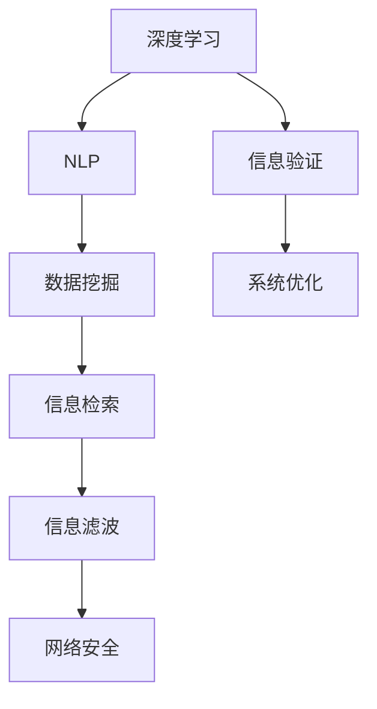

                 

# 信息验证和媒体素养能力培养：为假新闻和媒体操纵做好准备

> 关键词：信息验证, 媒体素养, 假新闻, 媒体操纵, 事实核查, 深度学习, 自然语言处理, 数据挖掘, 人工智能, 信息检索, 信息滤波, 网络安全

## 1. 背景介绍

### 1.1 问题由来

在信息爆炸的时代，假新闻、媒体操纵等问题日益凸显，给社会带来了巨大负面影响。互联网的普及让每个人都成为了信息的发布者和接收者，这意味着任何人都可能成为假新闻的制造者和传播者。与此同时，大型媒体机构的言论往往对社会舆论具有高度引导性，不实报道可能带来公共恐慌、社会动荡甚至国际冲突。

为应对这些挑战，需要培养大众的信息验证能力和媒体素养。通过提高信息识别和媒体批判性思维，我们才能在复杂的信息环境中辨别真伪，做出理性的判断。而基于深度学习和大数据技术的信息验证系统，能更高效地帮助我们实现这一目标。

### 1.2 问题核心关键点

当前，信息验证技术已融合了多个领域的知识，主要包括：

1. **深度学习**：用于文本分类、实体识别等任务，提取文本中的关键信息。
2. **自然语言处理(NLP)**：解析和理解自然语言文本，提供事实核查的基础。
3. **数据挖掘与机器学习**：从海量文本中挖掘模式，提升信息验证的准确性和效率。
4. **人工智能(AI)**：利用多模态信息融合、因果推断等技术，提升信息验证模型的鲁棒性和泛化能力。
5. **信息检索与信息滤波**：通过算法构建信息检索系统，并结合过滤算法（如基于内容的过滤），抑制假新闻传播。
6. **网络安全**：从技术角度提升信息验证系统的安全性，防止信息篡改和滥用。

这些关键技术共同构成了信息验证的核心范式，旨在通过算法和模型构建自动化、智能化的信息识别系统，辅助大众识别和抵制假新闻。

## 2. 核心概念与联系

### 2.1 核心概念概述

为更好地理解信息验证系统，本节将介绍几个核心概念及其相互关系：

- **深度学习(Deep Learning)**：一种利用多层神经网络进行复杂模式识别的机器学习方法。深度学习在NLP、图像识别等领域均有广泛应用。
- **自然语言处理(Natural Language Processing, NLP)**：研究如何让计算机理解和处理人类语言。包括文本分类、实体识别、情感分析、机器翻译等任务。
- **数据挖掘(Data Mining)**：通过算法在数据中提取模式和知识，可用于信息验证中的文本分类和异常检测。
- **信息检索(Information Retrieval, IR)**：从大量文本中检索出与查询最相关的文档，可用于构建假新闻检测系统。
- **信息滤波(Information Filtering)**：使用算法从信息流中过滤不实或有害信息，如使用内容过滤算法、谣言检测技术等。
- **网络安全(Network Security)**：保护信息验证系统免受攻击，保证其稳定运行。

这些概念之间的联系可以通过以下Mermaid流程图来展示：



这个流程图展示了大语言模型在信息验证中的作用：

1. 深度学习和大数据结合，提升模型对复杂模式的识别能力。
2. NLP技术解析文本，提供基础信息核查。
3. 数据挖掘用于文本分类和异常检测。
4. 信息检索系统用于快速定位假新闻。
5. 信息滤波抑制假新闻传播。
6. 网络安全保障系统安全。

## 3. 核心算法原理 & 具体操作步骤
### 3.1 算法原理概述

信息验证系统通过深度学习和NLP技术，对文本进行语义分析，提取关键信息并对比真实数据，从而判断文本的真伪。核心算法包括：

- **文本分类**：将文本分类为正面、负面或中性。常用算法包括逻辑回归、SVM、深度神经网络等。
- **实体识别**：识别文本中的命名实体，如人名、地名、机构名等。常用算法包括条件随机场(CRF)、BERT等。
- **关系抽取**：从文本中抽取出实体之间的关系。常用算法包括TransE、GNN等。
- **情感分析**：判断文本的情感倾向，常用算法包括基于规则的方法、机器学习方法等。
- **因果推断**：通过历史数据和逻辑推理，判断文本是否具有因果关系，常用算法包括贝叶斯网络、因果推断图等。
- **多模态融合**：融合文本、图像、语音等多模态信息，提升信息验证的准确性，常用算法包括注意力机制、多模态神经网络等。

### 3.2 算法步骤详解

基于深度学习的信息验证系统一般包括以下关键步骤：

**Step 1: 数据准备与预处理**
- 收集与任务相关的文本数据，清洗和标注数据集。
- 对文本进行分词、去停用词、词向量化等预处理。

**Step 2: 选择模型和算法**
- 选择合适的深度学习模型和算法，如LSTM、GRU、BERT等。
- 设计合适的损失函数和优化器。

**Step 3: 训练与验证**
- 在标注数据集上训练模型，使用交叉验证等方法评估模型性能。
- 调整模型超参数，如学习率、批大小、迭代轮数等，直到模型性能满足要求。

**Step 4: 测试与部署**
- 在测试数据集上评估模型性能，使用精确率、召回率、F1-score等指标。
- 部署模型到实际应用环境中，结合API和用户界面，提供信息验证服务。

### 3.3 算法优缺点

基于深度学习的信息验证系统具有以下优点：

- **高效准确**：深度学习模型在大规模文本数据上训练，可以获得较准确的分类和实体识别结果。
- **自动扩展**：深度学习模型能够适应不同领域的文本，通过迁移学习，快速适应新任务。
- **泛化能力强**：通过多模态融合和因果推断，深度学习模型可以学习更为全面的知识，提升泛化能力。

但同时，也存在一些缺点：

- **高成本**：深度学习模型训练需要大量计算资源，数据标注成本较高。
- **黑盒问题**：深度学习模型难以解释，用户难以理解和信任模型的输出。
- **数据依赖**：模型的效果很大程度上依赖于标注数据的数量和质量。

## 4. 数学模型和公式 & 详细讲解 & 举例说明

### 4.1 数学模型构建

本节将使用数学语言对信息验证系统进行更加严格的刻画。

记输入文本为 $x$，其中 $x_i$ 表示第 $i$ 个词或字符。信息验证系统的目标是对文本进行分类，如判断文本 $x$ 是否为假新闻。设文本 $x$ 的真实标签为 $y$，则分类任务可以表示为：

$$
y \in \{0, 1\}, \quad y=1 \text{ 表示假新闻，} y=0 \text{ 表示真实新闻。}
$$

定义模型 $M$ 在输入 $x$ 上的输出为 $M(x)$，则分类任务转化为如下形式：

$$
\arg\min_{y} \text{Loss}(M(x), y)
$$

其中 $\text{Loss}$ 为分类损失函数，常见的有交叉熵损失、对数损失等。定义损失函数为：

$$
\text{Loss}(M(x), y) = -\log M(x)
$$

定义模型 $M$ 在输入 $x$ 上的输出为 $\hat{y}=M(x)$，则分类任务转化为如下形式：

$$
\arg\min_{\theta} \text{Loss}(\hat{y}, y)
$$

其中 $\theta$ 为模型参数。

### 4.2 公式推导过程

以下我们以文本分类任务为例，推导深度学习模型在分类任务中的损失函数和梯度计算公式。

假设模型 $M$ 为卷积神经网络(Convolutional Neural Network, CNN)，其中 $C$ 表示卷积层，$P$ 表示池化层，$F$ 表示全连接层，$S$ 表示Softmax层。则模型的分类函数可以表示为：

$$
M(x) = \text{Softmax}(F(P(C(x))))
$$

定义损失函数为交叉熵损失函数：

$$
\text{Loss}(M(x), y) = -\log M(x)[y] + \log M(x)[1-y]
$$

根据链式法则，损失函数对参数 $\theta$ 的梯度为：

$$
\frac{\partial \text{Loss}}{\partial \theta} = -\frac{\partial M(x)[y]}{\partial \theta} + \frac{\partial M(x)[1-y]}{\partial \theta}
$$

其中 $\frac{\partial M(x)[y]}{\partial \theta}$ 可通过反向传播算法高效计算。

### 4.3 案例分析与讲解

以下我们以假新闻检测任务为例，展示深度学习模型的应用。

首先，定义假新闻检测任务的数据集：

- 文本数据：包含正面、负面、中性的新闻标题。
- 标签数据：每个标题的真实标签，1表示假新闻，0表示真实新闻。

构建假新闻检测系统：

1. 数据准备：收集历史新闻标题数据，手动标注真实标签。
2. 数据预处理：对文本进行分词、去除停用词、构建词向量等操作。
3. 模型构建：选择CNN或RNN模型，定义损失函数和优化器。
4. 训练模型：使用训练集训练模型，调整超参数，直到模型性能满意。
5. 评估模型：使用测试集评估模型性能，计算精确率、召回率等指标。
6. 部署模型：将训练好的模型部署到实际应用环境中，提供信息验证服务。

## 5. 项目实践：代码实例和详细解释说明
### 5.1 开发环境搭建

在进行信息验证系统开发前，我们需要准备好开发环境。以下是使用Python进行TensorFlow开发的常见环境配置流程：

1. 安装Anaconda：从官网下载并安装Anaconda，用于创建独立的Python环境。

2. 创建并激活虚拟环境：
```bash
conda create -n tf-env python=3.8 
conda activate tf-env
```

3. 安装TensorFlow：根据CUDA版本，从官网获取对应的安装命令。例如：
```bash
conda install tensorflow
```

4. 安装各类工具包：
```bash
pip install numpy pandas scikit-learn matplotlib tqdm jupyter notebook ipython
```

完成上述步骤后，即可在`tf-env`环境中开始项目实践。

### 5.2 源代码详细实现

我们以文本分类任务为例，展示如何使用TensorFlow构建信息验证模型。

首先，定义模型架构：

```python
import tensorflow as tf
from tensorflow.keras import layers

def build_model(input_shape):
    model = tf.keras.Sequential([
        layers.Embedding(input_dim=vocab_size, output_dim=embedding_dim, input_length=input_shape),
        layers.Conv1D(128, 5, activation='relu'),
        layers.GlobalMaxPooling1D(),
        layers.Dense(64, activation='relu'),
        layers.Dense(1, activation='sigmoid')
    ])
    return model
```

然后，定义损失函数和优化器：

```python
loss_fn = tf.keras.losses.BinaryCrossentropy(from_logits=True)
optimizer = tf.keras.optimizers.Adam(learning_rate=0.001)
```

接着，定义训练和评估函数：

```python
def train_step(x, y):
    with tf.GradientTape() as tape:
        logits = model(x)
        loss_value = loss_fn(y, logits)
    gradients = tape.gradient(loss_value, model.trainable_variables)
    optimizer.apply_gradients(zip(gradients, model.trainable_variables))
    return loss_value

def evaluate_step(x, y):
    logits = model(x)
    predictions = tf.sigmoid(logits)
    predictions = predictions.numpy().ravel()
    y_true = y.numpy().ravel()
    precision, recall, f1, _ = sklearn.metrics.precision_recall_fscore_support(y_true, predictions, average='binary')
    return precision, recall, f1
```

最后，启动训练流程并在测试集上评估：

```python
epochs = 10
batch_size = 128

for epoch in range(epochs):
    total_loss = 0
    for x, y in train_dataset:
        loss = train_step(x, y)
        total_loss += loss
    avg_loss = total_loss / len(train_dataset)
    print(f"Epoch {epoch+1}, train loss: {avg_loss:.4f}")

    test_precision, test_recall, test_f1 = evaluate_step(test_dataset)
    print(f"Epoch {epoch+1}, test results:")
    print(f"Precision: {test_precision:.4f}, Recall: {test_recall:.4f}, F1-score: {test_f1:.4f}")
```

以上就是使用TensorFlow构建信息验证模型的完整代码实现。可以看到，通过TensorFlow的高级API，我们可以简洁高效地实现模型的搭建、训练和评估。

### 5.3 代码解读与分析

让我们再详细解读一下关键代码的实现细节：

**model定义**：
- `layers.Embedding`层用于将输入的词向量转换为模型可接受的格式。
- `layers.Conv1D`层和`layers.GlobalMaxPooling1D`层用于提取文本特征。
- `layers.Dense`层用于线性变换，`layers.Dense(1, activation='sigmoid')`用于输出预测概率。

**train_step定义**：
- 在训练步骤中，先通过模型计算预测值，再使用`loss_fn`计算损失。
- 使用`tf.GradientTape`记录梯度，并使用`optimizer`更新模型参数。

**evaluate_step定义**：
- 在评估步骤中，通过模型计算预测值，并与真实标签比较，使用`sklearn.metrics.precision_recall_fscore_support`计算精确率、召回率和F1-score。

**训练流程**：
- 定义总的epoch数和batch size，开始循环迭代
- 每个epoch内，先在训练集上训练，输出平均loss
- 在测试集上评估，输出精度、召回率和F1-score

可以看到，TensorFlow的高级API使得模型的构建、训练和评估变得简洁高效。开发者可以将更多精力放在模型改进和优化上，而不必过多关注底层的实现细节。

当然，工业级的系统实现还需考虑更多因素，如模型的保存和部署、超参数的自动搜索、更灵活的任务适配层等。但核心的训练范式基本与此类似。

## 6. 实际应用场景
### 6.1 假新闻检测系统

假新闻检测系统在社交媒体、新闻平台、政府和企业中均有广泛应用。通过对海量文本数据的分析，构建假新闻检测模型，可以帮助平台识别并移除假新闻，减少误导性信息传播，维护社会秩序和公共利益。

具体应用流程包括：
- 收集社交媒体、新闻网站等平台的文本数据。
- 构建假新闻检测模型，通过文本分类算法识别出疑似假新闻。
- 结合用户反馈，动态更新模型，提升识别准确性。

### 6.2 媒体监测与舆情分析

媒体监测与舆情分析系统用于监控和分析媒体报道中的事实真实性，为政府和企业提供决策支持。通过对新闻报道的实时监控，及时发现和处理不实信息，维护社会稳定。

具体应用流程包括：
- 收集新闻网站、社交媒体等平台的新闻报道数据。
- 构建媒体监测模型，通过实体识别和关系抽取算法识别出假新闻。
- 对假新闻进行源头追踪，分析其传播路径和影响范围。

### 6.3 智能客服

智能客服系统通过信息验证技术，辅助客户在问答中识别和处理假信息，提升客户体验。具体应用流程包括：
- 收集客户咨询和回复数据。
- 构建智能客服模型，通过文本分类和情感分析算法识别出假信息。
- 实时监控客户咨询中的不实信息，并及时纠正和引导。

### 6.4 未来应用展望

随着深度学习和大数据技术的不断发展，信息验证技术将在更多领域得到应用，为各行各业带来变革性影响。

在智慧医疗领域，基于深度学习的信息验证技术可以辅助医生和患者甄别假医疗信息和虚假广告，提升医疗服务的可信度。

在智能教育领域，信息验证技术可以帮助学生识别和消除假新闻，培养其批判性思维和媒体素养，提升学习效果。

在智慧城市治理中，通过信息验证技术构建实时舆情监测系统，及时发现和处理不实信息，提升城市管理的智能化水平。

此外，在企业生产、社会治理、文娱传媒等众多领域，信息验证技术也将不断涌现，为NLP技术带来新的突破。相信随着深度学习和大数据技术的不断演进，信息验证技术必将在构建智能社会中扮演越来越重要的角色。

## 7. 工具和资源推荐
### 7.1 学习资源推荐

为了帮助开发者系统掌握信息验证技术的基础理论和实践技巧，这里推荐一些优质的学习资源：

1. 《深度学习基础》系列博文：由知名专家撰写，深入浅出地介绍了深度学习的基本概念和经典算法。
2. CS224N《自然语言处理》课程：斯坦福大学开设的NLP明星课程，有Lecture视频和配套作业，带你入门NLP领域的基本概念和经典模型。
3. 《TensorFlow实战深度学习》书籍：TensorFlow官方团队编写的实战书籍，系统介绍了TensorFlow的API和实践技巧。
4. Weights & Biases：模型训练的实验跟踪工具，可以记录和可视化模型训练过程中的各项指标，方便对比和调优。与主流深度学习框架无缝集成。
5. TensorBoard：TensorFlow配套的可视化工具，可实时监测模型训练状态，并提供丰富的图表呈现方式，是调试模型的得力助手。

通过对这些资源的学习实践，相信你一定能够快速掌握信息验证技术的精髓，并用于解决实际的NLP问题。

### 7.2 开发工具推荐

高效的开发离不开优秀的工具支持。以下是几款用于信息验证开发的常用工具：

1. TensorFlow：由Google主导开发的开源深度学习框架，生产部署方便，适合大规模工程应用。同时有丰富的预训练语言模型资源。
2. PyTorch：基于Python的开源深度学习框架，灵活动态的计算图，适合快速迭代研究。大部分预训练语言模型都有PyTorch版本的实现。
3. Weights & Biases：模型训练的实验跟踪工具，可以记录和可视化模型训练过程中的各项指标，方便对比和调优。与主流深度学习框架无缝集成。
4. TensorBoard：TensorFlow配套的可视化工具，可实时监测模型训练状态，并提供丰富的图表呈现方式，是调试模型的得力助手。

合理利用这些工具，可以显著提升信息验证系统的开发效率，加快创新迭代的步伐。

### 7.3 相关论文推荐

信息验证技术的发展源于学界的持续研究。以下是几篇奠基性的相关论文，推荐阅读：

1. Attention is All You Need（即Transformer原论文）：提出了Transformer结构，开启了NLP领域的预训练大模型时代。
2. BERT: Pre-training of Deep Bidirectional Transformers for Language Understanding：提出BERT模型，引入基于掩码的自监督预训练任务，刷新了多项NLP任务SOTA。
3. SQuAD: 10,000 Questions for Machine Reading Comprehension：提出SQuAD任务，促进了阅读理解和事实核查技术的发展。
4. T5: Exploring the Limits of Transfer Learning with a Unified Text-to-Text Transformer：提出T5模型，展示了预训练语言模型在文本生成、问答等任务上的强大能力。
5. XGBoost: A Scalable Tree Boosting System：提出XGBoost算法，结合深度学习和大数据技术，在信息检索和推荐系统中应用广泛。

这些论文代表了大语言模型和信息验证技术的发展脉络。通过学习这些前沿成果，可以帮助研究者把握学科前进方向，激发更多的创新灵感。

## 8. 总结：未来发展趋势与挑战

### 8.1 总结

本文对基于深度学习的信息验证技术进行了全面系统的介绍。首先阐述了假新闻和媒体操纵问题的背景和现状，明确了信息验证在提升媒体素养、维护社会秩序方面的重要意义。其次，从原理到实践，详细讲解了信息验证系统的数学模型和关键步骤，给出了系统开发的完整代码实例。同时，本文还广泛探讨了信息验证技术在多个行业领域的应用前景，展示了其广泛的应用潜力。此外，本文精选了信息验证技术的各类学习资源，力求为读者提供全方位的技术指引。

通过本文的系统梳理，可以看到，基于深度学习的信息验证技术正在成为NLP领域的重要范式，极大地拓展了NLP系统的应用边界，催生了更多的落地场景。受益于深度学习和大数据技术的不断发展，信息验证系统在复杂信息环境中提供了强大的辅助决策工具，为构建智能社会提供了坚实基础。

### 8.2 未来发展趋势

展望未来，信息验证技术将呈现以下几个发展趋势：

1. 模型规模持续增大。随着算力成本的下降和数据规模的扩张，深度学习模型和数据挖掘算法的参数量还将持续增长，提升信息验证系统的准确性和泛化能力。
2. 多模态信息融合提升。结合文本、图像、语音等多模态信息，提升信息验证系统的鲁棒性和综合判断能力。
3. 因果推断应用加深。利用因果推断思想，提升信息验证模型的因果关系理解和判断。
4. 信息检索技术改进。改进信息检索算法，提升文本匹配效率和效果，构建更高效的信息验证系统。
5. 数据增强和对抗训练。通过数据增强和对抗训练，提升信息验证系统的泛化能力和鲁棒性，对抗假新闻的变种攻击。
6. 自适应信息验证。构建自适应信息验证系统，实时更新模型，适应数据分布的变化。

以上趋势凸显了信息验证技术的广阔前景。这些方向的探索发展，必将进一步提升信息验证系统的性能和应用范围，为构建智能社会提供更强大的技术支持。

### 8.3 面临的挑战

尽管信息验证技术已经取得了瞩目成就，但在迈向更加智能化、普适化应用的过程中，它仍面临着诸多挑战：

1. 数据质量瓶颈。深度学习模型的性能很大程度上依赖于数据质量，如何获取高质量、多样化的标注数据是信息验证技术的瓶颈之一。
2. 模型的透明性和可解释性不足。深度学习模型难以解释，用户难以理解和信任模型的输出，如何提升模型的透明性和可解释性是重要的研究课题。
3. 对抗攻击的防御。假新闻的制造者不断尝试对抗攻击，如何提升信息验证系统的鲁棒性，防御对抗攻击，是亟待解决的难题。
4. 实时性和计算资源消耗。深度学习模型的计算消耗较大，如何优化算法，提升实时性，降低计算资源消耗，是信息验证系统工程化的重要方向。
5. 多样性和泛化性不足。信息验证系统在特定领域的泛化性较差，如何构建通用性强、多样性高的模型，也是研究的方向之一。

正视信息验证技术面临的这些挑战，积极应对并寻求突破，将是大语言模型微调走向成熟的必由之路。相信随着学界和产业界的共同努力，这些挑战终将一一被克服，信息验证技术必将在构建智能社会中扮演越来越重要的角色。

### 8.4 研究展望

面对信息验证技术面临的挑战，未来的研究需要在以下几个方面寻求新的突破：

1. 探索无监督和半监督学习。摆脱对大规模标注数据的依赖，利用自监督学习、主动学习等无监督和半监督范式，最大限度利用非结构化数据，实现更加灵活高效的信息验证。
2. 研究参数高效和计算高效的微调范式。开发更加参数高效的微调方法，在固定大部分预训练参数的同时，只更新极少量的任务相关参数。同时优化模型的计算图，减少前向传播和反向传播的资源消耗，实现更加轻量级、实时性的部署。
3. 融合因果推断和对比学习范式。通过引入因果推断和对比学习思想，提升信息验证模型建立稳定因果关系的能力，学习更加普适、鲁棒的语言表征，从而提升模型泛化性和抗干扰能力。
4. 引入更多先验知识。将符号化的先验知识，如知识图谱、逻辑规则等，与神经网络模型进行巧妙融合，引导信息验证过程学习更准确、合理的语言模型。同时加强不同模态数据的整合，实现视觉、语音等多模态信息与文本信息的协同建模。
5. 纳入伦理道德约束。在模型训练目标中引入伦理导向的评估指标，过滤和惩罚有偏见、有害的输出倾向。同时加强人工干预和审核，建立模型行为的监管机制，确保输出符合人类价值观和伦理道德。

这些研究方向的探索，必将引领信息验证技术迈向更高的台阶，为构建安全、可靠、可解释、可控的智能系统铺平道路。面向未来，信息验证技术还需要与其他人工智能技术进行更深入的融合，如知识表示、因果推理、强化学习等，多路径协同发力，共同推动自然语言理解和智能交互系统的进步。只有勇于创新、敢于突破，才能不断拓展语言模型的边界，让智能技术更好地造福人类社会。

## 9. 附录：常见问题与解答

**Q1：信息验证系统的基本原理是什么？**

A: 信息验证系统利用深度学习和大数据技术，对输入文本进行语义分析和模式识别，判断文本的真实性和可信度。主要包括以下步骤：
1. 数据准备：收集和标注训练数据集，清洗和预处理数据。
2. 模型选择：选择适合的深度学习模型，如CNN、RNN、Transformer等。
3. 训练与验证：在标注数据集上训练模型，调整超参数，直到模型性能满足要求。
4. 测试与部署：在测试数据集上评估模型性能，部署模型到实际应用环境中，提供信息验证服务。

**Q2：如何构建高效的信息验证系统？**

A: 构建高效的信息验证系统需要考虑多个方面：
1. 选择合适的深度学习模型和算法，如LSTM、GRU、BERT等。
2. 设计合适的损失函数和优化器。
3. 使用数据增强和对抗训练提升模型泛化性和鲁棒性。
4. 融合多模态信息提升模型综合判断能力。
5. 引入因果推断思想提升模型因果关系理解能力。
6. 通过自适应模型实时更新，适应数据分布的变化。

**Q3：信息验证系统在实际应用中面临哪些挑战？**

A: 信息验证系统在实际应用中面临以下挑战：
1. 数据质量瓶颈：深度学习模型的性能很大程度上依赖于数据质量，如何获取高质量、多样化的标注数据是信息验证技术的瓶颈之一。
2. 模型的透明性和可解释性不足：深度学习模型难以解释，用户难以理解和信任模型的输出。
3. 对抗攻击的防御：假新闻的制造者不断尝试对抗攻击，如何提升信息验证系统的鲁棒性，防御对抗攻击，是亟待解决的难题。
4. 实时性和计算资源消耗：深度学习模型的计算消耗较大，如何优化算法，提升实时性，降低计算资源消耗，是信息验证系统工程化的重要方向。
5. 多样性和泛化性不足：信息验证系统在特定领域的泛化性较差，如何构建通用性强、多样性高的模型，也是研究的方向之一。

正视这些挑战，积极应对并寻求突破，将是大语言模型微调走向成熟的必由之路。相信随着学界和产业界的共同努力，这些挑战终将一一被克服，信息验证技术必将在构建智能社会中扮演越来越重要的角色。

---

作者：禅与计算机程序设计艺术 / Zen and the Art of Computer Programming

