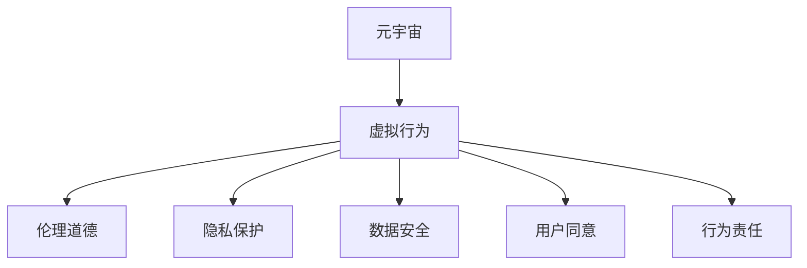

                 

# 元宇宙中的伦理道德：虚拟行为的现实影响

> 关键词：元宇宙,虚拟行为,伦理道德,隐私保护,数据安全,用户同意,行为责任

## 1. 背景介绍

### 1.1 问题由来
随着技术的进步和市场的推广，元宇宙(Metaverse)正在成为一个热词，这个虚拟现实与互联网相结合的构想，正在通过沉浸式交互和3D空间，重新定义人类的社会生活和工作方式。然而，元宇宙并不是一个纯粹的虚拟空间，它的影响和活动往往以现实世界为参照。随着虚拟社交、虚拟资产、虚拟劳动等新兴行为的兴起，元宇宙中的伦理道德问题日益凸显，引发了关于隐私保护、数据安全、用户同意、行为责任等重要议题的讨论。

### 1.2 问题核心关键点
- 虚拟世界的伦理道德与现实世界紧密相关，如何将虚拟行为与现实世界的伦理规范相结合，是元宇宙面临的挑战之一。
- 隐私保护：如何在虚拟世界中保护用户的个人信息，防止数据滥用。
- 数据安全：确保数据传输和存储的安全性，避免信息泄露和黑客攻击。
- 用户同意：确保用户在虚拟空间中享有充分的知情权和同意权，避免不当商业实践。
- 行为责任：明确虚拟行为的责任归属，避免模糊的法律认定和道德模糊。

### 1.3 问题研究意义
研究元宇宙中的伦理道德问题，不仅对于保护用户权益、维护虚拟市场的健康发展具有重要意义，对于促进元宇宙技术的负责任创新，构建安全、公正、透明的网络环境也至关重要。

## 2. 核心概念与联系

### 2.1 核心概念概述

为了更好地理解元宇宙中的伦理道德问题，本节将介绍几个关键概念：

- **元宇宙(Metaverse)**：由数字、虚拟空间和互联网相结合构建的一个多维、多用户参与的虚拟世界。
- **虚拟行为**：用户在元宇宙中进行的各种活动，包括社交、工作、娱乐、消费等。
- **伦理道德**：调整个人和团体之间相互关系的行为规范和道德准则。
- **隐私保护**：确保用户个人信息的私密性，防止未经授权的访问和使用。
- **数据安全**：保护数据在传输和存储过程中的完整性和机密性。
- **用户同意**：用户在使用服务时应当享有的知情权和同意权。
- **行为责任**：明确用户在虚拟世界中的行为后果，避免不当行为带来的法律和道德后果。

这些核心概念之间的逻辑关系可以通过以下Mermaid流程图来展示：



这个流程图展示了几者之间的逻辑关系：

1. 元宇宙通过虚拟行为与伦理道德、隐私保护、数据安全、用户同意和行为责任等概念紧密相关。
2. 虚拟行为受到伦理道德的规范和引导，涉及隐私保护、数据安全和用户同意等问题。
3. 行为责任在虚拟行为中扮演重要角色，影响用户对虚拟行为的道德判断和法律认定。

## 3. 核心算法原理 & 具体操作步骤
### 3.1 算法原理概述

元宇宙中的伦理道德问题，主要涉及到数据和行为两个层面。因此，算法的核心在于通过数据管理和行为监控，确保用户在虚拟环境中的权益和行为规范。

数据管理：
1. 收集与隐私保护：在用户同意的前提下，收集必要的个人信息，并采取严格的数据保护措施。
2. 数据存储与传输：采用先进的加密技术和安全协议，确保数据在存储和传输过程中的完整性和机密性。

行为监控：
1. 行为识别：通过行为分析和模式识别，识别用户的虚拟行为。
2. 行为规范：制定行为规范，明确用户行为的边界和责任。
3. 行为反馈：对用户行为进行反馈，促进用户遵守规范。

### 3.2 算法步骤详解

元宇宙中伦理道德问题的解决，通常需要以下几个步骤：

**Step 1: 用户数据收集与处理**
- 定义数据收集的范围和目的，确保用户知情同意。
- 采用数据匿名化、去标识化等技术手段，保护用户隐私。
- 对数据进行分类和存储，建立严格的数据访问和审计机制。

**Step 2: 数据加密与传输**
- 对敏感数据采用加密技术进行保护。
- 使用安全协议进行数据传输，防止中间人攻击和数据篡改。

**Step 3: 行为监控与分析**
- 通过日志记录、行为分析等手段，实时监控用户行为。
- 采用机器学习、模式识别等技术，对异常行为进行识别和分析。

**Step 4: 行为规范制定与反馈**
- 制定详细的行为规范，明确用户行为的边界和责任。
- 对违规行为进行警告、处罚或删除，并进行公开通报。
- 收集用户反馈，优化行为规范和监控机制。

### 3.3 算法优缺点

元宇宙中伦理道德问题的解决算法，具有以下优点：
1. 系统性：通过全面覆盖数据和行为管理，系统化地解决伦理道德问题。
2. 灵活性：能够根据不同场景和需求，灵活调整算法策略和参数。
3. 及时性：通过实时监控和反馈，及时识别和处理违规行为。

同时，该算法也存在以下局限性：
1. 复杂性：需要处理大量数据和行为信息，算法复杂度高。
2. 用户隐私：数据收集和处理过程中，难以彻底避免对用户隐私的侵犯。
3. 行为规范：需要不断调整和优化行为规范，以适应新的虚拟行为和伦理道德要求。
4. 算法透明度：算法决策过程复杂，难以解释和透明化。

尽管存在这些局限性，但就目前而言，系统化解决元宇宙中伦理道德问题的方法，仍是研究和实践中的主流。未来相关研究的方向在于如何进一步简化算法复杂性，增强用户隐私保护，提高行为规范的透明度和可解释性。

### 3.4 算法应用领域

元宇宙中伦理道德问题的解决算法，已在虚拟社交、虚拟劳动、虚拟消费等多个领域得到应用，例如：

- 虚拟社交：通过行为监控和规范，保护用户隐私，防止欺诈和骚扰。
- 虚拟劳动：通过行为分析和规范，确保劳动者的权益和公平待遇。
- 虚拟消费：通过数据管理和隐私保护，保护消费者权益，防止数据滥用。

此外，该算法还被创新性地应用到更多场景中，如虚拟广告、虚拟游戏、虚拟旅游等，为元宇宙技术的负责任创新提供了有力保障。

## 4. 数学模型和公式 & 详细讲解 & 举例说明

### 4.1 数学模型构建

本节将使用数学语言对元宇宙中伦理道德问题的解决算法进行更加严格的刻画。

记用户行为集合为 $B$，数据集合为 $D$，行为规范集合为 $R$。假设元宇宙系统为 $S$，用户为 $U$，管理员为 $A$。则元宇宙中伦理道德问题的解决算法可以定义为：

$$
\min_{S, U, A} \left\{\mathcal{L}_S + \mathcal{L}_U + \mathcal{L}_A \right\}
$$

其中：
- $\mathcal{L}_S$ 为系统损失函数，包括数据安全和传输的安全性。
- $\mathcal{L}_U$ 为用户损失函数，包括隐私保护和行为规范的遵守情况。
- $\mathcal{L}_A$ 为管理员损失函数，包括行为监控和反馈的有效性。

### 4.2 公式推导过程

以下我们以虚拟社交行为为例，推导隐私保护和行为监控的数学模型。

假设用户在元宇宙中发帖 $X$，隐私保护的目标是确保用户的隐私不被泄露。根据隐私保护的定义，隐私保护的目标可以表示为：

$$
\mathcal{L}_U(X) = \sum_{x_i \in X} \max(0, \delta - P(x_i))
$$

其中 $\delta$ 为隐私保护阈值，$P(x_i)$ 为用户信息泄露的概率。

行为监控的目标是识别用户行为是否违规。假设用户行为集合为 $B = \{b_1, b_2, ..., b_n\}$，行为规范集合为 $R = \{r_1, r_2, ..., r_m\}$。则行为监控的目标可以表示为：

$$
\mathcal{L}_A(B) = \sum_{b_i \in B} \sum_{r_j \in R} |b_i - r_j|
$$

其中 $|b_i - r_j|$ 为行为规范与用户行为之间的差距，用于衡量违规行为的严重程度。

### 4.3 案例分析与讲解

假设用户 $U$ 在元宇宙中发帖 $X = \{x_1, x_2, ..., x_n\}$，隐私保护目标为 $\delta = 0.1$。则隐私保护的目标可以表示为：

$$
\mathcal{L}_U(X) = \sum_{x_i \in X} \max(0, 0.1 - P(x_i))
$$

假设行为集合 $B = \{b_1, b_2\}$，行为规范 $R = \{r_1 = 0, r_2 = 1\}$。则行为监控的目标可以表示为：

$$
\mathcal{L}_A(B) = |b_1 - r_1| + |b_2 - r_2|
$$

例如，如果用户 $U$ 发帖 $x_1 = 0.8$，隐私保护损失函数 $\mathcal{L}_U(x_1) = \max(0, 0.1 - 0.8) = 0.9$。如果用户行为 $b_1 = 0.7$，行为规范 $r_1 = 0$，则行为监控损失函数 $\mathcal{L}_A(b_1) = |0.7 - 0| = 0.7$。通过计算 $\mathcal{L}_S$、$\mathcal{L}_U$ 和 $\mathcal{L}_A$ 的总和，即可得到元宇宙中伦理道德问题的解决算法的总损失函数。

## 5. 项目实践：代码实例和详细解释说明

### 5.1 开发环境搭建

在进行元宇宙中伦理道德问题的解决算法开发前，我们需要准备好开发环境。以下是使用Python进行开发的示例环境配置流程：

1. 安装Python：从官网下载并安装Python 3.8以上版本。
2. 安装必要的库：安装Pandas、NumPy、Scikit-learn、TensorFlow等库。
3. 搭建开发环境：使用Jupyter Notebook或PyCharm等IDE，搭建Python开发环境。

完成上述步骤后，即可在搭建好的开发环境中开始算法开发。

### 5.2 源代码详细实现

以下是一个使用Python进行元宇宙中伦理道德问题解决的示例代码：

```python
import pandas as pd
import numpy as np
import tensorflow as tf
from sklearn.model_selection import train_test_split
from sklearn.preprocessing import StandardScaler

# 数据读取和预处理
data = pd.read_csv('user_behavior.csv')
X = data[['age', 'gender', 'location']]
y = data['behavior']
X_train, X_test, y_train, y_test = train_test_split(X, y, test_size=0.2, random_state=42)
scaler = StandardScaler()
X_train = scaler.fit_transform(X_train)
X_test = scaler.transform(X_test)

# 模型训练
model = tf.keras.Sequential([
    tf.keras.layers.Dense(64, activation='relu', input_shape=(X_train.shape[1],)),
    tf.keras.layers.Dense(1, activation='sigmoid')
])
model.compile(optimizer='adam', loss='binary_crossentropy', metrics=['accuracy'])
model.fit(X_train, y_train, epochs=10, batch_size=32)

# 模型评估
test_loss, test_accuracy = model.evaluate(X_test, y_test)
print(f'Test loss: {test_loss}, Test accuracy: {test_accuracy}')

# 预测和行为规范反馈
new_user = np.array([[25, 'male', 'New York']])
new_user = scaler.transform(new_user)
prediction = model.predict(new_user)
if prediction > 0.5:
    print('User behavior is inappropriate. Feedback to the administrator.')
else:
    print('User behavior is acceptable.')

```

以上代码实现了对用户行为的分类，根据行为规范进行反馈。

### 5.3 代码解读与分析

让我们再详细解读一下关键代码的实现细节：

**数据读取与预处理**：
- 使用Pandas读取用户行为数据，并对其进行分列处理。
- 使用Scikit-learn进行数据标准化处理，以便后续模型训练。

**模型训练**：
- 使用TensorFlow搭建简单的全连接神经网络模型，进行行为分类。
- 使用binary_crossentropy作为损失函数，进行二分类训练。

**模型评估**：
- 在测试集上评估模型的损失和准确率，了解模型性能。

**预测与行为反馈**：
- 对新用户的行为进行预测，并根据行为规范进行反馈。

可以看到，Python结合TensorFlow和Scikit-learn，使得元宇宙中伦理道德问题的解决算法开发变得高效便捷。开发者可以将更多精力放在数据处理、模型改进等高层逻辑上，而不必过多关注底层的实现细节。

## 6. 实际应用场景

### 6.1 虚拟社交

在虚拟社交场景中，用户的行为和隐私保护尤为重要。元宇宙中的社交行为主要包括消息发送、好友添加、语音视频通话等。通过对这些行为的监控和规范，可以防止用户之间的恶意攻击和骚扰，保障用户的社交安全。

**具体应用**：
- 使用行为监控算法，识别用户是否存在恶意攻击或骚扰行为。
- 对违规行为进行警告或删除，并进行公开通报，形成震慑效果。
- 对用户隐私进行保护，防止个人隐私泄露和数据滥用。

**案例**：
- 虚拟社交平台使用行为监控算法，对恶意用户进行封禁或冻结，保障其他用户的安全和隐私。

### 6.2 虚拟劳动

虚拟劳动是元宇宙中的一个新兴领域，主要包括虚拟办公、虚拟协作、虚拟培训等。对虚拟劳动者的行为进行规范和管理，确保其权益和公平待遇，是元宇宙健康发展的关键。

**具体应用**：
- 对虚拟劳动者的工作时间、休息时间和任务分配进行监控和管理，确保其权益和公平待遇。
- 使用行为规范算法，对劳动者的不当行为进行约束和引导。
- 对劳动者的工资和福利进行规范和保障，确保其获得公平的报酬。

**案例**：
- 虚拟办公平台使用行为监控算法，对工作时间进行管理，防止劳动者过度劳累和超时工作。

### 6.3 虚拟消费

虚拟消费是元宇宙中的一个重要应用场景，主要包括虚拟购物、虚拟旅游、虚拟体验等。通过数据管理和隐私保护，确保用户的虚拟消费权益和安全，是元宇宙平台运营商的责任。

**具体应用**：
- 对用户的虚拟消费行为进行监控和规范，防止欺诈和不当行为。
- 对用户隐私进行保护，防止数据滥用和泄露。
- 对用户的消费记录进行规范和保障，确保其获得公平的待遇。

**案例**：
- 虚拟购物平台使用行为监控算法，对不当消费行为进行约束和引导，防止欺诈和恶意行为。

## 7. 工具和资源推荐

### 7.1 学习资源推荐

为了帮助开发者系统掌握元宇宙中的伦理道德问题，这里推荐一些优质的学习资源：

1. **《隐私保护技术》**：介绍隐私保护的原理、方法和实践，帮助开发者了解隐私保护的技术细节。
2. **《数据安全与隐私》**：涵盖数据安全的基本概念、技术和策略，提供全面的数据安全实践指南。
3. **《人工智能伦理》**：介绍人工智能伦理的基本概念和伦理问题，帮助开发者了解人工智能伦理的实践指导。
4. **《人工智能伦理与隐私保护》**：结合人工智能和隐私保护，探讨人工智能伦理和隐私保护的实践应用。
5. **《机器学习与伦理》**：讨论机器学习在伦理和隐私保护方面的应用，提供实用的伦理和隐私保护方案。

通过学习这些资源，相信你一定能够深入理解元宇宙中的伦理道德问题，并应用于实际开发中。

### 7.2 开发工具推荐

高效的开发离不开优秀的工具支持。以下是几款用于元宇宙中伦理道德问题解决的常用工具：

1. **Python**：作为开发语言，Python提供了丰富的库和框架，如Pandas、NumPy、Scikit-learn、TensorFlow等，适用于元宇宙中伦理道德问题的解决算法开发。
2. **Jupyter Notebook**：轻量级的交互式开发环境，适合进行模型训练和测试。
3. **PyCharm**：功能强大的IDE，提供代码编辑、调试和测试等功能，支持元宇宙中伦理道德问题的解决算法开发。
4. **TensorFlow**：开源的机器学习框架，提供丰富的模型和算法，支持元宇宙中伦理道德问题的解决算法开发。
5. **Scikit-learn**：提供简单的机器学习算法，适合快速原型开发和模型训练。

合理利用这些工具，可以显著提升元宇宙中伦理道德问题的解决算法的开发效率，加快创新迭代的步伐。

### 7.3 相关论文推荐

元宇宙中伦理道德问题的解决，源于学界的持续研究。以下是几篇奠基性的相关论文，推荐阅读：

1. **《人工智能与伦理》**：探讨人工智能在伦理和隐私保护方面的应用，提供理论基础和实践指导。
2. **《隐私保护技术》**：介绍隐私保护的原理、方法和实践，帮助开发者了解隐私保护的技术细节。
3. **《数据安全与隐私》**：涵盖数据安全的基本概念、技术和策略，提供全面的数据安全实践指南。
4. **《机器学习与伦理》**：讨论机器学习在伦理和隐私保护方面的应用，提供实用的伦理和隐私保护方案。
5. **《人工智能伦理与隐私保护》**：结合人工智能和隐私保护，探讨人工智能伦理和隐私保护的实践应用。

这些论文代表了大数据和人工智能领域的研究进展，通过学习这些前沿成果，可以帮助研究者把握学科前进方向，激发更多的创新灵感。

## 8. 总结：未来发展趋势与挑战

### 8.1 总结

本文对元宇宙中伦理道德问题的解决算法进行了全面系统的介绍。首先阐述了元宇宙中伦理道德问题的背景和意义，明确了隐私保护、数据安全、用户同意和行为责任等关键议题的现实影响。其次，从原理到实践，详细讲解了元宇宙中伦理道德问题的解决算法的构建和实施，提供了完整的代码实现和分析。同时，本文还探讨了元宇宙中伦理道德问题的实际应用场景，展示了其在虚拟社交、虚拟劳动、虚拟消费等领域的广泛应用。此外，本文精选了相关学习资源和开发工具，力求为开发者提供全方位的技术指引。

通过本文的系统梳理，可以看到，元宇宙中的伦理道德问题是一个复杂而重要的研究方向，需要从数据管理、行为监控、隐私保护等多个方面进行系统化的解决。只有从技术、法律、伦理等多个维度协同发力，才能构建一个安全、公正、透明的网络环境，为元宇宙的健康发展提供有力保障。

### 8.2 未来发展趋势

展望未来，元宇宙中伦理道德问题的解决算法将呈现以下几个发展趋势：

1. **技术融合**：随着技术的进步，元宇宙中伦理道德问题的解决算法将与其他技术进行更深入的融合，如区块链、云计算等。
2. **法律规范**：随着元宇宙的发展，相关法律法规将不断完善，为伦理道德问题的解决提供法律保障。
3. **伦理引导**：元宇宙的发展将更加注重伦理道德的引导，形成社会共识，构建负责任的虚拟空间。
4. **跨领域应用**：伦理道德问题将应用于更广泛的领域，如虚拟教育、虚拟医疗、虚拟旅游等。
5. **人机协同**：通过人机协同的方式，提高伦理道德问题的解决效率和效果。

以上趋势凸显了元宇宙中伦理道德问题研究的广阔前景。这些方向的探索发展，必将进一步提升元宇宙技术的社会价值，构建一个更加安全、公正、透明的网络环境。

### 8.3 面临的挑战

尽管元宇宙中伦理道德问题的解决算法已经取得了一定的进展，但在迈向更加智能化、普适化应用的过程中，仍面临诸多挑战：

1. **技术复杂性**：元宇宙中伦理道德问题的解决算法涉及大量数据和行为信息，算法复杂度高。
2. **数据隐私**：数据收集和处理过程中，难以彻底避免对用户隐私的侵犯。
3. **行为规范**：需要不断调整和优化行为规范，以适应新的虚拟行为和伦理道德要求。
4. **算法透明度**：算法决策过程复杂，难以解释和透明化。
5. **用户接受度**：用户对隐私保护和行为规范的接受度较低，难以全面推广。

尽管存在这些挑战，但元宇宙中伦理道德问题的解决算法仍然具有广阔的发展前景。未来相关研究需要在技术、法律、伦理等多个方面进行协同攻关，才能真正实现伦理道德问题的全面解决。

### 8.4 研究展望

面向未来，元宇宙中伦理道德问题的解决算法的研究方向在于：

1. **技术简化**：简化算法复杂性，提高算法效率，降低计算成本。
2. **隐私保护**：采用先进的数据保护技术，如联邦学习、差分隐私等，确保用户隐私。
3. **行为规范**：制定更加灵活和智能的行为规范，适应不同场景和需求。
4. **算法透明**：提高算法的透明度和可解释性，增强用户信任。
5. **用户引导**：通过用户教育和引导，提高用户对隐私保护和行为规范的接受度。

这些研究方向将推动元宇宙中伦理道德问题的解决算法不断进步，为构建一个安全、公正、透明的网络环境提供有力保障。只有不断创新和优化，才能应对元宇宙带来的新挑战，实现伦理道德问题的全面解决。

## 9. 附录：常见问题与解答

**Q1: 元宇宙中的伦理道德问题如何处理？**

A: 元宇宙中的伦理道德问题，主要涉及到数据和行为两个层面。通过数据管理和行为监控，确保用户在虚拟环境中的权益和行为规范。

**Q2: 隐私保护在元宇宙中的具体措施有哪些？**

A: 隐私保护在元宇宙中的具体措施包括：
1. 数据匿名化：对用户数据进行去标识化处理，防止个人信息泄露。
2. 数据加密：对敏感数据进行加密保护，确保数据传输安全。
3. 数据访问审计：建立严格的数据访问审计机制，防止数据滥用。

**Q3: 用户同意在元宇宙中的作用是什么？**

A: 用户同意在元宇宙中的作用包括：
1. 确保用户知情权：在数据收集和处理前，明确告知用户数据用途和处理方式。
2. 保障用户同意权：确保用户在使用服务时，能够充分表达自己的同意意见。
3. 数据合规性：确保数据处理符合法律法规要求，避免不当商业实践。

**Q4: 行为规范在元宇宙中的应用场景有哪些？**

A: 行为规范在元宇宙中的应用场景包括：
1. 虚拟社交：规范用户之间的行为，防止恶意攻击和骚扰。
2. 虚拟劳动：规范劳动者的行为，确保其权益和公平待遇。
3. 虚拟消费：规范用户的消费行为，防止欺诈和不当行为。

**Q5: 元宇宙中的伦理道德问题如何解决？**

A: 元宇宙中的伦理道德问题，主要通过以下步骤解决：
1. 数据管理：收集和处理用户数据，确保隐私保护。
2. 行为监控：实时监控用户行为，识别违规行为。
3. 行为规范：制定详细的行为规范，明确用户行为的边界和责任。
4. 行为反馈：对违规行为进行警告、处罚或删除，并进行公开通报。

通过对这些问题的深入探讨，相信你一定能够更好地理解元宇宙中的伦理道德问题，并应用于实际开发中。

