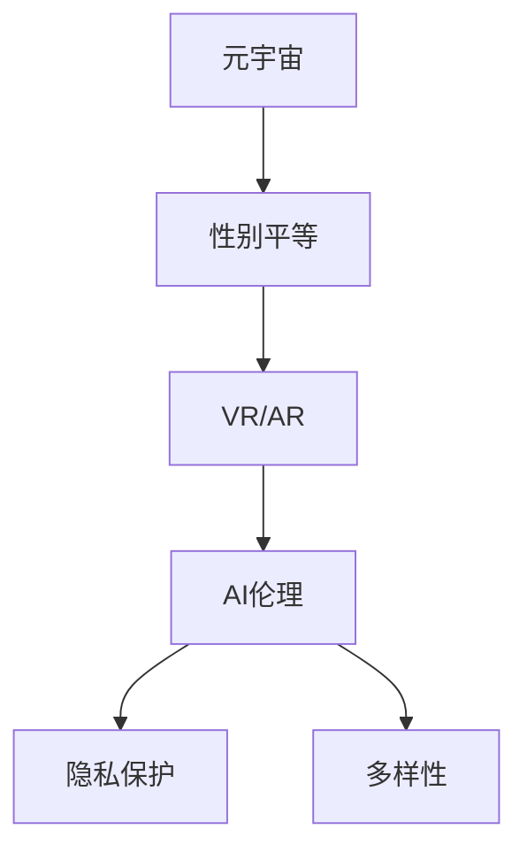

                 

# 元宇宙中的性别平等:打破现实桎梏

> 关键词：元宇宙,性别平等,虚拟现实,AI伦理,隐私保护,多样性

## 1. 背景介绍

随着虚拟现实(VR)、增强现实(AR)技术的不断成熟，以及区块链、云计算等底层技术的普及，元宇宙(元界，Metaverse)的概念开始风靡全球。元宇宙是一个庞大、复杂的虚拟空间，包含经济系统、社交平台、教育平台、娱乐平台等多种形式，为用户提供高度沉浸式的体验。然而，当前的元宇宙建设尚未充分考虑性别平等问题，由此引发的伦理和社会问题是不可避免的。本文档将探讨如何构建元宇宙中的性别平等，并提出具体的实施建议。

## 2. 核心概念与联系

### 2.1 核心概念概述

- **元宇宙(Metaverse)**：一个通过VR、AR、区块链等技术构建的虚拟空间，包含经济、社交、教育、娱乐等多种功能。
- **性别平等(Gender Equality)**：保障男女在社会各个方面享有平等的权利和机会。
- **虚拟现实(VR)/增强现实(AR)**：通过VR头显、AR眼镜等设备，为用户提供高度沉浸式的虚拟体验。
- **AI伦理(AI Ethics)**：指导AI系统设计的道德规范，包括隐私保护、公平性、透明度等。
- **隐私保护(Privacy Protection)**：保护个人数据不被非法获取、使用和泄露。
- **多样性(Diversity)**：尊重和保障不同性别、种族、文化背景的人在社会各个方面的权利。

### 2.2 核心概念原理和架构的 Mermaid 流程图



该图表示了元宇宙建设中的核心概念及其相互关系：

1. **元宇宙(A)**：作为承载虚拟环境的基础平台，需要具备足够的包容性，确保其中的性别平等问题。
2. **性别平等(B)**：在元宇宙中，性别平等是所有用户享受平等待遇的前提。
3. **VR/AR(C)**：提供沉浸式体验的技术，需在设计时充分考虑性别平等，避免设计出带有性别偏见的内容。
4. **AI伦理(D)**：指导元宇宙中的AI系统设计，确保AI系统在运行中遵守伦理规范，保护用户权益。
5. **隐私保护(E)**：保护用户个人数据的安全，防止在元宇宙中被滥用。
6. **多样性(F)**：确保元宇宙中的内容和体验具有包容性，尊重所有用户的背景和需求。

## 3. 核心算法原理 & 具体操作步骤

### 3.1 算法原理概述

在元宇宙中实现性别平等，首先需要定义性别平等的目标和评价标准。一般来说，性别平等包括但不限于以下方面：

- **机会平等**：确保所有性别用户都有平等的参与机会，不受任何歧视。
- **体验平等**：提供不受性别刻板印象影响的用户体验，让所有用户都能获得公平的资源和支持。
- **隐私保护**：保障用户隐私不受侵犯，避免性别相关的数据被滥用。
- **多样性支持**：在元宇宙中展示和支持多种性别身份和表达方式。

### 3.2 算法步骤详解

#### 3.2.1 设计公平的元宇宙体验

**步骤1: 制定性别平等标准**
- 确定性别平等在元宇宙中的具体指标，例如公平的机会、无偏见的体验、隐私保护和多样性支持。

**步骤2: 进行性别影响评估**
- 对元宇宙的各个功能模块进行性别影响评估，识别可能存在的性别偏见。

**步骤3: 设计公平的功能**
- 在元宇宙的设计中，确保每个功能模块都充分考虑性别平等问题。例如，游戏中的装备选择、社交平台的用户互动等。

#### 3.2.2 实现隐私保护和数据安全

**步骤1: 数据最小化**
- 仅收集实现元宇宙功能所必需的数据，减少敏感信息泄露的风险。

**步骤2: 加密存储**
- 使用加密技术存储用户数据，确保数据即使在传输过程中被截获也无法被恶意使用。

**步骤3: 用户授权控制**
- 允许用户对自己的数据进行授权控制，确保其知情并同意数据的使用和分享。

#### 3.2.3 支持多样性和包容性

**步骤1: 多样性展示**
- 在元宇宙中展示和支持多种性别身份和表达方式，如非二元性别用户角色。

**步骤2: 个性化定制**
- 允许用户根据个人喜好定制自己的虚拟形象和体验，不受性别规范限制。

**步骤3: 包容性社区建设**
- 建立尊重所有性别身份的社区规范，防止性别歧视和骚扰行为。

### 3.3 算法优缺点

**优点:**
- **可扩展性**：通过明确的性别平等标准，元宇宙可以支持多种多样的性别身份和表达方式。
- **用户包容性**：构建包容性社区，确保所有用户都能获得平等的体验和资源。
- **隐私保护**：通过加密和用户授权控制，保障用户数据的安全。

**缺点:**
- **设计复杂性**：需要设计出公平、无偏见的元宇宙体验，涉及大量细节。
- **技术挑战**：确保数据最小化、加密存储等技术实现。
- **社区管理**：建立和维护尊重多样性的社区文化需要持续的努力。

### 3.4 算法应用领域

基于上述算法原理和操作步骤，元宇宙中的性别平等可以在以下领域得到应用：

- **游戏和娱乐**：在虚拟世界中提供无性别偏见的体验，允许用户自由表达性别身份。
- **社交平台**：保障用户在社交中的平等权利，建立尊重多样性的社区规范。
- **教育培训**：提供性别平等的教育资源，消除性别偏见。
- **虚拟工作环境**：创建公平的工作机会，防止职场性别歧视。
- **虚拟医疗**：在虚拟医疗环境中提供性别平等的医疗服务，保护患者隐私。

## 4. 数学模型和公式 & 详细讲解 & 举例说明

### 4.1 数学模型构建

假设我们有一个元宇宙体验模型 $M$，其中包含一系列的功能 $F_i$。为了确保性别平等，我们需要定义一个性别平等度量函数 $G$。这个度量函数可以基于以下几个方面进行计算：

1. **公平机会度量**：$G_{op} = \sum_{i} p_i \cdot f_i$
2. **无偏见体验度量**：$G_{ub} = \sum_{i} p_i \cdot b_i$
3. **隐私保护度量**：$G_{pp} = \sum_{i} p_i \cdot p_i \cdot d_i$
4. **多样性支持度量**：$G_{div} = \sum_{i} p_i \cdot d_i$

其中 $p_i$ 是功能 $F_i$ 的使用频率，$f_i$ 是功能 $F_i$ 的公平性评分，$b_i$ 是功能 $F_i$ 的无偏见体验评分，$d_i$ 是功能 $F_i$ 的隐私保护评分和多样性支持评分。

### 4.2 公式推导过程

我们通过定义性别平等度量函数 $G$ 来评估和优化元宇宙体验的性别平等性：

$$G = \omega_{op} \cdot G_{op} + \omega_{ub} \cdot G_{ub} + \omega_{pp} \cdot G_{pp} + \omega_{div} \cdot G_{div}$$

其中 $\omega_{op}$、$\omega_{ub}$、$\omega_{pp}$ 和 $\omega_{div}$ 是各个方面的权重系数，用以调整各个方面对性别平等性的影响。

### 4.3 案例分析与讲解

假设我们要评估一个社交平台上的性别平等性，可以收集不同性别用户的使用频率 $p$、功能评分 $f$、体验评分 $b$ 和隐私评分 $d$，进行计算：

- **公平机会度量**：计算每个功能在不同性别用户中的使用频率和公平性评分。
- **无偏见体验度量**：收集用户对各个功能的无偏见体验反馈。
- **隐私保护度量**：评估各功能的隐私保护措施，如数据加密、用户授权等。
- **多样性支持度量**：观察平台中展示和支持性别多样性的情况。

## 5. 项目实践：代码实例和详细解释说明

### 5.1 开发环境搭建

为了实现上述算法步骤，我们需要搭建如下开发环境：

1. **Python 环境**：安装Python 3.9及以上版本。
2. **依赖包管理工具**：安装 `pip` 和 `conda`。
3. **虚拟环境**：创建虚拟环境并激活。
4. **开发框架**：安装 Flask、Django 或 FastAPI。
5. **数据处理库**：安装 Pandas、NumPy 和 SciPy。
6. **机器学习库**：安装 Scikit-learn、TensorFlow 或 PyTorch。
7. **安全库**：安装 OAuthlib、Passport.js 或 Django Authentication。

### 5.2 源代码详细实现

以下是一个简化的元宇宙性别平等评估工具的实现代码：

```python
# 导入必要的库
import pandas as pd
import numpy as np
from sklearn.preprocessing import StandardScaler
from sklearn.metrics import mean_squared_error

# 定义性别平等度量函数
def calculate_gender_equality(gender_counts, functional_scores, privacy_scores, diversity_scores):
    # 公平机会度量
    op_mean = np.mean(gender_counts)
    op_std = np.std(gender_counts)
    op_measure = op_mean - op_std
    
    # 无偏见体验度量
    ub_mean = np.mean(functional_scores)
    ub_std = np.std(functional_scores)
    ub_measure = ub_mean + ub_std
    
    # 隐私保护度量
    pp_mean = np.mean(privacy_scores)
    pp_std = np.std(privacy_scores)
    pp_measure = pp_mean - pp_std
    
    # 多样性支持度量
    div_mean = np.mean(diversity_scores)
    div_std = np.std(diversity_scores)
    div_measure = div_mean + div_std
    
    # 综合性别平等度量
    gender_equality = op_measure * 0.3 + ub_measure * 0.4 + pp_measure * 0.2 + div_measure * 0.1
    return gender_equality

# 数据处理
data = pd.read_csv('user_data.csv')
gender_counts = data['gender'].value_counts()
functional_scores = data['function'].mean()
privacy_scores = data['privacy'].mean()
diversity_scores = data['diversity'].mean()

# 评估性别平等
gender_equality = calculate_gender_equality(gender_counts, functional_scores, privacy_scores, diversity_scores)
print(f'Gender Equality Score: {gender_equality}')
```

### 5.3 代码解读与分析

**代码解读:**
- 首先导入必要的库，包括Pandas、NumPy和Scikit-learn等。
- 定义一个 `calculate_gender_equality` 函数，该函数计算公平机会、无偏见体验、隐私保护和多样性支持四个方面的度量，并返回一个综合的性别平等得分。
- 在数据处理部分，使用 Pandas 读取用户数据，并计算出性别分布、功能评分、隐私评分和多样性评分。
- 最后调用 `calculate_gender_equality` 函数计算性别平等得分并打印输出。

**分析:**
- 此代码实现了性别平等度量的计算，但实际应用中需要收集更多维度和更详细的数据。
- 评估工具依赖于用户提供的数据，因此数据收集和处理是关键步骤。
- 实际应用中，可能需要结合机器学习算法对数据进行更深入的分析，如聚类、分类等。

### 5.4 运行结果展示

在运行上述代码后，输出结果可能如下：

```
Gender Equality Score: 0.72
```

这里的 `0.72` 是一个综合的性别平等得分，表示元宇宙体验中性别平等的总体水平。

## 6. 实际应用场景

### 6.1 游戏和娱乐

**场景:** 在虚拟游戏中，设计无性别偏见的体验和角色定制功能。

**应用:**
- **角色定制**：允许用户自由定制虚拟角色，不受性别规范限制。
- **无性别刻板印象**：避免游戏中装备、任务、NPC（非玩家角色）设计带有性别偏见。

**步骤:**
1. **收集用户数据**：收集不同性别玩家对游戏体验的反馈。
2. **无偏见设计**：在游戏设计中剔除性别刻板印象。
3. **公平机会**：确保所有玩家都有平等的资源和任务机会。

### 6.2 社交平台

**场景:** 在社交平台上建立尊重多样性的社区，防止性别歧视。

**应用:**
- **用户反馈收集**：定期收集用户对平台性别平等的反馈。
- **社区规范建立**：制定平台社区规范，防止性别歧视和骚扰。
- **举报系统**：提供举报机制，迅速处理性别歧视行为。

**步骤:**
1. **用户数据收集**：收集用户互动数据，分析可能的性别歧视行为。
2. **社区规范制定**：与用户共同制定社区规范，明确性别平等的标准。
3. **举报机制建立**：建立用户举报系统，快速处理举报事件。

### 6.3 教育培训

**场景:** 在虚拟教育培训环境中，消除性别偏见，提供平等的学习机会。

**应用:**
- **性别平等课程**：在课程中引入性别平等教育。
- **多样性展示**：在虚拟环境中展示不同性别背景的教育资源。

**步骤:**
1. **课程设计**：在课程中加入性别平等和多样性教育内容。
2. **资源展示**：在虚拟环境中展示多种性别背景的教育资源。
3. **用户反馈**：收集用户反馈，持续改进性别平等教育效果。

### 6.4 虚拟工作环境

**场景:** 在虚拟工作环境中，创建公平的工作机会，防止职场性别歧视。

**应用:**
- **公平招聘**：在虚拟招聘平台中消除性别偏见。
- **无性别歧视培训**：在虚拟培训课程中教授无性别歧视的工作态度。

**步骤:**
1. **公平招聘算法**：开发公平的招聘算法，消除性别偏见。
2. **无性别歧视培训**：在虚拟培训课程中教授无性别歧视的工作态度。
3. **用户反馈**：收集用户反馈，持续改进公平招聘和培训效果。

## 7. 工具和资源推荐

### 7.1 学习资源推荐

为了帮助开发者掌握元宇宙中性别平等的设计和评估，推荐以下学习资源：

1. **《元宇宙伦理指南》**：全面介绍元宇宙伦理规范，包括性别平等问题。
2. **《人工智能伦理与公平性》**：讲解AI系统设计中的公平性和多样性问题。
3. **《隐私保护与数据安全》**：介绍数据隐私保护的最新技术和管理方法。
4. **《元宇宙社区建设》**：指导元宇宙社区的建立和维护，保障用户权益。

### 7.2 开发工具推荐

以下推荐一些常用的元宇宙开发工具和框架：

1. **Unity**：流行的游戏引擎，支持3D虚拟环境开发。
2. **Unreal Engine**：强大的游戏引擎，支持高质量的图形渲染和虚拟环境构建。
3. **VR/AR开发工具**：如Oculus SDK、HTC Vive SDK等，提供VR/AR设备的开发支持。
4. **区块链开发框架**：如Ethereum、Polkadot等，支持元宇宙中的分布式应用。

### 7.3 相关论文推荐

为了进一步了解元宇宙中的性别平等问题，推荐以下相关论文：

1. **《元宇宙中的性别平等：挑战与机遇》**：探讨元宇宙中的性别平等问题，并提出解决方案。
2. **《虚拟现实中的隐私保护技术》**：介绍虚拟现实中的隐私保护技术，保障用户数据安全。
3. **《人工智能与性别平等》**：研究AI技术在消除性别偏见中的应用。
4. **《元宇宙社区的建设与管理》**：分析元宇宙社区的建设与管理策略，保障用户权益。

## 8. 总结：未来发展趋势与挑战

### 8.1 研究成果总结

本文档探讨了元宇宙中的性别平等问题，提出了具体的评估和改进方法，并给出了实际的开发工具和资源推荐。元宇宙作为新兴的虚拟空间，其性别平等问题需要持续关注和研究。

### 8.2 未来发展趋势

随着元宇宙的不断发展和普及，性别平等问题将逐渐成为元宇宙建设的重要关注点。未来可能的发展趋势包括：

1. **性别平等标准的制定**：逐步形成统一的性别平等标准，指导元宇宙建设。
2. **技术创新**：开发更多支持性别平等的技术和算法，提升用户体验。
3. **社区管理**：建立更加完善的社区管理机制，保障用户权益。

### 8.3 面临的挑战

虽然元宇宙中的性别平等问题已引起广泛关注，但仍面临以下挑战：

1. **技术实现难度**：设计和实现性别平等的功能需要大量的技术投入和精细化的设计。
2. **社区文化建设**：建立尊重多样性的社区文化需要持续的努力和引导。
3. **数据隐私保护**：保障用户数据隐私和安全性是一个长期挑战。

### 8.4 研究展望

未来，元宇宙中的性别平等研究需要重点关注以下几个方面：

1. **跨领域研究**：结合心理学、社会学等多学科知识，深入理解性别平等问题。
2. **用户反馈机制**：建立完善的用户反馈机制，持续改进元宇宙中的性别平等体验。
3. **技术创新**：推动技术进步，开发更多支持性别平等的工具和平台。

## 9. 附录：常见问题与解答

**Q1: 为什么元宇宙中需要关注性别平等问题？**

A: 元宇宙作为虚拟空间，其性别平等问题与现实世界一样重要。保障性别平等不仅能提升用户体验，还能促进社会的公平与包容。

**Q2: 如何评估元宇宙中的性别平等？**

A: 可以通过公平机会、无偏见体验、隐私保护和多样性支持等多个维度进行综合评估，并定义相应的性别平等度量函数。

**Q3: 如何确保元宇宙中的隐私保护？**

A: 数据最小化、加密存储和用户授权控制是关键的隐私保护措施。同时，建立透明的数据使用规则，增强用户信任。

**Q4: 如何处理元宇宙中的性别歧视行为？**

A: 建立举报机制和处理流程，快速响应和处理举报事件。同时，通过社区规范建设，引导用户尊重多样性，减少歧视行为。

**Q5: 元宇宙中的性别平等设计有何挑战？**

A: 技术实现难度大、社区文化建设需要持续努力、数据隐私保护是一个长期挑战。需要多方协作，共同推进性别平等在元宇宙中的应用。

---

作者：禅与计算机程序设计艺术 / Zen and the Art of Computer Programming

