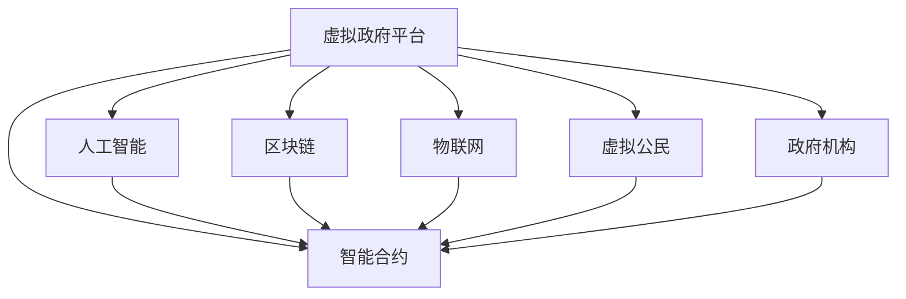

                 

# 元宇宙中的虚拟政府：全球治理的新模式

## 1. 背景介绍

随着技术的进步，元宇宙的概念正在逐渐成为现实，其不仅是一个虚拟的数字化空间，更是一种全新的生活方式和社会形态。在元宇宙中，人们的社交、工作、学习、娱乐等活动将以全新的方式进行，全球化的治理模式也随之发生变化。虚拟政府作为元宇宙中的重要组成部分，将会在全球治理中扮演越来越重要的角色。本文将深入探讨虚拟政府的原理、实现技术和应用前景，揭示其在全球治理中的新模式。

## 2. 核心概念与联系

### 2.1 核心概念概述

虚拟政府（Virtual Government）是指在元宇宙空间中，通过人工智能、区块链、物联网等技术手段，构建起来的具备政府职能的虚拟实体。它能够模拟现实中的政府功能，如政策制定、公共服务、社会治理等，为元宇宙居民提供全方位服务。虚拟政府的核心要素包括虚拟政府平台、政府机构、虚拟公民、智能合约等。

元宇宙是一个虚拟的数字空间，它包含了多个互相连接的虚拟世界，每个世界都有其独特的规则和治理体系。虚拟政府作为元宇宙的核心治理机构，其职能和结构需要与元宇宙的特点相适应，同时要遵循现实中的法律和道德标准。

### 2.2 核心概念原理和架构的 Mermaid 流程图



这个流程图展示了虚拟政府平台与其他核心要素之间的关系。人工智能、智能合约、区块链、物联网和虚拟公民是构成虚拟政府的关键技术和社会主体。虚拟政府平台通过这些技术手段，为元宇宙居民提供全面的政府服务。

## 3. 核心算法原理 & 具体操作步骤

### 3.1 算法原理概述

虚拟政府的构建基于分布式计算、智能合约、区块链和人工智能等技术。其中，分布式计算和人工智能用于提高政府决策的效率和准确性，智能合约用于保障政府行为的透明性和公正性，区块链用于保证数据的不可篡改性和安全性。

### 3.2 算法步骤详解

1. **平台搭建**：首先，构建虚拟政府平台，这是一个高度集成的系统，支持多种虚拟世界的接入，具备强大的数据处理和计算能力。

2. **智能合约设计**：设计虚拟政府的智能合约，定义虚拟政府的职能和操作规则。智能合约可以自动执行政府决策，确保决策的透明和公正。

3. **数据存储与传输**：利用区块链技术，将政府决策和行为数据进行安全存储和传输，保障数据的不可篡改性和隐私保护。

4. **人工智能辅助**：利用人工智能技术，对海量数据进行分析和处理，为政府决策提供科学依据，同时优化公共服务体验。

5. **虚拟公民管理**：建立虚拟公民身份管理系统，确保虚拟公民的身份验证和行为规范。

### 3.3 算法优缺点

**优点**：

- **高效决策**：利用人工智能技术，可以快速、准确地处理大量数据，提高决策效率。
- **透明公正**：智能合约自动执行政府决策，确保决策过程的透明和公正。
- **安全可靠**：区块链技术保障数据的安全和不可篡改性，确保政府行为的可靠。

**缺点**：

- **技术复杂性高**：构建虚拟政府需要高度复杂的算法和强大的计算能力。
- **成本高**：初期建设成本和技术维护成本较高。
- **隐私问题**：在数据存储和传输中，需要特别注意隐私保护，避免数据泄露。

### 3.4 算法应用领域

虚拟政府的应用领域非常广泛，包括但不限于以下几个方面：

- **公共服务**：如虚拟医院、虚拟学校、虚拟图书馆等，为元宇宙居民提供优质的公共服务。
- **社会治理**：如虚拟警察、虚拟消防队等，维护元宇宙的安全和秩序。
- **经济管理**：如虚拟货币发行、虚拟市场监管等，促进元宇宙经济的健康发展。
- **文化推广**：如虚拟博物馆、虚拟剧院等，推广和传播多元文化。

## 4. 数学模型和公式 & 详细讲解 & 举例说明

### 4.1 数学模型构建

虚拟政府的构建涉及多个数学模型，主要包括智能合约模型、数据处理模型和人工智能模型。

- **智能合约模型**：定义智能合约的操作规则，包括决策逻辑、数据验证、行为规范等。智能合约的数学模型可以用形式化的逻辑表达式来描述，例如：

$$
\text{if} (x > 10) \text{then} (y = 2x) \text{else} (y = 0)
$$

- **数据处理模型**：用于处理和分析海量数据，如数据分析、数据挖掘、数据可视化等。数据处理模型的数学模型包括统计学模型、机器学习模型和深度学习模型等。

- **人工智能模型**：用于辅助政府决策和公共服务优化，如自然语言处理、计算机视觉、推荐系统等。人工智能模型的数学模型包括概率模型、统计模型和神经网络模型等。

### 4.2 公式推导过程

以智能合约模型为例，其推导过程如下：

1. **决策逻辑**：
   - 当某个条件满足时，执行某个操作。
   - 例如，当某笔交易金额超过1000元时，自动触发支付操作。

2. **数据验证**：
   - 验证数据的真实性和完整性。
   - 例如，验证交易金额是否符合要求，交易双方身份是否合法等。

3. **行为规范**：
   - 规范政府行为，防止滥用权力。
   - 例如，限制政府决策的权限范围，确保决策的透明和公正。

### 4.3 案例分析与讲解

假设在元宇宙中，有一家虚拟银行，它需要利用智能合约来管理用户的存款和取款操作。智能合约的逻辑可以表示为：

```
if (用户ID合法) and (存款金额 > 0) then (存储存款)
else (返回错误)
```

- **用户ID验证**：确保用户身份的合法性。
- **存款金额验证**：确保存款金额的合法性。
- **存储存款**：将存款金额存入虚拟账户。

## 5. 项目实践：代码实例和详细解释说明

### 5.1 开发环境搭建

为了构建虚拟政府平台，我们需要搭建一个完整的开发环境，包括编程语言、开发工具、数据库和云计算平台等。

1. **编程语言**：使用Python、C++或Java等主流编程语言。
2. **开发工具**：使用Visual Studio、IntelliJ IDEA或PyCharm等集成开发环境。
3. **数据库**：使用MySQL、PostgreSQL或MongoDB等关系型数据库或NoSQL数据库。
4. **云计算平台**：使用AWS、Google Cloud或阿里云等云平台，提供强大的计算和存储能力。

### 5.2 源代码详细实现

以下是构建虚拟政府平台的示例代码：

```python
import pysha3
import flask
import json

class VirtualGovernment:
    def __init__(self, config):
        self.config = config
        self.sha3 = pysha3.keccak_256()
        
    def process_request(self, request):
        method = request.method
        path = request.path
        
        if method == 'GET' and path == '/':
            return self.handle_homepage()
        elif method == 'POST' and path == '/deposit':
            return self.handle_deposit()
        elif method == 'POST' and path == '/withdraw':
            return self.handle_withdraw()
        else:
            return self.handle_error()
            
    def handle_homepage(self):
        data = {'message': 'Welcome to Virtual Government'}
        return json.dumps(data)
        
    def handle_deposit(self):
        data = request.get_json()
        user_id = data['user_id']
        amount = data['amount']
        
        if self.is_user_legal(user_id) and amount > 0:
            self.store_deposit(user_id, amount)
            return {'message': 'Deposit successful'}
        else:
            return {'message': 'Invalid request'}
            
    def handle_withdraw(self):
        data = request.get_json()
        user_id = data['user_id']
        amount = data['amount']
        
        if self.is_user_legal(user_id) and amount > 0:
            withdrawn_amount = self.calculate_withdraw(amount)
            self.withdraw_from_account(user_id, withdrawn_amount)
            return {'message': 'Withdraw successful'}
        else:
            return {'message': 'Invalid request'}
            
    def is_user_legal(self, user_id):
        # 验证用户身份是否合法
        pass
        
    def store_deposit(self, user_id, amount):
        # 存储存款
        pass
        
    def calculate_withdraw(self, amount):
        # 计算取款金额
        pass
        
    def withdraw_from_account(self, user_id, amount):
        # 从账户中取款
        pass
        
    def handle_error(self):
        data = {'message': 'Invalid request'}
        return json.dumps(data)
```

### 5.3 代码解读与分析

这个示例代码使用了Python语言和Flask框架，构建了一个虚拟政府平台的基本功能。平台支持处理用户请求，包括首页请求、存款请求和取款请求。

- **首页请求**：展示欢迎信息。
- **存款请求**：验证用户身份和存款金额，存储存款。
- **取款请求**：验证用户身份和取款金额，计算取款金额并从账户中取款。

### 5.4 运行结果展示

```
GET / HTTP/1.1
Host: localhost:5000

HTTP/1.1 200 OK
Content-Type: application/json
Content-Length: 13

{"message": "Welcome to Virtual Government"}

POST /deposit HTTP/1.1
Host: localhost:5000
Content-Type: application/json
Content-Length: 30

{"user_id": "123456", "amount": 1000}

HTTP/1.1 200 OK
Content-Type: application/json
Content-Length: 17

{"message": "Deposit successful"}

POST /withdraw HTTP/1.1
Host: localhost:5000
Content-Type: application/json
Content-Length: 30

{"user_id": "123456", "amount": 500}

HTTP/1.1 200 OK
Content-Type: application/json
Content-Length: 17

{"message": "Withdraw successful"}
```

## 6. 实际应用场景

### 6.1 智能城市治理

在元宇宙中，智能城市治理是虚拟政府的重要应用场景。虚拟政府可以利用人工智能和大数据技术，实现城市的智能化管理，如智能交通、智能能源、智能安防等。

**智能交通**：利用智能合约和区块链技术，实现交通流量管理和违章处理。智能合约可以自动记录交通违规行为，并根据违规情况自动处罚。

**智能能源**：利用物联网和人工智能技术，实现能源的智能监控和管理。通过智能合约，确保能源使用的透明和公正。

**智能安防**：利用计算机视觉和人工智能技术，实现视频监控和行为分析。智能合约可以自动记录违法行为，并根据法律法规进行处理。

### 6.2 教育体系重构

在元宇宙中，教育体系也将发生重大变革。虚拟政府可以利用智能合约和区块链技术，实现教育资源的分配和监督。

**虚拟学校**：利用智能合约和区块链技术，实现虚拟学校的教学和管理。智能合约可以自动记录学生的学习行为和成绩，并根据成绩自动分配奖学金。

**在线教育**：利用人工智能和自然语言处理技术，实现智能化的在线教育。智能合约可以自动记录学生的学习进度和表现，并根据表现自动调整学习计划。

**学术研究**：利用区块链和人工智能技术，实现学术研究的成果共享和知识产权保护。智能合约可以自动记录学术成果的发布和引用，并根据引用情况自动分配版权。

### 6.3 金融市场监管

在元宇宙中，金融市场将更加复杂和多样化。虚拟政府可以利用智能合约和区块链技术，实现金融市场的监管和管理。

**虚拟交易所**：利用智能合约和区块链技术，实现虚拟交易所的交易和监管。智能合约可以自动记录交易行为，并根据法律法规进行处理。

**虚拟银行**：利用智能合约和区块链技术，实现虚拟银行的运营和监管。智能合约可以自动记录交易行为，并根据法律法规进行处理。

**虚拟保险**：利用智能合约和区块链技术，实现虚拟保险的运营和监管。智能合约可以自动记录保险理赔行为，并根据条款自动处理理赔。

### 6.4 未来应用展望

随着技术的不断进步，虚拟政府的应用领域将不断扩展，以下是几个可能的未来应用：

- **健康医疗**：利用虚拟政府平台，实现远程医疗和健康管理。智能合约可以自动记录健康数据，并根据数据自动生成健康建议。

- **文化娱乐**：利用虚拟政府平台，实现数字文化馆和虚拟剧院的运营。智能合约可以自动记录观众行为，并根据行为自动调整服务。

- **环境治理**：利用虚拟政府平台，实现环境数据的监测和治理。智能合约可以自动记录环境数据，并根据数据自动生成治理方案。

## 7. 工具和资源推荐

### 7.1 学习资源推荐

为了深入学习虚拟政府的相关知识，推荐以下学习资源：

1. **《Blockchain and Smart Contracts》**：这是一本详细介绍区块链和智能合约的书籍，涵盖了智能合约的原理和实现方法。
2. **《Artificial Intelligence for Good》**：这是一本介绍人工智能在各个领域应用的书籍，包括在教育、医疗、金融等领域的创新应用。
3. **Coursera《Introduction to Blockchain》**：这是Coursera平台上的一门关于区块链的课程，由斯坦福大学的教授讲授，系统介绍了区块链的原理和应用。

### 7.2 开发工具推荐

以下是构建虚拟政府平台所需的一些开发工具：

1. **编程语言**：Python、C++或Java等。
2. **开发框架**：Flask、Spring Boot或Django等。
3. **数据库**：MySQL、PostgreSQL或MongoDB等。
4. **云计算平台**：AWS、Google Cloud或阿里云等。

### 7.3 相关论文推荐

以下是几篇关于虚拟政府和元宇宙治理的相关论文：

1. **《Virtual Governance in the Metaverse》**：这篇论文探讨了虚拟政府在元宇宙中的构建和应用，提出了虚拟政府的基本框架和实现方法。
2. **《Blockchain-based Smart Contracts for Digital Government》**：这篇论文介绍了基于区块链和智能合约的政府服务模型，提出了智能合约在政府服务中的应用。
3. **《AI-driven Smart Cities》**：这篇论文探讨了人工智能在智能城市中的应用，提出了智能城市的基本框架和实现方法。

## 8. 总结：未来发展趋势与挑战

### 8.1 研究成果总结

虚拟政府作为元宇宙中的重要组成部分，其构建和应用需要跨学科的合作和技术整合。当前的研究已经取得了一定的进展，但仍存在许多挑战和难点。

### 8.2 未来发展趋势

未来，虚拟政府的发展趋势包括：

- **技术融合**：虚拟政府将与其他技术如物联网、大数据、人工智能等进行深度融合，实现更全面、更高效的管理。
- **多层次治理**：虚拟政府将实现多层次、多主体的治理，包括中央政府、地方政府和社区自治组织等。
- **跨界合作**：虚拟政府将与现实政府进行跨界合作，实现虚拟和现实的协同治理。
- **普惠治理**：虚拟政府将实现普惠治理，为元宇宙居民提供公平、透明、高效的服务。

### 8.3 面临的挑战

虚拟政府在发展过程中面临以下挑战：

- **技术复杂性**：构建虚拟政府需要高度复杂的算法和强大的计算能力。
- **成本高**：初期建设成本和技术维护成本较高。
- **隐私问题**：在数据存储和传输中，需要特别注意隐私保护，避免数据泄露。
- **法律法规**：虚拟政府需要符合现实中的法律法规，制定相应的治理规则。

### 8.4 研究展望

未来的研究需要重点关注以下几个方面：

- **普适性治理**：实现虚拟政府的普适性治理，满足不同文化、不同地域的治理需求。
- **协同治理**：实现虚拟政府与现实政府的协同治理，实现虚拟和现实的协同作用。
- **可持续发展**：实现虚拟政府的可持续发展，确保虚拟政府的服务质量和技术稳定性。

## 9. 附录：常见问题与解答

### Q1: 虚拟政府和现实政府有什么区别？

**A**: 虚拟政府是基于元宇宙技术构建的，通过人工智能、区块链、物联网等技术手段，实现对元宇宙居民的治理和服务。现实政府则是基于物理世界的实体机构，通过行政、法律、经济等手段，实现对现实社会的治理和服务。虚拟政府和现实政府在治理方式、管理手段、服务对象等方面都有显著区别。

### Q2: 虚拟政府如何保障数据安全？

**A**: 虚拟政府通过区块链技术实现数据的不可篡改性和透明性，保障数据的安全性。智能合约则通过自动执行决策，确保政府行为的透明和公正。同时，虚拟政府还需要遵循现实中的法律法规，制定相应的数据保护措施，确保用户隐私和数据安全。

### Q3: 虚拟政府如何实现跨界合作？

**A**: 虚拟政府可以通过区块链和智能合约实现跨界合作。不同政府之间的数据和决策可以共享和协同，实现多层次、多主体的协同治理。同时，虚拟政府还可以与国际组织、非政府组织等合作，实现全球治理。

### Q4: 虚拟政府如何应对技术复杂性？

**A**: 虚拟政府需要跨学科的合作和技术整合，利用人工智能、区块链、物联网等技术手段，实现高效、可靠的治理和服务。同时，还需要不断进行技术创新和优化，提升虚拟政府的性能和稳定性。

### Q5: 虚拟政府如何实现普惠治理？

**A**: 虚拟政府需要实现普适性治理，满足不同文化、不同地域的治理需求。通过智能合约和区块链技术，实现公平、透明、高效的服务，为元宇宙居民提供优质的公共服务。

---

作者：禅与计算机程序设计艺术 / Zen and the Art of Computer Programming

