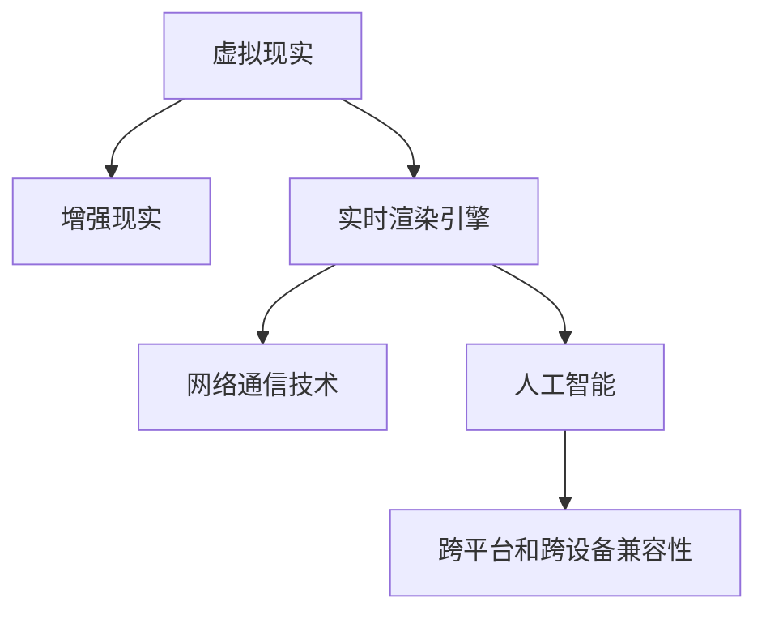

                 

# 元宇宙体育:虚实结合的竞技新形式

## 1. 背景介绍

### 1.1 问题由来

元宇宙体育（Metaverse Sports）作为虚拟现实技术与体育竞技相结合的新形式，近年来在全球范围内引起广泛关注。传统的体育竞技主要依赖于实体场地和物理交互，而在元宇宙中，通过虚拟现实技术，可以将体育竞技搬到数字世界，实现虚拟与现实的深度融合。这不仅为体育爱好者提供了全新的体验方式，也为体育产业的创新发展提供了新的契机。

### 1.2 问题核心关键点

元宇宙体育的核心在于如何实现虚拟体育竞技的交互性和真实感，同时保证其公平性和竞技性。关键技术包括：
- 虚拟现实（VR）和增强现实（AR）技术，用于构建虚拟比赛环境。
- 高精度实时渲染引擎，保证比赛场景的流畅和逼真。
- 网络通信技术，支持大量用户的实时互动。
- 人工智能算法，用于仿真比赛过程、实时裁判判决等。
- 跨平台和跨设备兼容性，确保不同设备的用户可以无缝切换参与。

这些技术难点需要综合考虑，以实现元宇宙体育的高质量体验和普及性。

### 1.3 问题研究意义

元宇宙体育作为虚拟现实技术在体育领域的创新应用，具有以下重要意义：
1. **突破时空限制**：体育竞技不再受限于实体场地和地理位置，用户可以随时随地参与。
2. **提升参与体验**：虚拟现实和增强现实技术为体育爱好者提供沉浸式的比赛体验。
3. **激发竞技精神**：高仿真和实时互动使比赛更具挑战性，激发用户的竞技精神。
4. **拓宽体育产业**：元宇宙体育开辟了新的商业模式和市场机会，推动体育产业的创新发展。
5. **促进技术融合**：推动虚拟现实、人工智能等多领域的交叉融合，加速新技术的应用。

## 2. 核心概念与联系

### 2.1 核心概念概述

为更好地理解元宇宙体育的实现机制，本节将介绍几个密切相关的核心概念：

- **虚拟现实（Virtual Reality, VR）**：通过头戴式设备（如Oculus Rift, HTC Vive等）和传感器技术，创造出完全沉浸式的3D环境，让用户在虚拟世界中进行互动和体验。
- **增强现实（Augmented Reality, AR）**：利用智能设备和摄像头，在真实世界中叠加虚拟信息，如3D模型、文字、动画等，增强用户的现实体验。
- **实时渲染引擎**：如Unity、Unreal Engine等，用于实时生成和渲染三维场景，保证虚拟体育竞技的流畅性和逼真度。
- **网络通信技术**：如P2P网络、边缘计算等，支持实时数据传输和多用户互动，确保比赛过程的稳定性和实时性。
- **人工智能（AI）**：用于仿真比赛过程、实时裁判判决、用户行为预测等，提高比赛的真实性和公平性。
- **跨平台和跨设备兼容性**：如WebGL、WebVR等，确保不同设备和操作系统之间的无缝切换，提升用户体验。

这些核心概念之间的逻辑关系可以通过以下Mermaid流程图来展示：



这个流程图展示了元宇宙体育的关键技术栈及其相互关联：
- **虚拟现实** 是基础，提供沉浸式的体验环境。
- **增强现实** 增强现实世界，提升用户体验。
- **实时渲染引擎** 是技术核心，实现高质量的3D场景渲染。
- **网络通信技术** 保障交互流畅，实现实时数据传输。
- **人工智能** 提供仿真和判决，提升比赛的公正性和互动性。
- **跨平台和跨设备兼容性** 确保普及性和用户体验。

## 3. 核心算法原理 & 具体操作步骤
### 3.1 算法原理概述

元宇宙体育的核心算法原理主要基于虚拟现实和增强现实技术，结合实时渲染引擎和人工智能算法，实现虚拟体育竞技的仿真、交互和判决。

- **虚拟现实技术**：通过头戴设备或控制器，捕捉用户的行为和环境变化，实时渲染比赛场景，生成沉浸式体验。
- **增强现实技术**：将虚拟元素叠加在真实环境中，如赛场、观众席等，增强用户的视觉和感官体验。
- **实时渲染引擎**：基于物理引擎和图形渲染技术，实现高精度、实时的三维场景生成和渲染，保证比赛的流畅性和逼真度。
- **人工智能算法**：用于比赛仿真、实时裁判判决、用户行为预测等，提升比赛的公平性和互动性。

### 3.2 算法步骤详解

基于虚拟现实和增强现实的元宇宙体育实现步骤如下：

**Step 1: 场景建模和渲染**
- 利用虚拟现实技术，捕捉用户的行为和环境变化。
- 实时渲染三维场景，包括场地、赛具、观众等，生成沉浸式体验。

**Step 2: 用户交互和实时反馈**
- 通过增强现实技术，将虚拟元素叠加在真实环境中，增强用户的感官体验。
- 利用虚拟现实设备，捕捉用户的手部动作和姿态，实时调整虚拟场景。

**Step 3: 网络通信和数据传输**
- 利用网络通信技术，支持多用户实时互动和数据传输。
- 使用边缘计算技术，优化数据传输和渲染效率，确保比赛的流畅性。

**Step 4: 人工智能决策**
- 利用人工智能算法，仿真比赛过程，实时裁判判决，提升比赛的公平性和互动性。
- 根据用户行为和环境变化，预测比赛结果，提供智能建议和反馈。

**Step 5: 结果展示和用户体验**
- 将比赛结果以虚拟现实和增强现实的形式展示给用户，增强互动体验。
- 利用跨平台和跨设备兼容性，确保不同设备和操作系统之间的无缝切换，提升用户体验。

### 3.3 算法优缺点

元宇宙体育具有以下优点：
1. **突破时空限制**：用户可以随时随地参与比赛，不受实体场地的限制。
2. **提升体验感**：虚拟现实和增强现实技术提供沉浸式的比赛体验。
3. **公平性和竞技性**：人工智能算法保证比赛的公平性和竞技性，提供真实感强的仿真和判决。

同时，也存在一些缺点：
1. **设备成本高**：高端的虚拟现实和增强现实设备价格较高，普及度有待提高。
2. **技术门槛高**：需要掌握复杂的虚拟现实和增强现实技术，开发难度较大。
3. **网络延迟问题**：实时数据传输和渲染对网络要求较高，容易受到网络环境的影响。

### 3.4 算法应用领域

基于虚拟现实和增强现实的元宇宙体育技术，已经在多个领域得到了应用，例如：

- **电子竞技**：如虚拟足球、虚拟篮球等，提供沉浸式的比赛体验。
- **体育训练**：如虚拟跑步、虚拟游泳等，提升运动员的训练效果。
- **体育模拟**：如虚拟高尔夫、虚拟赛艇等，提供训练和娱乐的结合。
- **体育赛事**：如虚拟马拉松、虚拟赛事转播等，创新赛事形式。

除了这些经典应用外，元宇宙体育还被创新性地应用到更多场景中，如教育训练、健康康复、娱乐休闲等，为体育技术的发展提供了新的方向。

## 4. 数学模型和公式 & 详细讲解 & 举例说明
### 4.1 数学模型构建

本节将使用数学语言对元宇宙体育的实现机制进行更加严格的刻画。

记比赛场景为 $S$，用户行为为 $U$，比赛结果为 $R$。比赛过程可以表示为：

$$ S \rightarrow U \rightarrow R $$

其中，$S$ 是初始场景，$U$ 是用户行为，$R$ 是比赛结果。

### 4.2 公式推导过程

为了更精确地描述比赛过程，可以使用如下公式推导：

**Step 1: 用户行为捕捉**
- 用户通过虚拟现实设备捕捉动作和姿态，转化为虚拟角色 $u$：

$$ u = \text{Capture}(U) $$

**Step 2: 环境渲染**
- 实时渲染三维场景，生成虚拟环境 $S'$：

$$ S' = \text{Render}(S, u) $$

**Step 3: 比赛仿真**
- 利用人工智能算法仿真比赛过程，得到比赛结果 $r'$：

$$ r' = \text{Simulate}(S', u) $$

**Step 4: 裁判判决**
- 根据比赛规则，使用人工智能算法判决比赛结果 $r$：

$$ r = \text{Judge}(r', S', u) $$

**Step 5: 用户反馈**
- 根据比赛结果，生成用户反馈 $f$，用于实时调整虚拟场景：

$$ f = \text{Feedback}(r, S', u) $$

### 4.3 案例分析与讲解

以虚拟足球比赛为例，展示元宇宙体育的具体实现过程：

**Step 1: 用户行为捕捉**
- 用户佩戴虚拟现实头戴设备，捕捉动作和姿态，转化为虚拟角色 $u$。

**Step 2: 环境渲染**
- 实时渲染足球场地、球员、球门等场景，生成虚拟环境 $S'$。

**Step 3: 比赛仿真**
- 使用人工智能算法，仿真球员的动作和球的位置，得到比赛结果 $r'$。

**Step 4: 裁判判决**
- 根据比赛规则，使用人工智能算法判决比赛结果 $r$，如进球、越位等。

**Step 5: 用户反馈**
- 根据比赛结果，生成用户反馈 $f$，如进球后的欢呼声，用于实时调整虚拟场景。

## 5. 项目实践：代码实例和详细解释说明
### 5.1 开发环境搭建

在进行元宇宙体育开发前，我们需要准备好开发环境。以下是使用Python进行Unreal Engine开发的环境配置流程：

1. 安装Unreal Engine：从官网下载并安装Unreal Engine，创建新项目或加载已有项目。
2. 安装Python：在Unreal Engine中安装Python 3.9及以上版本，安装必要的Python库。
3. 配置环境变量：确保Unreal Engine能够找到Python解释器。

完成上述步骤后，即可在Unreal Engine中使用Python进行元宇宙体育的开发。

### 5.2 源代码详细实现

以下是一个简单的虚拟足球比赛的代码实现，包括用户行为捕捉、环境渲染、比赛仿真和裁判判决：

```python
import pyunreal as pyu
from pyunreal.core.interfaces import IAnalytics
from pyunreal.uobject import UObject, register_object

@pyu.uclass()
class FootballGame(UObject):
    def __init__(self, world, blueprint):
        super().__init__()
        self.blueprint = blueprint
        self.world = world
        self.players = []
        self.ball = None
        self.field = None

    def create_player(self):
        # 创建球员角色
        player = self.blueprint.create_from_blueprint('Character/CapsuleCharacter', self.world)
        self.players.append(player)

    def create_field(self):
        # 创建足球场地
        field = self.blueprint.create_from_blueprint('Landscape/Landscape_Successive', self.world)
        self.field = field

    def create_ball(self):
        # 创建足球
        ball = self.blueprint.create_from_blueprint('Physics/StaticMesh', self.world)
        self.ball = ball

    def update(self, dt):
        # 实时渲染环境
        self.field.update(dt)
        self.players.update(dt)
        self.ball.update(dt)

    def simulate(self):
        # 比赛仿真
        for player in self.players:
            player.update(dt)
        self.ball.update(dt)

    def judge(self):
        # 裁判判决
        if self.players[0].score > self.players[1].score:
            return 'Goal'
        elif self.players[0].score < self.players[1].score:
            return 'Goal'
        else:
            return 'Draw'

    def feedback(self, result):
        # 用户反馈
        if result == 'Goal':
            print('Goal!')
```

### 5.3 代码解读与分析

让我们再详细解读一下关键代码的实现细节：

**FootballGame类**：
- `__init__`方法：初始化比赛场景、球员、球等元素。
- `create_player`方法：创建球员角色。
- `create_field`方法：创建足球场地。
- `create_ball`方法：创建足球。
- `update`方法：实时渲染环境、球员和球。
- `simulate`方法：比赛仿真。
- `judge`方法：裁判判决。
- `feedback`方法：用户反馈。

**用户行为捕捉**：
- 用户通过虚拟现实设备捕捉动作和姿态，转化为虚拟角色 $u$，并通过 `create_player` 方法创建球员角色。

**环境渲染**：
- 实时渲染足球场地、球员、球门等场景，通过 `create_field` 和 `create_ball` 方法创建场地和球，并使用 `update` 方法实时渲染。

**比赛仿真**：
- 利用人工智能算法，仿真球员的动作和球的位置，通过 `simulate` 方法实现。

**裁判判决**：
- 根据比赛规则，使用人工智能算法判决比赛结果，通过 `judge` 方法实现。

**用户反馈**：
- 根据比赛结果，生成用户反馈 $f$，通过 `feedback` 方法实现。

**用户交互**：
- 用户通过虚拟现实设备，捕捉动作和姿态，转化为虚拟角色 $u$，并通过 `update` 方法实时调整虚拟场景。

## 6. 实际应用场景
### 6.1 智能训练

在体育训练领域，元宇宙体育可以提供沉浸式的虚拟训练环境，帮助运动员提升技能和体能。例如，运动员可以在虚拟现实场景中进行足球、篮球、高尔夫等体育项目的训练，实时反馈训练效果，提升训练质量。

**实际应用**：
- 运动员佩戴虚拟现实设备，进入虚拟训练场。
- 实时捕捉运动员的动作和姿态，转化为虚拟角色。
- 实时渲染虚拟环境，提供沉浸式训练体验。
- 通过人工智能算法，实时提供反馈和指导。

### 6.2 体育赛事

在体育赛事领域，元宇宙体育可以提供创新性的比赛形式，吸引更多观众参与。例如，虚拟马拉松、虚拟篮球比赛等，通过增强现实技术，将虚拟元素叠加在现实中，增强比赛体验。

**实际应用**：
- 观众佩戴虚拟现实设备，进入虚拟比赛场。
- 实时捕捉观众的动作和姿态，转化为虚拟角色。
- 实时渲染虚拟环境，提供沉浸式比赛体验。
- 通过人工智能算法，实时提供裁判判决和比赛结果。

### 6.3 娱乐休闲

在娱乐休闲领域，元宇宙体育可以提供沉浸式的游戏体验，吸引更多用户参与。例如，虚拟足球、虚拟篮球等，通过增强现实技术，提供交互式和竞技性的游戏体验。

**实际应用**：
- 用户佩戴虚拟现实设备，进入虚拟游戏场。
- 实时捕捉用户的行为和姿态，转化为虚拟角色。
- 实时渲染虚拟环境，提供沉浸式游戏体验。
- 通过人工智能算法，实时提供反馈和奖励。

### 6.4 未来应用展望

随着技术的不断进步，元宇宙体育的应用场景将更加丰富多样。未来，元宇宙体育有望在以下几个方面得到更广泛的应用：

- **教育培训**：利用虚拟现实技术，提供沉浸式的教育培训环境，如虚拟实验室、虚拟教室等。
- **健康康复**：通过虚拟现实和增强现实技术，提供虚拟康复训练，如虚拟物理治疗、虚拟心理辅导等。
- **体育旅游**：通过虚拟现实技术，提供虚拟旅游体验，如虚拟旅游景点、虚拟体育赛事等。
- **文化娱乐**：通过虚拟现实和增强现实技术，提供虚拟演出、虚拟音乐会等文化娱乐体验。

## 7. 工具和资源推荐
### 7.1 学习资源推荐

为了帮助开发者系统掌握元宇宙体育的理论基础和实践技巧，这里推荐一些优质的学习资源：

1. **Unreal Engine官方文档**：Unreal Engine的官方文档，提供了全面的学习指南和API文档，是入门的必备资料。
2. **Python for Game Development**：一本关于使用Python进行游戏开发的书籍，详细介绍了如何使用Python与Unreal Engine进行交互。
3. **Game Development with Unity**：一本关于使用Unity进行游戏开发的书籍，介绍了Unity的3D开发技术和游戏引擎。
4. **Virtual Reality Fundamentals**：一本关于虚拟现实技术的书籍，介绍了虚拟现实的基础知识和常用技术。
5. **Artificial Intelligence for Games**：一本关于人工智能在游戏开发中应用的书籍，介绍了人工智能在游戏决策、仿真等方面的应用。

通过这些资源的学习实践，相信你一定能够快速掌握元宇宙体育的核心技术，并用于解决实际的体育问题。

### 7.2 开发工具推荐

高效的开发离不开优秀的工具支持。以下是几款用于元宇宙体育开发的常用工具：

1. **Unreal Engine**：全球领先的实时3D游戏引擎，支持高精度实时渲染，适合元宇宙体育的开发。
2. **Unity**：功能强大的游戏引擎，支持跨平台开发，适合元宇宙体育的开发和部署。
3. **Blender**：免费的3D建模软件，适合虚拟场景的建模和渲染。
4. **VTK**：开源的可视化库，支持高精度三维场景渲染。
5. **PyTorch**：开源的深度学习框架，适合人工智能算法的实现。

合理利用这些工具，可以显著提升元宇宙体育的开发效率，加快创新迭代的步伐。

### 7.3 相关论文推荐

元宇宙体育作为虚拟现实技术在体育领域的创新应用，代表了大数据、人工智能等前沿技术的发展方向。以下是几篇奠基性的相关论文，推荐阅读：

1. **Simulating Sports with Deep Reinforcement Learning**：提出了使用深度强化学习进行体育模拟的方法，展示了人工智能在体育决策中的应用。
2. **Virtually Enhanced Training Environment for Sport**：介绍了虚拟现实技术在体育训练中的应用，展示了虚拟训练环境的优势。
3. **Real-time Rendering of Dynamic Virtual Scenes for Sports**：介绍了实时渲染技术在体育竞技中的应用，展示了高精度渲染的效果。
4. **Artificial Intelligence in Sports Broadcasting**：介绍了人工智能在体育转播中的应用，展示了实时裁判判决和智能分析的功能。
5. **Virtual Reality for Sports Events**：介绍了虚拟现实技术在体育赛事中的应用，展示了虚拟赛事的创新性和吸引力。

这些论文代表了大数据、人工智能等前沿技术在体育领域的应用方向，展示了元宇宙体育的潜力和前景。

## 8. 总结：未来发展趋势与挑战
### 8.1 研究成果总结

本文对基于虚拟现实和增强现实的元宇宙体育进行了全面系统的介绍。首先阐述了元宇宙体育的研究背景和意义，明确了虚拟现实、增强现实和人工智能等关键技术在实现元宇宙体育中的重要性。其次，从原理到实践，详细讲解了元宇宙体育的数学模型和实现步骤，给出了具体代码实例。同时，本文还探讨了元宇宙体育在智能训练、体育赛事、娱乐休闲等多个领域的应用前景，展示了元宇宙体育的广阔前景。

通过本文的系统梳理，可以看到，元宇宙体育作为虚拟现实技术在体育领域的创新应用，正在成为体育竞技和体育产业的重要方向。虚拟现实和增强现实技术为体育竞技提供了全新的体验方式，人工智能算法保证了比赛的公平性和竞技性，突破时空限制、提升体验感和公平性是其核心优势。

### 8.2 未来发展趋势

展望未来，元宇宙体育将呈现以下几个发展趋势：

1. **技术融合更加深入**：虚拟现实、增强现实和人工智能等技术将进一步融合，提供更加沉浸、智能和互动的体验。
2. **跨平台和跨设备兼容性提升**：元宇宙体育将支持更多设备和平台，如PC、移动设备、虚拟现实头戴设备等，提升普及性和用户体验。
3. **个性化和定制化发展**：根据用户的偏好和需求，提供个性化的游戏体验和训练方案，提升用户的满意度和参与度。
4. **竞技性和娱乐性并重**：元宇宙体育将更加注重竞技性和娱乐性的结合，提供更加多样化的比赛形式和游戏玩法。
5. **生态系统建设**：元宇宙体育将构建完整的生态系统，包括游戏平台、社区、内容创作者等，形成良性的闭环生态。

### 8.3 面临的挑战

尽管元宇宙体育的前景广阔，但在迈向更加智能化、普适化应用的过程中，仍面临诸多挑战：

1. **技术复杂度高**：虚拟现实和增强现实技术复杂度高，开发难度大，需要多学科知识的支持。
2. **设备成本高**：高端的虚拟现实和增强现实设备价格较高，普及度有待提高。
3. **网络延迟问题**：实时数据传输和渲染对网络要求较高，容易受到网络环境的影响。
4. **隐私和安全问题**：用户数据的隐私和安全问题需要妥善解决，保障用户权益。
5. **用户体验不一致**：不同设备和平台的用户体验不一致，需要提升跨平台兼容性。

### 8.4 研究展望

面对元宇宙体育所面临的挑战，未来的研究需要在以下几个方面寻求新的突破：

1. **降低技术门槛**：开发更加易用、高效的开发工具和框架，降低技术门槛。
2. **提升设备普及度**：通过技术创新和成本控制，提升虚拟现实和增强现实设备的普及度。
3. **优化网络性能**：利用边缘计算和5G等技术，优化网络传输和渲染性能。
4. **保障隐私安全**：建立数据隐私和安全机制，保障用户数据的隐私和安全。
5. **提升用户体验**：提升跨平台兼容性和用户体验的一致性，提供更加无缝的体验。

这些研究方向将推动元宇宙体育技术的不断进步，为其在体育竞技、体育训练、体育赛事、娱乐休闲等领域的广泛应用提供坚实的基础。

## 9. 附录：常见问题与解答

**Q1：元宇宙体育是否适用于所有体育项目？**

A: 元宇宙体育可以适用于大多数体育项目，但需要根据不同项目的特性进行定制化开发。例如，足球、篮球等具有高互动性和实时性要求的项目，可以更轻松地实现虚拟比赛。而对于一些需要高度技巧和身体协调性的项目，如射击、击剑等，可能需要进行更复杂的建模和仿真。

**Q2：如何优化元宇宙体育的网络性能？**

A: 优化元宇宙体育的网络性能需要综合考虑网络传输、渲染和交互等多个环节。常见方法包括：
1. 利用边缘计算技术，将渲染和计算任务分摊到本地设备，减少网络负载。
2. 采用基于WebRTC的网络传输协议，优化实时数据传输。
3. 使用分布式渲染技术，将渲染任务分布到多个设备上进行并行渲染。
4. 采用压缩算法，减少传输数据量，提升网络传输效率。

**Q3：元宇宙体育如何保障用户隐私和安全？**

A: 保障元宇宙体育用户隐私和安全需要采取多层次的措施，包括：
1. 数据加密：对用户数据进行加密处理，防止数据泄露。
2. 身份认证：采用多种身份认证方式，如密码、指纹、面部识别等，保障用户身份安全。
3. 访问控制：根据用户角色和权限，控制对敏感数据的访问。
4. 隐私保护：遵守数据隐私保护法律法规，如GDPR等，保护用户隐私。

**Q4：元宇宙体育是否能够完全替代传统体育竞技？**

A: 元宇宙体育无法完全替代传统体育竞技，但可以作为传统体育竞技的有益补充。元宇宙体育提供了全新的体验方式，可以吸引更多用户参与，同时也能为传统体育竞技提供新的应用场景和推广途径。两者可以相互补充，共同促进体育竞技的发展。

**Q5：元宇宙体育的普及度是否受限于设备成本？**

A: 元宇宙体育的普及度确实受限于设备成本，特别是高端的虚拟现实和增强现实设备价格较高。为提高普及度，需要采取多层次的策略，如降低设备价格、推广免费试用、政府补贴等。随着技术的不断进步和成本的降低，元宇宙体育的普及度将逐步提升。

---

作者：禅与计算机程序设计艺术 / Zen and the Art of Computer Programming

