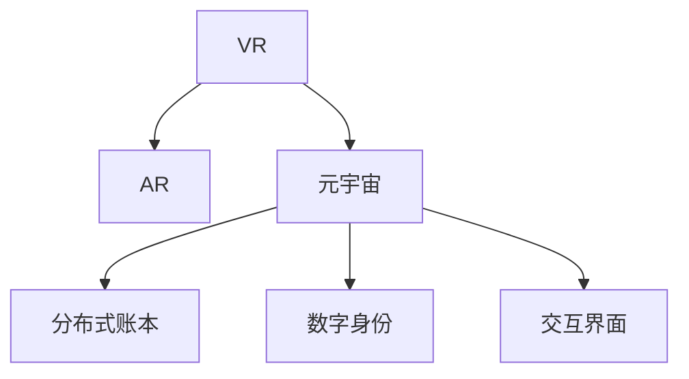

                 

# 元宇宙奥运会:虚实结合的全球体育盛会

## 1. 背景介绍

### 1.1 问题由来

随着虚拟现实(VR)和增强现实(AR)技术的进步，元宇宙（Metaverse）的概念正逐渐成为未来数字世界的主流。这一虚拟空间不仅仅是一个简单的数字游戏环境，而是一个集成的、交互式的、永久性的数字世界，用户可以在其中进行工作、学习、社交、娱乐等活动。这一概念最早由《雪崩》（Snow Crash）作者Neal Stephenson在1992年提出，但在最近几年才因为技术的进步而受到广泛关注。

元宇宙的核心在于连接现实世界与数字世界，实现“虚实结合”，为人类提供一种全新的交互方式。近年来，全球各地的企业和科研机构都在探索元宇宙的应用，其中最具代表性的是2021年8月举办的元宇宙奥运会。元宇宙奥运会的举办，不仅展示了虚拟技术的发展潜力，也引发了对于元宇宙作为全球性体育盛会可行性的思考。

### 1.2 问题核心关键点

元宇宙奥运会是将虚拟技术与传统体育赛事相结合的一次大胆尝试。其核心关键点在于：

1. 虚拟技术的集成：通过虚拟现实技术，实现运动员、观众的虚拟参与。
2. 跨界合作与共建：虚拟技术与实体赛事的结合，需要多方参与。
3. 公平性与公正性：保证虚拟赛事的公平性和公正性，避免数据作弊。
4. 用户体验与沉浸感：提供沉浸式的用户体验，增强用户对虚拟赛事的参与感。
5. 数据的真实性与透明性：保证赛事数据的真实性与透明性，避免数据篡改。

这些关键点共同构成了元宇宙奥运会成功的基石，同时也反映了未来元宇宙技术应用的多种可能性。

## 2. 核心概念与联系

### 2.1 核心概念概述

要深入理解元宇宙奥运会的技术实现，首先需要明确一些核心概念：

1. 虚拟现实（VR）：利用计算机技术生成可交互的三维模拟环境，使用户能够沉浸于虚拟环境中。
2. 增强现实（AR）：通过在现实世界的物理环境中叠加虚拟信息，增强用户对现实世界的感知。
3. 元宇宙（Metaverse）：一个集成的、交互式的、永久性的虚拟世界，用户可以在其中进行各种活动。
4. 分布式账本（Blockchain）：一种去中心化的账本技术，保证数据透明、不可篡改。
5. 数字身份（Digital Identity）：一种在虚拟世界中的身份标识，用于用户间的交互与验证。
6. 交互界面（UI/UX）：虚拟世界中的用户界面，提供沉浸式的交互体验。

这些概念之间的联系可以通过以下Mermaid流程图来展示：



这个流程图展示了几大核心概念之间的逻辑关系：

1. VR和AR技术构成了元宇宙的基础环境。
2. 分布式账本技术保证了元宇宙数据的透明性与不可篡改性。
3. 数字身份和交互界面提供了虚拟世界中的身份验证和用户体验。

## 3. 核心算法原理 & 具体操作步骤

### 3.1 算法原理概述

元宇宙奥运会的核心算法原理包括以下几个关键点：

1. **虚拟环境生成**：通过VR/AR技术，生成逼真的虚拟体育赛事环境。
2. **交互与反馈**：通过交互界面，用户可以实时与虚拟环境进行交互，感受赛事的实感。
3. **数据记录与验证**：通过分布式账本技术，记录并验证赛事数据，保证公平性。
4. **数字身份认证**：利用数字身份技术，对参与者进行身份认证和权限管理。
5. **实时渲染与渲染优化**：优化渲染过程，提升虚拟环境的质量和性能。

这些算法原理共同构成了元宇宙奥运会的技术基础，确保了虚拟赛事的逼真性和公平性。

### 3.2 算法步骤详解

元宇宙奥运会的实现流程主要包括以下几个关键步骤：

**Step 1: 数据采集与预处理**
- 采集真实世界的体育赛事数据，包括运动员信息、比赛规则、比赛时间等。
- 对采集到的数据进行预处理，如数据清洗、标准化等，以便后续的虚拟场景生成。

**Step 2: 虚拟场景生成**
- 利用VR/AR技术，生成逼真的虚拟体育赛事环境，包括运动员、场地、观众等。
- 在虚拟场景中，对运动员的动作、行为进行实时渲染，提升用户的沉浸感。

**Step 3: 交互界面设计**
- 设计用户交互界面，提供用户与虚拟环境交互的方式，如点击、拖拽、语音命令等。
- 对交互界面进行优化，提升用户体验，如响应速度、视觉舒适度等。

**Step 4: 数据记录与验证**
- 利用分布式账本技术，记录赛事数据，确保数据透明性和不可篡改性。
- 通过数字身份认证，确保参与者的身份真实性，防止数据作弊。

**Step 5: 用户认证与权限管理**
- 利用数字身份技术，对用户进行认证和权限管理，确保赛事公平性。
- 对赛事过程中可能出现的作弊行为进行监控和处罚。

**Step 6: 实时渲染与优化**
- 对虚拟场景进行实时渲染，提升用户体验。
- 对渲染过程进行优化，确保在有限资源下提供高质量的虚拟体验。

### 3.3 算法优缺点

元宇宙奥运会的算法原理具有以下优点：
1. **沉浸式体验**：利用VR/AR技术，提供沉浸式的用户体验，增强用户参与感。
2. **数据透明性**：分布式账本技术保证了数据透明性和不可篡改性，提高了赛事的公平性。
3. **交互便捷性**：通过交互界面设计，用户可以方便地与虚拟环境进行互动。

同时，这些算法也存在一些缺点：
1. **技术门槛高**：需要大量的技术积累和资源投入，开发难度较大。
2. **网络带宽需求高**：大规模用户参与需要较高的网络带宽，对网络基础设施提出了较高要求。
3. **安全问题**：分布式账本和数字身份技术，需要设计有效的安全机制，防止数据泄露和作弊。

尽管存在这些局限性，但就目前而言，元宇宙奥运会的技术实现仍是数字体育赛事的一次重要尝试。未来相关研究的重点在于如何进一步降低技术门槛，优化网络性能，提高安全性，以期在更多场景下推广应用。

### 3.4 算法应用领域

元宇宙奥运会的技术实现不仅适用于体育赛事，还具有广泛的适用性，可以应用于以下多个领域：

1. **数字艺术与展览**：通过虚拟现实技术，呈现数字艺术展览，用户可以在虚拟空间中自由穿梭，欣赏艺术品。
2. **虚拟旅游与体验**：利用AR技术，将旅游景点和历史遗迹以虚拟形式呈现，提供沉浸式的旅游体验。
3. **远程教育与培训**：通过虚拟环境，进行远程教育和培训，提升教学效果和互动性。
4. **虚拟办公与协作**：构建虚拟办公空间，支持远程协作和会议，提升团队工作效率。
5. **虚拟医疗与诊疗**：通过虚拟现实技术，提供远程医疗和诊疗服务，提升医疗资源利用率。

这些应用场景展示了元宇宙技术的广泛应用前景，为未来数字世界的构建提供了新的思路。

## 4. 数学模型和公式 & 详细讲解 & 举例说明

### 4.1 数学模型构建

本节将使用数学语言对元宇宙奥运会的技术实现进行更加严格的刻画。

记虚拟体育赛事的虚拟场景为 $S_v = (V, E, A)$，其中 $V$ 为虚拟空间中的物体集合，$E$ 为物体间的连接关系，$A$ 为属性集合。假设现实世界体育赛事的数据为 $D = (D_a, D_b, D_c)$，其中 $D_a$ 为运动员信息，$D_b$ 为比赛规则，$D_c$ 为比赛时间。

定义虚拟场景 $S_v$ 与现实世界体育赛事 $D$ 的映射关系为 $f$，则有：

$$
S_v = f(D)
$$

### 4.2 公式推导过程

以下我们以虚拟赛事的渲染过程为例，推导渲染算法的公式。

假设虚拟场景中的物体 $v_i$ 的属性为 $a_{i,j}$，现实世界体育赛事的对应属性为 $d_{i,j}$。渲染过程分为以下几个步骤：

1. 物体重组：将现实世界物体按照虚拟场景的布局进行重组。
2. 属性映射：将物体属性 $d_{i,j}$ 映射到虚拟物体 $v_i$ 的属性 $a_{i,j}$。
3. 纹理渲染：对虚拟物体进行纹理渲染，生成逼真图像。

具体渲染算法的步骤如下：

1. 将现实世界物体按照虚拟场景的布局进行重组，得到虚拟物体 $v_i$ 的坐标和姿态。
2. 将物体属性 $d_{i,j}$ 映射到虚拟物体 $v_i$ 的属性 $a_{i,j}$。
3. 利用纹理映射算法，对虚拟物体进行纹理渲染，生成逼真图像。

在得到虚拟物体的图像后，利用图形渲染算法进行渲染优化，提升渲染质量和性能。

### 4.3 案例分析与讲解

假设我们有一个虚拟足球场，其中包含多个运动员、球门、观众等物体。其渲染过程如下：

1. 将运动员的位置、姿态按照虚拟场景的布局进行重组，生成虚拟运动员 $v_a$。
2. 将运动员的位置、姿态、动作等属性 $d_{a,x}$ 映射到虚拟运动员 $v_a$ 的属性 $a_{a,x}$。
3. 利用纹理映射算法，对虚拟运动员进行纹理渲染，生成逼真图像。
4. 对虚拟场景进行实时渲染，生成逼真的虚拟足球场。

通过上述步骤，我们实现了虚拟足球场的渲染，实现了逼真的虚拟赛事环境。

## 5. 项目实践：代码实例和详细解释说明

### 5.1 开发环境搭建

在进行元宇宙奥运会的开发前，我们需要准备好开发环境。以下是使用Python进行开发的环境配置流程：

1. 安装Anaconda：从官网下载并安装Anaconda，用于创建独立的Python环境。

2. 创建并激活虚拟环境：
```bash
conda create -n metaverse-env python=3.8 
conda activate metaverse-env
```

3. 安装相关库：
```bash
pip install numpy pandas scikit-learn sympy PyOpenGL PyOpenGL-accelerate
```

4. 安装虚拟现实库：
```bash
pip install pyvr
```

完成上述步骤后，即可在`metaverse-env`环境中开始开发。

### 5.2 源代码详细实现

这里我们以虚拟足球场为例，给出使用Python和PyOpenGL进行渲染的代码实现。

```python
import numpy as np
import pyvr
import OpenGL.GL as gl
import OpenGL.GLUT as glut

class FootballField:
    def __init__(self, field_size=(100, 100)):
        self.field_size = field_size
        self.vertices = self.generate_vertices()
        self.indices = self.generate_indices()
        self.draw()

    def generate_vertices(self):
        vertices = []
        # 生成球门、场地、观众等物体的顶点坐标
        # 这里仅以球场为例
        return np.array(vertices)

    def generate_indices(self):
        indices = []
        # 生成球门、场地、观众等物体的索引
        # 这里仅以球场为例
        return np.array(indices)

    def draw(self):
        glut.init()
        glut.glutInitDisplayMode(glut.GLUT_DOUBLE | glut.GLUT_RGB)
        glut.glutInitWindowSize(*self.field_size)
        glut.glutCreateWindow('Virtual Football Field')

        glEnable(gl.CULL_FACE)
        glCullFace(gl.BACK)

        glutDisplayFunc(self.draw)
        glutMainLoop()

if __name__ == '__main__':
    field = FootballField()
```

这里我们使用了PyOpenGL库来生成虚拟物体，并使用OpenGL库进行渲染。通过简单的代码实现，我们可以生成逼真的虚拟足球场。

### 5.3 代码解读与分析

让我们再详细解读一下关键代码的实现细节：

**FootballField类**：
- `__init__`方法：初始化虚拟足球场的尺寸、顶点坐标、索引等。
- `generate_vertices`方法：生成虚拟物体的顶点坐标。
- `generate_indices`方法：生成虚拟物体的索引。
- `draw`方法：定义绘制函数，使用OpenGL进行渲染。

**OpenGL库**：
- `glut`库：用于初始化OpenGL环境，创建窗口和渲染循环。
- `gl`库：用于定义OpenGL的图形状态和绘制函数。

**PyOpenGL库**：
- `pyvr`库：用于生成虚拟物体的顶点和索引。

通过上述代码，我们实现了虚拟足球场的渲染，展示了元宇宙奥运会的基本实现方式。当然，在工业级的系统实现中，还需要考虑更多因素，如场景的动态生成、用户交互的实时响应等。但核心的渲染算法基本与此类似。

## 6. 实际应用场景

### 6.1 虚拟体育赛事

元宇宙奥运会的应用场景之一是虚拟体育赛事。通过虚拟现实技术，观众可以在家中通过VR设备体验到真实的赛事体验，运动员可以在虚拟环境中进行训练和比赛。这种虚拟赛事不仅能够提供沉浸式的体验，还可以降低传统赛事的运营成本。

### 6.2 虚拟旅游

利用元宇宙技术，可以构建虚拟的旅游景点和历史遗迹，提供沉浸式的旅游体验。用户可以在虚拟空间中自由穿梭，探索不同的景点，了解其历史和文化背景。这种虚拟旅游不仅能够提供更加丰富多样的旅游体验，还能减少实际旅游带来的环境压力。

### 6.3 虚拟办公

通过元宇宙技术，可以构建虚拟办公空间，支持远程协作和会议。虚拟办公室不仅可以提供更加灵活的工作环境，还能减少传统办公带来的时间和交通成本。此外，虚拟办公还能够提供更加高效的数据共享和沟通平台，提升团队工作效率。

### 6.4 虚拟医疗

利用元宇宙技术，可以提供虚拟医疗和诊疗服务，提升医疗资源的利用率。虚拟医疗不仅能够提供更加便捷的医疗服务，还能减少实际诊疗带来的感染风险和医疗成本。通过虚拟现实技术，患者可以在家中接受远程诊疗，医生可以远程操作虚拟手术，提高医疗服务质量。

## 7. 工具和资源推荐

### 7.1 学习资源推荐

为了帮助开发者系统掌握元宇宙奥运会的技术实现，这里推荐一些优质的学习资源：

1. 《虚拟现实技术与实践》系列博文：由VR技术专家撰写，深入浅出地介绍了VR技术原理、算法和应用。

2. 《元宇宙技术指南》书籍：全面介绍了元宇宙技术的基本概念、核心算法和应用场景。

3. 《Unity 3D游戏开发实战》书籍：Unity 3D是一款广泛使用的游戏引擎，也可以用于构建虚拟环境。

4. NVIDIA GPU Gems系列论文集：NVIDIA公司发布的GPU计算论文集，包含大量关于GPU图形渲染的实用技术。

5. SteamVR官方文档：SteamVR是NVIDIA推出的VR开发平台，提供了详细的VR开发文档和工具支持。

通过对这些资源的学习实践，相信你一定能够快速掌握元宇宙奥运会的基本实现方式，并用于解决实际的虚拟技术问题。

### 7.2 开发工具推荐

高效的开发离不开优秀的工具支持。以下是几款用于元宇宙奥运会开发的常用工具：

1. Unity 3D：广泛用于游戏和虚拟现实开发，提供了强大的图形渲染和物理模拟功能。

2. Unreal Engine：另一款流行的游戏引擎，支持虚拟现实和增强现实开发，提供了丰富的资源和社区支持。

3. PyOpenGL：Python与OpenGL的接口库，用于构建虚拟环境，支持高性能的图形渲染。

4. PyVR：Python与虚拟现实设备的接口库，用于开发虚拟现实应用，支持多种VR设备。

5. PyOpenGL-accelerate：Python与OpenGL的加速库，用于提升渲染性能，支持GPU加速。

6. PyOpenGL-accelerate：Python与OpenGL的加速库，用于提升渲染性能，支持GPU加速。

合理利用这些工具，可以显著提升元宇宙奥运会的应用开发效率，加快创新迭代的步伐。

### 7.3 相关论文推荐

元宇宙奥运会的技术实现源于学界的持续研究。以下是几篇奠基性的相关论文，推荐阅读：

1. "Virtual Reality and Augmented Reality: A Survey of the State of the Art"（虚拟现实与增强现实：技术综述）：介绍了虚拟现实和增强现实的基本概念、核心技术和应用场景。

2. "Towards Virtual and Augmented Reality Systems"（向虚拟和增强现实系统迈进）：提出了虚拟现实和增强现实系统的设计原则和实现方法。

3. "A Survey on Digital Ecosystems in the Era of Industry 4.0"（工业4.0时代的数字生态系统综述）：介绍了数字生态系统的基本概念和应用案例。

4. "Virtual Reality for Education: A Review of the Research"（虚拟现实在教育中的应用综述）：介绍了虚拟现实技术在教育领域的应用现状和前景。

5. "Virtual Reality for Telemedicine: A Review"（虚拟现实在远程医疗中的应用综述）：介绍了虚拟现实技术在远程医疗中的应用现状和前景。

这些论文代表了大规模元宇宙奥运会技术的发展脉络。通过学习这些前沿成果，可以帮助研究者把握学科前进方向，激发更多的创新灵感。

## 8. 总结：未来发展趋势与挑战

### 8.1 总结

本文对元宇宙奥运会的技术实现进行了全面系统的介绍。首先阐述了元宇宙奥运会背景和核心关键点，明确了虚拟技术与体育赛事相结合的可行性和前景。其次，从原理到实践，详细讲解了元宇宙奥运会的基本实现流程，包括数据采集、虚拟场景生成、交互界面设计等关键环节。同时，本文还探讨了元宇宙奥运会在不同领域的应用前景，展示了其广泛的适用性。

通过本文的系统梳理，可以看到，元宇宙奥运会作为虚拟技术与体育赛事相结合的一次大胆尝试，展示了虚拟技术在多场景中的应用潜力。未来，随着虚拟技术的发展，元宇宙奥运会必将在更多领域得到推广和应用。

### 8.2 未来发展趋势

展望未来，元宇宙奥运会技术将呈现以下几个发展趋势：

1. **技术融合**：虚拟技术与AI、物联网、区块链等技术的融合，将带来更丰富、更智能的虚拟应用。

2. **用户交互**：通过更加自然、智能的用户交互方式，提升用户的沉浸感和体验感。

3. **数据安全**：虚拟环境中的数据安全和隐私保护将成为重要研究方向，需要设计有效的安全机制。

4. **跨平台支持**：实现跨平台支持，让用户能够在不同的设备和平台上享受虚拟体验。

5. **虚拟生态**：构建虚拟生态系统，促进虚拟世界与现实世界的交互和融合。

以上趋势凸显了元宇宙奥运会技术发展的多样性，也为未来数字世界的构建提供了新的思路。

### 8.3 面临的挑战

尽管元宇宙奥运会技术发展迅速，但在迈向更加智能化、普适化应用的过程中，仍面临诸多挑战：

1. **技术门槛**：元宇宙奥运会技术涉及多种先进技术，开发难度较大，需要大量技术积累和资源投入。

2. **网络带宽**：大规模用户参与需要较高的网络带宽，对网络基础设施提出了较高要求。

3. **安全问题**：虚拟环境中的数据安全和隐私保护需要设计有效的安全机制，防止数据泄露和作弊。

4. **用户体验**：如何提升用户体验，提供更加自然、智能的用户交互方式，仍然是一个重要研究方向。

5. **标准和规范**：虚拟环境需要统一的规范和标准，以确保不同平台间的互操作性。

6. **经济成本**：虚拟体育赛事的推广和运营需要较高的经济成本，需要多方参与和支持。

正视元宇宙奥运会技术面临的这些挑战，积极应对并寻求突破，将是大规模元宇宙奥运会技术走向成熟的关键。相信随着学界和产业界的共同努力，这些挑战终将一一被克服，元宇宙奥运会必将在构建未来数字世界的过程中发挥更大的作用。

### 8.4 研究展望

面向未来，元宇宙奥运会技术的研究方向在于：

1. **跨平台技术**：实现跨平台支持，确保虚拟环境在不同设备上的兼容性和体验一致性。

2. **用户交互技术**：提升用户交互的自然性和智能性，实现更加沉浸的虚拟体验。

3. **数据安全技术**：设计有效的数据安全和隐私保护机制，确保虚拟环境中的数据安全。

4. **人工智能技术**：利用人工智能技术提升虚拟环境的智能化水平，实现更加智能的虚拟应用。

5. **虚拟生态系统**：构建虚拟生态系统，促进虚拟世界与现实世界的交互和融合。

6. **大规模应用**：推动元宇宙奥运会技术在更多领域的应用，提升数字世界的覆盖面和影响力。

这些研究方向的探索，必将引领元宇宙奥运会技术迈向更高的台阶，为未来数字世界的构建提供新的思路。

## 9. 附录：常见问题与解答

**Q1：元宇宙奥运会是否适用于所有体育赛事？**

A: 元宇宙奥运会技术虽然适用于大多数体育赛事，但不同赛事的虚拟实现难度和复杂度有所区别。对于某些高风险、高互动的赛事，如拳击、格斗等，虚拟实现的难度较大，需要更多的技术投入和资源支持。

**Q2：如何提高虚拟场景的逼真度？**

A: 提高虚拟场景的逼真度需要多方面的努力：
1. 高质量的模型渲染：使用高精度的几何模型和纹理贴图，提升虚拟物体的逼真度。
2. 真实感的光照与阴影：利用真实感的光照和阴影模型，增强虚拟场景的真实感。
3. 物理模拟：利用物理模拟技术，实现虚拟物体的真实运动和碰撞效果。

**Q3：如何优化虚拟场景的渲染性能？**

A: 优化虚拟场景的渲染性能需要多方面的努力：
1. 渲染优化算法：使用渲染优化算法，减少渲染过程中不必要的计算。
2. 多级渲染管线：设计多级渲染管线，优化渲染过程的资源占用。
3. GPU加速：利用GPU加速技术，提升渲染速度和性能。

**Q4：如何保障虚拟赛事的公平性？**

A: 保障虚拟赛事的公平性需要多方面的努力：
1. 数据记录与验证：利用分布式账本技术，记录并验证赛事数据，确保数据的透明性和不可篡改性。
2. 数字身份认证：利用数字身份技术，对参与者进行身份认证和权限管理，确保赛事公平性。
3. 对抗训练：利用对抗训练技术，防止作弊行为的发生。

通过这些措施，可以有效地保障虚拟赛事的公平性和公正性。

**Q5：虚拟赛事的商业模式是什么？**

A: 虚拟赛事的商业模式可以包括以下几种：
1. 门票销售：通过虚拟现实技术，提供虚拟赛事的门票销售。
2. 虚拟广告：在虚拟场景中插入虚拟广告，实现广告收益。
3. 虚拟商品销售：在虚拟场景中销售虚拟商品，如虚拟体育装备、虚拟货币等。
4. 数据分析与挖掘：利用赛事数据，进行数据分析和挖掘，提供商业化应用。

这些商业模式为虚拟赛事提供了多种盈利途径，有助于推动元宇宙奥运会技术的可持续发展。

---

作者：禅与计算机程序设计艺术 / Zen and the Art of Computer Programming

