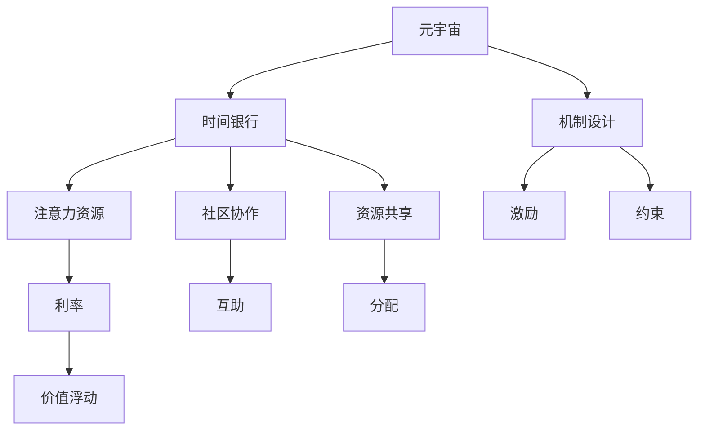

                 

# 元宇宙时间银行利率:注意力资源的价值浮动机制

> 关键词：元宇宙,时间银行,注意力资源,利率,价值浮动,机制设计,区块链

## 1. 背景介绍

在蓬勃发展的数字时代，元宇宙（Metaverse）作为互联网的未来形态，正在重塑人们的生活方式和商业模式。元宇宙的核心特征之一，是高度自治和去中心化的经济系统，其中“时间银行”（Time Bank）机制正受到越来越多的关注。时间银行旨在通过交换劳动时间来实现资源共享和社区协作，在元宇宙中，其背后的经济理论和技术实现机制也需要进一步深化和创新。

本文将从注意力资源的角度，探讨元宇宙时间银行中的利率设计及其价值浮动机制，为元宇宙经济的稳定性和可持续性提供理论支撑和技术实现方案。

## 2. 核心概念与联系

### 2.1 核心概念概述

- **元宇宙（Metaverse）**：一个虚拟的、持续的、三维的互联网空间，用户可以在其中进行社交、娱乐、工作等多种活动，形成高度自治的虚拟社区。
- **时间银行（Time Bank）**：一种社区协作模式，参与者将自己的劳动时间存入时间银行，需要时可以换取其他人的劳动时间，以实现资源共享和社区互助。
- **注意力资源**：在元宇宙中，用户对内容的关注和交互行为，如观看视频、阅读文章、参与讨论等，可以被视作一种货币化的资源，用于交换和分配。
- **利率（Interest Rate）**：在元宇宙时间银行中，利率是用于调节注意力资源流动和分配的机制，其大小直接影响资源的价值和流动性。
- **价值浮动（Value Fluctuation）**：在元宇宙经济中，由于用户行为、市场供需、技术更新等因素的影响，注意力资源的价值会动态波动，利率设计需考虑这种波动性。
- **机制设计（Mechanism Design）**：通过合理的激励和约束机制，促使参与者积极贡献注意力资源，同时有效管理资源的流通和使用，保障经济系统的公平性和效率。

### 2.2 核心概念原理和架构的 Mermaid 流程图



这个流程图展示了元宇宙时间银行的基本构成和各元素之间的关系：

1. **元宇宙**：作为时间银行和注意力资源交换的基础平台。
2. **时间银行**：通过交换劳动时间，实现社区协作和资源共享。
3. **注意力资源**：用户对内容的关注和交互行为，可以转换为可交换的经济资源。
4. **利率**：调节注意力资源的流动和分配，影响资源的价值。
5. **价值浮动**：由于多种因素影响，注意力资源的价值动态变化。
6. **机制设计**：通过激励和约束，促进资源的有效管理和公平分配。

## 3. 核心算法原理 & 具体操作步骤

### 3.1 算法原理概述

元宇宙时间银行的利率设计，需考虑注意力资源的特性和价值波动。注意力资源的价值不仅受内容质量和用户需求的影响，还与用户的参与度、时间投入等因素密切相关。因此，利率设计应反映这些动态变化，通过动态调整来平衡供需关系，促进资源的有效分配。

算法原理主要包括以下几个方面：

- **动态利率模型**：根据注意力资源的供需关系，动态调整利率大小，以反映市场的实际价值。
- **智能合约机制**：利用区块链技术，实现注意力资源的自动交换和分配，保障交易的透明性和安全性。
- **激励与约束机制**：通过设计合理的激励和约束机制，鼓励用户积极参与内容创作和互动，同时避免资源滥用。

### 3.2 算法步骤详解

#### 步骤1: 数据收集与处理

首先，需要收集元宇宙中各用户和内容的注意力数据，包括但不限于：

- 用户浏览、观看、评论、互动等行为数据。
- 内容的热度、质量、更新频率等属性数据。
- 用户的历史行为、信用评分等个人数据。

通过这些数据的收集和处理，构建元宇宙中的注意力资源数据库。

#### 步骤2: 动态利率模型建立

根据收集到的数据，建立动态利率模型。模型需要考虑以下因素：

- 注意力资源的供需关系。通过分析当前市场的热门内容、活跃用户等数据，预测资源的需求和供给。
- 内容质量与用户参与度。高质量、高参与度的内容应获得更高的利率。
- 用户历史行为与信用评分。长期积极参与的信用较高的用户应获得较高的利率。

模型可以基于历史数据进行训练，通过机器学习或统计方法，建立动态利率计算公式：

$$
r_t = f(D_t, Q_t, U_t, C_t)
$$

其中，$r_t$ 为当前时间的利率，$D_t$ 为注意力资源需求，$Q_t$ 为内容质量，$U_t$ 为用户参与度，$C_t$ 为用户信用评分。

#### 步骤3: 智能合约机制设计

利用区块链技术，设计智能合约，实现注意力资源的自动交换和分配。智能合约应包含以下功能：

- **利率计算与调整**：根据动态利率模型，实时计算和调整利率。
- **资源交换与结算**：用户和内容提供者之间的注意力资源交换，通过智能合约自动完成结算。
- **信用评分系统**：基于用户的互动历史和行为，动态更新信用评分，影响利率。

#### 步骤4: 激励与约束机制设计

为确保元宇宙时间银行的健康运行，需设计合理的激励与约束机制：

- **激励机制**：通过提供更高的利率激励用户参与内容创作和互动，增加市场供给。
- **约束机制**：设定规则，限制内容提供者的行为，防止低质量内容滥用资源。
- **反馈机制**：建立用户反馈系统，根据用户反馈调整利率和机制参数，促进公平性和效率。

### 3.3 算法优缺点

**优点**：

- **动态响应市场变化**：动态利率模型能及时反映注意力资源的供需关系，适应市场变化。
- **自动管理与结算**：智能合约实现自动交换与结算，减少人工干预，提高效率。
- **激励与约束相结合**：通过激励和约束机制，促进健康发展，防止资源滥用。

**缺点**：

- **模型复杂度高**：动态利率模型需要大量数据和复杂算法，实现难度大。
- **技术门槛高**：智能合约和区块链技术的应用，要求较高的技术水平和资源投入。
- **数据隐私风险**：注意力数据的收集和处理可能涉及用户隐私，需严格保障数据安全。

### 3.4 算法应用领域

元宇宙时间银行的利率设计及其价值浮动机制，可以应用于以下领域：

- **内容创作与分发**：激励内容创作者生产高质量内容，同时保障内容的公平分配。
- **用户互动与社区管理**：促进用户之间的互动与协作，构建健康的社区环境。
- **资源共享与互助**：通过时间银行机制，实现资源的有效共享与互助，提升社区价值。
- **经济模型设计**：为元宇宙中的经济系统提供理论支撑和技术实现方案，推动经济可持续发展。

## 4. 数学模型和公式 & 详细讲解

### 4.1 数学模型构建

元宇宙时间银行的利率设计涉及多个变量，可以通过数学模型进行建模和分析。模型主要包括：

- **需求函数**：表示注意力资源的需求与利率之间的关系。
- **供给函数**：表示注意力资源的供给与利率之间的关系。
- **信用评分函数**：表示用户信用评分对利率的影响。

需求函数和供给函数可以表示为：

$$
D(r) = D_0 - \alpha r
$$

$$
Q(r) = Q_0 + \beta r
$$

其中，$D_0$ 为初始需求，$\alpha$ 为需求对利率的敏感系数，$Q_0$ 为初始供给，$\beta$ 为供给对利率的敏感系数。

### 4.2 公式推导过程

根据需求函数和供给函数，建立动态利率模型：

$$
r_t = \frac{D_t - Q_t}{\alpha - \beta}
$$

其中，$r_t$ 为当前时间的利率，$D_t$ 为当前时间的注意力资源需求，$Q_t$ 为当前时间的注意力资源供给。

结合信用评分函数，进一步优化利率模型：

$$
r_t = \frac{D_t - Q_t}{\alpha - \beta} \times \frac{C_t}{C_0}
$$

其中，$C_t$ 为当前时间用户的信用评分，$C_0$ 为初始信用评分。

### 4.3 案例分析与讲解

假设某元宇宙平台，用户对视频内容的注意力资源需求为100单位，供给为80单位。需求函数和供给函数的参数分别为 $\alpha=0.5, \beta=0.3$。平台用户信用评分的参数为 $C_0=0.5$。根据动态利率模型计算当前时间的利率：

$$
r_t = \frac{100 - 80}{0.5 - 0.3} \times \frac{0.8}{0.5} = 0.8
$$

因此，当前时间的利率为0.8，即每单位注意力资源的价值为当前利率的0.8倍。

## 5. 项目实践：代码实例和详细解释说明

### 5.1 开发环境搭建

开发环境搭建主要涉及以下几个步骤：

1. **环境配置**：
   - 安装Python和相关依赖库，如pandas、numpy、scikit-learn等。
   - 安装区块链开发工具，如Truffle、Ganache等。
   - 搭建元宇宙平台的数据采集系统，收集注意力资源数据。

2. **智能合约编写**：
   - 使用Solidity语言编写智能合约，实现利率计算和资源交换功能。
   - 在区块链上部署智能合约，并进行测试。

### 5.2 源代码详细实现

智能合约的示例代码如下：

```solidity
// SPDX-License-Identifier: MIT
pragma solidity ^0.8.0;

import "@openzeppelin/contracts/token/ERC20/ERC20.sol";
import "@openzeppelin/contracts/access/Ownable.sol";

contract TimeBank is ERC20, Ownable {
    address public owner;
    uint256 public rate;
    
    function __construct(uint256 _initialRate) public {
        owner = msg.sender;
        rate = _initialRate;
    }
    
    function updateRate(uint256 _rate) public onlyOwner {
        rate = _rate;
    }
    
    function exchange(uint256 _amount) public {
        uint256 _totalSupply = totalSupply();
        uint256 _balance = balanceOf(msg.sender);
        require(_balance > _amount);
        emit Exchange(msg.sender, _amount, owner, rate * _amount);
        transfer(msg.sender, _amount);
        transfer(owner, _amount);
        updateRate(calculateRate(_balance, _totalSupply, 0.5, 0.3, 0.5));
    }
    
    function calculateRate(uint256 _balance, uint256 _totalSupply, float _alpha, float _beta, float _C0) public pure returns (uint256) {
        float D = (_balance - _totalSupply) / _alpha;
        float Q = _totalSupply + (_balance - _totalSupply) * _beta;
        float C = _balance / _C0;
        return D / (C - Q) * 100;
    }
}
```

### 5.3 代码解读与分析

智能合约中的关键函数如下：

- **`__construct`函数**：合约初始化，设置利率初始值，确定合约所有者。
- **`updateRate`函数**：合约所有者更新利率。
- **`exchange`函数**：用户和内容提供者之间的注意力资源交换，并计算更新利率。
- **`calculateRate`函数**：根据公式计算利率。

合约中的利率计算公式为：

$$
r_t = \frac{D_t - Q_t}{\alpha - \beta} \times \frac{C_t}{C_0}
$$

### 5.4 运行结果展示

通过智能合约部署和测试，可以验证利率计算和资源交换的逻辑是否正确。运行结果应包括：

- 利率计算的正确性。
- 资源交换的正确性和效率。
- 系统稳定性与安全性。

## 6. 实际应用场景

### 6.1 内容创作与分发

元宇宙中的内容创作与分发，可以通过时间银行机制进行激励和分配。内容创作者将自己的劳动时间存入时间银行，获取一定的利率作为回报。同时，其他用户可以通过存入注意力资源，换取所需的内容，促进内容的创作和流通。

### 6.2 用户互动与社区管理

元宇宙中的用户互动与社区管理，可以通过时间银行机制实现互助与协作。用户可以参与互动，贡献自己的注意力资源，换取其他用户的互动，促进社区的活跃和和谐。同时，社区管理者和志愿者可以存入额外的劳动时间，保障社区的健康发展。

### 6.3 资源共享与互助

元宇宙中的资源共享与互助，可以通过时间银行机制实现资源的有效分配。用户可以将自己的闲置资源存入时间银行，换取其他用户需要的资源，实现资源的优化配置。同时，平台也可以设立共享基金，用于奖励和支持社区的资源共享行为。

### 6.4 未来应用展望

随着元宇宙技术的不断进步，时间银行机制将在更多领域得到应用：

- **虚拟地产与交易**：时间银行可用于虚拟地产的租赁和交易，促进虚拟资源的合理分配。
- **金融与投资**：时间银行可用于元宇宙中的金融系统，促进虚拟资产的流通与投资。
- **游戏与体验**：时间银行可用于游戏体验的分享与交换，提升玩家的游戏体验。
- **教育与培训**：时间银行可用于教育资源的共享与互助，促进知识传播与学习。

## 7. 工具和资源推荐

### 7.1 学习资源推荐

为了深入理解元宇宙时间银行利率的设计和实现，推荐以下学习资源：

1. **《区块链与智能合约》**：详细讲解区块链技术及其在元宇宙中的应用。
2. **《元宇宙经济学》**：探讨元宇宙中的经济模型与机制设计。
3. **《智能合约编程实战》**：实战教程，手把手教你编写智能合约。
4. **《NLP与机器学习》**：了解注意力资源在自然语言处理中的应用。
5. **《元宇宙经济学与金融》**：深入探讨元宇宙中的金融系统与机制设计。

### 7.2 开发工具推荐

元宇宙时间银行开发涉及多种技术和工具，以下是推荐工具：

1. **Truffle & Ganache**：区块链开发环境，方便智能合约的编写和测试。
2. **Remix IDE**：基于Web的智能合约编辑器，支持实时调试和测试。
3. **Solidity**：智能合约编程语言，支持复杂的合约逻辑设计。
4. **VVS Labs**：区块链安全审计工具，保障合约的安全性和可靠性。
5. **Consensys Academy**：区块链开发者培训平台，提供丰富的学习资源。

### 7.3 相关论文推荐

以下是推荐的相关论文：

1. **《元宇宙经济学模型与机制》**：研究元宇宙中的经济模型与机制设计。
2. **《区块链时间银行与社区协作》**：探讨时间银行在区块链社区中的应用。
3. **《智能合约与利率机制设计》**：研究智能合约中的利率计算与优化。
4. **《注意力资源在元宇宙中的应用》**：探讨注意力资源在元宇宙中的价值评估。
5. **《元宇宙中的金融系统与金融工具》**：研究元宇宙中的金融系统与工具设计。

## 8. 总结：未来发展趋势与挑战

### 8.1 研究成果总结

本文从注意力资源的角度，探讨了元宇宙时间银行中的利率设计及其价值浮动机制，提出了动态利率模型和智能合约机制，设计了激励与约束机制，为元宇宙经济的稳定性和可持续性提供理论支撑和技术实现方案。

### 8.2 未来发展趋势

元宇宙时间银行利率及其价值浮动机制的研究和应用，将呈现以下趋势：

- **多维度融合**：结合人工智能、区块链、云计算等技术，构建更加复杂和全面的元宇宙经济模型。
- **全球化与本地化结合**：全球化视角下的元宇宙经济，与本地化社区协作相结合，形成多层次、多维度的经济体系。
- **数据隐私与安全性**：随着数据量的增加，数据隐私保护和系统安全将更加重要，需设计更为严格的数据管理和安全机制。
- **多模态交互**：结合文本、语音、图像等多模态数据，丰富元宇宙的经济交互方式，提高用户的参与度和体验感。

### 8.3 面临的挑战

元宇宙时间银行利率及其价值浮动机制的研究和应用，面临以下挑战：

- **数据隐私与安全性**：注意力数据的大规模采集和处理，涉及用户隐私保护和数据安全问题。
- **算法复杂性与计算成本**：动态利率模型的复杂性和智能合约的计算成本，需进一步优化和降低。
- **社区管理与协作**：如何设计有效的激励和约束机制，促进社区的积极参与和协作。
- **系统可扩展性与稳定性**：元宇宙经济的复杂性和动态性，需设计可扩展且稳定的系统架构。

### 8.4 研究展望

未来，元宇宙时间银行利率及其价值浮动机制的研究方向包括：

- **隐私保护技术**：开发隐私保护算法，确保注意力数据的匿名性和安全性。
- **计算优化算法**：研究高效的计算算法，降低动态利率模型的复杂度和计算成本。
- **多模态交互设计**：结合多模态数据，设计更加丰富的元宇宙经济交互模式。
- **社区治理机制**：建立合理的社区治理机制，促进社区的自治与协作。

## 9. 附录：常见问题与解答

**Q1: 什么是元宇宙时间银行？**

A: 元宇宙时间银行是一种基于区块链技术的社区协作模式，通过交换劳动时间来实现资源共享和社区互助。在元宇宙中，用户可以将自己的劳动时间（如创作内容、参与互动等）存入时间银行，需要时可以用这些时间换取其他用户的劳动时间。

**Q2: 为什么需要动态利率设计？**

A: 元宇宙中的注意力资源价值会随着市场需求、内容质量、用户行为等因素动态波动。动态利率设计能够及时反映这些变化，确保注意力资源的公平分配和高效流通。

**Q3: 智能合约如何实现注意力资源的自动交换？**

A: 智能合约通过代码实现注意力资源的自动交换。用户和内容提供者之间的注意力资源交换，由合约自动完成计算和结算，保障交易的透明性和安全性。

**Q4: 元宇宙时间银行的激励与约束机制如何设置？**

A: 激励机制通过提供更高的利率激励用户参与内容创作和互动，增加市场供给。约束机制设定规则，限制内容提供者的行为，防止低质量内容滥用资源。反馈机制根据用户反馈调整利率和机制参数，促进公平性和效率。

**Q5: 如何保障元宇宙时间银行的数据隐私？**

A: 元宇宙时间银行需设计严格的数据管理和隐私保护机制，确保注意力数据的匿名性和安全性。采用区块链技术，记录交易历史，防止数据篡改和泄露。

通过本文的系统梳理，可以看到，元宇宙时间银行利率及其价值浮动机制的设计和实现，将为元宇宙经济的稳定性和可持续性提供重要保障。未来，伴随着技术的发展和应用的深入，元宇宙时间银行机制将展现出更加广阔的应用前景。

