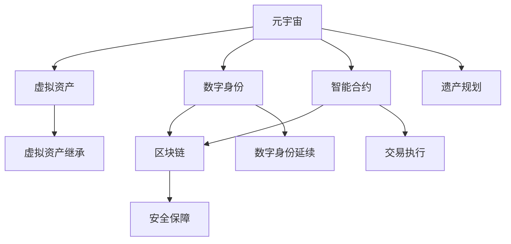

                 

# 元宇宙遗产规划与管理:虚拟资产传承的综合咨询服务体系

> 关键词：元宇宙,虚拟资产,遗产规划,数字身份,智能合约,区块链,元宇宙身份识别,数字资产管理,元宇宙安全保障

## 1. 背景介绍

### 1.1 问题由来

随着数字经济和虚拟经济的蓬勃发展，元宇宙这一虚拟现实和数字化的融合形态应运而生。元宇宙不仅改变了人们的生活方式和工作方式，也为虚拟资产的继承和管理带来了新的挑战和机遇。传统遗产规划和管理方式无法直接应用于虚拟资产，因为虚拟资产不同于传统物理资产，其所有权、使用权、控制权等均存在于数字世界。

此外，随着元宇宙的普及，越来越多的用户在元宇宙中创建虚拟身份、购置虚拟土地、购买虚拟艺术品等，这些虚拟资产在未来的继承问题上如何处理，成为了亟待解决的问题。然而，现有的法律体系和遗产管理方法无法覆盖虚拟资产的继承问题，且难以适应元宇宙中复杂多样的资产形式。

### 1.2 问题核心关键点

元宇宙遗产规划与管理的关键在于：
- **虚拟资产所有权的确认**：确保虚拟资产的所有权能够被清晰地确认和继承。
- **数字身份的延续**：确保虚拟身份能够被继承和延续，保持其在元宇宙中的权益。
- **智能合约的执行**：通过智能合约，实现虚拟资产的继承、转让、交易等功能。
- **区块链的安全性**：利用区块链技术，确保元宇宙中的交易和继承过程安全可靠。
- **元宇宙资产的实际价值**：合理评估虚拟资产的实际价值，避免价值流失和误解。

## 2. 核心概念与联系

### 2.1 核心概念概述

元宇宙遗产规划与管理涉及到以下几个核心概念：

- **元宇宙（Metaverse）**：一个集成的数字环境，用户可以在其中创建、互动和探索虚拟世界。
- **虚拟资产（Virtual Assets）**：在元宇宙中拥有的数字物品，如虚拟土地、虚拟艺术品、数字身份等。
- **数字身份（Digital Identity）**：用户在元宇宙中的唯一标识，通常通过加密公钥进行验证。
- **智能合约（Smart Contracts）**：在区块链上自动执行的合约，可以用于自动转移虚拟资产。
- **区块链（Blockchain）**：一种分布式账本技术，确保元宇宙中的交易记录透明可追溯。

这些概念相互联系，共同构成了元宇宙遗产规划与管理的理论基础。

### 2.2 核心概念原理和架构的 Mermaid 流程图(Mermaid 流程节点中不要有括号、逗号等特殊字符)



这个流程图展示了元宇宙遗产规划与管理的基本架构，其中：

- 元宇宙(A)通过虚拟资产(B)、数字身份(C)、智能合约(D)和区块链(E)进行连接。
- 遗产规划(F)、虚拟资产继承(G)、数字身份延续(H)、交易执行(I)和安全性保障(J)是元宇宙遗产管理的主要功能模块。

## 3. 核心算法原理 & 具体操作步骤
### 3.1 算法原理概述

元宇宙遗产规划与管理的核心算法原理主要基于以下几个方面：

- **区块链技术**：利用区块链的不可篡改性和透明性，确保虚拟资产的所有权和继承过程的安全性和可追溯性。
- **智能合约**：通过自动执行的合约，实现虚拟资产的继承、转让和交易，减少人为干预，提高效率。
- **数字身份管理**：使用公钥加密技术，确保数字身份的唯一性和不可伪造性。
- **遗产规划算法**：通过算法实现对虚拟资产的分类、评估和规划，确保合理分配和继承。

### 3.2 算法步骤详解

1. **数字身份创建与验证**：
   - 用户创建一个唯一的数字身份，通常包含公钥和私钥。
   - 数字身份通过公钥加密技术验证，确保身份的真实性。

2. **虚拟资产购置与登记**：
   - 用户在元宇宙中购置虚拟资产，并将其登记在区块链上。
   - 购置记录不可篡改，确保所有权归属于购置者。

3. **遗产规划与制定**：
   - 用户根据法律和意愿，制定遗产规划，确定虚拟资产的分配方案。
   - 遗产规划经过数字签名后，上传至区块链进行记录。

4. **智能合约执行**：
   - 当用户去世时，智能合约根据遗产规划自动执行虚拟资产的继承。
   - 智能合约通过区块链验证所有权和继承人身份，确保继承过程的合法性。

5. **数字身份延续**：
   - 在虚拟资产继承的同时，继承人可以延续前用户的数字身份。
   - 数字身份延续需要经过区块链验证，确保身份的唯一性和合法性。

6. **安全保障**：
   - 利用区块链的分布式特性，保障数据安全。
   - 引入加密技术，保护虚拟资产和数字身份的安全。

### 3.3 算法优缺点

**优点**：

- **安全性高**：通过区块链和智能合约，确保虚拟资产和数字身份的安全性。
- **透明可追溯**：区块链的透明性和不可篡改性，确保继承过程透明可追溯。
- **效率高**：智能合约自动执行，减少人为干预，提高效率。

**缺点**：

- **复杂度高**：涉及区块链、智能合约、数字身份等多个技术领域，实现复杂。
- **法律依据不足**：现有法律体系无法覆盖虚拟资产的继承问题，需要进一步完善。
- **成本高**：购置虚拟资产、购置区块链服务等，成本较高。

### 3.4 算法应用领域

元宇宙遗产规划与管理在以下领域有广泛应用：

- **游戏行业**：玩家在游戏中购置虚拟资产，需要考虑遗产继承问题。
- **艺术领域**：数字艺术品购置和继承，需要确保艺术品的真实性和归属权。
- **商业地产**：虚拟地产购置和转让，需要保障所有权和继承权。
- **社交平台**：虚拟身份购置和延续，需要确保身份的唯一性和合法性。

## 4. 数学模型和公式 & 详细讲解 & 举例说明（备注：数学公式请使用latex格式，latex嵌入文中独立段落使用 $$，段落内使用 $)
### 4.1 数学模型构建

元宇宙遗产规划与管理的数学模型主要包括以下几个部分：

- **公钥加密模型**：用于验证数字身份的真实性。
- **智能合约执行模型**：用于自动执行虚拟资产的继承和转让。
- **遗产规划算法模型**：用于虚拟资产的分类、评估和规划。

### 4.2 公式推导过程

以公钥加密模型为例，公钥加密的数学基础是椭圆曲线密码学。假设有一个椭圆曲线$E(\mathbb{F}_p)$，其中$p$是一个大素数，$G$是椭圆曲线上的一个基点。用户的公钥和私钥分别是$P$和$s$，其中$P$是$sG$。

椭圆曲线加密模型的公式如下：

$$
P = sG
$$

在实际应用中，用户的公钥$P$和私钥$s$是存储在区块链上的。其他用户可以通过验证公钥来验证数字身份的真实性。

### 4.3 案例分析与讲解

假设Alice在元宇宙中购置了一块虚拟土地，并将其登记在区块链上。Alice去世后，需要进行虚拟土地的继承。

1. **数字身份创建与验证**：Alice创建数字身份，并生成公钥和私钥。
2. **虚拟资产购置与登记**：Alice在元宇宙购置虚拟土地，并将其登记在区块链上。
3. **遗产规划与制定**：Alice制定遗产规划，确定虚拟土地的继承人。
4. **智能合约执行**：Alice去世后，智能合约自动执行，将虚拟土地转移给指定的继承人。
5. **数字身份延续**：继承人可以延续Alice的数字身份，继续使用这块虚拟土地。

## 5. 项目实践：代码实例和详细解释说明
### 5.1 开发环境搭建

开发元宇宙遗产规划与管理的代码，需要以下环境：

- **编程语言**：Python、JavaScript
- **开发框架**：React、Flask、Ethereum
- **区块链平台**：以太坊、波卡

搭建开发环境的步骤如下：

1. **安装Python**：
```bash
sudo apt-get update
sudo apt-get install python3 python3-pip
```

2. **安装React**：
```bash
npm install -g create-react-app
```

3. **搭建Flask应用**：
```bash
pip install Flask
```

4. **连接Ethereum**：
```bash
pip install web3
```

### 5.2 源代码详细实现

以下是一个简单的元宇宙遗产规划与管理的代码实现，用于验证数字身份和购置虚拟资产：

```python
from flask import Flask, request, jsonify
from web3 import Web3

app = Flask(__name__)

# 连接以太坊网络
web3 = Web3(Web3.HTTPProvider('https://mainnet.infura.io/v3/YOUR_INFURA_KEY'))

# 生成公钥和私钥
def generate_keypair():
    return web3.eth.account.keyerate('12345678')

# 验证数字身份
def verify_identity(public_key):
    return web3.eth.account.sign(public_key) == web3.eth.account.recover(public_key, signature)

# 购置虚拟资产
def purchase_virtual_asset(address, amount):
    tx = {
        'to': address,
        'value': web3.toWei(amount, 'ether'),
        'gas': 200000
    }
    signed_tx = web3.eth.account.signTransaction(tx, private_key)
    tx_hash = web3.eth.sendRawTransaction(signed_tx.rawTransaction)
    return tx_hash

# 区块链查询
def query_blockchain(address):
    balances = web3.eth.getBalance(address)
    balances = web3.fromWei(balances, 'ether')
    return balances

# 用户接口
@app.route('/identity', methods=['POST'])
def identity():
    public_key = request.json['public_key']
    if verify_identity(public_key):
        return jsonify({'status': 'OK'})
    else:
        return jsonify({'status': 'Error'})

@app.route('/asset', methods=['POST'])
def asset():
    address = request.json['address']
    amount = request.json['amount']
    tx_hash = purchase_virtual_asset(address, amount)
    return jsonify({'tx_hash': tx_hash})

@app.route('/balance', methods=['GET'])
def balance():
    address = request.args.get('address')
    balances = query_blockchain(address)
    return jsonify({'balance': balances})

if __name__ == '__main__':
    app.run(debug=True)
```

### 5.3 代码解读与分析

该代码实现了以下功能：

- **数字身份验证**：通过公钥加密技术验证数字身份的真实性。
- **虚拟资产购置**：通过以太坊智能合约购置虚拟资产，并将购置记录存储在区块链上。
- **区块链查询**：查询指定地址的余额。

### 5.4 运行结果展示

运行上述代码后，可以在浏览器中访问`http://localhost:5000/identity`和`http://localhost:5000/asset`进行身份验证和购置虚拟资产，并访问`http://localhost:5000/balance`查询余额。

## 6. 实际应用场景

### 6.1 游戏行业

在游戏行业中，玩家在游戏中购置虚拟资产，如虚拟武器、装备、皮肤等，这些资产在未来的继承问题上如何处理，成为了亟待解决的问题。

### 6.2 艺术领域

在艺术领域，数字艺术品购置和继承，需要确保艺术品的真实性和归属权。元宇宙遗产规划与管理可以为艺术家和收藏家提供便利。

### 6.3 商业地产

在商业地产中，虚拟地产购置和转让，需要保障所有权和继承权。元宇宙遗产规划与管理可以确保交易的合法性和透明性。

### 6.4 社交平台

在社交平台上，虚拟身份购置和延续，需要确保身份的唯一性和合法性。元宇宙遗产规划与管理可以保障用户数字资产的安全。

## 7. 工具和资源推荐
### 7.1 学习资源推荐

为了帮助开发者系统掌握元宇宙遗产规划与管理的理论基础和实践技巧，这里推荐一些优质的学习资源：

1. **《元宇宙原理与实践》系列博文**：由元宇宙技术专家撰写，深入浅出地介绍了元宇宙的基本原理、技术和应用场景。

2. **《区块链技术与应用》课程**：清华大学开设的区块链技术课程，系统讲解了区块链的基本概念和应用场景，适合初学者学习。

3. **《智能合约开发指南》书籍**：介绍智能合约的开发流程和技术细节，适合有一定编程基础的开发者。

4. **Web3.js官方文档**：Web3.js是连接以太坊的JavaScript库，官方文档详细介绍了如何使用Web3.js进行以太坊开发。

5. **Etherscan区块链浏览器**：用于查询以太坊区块链上的交易记录和余额。

### 7.2 开发工具推荐

高效的开发离不开优秀的工具支持。以下是几款用于元宇宙遗产规划与管理的常用工具：

1. **Visual Studio Code**：一款轻量级的代码编辑器，支持Python、JavaScript等多种编程语言，提供丰富的插件和扩展。

2. **GitHub**：全球最大的代码托管平台，支持版本控制和协作开发。

3. **Truffle**：以太坊开发框架，支持智能合约的开发、测试和部署。

4. **Remix IDE**：用于以太坊智能合约的开发和测试，支持代码编辑器和区块链浏览器。

5. **OpenSea**：NFT（非同质化代币）交易平台，支持元宇宙资产的购置和交易。

### 7.3 相关论文推荐

元宇宙遗产规划与管理的研究源于学界的持续研究。以下是几篇奠基性的相关论文，推荐阅读：

1. **《区块链技术在数字资产传承中的应用》**：讨论了区块链在数字资产继承中的作用和优势。

2. **《智能合约在遗产规划中的应用》**：介绍了智能合约在遗产规划中的实现方法和优势。

3. **《元宇宙中的数字身份管理》**：探讨了数字身份在元宇宙中的创建和管理方法。

4. **《元宇宙资产的继承与转让》**：分析了元宇宙资产继承和转让的实现方法和法律问题。

这些论文代表了大模型微调技术的发展脉络。通过学习这些前沿成果，可以帮助研究者把握学科前进方向，激发更多的创新灵感。

## 8. 总结：未来发展趋势与挑战

### 8.1 总结

本文对元宇宙遗产规划与管理的方法进行了全面系统的介绍。首先阐述了元宇宙和虚拟资产的背景和意义，明确了数字身份、智能合约和区块链等关键概念。其次，从原理到实践，详细讲解了元宇宙遗产规划与管理的数学模型和具体操作步骤，给出了元宇宙遗产规划的代码实现。最后，本文还广泛探讨了元宇宙遗产规划与管理在多个行业领域的应用前景，展示了元宇宙技术的发展潜力。

通过本文的系统梳理，可以看到，元宇宙遗产规划与管理技术正在成为元宇宙应用的重要范式，极大地拓展了数字资产的继承和管理方式，为虚拟世界的财产权提供了新的解决方案。未来，伴随元宇宙技术的不断演进，元宇宙遗产规划与管理必将在虚拟世界中发挥更加重要的作用。

### 8.2 未来发展趋势

展望未来，元宇宙遗产规划与管理技术将呈现以下几个发展趋势：

1. **法律体系的完善**：随着元宇宙技术的普及，相关法律体系也将逐步完善，为虚拟资产的继承和管理提供法律保障。
2. **智能合约的普及**：智能合约将在元宇宙中得到更广泛的应用，实现虚拟资产的自动继承和转让。
3. **区块链技术的创新**：新的区块链技术，如跨链技术、分层共识等，将进一步提升元宇宙资产的安全性和效率。
4. **数字身份的标准化**：数字身份的标准化和互认机制将逐步完善，保障用户数字资产的安全。
5. **元宇宙资产的虚拟化**：越来越多的实物资产将数字化，实现虚拟化继承和管理。

以上趋势凸显了元宇宙遗产规划与管理技术的广阔前景。这些方向的探索发展，必将进一步提升元宇宙资产的继承和管理效率，保障用户的权益。

### 8.3 面临的挑战

尽管元宇宙遗产规划与管理技术已经取得了瞩目成就，但在迈向更加智能化、普适化应用的过程中，它仍面临着诸多挑战：

1. **法律依据不足**：现有的法律体系无法覆盖虚拟资产的继承问题，需要进一步完善。
2. **技术复杂度高**：涉及区块链、智能合约、数字身份等多个技术领域，实现复杂。
3. **隐私保护问题**：用户数字身份和虚拟资产的隐私保护，需要进一步加强。
4. **技术成熟度低**：当前的技术水平尚无法完全解决元宇宙遗产规划与管理中的所有问题，需要进一步研究。
5. **用户体验问题**：元宇宙资产的购置和继承过程，需要更加人性化、便捷的设计。

这些挑战需要开发者和研究者共同努力，不断优化技术方案，才能真正实现元宇宙遗产规划与管理的落地应用。

### 8.4 研究展望

面向未来，元宇宙遗产规划与管理技术需要在以下几个方面寻求新的突破：

1. **法律和监管框架的建立**：完善元宇宙遗产规划与管理的法律和监管框架，确保数字资产的合法性和安全性。
2. **跨平台和跨链技术的应用**：实现元宇宙中不同平台和链之间的互操作性，提升元宇宙资产的流动性。
3. **隐私保护机制的创新**：引入隐私计算、零知识证明等技术，保障用户数字身份和虚拟资产的隐私。
4. **智能合约的升级**：开发更加灵活、高效的智能合约，支持更复杂的虚拟资产继承和转让场景。
5. **用户交互设计的优化**：设计更加友好、便捷的用户界面和交互方式，提升用户的使用体验。

这些研究方向的探索，必将引领元宇宙遗产规划与管理技术迈向更高的台阶，为构建安全、可靠、可控的元宇宙环境提供新的解决方案。

## 9. 附录：常见问题与解答

**Q1：数字身份如何保证其唯一性和不可伪造性？**

A: 数字身份的创建通常需要公钥加密技术，通过公钥和私钥的匹配验证身份的真实性。在区块链上，公钥是唯一的，因此数字身份具有唯一性和不可伪造性。

**Q2：智能合约如何保证自动执行的可靠性？**

A: 智能合约通过区块链的分布式共识机制确保其自动执行的可靠性。区块链的透明性和不可篡改性，保证了智能合约的执行过程透明可追溯，避免了人为干预。

**Q3：元宇宙资产的实际价值如何评估？**

A: 元宇宙资产的实际价值可以通过市场交易价格、用户评价、历史数据等多种因素进行评估。同时，元宇宙资产的价值评估也需要结合实际应用场景和用户需求进行综合考虑。

**Q4：元宇宙资产的继承和转让如何实现？**

A: 元宇宙资产的继承和转让通过智能合约自动执行，需要继承人和受让人的数字身份进行验证，确保继承和转让过程的合法性和透明性。

**Q5：元宇宙资产的安全性如何保障？**

A: 元宇宙资产的安全性主要通过区块链和智能合约来实现。区块链的不可篡改性和透明性，智能合约的自动执行，保证了资产的安全性和可靠性。

---

作者：禅与计算机程序设计艺术 / Zen and the Art of Computer Programming

