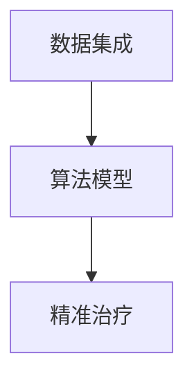

                 

# 全球脑与个性化医疗:集体智慧驱动的精准治疗方案

## 1. 背景介绍

### 1.1 问题由来
随着科学技术的进步和数据获取手段的丰富，医疗行业正面临着一场革命。传统上，医疗决策主要依赖于医生的个人经验和直觉，但这种方式存在主观性强、经验积累慢等问题。而近年来，随着大数据、人工智能等技术的兴起，医疗决策方式正在逐步向数据驱动和算法驱动转变。

特别是，在脑科学和个性化医疗领域，基于大规模数据和先进算法的精准治疗方案，正在逐渐成为医疗决策的重要手段。全球脑项目（Brain Map）和个性化医疗（Personalized Medicine）等概念的提出，推动了这一趋势的发展。

### 1.2 问题核心关键点
精准医疗的核心在于利用个体化的基因、环境、生活方式等多种数据，结合先进的算法模型，实现针对个体的精准治疗方案。其关键点在于：

- **数据集成**：收集和整合个体的多维度健康数据，包括基因组数据、电子病历、生活习惯等。
- **算法模型**：构建复杂而高效的算法模型，从海量的数据中提取有价值的特征，进行疾病预测和治疗方案优化。
- **精准治疗**：根据个体特征和疾病状态，提供量身定制的治疗方案，显著提高治疗效果和患者满意度。

### 1.3 问题研究意义
精准医疗的发展将大大提高医疗决策的科学性和精确性，减少误诊、误治，降低医疗成本，提高患者的生活质量。对于脑科学领域，精准医疗的应用有望揭示大脑复杂功能的机制，推动脑疾病的早期诊断和治疗，从而改善人类的认知健康。

## 2. 核心概念与联系

### 2.1 核心概念概述

精准医疗涉及多个核心概念，包括数据集成、算法模型、精准治疗等。每个概念之间通过数据流和算法流程紧密联系，共同构成了一个系统的精准医疗框架。

- **数据集成**：指从不同来源收集个体健康数据，包括基因组数据、电子病历、生活习惯等，并整合到统一的数据平台。
- **算法模型**：利用机器学习、深度学习等算法，从数据中提取特征，进行疾病预测和治疗方案优化。
- **精准治疗**：根据个体特征和疾病状态，提供个性化的治疗方案，实现精准治疗。

以下是一个Mermaid流程图，展示了这些核心概念之间的联系：



这个流程图展示了大规模数据集成和算法模型在精准医疗中的应用。数据集成是基础，算法模型是关键，精准治疗是目标。

## 3. 核心算法原理 & 具体操作步骤
### 3.1 算法原理概述

精准医疗的核心算法包括机器学习、深度学习、集成学习等。这些算法通过建模个体特征和疾病状态之间的关系，实现精准的疾病预测和治疗方案优化。

以深度学习为例，其核心在于构建一个复杂的神经网络，通过多层的非线性映射，从原始数据中提取高阶特征。常用的深度学习模型包括卷积神经网络（CNN）、循环神经网络（RNN）、长短时记忆网络（LSTM）等。

### 3.2 算法步骤详解

一个典型的精准医疗算法流程包括以下几个步骤：

1. **数据预处理**：对原始数据进行清洗、去重、归一化等预处理，准备输入模型的数据。
2. **特征工程**：从原始数据中提取有用的特征，选择或构造能够反映个体特征和疾病状态的数据集合。
3. **模型训练**：使用训练集对算法模型进行训练，调整模型参数，使其在验证集上达到最佳性能。
4. **模型评估**：在测试集上对模型进行评估，验证其泛化能力，并根据评估结果进行微调。
5. **精准治疗**：将训练好的模型应用于实际患者，提供个性化的治疗方案。

### 3.3 算法优缺点

深度学习等算法在精准医疗中的应用具有以下优点：

- **高精度**：通过多层次的特征提取，可以精确地预测疾病状态和治疗效果。
- **自适应性**：模型可以通过不断学习和更新，适应新的数据和新的治疗方案。
- **处理复杂性**：可以处理多种类型的数据，包括基因组数据、电子病历、影像数据等。

同时，这些算法也存在一些缺点：

- **计算资源需求高**：深度学习模型通常需要大量的计算资源和存储空间。
- **解释性差**：深度学习模型通常是黑盒模型，难以解释其内部的决策过程。
- **数据隐私问题**：大规模数据集的应用可能涉及个人隐私保护问题。

### 3.4 算法应用领域

深度学习等算法在精准医疗中有着广泛的应用，主要包括以下几个领域：

- **疾病预测**：基于基因组数据和生活方式数据，预测个体患某些疾病的风险。
- **治疗方案优化**：根据个体特征和疾病状态，推荐最有效的治疗方案。
- **影像分析**：利用深度学习算法对医疗影像进行自动分析和诊断。
- **个性化用药**：结合基因组数据，优化药物治疗方案。

## 4. 数学模型和公式 & 详细讲解 & 举例说明

### 4.1 数学模型构建

在精准医疗中，常用的数学模型包括回归模型、分类模型、聚类模型等。这里以回归模型为例，介绍其在精准医疗中的应用。

### 4.2 公式推导过程

设有一组样本数据 $(x_1, y_1), (x_2, y_2), \ldots, (x_n, y_n)$，其中 $x_i \in \mathbb{R}^d$ 为输入特征，$y_i \in \mathbb{R}$ 为输出标签。回归模型的目标是最小化损失函数 $L(\theta)$，其中 $\theta$ 为模型参数。常用的回归模型有线性回归和多项式回归，其损失函数分别为：

$$
L_{lin}(\theta) = \frac{1}{2n}\sum_{i=1}^n (y_i - \theta^T x_i)^2
$$

$$
L_{poly}(\theta) = \frac{1}{2n}\sum_{i=1}^n (y_i - \theta^T \phi(x_i))^2
$$

其中，$\phi(x_i)$ 为特征映射函数，将 $x_i$ 映射到高维空间。

### 4.3 案例分析与讲解

以疾病预测为例，假设我们有一组基因组数据和疾病标签，想要构建一个回归模型来预测个体的疾病风险。具体步骤如下：

1. **数据准备**：收集基因组数据和疾病标签，并进行预处理。
2. **特征选择**：选择或构造能够反映疾病风险的基因特征。
3. **模型训练**：使用训练集对回归模型进行训练，调整参数。
4. **模型评估**：在验证集上评估模型的性能，并根据评估结果进行微调。
5. **疾病预测**：将新的基因组数据输入训练好的模型，预测个体的疾病风险。

下面是一个Python实现的例子：

```python
import pandas as pd
from sklearn.linear_model import LinearRegression

# 准备数据
data = pd.read_csv('genomic_data.csv')
X = data.drop('disease', axis=1)
y = data['disease']

# 特征选择
features = ['gene1', 'gene2', 'gene3']

# 模型训练
model = LinearRegression()
model.fit(X[features], y)

# 模型评估
y_pred = model.predict(X[features])
print('模型评估结果：', model.score(X[features], y))

# 疾病预测
new_data = pd.DataFrame({'gene1': [10, 20, 30], 'gene2': [5, 10, 15]})
new_features = features
y_pred = model.predict(new_data[new_features])
print('预测结果：', y_pred)
```

## 5. 项目实践：代码实例和详细解释说明
### 5.1 开发环境搭建

进行精准医疗项目开发，需要先搭建好开发环境。以下是一些建议：

1. **Python环境**：使用Anaconda或Miniconda创建虚拟环境，安装必要的Python库和依赖。
2. **数据集准备**：收集和整理个体的多维度健康数据，准备用于训练和测试的模型。
3. **深度学习框架**：选择TensorFlow、PyTorch等深度学习框架进行模型构建和训练。

### 5.2 源代码详细实现

以下是一个基于TensorFlow的疾病预测项目的代码实现：

```python
import tensorflow as tf
from tensorflow.keras import layers

# 准备数据
X_train = # 训练集特征数据
y_train = # 训练集标签
X_val = # 验证集特征数据
y_val = # 验证集标签
X_test = # 测试集特征数据
y_test = # 测试集标签

# 构建模型
model = tf.keras.Sequential([
    layers.Dense(64, activation='relu', input_shape=(X_train.shape[1],)),
    layers.Dense(64, activation='relu'),
    layers.Dense(1)
])

# 编译模型
model.compile(optimizer=tf.keras.optimizers.Adam(), loss='mse', metrics=['mae'])

# 模型训练
model.fit(X_train, y_train, validation_data=(X_val, y_val), epochs=10)

# 模型评估
loss, mae = model.evaluate(X_test, y_test)
print('测试集上的损失：', loss)
print('测试集上的MAE：', mae)

# 疾病预测
new_data = # 新的输入数据
y_pred = model.predict(new_data)
print('预测结果：', y_pred)
```

### 5.3 代码解读与分析

这个代码实现了基于TensorFlow的线性回归模型，用于疾病预测。以下是代码的详细解读：

- **数据准备**：需要收集训练集、验证集和测试集的数据，并将特征数据和标签数据分开存储。
- **模型构建**：使用Sequential API定义模型结构，包括两个全连接层和一个输出层。
- **模型编译**：设置优化器、损失函数和评估指标，编译模型。
- **模型训练**：使用训练集对模型进行训练，在验证集上评估模型性能，调整超参数。
- **模型评估**：在测试集上评估模型性能，输出损失和MAE指标。
- **疾病预测**：使用训练好的模型对新的输入数据进行预测，输出预测结果。

## 6. 实际应用场景
### 6.1 疾病预测

疾病预测是精准医疗中的重要应用之一。通过收集个体的基因组数据和生活方式数据，可以预测个体患某些疾病的风险，提供个性化的预防和治疗建议。

例如，基因芯片数据可以用于预测个体的癌症风险，电子病历数据可以用于预测心脏病风险。利用这些数据，可以构建基于机器学习或深度学习的预测模型，实现疾病的早期预警。

### 6.2 治疗方案优化

治疗方案优化是指根据个体的基因特征、生活习惯和疾病状态，推荐最适合的治疗方案。这可以显著提高治疗效果，减少副作用。

例如，利用基因组数据，可以为患者推荐最有效的抗癌药物。利用电子病历数据，可以评估患者对某类药物的敏感性，优化治疗方案。

### 6.3 影像分析

医疗影像分析是精准医疗中的重要环节。通过深度学习算法，可以对医疗影像进行自动分析和诊断，提供准确的疾病诊断结果。

例如，利用卷积神经网络（CNN）可以对医学影像（如X光片、CT扫描等）进行分类和定位。利用生成对抗网络（GAN）可以生成高质量的医疗影像，用于疾病研究和教学。

### 6.4 个性化用药

个性化用药是指根据个体的基因特征，推荐最有效的药物和用药方案。这可以避免副作用，提高治疗效果。

例如，利用基因组数据，可以为患者推荐最有效的抗癌药物。利用电子病历数据，可以评估患者对某类药物的敏感性，优化用药方案。

## 7. 工具和资源推荐
### 7.1 学习资源推荐

为了帮助开发者系统掌握精准医疗的理论基础和实践技巧，这里推荐一些优质的学习资源：

1. **Coursera的深度学习课程**：由斯坦福大学Andrew Ng教授主讲的深度学习课程，涵盖了深度学习的基本概念和应用。
2. **Kaggle的精准医疗竞赛**：通过参与竞赛，可以学习和实践精准医疗的实际应用案例。
3. **《深度学习》书籍**：Ian Goodfellow等著，是深度学习领域的经典教材，介绍了深度学习的基本概念和算法。
4. **TensorFlow官方文档**：提供了详细的TensorFlow使用方法和案例，适合入门和进阶学习。
5. **Coursera的个性化医疗课程**：由Johns Hopkins University提供的个性化医疗课程，介绍了精准医疗的基本概念和应用。

通过对这些资源的学习实践，相信你一定能够快速掌握精准医疗的理论基础和实践技巧。

### 7.2 开发工具推荐

以下是一些常用的开发工具和资源，帮助开发者快速构建和优化精准医疗模型：

1. **Python和Jupyter Notebook**：Python是一种灵活的编程语言，Jupyter Notebook提供了交互式的数据分析和模型开发环境。
2. **TensorFlow和PyTorch**：常用的深度学习框架，提供了丰富的模型构建和训练工具。
3. **TensorBoard**：TensorFlow配套的可视化工具，用于监控模型训练过程和输出结果。
4. **Keras**：TensorFlow的高层API，提供了简单易用的模型构建和训练接口。
5. **Pandas和NumPy**：常用的数据处理库，提供了高效的数据清洗和特征工程功能。

合理利用这些工具，可以显著提升精准医疗模型的开发效率和效果。

### 7.3 相关论文推荐

精准医疗的发展离不开学界和产业界的持续研究。以下是几篇奠基性的相关论文，推荐阅读：

1. **Lifespan Genomic Medicine: A Systems Biology Approach**：提出基于系统生物学的方法，用于个体基因组的精准医疗。
2. **A Deep Learning Approach to Personalized Medicine**：利用深度学习算法，实现精准医疗的个性化治疗方案。
3. **A Novel Approach to Personalized Medicine Using Genomic Data**：提出基于基因组数据和机器学习的精准医疗方法。
4. **Deep Learning for Medical Imaging**：利用深度学习算法，对医疗影像进行自动分析和诊断。
5. **Machine Learning for Personalized Medicine**：利用机器学习算法，实现个性化医疗的疾病预测和治疗方案优化。

这些论文代表了精准医疗技术的发展脉络，展示了其在多个应用场景中的实践成果。

## 8. 总结：未来发展趋势与挑战
### 8.1 总结

本文对全球脑和个性化医疗的精准治疗方案进行了全面系统的介绍。首先阐述了精准医疗的研究背景和意义，明确了数据集成、算法模型、精准治疗等核心概念及其相互联系。其次，从原理到实践，详细讲解了深度学习在精准医疗中的应用，给出了模型构建和训练的代码实例。同时，本文还广泛探讨了精准医疗在疾病预测、治疗方案优化、影像分析和个性化用药等多个领域的应用前景，展示了其广阔的发展潜力。此外，本文精选了精准医疗技术的各类学习资源，力求为读者提供全方位的技术指引。

通过本文的系统梳理，可以看到，精准医疗正在成为医疗决策的重要手段，极大地提高了医疗决策的科学性和精确性。未来，伴随深度学习算法和数据技术的不断进步，精准医疗必将在更广阔的领域发挥其独特价值。

### 8.2 未来发展趋势

展望未来，精准医疗的发展将呈现以下几个趋势：

1. **数据融合与集成**：随着数据获取手段的不断丰富，个体健康数据的维度将进一步扩展。如何有效整合和利用这些数据，将成为精准医疗的重要挑战。
2. **算法优化与创新**：深度学习等算法的精度和效率将进一步提升，更多的优化算法和创新模型将被提出，以应对复杂的医疗问题。
3. **跨学科融合**：精准医疗将与脑科学、基因组学、生物信息学等学科进行更深层次的融合，推动多学科交叉研究。
4. **个性化与通用化**：未来的精准医疗将更加个性化，同时保持一定的通用性，以满足不同个体和群体的需求。
5. **伦理与隐私保护**：随着数据量的增加，如何保护患者隐私和数据安全，将是精准医疗发展的重要保障。

这些趋势凸显了精准医疗技术的广阔前景，将推动医疗行业向着更加科学、精准、个性化的方向发展。

### 8.3 面临的挑战

尽管精准医疗技术已经取得了显著进展，但在迈向全面应用的过程中，仍面临诸多挑战：

1. **数据质量与完整性**：个体健康数据的质量和完整性直接影响模型的训练效果。如何获取和处理高质量的数据，将是精准医疗面临的重要问题。
2. **算法鲁棒性与泛化能力**：模型在面对未知数据和异常情况时，容易产生偏差和过拟合。如何提高算法的鲁棒性和泛化能力，将是重要的研究方向。
3. **计算资源与成本**：深度学习模型通常需要大量的计算资源和存储空间。如何降低计算成本，提高模型的可扩展性，将是关键的优化方向。
4. **伦理与隐私保护**：大规模数据集的应用可能涉及个人隐私保护问题。如何保护患者隐私，确保数据安全，将是重要的伦理和法律问题。

### 8.4 研究展望

面对精准医疗面临的诸多挑战，未来的研究需要在以下几个方面寻求新的突破：

1. **数据质量提升**：开发更加高效和自动化的数据收集和处理技术，提升数据质量。
2. **算法模型优化**：研究更加高效和鲁棒的算法模型，提高模型的泛化能力和鲁棒性。
3. **跨学科合作**：推动脑科学、基因组学、生物信息学等多学科的深度合作，实现多领域数据的整合和应用。
4. **伦理与隐私保护**：制定更加完善的伦理和法律规范，确保数据隐私和安全。

这些研究方向将推动精准医疗技术向更加科学、可靠、可控的方向发展，为构建安全、高效、个性化的医疗系统铺平道路。面向未来，精准医疗技术还需要与其他人工智能技术进行更深入的融合，如知识表示、因果推理、强化学习等，多路径协同发力，共同推动自然语言理解和智能交互系统的进步。只有勇于创新、敢于突破，才能不断拓展精准医疗技术的边界，为人类健康事业做出更大的贡献。

## 9. 附录：常见问题与解答

**Q1：如何选择合适的机器学习算法？**

A: 选择合适的机器学习算法需要考虑多个因素，包括数据类型、问题类型、算法复杂度等。通常，回归问题适合使用线性回归、决策树等算法，分类问题适合使用逻辑回归、支持向量机等算法，聚类问题适合使用K-means、层次聚类等算法。具体选择时，可以通过交叉验证、网格搜索等方法进行评估和选择。

**Q2：模型在测试集上表现不佳的原因是什么？**

A: 模型在测试集上表现不佳可能由多种原因导致，包括过拟合、数据分布差异、超参数选择不当等。常见的缓解策略包括数据增强、正则化、早停等。此外，还需要考虑模型是否足够复杂，是否存在数据泄露等问题。

**Q3：深度学习模型的训练时间过长如何优化？**

A: 深度学习模型的训练时间过长可能是由于模型复杂度过高、数据规模过大等原因导致。优化方法包括使用GPU/TPU等硬件加速、使用混合精度训练、数据预处理等。同时，可以通过调整超参数、使用更小的模型等方法进行优化。

**Q4：如何处理缺失数据和异常值？**

A: 缺失数据和异常值是数据处理中常见的问题。处理缺失数据的方法包括删除、插值、模型预测等。处理异常值的方法包括删除、替换、截断等。具体选择时需要根据数据特点和问题类型进行灵活选择。

**Q5：如何保护数据隐私和安全？**

A: 数据隐私和安全是精准医疗中的重要问题。保护数据隐私的方法包括数据匿名化、加密、访问控制等。数据安全保护的方法包括数据备份、网络安全、身份认证等。具体措施需要根据数据特点和应用场景进行合理选择和设计。

---

作者：禅与计算机程序设计艺术 / Zen and the Art of Computer Programming

