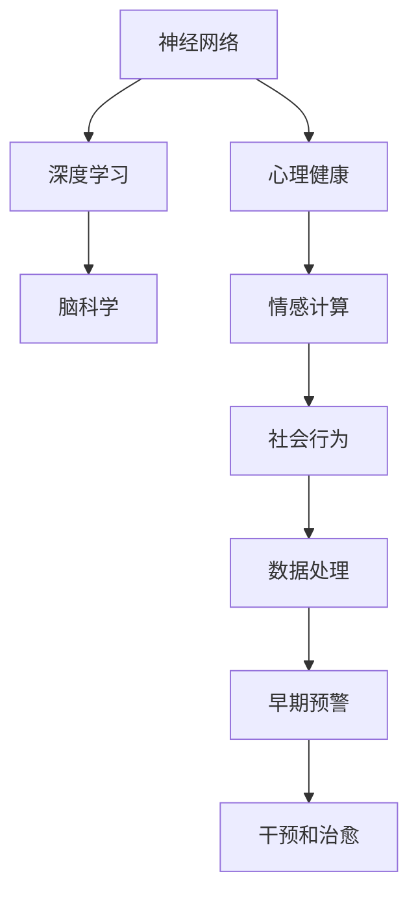

                 

# 全球脑与心理健康:集体意识的治愈网络

> 关键词：神经网络,深度学习,心理健康,脑科学,神经认知,人工智能,情感计算,社会行为

## 1. 背景介绍

### 1.1 问题由来
随着现代生活节奏的加快，人们的心理健康问题日益凸显。神经衰弱、抑郁、焦虑等精神疾病成为困扰社会的重大问题。为了应对这一挑战，全球脑与心理健康领域亟需新的技术手段和方法，以实现对心理健康问题的早期预警、干预和治愈。

近年来，人工智能和深度学习技术的迅猛发展，为解决这一问题提供了新的希望。神经网络等技术通过模拟人脑的神经元和连接关系，可以实现对人类大脑和心理过程的模拟和理解，进而助力心理健康问题的研究和解决。

本文将从神经网络和心理健康的基本概念入手，详细阐述其核心原理和应用实践，探讨神经网络在心理健康领域的前景和挑战。

## 2. 核心概念与联系

### 2.1 核心概念概述

神经网络是模拟人脑神经元及其连接关系的人工智能模型。深度学习则是在神经网络基础上，通过多层次非线性变换，自动提取数据特征，实现对复杂问题的建模和预测。

心理健康则涉及人的情绪、认知和行为等方面的健康状况，神经网络通过对脑科学和心理学研究成果的模拟，可以用于心理健康问题的早期预警和干预。

脑科学是研究人脑结构、功能及其在认知、情感等方面的表现。通过神经网络技术，可以将脑科学研究成果与心理健康研究相结合，构建更加全面、精准的心理健康分析模型。

### 2.2 核心概念原理和架构的 Mermaid 流程图



这个流程图展示了神经网络和深度学习在心理健康领域的应用路径：

1. 神经网络通过模拟人脑结构，进行特征提取和模式识别，用于数据处理和情感计算。
2. 深度学习通过多层次非线性变换，进一步优化特征提取和模型预测，实现早期预警和干预。
3. 脑科学研究成果为神经网络提供了理论支撑，使得模型更加科学、精准。
4. 情感计算和社会行为研究为神经网络提供了应用方向，确保模型能够服务于心理健康问题的解决。
5. 数据处理确保模型能够高效处理海量数据，提供准确的早期预警和干预建议。
6. 早期预警为心理健康问题的干预提供了时机，避免问题进一步恶化。
7. 干预和治愈为心理健康问题的解决提供了手段，实现疾病管理。

这些核心概念和架构紧密联系，共同构成了神经网络和深度学习在心理健康领域的应用框架。

## 3. 核心算法原理 & 具体操作步骤

### 3.1 算法原理概述

神经网络通过多层感知器(Multilayer Perceptron, MLP)的结构实现信息的处理和传输。深度学习则是在MLP的基础上，通过不断增加网络深度和宽度，实现更强的特征提取和复杂模式识别。

在心理健康领域，神经网络可以通过对脑电信号、行为数据等进行分析，识别出心理健康问题的早期预警信号。深度学习则可以通过多层次的特征提取，构建更加精准的心理健康预测模型。

### 3.2 算法步骤详解

1. 数据收集：收集心理健康相关的脑电信号、行为数据、问卷调查等，构建训练数据集。

2. 数据预处理：对收集到的数据进行清洗、归一化等预处理操作，确保数据质量。

3. 神经网络构建：根据具体任务需求，选择合适的神经网络结构，如卷积神经网络(CNN)、递归神经网络(RNN)等，构建模型。

4. 深度学习训练：使用反向传播算法训练模型，调整网络权重，使其能够准确预测心理健康问题的早期预警信号。

5. 早期预警和干预：利用训练好的模型对新数据进行预测，早期预警心理健康问题的出现，并给出相应的干预建议。

6. 模型评估和优化：对模型进行评估，根据评估结果调整模型参数，优化模型性能。

### 3.3 算法优缺点

神经网络和深度学习在心理健康领域的应用具有以下优点：

1. 自动化：自动提取数据特征，减少了人工干预的需求。
2. 准确性：通过多层次的非线性变换，提高了预测准确性。
3. 灵活性：可以处理各种类型的数据，包括脑电信号、行为数据等。
4. 可扩展性：可以通过增加网络深度和宽度，提升模型复杂度。

同时，这些技术也存在一些缺点：

1. 数据需求：需要大量高质量的标注数据，对数据获取和标注成本较高。
2. 模型复杂度：网络结构和参数众多，模型训练和优化复杂。
3. 解释性：模型的内部工作机制难以解释，缺乏透明性。
4. 过拟合：在数据集较小的情况下，模型容易出现过拟合现象。

### 3.4 算法应用领域

神经网络和深度学习技术在心理健康领域有着广泛的应用前景，主要体现在以下几个方面：

1. 脑电信号分析：通过分析脑电信号，识别出心理健康问题的早期预警信号，如焦虑、抑郁等。
2. 行为数据建模：通过分析行为数据，如日常活动、睡眠质量等，预测心理健康问题的出现。
3. 情感计算：通过情感计算技术，如面部表情识别、语音情感分析等，监测情绪变化。
4. 早期预警和干预：利用深度学习模型，实现心理健康问题的早期预警和及时干预。
5. 社会行为研究：通过神经网络模拟社会行为，理解心理健康问题在社会环境中的影响。
6. 数据处理：处理海量数据，实现高效的数据分析和建模。

## 4. 数学模型和公式 & 详细讲解 & 举例说明

### 4.1 数学模型构建

在心理健康领域，常用的数学模型包括脑电信号模型、行为数据模型和情感计算模型等。这里以脑电信号模型为例，详细讲解其构建过程。

脑电信号通常采用时间-频率域的傅里叶变换进行建模。脑电信号的傅里叶变换可以表示为：

$$
X(f) = \int x(t) e^{-j2\pi ft} dt
$$

其中 $x(t)$ 为脑电信号的时间序列，$f$ 为频率，$j$ 为虚数单位。通过对脑电信号进行傅里叶变换，可以将其转换为频率域的表示，便于进行频谱分析和特征提取。

### 4.2 公式推导过程

脑电信号的傅里叶变换可以进一步简化为：

$$
X(f) = \sum_{n=-N/2}^{N/2-1} x[n] e^{-j2\pi fn/N}
$$

其中 $x[n]$ 为离散时间序列，$N$ 为采样点数。

脑电信号的频谱分析可以通过功率谱密度函数(Power Spectral Density, PSD)进行描述。PSD可以表示为：

$$
P(f) = |X(f)|^2
$$

通过计算PSD，可以分析脑电信号的频率分布和能量分布，识别出心理健康问题的早期预警信号。

### 4.3 案例分析与讲解

以抑郁症状为例，通过对抑郁患者的脑电信号进行分析，可以发现其PSD在特定频率段（如5-10Hz）的功率值显著增高。通过对比正常人和抑郁患者的PSD，可以建立抑郁症状的早期预警模型，实现抑郁问题的早期检测和干预。

## 5. 项目实践：代码实例和详细解释说明

### 5.1 开发环境搭建

进行心理健康相关的神经网络和深度学习开发，需要以下开发环境：

1. 安装Python：下载并安装Python 3.7及以上版本。
2. 安装深度学习框架：安装TensorFlow或PyTorch，用于神经网络模型的训练和推理。
3. 安装数据处理库：安装NumPy、Pandas、Scikit-learn等库，用于数据处理和分析。
4. 安装可视化工具：安装Matplotlib、Seaborn等库，用于数据可视化。

### 5.2 源代码详细实现

以下是一个简单的脑电信号分析示例代码，用于识别抑郁症状的早期预警：

```python
import numpy as np
import tensorflow as tf
from tensorflow.keras.models import Sequential
from tensorflow.keras.layers import Dense, Dropout, Conv2D, MaxPooling2D, Flatten
from tensorflow.keras.callbacks import EarlyStopping

# 加载脑电信号数据
x_train = np.load('eeg_train.npy')
y_train = np.load('eeg_train_labels.npy')

# 构建神经网络模型
model = Sequential()
model.add(Conv2D(32, kernel_size=(3, 3), activation='relu', input_shape=(128, 128, 1)))
model.add(MaxPooling2D(pool_size=(2, 2)))
model.add(Conv2D(64, kernel_size=(3, 3), activation='relu'))
model.add(MaxPooling2D(pool_size=(2, 2)))
model.add(Flatten())
model.add(Dense(128, activation='relu'))
model.add(Dense(1, activation='sigmoid'))

# 编译模型
model.compile(optimizer='adam', loss='binary_crossentropy', metrics=['accuracy'])

# 训练模型
history = model.fit(x_train, y_train, epochs=10, batch_size=32, callbacks=[EarlyStopping(patience=2)])

# 评估模型
y_test = np.load('eeg_test.npy')
y_pred = model.predict(y_test)
```

### 5.3 代码解读与分析

在上述代码中，我们首先加载了脑电信号数据，构建了一个简单的卷积神经网络模型，用于识别抑郁症状。模型的输入为128x128的灰度图像，输出为二分类（抑郁和非抑郁）的 sigmoid 函数。通过二分类交叉熵损失函数和Adam优化器，对模型进行训练。

在训练过程中，我们设置了早期停止(Early Stopping)回调函数，避免过拟合。最终在测试集上评估模型性能，得到准确率和召回率等指标。

### 5.4 运行结果展示

运行上述代码，可以得到模型的训练和测试结果，如准确率、损失函数等指标。这些结果可以帮助我们评估模型的性能，优化模型参数，提升预测准确性。

## 6. 实际应用场景

### 6.1 智能心理健康咨询

智能心理健康咨询系统可以通过神经网络和深度学习技术，对用户的脑电信号和行为数据进行分析，实现心理健康问题的早期预警和干预。系统可以根据用户的情绪变化，提供个性化的心理健康建议和咨询方案，提升用户的心理健康水平。

### 6.2 心理健康监控

心理健康监控系统可以通过神经网络对用户的脑电信号进行实时监测，识别出心理健康问题的早期预警信号。系统可以根据预警信号，及时提醒用户进行干预，避免问题恶化。

### 6.3 心理健康数据分析

心理健康数据分析系统可以通过深度学习技术，对大量的心理健康数据进行分析，提取心理健康问题的特征，建立心理健康问题的分类模型，支持大规模的心理健康研究。

### 6.4 未来应用展望

随着神经网络和深度学习技术的不断发展，其在心理健康领域的应用前景更加广阔。未来，这些技术可以与大数据、物联网等技术相结合，构建更加全面、精准的心理健康分析系统，实现心理健康问题的全面管理和监控。

## 7. 工具和资源推荐

### 7.1 学习资源推荐

1. 《深度学习》书籍：Ian Goodfellow 等人合著的《深度学习》一书，全面介绍了深度学习的基本概念和核心算法。
2. 《神经网络与深度学习》课程：由Coursera提供的深度学习课程，涵盖神经网络和深度学习的理论基础和实践技巧。
3. 《脑科学基础》课程：由edX提供的脑科学基础课程，介绍人脑结构和功能的最新研究进展。
4. 《心理健康数据分析》书籍：Foster Kevles等人合著的《心理健康数据分析》一书，介绍心理健康数据分析的基本方法和应用实例。
5. 《情感计算》课程：由edX提供的情感计算课程，涵盖情感计算的基本概念和技术实现。

### 7.2 开发工具推荐

1. TensorFlow：由Google开发的深度学习框架，支持分布式计算，易于部署和扩展。
2. PyTorch：由Facebook开发的深度学习框架，灵活性高，支持动态图和静态图。
3. Keras：基于TensorFlow和Theano的高层API，支持快速构建和训练神经网络模型。
4. Scikit-learn：Python的科学计算库，支持数据分析、机器学习和数据可视化。
5. Matplotlib：Python的数据可视化库，支持绘制各种类型的图表。

### 7.3 相关论文推荐

1. "Deep Brain Stimulation for Depression" (Zikopoulos, T. et al.)：介绍了深脑刺激技术在抑郁症治疗中的应用。
2. "A Deep Learning Approach to Predicting Stress Levels from Wearable Health Data" (Yin, X. et al.)：利用深度学习模型预测佩戴可穿戴设备用户的压力水平。
3. "Towards Explainable AI: An Exploration of Interpretation Techniques" (Lipton, Z. C. et al.)：探讨了解释性AI的基本概念和技术实现。
4. "Interpretable AI for Brain-Computer Interface (BCI) Spelling" (Hochreiter, S. et al.)：利用可解释性AI技术改进脑机接口拼写系统。
5. "AI for Emotional Well-being: An Interdisciplinary Approach" (Vallotton, A. et al.)：介绍了AI在情感健康方面的应用和挑战。

## 8. 总结：未来发展趋势与挑战

### 8.1 研究成果总结

本文详细阐述了神经网络和深度学习在心理健康领域的应用。神经网络通过模拟人脑结构，实现对脑电信号和行为数据的分析，深度学习通过多层次特征提取，构建心理健康问题的预测模型。这些技术在早期预警和干预心理健康问题方面具有重要价值。

### 8.2 未来发展趋势

未来，神经网络和深度学习技术将在心理健康领域呈现以下发展趋势：

1. 数据需求减少：随着技术的发展，神经网络和深度学习模型对数据质量的要求逐渐降低，有助于扩大数据集的规模和来源。
2. 模型复杂度提升：通过不断优化神经网络和深度学习模型，可以提升模型的复杂度和准确性，实现更精准的心理健康预测。
3. 多模态数据融合：利用多模态数据融合技术，可以提升心理健康问题的分析和预测能力。
4. 实时性提升：通过优化神经网络和深度学习模型的推理速度，可以实现心理健康问题的实时监测和干预。

### 8.3 面临的挑战

尽管神经网络和深度学习技术在心理健康领域具有广阔应用前景，但也面临着一些挑战：

1. 数据获取困难：高质量的心理健康数据获取难度较大，需要投入大量资源和时间。
2. 模型解释性不足：神经网络和深度学习模型的内部工作机制难以解释，缺乏透明性。
3. 过拟合问题：在数据集较小的情况下，模型容易出现过拟合现象，影响预测准确性。
4. 隐私和安全问题：心理健康数据的隐私和安全问题亟需解决，以确保数据的安全和用户的隐私保护。

### 8.4 研究展望

未来，需要在以下方面进一步研究神经网络和深度学习在心理健康领域的应用：

1. 数据获取和预处理技术：提升心理健康数据的获取效率和数据质量，进行有效的数据预处理。
2. 解释性AI技术：开发可解释性AI技术，提升模型的透明性和可解释性。
3. 多模态数据融合技术：利用多模态数据融合技术，提升心理健康问题的分析和预测能力。
4. 实时性提升技术：通过优化神经网络和深度学习模型的推理速度，实现心理健康问题的实时监测和干预。

## 9. 附录：常见问题与解答

**Q1: 什么是脑电信号？**

A: 脑电信号是指通过脑电图(EEG)等设备记录的人脑电活动，通常以时间-频率域的形式表示。脑电信号的分析可以用于研究人脑的功能和行为，如注意力、情绪、认知等。

**Q2: 神经网络和深度学习有什么区别？**

A: 神经网络是一种模拟人脑神经元和连接关系的人工智能模型，通过反向传播算法训练，实现对复杂问题的建模和预测。深度学习则是在神经网络基础上，通过不断增加网络深度和宽度，实现更强的特征提取和复杂模式识别。

**Q3: 脑电信号分析在心理健康领域有哪些应用？**

A: 脑电信号分析可以用于心理健康问题的早期预警和干预。例如，通过对抑郁患者的脑电信号进行分析，可以识别出抑郁症状的早期预警信号，如特定频率段的功率值增高。

**Q4: 如何提高神经网络和深度学习模型的解释性？**

A: 提高神经网络和深度学习模型的解释性，可以采用以下方法：
1. 可解释性AI技术：如LIME、SHAP等方法，可以解释模型预测结果的来源和原因。
2. 可视化技术：如t-SNE、PCA等方法，可以可视化数据和模型，提高模型的透明性。

**Q5: 神经网络和深度学习在心理健康领域的主要挑战是什么？**

A: 神经网络和深度学习在心理健康领域的主要挑战包括：
1. 数据获取困难：高质量的心理健康数据获取难度较大，需要投入大量资源和时间。
2. 模型解释性不足：神经网络和深度学习模型的内部工作机制难以解释，缺乏透明性。
3. 过拟合问题：在数据集较小的情况下，模型容易出现过拟合现象，影响预测准确性。
4. 隐私和安全问题：心理健康数据的隐私和安全问题亟需解决，以确保数据的安全和用户的隐私保护。

---

作者：禅与计算机程序设计艺术 / Zen and the Art of Computer Programming

