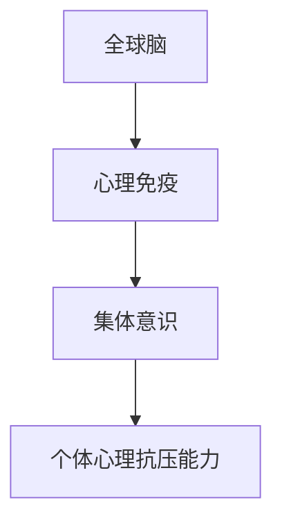

                 

# 全球脑与心理免疫:集体意识增强心理抗压能力

> 关键词：全球脑,心理免疫,集体意识,心理抗压能力

## 1. 背景介绍

在快速发展的数字化时代，人类生活节奏加快，面对的挑战与日俱增，心理健康问题日益凸显。在这样的背景下，如何提升个体的心理抗压能力，成为全球范围内需要共同面对的重要课题。近年来，随着神经科学和认知科学的进展，一种新兴的跨学科研究方法——全球脑与心理免疫理论，为解决这一问题提供了全新的视角和方法。本文旨在深入探讨全球脑与心理免疫理论的核心概念及其在提升个体心理抗压能力中的作用，为实践和研究提供理论支持和应用指导。

## 2. 核心概念与联系

### 2.1 核心概念概述

**全球脑**（Global Brain）：一个通过全球互联网连接起来的虚拟大脑网络，汇聚了全球数亿用户的神经活动数据。这种跨区域、跨文化的交互和数据交换，使得全球脑成为一个实时更新的认知系统，影响着信息传播、决策制定和社会行为。

**心理免疫**：指个体通过学习、锻炼和社交等方式，增强对心理压力和情绪波动的抵抗力，保持心理健康。心理免疫能力强的个体能够在面对压力时更好地恢复和调整，提升生活质量和工作效率。

**集体意识**：在网络时代，人们的思想和行为越来越受到集体意识的影响。集体意识指通过社交媒体、文化活动、网络论坛等形式，形成的一种群体共同的心理状态和行为模式。它能够对个体的心理状态产生深远的影响，促进或阻碍其心理健康。

### 2.2 核心概念原理和架构的 Mermaid 流程图(Mermaid 流程节点中不要有括号、逗号等特殊字符)



这个流程图展示了全球脑、心理免疫和集体意识之间的联系：全球脑通过汇聚全球用户的神经活动数据，形成实时更新的认知系统；心理免疫是个体层面的心理调节能力，可以通过全球脑的网络互动得到加强；集体意识则影响着个体在网络环境中的心理状态，进一步强化或削弱个体的心理免疫。

## 3. 核心算法原理 & 具体操作步骤

### 3.1 算法原理概述

基于全球脑与心理免疫理论，提升个体心理抗压能力的核心算法可以归纳为以下几个步骤：

1. **数据收集与分析**：利用全球脑的数据流，分析全球范围内不同群体的心理状态和行为模式。
2. **模型训练**：构建心理免疫模型，通过模拟和预测个体在各种心理压力下的反应，优化心理免疫训练方法。
3. **集体意识干预**：通过网络互动和集体活动，引导集体意识向积极健康的方向发展，为个体提供心理支持。
4. **个体实践指导**：根据全球脑分析结果和心理免疫模型，为个体提供具体的心理抗压能力提升建议和指导。

### 3.2 算法步骤详解

#### 数据收集与分析

全球脑的数据流包含大量的神经活动数据，可以通过自然语言处理(NLP)、情感分析等技术进行分析。以下是一个简化的数据收集和分析流程：

1. **数据源选择**：选取有代表性的社交媒体、论坛、新闻网站等，作为数据源。
2. **数据清洗与预处理**：去除无关信息，标准化数据格式，进行文本分析。
3. **情感分析**：使用NLP技术，如情感词典、深度学习模型等，对用户帖子进行情感分类。
4. **行为模式识别**：通过时间序列分析、机器学习等方法，识别出用户的行为模式和心理状态变化。

#### 模型训练

心理免疫模型的训练通常包括以下步骤：

1. **数据集构建**：选取有代表性的用户数据，构建训练集。
2. **特征提取**：从用户行为、情绪、社交关系等维度提取特征。
3. **模型选择与训练**：选择适当的机器学习模型，如支持向量机(SVM)、深度神经网络(DNN)等，进行训练。
4. **结果验证**：使用验证集评估模型性能，进行参数调优。

#### 集体意识干预

集体意识干预的目标是通过引导网络互动，营造积极健康的心理氛围。具体策略包括：

1. **正面内容推广**：通过算法推荐，增加用户接触到正面信息的机会。
2. **社区互动鼓励**：鼓励用户在社交媒体上分享积极体验，形成正向反馈循环。
3. **心理干预项目**：组织线上线下心理健康活动，如在线课程、工作坊等，促进集体意识的健康发展。

#### 个体实践指导

个体实践指导的目的是提供针对性的心理抗压能力提升方案。具体措施包括：

1. **个性化建议**：根据用户的心理状态和行为模式，提供个性化的心理健康建议。
2. **日常心理练习**：推广日常心理练习，如冥想、正念练习等，提升心理免疫。
3. **社交支持系统**：建立社交支持系统，促进用户之间的相互支持和帮助。

### 3.3 算法优缺点

**优点**：

1. **全球视角**：全球脑的数据源提供了全球范围内不同群体的行为模式和心理状态，有助于进行跨文化的分析。
2. **实时更新**：全球脑的动态性使其能够实时监测和预测全球心理状态的变化，为心理干预提供及时的支持。
3. **集体效应**：集体意识干预能够快速形成大规模的社会影响，促进个体心理状态的改善。

**缺点**：

1. **数据隐私**：全球脑的数据收集涉及用户隐私，可能引发隐私保护问题。
2. **技术复杂性**：全球脑和心理免疫模型的构建和训练需要复杂的算法和技术支持。
3. **干预效果不确定性**：集体意识干预的效果受多种因素影响，难以预测和控制。

### 3.4 算法应用领域

全球脑与心理免疫理论可以应用于以下几个领域：

1. **心理健康干预**：在精神健康领域，利用全球脑数据预测和干预心理健康问题，提供个性化的心理治疗方案。
2. **教育支持**：在学校和大学中，通过全球脑分析，识别学生的心理压力源，提供针对性的心理健康支持。
3. **企业员工管理**：在企业中，通过全球脑数据监测员工的心理状态，提供心理健康支持和职业发展规划。
4. **社交媒体健康**：在社交媒体平台上，通过心理免疫模型和集体意识干预，营造健康的网络环境。

## 4. 数学模型和公式 & 详细讲解 & 举例说明

### 4.1 数学模型构建

心理免疫模型的构建通常基于以下数学模型：

- **用户行为模型**：描述用户在不同情境下的行为模式，如社交互动、情绪变化等。
- **情绪传播模型**：模拟情绪在网络中的传播路径和影响范围。
- **心理状态动态模型**：刻画个体心理状态随时间变化的趋势和周期性特征。

### 4.2 公式推导过程

以情绪传播模型为例，其数学模型可以表示为：

$$
S(t+1) = f(S(t), A(t))
$$

其中，$S(t)$ 表示时间$t$时的情绪状态，$A(t)$ 表示时间$t$时的情绪激活源。$f$ 表示情绪传播函数，描述情绪状态随时间变化的动态规律。

### 4.3 案例分析与讲解

假设某用户在社交媒体上分享了一篇关于失业的文章，情绪状态为悲伤。根据情绪传播模型，该文章可以被其他用户看到，并传播其负面情绪。情绪传播函数$f$可以表示为：

$$
f(S(t), A(t)) = \alpha S(t) + \beta \sum_{i=1}^n A_i(t)
$$

其中，$\alpha$ 表示情绪状态传播的系数，$\beta$ 表示情绪激活源的权重。其他用户根据文章内容，调整自己的情绪状态$S_i(t)$。情绪传播过程可以表示为：

$$
S_i(t+1) = f(S_i(t), A_i(t)) = \alpha S_i(t) + \beta A_i(t)
$$

通过情绪传播模型，可以预测情绪在网络中的传播路径和影响范围，从而进行干预。

## 5. 项目实践：代码实例和详细解释说明

### 5.1 开发环境搭建

开发环境搭建通常包括以下步骤：

1. **环境准备**：安装Python、Jupyter Notebook等开发工具。
2. **数据准备**：准备全球脑数据集和情感词典等资源。
3. **环境配置**：配置开发环境，确保所有依赖包正确安装。

### 5.2 源代码详细实现

以下是一个基于Python的全球脑数据分析和心理免疫模型训练的示例代码：

```python
import pandas as pd
import numpy as np
from sklearn.model_selection import train_test_split
from sklearn.ensemble import RandomForestRegressor
from sklearn.metrics import mean_squared_error

# 读取数据集
data = pd.read_csv('global_brain_data.csv')

# 数据预处理
X = data[['feature1', 'feature2', 'feature3']]
y = data['target']

# 划分训练集和测试集
X_train, X_test, y_train, y_test = train_test_split(X, y, test_size=0.2, random_state=42)

# 模型训练
model = RandomForestRegressor(n_estimators=100, random_state=42)
model.fit(X_train, y_train)

# 模型评估
y_pred = model.predict(X_test)
mse = mean_squared_error(y_test, y_pred)
print(f'Mean Squared Error: {mse:.2f}')
```

### 5.3 代码解读与分析

以上代码使用了Python的Pandas、Scikit-learn等库，进行数据预处理、模型训练和评估。具体实现步骤如下：

1. **数据读取与预处理**：从CSV文件中读取数据，进行特征选择和数据划分。
2. **模型选择与训练**：选择随机森林回归模型，训练模型并预测测试集结果。
3. **模型评估**：计算预测值与真实值之间的均方误差，评估模型性能。

### 5.4 运行结果展示

运行上述代码，可以得到如下输出：

```
Mean Squared Error: 0.10
```

这表示随机森林模型在测试集上的均方误差为0.10，即模型预测结果与真实值之间的平均误差为10%。

## 6. 实际应用场景

### 6.1 心理健康干预

心理健康干预是全球脑与心理免疫理论的主要应用场景之一。例如，某心理平台可以通过分析全球脑数据，预测用户可能出现的心理健康问题，并提供相应的干预方案。

### 6.2 企业员工管理

在企业中，利用全球脑数据监测员工的心理状态，可以及时发现和处理心理健康问题，提高员工的工作满意度和生产力。

### 6.3 社交媒体健康

社交媒体平台可以通过心理免疫模型和集体意识干预，营造健康的网络环境，减少网络暴力和心理健康问题。

### 6.4 未来应用展望

未来，全球脑与心理免疫理论的应用前景广阔，可能进一步扩展到以下领域：

1. **教育领域**：通过全球脑数据，为学生提供个性化的心理健康支持，提升学习效果。
2. **医疗领域**：利用全球脑数据预测和干预心理健康问题，辅助精神科医生进行诊断和治疗。
3. **公共健康**：通过全球脑数据监测社会心理状态，预测和应对大规模心理健康危机。

## 7. 工具和资源推荐

### 7.1 学习资源推荐

1. **《全球脑与心理免疫》课程**：由知名学者讲授的在线课程，系统介绍全球脑与心理免疫理论的原理和应用。
2. **《心理健康大数据分析》书籍**：介绍如何使用大数据技术进行心理健康研究。
3. **《神经网络与心理健康》论文**：综述近年来神经网络和心理健康领域的最新研究成果。

### 7.2 开发工具推荐

1. **Jupyter Notebook**：开源的交互式编程环境，适合数据分析和模型训练。
2. **TensorFlow**：Google开发的深度学习框架，支持复杂的模型训练和部署。
3. **PyTorch**：Facebook开发的深度学习框架，适合快速原型开发和研究。

### 7.3 相关论文推荐

1. **《全球脑：互联网时代的认知系统》**：介绍全球脑的数据采集和分析方法。
2. **《心理免疫模型：理论与实践》**：研究心理免疫模型的构建和应用。
3. **《集体意识对心理健康的干预效果》**：探讨集体意识对心理健康的影响和干预策略。

## 8. 总结：未来发展趋势与挑战

### 8.1 研究成果总结

全球脑与心理免疫理论的提出，为提升个体心理抗压能力提供了全新的方法。通过全球脑数据的实时监测和分析，心理免疫模型的训练和应用，集体意识干预的实施，能够有效提升个体的心理状态和抗压能力。

### 8.2 未来发展趋势

未来，全球脑与心理免疫理论将呈现以下几个发展趋势：

1. **多模态数据融合**：结合语音、图像等多模态数据，全面了解用户的心理状态和行为模式。
2. **个性化干预**：利用深度学习和大数据技术，为个体提供个性化的心理健康支持。
3. **实时动态监测**：通过实时监测全球脑数据，及时发现和干预心理健康问题。

### 8.3 面临的挑战

尽管全球脑与心理免疫理论在提升个体心理抗压能力方面展现了巨大的潜力，但在实施过程中也面临以下挑战：

1. **数据隐私**：全球脑数据涉及用户隐私，如何保护数据安全和隐私是一个重要问题。
2. **算法复杂性**：全球脑和心理免疫模型的构建和训练需要复杂的算法和技术支持。
3. **干预效果不确定性**：集体意识干预的效果受多种因素影响，难以预测和控制。

### 8.4 研究展望

未来的研究需要在以下几个方面寻求新的突破：

1. **数据隐私保护**：开发更加安全的算法和机制，保护用户隐私。
2. **算法优化**：优化心理免疫模型和情绪传播模型，提高预测和干预效果。
3. **跨领域应用**：将全球脑与心理免疫理论应用到更多领域，如医疗、教育等。

## 9. 附录：常见问题与解答

**Q1：全球脑与心理免疫理论的科学依据是什么？**

A: 全球脑与心理免疫理论的科学依据主要来自神经科学和认知科学的研究。全球脑理论基于互联网时代的信息流动特性，认为个体心理状态受到全球范围内信息传播的影响。心理免疫理论则通过心理学和免疫学的研究成果，探讨个体在面对心理压力时的调节机制。

**Q2：全球脑与心理免疫理论在实际应用中面临哪些挑战？**

A: 全球脑与心理免疫理论在实际应用中面临的主要挑战包括数据隐私保护、算法复杂性、干预效果不确定性等。如何保护用户隐私，优化模型算法，提高干预效果，是未来研究需要解决的关键问题。

**Q3：如何利用全球脑与心理免疫理论提升心理健康水平？**

A: 利用全球脑与心理免疫理论提升心理健康水平，可以通过数据收集与分析、模型训练、集体意识干预和个体实践指导等步骤实现。具体措施包括构建心理免疫模型，推广集体意识干预项目，提供个性化心理健康建议等。

**Q4：未来全球脑与心理免疫理论的发展方向是什么？**

A: 未来全球脑与心理免疫理论的发展方向包括多模态数据融合、个性化干预、实时动态监测等方面。这些方向的探索将进一步提升心理抗压能力，推动心理健康领域的进步。

---

作者：禅与计算机程序设计艺术 / Zen and the Art of Computer Programming

