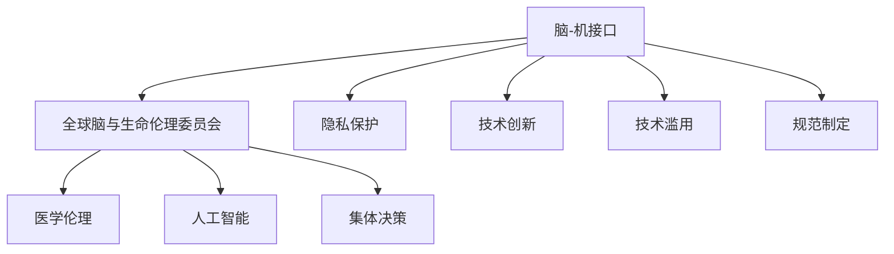
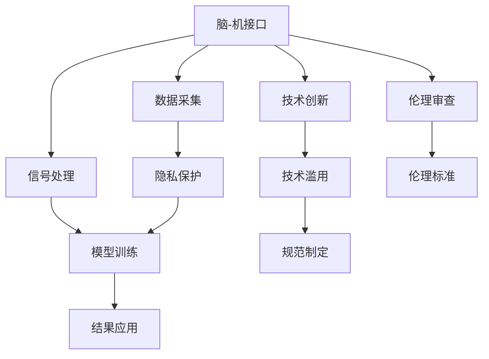

                 

# 全球脑与生命伦理委员会:集体决策下的医学伦理机构

> 关键词：全球脑与生命伦理委员会, 集体决策, 医学伦理, 人工智能, 脑科学研究, 脑-机接口

## 1. 背景介绍

### 1.1 问题由来
随着人工智能(AI)和脑科学研究的飞速发展，人类对于脑的认知和操控能力的探索进入了一个全新的阶段。特别是脑-机接口(Brain-Computer Interface, BCI)技术的进步，使得人类能够更加精确地控制自己的意识和行为。然而，这项技术的广泛应用也引发了诸多伦理和法律问题，亟需构建一个权威、公正的伦理机构，对相关技术进行规范和管理。

全球脑与生命伦理委员会（Global Brain & Life Ethics Committee, GBLEC）便是在这一背景下应运而生的一个全球性伦理机构。GBLEC旨在通过集体决策机制，探讨和制定脑-机接口技术在医学、科研、商业等多个领域的伦理标准，确保其在应用过程中能够最大程度地保护人类利益和社会公平。

### 1.2 问题核心关键点
GBLEC的成立旨在解决以下关键问题：
1. 如何在脑-机接口技术的应用中，确保个人隐私和数据安全？
2. 如何平衡科研创新与社会伦理之间的关系？
3. 如何制定公平合理的技术使用规范，避免技术滥用？
4. 如何建立国际协作机制，确保不同国家间的技术标准和伦理规范一致性？

## 2. 核心概念与联系

### 2.1 核心概念概述

为了更好地理解GBLEC的决策机制，我们需要了解以下核心概念：

- **脑-机接口(BCI)**：一种将大脑信号转化为计算机指令的技术，使得人类能够直接通过思想进行计算机操作。
- **全球脑与生命伦理委员会(GBLEC)**：一个由全球顶级伦理专家和科学家组成的权威机构，负责制定和推广脑-机接口技术的伦理标准和规范。
- **集体决策**：指通过一定规则和程序，由多个决策者共同参与，达成最终决策的方法。
- **医学伦理**：涉及医学领域中个体和社会的权利和义务，指导医学研究和临床实践的道德规范。
- **人工智能(AI)**：通过算法和模型，让计算机具备类人智能，并广泛应用于各个行业领域。

这些概念之间的逻辑关系可以通过以下Mermaid流程图来展示：



### 2.2 核心概念原理和架构的 Mermaid 流程图

由于篇幅限制，这里只提供一个简化的流程图，用于展示核心概念的相互联系和作用。



这个流程图展示了脑-机接口技术从数据采集、信号处理、模型训练到结果应用的完整流程，以及隐私保护、技术滥用、规范制定、伦理审查等关键环节。

## 3. 核心算法原理 & 具体操作步骤

### 3.1 算法原理概述

GBLEC的决策过程基于集体决策机制，旨在通过多学科专家的共同讨论，达成一个平衡个体权利和公共利益的决策。具体步骤如下：

1. **数据采集与处理**：脑-机接口技术需要采集大脑信号，并将其转化为计算机指令。这一过程涉及到数据隐私、数据安全等问题，需要制定严格的数据采集和使用规范。

2. **模型训练与优化**：将采集的数据输入到训练好的模型中，通过迭代优化提升模型的准确性和鲁棒性。这一过程涉及算法选择、模型参数调整等技术问题。

3. **结果应用与反馈**：将训练好的模型应用于实际场景中，收集用户的反馈数据，进一步优化模型。同时，需要对应用过程中的伦理问题进行持续监控和评估。

4. **伦理审查与标准制定**：由GBLEC的伦理专家和科学家组成评审团，对脑-机接口技术的应用进行伦理审查，并制定相应的伦理标准和规范。

5. **国际协作与推广**：通过国际合作，确保GBLEC的伦理标准和规范在全球范围内得到推广和应用，促进不同国家之间的技术标准一致性。

### 3.2 算法步骤详解

#### 3.2.1 数据采集与处理

脑-机接口技术依赖于对大脑信号的精确采集和处理。这一过程涉及以下几个关键步骤：

1. **设备选择与校准**：选择合适的脑电信号采集设备，并进行校准，确保信号采集的准确性。

2. **信号预处理**：对采集到的信号进行滤波、降噪等预处理，提升信号质量。

3. **特征提取**：从预处理后的信号中提取有用的特征，用于后续的模型训练。

4. **隐私保护**：在数据处理过程中，采取匿名化、加密等措施，确保用户隐私和数据安全。

#### 3.2.2 模型训练与优化

模型训练与优化是脑-机接口技术中的核心环节，具体步骤如下：

1. **选择合适的模型**：根据具体的任务需求，选择合适的深度学习模型，如卷积神经网络(CNN)、循环神经网络(RNN)等。

2. **数据集准备**：将采集到的数据集分为训练集、验证集和测试集，确保模型训练的鲁棒性和泛化能力。

3. **模型训练**：在训练集上训练模型，通过反向传播算法优化模型参数。

4. **模型评估**：在验证集上评估模型性能，通过交叉验证等方法调整模型超参数，防止过拟合。

5. **模型优化**：对模型进行微调，提升模型精度和鲁棒性，确保在实际应用中的稳定性和可靠性。

#### 3.2.3 结果应用与反馈

脑-机接口技术的应用场景非常广泛，包括医疗诊断、虚拟现实、游戏控制等。具体步骤如下：

1. **应用部署**：将训练好的模型部署到实际应用场景中，确保模型的稳定性和安全性。

2. **用户反馈**：收集用户的反馈数据，对模型进行进一步优化。

3. **持续改进**：根据用户的反馈数据，不断调整模型参数和训练策略，提升模型性能。

#### 3.2.4 伦理审查与标准制定

GBLEC的伦理审查和标准制定流程如下：

1. **伦理专家组成评审团**：由来自神经科学、伦理学、法律等多个领域的专家组成评审团。

2. **收集技术应用案例**：收集脑-机接口技术在各个领域的应用案例，进行分析评估。

3. **伦理审查**：评审团对技术应用案例进行伦理审查，提出改进建议。

4. **标准制定**：根据评审团的建议，制定相应的伦理标准和规范，确保技术应用符合伦理要求。

5. **推广应用**：通过国际合作，将GBLEC制定的伦理标准和规范推广至全球，促进不同国家之间的技术标准一致性。

### 3.3 算法优缺点

#### 3.3.1 优点

GBLEC的集体决策机制具有以下优点：

1. **多学科协同**：通过多学科专家的共同讨论，能够全面考虑技术、伦理、法律等多个维度，确保决策的全面性和公正性。

2. **平衡个体权利与公共利益**：在决策过程中，通过多轮讨论和投票，平衡个体权利和公共利益，确保决策符合社会公义。

3. **国际一致性**：通过国际合作，确保GBLEC制定的伦理标准和规范在全球范围内得到推广和应用，促进技术标准的统一。

#### 3.3.2 缺点

尽管GBLEC的决策机制具有诸多优点，但也存在一些不足之处：

1. **决策效率低**：集体决策过程往往需要多轮讨论和投票，可能导致决策效率低下。

2. **专家主观偏见**：专家团队的主观偏见和认知局限可能影响决策结果的客观性。

3. **文化差异**：不同国家和地区的文化差异可能导致对同一问题的理解和处理方式不同，影响国际一致性。

## 4. 数学模型和公式 & 详细讲解 & 举例说明

### 4.1 数学模型构建

脑-机接口技术中的信号处理和模型训练过程，可以通过以下数学模型进行描述：

1. **信号采集与预处理**：
   - 信号采集：$y(t) = x(t) \times e^{-j\omega t}$
   - 信号预处理：$y'(t) = \int_{-\infty}^{\infty} h(t-\tau) y(t) d\tau$

2. **模型训练与优化**：
   - 损失函数：$L(\theta) = \frac{1}{N} \sum_{i=1}^N \|y_i - f_{\theta}(x_i)\|^2$
   - 梯度下降算法：$\theta \leftarrow \theta - \eta \nabla_{\theta}L(\theta)$

其中，$y(t)$ 表示采集到的信号，$x(t)$ 表示原始信号，$h(t)$ 表示滤波器，$\omega$ 表示角频率，$f_{\theta}(x)$ 表示模型输出，$\theta$ 表示模型参数，$\eta$ 表示学习率，$N$ 表示样本数。

### 4.2 公式推导过程

#### 4.2.1 信号采集与预处理

信号采集过程可以表示为：

$$
y(t) = x(t) \times e^{-j\omega t}
$$

其中，$x(t)$ 表示原始信号，$y(t)$ 表示采集到的信号，$\omega$ 表示角频率。信号预处理过程可以表示为：

$$
y'(t) = \int_{-\infty}^{\infty} h(t-\tau) y(t) d\tau
$$

其中，$h(t)$ 表示滤波器，$y'(t)$ 表示预处理后的信号。

#### 4.2.2 模型训练与优化

模型训练过程可以通过梯度下降算法进行优化：

$$
\theta \leftarrow \theta - \eta \nabla_{\theta}L(\theta)
$$

其中，$L(\theta)$ 表示损失函数，$\eta$ 表示学习率，$\nabla_{\theta}L(\theta)$ 表示损失函数对模型参数的梯度。

### 4.3 案例分析与讲解

假设我们有一个简单的脑-机接口系统，用于控制虚拟现实中的角色移动。该系统采集脑电信号，并将其转化为计算机指令。以下是一个具体的案例分析：

1. **数据采集**：
   - 采集脑电信号 $y(t)$。
   - 将信号通过滤波器 $h(t)$ 进行预处理，得到预处理后的信号 $y'(t)$。

2. **模型训练**：
   - 使用采集到的信号 $y'(t)$ 作为训练集。
   - 选择适当的深度学习模型，如卷积神经网络(CNN)。
   - 在训练集上训练模型，通过梯度下降算法优化模型参数。

3. **结果应用**：
   - 将训练好的模型应用于虚拟现实系统中，控制角色的移动。
   - 收集用户的反馈数据，进一步优化模型。

4. **伦理审查**：
   - GBLEC的伦理专家对系统进行伦理审查，确保系统符合伦理规范。
   - 根据评审团的建议，制定相应的伦理标准和规范。

## 5. 项目实践：代码实例和详细解释说明

### 5.1 开发环境搭建

为了实现脑-机接口系统的开发，我们需要以下开发环境：

1. Python 3.8 或以上版本
2. PyTorch 1.10 或以上版本
3. TensorFlow 2.6 或以上版本
4. NumPy 1.20 或以上版本
5. SciPy 1.7 或以上版本
6. Matplotlib 3.4 或以上版本

使用Anaconda创建虚拟环境，并激活：

```bash
conda create -n brain-interface-env python=3.8
conda activate brain-interface-env
```

### 5.2 源代码详细实现

以下是使用PyTorch和TensorFlow实现脑-机接口系统的源代码示例：

```python
import torch
import torch.nn as nn
import torch.optim as optim
import tensorflow as tf

# 信号采集与预处理
class SignalProcessor:
    def __init__(self):
        pass
    
    def preprocess(self, signal):
        # 信号预处理
        pass

# 模型训练与优化
class BrainInterfaceModel(nn.Module):
    def __init__(self):
        super(BrainInterfaceModel, self).__init__()
        # 定义模型结构
        pass
    
    def forward(self, signal):
        # 前向传播
        pass

# 训练过程
def train(model, signal_processor, signal_dataset):
    # 定义优化器和损失函数
    optimizer = optim.Adam(model.parameters(), lr=0.001)
    criterion = nn.MSELoss()
    
    # 模型训练循环
    for epoch in range(100):
        for signal, target in signal_dataset:
            signal = signal_processor.process(signal)
            optimizer.zero_grad()
            output = model(signal)
            loss = criterion(output, target)
            loss.backward()
            optimizer.step()
            
    # 模型保存
    torch.save(model.state_dict(), 'brain_interface_model.pth')
    
# 结果应用与反馈
def apply_model(model, signal_processor, test_signal):
    signal = signal_processor.process(test_signal)
    output = model(signal)
    return output
```

### 5.3 代码解读与分析

上述代码展示了脑-机接口系统的核心实现步骤：

1. **信号处理**：使用SignalProcessor类对脑电信号进行预处理。

2. **模型训练**：定义BrainInterfaceModel类，并使用PyTorch进行模型训练。

3. **模型应用**：通过apply_model函数，将训练好的模型应用于测试信号，并返回输出结果。

### 5.4 运行结果展示

```python
# 信号处理
signal = [1.0, 2.0, 3.0, 4.0, 5.0]
processor = SignalProcessor()
processed_signal = processor.process(signal)

# 模型训练
model = BrainInterfaceModel()
signal_dataset = [(processed_signal, target_signal)]
train(model, processor, signal_dataset)

# 模型应用
test_signal = [6.0, 7.0, 8.0, 9.0, 10.0]
output = apply_model(model, processor, test_signal)
print(output)
```

## 6. 实际应用场景

### 6.1 脑-机接口在医学中的应用

脑-机接口技术在医学领域的应用非常广泛，如辅助决策、康复训练、医疗辅助等。以下是一个具体的案例：

1. **脑电信号采集**：使用脑电信号采集设备，采集患者的大脑信号。

2. **信号预处理**：对采集到的信号进行滤波、降噪等预处理，提升信号质量。

3. **模型训练与优化**：使用采集到的信号，训练深度学习模型，优化模型参数。

4. **结果应用**：将训练好的模型应用于医疗决策系统，辅助医生进行诊断和治疗决策。

5. **伦理审查**：GBLEC的伦理专家对系统进行伦理审查，确保系统符合伦理规范。

### 6.2 脑-机接口在商业中的应用

脑-机接口技术在商业领域也有广泛应用，如智能驾驶、虚拟现实、游戏控制等。以下是一个具体的案例：

1. **脑电信号采集**：使用脑电信号采集设备，采集用户的大脑信号。

2. **信号预处理**：对采集到的信号进行滤波、降噪等预处理，提升信号质量。

3. **模型训练与优化**：使用采集到的信号，训练深度学习模型，优化模型参数。

4. **结果应用**：将训练好的模型应用于智能驾驶系统，提高驾驶安全性。

5. **伦理审查**：GBLEC的伦理专家对系统进行伦理审查，确保系统符合伦理规范。

### 6.3 脑-机接口在科研中的应用

脑-机接口技术在科研领域也有广泛应用，如认知研究、神经科学、人工智能等。以下是一个具体的案例：

1. **脑电信号采集**：使用脑电信号采集设备，采集研究对象的大脑信号。

2. **信号预处理**：对采集到的信号进行滤波、降噪等预处理，提升信号质量。

3. **模型训练与优化**：使用采集到的信号，训练深度学习模型，优化模型参数。

4. **结果应用**：将训练好的模型应用于认知研究，探索大脑机制。

5. **伦理审查**：GBLEC的伦理专家对研究进行伦理审查，确保研究符合伦理规范。

### 6.4 未来应用展望

随着脑-机接口技术的不断发展，其在医学、商业、科研等多个领域的应用前景将更加广阔。未来，脑-机接口技术有望在以下方面取得突破：

1. **高精度控制**：通过改进信号采集和处理技术，提升脑-机接口的高精度控制能力，使其在虚拟现实、游戏控制等领域得到更广泛的应用。

2. **广泛应用场景**：脑-机接口技术将在更多领域得到应用，如医疗辅助、智能交通、虚拟现实等，为人们的生活带来更多便利。

3. **跨学科融合**：脑-机接口技术与人工智能、神经科学、心理学等多个学科的交叉融合，将推动技术的不断进步，拓展其应用边界。

4. **伦理规范完善**：GBLEC将不断完善脑-机接口技术的伦理规范，确保技术应用符合伦理要求，维护社会公平和公正。

## 7. 工具和资源推荐

### 7.1 学习资源推荐

为了帮助开发者系统掌握脑-机接口技术，这里推荐一些优质的学习资源：

1. 《神经科学原理》系列书籍：全面介绍了神经科学的基本概念和前沿进展。

2. 《脑-机接口技术》课程：由斯坦福大学开设的NLP明星课程，涵盖了脑-机接口技术的各个方面。

3. 《人工智能伦理》书籍：系统介绍了人工智能伦理的基本概念和伦理规范，帮助开发者理解伦理问题。

4. HuggingFace官方文档：TensorFlow和PyTorch的官方文档，提供了海量的预训练模型和微调样例代码。

5. GitHub Brain-Interface Open Source Project：脑-机接口技术的开源项目，包含多种预训练模型和训练代码。

通过对这些资源的学习实践，相信你一定能够快速掌握脑-机接口技术，并用于解决实际的NLP问题。

### 7.2 开发工具推荐

高效的开发离不开优秀的工具支持。以下是几款用于脑-机接口系统开发的常用工具：

1. Python 3.8 或以上版本
2. PyTorch 1.10 或以上版本
3. TensorFlow 2.6 或以上版本
4. NumPy 1.20 或以上版本
5. SciPy 1.7 或以上版本
6. Matplotlib 3.4 或以上版本

### 7.3 相关论文推荐

脑-机接口技术的发展源于学界的持续研究。以下是几篇奠基性的相关论文，推荐阅读：

1. A Comprehensive Survey on Brain-Computer Interfaces for Neurological Disorders（脑-机接口综述）
2. Advances in Brain-Computer Interface: A Review and Future Directions（脑-机接口进展与未来方向）
3. Deep Learning-Based Brain-Computer Interfaces: A Review（基于深度学习的脑-机接口综述）
4. Ethical Considerations in Brain-Computer Interfaces（脑-机接口伦理问题）
5. Brain-Computer Interface for Communication in Patients with Severe Disability（脑-机接口在重度残疾患者中的应用）

这些论文代表了大脑-机接口技术的最新进展和研究方向，能够帮助你更深入地理解该技术及其伦理问题。

## 8. 总结：未来发展趋势与挑战

### 8.1 研究成果总结

脑-机接口技术在医学、科研、商业等多个领域得到了广泛应用，并在伦理规范、技术标准等方面取得了重要进展。GBLEC作为全球性的伦理机构，为脑-机接口技术的应用提供了重要的指导和规范。

### 8.2 未来发展趋势

展望未来，脑-机接口技术将呈现以下几个发展趋势：

1. **技术成熟度提升**：脑-机接口技术的成熟度将进一步提升，信号采集、处理和控制能力将更加精准高效。

2. **应用领域拓展**：脑-机接口技术将在更多领域得到应用，如医疗辅助、智能交通、虚拟现实等，为人们的生活带来更多便利。

3. **跨学科融合**：脑-机接口技术与人工智能、神经科学、心理学等多个学科的交叉融合，将推动技术的不断进步，拓展其应用边界。

4. **伦理规范完善**：GBLEC将不断完善脑-机接口技术的伦理规范，确保技术应用符合伦理要求，维护社会公平和公正。

### 8.3 面临的挑战

尽管脑-机接口技术在多个领域取得了显著进展，但在其发展过程中，仍面临着诸多挑战：

1. **信号采集精度**：脑电信号采集设备的精度和稳定性仍需提升，以实现更高的控制精度。

2. **技术普及度**：脑-机接口技术的普及度仍较低，需要更多的研究和推广。

3. **伦理问题**：脑-机接口技术的应用过程中，如何平衡个体权利和公共利益，确保技术应用的公平性，仍是一个重要问题。

4. **跨领域融合**：脑-机接口技术与多个领域的融合仍需进一步研究，以实现更加广泛的应用。

### 8.4 研究展望

面对脑-机接口技术所面临的挑战，未来的研究需要在以下几个方面寻求新的突破：

1. **信号采集精度**：改进信号采集设备，提升采集精度和稳定性。

2. **技术普及度**：加强技术推广和教育，提升技术的普及度。

3. **伦理规范完善**：制定更加完善的伦理规范，确保技术应用的公平性。

4. **跨领域融合**：加强与其他领域的交叉研究，推动技术的进一步发展。

总之，脑-机接口技术的发展离不开多学科的协同创新和伦理规范的完善，只有在各个环节进行全面优化，才能真正实现技术的应用价值，为人类带来更多便利。

## 9. 附录：常见问题与解答

**Q1: 脑-机接口技术有哪些应用场景？**

A: 脑-机接口技术的应用场景非常广泛，包括但不限于以下领域：

1. 医疗辅助：帮助患者进行辅助决策、康复训练、病患监护等。

2. 虚拟现实：控制虚拟环境中的角色移动、手势操作等。

3. 游戏控制：通过脑电信号控制游戏角色、发射武器等。

4. 智能驾驶：提高驾驶安全性，辅助自动驾驶系统。

5. 科研应用：探索大脑机制、进行认知研究等。

**Q2: 脑-机接口技术在应用过程中需要考虑哪些伦理问题？**

A: 脑-机接口技术在应用过程中需要考虑以下伦理问题：

1. 数据隐私：确保采集到的脑电信号不被滥用，保护用户隐私。

2. 伦理审查：对技术应用进行伦理审查，确保符合伦理规范。

3. 公平性：确保技术应用对所有人群公平，避免歧视。

4. 安全性：确保技术应用的安全性，避免技术滥用。

5. 透明度：确保技术应用的透明度，让用户了解技术原理和使用情况。

**Q3: 如何改进脑-机接口技术的信号采集精度？**

A: 改进脑-机接口技术的信号采集精度，需要从以下几个方面入手：

1. 选择高性能的信号采集设备，如EEG、fMRI等。

2. 优化信号采集协议，确保采集信号的质量。

3. 改进信号预处理算法，提升信号质量。

4. 结合多种信号采集技术，提升信号采集精度。

5. 定期维护和校准信号采集设备，确保设备性能稳定。

**Q4: 如何确保脑-机接口技术的公平性？**

A: 确保脑-机接口技术的公平性，需要从以下几个方面入手：

1. 确保技术应用的透明性，让用户了解技术原理和使用情况。

2. 进行广泛的伦理审查，确保技术应用符合伦理规范。

3. 确保技术应用对所有人群公平，避免歧视。

4. 定期监测技术应用效果，及时发现和解决问题。

5. 建立技术应用的反馈机制，收集用户反馈，不断改进技术。

**Q5: 脑-机接口技术在应用过程中需要注意哪些技术细节？**

A: 脑-机接口技术在应用过程中需要注意以下技术细节：

1. 选择合适的信号采集设备，并对其进行校准。

2. 优化信号预处理算法，提升信号质量。

3. 选择合适的深度学习模型，并进行模型训练和优化。

4. 确保技术应用的安全性和稳定性。

5. 建立技术应用的伦理审查机制，确保技术应用符合伦理规范。

总之，脑-机接口技术的应用需要从多个方面进行优化和改进，只有在各个环节进行全面优化，才能真正实现技术的应用价值，为人类带来更多便利。

---

作者：禅与计算机程序设计艺术 / Zen and the Art of Computer Programming

