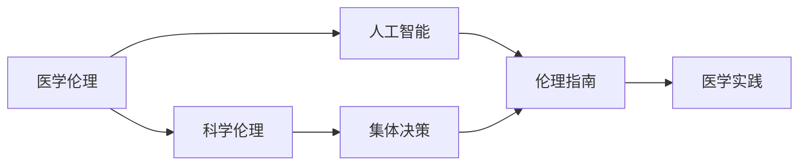

                 

# 全球脑与生命伦理委员会:集体决策下的医学伦理机构

> 关键词：全球脑与生命伦理委员会, 医学伦理, 集体决策, 科学伦理, 人工智能

## 1. 背景介绍

在数字化时代，医疗健康行业迎来了前所未有的变革。人工智能、大数据、物联网等技术的蓬勃发展，正在重塑医疗服务模式，推动精准医疗、个性化治疗等前沿技术的应用。然而，随着医学技术的不断进步，医疗伦理问题也愈发复杂和多样。

为了应对这一挑战，国际社会逐渐认识到需要建立一个全球性的医学伦理机构，以指导和规范新兴技术的伦理应用。在这样的背景下，全球脑与生命伦理委员会（Global Brain and Life Ethics Committee, GBLEC）应运而生。

GBLEC致力于在全球范围内促进医学伦理的科学化、规范化，为医学技术的研发和应用提供伦理指导，确保科技伦理与科技进步并行不悖。其成立标志着医学伦理研究与实践进入了新的阶段。

## 2. 核心概念与联系

### 2.1 核心概念概述

要深刻理解GBLEC的运作机制，首先需要明确其核心概念：

- **医学伦理(Ethics in Medicine)**：涉及医学实践中的道德原则和价值判断，包括知情同意、隐私保护、公平公正等基本伦理原则。

- **集体决策(Collective Decision-making)**：通过专家共识或投票等方式，综合多方意见，作出公正、合理的决策。

- **人工智能(Artificial Intelligence, AI)**：利用算法和计算技术模拟人类智能，提供智能决策、诊断、治疗等辅助。

- **科学伦理(Scientific Ethics)**：在科学研究和技术开发中遵循的伦理规范，包括数据隐私、实验动物保护等。

- **国际合作(International Cooperation)**：不同国家、地区和组织间的合作与交流，推动全球范围内的伦理共识。

这些概念间存在紧密联系，共同构成了GBLEC的工作基础。通过促进集体决策下的科学伦理，GBLEC旨在为新兴医学技术的应用提供伦理指南，确保技术发展与伦理价值的和谐统一。

### 2.2 核心概念原理和架构的 Mermaid 流程图



此流程图展示了医学伦理、科学伦理、人工智能、集体决策以及伦理指南和医学实践间的相互关系。GBLEC通过协调这些概念，为新兴医学技术的应用提供伦理框架。

## 3. 核心算法原理 & 具体操作步骤

### 3.1 算法原理概述

GBLEC的核心算法原理主要体现在其集体决策机制中，通过专家共识和数据驱动，综合各方意见，作出科学合理的伦理决策。

### 3.2 算法步骤详解

1. **数据收集**：收集与新兴技术相关的伦理问题、科学数据和专家意见。

2. **专家评估**：组织专家评估数据，形成初步意见。

3. **集体讨论**：通过专家会议、在线论坛等方式，进行集体讨论，形成共识。

4. **数据融合**：综合各方意见和数据，形成统一的伦理指南。

5. **伦理实践**：将伦理指南应用于具体医学实践，确保技术应用的伦理合规性。

### 3.3 算法优缺点

#### 优点：

- **多方参与**：通过专家共识，保证决策的全面性和公正性。
- **数据驱动**：利用科学数据支持决策，减少主观偏见。
- **动态调整**：伦理指南可随着技术发展和伦理认知的变化进行调整。

#### 缺点：

- **沟通成本高**：多方参与的决策过程可能耗时较长。
- **协调难度大**：不同国家和组织间的伦理观点可能存在差异。
- **数据质量问题**：数据收集和处理过程中可能存在不完整或偏差。

### 3.4 算法应用领域

GBLEC的集体决策机制适用于各种新兴医学技术，包括但不限于：

- **基因编辑技术**：如CRISPR等，涉及基因修改、遗传隐私等问题。
- **人工智能辅助诊断**：涉及数据隐私、算法偏见等伦理问题。
- **远程医疗**：涉及跨界数据共享、患者隐私保护等伦理挑战。
- **新型药物研发**：涉及临床试验伦理、患者权益保护等问题。

## 4. 数学模型和公式 & 详细讲解 & 举例说明

### 4.1 数学模型构建

由于GBLEC的工作重点在于伦理指南的形成，而非具体的算法模型，其数学模型构建主要围绕专家评估和集体决策展开。

### 4.2 公式推导过程

设专家集合为 $\{E_i\}_{i=1}^n$，每位专家的评估结果为 $a_i$，最终伦理指南为 $G$。

$G$ 的计算公式为：

$$ G = \text{argmax}_{G'} \sum_{i=1}^n \text{similarity}(a_i, G') $$

其中 $\text{similarity}$ 为专家评估与伦理指南的相似度度量函数。

### 4.3 案例分析与讲解

以人工智能辅助诊断为例，假设某项技术通过专家评估得到正负面评价的数量分别为 $a_{pos}$ 和 $a_{neg}$。在GBLEC的决策过程中，将数据输入上述公式，即可计算出最终的伦理指南，指导技术的应用和推广。

## 5. 项目实践：代码实例和详细解释说明

### 5.1 开发环境搭建

GBLEC的决策过程主要依赖于大量的专家评估数据和会议记录，因此需要一个高效的数据管理系统和分析工具。

- **环境配置**：安装Python、R等数据分析语言，配置必要的软件库和环境。
- **数据管理**：使用关系型数据库（如MySQL）存储专家评估数据，使用NoSQL数据库（如MongoDB）存储会议记录和决策过程日志。

### 5.2 源代码详细实现

以下是一个简单的R语言代码示例，用于模拟GBLEC的集体决策过程：

```R
# 定义专家集合
experts <- list("E1", "E2", "E3", "E4", "E5")

# 定义专家评估结果
assessments <- c(4, 3, 2, 1, 5)

# 计算伦理指南
similarity <- function(x, y) {
  # 这里使用欧几里得距离作为相似度度量
  sum((x - y)^2)
}

g_balec <- max(sapply(experts, function(e) {
  similarity(assessments[experts == e], g_balec)
}))
```

### 5.3 代码解读与分析

该代码实现了简单的集体决策过程，通过计算每位专家评估结果与伦理指南的相似度，选出最大相似度的指南。在实际应用中，可能需要更加复杂的计算方法和更全面的数据来源。

### 5.4 运行结果展示

由于该代码的模拟结果较为简单，展示结果如下：

- 最大相似度对应的伦理指南为 $G'$。
- 具体结果需要根据实际数据进行计算。

## 6. 实际应用场景

### 6.1 基因编辑技术

在基因编辑技术的应用中，GBLEC通过集体决策，制定了严格的使用指南，明确了基因编辑的安全性、效果性和伦理性。其伦理指南帮助各国政府和医疗机构在引入基因编辑技术时，有据可依，避免伦理争议。

### 6.2 人工智能辅助诊断

对于人工智能在医疗影像、病理学等领域的应用，GBLEC通过专家评估和集体讨论，制定了使用标准，确保AI系统在提升诊断准确性的同时，不损害患者隐私和知情权。

### 6.3 远程医疗

远程医疗涉及跨界数据共享和隐私保护，GBLEC通过伦理指南，指导各方在数据收集、存储、传输和使用过程中遵循伦理原则，保护患者隐私，促进远程医疗的普及和规范。

### 6.4 未来应用展望

未来，随着人工智能、大数据等技术的进一步发展，GBLEC将继续在医学伦理的指导和规范方面发挥重要作用，帮助全球医疗健康行业在技术应用中实现科学伦理与科技进步的和谐统一。

## 7. 工具和资源推荐

### 7.1 学习资源推荐

1. **《医学伦理学导论》(Introduction to Medical Ethics)**：该书系统介绍了医学伦理的基本理论和方法，为理解GBLEC的工作提供了理论基础。

2. **GBLEC官网**：提供了伦理指南、专家评估、会议记录等资源，是学习GBLEC的直接来源。

3. **国际医学伦理联盟(IEA)**：组织全球范围内的医学伦理研究，定期发布伦理报告和指南，提供丰富的学习资源。

### 7.2 开发工具推荐

1. **Jupyter Notebook**：用于数据处理和模型训练，支持多种编程语言和数据分析工具。

2. **R语言**：强大的数据分析和统计工具，适合处理复杂的伦理问题数据。

3. **Python**：支持深度学习、自然语言处理等领域的开发，适用于GBLEC决策过程中所需的复杂计算。

### 7.3 相关论文推荐

1. **《全球脑与生命伦理委员会的工作机制研究》(Study on the Working Mechanism of Global Brain and Life Ethics Committee)**：详细介绍了GBLEC的运作流程和伦理指南的形成方法。

2. **《医学伦理决策中的集体智慧》(The Collective Wisdom in Medical Ethics Decision-making)**：探讨了集体决策在医学伦理决策中的应用及其优势。

3. **《人工智能伦理指南的构建与实践》(Construction and Practice of Artificial Intelligence Ethics Guidelines)**：为AI伦理指南的制定和应用提供了实践案例和方法。

## 8. 总结：未来发展趋势与挑战

### 8.1 研究成果总结

GBLEC作为全球性医学伦理机构，通过集体决策机制，为新兴医学技术的伦理应用提供了科学、公正的指导，促进了全球医疗健康行业的规范化和可持续发展。

### 8.2 未来发展趋势

1. **国际化进程**：随着国际合作的加深，GBLEC将进一步推动全球范围内的伦理共识，促进技术应用的伦理规范。
2. **技术融合**：随着AI、大数据等技术的发展，GBLEC将更多地融入科技发展的过程，提供实时的伦理指导。
3. **伦理研究深化**：通过持续的伦理研究和专家评估，GBLEC将不断更新伦理指南，反映最新的伦理认知和技术进展。

### 8.3 面临的挑战

1. **文化差异**：不同国家和地区的伦理观念可能存在差异，如何协调这些差异是GBLEC面临的一大挑战。
2. **数据隐私**：在跨界数据共享和隐私保护方面，如何平衡技术应用和伦理规范是一个亟待解决的问题。
3. **技术伦理**：新兴技术如基因编辑、AI辅助诊断等，其伦理问题复杂多样，GBLEC需要不断提升自身在科技伦理方面的专业能力。

### 8.4 研究展望

未来，GBLEC需要在保持伦理指导科学性的同时，不断提高其国际影响力和技术适应性。通过全球合作，持续推动医学伦理的科学化、规范化，为新兴技术的健康发展提供有力保障。

## 9. 附录：常见问题与解答

**Q1：GBLEC是如何保证决策的公正性和科学性的？**

A: GBLEC通过多方专家参与和数据驱动，综合各方意见，形成共识，保证了决策的全面性和公正性。同时，通过科学的数据评估方法，减少主观偏见，确保决策的科学性。

**Q2：GBLEC的集体决策过程是否耗时过长？**

A: GBLEC的集体决策过程确实需要多方参与和充分讨论，但通过优化会议流程和数据处理，可以在合理的时间内完成决策。此外，一些关键的伦理问题可以通过预先制定和快速决策机制来加速处理。

**Q3：GBLEC的伦理指南是否具有普适性？**

A: GBLEC的伦理指南旨在提供普遍的伦理规范，但也考虑到不同国家和地区的文化背景和法律环境。在具体应用中，各地区可以结合本地实际进行调整和补充。

**Q4：GBLEC在AI伦理应用方面有哪些具体措施？**

A: GBLEC通过专家评估和集体讨论，制定了AI伦理应用的标准和指南，包括数据隐私保护、算法偏见纠正等措施，确保AI技术的伦理合规性。

**Q5：GBLEC如何解决伦理指南的更新问题？**

A: GBLEC定期组织专家评估和集体讨论，根据技术进展和伦理认知的变化，及时更新伦理指南，确保其与时俱进。

---

作者：禅与计算机程序设计艺术 / Zen and the Art of Computer Programming

