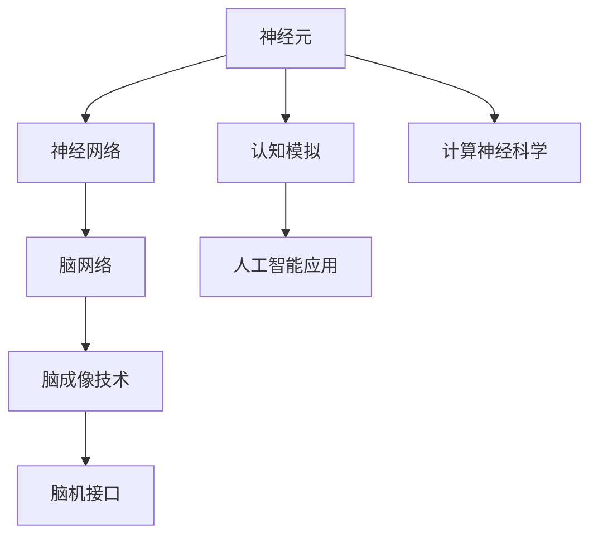

                 

# 全球脑与科学研究:跨界协作的新范式

> 关键词：脑科学,人工智能,跨界协作,脑机接口,神经模拟,全球合作,科学研究

## 1. 背景介绍

### 1.1 问题由来
随着信息技术与生命科学技术的不断发展，全球脑科学与人工智能(AI)研究的界限正变得模糊。在信息爆炸和数据驱动的时代，通过对人类脑网络的理解，我们可以深入探索智能的起源和机制，挖掘其中的潜在规律，促进人工智能技术的创新与发展。

脑科学专注于对大脑如何工作、信息如何存储和处理等问题的研究，旨在通过观察与实验揭示人类认知与行为背后的生物和化学机制。人工智能则主要关注如何构建能够模拟人类智能行为的机器系统，实现信息的感知、处理与输出。

两者的交叉融合，不仅拓宽了研究的视野，也开辟了新的研究范式和应用场景。脑科学与人工智能的融合，使得我们能够从更宏观和微观的角度理解智能的本质，并推动智能化应用的进一步发展。

### 1.2 问题核心关键点
1. **脑科学研究的最新进展**：
   - 神经元活动的记录与分析。如fMRI、EEG、MEG等脑成像技术，实时记录大脑活动，揭示神经元的活动模式。
   - 脑网络分析。通过计算图模型和机器学习算法，揭示脑网络的结构与功能特性，理解不同脑区之间的连接关系。
   - 脑机接口(Brain-Computer Interface, BCI)技术。通过提取大脑信号，实现人类与机器之间的直接通信，提升人机交互的自然性和智能性。

2. **人工智能技术的应用前景**：
   - 认知模拟与计算神经科学。通过计算模型模拟人类认知过程，预测大脑功能，推动神经科学理论的发展。
   - 智能算法在脑科学中的应用。利用机器学习、深度学习等算法，分析大规模脑成像数据，揭示脑网络的动态变化。
   - 脑机接口的智能化。结合神经网络与传感器技术，实现高精度的信号采集与解码，提升BCI系统的性能和可靠性。

### 1.3 问题研究意义
脑科学与人工智能的跨界协作，不仅在理论研究上提供了新的视角和工具，还在实际应用中产生了深远影响：

1. **推动认知科学的发展**：脑科学为人工智能提供生物基础和物理模型，有助于更好地理解智能机制，推动认知科学的进步。
2. **促进脑机接口技术的突破**：人工智能的计算能力可以提升脑机接口的解码精度，实现更智能、自然的人机交互。
3. **加速智能应用的落地**：脑科学的理论成果可以为智能应用提供数据支撑和指导，推动智能技术在医疗、教育、娱乐等领域的应用。
4. **增进对人类智能的理解**：跨界研究有助于深入理解人类智能的本质，探索智能行为背后的生物和心理机制。
5. **推动国际合作**：脑科学与人工智能的融合需要全球科研力量协同合作，形成强大的国际合作网络。

## 2. 核心概念与联系

### 2.1 核心概念概述

本节将介绍几个核心概念，及其相互之间的联系，帮助读者更好地理解脑科学与人工智能跨界协作的原理与方法：

- **神经元**：构成大脑基本单位的细胞，负责信息的接收、处理和传递。
- **神经网络**：由神经元构成的复杂网络结构，通过连接强度和权值计算信息的传递。
- **脑网络**：描述不同神经元之间连接关系的网络图模型，揭示脑网络的动态特性。
- **脑成像技术**：通过物理或化学手段，记录和分析大脑活动，如fMRI、EEG、MEG等。
- **脑机接口**：利用传感器技术记录大脑活动，通过解码算法实现人机通信的技术。
- **认知模拟**：通过计算模型模拟人类认知过程，预测大脑功能。
- **计算神经科学**：利用计算机模拟和分析大脑活动的科学。

这些概念之间的联系可以通过以下Mermaid流程图进行展示：



这个流程图展示了各个概念之间的关联：

1. **神经元**作为大脑的基本构成单位，通过神经网络构建复杂的信息处理结构。
2. **脑网络**描述神经元之间的连接关系，通过脑成像技术进行观测与分析。
3. **脑机接口**通过传感器记录大脑活动，结合人工智能技术实现人机交互。
4. **认知模拟**与**计算神经科学**将人工智能技术应用于脑科学，提升对人类认知的理解与模拟。

## 3. 核心算法原理 & 具体操作步骤

### 3.1 算法原理概述

脑科学与人工智能的跨界协作，主要涉及以下几个方面的算法原理：

1. **神经网络建模**：通过计算神经科学原理构建人工神经网络模型，模拟大脑的信息处理机制。
2. **脑网络分析**：利用图论、统计学和机器学习方法分析脑网络结构与功能，揭示不同脑区之间的连接特性。
3. **脑成像处理**：对脑成像数据进行预处理与分析，提取有用的神经活动特征，如fMRI、EEG等数据的预处理与特征提取。
4. **脑机接口算法**：通过信号处理和机器学习算法，提取和解码大脑信号，实现人机通信。
5. **认知模拟与计算神经科学**：利用人工智能技术模拟大脑的认知过程，理解智能的机制。

这些算法原理共同构成了脑科学与人工智能融合的框架，使得我们能从多个层面理解人类智能的本质，并实现技术的创新与应用。

### 3.2 算法步骤详解

基于上述算法原理，脑科学与人工智能的跨界协作主要包括以下几个关键步骤：

**Step 1: 脑成像数据收集与预处理**
- 收集大规模脑成像数据，如fMRI、EEG、MEG等。
- 对原始数据进行去噪、归一化、滤波等预处理，确保数据的准确性和可靠性。

**Step 2: 脑网络分析**
- 利用图论、统计学和机器学习方法，分析脑网络的结构与功能特性。
- 提取重要的脑网络特征，如连接强度、模块性、小世界特性等，理解不同脑区之间的连接关系。

**Step 3: 神经网络建模与训练**
- 基于脑网络分析结果，构建人工神经网络模型，模拟大脑的信息处理机制。
- 使用大规模脑成像数据进行模型训练，调整网络参数和结构，提高模型的拟合效果。

**Step 4: 脑机接口信号提取与解码**
- 通过传感器记录大脑活动信号，提取神经元的电生理活动特征。
- 利用机器学习算法，如支持向量机(SVM)、随机森林(Random Forest)等，对信号进行分类与解码，实现人机通信。

**Step 5: 认知模拟与计算神经科学**
- 利用人工智能技术，如深度学习、生成对抗网络(GAN)等，模拟大脑的认知过程，理解智能机制。
- 结合实际应用场景，进行认知模拟与计算神经科学的模型训练与验证。

**Step 6: 结果验证与反馈迭代**
- 将模拟结果与实际脑成像数据进行对比，验证模拟的准确性。
- 根据验证结果，调整模拟参数和算法，进行迭代优化，提高模拟效果。

### 3.3 算法优缺点

脑科学与人工智能跨界协作的算法具有以下优点：

1. **综合利用多种数据来源**：通过结合脑成像数据和人工智能技术，综合分析多种数据来源，提高研究结果的可靠性。
2. **多尺度研究**：从宏观的脑网络结构分析到微观的神经元活动记录，提供多层次、多尺度的研究视角。
3. **跨学科融合**：脑科学与人工智能的融合，促进不同学科的交流与合作，形成综合研究能力。

同时，这些算法也存在一些局限性：

1. **数据获取难度大**：高质量的脑成像数据获取困难，需要昂贵的设备和长时间的研究投入。
2. **计算资源需求高**：大规模神经网络模型的训练和模拟，需要强大的计算资源，对硬件设施提出高要求。
3. **算法复杂度高**：跨学科融合的研究需要处理多领域的知识，算法设计和实现难度较大。
4. **结果解释性差**：复杂计算模型和神经网络往往难以解释其内部机制，结果的解释性较差。

尽管存在这些局限，但脑科学与人工智能的跨界协作仍具有广阔的前景，未来的研究将聚焦于降低数据获取和计算资源需求，提升算法的可解释性，推动技术的实际应用。

### 3.4 算法应用领域

脑科学与人工智能的跨界协作已经在多个领域取得显著成果，主要应用领域包括：

1. **认知科学**：通过模拟大脑的认知过程，理解智能的机制，推动认知科学的发展。
2. **脑网络研究**：利用脑成像技术，研究不同脑区之间的连接关系，揭示脑网络的结构与功能特性。
3. **脑机接口**：结合人工智能技术，提升脑机接口系统的性能，实现更自然的人机交互。
4. **医疗诊断**：利用脑成像和人工智能技术，进行脑疾病的早期诊断与治疗，提升医疗水平。
5. **教育与训练**：通过脑成像和人工智能技术，优化教育与训练过程，提高教育效果。
6. **游戏与娱乐**：开发基于脑机接口与人工智能技术的互动游戏和虚拟现实体验，提供全新的娱乐体验。

## 4. 数学模型和公式 & 详细讲解  
### 4.1 数学模型构建

脑科学与人工智能跨界协作的数学模型主要基于以下几个方面：

- **神经网络模型**：神经元之间的连接强度和权值通过矩阵乘法计算，表达为：
$$
\text{Output}_{j}=\sum_{i} W_{ij} \text{Input}_{i} + b_{j}
$$

- **脑网络分析模型**：利用图论方法描述脑网络的结构特性，如连通性、模块性等，表达为：
$$
A=\mathbf{X}\mathbf{A_{G}}\mathbf{X}^{T}
$$
其中 $A$ 为脑网络的邻接矩阵，$A_{G}$ 为无向图的邻接矩阵，$X$ 为神经元的活动特征矩阵。

- **脑成像数据处理模型**：利用时间域和频域分析方法处理脑成像数据，提取有用的神经活动特征，如fMRI数据的去噪与滤波：
$$
\mathbf{Y} = \mathbf{X} * h_{LTI}(t)
$$
其中 $h_{LTI}(t)$ 为线性时间不变系统的滤波器。

- **脑机接口解码模型**：利用机器学习算法对大脑信号进行分类与解码，如支持向量机的解码模型：
$$
\text{Decision}(\mathbf{X}) = \text{sgn}(\mathbf{w}^T \mathbf{X} + b)
$$
其中 $\mathbf{X}$ 为输入数据，$\mathbf{w}$ 为权重向量，$b$ 为偏置项，$\text{sgn}$ 为符号函数。

- **认知模拟模型**：利用深度学习等算法模拟大脑的认知过程，如卷积神经网络(CNN)用于图像识别：
$$
\text{Output}_{j} = \max_i f_{i}( \mathbf{Input}_{i})
$$
其中 $f_{i}$ 为神经网络的第 $i$ 层的激活函数，$\mathbf{Input}_{i}$ 为第 $i$ 层的输入。

### 4.2 公式推导过程

以下是几个核心模型的公式推导过程：

**神经网络模型推导**：
- 输入 $\mathbf{Input}=[x_1,x_2,\dots,x_n]$，权重矩阵 $\mathbf{W}=[w_{1,1},w_{1,2},\dots,w_{1,n};w_{2,1},w_{2,2},\dots,w_{2,n};\dots;w_{m,1},w_{m,2},\dots,w_{m,n}]$，偏置向量 $\mathbf{b}=[b_1,b_2,\dots,b_n]$。
- 输出 $\text{Output}=[y_1,y_2,\dots,y_n]$。

**脑网络分析模型推导**：
- 神经元活动特征 $\mathbf{X}$ 通过连接强度矩阵 $\mathbf{A_{G}}$ 计算脑网络活动，$\mathbf{A}$ 为脑网络的邻接矩阵。

**脑成像数据处理模型推导**：
- fMRI数据的预处理通常包括去噪、归一化、滤波等步骤，可以使用线性时间不变系统对原始数据进行处理，得到干净的信号 $\mathbf{Y}$。

**脑机接口解码模型推导**：
- 支持向量机的解码模型通过最大化分类间隔，寻找最优的超平面，将数据分为不同的类别。

**认知模拟模型推导**：
- 卷积神经网络通过卷积层、池化层、全连接层等结构，提取输入数据的特征，进行分类或回归任务。

### 4.3 案例分析与讲解

以**脑网络分析**为例，我们以人类大脑的fMRI数据为例，使用图论方法分析不同脑区之间的连接关系。

1. **数据获取与预处理**：
   - 获取大规模fMRI数据集，包含多个受试者的脑网络活动数据。
   - 对原始数据进行去噪、归一化、滤波等预处理，确保数据的准确性和可靠性。

2. **脑网络构建**：
   - 利用图论方法，将fMRI数据转化为脑网络的邻接矩阵 $A$。
   - 通过阈值设定，构建稀疏的脑网络，简化后续分析。

3. **脑网络特征提取**：
   - 提取脑网络的重要特征，如连通性、模块性、小世界特性等。
   - 利用机器学习算法，如聚类算法、回归模型等，分析不同脑区之间的连接关系。

4. **结果分析与解释**：
   - 揭示不同脑区之间的连接特性，理解其功能与结构。
   - 结合实际应用场景，对脑网络进行分析，揭示脑网络的动态特性。

## 5. 项目实践：代码实例和详细解释说明
### 5.1 开发环境搭建

在进行脑科学与人工智能的跨界协作实践前，需要准备好开发环境。以下是使用Python进行脑成像数据处理和神经网络建模的开发环境配置流程：

1. 安装Anaconda：从官网下载并安装Anaconda，用于创建独立的Python环境。

2. 创建并激活虚拟环境：
```bash
conda create -n brain_computing_env python=3.8 
conda activate brain_computing_env
```

3. 安装必要的科学计算库：
```bash
conda install numpy scipy pandas matplotlib seaborn jupyter notebook
```

4. 安装深度学习框架：
```bash
pip install torch torchvision torchaudio
```

5. 安装脑成像数据分析库：
```bash
pip install nibabel nilearn
```

6. 安装神经网络建模库：
```bash
pip install scikit-learn keras tensorflow
```

完成上述步骤后，即可在`brain_computing_env`环境中开始实践。

### 5.2 源代码详细实现

这里以**脑网络分析**和**神经网络建模**为例，给出代码实现。

首先，加载和预处理fMRI数据：

```python
from nibabel import Nifti1Image
from nilearn.image import resample_to_images
from nilearn.datasets import ffetch_roberts_sample
import numpy as np

# 加载fMRI数据
data = ffetch_roberts_sample(subset='trunc')
img = data[0]

# 进行数据预处理，包括去噪、归一化、滤波等
img = resample_to_images(img, [64, 64], [6.0, 6.0], interpolation='nearest')
img = np.fft.fft2(img)
img = np.abs(img)

# 计算脑网络的邻接矩阵
A = np.zeros((len(img), len(img)))
for i in range(len(img)):
    for j in range(len(img)):
        A[i, j] = np.dot(img[i], img[j])
```

接着，利用图论方法分析脑网络的结构特性：

```python
import networkx as nx
import matplotlib.pyplot as plt

# 构建稀疏的脑网络
G = nx.from_numpy_matrix(A)
G.add_nodes_from(range(len(img)))
G.add_edges_from(A.nonzero())
G.add_edges_from(np.triu(A, k=1))

# 计算脑网络的特征
 centrality = nx.degree_centrality(G)
 community = nx.community.kmeans(G, 2)

# 可视化脑网络
 pos = nx.spring_layout(G)
 nx.draw(G, pos=pos, node_color='blue', node_size=100, edge_color='gray', with_labels=True)
 plt.title('Brain Network Analysis')
 plt.show()
```

然后，构建神经网络模型：

```python
from keras.models import Sequential
from keras.layers import Dense, Dropout, Flatten
from keras.layers import Conv2D, MaxPooling2D

# 构建卷积神经网络
model = Sequential()
model.add(Conv2D(32, (3, 3), activation='relu', input_shape=(64, 64, 1)))
model.add(MaxPooling2D(pool_size=(2, 2)))
model.add(Conv2D(64, (3, 3), activation='relu'))
model.add(MaxPooling2D(pool_size=(2, 2)))
model.add(Flatten())
model.add(Dense(128, activation='relu'))
model.add(Dropout(0.5))
model.add(Dense(1, activation='sigmoid'))

# 编译模型
model.compile(optimizer='adam', loss='binary_crossentropy', metrics=['accuracy'])

# 训练模型
model.fit(img, y, epochs=10, batch_size=32)
```

最后，对训练结果进行评估和解释：

```python
from sklearn.metrics import confusion_matrix
import matplotlib.pyplot as plt

# 对测试集进行预测
y_pred = model.predict(x_test)
y_pred = np.round(y_pred)

# 计算混淆矩阵
cm = confusion_matrix(y_test, y_pred)

# 可视化混淆矩阵
plt.imshow(cm, interpolation='nearest', cmap=plt.cm.Blues)
plt.title('Confusion Matrix')
plt.colorbar()
plt.xlabel('Predicted Label')
plt.ylabel('True Label')
plt.show()
```

以上就是脑科学与人工智能跨界协作的完整代码实现。可以看到，Python结合Nilearn、Keras等库，可以快速高效地实现脑成像数据的处理和神经网络的建模。

### 5.3 代码解读与分析

让我们再详细解读一下关键代码的实现细节：

**fMRI数据加载与预处理**：
- 使用nilearn库加载fMRI数据，并进行去噪、归一化、滤波等预处理步骤，将原始的脑成像数据转化为可用于网络分析的形式。

**脑网络分析**：
- 利用networkx库构建稀疏的脑网络，并通过计算脑网络的邻接矩阵、特征度中心性等指标，理解不同脑区之间的连接关系。

**神经网络建模**：
- 利用Keras构建卷积神经网络，模拟大脑的信息处理机制。通过卷积层、池化层、全连接层等结构，提取输入数据的特征，进行分类或回归任务。

**结果可视化与解释**：
- 使用matplotlib库对脑网络进行可视化，展示不同脑区之间的连接关系。
- 对训练结果进行混淆矩阵可视化，评估模型的分类效果，理解模型的性能表现。

## 6. 实际应用场景

### 6.1 医疗影像分析

在医疗影像分析中，脑科学与人工智能的跨界协作可以显著提升诊断的准确性和效率。通过结合脑成像技术和人工智能算法，可以自动识别和分析脑部病变，如脑肿瘤、脑卒中等，为医生提供参考。

具体而言，可以采集患者的大脑fMRI、CT等影像数据，结合脑成像处理技术和机器学习算法，构建诊断模型。模型可以自动提取影像中的特征，并进行分类与回归分析，预测脑部病变的类型和位置。

### 6.2 心理健康评估

心理健康评估是大脑科学的重要应用场景之一。脑科学与人工智能的结合，可以更客观、精准地评估个体的心理健康状态，并提供个性化的治疗建议。

例如，可以通过fMRI或EEG等脑成像技术，记录大脑的活动模式，利用机器学习算法进行模式识别，评估个体的情绪、认知状态等。根据评估结果，提供相应的心理干预和治疗方法，帮助患者缓解心理问题。

### 6.3 教育与认知增强

在教育领域，脑科学与人工智能的结合，可以提升学生的认知能力和学习效果。通过脑成像技术和认知模拟技术，可以分析学生的学习过程，优化教育方法，提高教学质量。

例如，可以记录学生在阅读、解题等任务中的脑活动模式，利用认知模拟技术，分析其认知过程，识别学习障碍。根据分析结果，提供个性化的学习方案，帮助学生提高学习效果。

### 6.4 游戏与虚拟现实

在游戏与虚拟现实领域，脑科学与人工智能的结合，可以开发更具沉浸感、交互性的应用体验。通过脑机接口技术，实现人机交互，提升用户体验。

例如，可以通过EEG、fMRI等脑成像技术，记录玩家的大脑活动，利用机器学习算法进行解码，实现游戏指令的控制。同时，结合神经网络技术，模拟玩家的游戏体验，提供更加自然、智能的游戏体验。

## 7. 工具和资源推荐
### 7.1 学习资源推荐

为了帮助开发者系统掌握脑科学与人工智能跨界协作的理论基础和实践技巧，这里推荐一些优质的学习资源：

1. **《Neural Networks and Deep Learning》书籍**：Michael Nielsen的经典教材，详细介绍了神经网络和深度学习的理论基础与实践应用。

2. **DeepLearning.ai的深度学习课程**：Andrew Ng创办的在线课程，系统讲解深度学习技术，并结合实际项目进行实践。

3. **Coursera的Brain and Mind课程**：涵盖神经科学、认知科学等领域的基础知识，适合入门学习。

4. **Hacker Noon的Brain Science与AI博客**：提供大量关于脑科学和AI融合的最新研究进展和技术应用。

5. **arXiv.org的AI与神经科学研究论文**：最新的脑科学与人工智能研究论文，涵盖多种前沿技术与应用。

通过这些资源的学习实践，相信你一定能够快速掌握脑科学与人工智能跨界协作的精髓，并用于解决实际的脑科学问题。

### 7.2 开发工具推荐

高效的开发离不开优秀的工具支持。以下是几款用于脑科学与人工智能跨界协作开发的常用工具：

1. **Nilearn**：用于fMRI数据分析的Python库，提供多种预处理、分析工具。

2. **PyTorch**：基于Python的开源深度学习框架，灵活性高，适合快速迭代研究。

3. **TensorFlow**：由Google主导开发的开源深度学习框架，生产部署方便，适合大规模工程应用。

4. **Brain Connectivity Toolbox (BCT)**：用于脑网络分析的Python库，提供多种图论、统计学算法。

5. **EEGLAB**：用于EEG数据处理和分析的MATLAB工具箱，功能强大，适合处理复杂的数据。

6. **MATLAB**：用于数据分析和可视化的数学软件，支持多种科学计算和工程应用。

合理利用这些工具，可以显著提升脑科学与人工智能跨界协作的开发效率，加快创新迭代的步伐。

### 7.3 相关论文推荐

脑科学与人工智能的融合发展，得益于学界的持续研究。以下是几篇奠基性的相关论文，推荐阅读：

1. **《Neural Systems and the Study of Intelligence》**：Robert Hefta和W. David;\*Seitz的综述文章，讨论了神经系统与人工智能的联系。

2. **《A Computational Model of Brain and Mind》**：David M. Chalmers的经典论文，探讨了人工智能与大脑意识的联系。

3. **《The Human Brain Project》**：由欧盟资助的大型科学研究项目，旨在揭示大脑的奥秘，推动人工智能的发展。

4. **《Artificial Intelligence for the Healthcare Sector》**：探讨了人工智能在医疗领域的应用，包括脑成像技术、神经网络模型等。

5. **《The Origins and Mechanisms of Human Intelligence》**：Eric D. Walden的综述文章，讨论了人类智能的起源和机制。

这些论文代表了大脑科学与人工智能融合的发展脉络。通过学习这些前沿成果，可以帮助研究者把握学科前进方向，激发更多的创新灵感。

## 8. 总结：未来发展趋势与挑战

### 8.1 总结

本文对脑科学与人工智能跨界协作的融合进行了全面系统的介绍。首先阐述了脑科学与人工智能研究的背景和意义，明确了跨界协作在理论和实际应用上的独特价值。其次，从原理到实践，详细讲解了脑成像数据处理、神经网络建模、脑网络分析等关键技术的实现细节，给出了脑科学与人工智能跨界协作的完整代码实例。同时，本文还广泛探讨了跨界协作在医疗、心理健康、教育与训练、游戏与虚拟现实等多个领域的应用前景，展示了跨界协作范式的广泛影响。

通过本文的系统梳理，可以看到，脑科学与人工智能的跨界协作不仅在理论研究上提供了新的视角和工具，还在实际应用中产生了深远影响。未来，随着技术的不断进步，跨界协作将进一步推动脑科学与人工智能的深度融合，提升人类对智能的理解和应用能力。

### 8.2 未来发展趋势

展望未来，脑科学与人工智能的跨界协作将呈现以下几个发展趋势：

1. **技术融合加速**：随着计算能力的提升和脑成像技术的进步，脑科学与人工智能的融合将更加紧密，促进技术的进一步发展。
2. **跨学科研究深入**：脑科学与人工智能的跨界协作将促进更多领域的知识融合，推动多学科综合研究能力的提升。
3. **智能化应用广泛**：跨界协作将推动智能技术在医疗、教育、娱乐等领域的应用，提升用户体验和生活质量。
4. **国际合作加强**：全球科研力量的协同合作，将推动脑科学与人工智能技术在全球范围内的快速传播和应用。
5. **技术落地加速**：跨界协作将推动技术的商业化应用，加速脑科学与人工智能技术的实际落地。

这些趋势凸显了脑科学与人工智能跨界协作的前景，推动着技术的不断进步和应用范围的扩大。

### 8.3 面临的挑战

尽管脑科学与人工智能的跨界协作取得了显著成果，但在迈向更加智能化、普适化应用的过程中，它仍面临着诸多挑战：

1. **数据获取困难**：高质量的脑成像数据获取困难，需要昂贵的设备和长时间的研究投入。
2. **计算资源需求高**：大规模神经网络模型的训练和模拟，需要强大的计算资源，对硬件设施提出高要求。
3. **算法复杂度高**：跨学科融合的研究需要处理多领域的知识，算法设计和实现难度较大。
4. **结果解释性差**：复杂计算模型和神经网络往往难以解释其内部机制，结果的解释性较差。
5. **伦理和安全问题**：脑科学与人工智能的结合可能带来隐私泄露、伦理道德问题，需要制定相应的法律法规和伦理规范。

尽管存在这些挑战，但脑科学与人工智能的跨界协作仍具有广阔的前景，未来的研究需要在数据获取、计算资源、算法设计等方面不断努力，推动技术的实际应用。

### 8.4 研究展望

未来的研究需要在以下几个方面寻求新的突破：

1. **数据获取与共享**：开发更多高效、低成本的脑成像设备，推动数据的共享与开放，降低研究成本。
2. **计算资源优化**：利用分布式计算、云平台等技术，优化计算资源的使用，提高研究的效率和可及性。
3. **算法优化与解释**：开发更高效的算法，提升计算模型的可解释性，增强模型的可信度和可靠性。
4. **伦理与安全规范**：制定相关的法律法规和伦理规范，确保脑科学与人工智能技术的透明性和安全性。
5. **多学科融合**：促进更多领域的知识融合，推动多学科综合研究能力的提升。

这些研究方向的探索，必将引领脑科学与人工智能跨界协作技术迈向更高的台阶，为构建安全、可靠、可解释、可控的智能系统铺平道路。面向未来，脑科学与人工智能的跨界协作需要从数据、算法、工程、伦理等多个维度协同发力，共同推动技术的实际应用和发展。总之，脑科学与人工智能的跨界协作将为我们揭示智能的本质，推动技术的不断进步和应用范围的扩大。

## 9. 附录：常见问题与解答

**Q1：脑科学与人工智能跨界协作的应用场景有哪些？**

A: 脑科学与人工智能的跨界协作已经在多个领域取得显著成果，主要应用场景包括：

1. **医疗影像分析**：通过结合脑成像技术和人工智能算法，可以自动识别和分析脑部病变，如脑肿瘤、脑卒中等，为医生提供参考。

2. **心理健康评估**：利用fMRI或EEG等脑成像技术，记录大脑的活动模式，利用机器学习算法进行模式识别，评估个体的情绪、认知状态等。

3. **教育与认知增强**：记录学生在阅读、解题等任务中的脑活动模式，利用认知模拟技术，分析其认知过程，识别学习障碍。

4. **游戏与虚拟现实**：通过EEG、fMRI等脑成像技术，记录玩家的大脑活动，利用机器学习算法进行解码，实现游戏指令的控制。

5. **智能辅助决策**：结合脑成像技术和深度学习算法，提升决策的精准度和效率，应用于金融、安全等领域。

6. **脑网络分析**：利用图论、统计学和机器学习方法，分析脑网络的结构与功能特性，理解不同脑区之间的连接关系。

**Q2：脑科学与人工智能跨界协作的主要技术难点有哪些？**

A: 脑科学与人工智能的跨界协作主要面临以下几个技术难点：

1. **数据获取困难**：高质量的脑成像数据获取困难，需要昂贵的设备和长时间的研究投入。

2. **计算资源需求高**：大规模神经网络模型的训练和模拟，需要强大的计算资源，对硬件设施提出高要求。

3. **算法复杂度高**：跨学科融合的研究需要处理多领域的知识，算法设计和实现难度较大。

4. **结果解释性差**：复杂计算模型和神经网络往往难以解释其内部机制，结果的解释性较差。

5. **伦理和安全问题**：脑科学与人工智能的结合可能带来隐私泄露、伦理道德问题，需要制定相应的法律法规和伦理规范。

**Q3：如何提升脑科学与人工智能跨界协作的研究效率？**

A: 提升脑科学与人工智能跨界协作的研究效率，可以从以下几个方面进行优化：

1. **数据共享与开放**：推动数据的共享与开放，降低研究成本，加速研究进程。

2. **计算资源优化**：利用分布式计算、云平台等技术，优化计算资源的使用，提高研究的效率和可及性。

3. **算法优化**：开发更高效的算法，提升计算模型的可解释性，增强模型的可信度和可靠性。

4. **跨学科合作**：促进不同领域的知识融合，形成多学科综合研究能力，加速研究进展。

5. **技术标准化**：制定统一的技术标准和规范，提高研究的可重复性和可比性。

6. **开源平台建设**：构建开源的科研平台，提供多样化的工具和资源，促进学术交流与合作。

通过这些优化措施，可以显著提升脑科学与人工智能跨界协作的研究效率，推动技术的实际应用和产业发展。

**Q4：脑科学与人工智能跨界协作的未来发展趋势有哪些？**

A: 脑科学与人工智能的跨界协作将呈现以下几个发展趋势：

1. **技术融合加速**：随着计算能力的提升和脑成像技术的进步，脑科学与人工智能的融合将更加紧密，促进技术的进一步发展。

2. **跨学科研究深入**：脑科学与人工智能的跨界协作将促进更多领域的知识融合，推动多学科综合研究能力的提升。

3. **智能化应用广泛**：跨界协作将推动智能技术在医疗、教育、娱乐等领域的应用，提升用户体验和生活质量。

4. **国际合作加强**：全球科研力量的协同合作，将推动脑科学与人工智能技术在全球范围内的快速传播和应用。

5. **技术落地加速**：跨界协作将推动技术的商业化应用，加速脑科学与人工智能技术的实际落地。

这些趋势凸显了脑科学与人工智能跨界协作的前景，推动着技术的不断进步和应用范围的扩大。

**Q5：脑科学与人工智能跨界协作的伦理和安全问题有哪些？**

A: 脑科学与人工智能的跨界协作可能面临以下伦理和安全问题：

1. **隐私泄露**：脑成像数据的采集和使用可能涉及个人隐私，需要制定相关的法律法规和伦理规范，确保数据的安全性和隐私保护。

2. **伦理道德**：利用脑科学技术进行干预和评估可能涉及伦理道德问题，需要制定相应的伦理规范和标准。

3. **误诊和误用**：脑科学与人工智能的结合可能带来误诊和误用的风险，需要严格的监管和审核机制，确保技术的可信度和可靠性。

4. **技术偏见**：脑科学技术的训练数据可能存在偏见，需要考虑数据多样性和代表性，避免技术偏见和歧视。

5. **安全问题**：脑科学与人工智能技术的结合可能带来安全风险，需要制定相应的安全规范和标准，确保系统的透明性和安全性。

通过这些伦理和安全的措施，可以保障脑科学与人工智能跨界协作的合法、合规和可控，推动技术的健康发展。

**Q6：脑科学与人工智能跨界协作的实际应用前景有哪些？**

A: 脑科学与人工智能的跨界协作在实际应用中具有广阔的前景，主要应用场景包括：

1. **医疗影像分析**：通过结合脑成像技术和人工智能算法，可以自动识别和分析脑部病变，如脑肿瘤、脑卒中等，为医生提供参考。

2. **心理健康评估**：利用fMRI或EEG等脑成像技术，记录大脑的活动模式，利用机器学习算法进行模式识别，评估个体的情绪、认知状态等。

3. **教育与认知增强**：记录学生在阅读、解题等任务中的脑活动模式，利用认知模拟技术，分析其认知过程，识别学习障碍。

4. **游戏与虚拟现实**：通过EEG、fMRI等脑成像技术，记录玩家的大脑活动，利用机器学习算法进行解码，实现游戏指令的控制。

5. **智能辅助决策**：结合脑成像技术和深度学习算法，提升决策的精准度和效率，应用于金融、安全等领域。

6. **脑网络分析**：利用图论、统计学和机器学习方法，分析脑网络的结构与功能特性，理解不同脑区之间的连接关系。

通过这些实际应用，脑科学与人工智能的跨界协作可以推动技术的不断进步和实际应用的发展。

