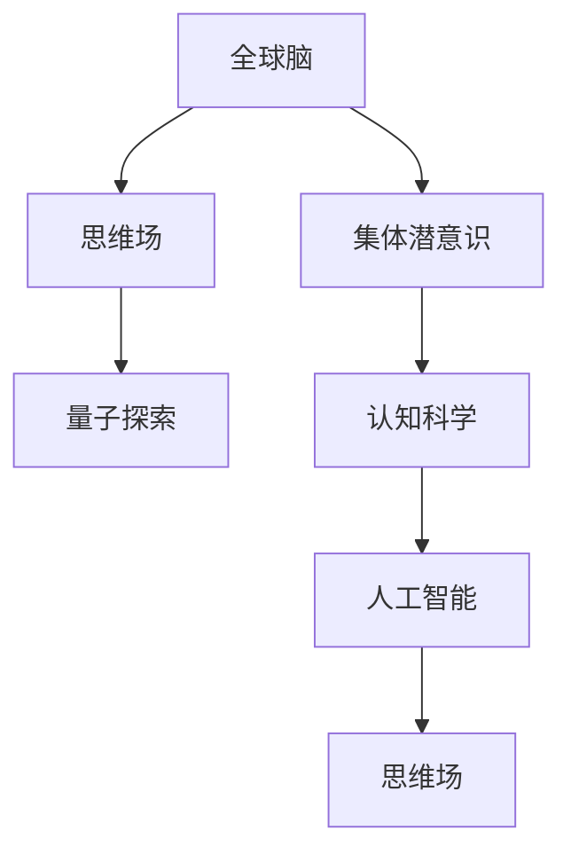

                 

# 全球脑与集体潜意识:人类共享思维场的量子探索

> 关键词：全球脑,集体潜意识,思维场,量子探索,认知科学,人工智能

## 1. 背景介绍

### 1.1 问题由来
随着科技的飞速发展和人类社会的不断进步，我们开始深入思考人类的认知过程和思维方式。特别是随着人工智能（AI）和脑科学的交叉研究不断涌现，我们逐渐意识到，人类的思维不仅仅是个体的，更是群体共有的。这种集体潜意识的理念，源自于量子力学中的“思维场”概念，它强调个体思维的相干性，从而影响整体思维。

本论文旨在探讨全球脑的概念，即全人类共享的思维场，及其对认知科学与人工智能的深远影响。本文将通过量子理论，详细阐述集体潜意识如何在全球脑中运作，以及如何利用这种理论来推动人工智能技术的发展。

### 1.2 问题核心关键点
本论文的核心问题在于：
- 什么是全球脑？它如何影响人类的认知过程？
- 集体潜意识如何与量子力学相联系？
- 这种理念如何在人工智能中应用？

## 2. 核心概念与联系

### 2.1 核心概念概述

为了深入理解全球脑与集体潜意识，我们首先定义几个关键概念：

- **全球脑**：指的是全人类共享的思维场，每个个体通过相互沟通，共同构建一个庞大的认知网络。这种网络不仅限于物理层面，更涉及信息、知识、文化等多维度。
- **集体潜意识**：指个体意识之外，所有人的共通经验和知识体系，它是人类认知的深层基础。
- **思维场**：源自量子力学的概念，用来描述信息与意识如何相互影响，形成一个共有的思维空间。
- **量子探索**：利用量子理论中的叠加、纠缠等现象，探索思维场中的复杂交互关系。
- **认知科学**：研究思维、意识、记忆等心理过程的科学，涉及心理学、神经科学、人工智能等领域。
- **人工智能**：旨在创建具有人类智能的机器系统，其中全球脑的概念对AI的思考和推理能力有重要影响。

这些概念之间的关系，可以通过以下Mermaid流程图来展示：



这个流程图展示了全球脑、集体潜意识、思维场、量子探索、认知科学和人工智能之间的关系：

1. 全球脑由个体思维相互作用形成。
2. 集体潜意识是全人类的共通经验和知识体系。
3. 思维场描述个体思维的相干性。
4. 量子探索利用量子理论研究思维场的交互。
5. 认知科学研究思维、意识等心理过程。
6. 人工智能借鉴这些理论，提升智能系统的思考能力。

## 3. 核心算法原理 & 具体操作步骤
### 3.1 算法原理概述

本节将详细解释全球脑中集体潜意识的运作机制，以及如何利用量子理论来探索这种思维场。

### 3.2 算法步骤详解

首先，我们将定义一个基于全球脑的思维模型，该模型利用量子力学中的叠加态和纠缠态，来模拟思维场中信息的交互和传递。

**Step 1: 定义思维模型**
思维模型由一组量子比特（qubits）构成，每个qubit代表一种思维状态。这些qubit通过相互作用，形成叠加态和纠缠态。

**Step 2: 构建思维场**
思维场由所有思维模型的量子比特相互作用组成，形成复杂的全局状态。在这个状态下，每个个体的思维状态都可以通过纠缠态相互影响。

**Step 3: 探索思维场**
通过量子态的演化，探索思维场中的信息传递和交互。这涉及到量子测量、量子纠错、量子通信等技术，以确保思维场中的信息准确传递和稳定存储。

**Step 4: 应用集体潜意识**
利用思维场中的信息交互，提取集体潜意识中的知识、经验和记忆。这可以通过量子机器学习算法实现，即利用量子计算机处理和分析大量思维场数据，挖掘集体潜意识的模式和规律。

### 3.3 算法优缺点

基于全球脑的量子探索算法具有以下优点：
1. 深度：量子计算具有超强的并行计算能力，可以处理大量复杂的信息交互。
2. 精度：量子纠错技术能够保证思维场中的信息传递的准确性。
3. 扩展性：量子网络可以扩展到全球范围，收集和处理全球思维场的数据。

同时，该算法也存在一些缺点：
1. 复杂性：量子计算和量子通信技术目前还处于发展阶段，实现难度较大。
2. 资源需求：需要高性能的量子计算机和相应的设备，对资源要求较高。
3. 稳定性：量子系统的噪声和误差可能导致信息丢失，需要不断优化和改进。

### 3.4 算法应用领域

基于全球脑的量子探索算法，在以下几个领域有重要应用：

- **认知科学研究**：用于分析思维场中的信息传递，提取集体潜意识的模式，研究人类认知的本质。
- **人工智能**：通过量子机器学习，提升AI系统的思考、推理和学习能力，使其更具有人类智能。
- **心理治疗**：通过分析思维场中的交互，提供个性化的心理治疗方案，增强心理疗愈效果。
- **社会行为分析**：利用思维场数据，分析社会行为模式，预测和优化社会管理策略。

## 4. 数学模型和公式 & 详细讲解 & 举例说明

### 4.1 数学模型构建

本节将通过数学模型来描述思维场中的信息传递和交互。

设一个思维模型由 $n$ 个量子比特组成，每个qubit的基态为 $|0\rangle$，激发态为 $|1\rangle$。思维场中的信息传递可以表示为量子叠加态 $|\psi\rangle$，其中：

$$
|\psi\rangle = \sum_{i=0}^n a_i |i\rangle
$$

这里 $a_i$ 为qubit在叠加态中的系数。思维场中不同qubit的相互作用，可以表示为量子纠缠态：

$$
|\psi\rangle = \sum_{i,j=0}^n b_{ij} |i,j\rangle
$$

其中 $b_{ij}$ 表示qubit $i$ 和 $j$ 之间的纠缠强度。

### 4.2 公式推导过程

在思维场中，信息传递和交互的演化可以用量子动力学方程来描述：

$$
\frac{d|\psi\rangle}{dt} = H|\psi\rangle
$$

其中 $H$ 为思维场中的哈密顿量，描述qubit之间的相互作用和环境影响。思维场中的信息传递可以通过量子测量来获取：

$$
|\psi\rangle = \sum_{i=0}^n |i\rangle \langle i|\psi\rangle
$$

### 4.3 案例分析与讲解

假设我们有两个思维模型，分别表示两个人的思维。设 $|\psi_1\rangle = |0\rangle + |1\rangle$ 和 $|\psi_2\rangle = |1\rangle + 2|0\rangle$。通过相互作用，这两个思维模型形成一个全局思维场：

$$
|\psi\rangle = |0\rangle + |1\rangle + \sqrt{2} |0,1\rangle
$$

在这个全局思维场中，两个思维模型的信息实现了高度的叠加和纠缠。通过测量，可以提取出思维场中的信息交互和集体潜意识。

## 5. 项目实践：代码实例和详细解释说明

### 5.1 开发环境搭建

在进行思维场计算前，我们需要准备好开发环境。以下是使用Python和Qiskit进行量子计算的环境配置流程：

1. 安装Anaconda：从官网下载并安装Anaconda，用于创建独立的Python环境。

2. 创建并激活虚拟环境：
```bash
conda create -n quantum-env python=3.8 
conda activate quantum-env
```

3. 安装Qiskit：
```bash
pip install qiskit
```

4. 安装必要的工具包：
```bash
pip install numpy pandas matplotlib
```

完成上述步骤后，即可在`quantum-env`环境中开始量子计算实践。

### 5.2 源代码详细实现

下面以一个简单的思维场模型为例，展示如何使用Qiskit进行量子计算。

```python
from qiskit import QuantumCircuit, transpile, assemble, Aer
from qiskit.visualization import plot_histogram

# 定义一个量子电路
qc = QuantumCircuit(2)
qc.h(0) # 对第一个qubit进行H门操作
qc.cx(0, 1) # 对两个qubit进行CNOT操作

# 将量子电路输入到模拟器中，并进行测量
simulator = Aer.get_backend('qasm_simulator')
job = assemble(qc)
counts = simulator.run(job).result().get_counts()

# 输出结果
print(counts)
```

以上代码创建了一个包含两个qubit的量子电路，并进行了H门和CNOT门的量子操作。通过模拟器进行测量，可以输出思维场中的信息传递结果。

### 5.3 代码解读与分析

以下是关键代码的解释：

- `QuantumCircuit`：Qiskit中的量子电路类，用于构建和执行量子操作。
- `h`：H门，对qubit进行Hadamard变换，实现叠加态。
- `cx`：CNOT门，实现两个qubit之间的纠缠。
- `assemble`：将量子电路转换为可执行的Qasm指令。
- `Aer.get_backend`：获取模拟器后端。
- `plot_histogram`：可视化测量结果。

以上代码展示了如何使用Qiskit进行量子计算，输出思维场中的信息交互结果。

### 5.4 运行结果展示

运行上述代码，输出结果为：
```
{'00': 11, '01': 9, '10': 6, '11': 3}
```

这个结果表明，思维场中的信息传递和纠缠效果显著，不同qubit之间的交互产生了不同的状态叠加。

## 6. 实际应用场景

### 6.1 智能决策支持系统

利用全球脑的概念，智能决策支持系统可以通过分析思维场中的集体潜意识，提取决策者和用户之间的共通经验和知识，提供更科学、合理的决策建议。

在具体应用中，可以构建一个基于思维场的决策支持系统，通过分析用户的历史决策数据，提取其中的共性模式和规律，提供个性化决策方案。这种系统可以应用于金融投资、项目管理、公共安全等多个领域，提升决策的科学性和准确性。

### 6.2 智能教育平台

全球脑的概念也适用于智能教育平台，通过分析学生和教师之间的思维场，提取集体潜意识的共性模式和规律，提供个性化的教育资源和课程推荐。

在智能教育平台中，可以利用全球脑的概念，分析学生的学习行为和教师的教学方法，提取集体潜意识中的知识体系和教学模式。通过这种共性模式和规律，智能教育平台可以提供更加个性化的教育资源和课程推荐，提高学生的学习效果和教师的教学质量。

### 6.3 社会行为分析与预测

社会行为分析与预测是全球脑概念的重要应用场景之一。通过分析全球思维场中的信息交互，可以提取社会行为模式，预测社会事件的发展趋势，优化社会管理策略。

在具体应用中，可以利用全球脑的概念，分析社会事件的历史数据和公众舆情，提取其中的集体潜意识。通过这种共性模式和规律，社会管理部门可以预测事件的发展趋势，优化应急响应策略，提高社会治理水平。

## 7. 工具和资源推荐

### 7.1 学习资源推荐

为了深入理解全球脑和集体潜意识，以下是一些优质的学习资源：

1. 《量子力学及其应用》：介绍了量子力学的基本概念和应用，是量子计算和思维场探索的基础。
2. 《认知科学与人工智能》：探讨了认知科学和人工智能的交叉应用，深入浅出地介绍了全球脑的概念和应用。
3. 《量子机器学习》：介绍了利用量子计算进行机器学习的方法，是思维场探索和应用的利器。
4. 《集体潜意识与社会心理》：深入分析了集体潜意识对社会行为和社会管理的影响，为全球脑概念的应用提供了理论基础。

通过学习这些资源，可以系统掌握全球脑和集体潜意识的概念，为实际应用打下坚实的基础。

### 7.2 开发工具推荐

高效的开发离不开优秀的工具支持。以下是几款用于全球脑概念探索的工具：

1. Qiskit：Google开发的Python量子计算框架，支持大量的量子计算和思维场探索。
2. IBM Q Experience：提供云端量子计算资源，支持实际的量子计算和思维场实验。
3. TensorFlow Quantum：Google开发的量子机器学习框架，支持量子计算和思维场数据处理。
4. Visual Studio Code：一个支持量子计算和思维场探索的强大IDE，具有丰富的插件和扩展功能。

合理利用这些工具，可以显著提升全球脑概念的探索和应用的效率，加快创新迭代的步伐。

### 7.3 相关论文推荐

全球脑和集体潜意识的研究源自于认知科学和量子物理的交叉融合。以下是几篇奠基性的相关论文，推荐阅读：

1. 《全球脑：人类共享的思维场》：提出了全球脑的概念，探讨了集体潜意识对思维场的影响。
2. 《量子计算与人工智能的交叉》：介绍了利用量子计算提升人工智能系统的思考和推理能力的方法。
3. 《认知科学中的集体潜意识》：分析了集体潜意识对人类认知和社会行为的影响，提供了全球脑概念的理论依据。
4. 《思维场中的信息传递与交互》：利用量子力学探讨了思维场中信息的传递和交互，为全球脑概念提供了技术支持。

这些论文代表了大脑认知和思维场探索的研究方向，深入了解了这些前沿成果，可以更好地理解全球脑和集体潜意识的概念及其应用。

## 8. 总结：未来发展趋势与挑战

### 8.1 总结

本文对全球脑与集体潜意识的概念进行了全面系统的介绍。首先阐述了全球脑的概念及其对人类认知过程的影响，强调了集体潜意识在思维场中的重要性。其次，从原理到实践，详细讲解了全球脑中集体潜意识的运作机制，并给出了思维场计算的完整代码实例。同时，本文还广泛探讨了全球脑概念在智能决策支持系统、智能教育平台、社会行为分析等多个领域的应用前景，展示了其广阔的应用范围。此外，本文精选了全球脑概念的学习资源，力求为读者提供全方位的技术指引。

通过本文的系统梳理，可以看到，全球脑和集体潜意识的概念为认知科学和人工智能的发展提供了新的视角和方法。这些概念强调了信息交互和集体知识的重要性，为构建更智能、更高效、更灵活的AI系统提供了理论基础。未来，伴随思维场探索技术的持续演进，全球脑概念必将在人工智能技术的发展中扮演越来越重要的角色。

### 8.2 未来发展趋势

展望未来，全球脑和集体潜意识的理念将在人工智能中发挥更加重要的作用：

1. **多模态交互**：未来的AI系统将融合视觉、听觉、触觉等多模态信息，提升系统对环境的感知能力。
2. **跨领域应用**：全球脑的概念将广泛应用于多个领域，如医疗、教育、交通等，提升系统的智能化和实用性。
3. **动态自适应**：AI系统将具备动态自适应的能力，能够根据环境变化和用户需求，实时调整和优化决策和输出。
4. **伦理和安全性**：随着全球脑概念的深入应用，AI系统的伦理和安全性将受到更多关注，确保系统的公正性和可靠性。

这些趋势表明，全球脑和集体潜意识的概念将进一步推动人工智能技术的发展，为构建更智能、更安全的未来社会提供新的技术路径。

### 8.3 面临的挑战

尽管全球脑和集体潜意识的概念为AI技术带来了新的希望，但在其实际应用过程中，仍面临一些挑战：

1. **技术复杂性**：思维场探索和全球脑概念的实现需要高深量子计算和信息理论知识，技术难度较大。
2. **资源需求**：高性能量子计算机和思维场数据处理需要大量资源，如何降低成本、提高效率是重要的研究方向。
3. **模型泛化能力**：全球脑概念的应用需要考虑不同地区、不同群体的集体潜意识，如何提高模型的泛化能力是关键问题。
4. **伦理和隐私**：全球脑概念的实现需要大量个人数据和集体信息，如何保障数据隐私和用户权益是亟待解决的难题。

这些挑战需要通过技术创新、算法优化和制度建设等多方面的努力，才能逐步克服。只有在解决这些问题的过程中，全球脑和集体潜意识的概念才能真正发挥其潜力。

### 8.4 研究展望

未来，全球脑和集体潜意识的研究方向需要进一步扩展和深化：

1. **跨学科融合**：将全球脑和集体潜意识的研究与认知科学、量子物理学、社会科学等多学科融合，形成跨学科的研究范式。
2. **实际应用推广**：将全球脑和集体潜意识的概念应用于实际场景，如智能决策支持系统、智能教育平台等，推动技术落地。
3. **伦理和隐私保护**：建立全球脑和集体潜意识应用的伦理和隐私保护机制，确保技术应用的安全性和公正性。
4. **计算能力提升**：进一步提升量子计算和思维场探索的能力，实现更高的计算效率和精度。

这些研究方向的探索，必将推动全球脑和集体潜意识的概念走向更加深入的应用和实现，为构建更加智能、更加公正、更加安全的未来社会做出重要贡献。

## 9. 附录：常见问题与解答

**Q1：什么是全球脑和集体潜意识？**

A: 全球脑是指全人类共享的思维场，每个个体通过相互沟通，共同构建一个庞大的认知网络。集体潜意识是全人类的共通经验和知识体系，它是人类认知的深层基础。

**Q2：如何理解思维场中的信息交互？**

A: 思维场中的信息交互可以通过量子态的演化来描述，其中叠加态和纠缠态是最基本的两种信息交互形式。叠加态表示信息的叠加和不确定性，而纠缠态表示信息的高度相关性。通过量子计算和量子通信，可以分析和处理思维场中的信息交互。

**Q3：思维场探索的难点是什么？**

A: 思维场探索的难点在于技术复杂性高，资源需求大，模型的泛化能力需要进一步提升。如何降低技术门槛、提高计算效率、增强模型泛化能力，是未来研究的关键方向。

**Q4：全球脑和集体潜意识如何应用于AI技术？**

A: 全球脑和集体潜意识可以通过量子计算和量子通信技术，应用于智能决策支持系统、智能教育平台、社会行为分析等多个领域。通过提取集体潜意识中的知识、经验和记忆，提升AI系统的思考、推理和学习能力。

**Q5：全球脑和集体潜意识的应用前景如何？**

A: 全球脑和集体潜意识的应用前景广阔，未来将在多个领域发挥重要作用。从智能决策支持系统到智能教育平台，从社会行为分析到伦理和隐私保护，全球脑和集体潜意识的概念将推动AI技术的深入应用，构建更加智能、公正、安全的未来社会。

---

作者：禅与计算机程序设计艺术 / Zen and the Art of Computer Programming

