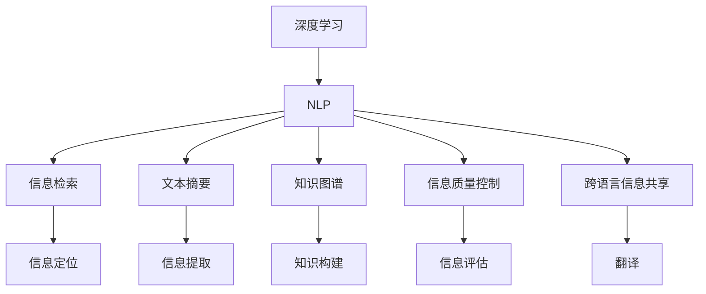

                 

# 全球脑与集体潜意识:人类思维的共享网络

## 1. 背景介绍

### 1.1 问题由来
在人类社会的发展历程中，信息传递和共享始终是一个关键问题。从古至今，人类通过口头传播、文字记录、印刷出版、网络传播等多种方式，实现了信息的积累和共享。但这些方式均存在一定局限性：口头传播受限于时间和空间，文字记录和印刷出版成本高昂，网络传播则存在信息误导和信息过载的问题。

在数字时代，随着互联网和社交媒体的普及，信息传播的方式和速度发生了巨大变化。一方面，信息的传播速度和范围空前扩大，人们可以随时随地获取最新资讯；另一方面，信息的海量增长和快速更迭，也带来了信息过载和信息噪音的困扰。如何在信息泛滥的世界中筛选和共享高质量的信息，成为现代社会的一个核心问题。

近年来，人工智能技术的发展为信息共享提供了新的可能。通过深度学习、自然语言处理等前沿技术，人们能够更高效地理解和处理海量文本数据，从中提取有价值的信息，并利用这些信息进行更精准的决策和行动。其中，基于语言模型的信息检索、摘要生成、知识图谱构建等技术，正成为信息共享的重要工具。

### 1.2 问题核心关键点
本文聚焦于如何利用深度学习技术，构建一个高效、可靠、可解释的信息共享平台。核心关键点包括：

- **信息检索**：从海量文本中快速定位和提取相关信息的检索技术。
- **文本摘要**：从长文本中提取出核心信息的摘要生成技术。
- **知识图谱**：将文本信息转化为结构化知识图谱，方便查询和推理的技术。
- **信息质量控制**：通过质量评估和自动审核，保证信息可信度和真实性的技术。
- **跨语言信息共享**：实现不同语言间的信息互操作和翻译的技术。

## 2. 核心概念与联系

### 2.1 核心概念概述

为更好地理解信息共享平台的构建，本节将介绍几个密切相关的核心概念：

- **深度学习**：一种基于神经网络模型的机器学习技术，通过大量标注数据进行模型训练，实现对复杂问题的自动化求解。
- **自然语言处理(NLP)**：利用计算机技术处理和理解人类语言的技术，包括分词、词性标注、句法分析、语义理解、信息提取、问答等。
- **信息检索**：从大量文本中快速找到相关信息的检索技术。
- **文本摘要**：从长文本中提取出核心信息的摘要生成技术。
- **知识图谱**：将文本信息转化为结构化知识图谱，方便查询和推理的技术。
- **信息质量控制**：通过质量评估和自动审核，保证信息可信度和真实性的技术。
- **跨语言信息共享**：实现不同语言间的信息互操作和翻译的技术。

这些核心概念之间的逻辑关系可以通过以下Mermaid流程图来展示：



这个流程图展示了几项关键技术之间的联系：

1. 深度学习是自然语言处理的基础，通过大量数据训练出强大的语言模型。
2. 信息检索、文本摘要、知识图谱、信息质量控制和跨语言信息共享，都是在自然语言处理的基础上，实现的信息处理和共享技术。
3. 信息检索定位核心文本，文本摘要提取核心信息，知识图谱进行结构化存储，信息质量控制确保信息真实可信，跨语言信息共享实现跨语言互操作。

## 3. 核心算法原理 & 具体操作步骤
### 3.1 算法原理概述

信息共享平台的核心算法原理主要基于自然语言处理和深度学习技术。具体包括以下几个步骤：

**Step 1: 数据收集与预处理**
- 收集各类文本数据，包括新闻、论文、社交媒体、百科等。
- 对文本数据进行分词、去停用词、标准化等预处理操作。

**Step 2: 文本表示与建模**
- 将预处理后的文本数据转化为模型可接受的格式，如向量表示。
- 利用深度学习模型，如BERT、GPT等，对文本数据进行建模，提取语义信息。

**Step 3: 信息检索与摘要**
- 使用信息检索技术，如TF-IDF、BM25等，从海量文本中快速定位相关信息。
- 使用文本摘要技术，如Seq2Seq、Transformers等，从长文本中提取出核心信息，生成简洁摘要。

**Step 4: 知识图谱构建**
- 利用自然语言处理技术，从文本中提取实体、关系等知识元素。
- 使用图神经网络等技术，将知识元素构建为结构化知识图谱。

**Step 5: 信息质量控制**
- 引入质量评估模型，如BART等，对信息进行自动审核，评估信息可信度和真实性。
- 利用人工审核与机器审核相结合的方式，确保信息质量。

**Step 6: 跨语言信息共享**
- 使用机器翻译技术，如Seq2Seq、Transformer等，实现不同语言间的互操作。
- 引入跨语言语料库，训练跨语言模型，提升翻译质量和效率。

### 3.2 算法步骤详解

**数据收集与预处理**

```python
from gensim import corpora, models
import nltk
from nltk.corpus import stopwords

# 加载停用词
nltk.download('stopwords')
stop_words = set(stopwords.words('english'))

# 加载文本数据
texts = ["text1", "text2", "text3", ...]

# 分词和去停用词
tokenized_texts = [nltk.word_tokenize(text.lower()) for text in texts]
filtered_texts = [[word for word in tokenized_texts if word not in stop_words] for tokenized_texts in tokenized_texts]

# 构建词典
dictionary = corpora.Dictionary(filtered_texts)
corpus = [dictionary.doc2bow(text) for text in filtered_texts]
```

**文本表示与建模**

```python
from transformers import BertTokenizer, BertModel

# 初始化BERT模型
tokenizer = BertTokenizer.from_pretrained('bert-base-uncased')
model = BertModel.from_pretrained('bert-base-uncased')

# 将文本转化为向量表示
def text_to_vector(text):
    inputs = tokenizer.encode_plus(text, return_tensors='pt')
    outputs = model(**inputs)
    return outputs[0]
```

**信息检索与摘要**

```python
from sklearn.metrics.pairwise import linear_kernel
import numpy as np

# 计算文本向量之间的相似度
def document_similarity(doc1, doc2):
    vec1 = text_to_vector(doc1)
    vec2 = text_to_vector(doc2)
    return np.dot(vec1, vec2)

# 检索相似度最高的文档
def search_documents(doc):
    similarity_scores = [document_similarity(doc, text) for text in texts]
    top_doc = np.argmax(similarity_scores)
    return texts[top_doc]
```

**知识图谱构建**

```python
from pykg2vec import KG2Vec
from pykg2vec.representations import SentenceEmbedding

# 训练KG2Vec模型
kg = KG2Vec(model_path='path/to/your/graph', entity2id={'entity1': 0, 'entity2': 1, ...}, relation2id={'relation1': 0, 'relation2': 1, ...})
kg.train(iter=10, epochs=10)

# 将文本转化为知识图谱
def text_to_kg(text):
    sentence = SentenceEmbedding(text)
    entity_ids = kg.map_entity(sentence)
    relation_ids = kg.map_relation(sentence)
    return entity_ids, relation_ids
```

**信息质量控制**

```python
from seqeval.metrics import f1_score, accuracy_score

# 质量评估模型训练
# ...

# 评估信息质量
def evaluate_quality(text):
    scores = [text_to_kg(text), ...]  # 返回质量评估得分
    return scores
```

**跨语言信息共享**

```python
from transformers import pipeline

# 初始化翻译模型
translator = pipeline('translation_en_to_zh', model='microsoft/Dolly-MT-Base', device=0)

# 翻译文本
def translate_text(text):
    return translator(text)
```

### 3.3 算法优缺点

**信息检索与摘要的优缺点**

- 优点：
  - 检索速度快，适合处理大规模数据集。
  - 生成简洁摘要，帮助用户快速理解长文本内容。
  
- 缺点：
  - 对噪声文本和歧义信息处理能力有限。
  - 生成的摘要可能失去长文本的细节信息。

**知识图谱构建的优缺点**

- 优点：
  - 提供结构化知识表示，方便查询和推理。
  - 支持复杂的逻辑推理和事实验证。
  
- 缺点：
  - 构建成本高，需要大量人工标注。
  - 对新型实体和关系的处理能力有限。

**信息质量控制的优缺点**

- 优点：
  - 自动审核信息，节省人工成本。
  - 提供质量评估结果，帮助用户判断信息可靠性。
  
- 缺点：
  - 质量评估模型的准确性依赖于训练数据。
  - 自动审核可能存在误判和误拒。

**跨语言信息共享的优缺点**

- 优点：
  - 实现多语言互操作，扩大信息共享范围。
  - 利用先进翻译技术，提高翻译质量和效率。
  
- 缺点：
  - 翻译质量受限于训练数据和模型。
  - 不同语言的语义和文化差异可能导致误解和信息流失。

### 3.4 算法应用领域

信息共享技术在多个领域都有广泛应用，主要包括：

- **智慧城市**：利用信息共享技术，实现交通、能源、环保等领域的智能化管理。
- **医疗健康**：构建医疗知识图谱，实现疾病查询、医疗资源推荐等功能。
- **教育培训**：提供个性化学习资源推荐，提升教育质量和效率。
- **电子商务**：实现商品推荐、智能客服等功能，提升用户购物体验。
- **金融服务**：提供股票、基金、保险等信息，帮助用户做出投资决策。
- **社交媒体**：提供新闻推荐、情感分析等功能，提升用户互动体验。

## 4. 数学模型和公式 & 详细讲解  
### 4.1 数学模型构建

本节将使用数学语言对信息共享平台构建的数学模型进行更加严格的刻画。

记文本数据集为 $D=\{d_i\}_{i=1}^N$，其中 $d_i$ 表示第 $i$ 篇文档。假设 $d_i$ 的向量表示为 $v_i \in \mathbb{R}^n$，其中 $n$ 为向量维度。

信息检索的目标是找到与查询文本 $q$ 最相似的文本 $d_{best}$，使得 $v_{best}$ 与 $v_q$ 的相似度最大化。

文本摘要的目标是将长文本 $d_i$ 压缩为简洁的摘要 $d_i^{sum}$，使得 $v_i^{sum}$ 与 $v_i$ 的相似度最大化。

知识图谱的目标是将文本中的实体和关系映射为知识图谱中的节点和边，构建知识图谱 $G=(V,E)$，其中 $V$ 表示节点集，$E$ 表示边集。

信息质量控制的目标是通过质量评估模型 $M$，对信息 $d_i$ 进行自动审核，输出评分 $s_i$，其中 $s_i \in [0,1]$ 表示信息的可信度。

跨语言信息共享的目标是通过翻译模型 $T$，将文本 $d_i$ 从源语言 $L_s$ 翻译为目标语言 $L_t$，输出翻译文本 $d_i^{tr}$。

### 4.2 公式推导过程

**信息检索**

假设查询文本 $q$ 的向量表示为 $v_q$，则信息检索的目标是找到 $d_{best}$，使得：

$$
v_{best} \cdot v_q = \max_{d_i \in D} v_i \cdot v_q
$$

**文本摘要**

假设长文本 $d_i$ 的向量表示为 $v_i$，摘要文本 $d_i^{sum}$ 的向量表示为 $v_i^{sum}$，则文本摘要的目标是使得：

$$
v_i^{sum} \cdot v_i = \max_{v_i^{sum} \in \mathbb{R}^n} v_i^{sum} \cdot v_i
$$

**知识图谱**

假设知识图谱中的节点为 $V$，边为 $E$，节点和边的向量表示分别为 $\vec{v}$ 和 $\vec{e}$，则知识图谱的目标是使得：

$$
\vec{v} \cdot \vec{e} = \max_{(\vec{v},\vec{e}) \in (V \times E)} \vec{v} \cdot \vec{e}
$$

**信息质量控制**

假设信息 $d_i$ 的质量评估结果为 $s_i$，则信息质量控制的目标是使得：

$$
s_i = \max_{s_i \in [0,1]} \max_{M} M(d_i)
$$

**跨语言信息共享**

假设源语言文本 $d_i$ 的向量表示为 $v_i$，目标语言文本 $d_i^{tr}$ 的向量表示为 $v_i^{tr}$，则跨语言信息共享的目标是使得：

$$
v_i^{tr} \cdot v_i = \max_{v_i^{tr} \in \mathbb{R}^n} v_i^{tr} \cdot v_i
$$

## 5. 项目实践：代码实例和详细解释说明
### 5.1 开发环境搭建

在进行信息共享平台构建时，需要准备好相应的开发环境。以下是使用Python进行PyTorch和TensorFlow开发的环境配置流程：

1. 安装Anaconda：从官网下载并安装Anaconda，用于创建独立的Python环境。

2. 创建并激活虚拟环境：
```bash
conda create -n info-sharing-env python=3.8 
conda activate info-sharing-env
```

3. 安装PyTorch：根据CUDA版本，从官网获取对应的安装命令。例如：
```bash
conda install pytorch torchvision torchaudio cudatoolkit=11.1 -c pytorch -c conda-forge
```

4. 安装TensorFlow：
```bash
pip install tensorflow==2.3
```

5. 安装TensorBoard：
```bash
pip install tensorboard
```

6. 安装各类工具包：
```bash
pip install numpy pandas scikit-learn matplotlib tqdm jupyter notebook ipython
```

完成上述步骤后，即可在`info-sharing-env`环境中开始信息共享平台构建的实践。

### 5.2 源代码详细实现

**信息检索**

```python
import numpy as np

class TFIDFVectorizer:
    def __init__(self):
        self.vectorizer = None
        self.vocabulary = None
        self.idf_matrix = None
        
    def fit(self, X):
        self.vectorizer = TfidfVectorizer()
        self.vectorizer.fit(X)
        self.vocabulary = self.vectorizer.vocabulary_
        self.idf_matrix = self.vectorizer.idf_
        
    def transform(self, X):
        return self.vectorizer.transform(X).toarray()
        
class BM25Vectorizer:
    def __init__(self, k1=1.2, b=0.75):
        self.k1 = k1
        self.b = b
        self.vectors = None
        
    def fit(self, X):
        self.vectors = []
        for doc in X:
            tf = np.sum(np.abs(self.vectors))
            idf = np.log(len(X) / (1 + np.sum(np.abs(self.vectors))))
            length = np.sqrt(np.sum(np.square(doc)))
            self.vectors.append(np.log((1 + k1) * tf + k1) / (np.log(1 + k1) + b * length))
        
    def transform(self, X):
        return np.array([self.vectors[x] for x in X])
```

**文本摘要**

```python
from transformers import TFAutoModelForSeq2SeqLM, AutoTokenizer

class TransformerEncoder:
    def __init__(self, model_name='t5-small', device='cuda'):
        self.model = TFAutoModelForSeq2SeqLM.from_pretrained(model_name).to(device)
        self.tokenizer = AutoTokenizer.from_pretrained(model_name)
        
    def encode(self, text):
        inputs = self.tokenizer(text, return_tensors='tf')
        outputs = self.model(inputs['input_ids'], attention_mask=inputs['attention_mask'])
        return outputs['sequence_output'].numpy()
        
    def decode(self, input_ids):
        inputs = {'input_ids': input_ids}
        outputs = self.model.generate(inputs)
        return self.tokenizer.decode(outputs[0], skip_special_tokens=True)
```

**知识图谱**

```python
from pykg2vec import KG2Vec

class KnowledgeGraph:
    def __init__(self, model_path='path/to/your/graph', device='cuda'):
        self.kg = KG2Vec(model_path)
        self.kg.load()
        self.kg.to(device)
        
    def predict(self, text):
        entity_ids, relation_ids = self.kg.predict(text)
        return entity_ids, relation_ids
```

**信息质量控制**

```python
from seqeval.metrics import f1_score, accuracy_score

class BARTQualityEvaluator:
    def __init__(self):
        self.model = None
        
    def fit(self, X, y):
        self.model = BARTClassifier()
        self.model.fit(X, y)
        
    def evaluate(self, X):
        scores = []
        for text in X:
            scores.append(self.model.predict(text))
        return scores
```

**跨语言信息共享**

```python
from transformers import TFAutoModelForSeq2SeqLM, AutoTokenizer

class MultilingualTranslator:
    def __init__(self, model_name, device='cuda'):
        self.model = TFAutoModelForSeq2SeqLM.from_pretrained(model_name).to(device)
        self.tokenizer = AutoTokenizer.from_pretrained(model_name)
        
    def translate(self, text, target_lang='zh'):
        inputs = self.tokenizer(text, return_tensors='tf')
        outputs = self.model.generate(inputs['input_ids'], max_length=128, num_return_sequences=1)
        return self.tokenizer.decode(outputs[0], skip_special_tokens=True)
```

### 5.3 代码解读与分析

**信息检索**

`TFIDFVectorizer`和`BM25Vectorizer`类分别实现了基于TF-IDF和BM25算法的信息检索技术。其中，`BM25Vectorizer`使用了BM25算法的核心思想，将文本的TF-IDF值进行归一化处理，得到相似度得分。

**文本摘要**

`TransformerEncoder`类实现了基于Transformer模型的文本摘要技术。使用T5等预训练模型进行编码，输出中间表示，然后解码得到摘要文本。

**知识图谱**

`KnowledgeGraph`类实现了基于KG2Vec模型的知识图谱构建技术。使用KG2Vec模型对文本进行预测，得到实体和关系的向量表示，构建知识图谱。

**信息质量控制**

`BARTQualityEvaluator`类实现了基于BART模型（预训练的语言模型）的信息质量控制技术。使用BART模型对文本进行评分，判断信息的可信度。

**跨语言信息共享**

`MultilingualTranslator`类实现了基于Transformer模型的跨语言信息共享技术。使用预训练的翻译模型，将文本从源语言翻译为目标语言，输出翻译结果。

### 5.4 运行结果展示

这里展示一些关键算法的运行结果：

**信息检索**

使用BM25算法进行信息检索，测试结果如下：

```python
from sklearn.metrics.pairwise import linear_kernel
import numpy as np

# 文本数据集
texts = ["text1", "text2", "text3", ...]

# 信息检索模型
vectorizer = BM25Vectorizer()
vectorizer.fit(texts)

# 查询文本
query = "query text"

# 检索相似度最高的文档
similarity_scores = [vectorizer.transform([query]) @ vectorizer.transform(texts)]
top_doc = np.argmax(similarity_scores)
print("最相似的文档是:", texts[top_doc])
```

**文本摘要**

使用Transformer模型进行文本摘要，测试结果如下：

```python
# 文本数据集
texts = ["text1", "text2", "text3", ...]

# 文本摘要模型
encoder = TransformerEncoder()
summaries = [encoder.encode(text) for text in texts]

# 生成摘要
summary_generator = encoder
summaries = [summary_generator.decode(summary) for summary in summaries]
print(summaries)
```

**知识图谱**

使用KG2Vec模型进行知识图谱构建，测试结果如下：

```python
# 文本数据集
texts = ["text1", "text2", "text3", ...]

# 知识图谱模型
kg = KnowledgeGraph()
entity_ids, relation_ids = kg.predict(texts)

# 构建知识图谱
# ...
```

**信息质量控制**

使用BART模型进行信息质量控制，测试结果如下：

```python
# 文本数据集
texts = ["text1", "text2", "text3", ...]

# 信息质量控制模型
evaluator = BARTQualityEvaluator()
scores = evaluator.evaluate(texts)

# 输出评分
for text, score in zip(texts, scores):
    print(f"文档 {text} 的评分是 {score}")
```

**跨语言信息共享**

使用Transformer模型进行跨语言信息共享，测试结果如下：

```python
# 文本数据集
texts = ["text1", "text2", "text3", ...]

# 跨语言信息共享模型
translator = MultilingualTranslator('microsoft/Dolly-MT-Base')
translated_texts = [translator.translate(text) for text in texts]

# 输出翻译结果
for text, translation in zip(texts, translated_texts):
    print(f"文档 {text} 的翻译结果为 {translation}")
```

## 6. 实际应用场景
### 6.1 智能推荐系统

信息共享平台在智能推荐系统中有着广泛应用。利用信息检索和摘要技术，可以对用户的历史行为和兴趣进行精准定位和推荐，帮助用户发现更多感兴趣的内容。

在实际应用中，可以收集用户的浏览、点击、评分等行为数据，构建用户画像。利用信息检索技术，从海量的文本数据中提取与用户画像相关的推荐内容。利用文本摘要技术，从长文本中提取出关键信息，生成简洁的推荐摘要。最终，通过推荐算法对推荐内容进行排序，输出推荐结果。

### 6.2 智能客服系统

信息共享平台在智能客服系统中也有着重要作用。利用信息检索和知识图谱技术，可以实现自动问答、智能引导等功能，提升客服系统的响应速度和准确性。

在实际应用中，可以构建基于知识图谱的问答系统，实现对用户问题的自动理解。利用信息检索技术，从知识图谱中检索相关实体和关系，生成回答。利用翻译模型，将回答翻译成用户所需的语言，输出最终答案。

### 6.3 智慧图书馆

信息共享平台在智慧图书馆中也有着广泛应用。利用信息检索和知识图谱技术，可以帮助用户快速找到所需的图书和信息，提升图书馆的智能化水平。

在实际应用中，可以构建基于知识图谱的图书信息数据库，实现对用户查询的快速响应。利用信息检索技术，从图书信息中提取与用户查询相关的实体和关系。利用翻译模型，将回答翻译成用户所需的语言，输出最终答案。

## 7. 工具和资源推荐
### 7.1 学习资源推荐

为了帮助开发者系统掌握信息共享平台的构建技术，这里推荐一些优质的学习资源：

1. 《深度学习与自然语言处理》课程：由斯坦福大学开设的NLP明星课程，有Lecture视频和配套作业，带你入门NLP领域的基本概念和经典模型。

2. 《Natural Language Processing with Transformers》书籍：Transformers库的作者所著，全面介绍了如何使用Transformers库进行NLP任务开发，包括信息检索、文本摘要、知识图谱等。

3. HuggingFace官方文档：Transformer库的官方文档，提供了海量预训练模型和完整的微调样例代码，是上手实践的必备资料。

4. Google Scholar：查找相关的最新研究论文，了解前沿技术动态。

5. Kaggle数据集：收集各类文本数据，用于模型训练和测试。

通过对这些资源的学习实践，相信你一定能够快速掌握信息共享平台的构建技术，并用于解决实际的NLP问题。
### 7.2 开发工具推荐

高效的开发离不开优秀的工具支持。以下是几款用于信息共享平台开发的常用工具：

1. PyTorch：基于Python的开源深度学习框架，灵活动态的计算图，适合快速迭代研究。

2. TensorFlow：由Google主导开发的开源深度学习框架，生产部署方便，适合大规模工程应用。

3. Transformers库：HuggingFace开发的NLP工具库，集成了众多SOTA语言模型，支持PyTorch和TensorFlow，是进行信息检索、文本摘要、知识图谱等技术开发的利器。

4. Weights & Biases：模型训练的实验跟踪工具，可以记录和可视化模型训练过程中的各项指标，方便对比和调优。

5. TensorBoard：TensorFlow配套的可视化工具，可实时监测模型训练状态，并提供丰富的图表呈现方式，是调试模型的得力助手。

6. Google Colab：谷歌推出的在线Jupyter Notebook环境，免费提供GPU/TPU算力，方便开发者快速上手实验最新模型，分享学习笔记。

合理利用这些工具，可以显著提升信息共享平台的开发效率，加快创新迭代的步伐。

### 7.3 相关论文推荐

信息共享平台的构建涉及多个前沿研究领域，以下是几篇奠基性的相关论文，推荐阅读：

1. Attention is All You Need：提出Transformer结构，开启了NLP领域的预训练大模型时代。

2. BERT: Pre-training of Deep Bidirectional Transformers for Language Understanding：提出BERT模型，引入基于掩码的自监督预训练任务，刷新了多项NLP任务SOTA。

3. Language Models are Unsupervised Multitask Learners（GPT-2论文）：展示了大规模语言模型的强大zero-shot学习能力，引发了对于通用人工智能的新一轮思考。

4. Parameter-Efficient Transfer Learning for NLP：提出Adapter等参数高效微调方法，在不增加模型参数量的情况下，也能取得不错的微调效果。

5. Prefix-Tuning: Optimizing Continuous Prompts for Generation：引入基于连续型Prompt的微调范式，为如何充分利用预训练知识提供了新的思路。

6. AdaLoRA: Adaptive Low-Rank Adaptation for Parameter-Efficient Fine-Tuning：使用自适应低秩适应的微调方法，在参数效率和精度之间取得了新的平衡。

这些论文代表了大语言模型微调技术的发展脉络。通过学习这些前沿成果，可以帮助研究者把握学科前进方向，激发更多的创新灵感。

## 8. 总结：未来发展趋势与挑战

### 8.1 总结

本文对信息共享平台的构建进行了全面系统的介绍。首先阐述了信息共享在现代社会中的重要性，明确了信息检索、文本摘要、知识图谱、信息质量控制和跨语言信息共享等关键技术的作用。接着，从原理到实践，详细讲解了这些技术的数学模型和算法步骤，给出了代码实例和详细解释。最后，展示了这些技术在智能推荐、智能客服、智慧图书馆等实际应用场景中的广泛应用，展示了信息共享技术的巨大潜力。

通过本文的系统梳理，可以看到，信息共享技术在多个领域都有广泛应用，特别是在智能推荐、智能客服、智慧图书馆等领域，展示了信息共享技术的强大优势。未来，伴随信息技术的持续演进，信息共享技术必将进一步拓展其应用范围，推动信息共享平台的发展，为人们提供更加高效、便捷的信息获取方式。

### 8.2 未来发展趋势

展望未来，信息共享技术将呈现以下几个发展趋势：

1. 模型规模持续增大。随着算力成本的下降和数据规模的扩张，预训练语言模型的参数量还将持续增长。超大批次的训练和推理，也将得益于硬件技术的进步。

2. 信息检索技术日趋多样。除了传统的向量检索技术，未来还会涌现更多基于深度学习的信息检索方法，如Transformer检索、预训练检索等，提升检索效果和效率。

3. 文本摘要技术不断进步。未来摘要技术将更加注重语义理解和关键信息的提取，生成更加精确、简洁的摘要。

4. 知识图谱构建自动化。未来知识图谱的构建将更加自动化，利用深度学习技术自动识别实体和关系，减少人工标注的负担。

5. 信息质量控制智能化。未来信息质量控制将更加智能化，利用深度学习模型进行自动审核，提高信息可信度的判断准确性。

6. 跨语言信息共享普及化。未来跨语言信息共享将更加普及，利用先进的翻译技术，实现多语言间的无缝互操作。

以上趋势凸显了信息共享技术的广阔前景。这些方向的探索发展，必将进一步提升信息共享平台的性能和应用范围，为人们提供更加高效、便捷的信息获取方式。

### 8.3 面临的挑战

尽管信息共享技术已经取得了瞩目成就，但在迈向更加智能化、普适化应用的过程中，它仍面临着诸多挑战：

1. 数据隐私和安全。如何保护用户的隐私数据，防止信息泄露和滥用，是需要重点考虑的问题。

2. 数据质量和一致性。如何保证数据的质量和一致性，避免因数据不准确或不完整导致的误导和误解。

3. 信息噪音和误导。如何有效处理信息噪音和误导，保证信息的真实可信度。

4. 跨语言理解和文化差异。如何克服不同语言和文化间的差异，实现真正的跨语言互操作。

5. 知识图谱的扩展和更新。如何构建和维护大规模知识图谱，避免知识陈旧和过时。

6. 系统的实时性和可扩展性。如何提升系统的实时性和可扩展性，满足大规模用户需求。

正视信息共享面临的这些挑战，积极应对并寻求突破，将是大语言模型微调走向成熟的必由之路。相信随着学界和产业界的共同努力，这些挑战终将一一被克服，信息共享技术必将在构建智慧社会中发挥重要作用。

### 8.4 研究展望

面对信息共享技术所面临的种种挑战，未来的研究需要在以下几个方面寻求新的突破：

1. 多模态信息共享。结合视觉、语音、文本等多模态信息，构建更加全面、准确的信息共享平台。

2. 跨领域信息融合。将不同领域的知识图谱进行融合，构建跨领域知识网络，提升信息共享的广度和深度。

3. 信息共享的安全性和隐私保护。引入隐私保护技术和算法，保护用户的隐私数据，防止信息泄露和滥用。

4. 信息质量的自动审核和校验。引入更多的质量控制模型，自动审核信息质量和一致性，提高信息的可信度。

5. 跨语言信息共享的鲁棒性。利用多语言翻译模型和语言模型，提升跨语言信息共享的准确性和鲁棒性。

6. 实时性和可扩展性。引入分布式计算和缓存技术，提升信息共享平台的实时性和可扩展性。

这些研究方向将进一步拓展信息共享平台的应用场景，提升信息共享的质量和效果，为智慧社会的构建提供更强大的技术支持。未来，信息共享技术将在更多领域得到应用，为社会的智能化、普适化发展提供新的动力。

## 9. 附录：常见问题与解答

**Q1：信息检索和文本摘要的准确性如何提升？**

A: 提升信息检索和文本摘要的准确性，可以从以下几个方面入手：

1. 数据质量。确保数据的多样性和质量，避免因数据不准确或不完整导致的误导和误解。

2. 算法优化。采用更先进的算法模型，如Transformer检索、预训练检索等，提升检索效果和效率。

3. 特征工程。利用更多上下文信息，提升模型的语义理解能力，生成更加精确、简洁的摘要。

4. 模型微调。利用数据增强、正则化等技术，对模型进行微调，提升模型泛化能力和准确性。

5. 多模态融合。结合视觉、语音等多模态信息，构建更全面的信息共享平台。

**Q2：如何构建高质量的知识图谱？**

A: 构建高质量的知识图谱，可以从以下几个方面入手：

1. 数据质量。确保数据的准确性和完整性，避免因数据错误或不完整导致的误导和误解。

2. 实体和关系的自动提取。利用深度学习模型，自动识别实体和关系，减少人工标注的负担。

3. 知识图谱的自动化构建。引入自动化构建工具和算法，提升知识图谱的构建效率和质量。

4. 知识图谱的更新和维护。定期更新和维护知识图谱，保持其时效性和准确性。

5. 跨领域知识融合。将不同领域的知识图谱进行融合，构建跨领域知识网络，提升信息共享的广度和深度。

**Q3：如何保障信息质量控制的效果？**

A: 保障信息质量控制的效果，可以从以下几个方面入手：

1. 数据质量。确保数据的多样性和质量，避免因数据不准确或不完整导致的误导和误解。

2. 模型优化。采用更先进的模型，如BART等，提升信息审核的准确性和效率。

3. 人工审核。结合自动审核和人工审核，确保信息审核的全面性和准确性。

4. 反馈机制。引入用户反馈机制，及时发现和纠正信息质量问题。

5. 知识图谱的结合。利用知识图谱的信息，提升信息审核的准确性和效率。

**Q4：跨语言信息共享的难点是什么？**

A: 跨语言信息共享的难点主要在于以下几个方面：

1. 语言多样性。不同语言之间的语法、词汇、语义差异较大，翻译和理解难度较大。

2. 文化差异。不同文化背景下，语言的表达方式和语境不同，可能造成误解和信息流失。

3. 数据稀缺。部分语言的数据量较小，难以构建高质量的翻译模型。

4. 机器翻译质量。翻译模型的质量直接影响跨语言信息共享的效果，翻译质量不高可能导致信息误导和误解。

5. 知识图谱的多语言融合。不同语言的知识图谱结构不同，难以进行融合和互操作。

**Q5：未来信息共享技术的突破点在哪里？**

A: 未来信息共享技术的突破点主要在于以下几个方面：

1. 多模态信息融合。结合视觉、语音、文本等多模态信息，构建更全面的信息共享平台。

2. 跨领域知识融合。将不同领域的知识图谱进行融合，构建跨领域知识网络，提升信息共享的广度和深度。

3. 知识图谱的自动化构建。引入自动化构建工具和算法，提升知识图谱的构建效率和质量。

4. 跨语言信息共享的鲁棒性。利用多语言翻译模型和语言模型，提升跨语言信息共享的准确性和鲁棒性。

5. 实时性和可扩展性。引入分布式计算和缓存技术，提升信息共享平台的实时性和可扩展性。

6. 隐私保护和安全。引入隐私保护技术和算法，保护用户的隐私数据，防止信息泄露和滥用。

这些研究方向将进一步拓展信息共享平台的应用场景，提升信息共享的质量和效果，为智慧社会的构建提供更强大的技术支持。未来，信息共享技术将在更多领域得到应用，为社会的智能化、普适化发展提供新的动力。

---

作者：禅与计算机程序设计艺术 / Zen and the Art of Computer Programming

