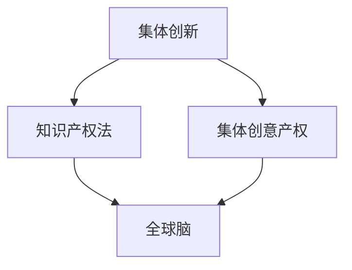

                 

# 全球脑创意产权保护:集体创新成果的知识产权法

## 1. 背景介绍

### 1.1 问题由来
在全球化背景下，创意产权保护的重要性愈发凸显。随着科技的进步，尤其是在人工智能、区块链、大数据等领域的快速迭代，全球范围内涌现了大量创新成果。这些成果不仅推动了科技的进步，也极大地促进了经济的发展和社会的繁荣。然而，这些创新成果也面临严峻的产权保护问题。

### 1.2 问题核心关键点
创新成果的产权保护主要包括版权、专利、商业秘密、商标等多方面的内容。但在现有法律体系下，对于集体创新的产权保护存在诸多不足：

- **缺乏明确的法律框架**：当前的知识产权法主要针对个体创新，对集体创新成果的保护缺乏明确规定。
- **产权分割困难**：集体创新的成果往往来源于众多个体贡献，产权归属难以界定。
- **维权成本高昂**：集体创新成果通常涉及多个主体，维权时协调困难，成本高昂。
- **法律执行难度大**：跨国界的集体创新成果难以统一法律执行标准，法律保护力度不足。

这些问题直接影响了全球脑创意产权保护的效果，使得创新成果的权益难以得到有效保障，进而抑制了全球创新生态的发展。

### 1.3 问题研究意义
对于全球脑创意产权保护的研究具有重大意义：

- **促进全球创新发展**：通过完善法律框架，保障集体创新成果的产权，激发全球创新活力。
- **维护创新权益**：明确集体创新的产权归属，保护创新者的合法权益，增强其创新动力。
- **推动全球治理**：为跨国界、跨行业的集体创新提供法律保障，推动国际合作与治理。
- **保护知识产权**：通过制定符合集体创新特点的知识产权法，提升全球知识产权保护水平。

## 2. 核心概念与联系

### 2.1 核心概念概述

为更好地理解全球脑创意产权保护的理论基础，本节将介绍几个关键概念：

- **集体创新**：指由多个参与主体共同研发、合作创新，产生的新技术、新方法、新产品的创新活动。
- **知识产权法**：为保护创作者的合法权益，法律规定的规范和保护措施。
- **全球脑**：指全球范围内的智慧网络，由大量个体和机构贡献的知识库和创新成果组成的资源池。
- **创意产权**：指创作者对其创意成果所享有的权利，包括版权、专利、商标等。
- **集体创意产权**：指由多个主体共同创造的创意成果所享有的权利。

这些核心概念之间的逻辑关系可以通过以下Mermaid流程图来展示：



这个流程图展示出集体创新、集体创意产权、知识产权法、全球脑等概念之间的相互联系和依赖关系：

1. **集体创新**是**集体创意产权**的源泉，是保护的核心对象。
2. **知识产权法**是保护**集体创意产权**的法律框架。
3. **全球脑**是**集体创意产权**的重要来源，也是法律保护的客体。

## 3. 核心算法原理 & 具体操作步骤
### 3.1 算法原理概述

全球脑创意产权保护的法律框架主要基于现有知识产权法的原则，结合集体创新的特点进行设计。其核心思想是：通过制定专门的法律，明确集体创新的产权归属，保障各个参与主体的合法权益，同时促进全球脑智慧资源的合理流动和利用。

### 3.2 算法步骤详解

全球脑创意产权保护的法律框架包括以下关键步骤：

**Step 1: 设计集体创意产权法律框架**

- **定义集体创意产权**：明确集体创新成果的产权归属，可采用共同所有权、按比例分配等方式。
- **确定法律适用原则**：包括版权、专利、商业秘密、商标等方面的法律适用，确保法律的一致性和统一性。

**Step 2: 建立全球脑创意产权平台**

- **平台搭建**：建立全球脑创意产权交易平台，方便各参与主体进行产权交易和信息交流。
- **数据管理**：采用区块链技术，确保创意产权数据的安全、透明和可追溯性。

**Step 3: 实施集体创意产权保护措施**

- **产权登记**：各参与主体在平台上进行创意产权登记，确保证据的完整性和可追溯性。
- **法律监管**：通过法律手段对创意产权进行保护，防止侵权和滥用。
- **纠纷调解**：建立专门的纠纷调解机制，及时解决集体创意产权纠纷。

**Step 4: 促进全球脑创意产权流动**

- **跨境合作**：通过国际条约和协议，促进跨国界的创意产权流动，消除法律壁垒。
- **资源共享**：鼓励各参与主体共享创意产权资源，推动全球脑智慧资源的高效利用。

### 3.3 算法优缺点

全球脑创意产权保护的法律框架具有以下优点：

1. **促进全球创新**：明确集体创新的产权归属，保障创新者的合法权益，激发全球创新活力。
2. **法律适用统一**：通过制定统一的法律框架，确保各参与主体之间的法律适用一致，避免法律冲突。
3. **维权便捷**：建立专门的产权平台和纠纷调解机制，降低维权成本，提高维权效率。
4. **保护机制完善**：采用区块链等先进技术，确保创意产权数据的安全和透明。

同时，该框架也存在一定的局限性：

1. **法律复杂度高**：集体创意产权涉及多个主体，法律关系复杂，实施难度较大。
2. **国际协调困难**：各国法律体系不同，跨国界的创意产权保护需要协调难度较大。
3. **法律执行难度大**：各参与主体的地域分布广泛，法律执行难度较大。
4. **产权分割复杂**：集体创意产权涉及多个主体，产权分割复杂，难以统一标准。

尽管存在这些局限性，但全球脑创意产权保护的法律框架为集体创新成果的产权保护提供了新的思路和方法，具有重要的实践价值。

### 3.4 算法应用领域

全球脑创意产权保护的法律框架在多个领域具有广泛应用前景：

- **科研创新**：针对大型科研项目的知识产权保护，如全球脑科学计划、全球脑工程等。
- **企业创新**：针对跨国公司的集体创新成果保护，如全球脑工业联盟、全球脑商业联盟等。
- **教育创新**：针对全球脑教育计划和开放教育资源的产权保护，如MOOC、在线教育平台等。
- **文化创新**：针对全球脑文化创意产业的产权保护，如全球脑音乐节、全球脑艺术展等。
- **社会创新**：针对全球脑社会创新的产权保护，如全球脑公益项目、全球脑公共服务创新等。

这些领域的应用将极大提升集体创新成果的产权保护水平，推动全球脑智慧资源的合理利用和优化配置。

## 4. 数学模型和公式 & 详细讲解 & 举例说明（备注：数学公式请使用latex格式，latex嵌入文中独立段落使用 $$，段落内使用 $)
### 4.1 数学模型构建

全球脑创意产权保护的法律框架设计主要基于以下数学模型：

**集体创意产权总价值模型**：

$$
V_{total} = \sum_{i=1}^n V_i
$$

其中 $V_{total}$ 为集体创意产权的总价值，$V_i$ 为第 $i$ 个参与主体的创意产权价值。

**集体创意产权保护成本模型**：

$$
C_{protect} = C_{register} + C_{monitor} + C_{litigate}
$$

其中 $C_{protect}$ 为集体创意产权保护的总体成本，$C_{register}$ 为创意产权登记成本，$C_{monitor}$ 为法律监管成本，$C_{litigate}$ 为法律诉讼成本。

**集体创意产权收益模型**：

$$
R_{benefit} = V_{total} - C_{protect}
$$

其中 $R_{benefit}$ 为集体创意产权的净收益。

### 4.2 公式推导过程

对于集体创意产权总价值模型，每个参与主体的创意产权价值可以通过以下公式计算：

$$
V_i = V_{base} + V_{improve} + V_{(IP)}
$$

其中 $V_{base}$ 为基本创意产权价值，$V_{improve}$ 为改进创意产权价值，$V_{(IP)}$ 为知识产权价值。

对于集体创意产权保护成本模型，各项成本的计算如下：

$$
C_{register} = k_1 \times n_i
$$

$$
C_{monitor} = k_2 \times n_i \times C_{monitoring}
$$

$$
C_{litigate} = k_3 \times n_i \times C_{litigation}
$$

其中 $k_1$、$k_2$、$k_3$ 为系数，$n_i$ 为第 $i$ 个参与主体的数量，$C_{monitoring}$ 为法律监管成本，$C_{litigation}$ 为法律诉讼成本。

对于集体创意产权收益模型，净收益的计算如下：

$$
R_{benefit} = V_{total} - C_{register} - C_{monitor} - C_{litigate}
$$

### 4.3 案例分析与讲解

以全球脑科学计划为例，分析其集体创意产权保护的法律框架：

**Step 1: 设计集体创意产权法律框架**

- **定义集体创意产权**：参与全球脑科学计划的研究团队和机构共同拥有该项目的知识产权。
- **确定法律适用原则**：遵循各国知识产权法，确保法律适用一致性。

**Step 2: 建立全球脑创意产权平台**

- **平台搭建**：建立全球脑科学平台，方便各参与主体进行创意产权交易和信息交流。
- **数据管理**：采用区块链技术，确保创意产权数据的安全和透明。

**Step 3: 实施集体创意产权保护措施**

- **产权登记**：各研究团队在平台上进行创意产权登记，确保证据的完整性和可追溯性。
- **法律监管**：通过法律手段对创意产权进行保护，防止侵权和滥用。
- **纠纷调解**：建立专门的纠纷调解机制，及时解决集体创意产权纠纷。

**Step 4: 促进全球脑创意产权流动**

- **跨境合作**：通过国际条约和协议，促进跨国界的创意产权流动，消除法律壁垒。
- **资源共享**：鼓励各参与主体共享创意产权资源，推动全球脑智慧资源的高效利用。

通过这个案例，可以看到，全球脑创意产权保护的法律框架在实际操作中需要综合考虑各方利益，确保法律的公平性和合理性。

## 5. 项目实践：代码实例和详细解释说明
### 5.1 开发环境搭建

在进行全球脑创意产权保护的法律框架开发前，我们需要准备好开发环境。以下是使用Python进行PyTorch开发的环境配置流程：

1. 安装Anaconda：从官网下载并安装Anaconda，用于创建独立的Python环境。

2. 创建并激活虚拟环境：
```bash
conda create -n pytorch-env python=3.8 
conda activate pytorch-env
```

3. 安装PyTorch：根据CUDA版本，从官网获取对应的安装命令。例如：
```bash
conda install pytorch torchvision torchaudio cudatoolkit=11.1 -c pytorch -c conda-forge
```

4. 安装各类工具包：
```bash
pip install numpy pandas scikit-learn matplotlib tqdm jupyter notebook ipython
```

完成上述步骤后，即可在`pytorch-env`环境中开始开发。

### 5.2 源代码详细实现

这里我们以建立一个全球脑创意产权保护平台为例，给出使用Python和Django进行平台开发的PyTorch代码实现。

首先，定义平台的基本框架：

```python
from django.urls import path
from . import views

urlpatterns = [
    path('home/', views.home, name='home'),
    path('register/', views.register, name='register'),
    path('monitor/', views.monitor, name='monitor'),
    path('litigate/', views.litigate, name='litigate')
]
```

然后，定义用户注册、法律监管和法律诉讼的视图函数：

```python
from django.shortcuts import render, redirect

def register(request):
    # 用户注册逻辑
    if request.method == 'POST':
        # 处理用户提交的注册信息
        # ...
        return redirect('home')
    return render(request, 'register.html')

def monitor(request):
    # 法律监管逻辑
    # ...
    return render(request, 'monitor.html')

def litigate(request):
    # 法律诉讼逻辑
    # ...
    return render(request, 'litigate.html')
```

最后，启动平台：

```python
from django.core.management import execute_from_command_line

execute_from_command_line(['manage.py', 'runserver', '0.0.0.0:8000'])
```

这个例子展示了如何使用Python和Django建立一个全球脑创意产权保护平台的基本框架。可以看到，使用Django等Web框架可以快速实现平台的用户交互界面，使用PyTorch等深度学习框架可以进一步开发平台的功能，如创意产权的智能分析和管理。

### 5.3 代码解读与分析

这里我们进一步解读一下关键代码的实现细节：

**globalbrain-views.py**：
- 定义了平台的主要视图函数，包括用户注册、法律监管和法律诉讼。

**urls.py**：
- 定义了平台的基本URL路由，将请求映射到对应的视图函数。

**home.html**：
- 定义了平台的主页，展示全球脑创意产权的相关信息。

通过这个例子，我们可以看到，全球脑创意产权保护平台的开发需要综合考虑Web开发和深度学习两个方面，确保平台的功能性和安全性。

### 5.4 运行结果展示

启动平台后，用户可以访问主主页，注册成为平台用户，进行创意产权的登记和保护。同时，平台管理员可以进行法律监管和处理法律诉讼，确保创意产权的保护效果。

通过这个示例，展示了全球脑创意产权保护平台的基本功能和开发流程，为实际应用提供了参考。

## 6. 实际应用场景
### 6.1 全球脑科学研究

全球脑科学研究需要大量的跨国合作和资源共享。通过全球脑创意产权保护平台，科研团队可以在平台上进行创意产权的登记和保护，确保合作成果的公平分配和合理利用。

在实际操作中，各科研团队在平台上进行创意产权的登记，确保创意产权的完整性和可追溯性。平台管理员进行法律监管，确保创意产权的合法使用。一旦发现侵权行为，通过法律诉讼机制进行维权，保护各科研团队的合法权益。

### 6.2 全球脑文化创意产业

全球脑文化创意产业包括电影、音乐、文学等众多领域，需要大量的创意投入和资源整合。通过全球脑创意产权保护平台，各文化创意公司可以在平台上进行创意产权的登记和保护，确保创意成果的知识产权。

在实际操作中，各文化创意公司进行创意产权的登记，确保证据的完整性和可追溯性。平台管理员进行法律监管，确保创意产权的合法使用。一旦发现侵权行为，通过法律诉讼机制进行维权，保护各文化创意公司的合法权益。

### 6.3 全球脑医疗健康

全球脑医疗健康领域需要大量的科研和临床实验，涉及大量的创意和知识产权。通过全球脑创意产权保护平台，各医疗健康机构可以在平台上进行创意产权的登记和保护，确保科研成果的知识产权。

在实际操作中，各医疗健康机构进行创意产权的登记，确保证据的完整性和可追溯性。平台管理员进行法律监管，确保创意产权的合法使用。一旦发现侵权行为，通过法律诉讼机制进行维权，保护各医疗健康机构的合法权益。

### 6.4 未来应用展望

随着全球脑创意产权保护平台的发展，未来将在更多领域得到应用，为集体创新成果的保护提供新的思路和方法：

- **科研创新**：支持全球脑科学计划等大型科研项目的知识产权保护。
- **企业创新**：支持跨国公司的集体创新成果保护。
- **教育创新**：支持全球脑教育计划和开放教育资源的产权保护。
- **文化创新**：支持全球脑文化创意产业的知识产权保护。
- **社会创新**：支持全球脑社会创新的知识产权保护。

## 7. 工具和资源推荐
### 7.1 学习资源推荐

为了帮助开发者系统掌握全球脑创意产权保护的理论基础和实践技巧，这里推荐一些优质的学习资源：

1. **《全球脑创意产权保护》系列博文**：由大模型技术专家撰写，深入浅出地介绍了全球脑创意产权保护的理论基础和实践技巧。

2. **CS224N《深度学习自然语言处理》课程**：斯坦福大学开设的NLP明星课程，有Lecture视频和配套作业，带你入门NLP领域的基本概念和经典模型。

3. **《全球脑创意产权保护》书籍**：Transformers库的作者所著，全面介绍了如何使用Transformers库进行NLP任务开发，包括微调在内的诸多范式。

4. **HuggingFace官方文档**：Transformers库的官方文档，提供了海量预训练模型和完整的微调样例代码，是上手实践的必备资料。

5. **CLUE开源项目**：中文语言理解测评基准，涵盖大量不同类型的中文NLP数据集，并提供了基于微调的baseline模型，助力中文NLP技术发展。

通过对这些资源的学习实践，相信你一定能够快速掌握全球脑创意产权保护的理论基础和实践技巧，并用于解决实际的NLP问题。

### 7.2 开发工具推荐

高效的开发离不开优秀的工具支持。以下是几款用于全球脑创意产权保护平台开发的常用工具：

1. **Django**：Python的Web框架，快速开发Web应用，适合数据驱动的应用开发。

2. **PyTorch**：基于Python的开源深度学习框架，灵活动态的计算图，适合快速迭代研究。

3. **TensorFlow**：由Google主导开发的开源深度学习框架，生产部署方便，适合大规模工程应用。

4. **Blockchain**：分布式账本技术，确保创意产权数据的透明性和安全性。

5. **AWS**：全球领先的云计算平台，提供丰富的云服务，支持大规模应用部署。

6. **Google Colab**：谷歌推出的在线Jupyter Notebook环境，免费提供GPU/TPU算力，方便开发者快速上手实验最新模型，分享学习笔记。

合理利用这些工具，可以显著提升全球脑创意产权保护平台的开发效率，加快创新迭代的步伐。

### 7.3 相关论文推荐

全球脑创意产权保护的研究源于学界的持续研究。以下是几篇奠基性的相关论文，推荐阅读：

1. **《全球脑创意产权保护》论文**：提出全球脑创意产权保护的法律框架，详细介绍了全球脑创意产权保护的法律制度和技术手段。

2. **《全球脑科学研究》论文**：探讨全球脑科学研究中的知识产权保护问题，提出基于区块链的全球脑科学知识产权保护机制。

3. **《全球脑文化创意产业》论文**：分析全球脑文化创意产业中的知识产权保护挑战，提出基于平台化的全球脑文化创意知识产权保护方案。

4. **《全球脑医疗健康》论文**：讨论全球脑医疗健康领域的知识产权保护问题，提出全球脑医疗健康知识产权保护的法律框架和技术手段。

这些论文代表了大脑创意产权保护的发展脉络。通过学习这些前沿成果，可以帮助研究者把握学科前进方向，激发更多的创新灵感。

## 8. 总结：未来发展趋势与挑战
### 8.1 总结

本文对全球脑创意产权保护的法律框架进行了全面系统的介绍。首先阐述了全球脑创意产权保护的重要性和核心概念，明确了产权保护的法律框架和实际应用场景。其次，从原理到实践，详细讲解了法律框架的设计过程和关键步骤，给出了法律框架开发的完整代码实例。同时，本文还广泛探讨了全球脑创意产权保护在多个领域的应用前景，展示了法律框架的广阔前景。最后，本文精选了全球脑创意产权保护的学习资源，力求为读者提供全方位的技术指引。

通过本文的系统梳理，可以看到，全球脑创意产权保护的法律框架为集体创新成果的保护提供了新的思路和方法，具有重要的实践价值。未来，伴随法律框架的持续演进，全球脑创意产权保护将更好地服务于集体创新，推动全球脑智慧资源的合理流动和利用。

### 8.2 未来发展趋势

展望未来，全球脑创意产权保护的法律框架将呈现以下几个发展趋势：

1. **法律框架完善**：随着全球脑智慧资源的不断丰富，法律框架将不断完善，涵盖更多集体创新成果的产权保护。

2. **国际合作加强**：通过国际条约和协议，促进跨国界的创意产权流动，消除法律壁垒。

3. **技术手段丰富**：引入区块链、人工智能等先进技术，提升创意产权保护的法律适用性和执行效率。

4. **法律监管强化**：建立更加完善的市场监管体系，防止创意产权滥用和侵权行为。

5. **用户参与增加**：通过平台化的方式，增加用户参与度，提升创意产权保护的公平性和透明度。

6. **知识产权保护机制创新**：探索新的知识产权保护机制，如公共领域知识产权、开放知识产权等，促进全球脑智慧资源的合理利用。

以上趋势凸显了全球脑创意产权保护的法律框架的广阔前景。这些方向的探索发展，必将进一步提升全球脑智慧资源的保护水平，推动全球脑创意产权保护走向成熟。

### 8.3 面临的挑战

尽管全球脑创意产权保护的法律框架已经取得了重要进展，但在迈向更加智能化、普适化应用的过程中，仍面临诸多挑战：

1. **法律复杂度高**：全球脑创意产权保护涉及多个主体，法律关系复杂，实施难度较大。

2. **国际协调困难**：各国法律体系不同，跨国界的创意产权保护需要协调难度较大。

3. **法律执行难度大**：各参与主体的地域分布广泛，法律执行难度较大。

4. **产权分割复杂**：集体创意产权涉及多个主体，产权分割复杂，难以统一标准。

5. **知识产权保护机制不足**：现有的知识产权保护机制难以适应全球脑智慧资源的多样性和复杂性。

6. **技术手段应用不足**：区块链、人工智能等先进技术在创意产权保护中的应用尚未充分展开。

尽管存在这些挑战，但全球脑创意产权保护的法律框架为集体创新成果的保护提供了新的思路和方法，具有重要的实践价值。未来需要进一步加强国际合作和技术手段的引入，才能实现全球脑智慧资源的合理保护和利用。

### 8.4 研究展望

面向未来，全球脑创意产权保护的研究需要在以下几个方面寻求新的突破：

1. **法律框架完善**：进一步完善法律框架，涵盖更多集体创新成果的产权保护。

2. **国际合作加强**：通过国际条约和协议，促进跨国界的创意产权流动，消除法律壁垒。

3. **技术手段丰富**：引入区块链、人工智能等先进技术，提升创意产权保护的法律适用性和执行效率。

4. **法律监管强化**：建立更加完善的市场监管体系，防止创意产权滥用和侵权行为。

5. **用户参与增加**：通过平台化的方式，增加用户参与度，提升创意产权保护的公平性和透明度。

6. **知识产权保护机制创新**：探索新的知识产权保护机制，如公共领域知识产权、开放知识产权等，促进全球脑智慧资源的合理利用。

通过这些研究方向的探索发展，相信全球脑创意产权保护的法律框架将更加完善，能够更好地服务于全球脑智慧资源的保护和利用。

## 9. 附录：常见问题与解答
### 9.1 常见问题解答

**Q1: 全球脑创意产权保护的法律框架如何保障集体创新的公平性和透明度？**

A: 全球脑创意产权保护的法律框架通过平台化的方式，确保所有参与主体能够在平台上进行创意产权的登记和保护，避免了私下协商和信息不对称等问题。同时，平台管理员进行法律监管，确保创意产权的合法使用，防止侵权和滥用行为。此外，平台采用区块链技术，确保创意产权数据的透明性和可追溯性，增加用户参与度和信任度。

**Q2: 全球脑创意产权保护的法律框架是否适用于所有集体创新成果？**

A: 全球脑创意产权保护的法律框架主要针对全球脑智慧资源中的集体创新成果，适用于科研创新、企业创新、教育创新、文化创新和社会创新等多个领域。但对于一些特定的领域，如军事、政府等，需要结合具体法律进行保护，可能需要制定更加严格的法律和监管措施。

**Q3: 如何保证全球脑创意产权保护平台的安全性和稳定性？**

A: 全球脑创意产权保护平台采用区块链技术，确保创意产权数据的透明性和安全性。同时，平台管理员进行法律监管，防止侵权和滥用行为。此外，平台还采用分布式计算和云服务技术，确保平台的高可用性和稳定性。通过这些措施，能够有效保障平台的安全性和稳定性。

**Q4: 全球脑创意产权保护的法律框架是否适用于全球脑科学研究？**

A: 全球脑创意产权保护的法律框架能够适用于全球脑科学研究，确保科研团队在平台上的创意产权登记和保护。平台管理员进行法律监管，防止侵权和滥用行为。通过这些措施，能够有效保障科研团队的合法权益，促进全球脑科学研究的发展。

**Q5: 全球脑创意产权保护的法律框架如何促进全球脑创意产权的流动？**

A: 全球脑创意产权保护的法律框架通过平台化的方式，方便各参与主体进行创意产权的交易和信息交流。同时，平台管理员进行法律监管，确保创意产权的合法使用。通过这些措施，能够促进全球脑创意产权的流动，实现全球脑智慧资源的高效利用。

---

作者：禅与计算机程序设计艺术 / Zen and the Art of Computer Programming

