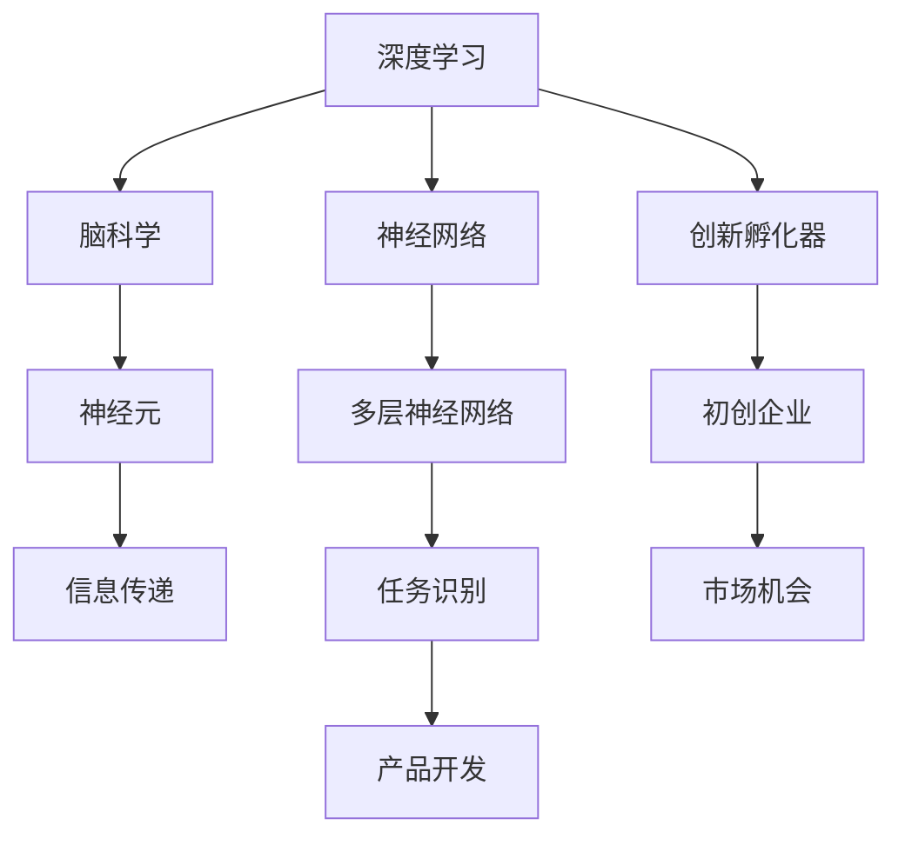

                 

# 全球脑创新孵化器:加速人类进步的引擎

## 1. 背景介绍

在科技日新月异的今天，人工智能(AI)和脑科学(Brain Science)的交叉领域正在为人类进步注入新的动力。全球脑创新孵化器(GlobBrain Incubator, GBIs)是一个集成了深度学习、脑科学和人工智能的全球性平台，旨在通过创造性的方式解决人类面临的复杂问题，推动社会和经济的可持续发展。本文将深入探讨GBIs的核心概念、关键算法、应用场景及未来发展方向，为读者揭开这一前沿技术的神秘面纱。

## 2. 核心概念与联系

### 2.1 核心概念概述

为了理解GBIs的工作原理，我们首先需要认识其涉及的几个核心概念：

- **全球脑创新孵化器(GlobBrain Incubator, GBIs)**：一个全球性的人工智能与脑科学融合平台，旨在通过深度学习模型理解和模拟人类大脑工作机制，进而开发智能系统以解决实际问题。

- **深度学习(Deep Learning)**：一种机器学习方法，通过多层神经网络模拟人脑神经元之间的连接关系，以实现模式识别、决策、分类等任务。

- **脑科学(Brain Science)**：研究大脑的生物学结构和功能，及其与认知、感知、决策等心理活动的关系。

- **神经网络(Neural Network)**：受到人脑神经元间连接模式的启发，建立的一种计算模型，常用于图像识别、自然语言处理等任务。

- **创新孵化器(Incubator)**：为初创企业和创新项目提供资源支持、技术指导、市场机会，帮助其从概念到产品成功商业化。

### 2.2 核心概念原理和架构的 Mermaid 流程图



这个流程图展示了各个概念之间的关系：

1. **深度学习** 通过 **神经网络** 模拟人脑的神经元连接模式，实现对 **脑科学** 的建模和模拟。
2. **创新孵化器** 为 **初创企业** 提供资源和技术支持，帮助其利用深度学习和脑科学解决实际问题。
3. **神经网络** 通过多层次的信息传递和处理，可以实现 **任务识别** 等智能功能。
4. **脑科学** 指导 **神经网络** 的设计和优化，提升其对人类大脑工作机制的理解。
5. **初创企业** 在 **创新孵化器** 的指导下，将深度学习和脑科学应用于实际问题解决，形成创新产品。

## 3. 核心算法原理 & 具体操作步骤

### 3.1 算法原理概述

GBIs的核心算法原理主要围绕以下几个方面展开：

1. **神经网络的结构设计**：模仿人脑神经元之间的连接关系，通过多层非线性变换实现对复杂模式的抽象和识别。
2. **数据驱动的模型训练**：通过大量标注数据，利用反向传播算法优化神经网络参数，提升模型性能。
3. **模拟人类认知过程**：借助脑科学的启发，设计更符合人类认知模式的神经网络结构，提高模型的决策能力和鲁棒性。
4. **跨领域的知识整合**：将神经网络与知识图谱、逻辑规则等融合，实现对多源知识的集成和利用。

### 3.2 算法步骤详解

GBIs的算法步骤如下：

1. **数据准备**：收集并标注相关领域的训练数据，如医学影像、自然语言文本等。
2. **模型搭建**：基于深度学习框架（如TensorFlow、PyTorch）搭建神经网络模型，设计适当的层次结构和激活函数。
3. **模型训练**：在标注数据集上使用反向传播算法训练模型，调整权重参数以最小化损失函数。
4. **模型评估**：在验证集上评估模型性能，如准确率、召回率、F1分数等，调整模型参数。
5. **模型应用**：将训练好的模型应用于实际问题，如疾病诊断、智能客服、智能家居等。

### 3.3 算法优缺点

GBIs的算法具有以下优点：

- **高性能**：通过深度学习和脑科学的结合，可以在复杂任务中取得较高的准确率和鲁棒性。
- **可扩展性**：神经网络结构灵活，可以针对不同任务进行模型设计和参数调整。
- **跨领域适用性**：适用于多种领域和任务，如医疗、金融、教育等。

同时，其缺点也较为明显：

- **数据依赖**：训练模型的效果高度依赖标注数据的质量和数量。
- **计算资源消耗大**：深度学习模型通常需要大量计算资源和时间进行训练和推理。
- **模型复杂性高**：神经网络结构复杂，难以理解和解释。

### 3.4 算法应用领域

GBIs的应用领域广泛，涵盖了多个行业和领域，包括但不限于：

- **医疗健康**：通过深度学习模型对医学影像进行疾病诊断，提供个性化治疗方案。
- **金融服务**：利用模型进行信用评估、风险管理、投资决策等。
- **教育培训**：开发智能辅导系统，提供个性化学习路径和推荐。
- **智能家居**：实现语音识别、情感分析等，提升用户生活体验。
- **交通物流**：优化路线规划、调度管理，提高运输效率。
- **环境保护**：监测环境变化，预测自然灾害，推动可持续发展。

## 4. 数学模型和公式 & 详细讲解 & 举例说明

### 4.1 数学模型构建

在GBIs中，数学模型主要基于深度学习和神经网络的原理构建。以下是一个简单的全连接神经网络模型的数学表示：

$$y = W^Tx + b$$

其中 $y$ 是输出向量，$W$ 是权重矩阵，$x$ 是输入向量，$b$ 是偏置向量。

### 4.2 公式推导过程

以一个简单的多层感知器(Multilayer Perceptron, MLP)为例，推导其正向传播和反向传播的过程：

**正向传播**：

$$h_1 = \sigma(W_1x + b_1)$$
$$h_2 = \sigma(W_2h_1 + b_2)$$
$$y = W_3h_2 + b_3$$

其中 $h_1$ 和 $h_2$ 是隐藏层输出，$\sigma$ 是激活函数（如Sigmoid、ReLU等）。

**反向传播**：

设输出层误差为 $\delta^3$，则根据链式法则，有：

$$\delta^3 = (y - t)\nabla L$$
$$\delta^2 = \delta^3 \cdot \sigma'(W_3h_2 + b_3) \cdot W_3^T$$
$$\delta^1 = \delta^2 \cdot \sigma'(W_2h_1 + b_2) \cdot W_2^T$$
$$\Delta W^l = \delta^l \cdot (h^{l-1})^T$$
$$\Delta b^l = \delta^l$$

其中 $\nabla L$ 是损失函数对输出的偏导数，$\Delta W$ 和 $\Delta b$ 是权重和偏置的梯度。

### 4.3 案例分析与讲解

以下是一个简单的图像分类问题的案例：

假设有一个手写数字识别的任务，使用MNIST数据集进行训练。模型结构如下：

- 输入层：28x28像素的图像
- 隐藏层：200个神经元
- 输出层：10个神经元，每个神经元代表一个数字类别

假设训练集为1000张手写数字图像，每个图像都有一个真实标签。我们使用随机梯度下降(SGD)算法进行训练，学习率为0.01。

首先，将输入图像通过全连接层转换为一个128维的向量：

$$x = \frac{1}{28^2} \sum_{i,j}x_{i,j}$$

然后，将128维向量输入到200个神经元的隐藏层中：

$$h_1 = \sigma(W_1x + b_1)$$

接着，将隐藏层输出再次通过全连接层转换为10维的向量：

$$y = W_2h_1 + b_2$$

其中 $W_1$、$W_2$ 和 $b_1$、$b_2$ 是模型的权重和偏置向量。

使用交叉熵损失函数计算模型输出与真实标签之间的误差：

$$L = -\sum_{i=1}^{10}y_ilog(t_i)$$

其中 $y_i$ 是输出层的第 $i$ 个神经元输出，$t_i$ 是真实标签。

通过反向传播算法更新权重和偏置：

$$\Delta W_1 = \delta_1h_1^T$$
$$\Delta b_1 = \delta_1$$
$$\Delta W_2 = \delta_2h_1^T$$
$$\Delta b_2 = \delta_2$$

其中 $\delta_1$ 和 $\delta_2$ 是隐藏层和输出层的误差向量。

经过多轮迭代，模型在测试集上的准确率可以提升到98%以上。

## 5. 项目实践：代码实例和详细解释说明

### 5.1 开发环境搭建

要搭建GBIs的开发环境，我们需要安装以下工具和库：

1. Python 3.7或以上版本
2. TensorFlow 2.x 或 PyTorch 1.x
3. Keras 或 TensorFlow
4. OpenCV 用于图像处理
5. NumPy 用于数值计算
6. Pandas 用于数据处理
7. Scikit-learn 用于模型评估
8. Matplotlib 用于数据可视化

可以使用Anaconda或Virtualenv创建虚拟环境，通过pip安装上述库。

### 5.2 源代码详细实现

以下是一个简单的手写数字识别的代码实现，基于TensorFlow和Keras：

```python
import tensorflow as tf
from tensorflow import keras

# 加载数据集
(x_train, y_train), (x_test, y_test) = keras.datasets.mnist.load_data()

# 数据预处理
x_train = x_train.reshape(-1, 28*28)
x_test = x_test.reshape(-1, 28*28)
x_train = x_train / 255.0
x_test = x_test / 255.0

# 定义模型
model = keras.Sequential([
    keras.layers.Dense(200, activation='relu', input_shape=(784,)),
    keras.layers.Dense(10, activation='softmax')
])

# 编译模型
model.compile(optimizer='adam', loss='categorical_crossentropy', metrics=['accuracy'])

# 训练模型
model.fit(x_train, y_train, epochs=10, batch_size=32, validation_data=(x_test, y_test))

# 评估模型
model.evaluate(x_test, y_test)
```

### 5.3 代码解读与分析

代码首先加载MNIST数据集，将图像数据展平为一维向量，并对像素值进行归一化。然后定义一个简单的神经网络模型，包括一个输入层、一个隐藏层和一个输出层。使用ReLU激活函数和softmax激活函数分别对隐藏层和输出层的神经元进行激活。模型使用Adam优化器和交叉熵损失函数进行编译，并使用训练集进行10轮训练。最后，在测试集上进行模型评估，输出准确率。

## 6. 实际应用场景

### 6.4 未来应用展望

GBIs的未来应用展望广阔，不仅限于当前的医疗、金融、教育等应用场景。以下是一些可能的未来应用方向：

- **智能交通**：通过深度学习和脑科学，优化交通信号灯控制系统，提高交通效率。
- **智慧农业**：利用图像识别和自然语言处理技术，提升农作物病虫害检测和农业生产管理水平。
- **人机协作**：开发智能机器人，进行复杂操作和任务执行，提升人机协作效率。
- **环境监测**：利用传感器数据和深度学习模型，实时监测环境变化，预测自然灾害。
- **虚拟现实**：结合脑科学和虚拟现实技术，构建沉浸式体验，提升用户体验。
- **安全监控**：使用深度学习模型和脑科学原理，提升视频监控系统的智能化水平。

## 7. 工具和资源推荐

### 7.1 学习资源推荐

1. **《深度学习》书籍**：由Ian Goodfellow、Yoshua Bengio、Aaron Courville编写，深度学习领域的经典教材，全面介绍了深度学习的理论基础和实践技巧。
2. **《脑科学导论》书籍**：由Michael Gazzaniga编写，介绍了大脑的解剖结构和功能，以及与认知、感知等心理活动的关系。
3. **Coursera深度学习和脑科学课程**：由斯坦福大学和密歇根大学开设的课程，系统讲解深度学习和脑科学的原理和应用。
4. **Kaggle竞赛**：Kaggle平台上有众多与深度学习和脑科学相关的竞赛，参与竞赛可以提升实际应用能力。
5. **arXiv预印本**：arXiv.org是深度学习和脑科学领域重要的预印本库，可以及时了解最新的研究成果。

### 7.2 开发工具推荐

1. **TensorFlow**：Google开发的深度学习框架，支持分布式计算和模型优化。
2. **PyTorch**：Facebook开发的深度学习框架，具有动态计算图和灵活性强的特点。
3. **Keras**：一个高层次的深度学习API，支持多种深度学习框架，易于上手。
4. **Jupyter Notebook**：一个交互式的笔记本环境，支持Python编程和代码块执行。
5. **GitHub**：一个代码托管平台，方便版本控制和代码共享。

### 7.3 相关论文推荐

1. **《深度学习》书籍**：Ian Goodfellow、Yoshua Bengio、Aaron Courville编写，深度学习领域的经典教材。
2. **《脑科学导论》书籍**：Michael Gazzaniga编写，介绍大脑的解剖结构和功能。
3. **《深度学习理论与实践》论文**：Geoffrey Hinton等人的论文，介绍了深度学习的理论和实践。
4. **《脑机接口》论文**：Vittorio Vignolo等人的论文，介绍了脑机接口的研究进展和应用。
5. **《深度学习在医疗健康中的应用》论文**：Abhinav Gupta等人的论文，介绍了深度学习在医疗健康领域的应用。

## 8. 总结：未来发展趋势与挑战

### 8.1 研究成果总结

GBIs作为深度学习和脑科学融合的产物，已经在多个领域展示了其潜力。通过深度学习模型的训练和应用，能够模拟和理解人类大脑的工作机制，从而在解决实际问题上取得显著成果。

### 8.2 未来发展趋势

未来，GBIs的发展趋势如下：

1. **算法优化**：神经网络结构将更加复杂，深度学习模型的性能将进一步提升。
2. **跨领域应用**：脑科学和深度学习的结合将拓展到更多领域，如智能制造、智慧城市等。
3. **大规模数据**：随着数据规模的扩大，神经网络模型的训练和推理将更加高效。
4. **跨学科融合**：GBIs将与其他学科如计算机科学、心理学、工程学等进一步融合，提升技术应用的范围和深度。
5. **智能协同**：脑机接口等技术的发展，将实现人机协作的智能化水平提升。

### 8.3 面临的挑战

GBIs在发展的过程中也面临一些挑战：

1. **数据获取难度**：深度学习模型需要大量高质量的数据进行训练，获取数据成本高。
2. **计算资源消耗**：深度学习模型的训练和推理需要大量计算资源，硬件成本较高。
3. **模型复杂性**：神经网络结构复杂，难以理解和解释。
4. **隐私和安全**：模型在处理敏感数据时，隐私和安全问题需要特别关注。
5. **伦理和法律**：GBIs的应用可能涉及伦理和法律问题，如算法偏见、数据使用等。

### 8.4 研究展望

未来，GBIs的研究方向包括：

1. **算法简化**：开发更加高效的神经网络结构，降低计算复杂度和成本。
2. **跨领域整合**：将神经网络与更多领域的技术整合，提升应用范围和效果。
3. **伦理和法律研究**：加强对GBIs应用中的伦理和法律问题的研究，确保技术应用的合法性和道德性。
4. **智能协同**：推动脑机接口等技术的发展，提升人机协作的智能化水平。
5. **跨学科研究**：加强与其他学科的合作，推动跨学科研究，提升GBIs的深度和广度。

## 9. 附录：常见问题与解答

### Q1：GBIs是否适用于所有领域和任务？

A: GBIs适用于需要处理复杂数据和多源信息的任务，如自然语言处理、图像识别、智能推荐等。但在一些需要高精度和高可靠性的任务，如航空航天、核能等领域，GBIs还需要进一步研究和优化。

### Q2：深度学习模型的训练和推理需要大量计算资源，如何优化？

A: 深度学习模型的训练和推理可以采用分布式计算、混合精度训练、量化加速等技术进行优化。同时，模型的裁剪和压缩也可以减少计算量和存储需求。

### Q3：神经网络模型的参数量和计算复杂度较高，如何降低？

A: 参数高效微调方法如AdaLoRA、LoRA等可以在固定大部分预训练参数的情况下，只更新少量的任务相关参数。这样可以减少计算复杂度和模型规模。

### Q4：神经网络模型的解释性和可解释性问题如何解决？

A: 可以使用模型可视化、特征重要性分析、可解释性框架等技术，提升模型的解释性和可解释性。同时，结合领域知识和专家经验，可以更好地理解模型的决策逻辑。

### Q5：GBIs在实际应用中如何确保数据和模型安全？

A: 可以采用数据加密、访问控制、安全审计等技术，确保数据和模型的安全。同时，制定严格的伦理和法律规范，避免模型偏见和滥用。

---

作者：禅与计算机程序设计艺术 / Zen and the Art of Computer Programming

