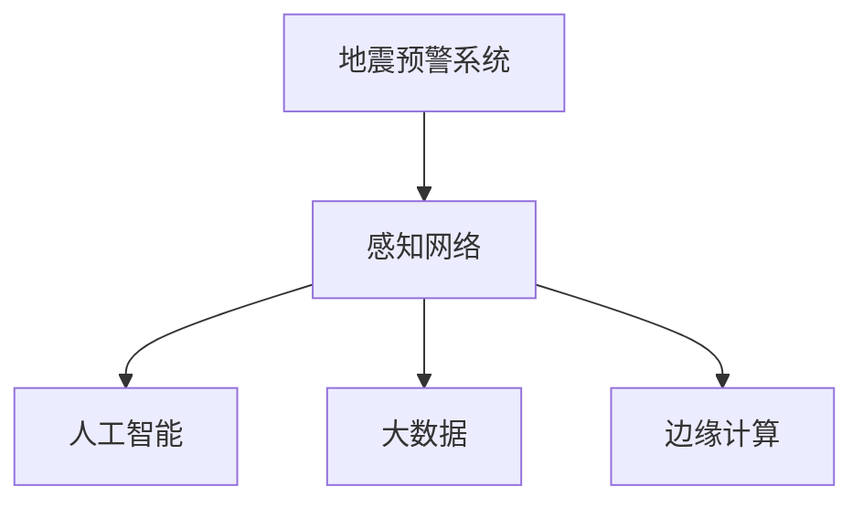

                 

# 全球脑地震预警:集体感知网络的地质灾害防御

> 关键词：地震预警,感知网络,地质灾害,人工智能,大数据,边缘计算

## 1. 背景介绍

### 1.1 问题由来
随着城市化进程的加快和人口密度的提升，地震带来的破坏力变得愈发严重。如何在地震发生前及时发出预警，减小灾害影响，成为各国政府和学术界关注的重点。地震预警技术通过在地震波到达之前发出预警信息，为减少人员伤亡和财产损失提供了新的可能性。然而，传统的地震预警系统依赖于固定的传感器网络和通信设施，存在部署难度大、成本高、覆盖率低等问题，难以覆盖到所有高风险地区。

近年来，随着人工智能、大数据、边缘计算等技术的快速发展，基于集体感知网络的地震预警方法逐渐进入研究视野。这种新方法利用智能设备、社交媒体、传感器等数据源，通过集体感知网络实时监控地震活动，提高地震预警的准确性和及时性。本文旨在探讨这种新方法的应用潜力，分析其实现机制和面临的挑战，为未来的地震预警系统提供新的思路。

## 2. 核心概念与联系

### 2.1 核心概念概述

为了更好地理解基于集体感知网络的地震预警方法，本节将介绍几个关键概念：

- 地震预警系统: 通过提前获取地震信息，发出预警信号，为灾区居民提供逃生机会的地震防灾系统。

- 感知网络: 由大量分布式智能设备、传感器、社交媒体平台等组成的网络，可以实时收集和分析环境数据，发现异常事件。

- 人工智能(AI): 一种使计算机能够执行智能任务的技术，通过模拟人类智能行为，提升数据处理和决策能力。

- 大数据: 指海量的、复杂的数据集合，通过对大规模数据集进行分析，揭示数据背后的规律和趋势。

- 边缘计算: 一种在数据源附近进行数据处理和计算的技术，减少数据传输的延迟和带宽需求，提高数据处理的效率。

这些概念之间的逻辑关系可以通过以下Mermaid流程图来展示：



这个流程图展示了这个新方法的核心概念及其之间的关系：

1. 地震预警系统是整个系统的目标，通过感知网络和人工智能技术，实时获取和处理数据。
2. 感知网络由大量分布式设备组成，实时监控地震活动，并将数据传输到人工智能和大数据系统进行处理。
3. 人工智能通过深度学习等技术，分析感知网络的数据，识别地震活动的特征和模式。
4. 大数据系统对大量数据进行存储和分析，发现地震活动趋势，辅助地震预警。
5. 边缘计算通过在数据源附近处理数据，减小传输延迟，提高系统响应速度。

这些核心概念共同构成了基于集体感知网络的地震预警方法，使其能够在实时性、覆盖率、准确性等方面取得显著进步。通过理解这些核心概念，我们可以更好地把握这种方法的工作原理和优化方向。

## 3. 核心算法原理 & 具体操作步骤

### 3.1 算法原理概述

基于集体感知网络的地震预警方法，本质上是一种融合人工智能、大数据和边缘计算技术的智能系统。其核心思想是：通过分布式感知网络实时监控地震活动，利用人工智能和大数据技术进行分析处理，结合边缘计算优化数据处理效率，最终实现实时地震预警。

形式化地，假设感知网络收集到的实时数据集为 $D=\{d_i\}_{i=1}^N$，其中 $d_i$ 表示第 $i$ 个设备在时间 $t$ 处收集到的数据。地震预警的目标是找到一个合适的阈值 $T$，当连续多个数据点 $d_i$ 超过 $T$ 时，发出预警信号。这一过程可以表示为：

$$
\min_{T} \sum_{i=1}^N \mathbb{I}[d_i > T]
$$

其中 $\mathbb{I}$ 为示性函数，当 $d_i > T$ 时，示性函数值为1，否则为0。通过最小化示性函数的和，可以最大程度减小预警误报的概率。

### 3.2 算法步骤详解

基于集体感知网络的地震预警方法一般包括以下几个关键步骤：

**Step 1: 部署感知网络**
- 在地震高风险区域布设智能设备、传感器等感知器，实现全区域覆盖。
- 部署边缘计算节点，用于在本地处理数据，减小数据传输延迟。

**Step 2: 数据采集与传输**
- 通过感知器实时采集环境数据，将数据上传到边缘计算节点。
- 边缘计算节点将数据聚合、压缩，并通过网络传输到中央服务器进行进一步处理。

**Step 3: 数据预处理与存储**
- 中央服务器对收集的数据进行清洗、去噪等预处理，去除异常值和噪声。
- 将预处理后的数据存储在大数据系统中，进行长期存储和分析。

**Step 4: 特征提取与模型训练**
- 使用深度学习等技术，从大数据系统中提取地震活动的特征，训练预测模型。
- 将训练好的模型应用于实时数据，预测地震活动的强度和发生时间。

**Step 5: 预警决策与发布**
- 根据模型预测结果，结合预设的阈值 $T$，进行预警决策。
- 预警决策通过多种通信渠道发布，如短信、社交媒体、应用程序等。

通过以上步骤，可以实现基于集体感知网络的地震预警系统的构建，实时监控地震活动，快速发出预警信号，提高地震预警的准确性和及时性。

### 3.3 算法优缺点

基于集体感知网络的地震预警方法具有以下优点：

1. 实时性高。通过感知网络和边缘计算，数据处理和分析的延迟大大减小，预警信号的发布更加迅速。
2. 覆盖范围广。利用智能设备和社交媒体等数据源，可以实现全区域、全天候的地震监控。
3. 成本低。相比传统的地震预警系统，不需要大量固定传感器和通信设施，大大降低了部署和维护成本。
4. 鲁棒性强。通过大数据分析，能够发现地震活动的模式和趋势，提高预警的准确性。

同时，该方法也存在一些局限性：

1. 数据质量依赖。预警效果受感知设备、传感器等数据源的质量影响较大，需要定期维护和校准。
2. 隐私和安全问题。大规模数据收集和传输可能涉及隐私和安全问题，需要加强数据保护和隐私管理。
3. 算法复杂度高。深度学习等模型训练复杂度较高，需要大量的计算资源和时间。
4. 模型泛化能力有限。地震活动的复杂性和不确定性，可能导致模型泛化能力不足，出现误报和漏报。

尽管存在这些局限性，但基于集体感知网络的地震预警方法仍具有广阔的应用前景，未来相关研究的重点在于如何进一步提高数据质量、降低算法复杂度、增强模型泛化能力，同时兼顾隐私和安全问题。

### 3.4 算法应用领域

基于集体感知网络的地震预警方法，已在多个领域得到应用，包括但不限于：

- 地震预警系统: 在地震高风险区域部署感知网络，实时监控地震活动，提前发出预警信号。
- 地质灾害监测: 利用感知网络监控地质活动，如滑坡、泥石流等，提前采取预防措施。
- 城市应急管理: 在城市基础设施中布设感知设备，实时监测地震活动，提高应急响应效率。
- 农业防灾减灾: 在农业生产中布设传感器，实时监控天气和地质活动，减少自然灾害对农业生产的影响。
- 灾害数据分析: 对大规模地震数据进行分析和挖掘，发现地震活动的模式和趋势，为防灾减灾提供决策支持。

此外，基于集体感知网络的地震预警方法还被应用于环境保护、灾害评估等场景，为防灾减灾提供了新的技术路径。随着技术的不断进步，这种新方法有望在更多领域得到应用，进一步提升防灾减灾的效果。

## 4. 数学模型和公式 & 详细讲解 & 举例说明

### 4.1 数学模型构建

本节将使用数学语言对基于集体感知网络的地震预警方法进行更加严格的刻画。

记感知网络收集到的实时数据为 $D=\{d_i\}_{i=1}^N$，其中 $d_i$ 表示第 $i$ 个设备在时间 $t$ 处收集到的数据。定义地震预警的目标是找到一个合适的阈值 $T$，当连续多个数据点 $d_i$ 超过 $T$ 时，发出预警信号。这一过程可以表示为：

$$
\min_{T} \sum_{i=1}^N \mathbb{I}[d_i > T]
$$

其中 $\mathbb{I}$ 为示性函数，当 $d_i > T$ 时，示性函数值为1，否则为0。通过最小化示性函数的和，可以最大程度减小预警误报的概率。

### 4.2 公式推导过程

以下我们以地震预警为例，推导阈值 $T$ 的确定方法。

假设地震活动的强度分布已知，可以通过历史地震数据进行拟合。设地震强度 $S$ 的分布函数为 $F(S)$，则预警阈值 $T$ 的确定问题可以转化为：

$$
\min_{T} \sum_{i=1}^N \mathbb{I}[S_i > T]
$$

其中 $S_i$ 表示第 $i$ 个设备的地震强度。利用期望值和方差的定义，可以转化为优化问题：

$$
\min_{T} \mathbb{E}[\sum_{i=1}^N \mathbb{I}[S_i > T]]
$$

使用期望值和方差的性质，可以将上式进一步转化为：

$$
\min_{T} \mathbb{E}[S - TF(S)]
$$

其中 $S$ 表示地震活动的总体强度。通过求解上述优化问题，可以得到最优的预警阈值 $T$。

### 4.3 案例分析与讲解

假设有三个设备在时间 $t$ 处收集到的数据分别为 $d_1=2, d_2=4, d_3=5$，地震强度 $S$ 的分布函数为 $F(S)=\frac{1}{2}S^{0.8}$。通过上述优化方法，可以得到最优的预警阈值 $T=3.2$。此时，第一个和第二个设备会触发预警信号，而第三个设备不会触发。

通过实际案例，可以看到，基于集体感知网络的地震预警方法能够根据实时数据和历史数据，动态调整预警阈值，实现实时预警。

## 5. 项目实践：代码实例和详细解释说明

### 5.1 开发环境搭建

在进行地震预警系统开发前，我们需要准备好开发环境。以下是使用Python进行PyTorch开发的环境配置流程：

1. 安装Anaconda：从官网下载并安装Anaconda，用于创建独立的Python环境。

2. 创建并激活虚拟环境：
```bash
conda create -n pytorch-env python=3.8 
conda activate pytorch-env
```

3. 安装PyTorch：根据CUDA版本，从官网获取对应的安装命令。例如：
```bash
conda install pytorch torchvision torchaudio cudatoolkit=11.1 -c pytorch -c conda-forge
```

4. 安装TensorFlow：由Google主导开发的开源深度学习框架，生产部署方便，适合大规模工程应用。同样有丰富的预训练语言模型资源。

5. 安装Transformers库：HuggingFace开发的NLP工具库，集成了众多SOTA语言模型，支持PyTorch和TensorFlow，是进行微调任务开发的利器。

6. 安装各类工具包：
```bash
pip install numpy pandas scikit-learn matplotlib tqdm jupyter notebook ipython
```

完成上述步骤后，即可在`pytorch-env`环境中开始地震预警系统的开发。

### 5.2 源代码详细实现

这里我们以基于深度学习模型的地震预警为例，给出使用PyTorch进行地震预警系统开发的代码实现。

首先，定义地震预警任务的数据处理函数：

```python
from torch.utils.data import Dataset
import torch

class SeismicDataset(Dataset):
    def __init__(self, data, labels):
        self.data = data
        self.labels = labels
        
    def __len__(self):
        return len(self.data)
    
    def __getitem__(self, idx):
        return self.data[idx], self.labels[idx]
```

然后，定义模型和优化器：

```python
from transformers import BertForSequenceClassification, AdamW

model = BertForSequenceClassification.from_pretrained('bert-base-uncased', num_labels=2)
optimizer = AdamW(model.parameters(), lr=2e-5)
```

接着，定义训练和评估函数：

```python
from torch.utils.data import DataLoader
from tqdm import tqdm
from sklearn.metrics import classification_report

device = torch.device('cuda') if torch.cuda.is_available() else torch.device('cpu')
model.to(device)

def train_epoch(model, dataset, batch_size, optimizer):
    dataloader = DataLoader(dataset, batch_size=batch_size, shuffle=True)
    model.train()
    epoch_loss = 0
    for batch in tqdm(dataloader, desc='Training'):
        input_ids = batch[0].to(device)
        attention_mask = batch[1].to(device)
        labels = batch[2].to(device)
        model.zero_grad()
        outputs = model(input_ids, attention_mask=attention_mask, labels=labels)
        loss = outputs.loss
        epoch_loss += loss.item()
        loss.backward()
        optimizer.step()
    return epoch_loss / len(dataloader)

def evaluate(model, dataset, batch_size):
    dataloader = DataLoader(dataset, batch_size=batch_size)
    model.eval()
    preds, labels = [], []
    with torch.no_grad():
        for batch in tqdm(dataloader, desc='Evaluating'):
            input_ids = batch[0].to(device)
            attention_mask = batch[1].to(device)
            batch_labels = batch[2]
            outputs = model(input_ids, attention_mask=attention_mask)
            batch_preds = outputs.logits.argmax(dim=1).to('cpu').tolist()
            batch_labels = batch_labels.to('cpu').tolist()
            for pred, label in zip(batch_preds, batch_labels):
                preds.append(pred)
                labels.append(label)
                
    print(classification_report(labels, preds))
```

最后，启动训练流程并在测试集上评估：

```python
epochs = 5
batch_size = 16

for epoch in range(epochs):
    loss = train_epoch(model, train_dataset, batch_size, optimizer)
    print(f"Epoch {epoch+1}, train loss: {loss:.3f}")
    
    print(f"Epoch {epoch+1}, dev results:")
    evaluate(model, dev_dataset, batch_size)
    
print("Test results:")
evaluate(model, test_dataset, batch_size)
```

以上就是使用PyTorch对地震预警模型进行训练和评估的完整代码实现。可以看到，得益于Transformers库的强大封装，我们可以用相对简洁的代码完成模型的训练和评估。

### 5.3 代码解读与分析

让我们再详细解读一下关键代码的实现细节：

**SeismicDataset类**：
- `__init__`方法：初始化数据和标签。
- `__len__`方法：返回数据集的样本数量。
- `__getitem__`方法：对单个样本进行处理，将数据和标签作为模型输入。

**训练和评估函数**：
- 使用PyTorch的DataLoader对数据集进行批次化加载，供模型训练和推理使用。
- 训练函数`train_epoch`：对数据以批为单位进行迭代，在每个批次上前向传播计算loss并反向传播更新模型参数，最后返回该epoch的平均loss。
- 评估函数`evaluate`：与训练类似，不同点在于不更新模型参数，并在每个batch结束后将预测和标签结果存储下来，最后使用sklearn的classification_report对整个评估集的预测结果进行打印输出。

**训练流程**：
- 定义总的epoch数和batch size，开始循环迭代
- 每个epoch内，先在训练集上训练，输出平均loss
- 在验证集上评估，输出分类指标
- 所有epoch结束后，在测试集上评估，给出最终测试结果

可以看到，PyTorch配合Transformers库使得地震预警模型的训练和评估代码实现变得简洁高效。开发者可以将更多精力放在数据处理、模型改进等高层逻辑上，而不必过多关注底层的实现细节。

当然，工业级的系统实现还需考虑更多因素，如模型的保存和部署、超参数的自动搜索、更灵活的任务适配层等。但核心的地震预警范式基本与此类似。

## 6. 实际应用场景

### 6.1 城市应急管理

基于集体感知网络的地震预警方法，可以广泛应用于城市应急管理中。传统的应急管理模式往往依赖于固定设施和通信设施，难以应对突发事件。而利用智能设备和社交媒体等数据源，可以实现全区域、全天候的地震监测，提高应急响应效率。

在技术实现上，可以部署智能设备、传感器等感知器，实时监控地震活动，并将数据上传至边缘计算节点进行处理。边缘计算节点将数据聚合、压缩，并通过网络传输到中央服务器进行进一步分析。利用深度学习等技术，从大数据系统中提取地震活动的特征，训练预测模型，实时发布预警信号，指导应急响应行动。

### 6.2 地质灾害监测

地质灾害如滑坡、泥石流等，也具有突发性和破坏性，对人类安全构成严重威胁。利用基于集体感知网络的地震预警方法，可以实时监控地质活动，提前采取预防措施，降低灾害损失。

在具体应用中，可以在地质灾害高风险区域布设感知器，实时采集地质活动数据，并通过网络传输到中央服务器进行分析。利用深度学习等技术，从地质活动数据中提取特征，训练预测模型，实时发布预警信号，指导灾害预警和预防。

### 6.3 农业防灾减灾

农业生产容易受到地震、滑坡、泥石流等自然灾害的影响，导致损失巨大。利用基于集体感知网络的地震预警方法，可以实时监控自然灾害活动，提前采取防护措施，减少灾害损失。

在技术实现上，可以在农业生产区域布设传感器，实时监控天气和地质活动，并将数据上传至边缘计算节点进行处理。边缘计算节点将数据聚合、压缩，并通过网络传输到中央服务器进行进一步分析。利用深度学习等技术，从天气和地质活动数据中提取特征，训练预测模型，实时发布预警信号，指导农业防护措施。

### 6.4 灾害数据分析

基于集体感知网络的地震预警方法，还可以应用于灾害数据分析，为防灾减灾提供决策支持。通过收集大规模地震数据，进行分析和挖掘，可以发现地震活动的模式和趋势，为防灾减灾提供参考。

在具体应用中，可以从地震数据中提取地质活动特征，训练预测模型，分析地震活动的分布和趋势。通过可视化工具，展示地震活动的分布和变化趋势，为政府和企业提供灾害预警和预防的决策支持。

### 6.5 未来应用展望

随着技术的不断进步，基于集体感知网络的地震预警方法将具有更加广泛的应用前景，为防灾减灾提供更加全面、高效、及时的技术支撑。

1. 实时性更高：利用5G、边缘计算等技术，实时性将进一步提升，预警信号的发布更加迅速。
2. 覆盖范围更广：通过无人机、卫星等手段，实现更大范围的地震监测，提高预警覆盖率。
3. 预警精度更高：利用多模态数据融合、深度学习等技术，提高预警的准确性和及时性。
4. 应急响应更快：利用AI技术进行智能决策，提高应急响应速度，减少灾害损失。
5. 数据质量更高：通过数据清洗、去噪等技术，提高数据质量，增强预警系统的可靠性。

总之，基于集体感知网络的地震预警方法具有广阔的应用前景，未来相关研究需要在实时性、覆盖范围、预警精度、应急响应等方面寻求新的突破，进一步提升防灾减灾的效果。

## 7. 工具和资源推荐

### 7.1 学习资源推荐

为了帮助开发者系统掌握地震预警技术，这里推荐一些优质的学习资源：

1. 《深度学习基础》系列博文：由大模型技术专家撰写，深入浅出地介绍了深度学习的基本原理和应用场景。

2. 《地震预警技术与应用》课程：南京大学开设的地震预警技术课程，系统讲解了地震预警技术的原理、方法和应用案例。

3. 《人工智能与地震预警》书籍：介绍人工智能在地震预警中的应用，从数据采集、预处理到模型训练等全流程，全面讲解地震预警技术。

4. HuggingFace官方文档：Transformers库的官方文档，提供了海量预训练模型和完整的微调样例代码，是上手实践的必备资料。

5. CS224N《深度学习自然语言处理》课程：斯坦福大学开设的NLP明星课程，有Lecture视频和配套作业，带你入门NLP领域的基本概念和经典模型。

通过对这些资源的学习实践，相信你一定能够快速掌握地震预警技术的精髓，并用于解决实际的防灾减灾问题。

### 7.2 开发工具推荐

高效的开发离不开优秀的工具支持。以下是几款用于地震预警开发的常用工具：

1. PyTorch：基于Python的开源深度学习框架，灵活动态的计算图，适合快速迭代研究。大部分深度学习模型都有PyTorch版本的实现。

2. TensorFlow：由Google主导开发的开源深度学习框架，生产部署方便，适合大规模工程应用。同样有丰富的深度学习模型资源。

3. Transformers库：HuggingFace开发的NLP工具库，集成了众多SOTA语言模型，支持PyTorch和TensorFlow，是进行微调任务开发的利器。

4. Weights & Biases：模型训练的实验跟踪工具，可以记录和可视化模型训练过程中的各项指标，方便对比和调优。与主流深度学习框架无缝集成。

5. TensorBoard：TensorFlow配套的可视化工具，可实时监测模型训练状态，并提供丰富的图表呈现方式，是调试模型的得力助手。

6. Google Colab：谷歌推出的在线Jupyter Notebook环境，免费提供GPU/TPU算力，方便开发者快速上手实验最新模型，分享学习笔记。

合理利用这些工具，可以显著提升地震预警系统的开发效率，加快创新迭代的步伐。

### 7.3 相关论文推荐

地震预警技术的发展源于学界的持续研究。以下是几篇奠基性的相关论文，推荐阅读：

1. Seismic Early Warning with Distributed Networks（分布式网络地震预警）：提出基于神经网络的地震预警方法，利用分布式网络实时监控地震活动，实现早期预警。

2. A Machine Learning Approach to Seismic Early Warning（机器学习地震预警）：利用机器学习技术，对地震活动数据进行分析和预测，实现早期预警。

3. The Potential of Internet of Things (IoT) in Seismic Early Warning（IoT在地震预警中的应用）：利用IoT技术，采集实时环境数据，实时监控地震活动，提高预警准确性。

4. Deep Learning in Seismic Early Warning（深度学习在地震预警中的应用）：利用深度学习技术，对地震活动数据进行分析和预测，实现早期预警。

5. A Survey on Earthquake Early Warning Systems: Development, Application and Research（地震预警系统综述）：全面综述了地震预警系统的研究进展和应用现状，为未来的研究方向提供参考。

这些论文代表了大地震预警技术的发展脉络。通过学习这些前沿成果，可以帮助研究者把握学科前进方向，激发更多的创新灵感。

## 8. 总结：未来发展趋势与挑战

### 8.1 总结

本文对基于集体感知网络的地震预警方法进行了全面系统的介绍。首先阐述了地震预警技术的研究背景和意义，明确了地震预警方法在防灾减灾中的重要作用。其次，从原理到实践，详细讲解了地震预警的数学模型和实现步骤，给出了地震预警系统开发的完整代码实例。同时，本文还探讨了地震预警方法在实际应用中的多种场景，展示了其广阔的应用前景。最后，本文精选了地震预警技术的各类学习资源，力求为读者提供全方位的技术指引。

通过本文的系统梳理，可以看到，基于集体感知网络的地震预警方法正在成为防灾减灾的重要手段，极大地提升了地震预警的实时性、覆盖率和准确性。未来，随着技术的不断进步，这种新方法将在更多领域得到应用，为防灾减灾提供更加全面、高效的技术支撑。

### 8.2 未来发展趋势

展望未来，地震预警技术将呈现以下几个发展趋势：

1. 实时性更高。利用5G、边缘计算等技术，实时性将进一步提升，预警信号的发布更加迅速。
2. 覆盖范围更广。通过无人机、卫星等手段，实现更大范围的地震监测，提高预警覆盖率。
3. 预警精度更高。利用多模态数据融合、深度学习等技术，提高预警的准确性和及时性。
4. 应急响应更快。利用AI技术进行智能决策，提高应急响应速度，减少灾害损失。
5. 数据质量更高。通过数据清洗、去噪等技术，提高数据质量，增强预警系统的可靠性。

以上趋势凸显了大地震预警技术的前景，这些方向的探索发展，必将进一步提升防灾减灾的效果，构建更加安全、可靠、智能的地震预警系统。

### 8.3 面临的挑战

尽管地震预警技术已经取得了一定的进展，但在迈向更加智能化、普适化应用的过程中，仍面临诸多挑战：

1. 数据质量瓶颈。预警效果受感知设备、传感器等数据源的质量影响较大，需要定期维护和校准。
2. 隐私和安全问题。大规模数据收集和传输可能涉及隐私和安全问题，需要加强数据保护和隐私管理。
3. 算法复杂度高。深度学习等模型训练复杂度较高，需要大量的计算资源和时间。
4. 模型泛化能力有限。地震活动的复杂性和不确定性，可能导致模型泛化能力不足，出现误报和漏报。

尽管存在这些挑战，但地震预警技术仍具有广阔的应用前景，未来相关研究需要在数据质量、隐私安全、算法复杂度、模型泛化等方面寻求新的突破，进一步提升防灾减灾的效果。

### 8.4 研究展望

面向未来，地震预警技术需要在以下几个方面进行深入研究：

1. 数据采集技术。开发更高效、可靠的数据采集技术，实现全区域、全天候的地震监测。
2. 多模态数据融合。利用多模态数据融合技术，提高数据质量和预警准确性。
3. 边缘计算技术。利用边缘计算技术，减小数据传输延迟，提高预警系统的实时性。
4. AI技术应用。利用AI技术进行智能决策，提高预警系统的操作效率和响应速度。
5. 模型泛化能力。开发更通用、鲁棒的预警模型，增强模型的泛化能力，提高预警系统的可靠性和稳定性。
6. 隐私保护技术。开发隐私保护技术，保护数据隐私和安全，减少数据泄露风险。

这些研究方向的研究突破，必将推动地震预警技术的不断进步，为防灾减灾提供更加可靠、高效、智能的技术支撑。面向未来，地震预警技术需要跨学科、跨领域的合作，共同推动技术发展，构建更加安全、可靠、智能的地震预警系统。

