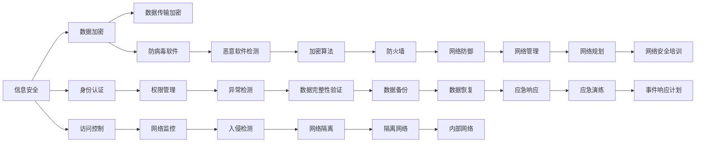

                 

## 1. 背景介绍

### 1.1 问题由来
在数字化转型的时代，数据已经成为国家的重要战略资产，直接关系到国家的安全与稳定。随着人工智能、大数据、物联网等技术的飞速发展，数据获取、存储、传输和利用的方式发生了根本性的变化。这种变化带来了新的安全挑战，尤其是对脑安全的威胁。脑安全不仅关乎国家的信息安全，还关乎国家的政治、经济、文化、社会等各个方面。因此，在全球脑安全问题日益严重的背景下，亟需构建新的国防战略来应对数字时代的挑战。

### 1.2 问题核心关键点
全球脑安全问题涉及多个层面，包括但不限于：

- **信息安全**：数据泄露、黑客攻击、病毒传播等对国家信息安全的威胁。
- **技术垄断**：一些国家通过技术优势控制全球信息流通，对国家自主创新和信息安全造成威胁。
- **基础设施脆弱性**：数字基础设施的脆弱性可能导致大规模的信息泄漏和破坏。
- **社会伦理**：隐私保护、数据滥用、信息审查等社会伦理问题对公众信任和国家声誉的影响。
- **法律规范**：数据跨境流动、跨境执法等法律规范问题带来的挑战。

本文聚焦于基于人工智能技术的全球脑安全战略，探讨如何在数字时代构建起新的国防防御体系，以应对全球脑安全问题。

## 2. 核心概念与联系

### 2.1 核心概念概述
全球脑安全，是指通过一系列策略和技术手段，保护国家的脑安全，包括信息安全、技术自主、基础设施安全、社会伦理和法律规范等方面。基于人工智能的全球脑安全战略，则是指利用人工智能技术，构建全方位、多层次的脑安全防御体系，以应对数字时代的新型安全威胁。

### 2.2 核心概念原理和架构的 Mermaid 流程图



这个流程图展示了全球脑安全的多维防御体系，其中各概念之间存在紧密的联系和相互作用。

## 3. 核心算法原理 & 具体操作步骤

### 3.1 算法原理概述

基于人工智能的全球脑安全战略，主要利用机器学习、深度学习、自然语言处理等技术手段，构建智能化的脑安全防御体系。其核心思想是通过数据挖掘和分析，识别潜在的安全威胁，并通过预测和防护手段，主动防御安全风险。

### 3.2 算法步骤详解
#### 3.2.1 数据收集和预处理
收集来自互联网、传感器、社交媒体等多种来源的数据，并进行清洗、标注和预处理，构建训练数据集。

#### 3.2.2 特征提取和选择
利用特征提取算法，如TF-IDF、Word2Vec等，从文本数据中提取有意义的特征。通过特征选择算法，如LASSO、随机森林等，筛选出对脑安全威胁最有影响的关键特征。

#### 3.2.3 模型训练
使用监督学习算法，如支持向量机、随机森林、深度神经网络等，对数据集进行模型训练，构建脑安全威胁检测模型。

#### 3.2.4 威胁检测和响应
将模型应用于实时数据流，进行威胁检测。一旦检测到威胁，立即启动响应机制，如隔离网络、加密数据、通知应急响应团队等，以保护国家的信息安全。

#### 3.2.5 模型更新和优化
定期更新和优化模型，以应对新的安全威胁和攻击手段。

### 3.3 算法优缺点

#### 3.3.1 优点
- **高精度**：利用深度学习和自然语言处理技术，能够实现高精度的威胁检测和防护。
- **实时性**：基于AI的模型可以实时分析大量数据，快速响应安全威胁。
- **自适应性**：AI模型能够自适应新的安全威胁和攻击手段，持续提升防护能力。

#### 3.3.2 缺点
- **数据隐私**：大规模数据收集和分析可能侵犯用户隐私。
- **模型复杂性**：构建和维护复杂AI模型需要高水平的技术团队和大量的计算资源。
- **误报率**：AI模型可能会出现误报，误判正常数据为威胁，影响正常业务。

### 3.4 算法应用领域

基于AI的全球脑安全战略，在多个领域有广泛的应用：

- **国家安全**：保护国家的信息基础设施和数据，防止信息泄露和攻击。
- **企业安全**：保护企业的敏感数据和信息，防止商业机密泄露和网络攻击。
- **社会安全**：保护公众的隐私和数据安全，防止数据滥用和身份盗窃。

## 4. 数学模型和公式 & 详细讲解 & 举例说明

### 4.1 数学模型构建

基于AI的脑安全威胁检测模型，可以构建如下的数学模型：

$$
\text{威胁等级} = f(\text{特征向量}, \text{权重参数}, \text{偏置参数})
$$

其中，特征向量表示从原始数据中提取的关键特征，权重参数和偏置参数表示模型的参数。

### 4.2 公式推导过程

假设特征向量 $\mathbf{x} \in \mathbb{R}^n$，模型参数 $\mathbf{w} \in \mathbb{R}^n$，偏置参数 $b \in \mathbb{R}$，则模型的输出为：

$$
y = f(\mathbf{x}, \mathbf{w}, b) = \text{sigmoid}(\mathbf{w}^T \mathbf{x} + b)
$$

其中，$\text{sigmoid}$ 函数将输出映射到 $[0, 1]$ 区间，表示威胁的概率。

### 4.3 案例分析与讲解

假设我们收集到了关于某政府机构网站访问量的数据，使用TF-IDF算法提取了以下特征：

- 访问量
- 访问来源
- 访问时间
- 用户停留时间

构建了一个随机森林模型，使用历史数据进行训练，得到如下特征权重：

- 访问量：0.3
- 访问来源：0.2
- 访问时间：0.25
- 用户停留时间：0.25

使用训练好的模型对新数据进行威胁检测，计算得到威胁等级为0.7，即该网站存在高风险，需立即采取防护措施。

## 5. 项目实践：代码实例和详细解释说明

### 5.1 开发环境搭建

在搭建开发环境时，需要以下工具和软件：

- **Python**：选择Python 3.7及以上版本。
- **Pandas**：用于数据处理和分析。
- **Scikit-learn**：用于构建和训练机器学习模型。
- **TensorFlow**：用于深度学习和自然语言处理。
- **Jupyter Notebook**：用于编写和运行代码。

安装上述工具的方法如下：

```bash
# 安装Python
sudo apt-get install python3

# 安装Pandas
sudo pip3 install pandas

# 安装Scikit-learn
sudo pip3 install scikit-learn

# 安装TensorFlow
sudo pip3 install tensorflow

# 安装Jupyter Notebook
sudo apt-get install jupyter notebook
```

### 5.2 源代码详细实现

下面是一个简单的基于TensorFlow的脑安全威胁检测模型的实现：

```python
import tensorflow as tf
import pandas as pd
import numpy as np

# 加载数据
data = pd.read_csv('data.csv')

# 特征提取
features = data[['access_volume', 'source', 'time', 'stay_time']]
labels = data['threat_level']

# 数据预处理
features = features.fillna(features.mean())

# 特征选择
selected_features = features.select_dtypes(include=[np.number])

# 训练集和测试集划分
train_size = int(len(features) * 0.8)
X_train, X_test = selected_features.iloc[:train_size], selected_features.iloc[train_size:]
y_train, y_test = labels.iloc[:train_size], labels.iloc[train_size:]

# 模型定义
model = tf.keras.Sequential([
    tf.keras.layers.Dense(16, activation='relu', input_shape=(4,)),
    tf.keras.layers.Dense(1, activation='sigmoid')
])

# 模型编译
model.compile(optimizer='adam', loss='binary_crossentropy', metrics=['accuracy'])

# 模型训练
model.fit(X_train, y_train, epochs=10, batch_size=32)

# 模型评估
loss, accuracy = model.evaluate(X_test, y_test)
print(f'Test loss: {loss:.4f}')
print(f'Test accuracy: {accuracy:.4f}')
```

### 5.3 代码解读与分析

上述代码实现了基于TensorFlow的脑安全威胁检测模型。具体步骤如下：

- 加载数据，并进行特征提取和选择。
- 对缺失值进行填充，并进行标准化处理。
- 将数据集划分为训练集和测试集。
- 定义一个简单的神经网络模型，包括一个隐藏层和一个输出层。
- 使用Adam优化器和二元交叉熵损失函数，对模型进行编译。
- 使用训练集对模型进行训练，评估模型在测试集上的性能。

## 6. 实际应用场景

### 6.1 网络安全防御

全球脑安全战略在网络安全防御中具有广泛应用。例如，可以使用AI模型对网络流量进行实时分析，识别出潜在的恶意流量和攻击行为，并进行实时阻断。

### 6.2 数据加密与保护

AI技术可以用于生成随机密钥，保护敏感数据的安全传输。同时，AI还可以识别出数据泄露的异常行为，及时通知相关人员进行干预。

### 6.3 身份验证与访问控制

基于AI的身份验证系统，可以根据用户的行为和特征进行实时分析，判断其身份真实性，防止身份盗窃和恶意访问。

### 6.4 未来应用展望

未来，基于AI的全球脑安全战略将进一步发展，包括以下方向：

- **多模态数据融合**：融合文本、图像、音频等多种模态数据，提升威胁检测的全面性和准确性。
- **自适应学习**：通过在线学习和自适应算法，实时更新模型参数，应对新出现的威胁和攻击手段。
- **跨领域协作**：与其他国家、组织和机构进行合作，共同构建全球脑安全防御体系。
- **伦理与安全**：建立健全的伦理和安全机制，确保AI技术的应用符合法律法规和社会道德。

## 7. 工具和资源推荐

### 7.1 学习资源推荐

- **《Python数据科学手册》**：详细介绍Python数据处理和分析技术。
- **《深度学习》**：由Ian Goodfellow、Yoshua Bengio和Aaron Courville合著的深度学习经典教材。
- **《机器学习实战》**：由Peter Harrington编写的机器学习实践指南。
- **Kaggle**：全球最大的数据科学竞赛平台，提供大量实际应用案例和开源项目。
- **Coursera**：提供机器学习、深度学习、自然语言处理等领域的在线课程。

### 7.2 开发工具推荐

- **Python**：Python是数据科学和机器学习领域的主流编程语言。
- **TensorFlow**：TensorFlow是Google开发的深度学习框架，支持分布式计算和模型优化。
- **Jupyter Notebook**：Jupyter Notebook是一个交互式编程环境，支持Python、R等多种语言。
- **GitHub**：GitHub是一个代码托管平台，可以方便地管理和分享代码。

### 7.3 相关论文推荐

- **《A Survey on Data Science and Big Data Analytics》**：由Mingzhu Wang等人合著的综述论文，介绍了数据科学和大数据分析的最新进展。
- **《Artificial Intelligence: A Modern Approach》**：由Stuart Russell和Peter Norvig合著的AI经典教材，介绍了AI的基础理论和应用。
- **《Machine Learning Yearning》**：由Andrew Ng撰写的机器学习实践指南，包含大量实战案例和经验分享。
- **《Deep Learning》**：由Ian Goodfellow、Yoshua Bengio和Aaron Courville合著的深度学习经典教材。

## 8. 总结：未来发展趋势与挑战

### 8.1 研究成果总结

本文对基于AI的全球脑安全战略进行了全面系统的介绍，主要包括：

- 全球脑安全问题的背景和核心关键点。
- 核心概念和联系，包括信息安全、技术自主、基础设施安全、社会伦理和法律规范等方面。
- 核心算法原理和具体操作步骤，包括数据收集和预处理、特征提取和选择、模型训练、威胁检测和响应等。
- 未来应用展望，包括网络安全防御、数据加密与保护、身份验证与访问控制等方面。

### 8.2 未来发展趋势

未来，基于AI的全球脑安全战略将呈现以下几个发展趋势：

- **技术融合**：AI技术与物联网、区块链、5G等新兴技术的深度融合，将进一步提升脑安全防御能力。
- **自动化与智能化**：自动化的威胁检测和防护手段将进一步普及，智能化的AI系统将提高脑安全防御的效率和准确性。
- **数据治理**：建立健全的数据治理机制，确保数据的安全、可靠和透明。
- **伦理与安全**：加强AI技术的伦理和安全研究，确保技术应用的合法性和公正性。

### 8.3 面临的挑战

尽管AI技术在脑安全防御中已经取得了显著成果，但在其发展过程中仍面临以下挑战：

- **数据隐私**：大规模数据收集和分析可能侵犯用户隐私，如何平衡数据利用与隐私保护是一个重大问题。
- **模型复杂性**：构建和维护复杂AI模型需要高水平的技术团队和大量的计算资源。
- **误报率**：AI模型可能会出现误报，误判正常数据为威胁，影响正常业务。
- **伦理与安全**：AI技术的应用需要符合法律法规和社会道德，如何确保技术应用的合法性和公正性，是一个亟待解决的问题。

### 8.4 研究展望

未来，在全球脑安全防御领域，需要从以下几个方面进行深入研究：

- **跨学科融合**：结合数学、计算机科学、法律、社会学等多个学科的知识，构建更加全面、深入的脑安全防御体系。
- **数据隐私保护**：研究如何在大规模数据收集和分析中保护用户隐私，确保数据的合法利用。
- **模型优化**：研究和优化AI模型，降低误报率，提升模型的准确性和可靠性。
- **伦理与安全**：加强AI技术的伦理和安全研究，确保技术应用的合法性和公正性。

## 9. 附录：常见问题与解答

**Q1: 如何构建基于AI的脑安全防御体系？**

A: 构建基于AI的脑安全防御体系需要经过以下步骤：

1. 数据收集和预处理：收集来自互联网、传感器、社交媒体等多种来源的数据，并进行清洗、标注和预处理，构建训练数据集。
2. 特征提取和选择：利用特征提取算法，从文本数据中提取有意义的特征。通过特征选择算法，筛选出对脑安全威胁最有影响的关键特征。
3. 模型训练：使用监督学习算法，对数据集进行模型训练，构建脑安全威胁检测模型。
4. 威胁检测和响应：将模型应用于实时数据流，进行威胁检测。一旦检测到威胁，立即启动响应机制，如隔离网络、加密数据、通知应急响应团队等，以保护国家的信息安全。
5. 模型更新和优化：定期更新和优化模型，以应对新的安全威胁和攻击手段。

**Q2: AI技术在脑安全防御中有哪些应用？**

A: AI技术在脑安全防御中有很多应用，包括：

1. 威胁检测：利用AI模型对网络流量进行实时分析，识别出潜在的恶意流量和攻击行为，并进行实时阻断。
2. 数据加密与保护：AI技术可以用于生成随机密钥，保护敏感数据的安全传输。同时，AI还可以识别出数据泄露的异常行为，及时通知相关人员进行干预。
3. 身份验证与访问控制：基于AI的身份验证系统，可以根据用户的行为和特征进行实时分析，判断其身份真实性，防止身份盗窃和恶意访问。
4. 异常检测：AI技术可以用于异常行为检测，及时发现并处理潜在的安全威胁。

**Q3: AI技术在脑安全防御中面临哪些挑战？**

A: AI技术在脑安全防御中也面临一些挑战，包括：

1. 数据隐私：大规模数据收集和分析可能侵犯用户隐私，如何平衡数据利用与隐私保护是一个重大问题。
2. 模型复杂性：构建和维护复杂AI模型需要高水平的技术团队和大量的计算资源。
3. 误报率：AI模型可能会出现误报，误判正常数据为威胁，影响正常业务。
4. 伦理与安全：AI技术的应用需要符合法律法规和社会道德，如何确保技术应用的合法性和公正性，是一个亟待解决的问题。

**Q4: 如何平衡数据利用与隐私保护？**

A: 平衡数据利用与隐私保护可以从以下几个方面入手：

1. 数据匿名化：在数据收集和处理过程中，对数据进行匿名化处理，保护个人隐私。
2. 数据最小化：只收集和使用必要的数据，避免过度收集和不必要的数据泄露。
3. 数据共享协议：制定数据共享协议，明确数据共享的范围和方式，确保数据利用的合法性和公正性。
4. 数据加密：对敏感数据进行加密处理，确保数据在传输和存储过程中的安全。

**Q5: 如何提升AI模型的准确性和可靠性？**

A: 提升AI模型的准确性和可靠性可以从以下几个方面入手：

1. 数据质量：确保数据的质量和多样性，避免数据偏见和样本不均衡。
2. 模型选择：选择合适的模型和算法，根据任务需求进行调整和优化。
3. 模型训练：使用大量的训练数据和有效的训练策略，如数据增强、正则化等，提升模型的泛化能力和鲁棒性。
4. 模型评估：使用合理的评估指标和测试集，评估模型的性能和可靠性，及时发现和修正问题。

**Q6: 如何确保AI技术的伦理和安全？**

A: 确保AI技术的伦理和安全可以从以下几个方面入手：

1. 伦理审查：在AI技术应用前，进行伦理审查和评估，确保技术应用的合法性和公正性。
2. 数据治理：建立健全的数据治理机制，确保数据的安全、可靠和透明。
3. 透明性：提高AI技术的透明性，确保用户了解技术的原理和应用过程。
4. 安全保障：采取有效的安全措施，防止数据泄露和攻击，确保技术应用的安全性。

---

作者：禅与计算机程序设计艺术 / Zen and the Art of Computer Programming

