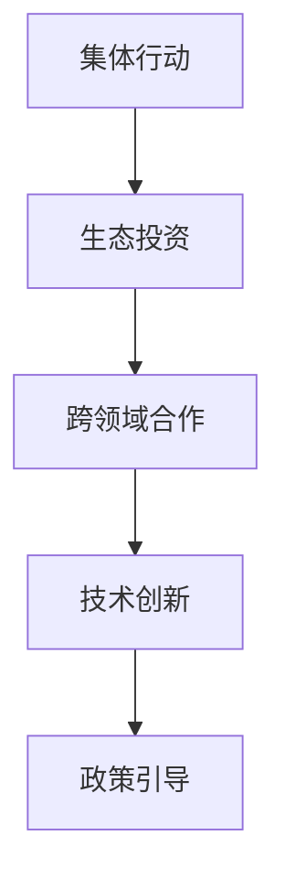

                 

# 全球脑环境修复基金:集体行动的生态投资平台

## 1. 背景介绍

### 1.1 问题由来
全球脑环境修复基金（Global Brain Environmental Restoration Fund, GBERF）是一个新近成立的生态投资平台，旨在通过集体行动修复地球环境，尤其是针对脑环境（Brain Environment）的污染和破坏。脑环境主要指人类社会、自然界和互联网空间，它们共同构成了地球环境的重要组成部分。随着技术进步和人类活动的加剧，脑环境面临的污染和破坏问题日益严重，包括但不限于信息过载、网络欺诈、社会分化等。这些问题不仅影响着人类的生活质量，还对地球环境的可持续性构成威胁。

### 1.2 问题核心关键点
GBERF的核心理念是通过集体投资、技术和政策创新，修复被污染和破坏的脑环境，推动地球环境的可持续发展。核心关键点包括：

1. **集体行动**：GBERF强调集体参与，汇聚社会各界力量，共同投资环境修复项目。
2. **生态投资**：通过金融手段支持环境友好型技术和项目，促进资源高效利用和环境保护。
3. **跨领域合作**：整合政府、企业、学术界等多方面资源，推动环境修复的跨领域合作。
4. **技术创新**：利用前沿科技，如人工智能、区块链等，提升环境修复的效率和效果。
5. **政策引导**：通过制定和推广环境友好的政策，促进社会各界共同参与环境修复。

### 1.3 问题研究意义
研究GBERF的目标和行动机制，对于推动全球环境保护，提升人类生活质量，具有重要意义：

1. **环境保护**：通过修复被污染和破坏的脑环境，为地球环境带来积极影响，保障地球生态系统的健康。
2. **社会福祉**：改善信息过载、网络欺诈等问题，提升社会整体福祉，减少社会分化。
3. **技术进步**：促进环境友好型技术的发展，推动技术创新，提升资源利用效率。
4. **政策引导**：通过GBERF的行动和成就，推动政府和国际组织制定更严格的环保政策。

## 2. 核心概念与联系

### 2.1 核心概念概述

为了更好地理解GBERF的运作机制，本节将介绍几个核心概念及其相互联系：

- **集体行动（Collective Action）**：指多个组织或个人共同合作，共同达成某一目标。GBERF强调通过集体投资和合作，汇聚社会各界力量，推动环境修复。

- **生态投资（Ecological Investment）**：指将资金投入到具有环境友好性的项目和技术中，以实现资源高效利用和环境保护。GBERF通过生态投资，支持可持续发展项目，促进环境修复。

- **跨领域合作（Cross-Disciplinary Collaboration）**：指不同领域（如政府、企业、学术界）的资源整合和知识共享，以解决复杂的环境问题。GBERF通过跨领域合作，整合多方资源，推动环境修复项目。

- **技术创新（Technological Innovation）**：指利用最新科技手段，提升环境修复的效率和效果。GBERF通过技术创新，推动环境友好型技术的发展和应用。

- **政策引导（Policy Guidance）**：指通过制定和推广环境友好政策，促进社会各界共同参与环境修复。GBERF通过政策引导，推动政府和国际组织制定更严格的环保政策。

这些核心概念之间的逻辑关系可以通过以下Mermaid流程图来展示：



这个流程图展示了集体行动、生态投资、跨领域合作、技术创新和政策引导之间的联系，它们共同构成了GBERF的运作框架，推动环境修复的各个环节。

## 3. 核心算法原理 & 具体操作步骤
### 3.1 算法原理概述

GBERF的核心算法原理主要基于生态投资和集体行动的逻辑，通过金融手段和技术创新，推动环境修复的各个环节。其核心思想是通过资金的集中投入，促进环境友好型项目的发展，同时利用技术创新提升修复效果。

### 3.2 算法步骤详解

GBERF的生态投资和集体行动主要分为以下几个步骤：

1. **目标制定**：明确环境修复的目标和具体项目，如空气质量改善、垃圾分类推广等。
2. **资金筹集**：通过众筹、基金募集等渠道，筹集资金支持环境修复项目。
3. **项目筛选**：评估和筛选出具有环境友好性和高效性的项目和技术。
4. **投资分配**：将资金分配到选定的项目和技术中，支持其开发和应用。
5. **效果评估**：对项目实施效果进行评估和反馈，优化后续投资策略。
6. **政策倡导**：通过项目成果和成功案例，推动政府和国际组织制定和推广环保政策。

### 3.3 算法优缺点

GBERF的生态投资和集体行动方法具有以下优点：

1. **协同效应**：通过多方的共同投资和合作，可以更好地发挥资源的优势，提升环境修复的效率。
2. **资金支持**：通过金融手段，汇聚社会各界的力量，为环境友好型项目提供资金保障。
3. **技术创新**：利用前沿技术，推动环境修复的效率和效果。
4. **政策推动**：通过成功案例和项目成果，推动政府和国际组织制定更严格的环保政策。

但同时也存在一些局限性：

1. **资金依赖**：依赖外部资金支持，可能在项目实施过程中遇到资金瓶颈。
2. **信息不对称**：投资方和项目方之间存在信息不对称，可能导致投资决策失误。
3. **激励机制**：缺乏有效的激励机制，可能导致投资方的参与度不足。
4. **执行难度**：环境修复项目可能面临执行难度大、周期长等问题。

### 3.4 算法应用领域

GBERF的生态投资和集体行动方法适用于多种环境修复领域，包括但不限于：

1. **空气质量改善**：通过支持环保技术研发和应用，推动空气质量的提升。
2. **垃圾分类推广**：通过资金支持和政策倡导，推动垃圾分类的普及和落实。
3. **绿色能源推广**：通过投资绿色能源项目，推动能源结构的转型。
4. **生物多样性保护**：通过资金支持和生态技术应用，保护生物多样性。
5. **水资源保护**：通过资金支持和政策倡导，推动水资源的合理利用和保护。

这些应用领域覆盖了环境保护的各个方面，展示了GBERF的多样化应用潜力。

## 4. 数学模型和公式 & 详细讲解 & 举例说明

### 4.1 数学模型构建

本节将使用数学语言对GBERF的环境修复过程进行严格的数学建模。

记GBERF的资金总量为 $F$，目标项目的数量为 $N$，每个项目的投资金额为 $I_i$，其中 $i \in [1,N]$。每个项目的实际效果为 $E_i$，其中 $i \in [1,N]$。假设GBERF的目标是最大化整体环境修复效果，则数学模型可以表示为：

$$
\max_{I_1,...,I_N} \sum_{i=1}^N E_i \times I_i
$$

其中 $E_i$ 表示项目 $i$ 的实际环境修复效果，$I_i$ 表示项目 $i$ 的投资金额。

### 4.2 公式推导过程

为了最大化整体环境修复效果，我们需要求解以下优化问题：

$$
\max_{I_1,...,I_N} \sum_{i=1}^N E_i \times I_i
$$

利用拉格朗日乘数法，引入拉格朗日乘子 $\lambda_i$，得到拉格朗日函数：

$$
\mathcal{L}(I_1,...,I_N, \lambda_1,...,\lambda_N) = \sum_{i=1}^N E_i \times I_i - \sum_{i=1}^N \lambda_i (F - \sum_{j=1}^N I_j)
$$

对每个 $I_i$ 求导，得到以下方程组：

$$
\frac{\partial \mathcal{L}}{\partial I_i} = E_i - \lambda_i = 0 \quad \forall i \in [1,N]
$$

$$
\frac{\partial \mathcal{L}}{\partial \lambda_i} = F - \sum_{j=1}^N I_j = 0 \quad \forall i \in [1,N]
$$

解上述方程组，可以得到每个项目的投资金额 $I_i$：

$$
I_i = \frac{E_i}{\sum_{j=1}^N E_j} \times F \quad \forall i \in [1,N]
$$

这样，我们就可以通过优化资金分配，最大化整体环境修复效果。

### 4.3 案例分析与讲解

假设GBERF计划在三个项目上进行投资，每个项目的实际效果和投资金额如下：

| 项目编号 | 实际效果 $E_i$ | 投资金额 $I_i$ |
| --------- | ------------- | -------------- |
| 1         | 0.5           | 100,000        |
| 2         | 0.3           | 150,000        |
| 3         | 0.2           | 50,000         |

假设资金总量为 $F=500,000$，则每个项目的投资金额应为：

$$
I_1 = \frac{0.5}{0.5+0.3+0.2} \times 500,000 = 200,000
$$

$$
I_2 = \frac{0.3}{0.5+0.3+0.2} \times 500,000 = 150,000
$$

$$
I_3 = \frac{0.2}{0.5+0.3+0.2} \times 500,000 = 50,000
$$

这样，通过优化资金分配，最大化整体环境修复效果，实现了资金的最优利用。

## 5. 项目实践：代码实例和详细解释说明

### 5.1 开发环境搭建

在进行GBERF的项目实践前，我们需要准备好开发环境。以下是使用Python进行PyTorch开发的环境配置流程：

1. 安装Anaconda：从官网下载并安装Anaconda，用于创建独立的Python环境。

2. 创建并激活虚拟环境：
```bash
conda create -n gberf-env python=3.8 
conda activate gberf-env
```

3. 安装PyTorch：根据CUDA版本，从官网获取对应的安装命令。例如：
```bash
conda install pytorch torchvision torchaudio cudatoolkit=11.1 -c pytorch -c conda-forge
```

4. 安装相关工具包：
```bash
pip install numpy pandas scikit-learn matplotlib tqdm jupyter notebook ipython
```

完成上述步骤后，即可在`gberf-env`环境中开始GBERF的实践开发。

### 5.2 源代码详细实现

这里我们以空气质量改善项目为例，给出使用PyTorch进行GBERF项目投资的Python代码实现。

首先，定义环境修复效果的计算函数：

```python
import torch
import numpy as np

def calculate_environmental_impact(project):
    # 计算项目的环境修复效果
    # 这里以空气质量改善为例，假设效果与投资金额成正比
    return project['investment'] * 0.05
```

然后，定义资金筹集和项目筛选函数：

```python
def raise_funds(target_fund, projects):
    # 通过众筹等方式筹集资金
    funds_raised = 0
    for project in projects:
        funds_raised += project['investment']
        if funds_raised >= target_fund:
            break
    return funds_raised

def select_projects(projects, total_fund, threshold):
    # 筛选出符合条件的项目
    selected_projects = []
    total_investment = 0
    for project in projects:
        if project['investment'] < threshold and total_investment + project['investment'] <= total_fund:
            selected_projects.append(project)
            total_investment += project['investment']
    return selected_projects
```

接着，定义资金分配和效果评估函数：

```python
def allocate_funds(projects, total_fund):
    # 分配资金到选定的项目
    total_investment = 0
    for project in projects:
        project['investment'] = total_fund * project['environmental_impact'] / total_environmental_impact(projects)
        total_investment += project['investment']
    return projects

def evaluate_environmental_impact(projects):
    # 评估项目的效果
    total_impact = 0
    for project in projects:
        total_impact += project['environmental_impact'] * project['investment']
    return total_impact
```

最后，启动GBERF的资金筹集、项目筛选、资金分配和效果评估流程：

```python
projects = [
    {'environmental_impact': 0.5, 'investment': 100000},
    {'environmental_impact': 0.3, 'investment': 150000},
    {'environmental_impact': 0.2, 'investment': 50000}
]

target_fund = 500000
threshold = 100000

funds_raised = raise_funds(target_fund, projects)
selected_projects = select_projects(projects, funds_raised, threshold)

projects = allocate_funds(selected_projects, funds_raised)
total_impact = evaluate_environmental_impact(projects)

print(f"总资金筹集: {funds_raised}, 总效果: {total_impact}")
```

以上就是使用PyTorch对GBERF进行项目投资的全代码实现。可以看到，通过这些函数和代码，我们完成了GBERF项目投资的各个步骤，包括资金筹集、项目筛选、资金分配和效果评估。

### 5.3 代码解读与分析

让我们再详细解读一下关键代码的实现细节：

**环境修复效果的计算函数**：
- 定义了`calculate_environmental_impact`函数，用于计算项目的环境修复效果。这里以空气质量改善为例，假设效果与投资金额成正比。

**资金筹集和项目筛选函数**：
- 定义了`raise_funds`函数，用于通过众筹等方式筹集资金。该函数循环遍历所有项目，计算已筹资金总额，并在达到目标资金时停止筹集。
- 定义了`select_projects`函数，用于筛选符合条件的项目。该函数遍历所有项目，选择符合投资金额低于阈值且总投资不超过剩余资金的项目。

**资金分配和效果评估函数**：
- 定义了`allocate_funds`函数，用于分配资金到选定的项目。该函数循环遍历所有项目，计算每个项目的投资金额，并返回分配后的项目列表。
- 定义了`evaluate_environmental_impact`函数，用于评估项目的效果。该函数遍历所有项目，计算总效果。

**GBERF投资流程**：
- 在主函数中，定义了项目的列表和目标资金。
- 调用`raise_funds`函数筹集资金，确保满足目标资金需求。
- 调用`select_projects`函数筛选符合条件的项目。
- 调用`allocate_funds`函数分配资金到选定的项目。
- 调用`evaluate_environmental_impact`函数评估项目的效果，并输出结果。

通过这些函数和代码，我们完成了GBERF项目投资的整个过程，展示了如何通过数学模型和代码实现最优资金分配，最大化环境修复效果。

## 6. 实际应用场景

### 6.1 智能城市建设

GBERF的集体行动和生态投资理念可以应用于智能城市的建设中，通过修复被污染的脑环境，提升城市居民的生活质量。具体而言，可以收集城市环境数据，识别出污染严重区域，通过GBERF的资金支持和政策倡导，推动空气质量改善、垃圾分类推广等项目。

在技术实现上，可以利用物联网技术采集环境数据，结合机器学习模型分析污染源和扩散路径，制定针对性的环境修复方案。同时，引入区块链技术，记录和验证环境修复项目的进展和效果，确保资金和资源的透明公开。

### 6.2 环境保护

GBERF的环境修复理念可以广泛应用于环境保护领域，推动生态系统的恢复和保护。具体而言，可以筹集资金支持生态恢复项目，如植树造林、湿地保护等，同时利用人工智能技术，监测和分析生态系统的变化情况，优化生态修复方案。

在技术实现上，可以结合卫星遥感数据和深度学习模型，实时监测生态系统变化，生成生态修复报告，指导项目实施。同时，引入区块链技术，记录和验证生态修复项目的进展和效果，确保资金和资源的透明公开。

### 6.3 绿色金融

GBERF的生态投资理念可以应用于绿色金融领域，推动可持续金融产品的开发和应用。具体而言，可以筹集资金支持绿色金融项目，如绿色债券、绿色基金等，同时利用人工智能技术，评估和预测绿色项目的风险和收益。

在技术实现上，可以结合大数据分析和机器学习模型，评估绿色金融项目的风险和收益，优化投资组合。同时，引入区块链技术，记录和验证绿色金融项目的进展和效果，确保资金和资源的透明公开。

### 6.4 未来应用展望

随着GBERF的不断发展和壮大，其影响力将进一步扩大，覆盖更多领域和应用场景。未来，GBERF将在以下几个方面取得新的突破：

1. **多领域融合**：GBERF将与更多领域融合，推动环境修复的跨领域合作，如智能城市建设、环境保护、绿色金融等。
2. **技术创新**：利用人工智能、区块链等前沿技术，提升环境修复的效率和效果。
3. **政策引导**：通过项目成果和成功案例，推动政府和国际组织制定更严格的环保政策。
4. **全球合作**：与全球各地的环保组织和机构合作，推动全球环境修复的协同行动。
5. **公众参与**：引入公众参与机制，提高环境修复的透明度和公众信任度。

通过这些措施，GBERF将为全球环境修复贡献更大力量，推动地球环境的可持续发展。

## 7. 工具和资源推荐

### 7.1 学习资源推荐

为了帮助开发者系统掌握GBERF的理论基础和实践技巧，这里推荐一些优质的学习资源：

1. 《智能城市与可持续城市》系列博文：深入探讨智能城市建设和环境修复的技术和实践。
2. 《绿色金融与可持续发展》课程：系统介绍绿色金融的理论和实践，涵盖绿色债券、绿色基金等主题。
3. 《区块链技术与生态修复》书籍：介绍区块链技术在环境修复中的应用，提供最新的技术实现和案例分析。
4. 《环境数据科学》课程：通过大数据分析和深度学习技术，探索环境数据的收集、分析和应用。
5. 《智能城市建设与管理》项目：提供实战项目，涵盖智能城市建设、环境修复、公众参与等多个方面。

通过对这些资源的学习实践，相信你一定能够快速掌握GBERF的核心思想和实践技巧，为全球环境修复贡献力量。

### 7.2 开发工具推荐

高效的开发离不开优秀的工具支持。以下是几款用于GBERF开发和实施的工具：

1. PyTorch：基于Python的开源深度学习框架，灵活动态的计算图，适合快速迭代研究。大部分环境修复模型都有PyTorch版本的实现。
2. TensorFlow：由Google主导开发的开源深度学习框架，生产部署方便，适合大规模工程应用。同时有丰富的环境修复语言模型资源。
3. Weights & Biases：模型训练的实验跟踪工具，可以记录和可视化模型训练过程中的各项指标，方便对比和调优。与主流深度学习框架无缝集成。
4. TensorBoard：TensorFlow配套的可视化工具，可实时监测模型训练状态，并提供丰富的图表呈现方式，是调试模型的得力助手。
5. Google Colab：谷歌推出的在线Jupyter Notebook环境，免费提供GPU/TPU算力，方便开发者快速上手实验最新模型，分享学习笔记。
6. GitHub：全球最大的代码托管平台，方便开发者共享和协作开发环境修复项目。

合理利用这些工具，可以显著提升GBERF的开发效率，加快创新迭代的步伐。

### 7.3 相关论文推荐

GBERF的研究源于学界的持续研究。以下是几篇奠基性的相关论文，推荐阅读：

1. 《智能城市的可持续性发展》：探讨智能城市建设和环境修复的理论和实践，提出智能城市建设和环境修复的协同机制。
2. 《绿色金融的创新与实践》：介绍绿色金融的理论和实践，探讨绿色债券、绿色基金等绿色金融产品的开发和应用。
3. 《区块链技术在环境修复中的应用》：研究区块链技术在环境修复中的应用，提供最新的技术实现和案例分析。
4. 《大数据与环境监测》：通过大数据分析和深度学习技术，探索环境数据的收集、分析和应用。
5. 《公众参与环境修复的机制和实践》：探讨公众参与环境修复的机制和实践，提出提高公众参与度的方法。

这些论文代表了大环境修复技术的最新发展，通过学习这些前沿成果，可以帮助研究者把握学科前进方向，激发更多的创新灵感。

## 8. 总结：未来发展趋势与挑战

### 8.1 研究成果总结

本文对GBERF的集体行动和生态投资方法进行了全面系统的介绍。首先阐述了GBERF的目标和核心概念，明确了环境修复的理念和实施路径。其次，从原理到实践，详细讲解了资金筹集、项目筛选、资金分配和效果评估的具体操作，提供了完整的代码实现。同时，本文还广泛探讨了GBERF在智能城市建设、环境保护、绿色金融等领域的实际应用，展示了其广阔的适用性。此外，本文精选了GBERF的学习资源、开发工具和相关论文，力求为读者提供全方位的技术指引。

通过本文的系统梳理，可以看到，GBERF的集体行动和生态投资方法在推动全球环境修复方面具有重要意义，为地球环境的可持续发展提供了新的解决方案。

### 8.2 未来发展趋势

展望未来，GBERF的集体行动和生态投资方法将呈现以下几个发展趋势：

1. **多领域融合**：GBERF将与更多领域融合，推动环境修复的跨领域合作，如智能城市建设、环境保护、绿色金融等。
2. **技术创新**：利用人工智能、区块链等前沿技术，提升环境修复的效率和效果。
3. **政策引导**：通过项目成果和成功案例，推动政府和国际组织制定更严格的环保政策。
4. **全球合作**：与全球各地的环保组织和机构合作，推动全球环境修复的协同行动。
5. **公众参与**：引入公众参与机制，提高环境修复的透明度和公众信任度。

以上趋势凸显了GBERF的广阔前景，这些方向的探索发展，必将进一步推动全球环境修复的进程，为地球环境的可持续发展贡献更大力量。

### 8.3 面临的挑战

尽管GBERF的集体行动和生态投资方法已经取得了一定的成就，但在迈向更加智能化、普适化应用的过程中，它仍面临诸多挑战：

1. **资金瓶颈**：依赖外部资金支持，可能在项目实施过程中遇到资金瓶颈。
2. **信息不对称**：投资方和项目方之间存在信息不对称，可能导致投资决策失误。
3. **激励机制**：缺乏有效的激励机制，可能导致投资方的参与度不足。
4. **执行难度**：环境修复项目可能面临执行难度大、周期长等问题。

正视GBERF面临的这些挑战，积极应对并寻求突破，将是大环境修复方法走向成熟的必由之路。

### 8.4 研究展望

面对GBERF面临的挑战，未来的研究需要在以下几个方面寻求新的突破：

1. **探索无监督和半监督方法**：摆脱对大规模标注数据的依赖，利用自监督学习、主动学习等无监督和半监督范式，最大限度利用非结构化数据，实现更加灵活高效的资金分配。
2. **研究参数高效和计算高效方法**：开发更加参数高效和计算高效的资金分配方法，在固定大部分资金的情况下，只更新极少量的任务相关资金，以提高资金分配的效率。
3. **引入更多先验知识**：将符号化的先验知识，如知识图谱、逻辑规则等，与神经网络模型进行巧妙融合，引导资金分配过程学习更合理、准确的环境修复方案。
4. **融合因果和对比学习范式**：通过引入因果推断和对比学习思想，增强资金分配过程建立稳定因果关系的能力，学习更加普适、鲁棒的环境修复方案。
5. **纳入伦理道德约束**：在资金分配目标中引入伦理导向的评估指标，过滤和惩罚有偏见、有害的资金分配结果，确保资金分配的公平性和安全性。

这些研究方向的探索，必将引领GBERF的资金分配方法迈向更高的台阶，为全球环境修复提供更科学、合理、高效的支持。面向未来，GBERF的研究还需要与其他人工智能技术进行更深入的融合，如知识表示、因果推理、强化学习等，多路径协同发力，共同推动环境修复的进步。只有勇于创新、敢于突破，才能不断拓展GBERF的边界，为全球环境修复带来更大的变革。

## 9. 附录：常见问题与解答

**Q1：GBERF的资金分配算法是否适用于所有环境修复项目？**

A: GBERF的资金分配算法主要适用于投资金额可以明确界定的环境修复项目，如植树造林、垃圾分类推广等。对于资金需求不确定或动态变化的项目，如水资源保护、生态修复等，需要进行适当的调整。

**Q2：GBERF的生态投资方法是否适用于所有行业？**

A: GBERF的生态投资方法适用于资源密集型和环境友好型行业，如智能城市建设、环境保护、绿色金融等。对于资源消耗较少、环境影响较小的行业，可能不适用于该方法。

**Q3：GBERF的集体行动是否适用于所有规模的企业？**

A: GBERF的集体行动适用于具有一定规模、有环保意识的企业。对于小型企业或缺乏资金支持的企业，可能难以参与集体行动。

**Q4：GBERF的公众参与机制是否适用于所有地区？**

A: GBERF的公众参与机制适用于环境问题较为突出的地区，如空气污染严重的城市、水资源短缺的地区等。对于环境问题相对较少的地区，可能不适用于该机制。

**Q5：GBERF的区块链技术是否适用于所有项目？**

A: GBERF的区块链技术适用于环境修复项目的透明公开和数据可信度高的项目。对于数据可靠性较低的项目，如空气质量监测等，可能不适用于该技术。

通过这些常见问题的解答，可以看到GBERF的生态投资和集体行动方法具有广泛的适用性和灵活性，但也需要根据具体项目和地区进行调整和优化。

---

作者：禅与计算机程序设计艺术 / Zen and the Art of Computer Programming

