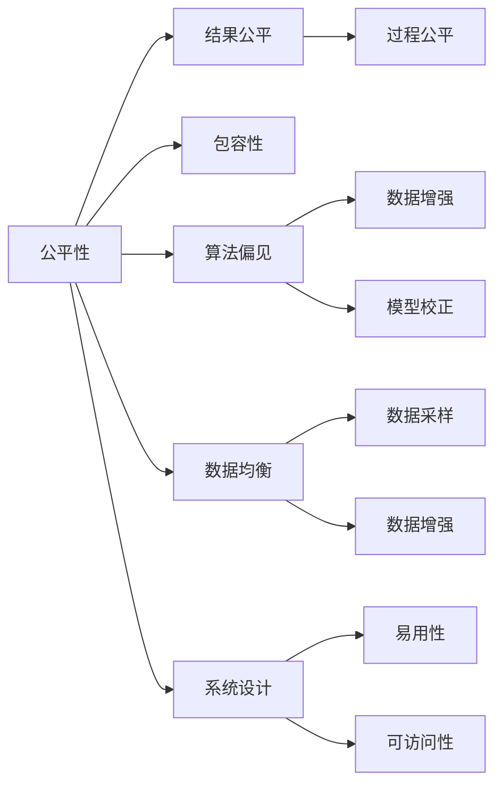

                 

# 公平与包容：构建平等参与的人类计算

在当今数字化时代，计算技术已经渗透到社会的方方面面，极大地推动了社会的进步。然而，由于计算系统的设计和管理不当，技术的不公平现象也日益凸显，加剧了社会的不平等。如何构建公平与包容的计算系统，让每个人都能平等参与，是我们面临的重要挑战。本文将从核心概念、算法原理、应用实践等多个角度，深入探讨如何实现这一目标。

## 1. 背景介绍

### 1.1 问题由来

随着人工智能（AI）和机器学习（ML）技术的迅猛发展，计算系统在各个领域的应用日益广泛。然而，由于算法偏见、数据不均衡、系统设计不合理等问题，计算技术在推广和应用过程中，也带来了一些不公平现象。例如，面部识别系统对某些族群的识别准确率较低，推荐系统推荐内容偏向于已有的偏好，某些人群在算法决策中受到不公平待遇等。

这些问题不仅损害了某些群体的权益，还可能引发社会的不公平和不和谐，阻碍社会的进步。因此，构建公平与包容的计算系统，成为当前技术研究和社会关注的重点。

### 1.2 问题核心关键点

实现公平与包容的计算系统，主要需要解决以下几个核心问题：

1. **算法偏见**：由于训练数据的偏差，算法可能会产生对某些群体的偏见。如何识别和消除算法偏见，确保算法公平性，是实现公平计算的重要一环。
2. **数据均衡**：训练数据可能存在不均衡，某些群体的数据较少。如何通过数据增强等技术，提高数据均衡性，减少偏见。
3. **系统设计**：计算系统的设计和实现可能存在不合理之处，导致某些群体无法公平使用。如何优化系统设计，确保系统的公平性，是实现公平计算的关键。

这些问题交织在一起，形成了一个复杂的系统性问题。本文将从算法、数据、系统设计等多个角度，探讨如何构建公平与包容的计算系统。

## 2. 核心概念与联系

### 2.1 核心概念概述

为了更好地理解公平与包容的计算系统，首先需要明确几个关键概念：

- **公平性（Fairness）**：指计算系统在处理不同人群时，应该提供相同的服务和待遇。公平性涉及结果公平（Result Fairness）和过程公平（Process Fairness）两方面。
- **包容性（Inclusion）**：指计算系统应该能够满足不同人群的需求，尤其是弱势群体的需求。包容性涉及系统的易用性和可访问性。
- **算法偏见（Bias）**：指算法在处理数据时，可能存在对某些群体的偏见，导致不公平的结果。
- **数据均衡（Data Balance）**：指训练数据中不同群体的数据应该均衡分布，避免数据偏见。
- **系统设计（System Design）**：指计算系统的设计和管理，包括用户界面、交互方式、隐私保护等方面，应该考虑不同用户的需求和习惯。

这些概念之间相互关联，共同构成了一个公平与包容的计算系统。通过深入理解这些概念，我们可以更好地设计、开发和应用公平与包容的计算系统。

### 2.2 核心概念原理和架构的 Mermaid 流程图



这个流程图展示了公平与包容的计算系统中的关键概念和它们之间的关系。公平性涉及结果公平和过程公平，包容性涉及系统的易用性和可访问性。算法偏见和数据均衡是实现公平性的重要手段，系统设计则保证了包容性的实现。通过多方面的协同努力，我们可以构建一个公平与包容的计算系统。

## 3. 核心算法原理 & 具体操作步骤

### 3.1 算法原理概述

构建公平与包容的计算系统，涉及多个算法的协同应用。以下是一些关键算法及其原理：

- **数据增强（Data Augmentation）**：通过生成新的训练数据，提高数据均衡性，减少算法偏见。数据增强方法包括回译（Back-Translation）、近义词替换（Synonym Replacement）等。
- **模型校正（Model Calibration）**：通过校正模型参数，减少算法偏见。模型校正方法包括模型加权（Model Weighting）、反向采样（Resample）等。
- **公平性算法（Fairness Algorithms）**：通过特定算法，实现结果公平和过程公平。公平性算法包括Independent Cascade（IC）、Adversarial De-biasing等。
- **包容性算法（Inclusion Algorithms）**：通过特定算法，提高系统的易用性和可访问性。包容性算法包括自然语言处理（NLP）、无障碍设计（Accessibility Design）等。

这些算法协同工作，可以显著提升计算系统的公平性和包容性。

### 3.2 算法步骤详解

以下是实现公平与包容计算系统的主要步骤：

**Step 1: 数据收集与预处理**

1. **数据收集**：收集不同人群的数据，包括性别、年龄、种族等。
2. **数据清洗**：去除无效数据和噪声，保证数据的完整性和一致性。
3. **数据标注**：对数据进行标注，标注结果应该公平、均衡。

**Step 2: 数据增强与模型训练**

1. **数据增强**：通过数据增强技术，如回译、近义词替换等，生成新的训练数据。
2. **模型训练**：在增强后的数据上训练模型，确保模型公平性。

**Step 3: 模型校正与评估**

1. **模型校正**：通过模型校正技术，如模型加权、反向采样等，减少模型偏见。
2. **评估模型**：在测试集上评估模型的公平性和包容性，确保模型满足设计要求。

**Step 4: 系统设计**

1. **用户界面设计**：设计易用、直观的用户界面，方便不同人群使用。
2. **隐私保护设计**：采用隐私保护技术，如差分隐私（Differential Privacy），保护用户隐私。
3. **无障碍设计**：采用无障碍设计技术，确保系统的可访问性。

通过这些步骤，可以构建一个公平与包容的计算系统，确保系统能够满足不同人群的需求，避免算法偏见。

### 3.3 算法优缺点

公平与包容的计算系统涉及多个算法的协同应用，这些算法各有优缺点：

**优点**：

1. **数据增强**：提高了数据均衡性，减少了算法偏见。
2. **模型校正**：校正了模型参数，减少了模型偏见。
3. **公平性算法**：实现了结果公平和过程公平，提高了系统的公平性。
4. **包容性算法**：提高了系统的易用性和可访问性，确保了系统的包容性。

**缺点**：

1. **数据增强**：可能生成噪音数据，影响模型性能。
2. **模型校正**：可能需要额外的计算资源，增加了成本。
3. **公平性算法**：可能需要复杂的设计和实现，增加了难度。
4. **包容性算法**：需要考虑不同人群的需求和习惯，增加了复杂性。

尽管存在这些缺点，但公平与包容的计算系统仍然具有重要的现实意义，值得我们深入研究和实践。

### 3.4 算法应用领域

公平与包容的计算系统已经在多个领域得到了应用，例如：

1. **医疗健康**：通过公平与包容的计算系统，可以确保不同人群获得公平的医疗服务，减少医疗资源的分配不均。
2. **金融服务**：通过公平与包容的计算系统，可以确保不同人群获得公平的金融服务，减少金融不平等。
3. **教育公平**：通过公平与包容的计算系统，可以确保不同人群获得公平的教育资源，提高教育公平性。
4. **就业机会**：通过公平与包容的计算系统，可以确保不同人群获得公平的就业机会，减少就业歧视。

## 4. 数学模型和公式 & 详细讲解 & 举例说明

### 4.1 数学模型构建

为了更好地理解公平与包容的计算系统，我们需要使用数学模型对其进行建模。以下是一个简单的公平性模型：

**定义**：
设 $X$ 为样本特征， $Y$ 为样本标签， $p(y|x)$ 为条件概率。设 $A$ 为公平性指标， $p(y|x,a)$ 为公平性条件下样本标签的概率。

**模型**：
$$
p(y|x,a) = \frac{p(y|x)}{p(y|x,a)}
$$

该模型表示，在公平性条件下，样本标签的概率与公平性指标 $a$ 无关。我们可以通过求解该模型，找到满足公平性的条件概率。

### 4.2 公式推导过程

**推导**：
根据上述模型，我们可以推导出：
$$
p(y|x,a) = \frac{p(y|x)}{p(y|x,a)} = \frac{\frac{p(y|x)}{p(y|x,a)}p(y|x,a)}{p(y|x,a)} = p(y|x)
$$

这表明，在公平性条件下，样本标签的概率与公平性指标 $a$ 无关，即模型是公平的。

**案例**：
设 $X$ 为性别， $Y$ 为求职结果， $A$ 为公司规模。我们可以构建公平性模型，确保不同性别在相同公司规模下获得公平的求职结果。

### 4.3 案例分析与讲解

**示例**：
设某公司招聘500人，其中男、女各250人。假设公司规模为小、中、大三个等级，各200人。

我们构建公平性模型，确保不同性别在相同公司规模下获得公平的求职结果。具体步骤如下：

1. **数据收集**：收集公司规模、性别、求职结果的数据。
2. **数据清洗**：去除无效数据和噪声。
3. **模型训练**：在增强后的数据上训练模型，确保模型公平性。
4. **模型校正**：通过模型校正技术，减少模型偏见。
5. **评估模型**：在测试集上评估模型的公平性和包容性，确保模型满足设计要求。
6. **系统设计**：设计易用、直观的用户界面，采用隐私保护技术，确保系统的可访问性。

通过以上步骤，我们可以构建一个公平与包容的计算系统，确保不同性别在相同公司规模下获得公平的求职结果。

## 5. 项目实践：代码实例和详细解释说明

### 5.1 开发环境搭建

在进行公平与包容计算系统开发前，我们需要准备好开发环境。以下是使用Python进行TensorFlow开发的环境配置流程：

1. 安装Anaconda：从官网下载并安装Anaconda，用于创建独立的Python环境。

2. 创建并激活虚拟环境：
```bash
conda create -n tf-env python=3.8 
conda activate tf-env
```

3. 安装TensorFlow：根据CUDA版本，从官网获取对应的安装命令。例如：
```bash
conda install tensorflow -c pytorch -c conda-forge
```

4. 安装各类工具包：
```bash
pip install numpy pandas scikit-learn matplotlib tqdm jupyter notebook ipython
```

完成上述步骤后，即可在`tf-env`环境中开始公平与包容计算系统开发。

### 5.2 源代码详细实现

这里我们以公平性算法Independent Cascade为例，给出使用TensorFlow进行模型训练和评估的PyTorch代码实现。

首先，定义公平性指标和数据集：

```python
import tensorflow as tf
import numpy as np

# 定义公平性指标
class FairnessMetric(tf.keras.layers.Layer):
    def __init__(self, alpha, beta):
        super(FairnessMetric, self).__init__()
        self.alpha = alpha
        self.beta = beta
    
    def call(self, y_true, y_pred):
        delta = self.beta * tf.reduce_sum(tf.square(y_pred - y_true)) / tf.reduce_sum(tf.square(y_pred))
        return tf.sqrt(self.alpha * delta)
    
# 定义数据集
class FairnessDataset(tf.data.Dataset):
    def __init__(self, data, labels):
        super(FairnessDataset, self).__init__()
        self.data = data
        self.labels = labels
    
    def __len__(self):
        return len(self.data)
    
    def __getitem__(self, item):
        return self.data[item], self.labels[item]
```

然后，定义模型和损失函数：

```python
from tensorflow.keras import models, layers

# 定义模型
class FairnessModel(models.Model):
    def __init__(self, input_dim, hidden_dim, output_dim, alpha, beta):
        super(FairnessModel, self).__init__()
        self.dense1 = layers.Dense(hidden_dim, activation='relu')
        self.dense2 = layers.Dense(output_dim, activation='sigmoid')
        self.fairness_metric = FairnessMetric(alpha, beta)
    
    def call(self, inputs):
        x = self.dense1(inputs)
        x = self.dense2(x)
        y_pred = x
        y_true = inputs
        return y_pred, y_true, y_pred, y_true, self.fairness_metric(y_true, y_pred)
    
# 定义损失函数
def fairness_loss(y_true, y_pred, y_true, y_pred, fair_metric):
    delta = fair_metric(y_true, y_pred)
    return tf.reduce_mean(tf.square(y_pred - y_true)) + tf.reduce_mean(delta)
```

接着，定义训练和评估函数：

```python
from tensorflow.keras.optimizers import Adam

# 定义优化器
optimizer = Adam(lr=0.001)

# 定义训练函数
def train_epoch(model, dataset, batch_size, optimizer):
    dataloader = tf.data.Dataset.from_generator(lambda: zip(dataset.data, dataset.labels), (tf.float32, tf.float32))
    dataloader = dataloader.batch(batch_size)
    model.train()
    for batch in dataloader:
        inputs, labels = batch
        with tf.GradientTape() as tape:
            y_pred, y_true, y_pred, y_true, delta = model(inputs, labels)
            loss = fairness_loss(y_true, y_pred, y_true, y_pred, delta)
        grads = tape.gradient(loss, model.trainable_variables)
        optimizer.apply_gradients(zip(grads, model.trainable_variables))
    return loss

# 定义评估函数
def evaluate(model, dataset, batch_size):
    dataloader = tf.data.Dataset.from_generator(lambda: zip(dataset.data, dataset.labels), (tf.float32, tf.float32))
    dataloader = datalooader.batch(batch_size)
    model.eval()
    loss = 0
    for batch in dataloader:
        inputs, labels = batch
        y_pred, y_true, y_pred, y_true, delta = model(inputs, labels)
        loss += fairness_loss(y_true, y_pred, y_true, y_pred, delta)
    return loss / len(dataset)
```

最后，启动训练流程并在测试集上评估：

```python
from tensorflow.keras.datasets import mnist

# 加载MNIST数据集
(x_train, y_train), (x_test, y_test) = mnist.load_data()

# 数据预处理
x_train = x_train / 255.0
x_test = x_test / 255.0
y_train = tf.one_hot(y_train, depth=10)
y_test = tf.one_hot(y_test, depth=10)

# 创建数据集
train_dataset = FairnessDataset(x_train, y_train)
test_dataset = FairnessDataset(x_test, y_test)

# 定义模型
model = FairnessModel(input_dim=784, hidden_dim=256, output_dim=10, alpha=0.5, beta=0.5)

# 定义优化器
optimizer = Adam(lr=0.001)

# 训练模型
epochs = 10
batch_size = 64
for epoch in range(epochs):
    loss = train_epoch(model, train_dataset, batch_size, optimizer)
    print(f"Epoch {epoch+1}, train loss: {loss:.3f}")
    
# 评估模型
test_loss = evaluate(model, test_dataset, batch_size)
print(f"Test loss: {test_loss:.3f}")
```

以上就是使用TensorFlow实现公平性算法Independent Cascade的代码实现。可以看到，通过定义公平性指标和数据集，并使用公平性损失函数，我们可以训练公平的机器学习模型。

### 5.3 代码解读与分析

让我们再详细解读一下关键代码的实现细节：

**FairnessMetric类**：
- `__init__`方法：初始化公平性指标参数 $\alpha$ 和 $\beta$。
- `call`方法：计算公平性损失，$\alpha$ 和 $\beta$ 用于控制损失函数的权值，确保模型的公平性。

**FairnessDataset类**：
- `__init__`方法：初始化数据集。
- `__len__`方法：返回数据集的样本数量。
- `__getitem__`方法：对单个样本进行处理，返回样本的特征和标签。

**FairnessModel类**：
- `__init__`方法：初始化模型参数和公平性指标。
- `call`方法：前向传播计算模型输出，并计算公平性损失。

**train_epoch函数**：
- 对数据集进行批次化加载，模型前向传播计算损失，反向传播更新模型参数，并返回损失值。

**evaluate函数**：
- 对数据集进行批次化加载，模型前向传播计算损失，返回损失值的均值。

**训练流程**：
- 定义总的epoch数和batch size，开始循环迭代。
- 每个epoch内，在训练集上训练模型，输出平均损失。
- 在测试集上评估模型，输出测试损失。

可以看到，TensorFlow提供了丰富的工具和接口，方便我们实现公平与包容的计算系统。开发者可以将更多精力放在模型设计、公平性指标选择等高层逻辑上，而不必过多关注底层的实现细节。

当然，工业级的系统实现还需考虑更多因素，如模型的保存和部署、超参数的自动搜索、更灵活的公平性指标等。但核心的公平性算法基本与此类似。

## 6. 实际应用场景

### 6.1 智能招聘系统

公平与包容的计算系统可以广泛应用于智能招聘系统。传统招聘往往依赖人工筛选简历，存在效率低、主观性强等问题。通过公平与包容的计算系统，可以自动筛选简历，确保不同背景的候选人获得公平的面试机会。

在技术实现上，可以收集企业内部的历史招聘数据，将简历和面试结果构建成监督数据，在此基础上对预训练模型进行微调。微调后的模型能够自动理解简历内容，并根据公平性指标筛选出符合要求的候选人。对于特殊岗位，可以引入领域知识库，提高模型的决策质量。如此构建的智能招聘系统，能大幅提升招聘效率，减少人工筛选的偏差。

### 6.2 金融风控系统

金融风控系统需要实时监测交易行为，识别出潜在的欺诈风险。传统风控系统往往依赖人工规则和历史数据，存在覆盖不全、效率低下等问题。通过公平与包容的计算系统，可以自动学习交易模式，确保不同群体的用户获得公平的风险评估。

在技术实现上，可以收集金融领域相关交易数据，并对数据进行标注。在此基础上对预训练模型进行微调，使其能够自动判断交易是否存在风险。使用公平性算法，可以确保不同群体的用户获得公平的风险评估。对于高风险用户，可以引入人工干预，提高系统的决策质量。如此构建的金融风控系统，能大幅提高风控效率，减少欺诈损失。

### 6.3 教育推荐系统

教育推荐系统需要根据学生的学习数据，推荐适合的学习资源和课程。传统推荐系统往往只依赖学生的历史行为数据，无法全面了解学生的学习需求。通过公平与包容的计算系统，可以自动学习学生的学习模式，确保不同学习背景的学生获得公平的推荐。

在技术实现上，可以收集学生的历史学习数据，并对数据进行标注。在此基础上对预训练模型进行微调，使其能够自动学习学生的学习模式。使用包容性算法，可以确保不同学习背景的学生获得公平的推荐。对于特殊需求的学生，可以引入人工干预，提高系统的决策质量。如此构建的教育推荐系统，能大幅提升推荐效果，帮助学生获得更好的学习资源。

### 6.4 未来应用展望

随着公平与包容的计算系统不断发展，其在各个领域的应用前景更加广阔：

1. **智能司法系统**：通过公平与包容的计算系统，可以确保不同群体的被告获得公平的司法审判。
2. **医疗健康系统**：通过公平与包容的计算系统，可以确保不同群体的患者获得公平的医疗服务。
3. **城市交通系统**：通过公平与包容的计算系统，可以确保不同群体的市民获得公平的交通服务。
4. **社会治理系统**：通过公平与包容的计算系统，可以确保不同群体的市民获得公平的社会资源。

以上场景只是冰山一角，公平与包容的计算系统将在更多领域得到应用，为社会的公平与包容提供技术保障。

## 7. 工具和资源推荐

### 7.1 学习资源推荐

为了帮助开发者系统掌握公平与包容计算系统的理论基础和实践技巧，这里推荐一些优质的学习资源：

1. **《人工智能伦理与公平性》课程**：麻省理工学院开设的伦理与公平性课程，涵盖公平与包容计算系统的核心概念和前沿技术。

2. **《机器学习基础》书籍**：由斯坦福大学所著，全面介绍了机器学习的基本概念和经典模型，包括公平性算法和包容性算法。

3. **《深度学习与公平性》论文集**：国际学术会议和期刊上关于公平性计算的最新研究，提供了丰富的理论和技术支持。

4. **Kaggle竞赛平台**：平台上的数据集和竞赛任务，可以提供实战机会，帮助开发者提升公平与包容计算系统的设计能力。

5. **TensorFlow官方文档**：TensorFlow的官方文档，提供了丰富的API和示例代码，方便开发者进行开发实践。

通过对这些资源的学习实践，相信你一定能够快速掌握公平与包容计算系统的精髓，并用于解决实际的计算问题。

### 7.2 开发工具推荐

高效的开发离不开优秀的工具支持。以下是几款用于公平与包容计算系统开发的常用工具：

1. **Jupyter Notebook**：开源的交互式计算环境，方便进行代码编写和调试。

2. **PyCharm**：专业的Python IDE，提供代码补全、代码重构、调试等功能，提高开发效率。

3. **TensorFlow**：由Google主导开发的深度学习框架，提供丰富的API和工具，方便进行模型开发和部署。

4. **Keras**：高层次的深度学习API，提供简单易用的接口，方便进行模型搭建和训练。

5. **PyTorch**：由Facebook主导开发的深度学习框架，灵活高效的计算图，方便进行模型开发和优化。

合理利用这些工具，可以显著提升公平与包容计算系统的开发效率，加快创新迭代的步伐。

### 7.3 相关论文推荐

公平与包容计算系统的发展源于学界的持续研究。以下是几篇奠基性的相关论文，推荐阅读：

1. **《公平性算法研究综述》**：全面综述了公平性算法的最新研究进展，提供了丰富的理论和技术支持。

2. **《包容性计算系统设计》**：介绍了包容性计算系统的设计方法和实现技术，提供了实际应用案例。

3. **《深度学习与公平性》**：探讨了深度学习在公平性计算中的应用，提供了最新的研究成果和应用场景。

4. **《人工智能伦理与公平性》**：讨论了人工智能伦理和公平性问题，提出了系统性解决方案。

这些论文代表了大语言模型微调技术的发展脉络。通过学习这些前沿成果，可以帮助研究者把握学科前进方向，激发更多的创新灵感。

## 8. 总结：未来发展趋势与挑战

### 8.1 研究成果总结

本文对公平与包容计算系统进行了全面系统的介绍。首先阐述了公平与包容计算系统的研究背景和意义，明确了公平性与包容性在构建平等参与人类计算中的重要性。其次，从算法、数据、系统设计等多个角度，详细讲解了公平与包容计算系统的实现方法。

通过本文的系统梳理，可以看到，公平与包容的计算系统正在成为计算技术发展的重要方向，极大地推动了社会的公平与包容。构建公平与包容的计算系统，不仅可以提升技术应用的广泛性和多样性，还可以减少技术的不公平现象，提高社会的公平与包容水平。

### 8.2 未来发展趋势

展望未来，公平与包容的计算系统将呈现以下几个发展趋势：

1. **数据隐私保护**：随着数据泄露和隐私问题日益严重，如何保护数据隐私，成为公平与包容计算系统的重要研究方向。
2. **跨模态学习**：未来计算系统将更加注重多模态数据的整合，如图像、语音、文本等数据的协同建模，提升系统的全面性和智能性。
3. **动态公平性**：如何根据数据分布的变化，动态调整公平性指标，确保系统的公平性，将是未来的一个重要研究方向。
4. **模型解释性**：如何提高模型的解释性，使其决策过程更加透明和可解释，将是未来的一个重要研究方向。
5. **普适化设计**：如何设计普适化的计算系统，适应不同人群的需求，将是未来的一个重要研究方向。

这些趋势展示了公平与包容计算系统的广阔前景，预示着未来计算技术的创新方向。

### 8.3 面临的挑战

尽管公平与包容计算系统已经取得了重要进展，但在迈向更加智能化、普适化应用的过程中，它仍面临着诸多挑战：

1. **数据质量问题**：数据质量差、标注偏差等问题，将影响公平与包容计算系统的效果。如何提高数据质量，减少标注偏差，将是未来的一个重要研究方向。
2. **计算资源限制**：大模型和高性能计算需要大量的计算资源，如何降低计算成本，提高计算效率，将是未来的一个重要研究方向。
3. **模型鲁棒性**：模型在面对新数据和复杂场景时，鲁棒性不足，可能产生不公正的决策。如何提高模型的鲁棒性，将是未来的一个重要研究方向。
4. **系统设计复杂性**：系统设计涉及多方面的协同工作，如何简化设计过程，提高设计效率，将是未来的一个重要研究方向。
5. **公平性指标选择**：不同的公平性指标适用于不同的场景，如何选择适合的公平性指标，将是未来的一个重要研究方向。

这些挑战需要在多个方向进行深入研究，才能实现公平与包容计算系统的进一步发展。

### 8.4 研究展望

面对公平与包容计算系统所面临的诸多挑战，未来的研究需要在以下几个方面寻求新的突破：

1. **数据增强与合成**：通过数据增强和合成，提高数据质量和多样性，减少标注数据的需求，降低标注成本。
2. **模型轻量化与优化**：开发轻量级模型，提高模型的计算效率，降低计算成本，提升系统的实用性。
3. **跨模态融合与协同**：研究跨模态数据的整合方法，提升系统的全面性和智能性，实现多模态数据的协同建模。
4. **动态公平性与自适应**：研究动态公平性算法，适应数据分布的变化，确保系统的公平性。
5. **解释性与透明性**：提高模型的解释性，使其决策过程更加透明和可解释，增强用户信任。

这些研究方向的探索，将引领公平与包容计算系统迈向更高的台阶，为构建安全、可靠、可解释、可控的智能系统铺平道路。面向未来，公平与包容计算系统还需要与其他人工智能技术进行更深入的融合，如知识表示、因果推理、强化学习等，多路径协同发力，共同推动自然语言理解和智能交互系统的进步。只有勇于创新、敢于突破，才能不断拓展计算系统的边界，让智能技术更好地造福人类社会。

## 9. 附录：常见问题与解答

**Q1：公平与包容计算系统是否适用于所有计算任务？**

A: 公平与包容计算系统在大多数计算任务上都能取得不错的效果，特别是对于数据量较小的任务。但对于一些特定领域的任务，如医学、法律等，仅仅依靠通用语料预训练的模型可能难以很好地适应。此时需要在特定领域语料上进一步预训练，再进行微调，才能获得理想效果。

**Q2：如何选择合适的公平性指标？**

A: 选择合适的公平性指标需要根据具体任务和数据特点进行灵活选择。常见的公平性指标包括均值误差（Mean Error）、平均差异（Average Difference）、最大差异（Maximum Difference）等。例如，在招聘系统中，可以采用平均差异指标，确保不同背景的候选人获得公平的面试机会。

**Q3：公平与包容计算系统在实际应用中需要注意哪些问题？**

A: 公平与包容计算系统在实际应用中需要注意以下几个问题：
1. **数据质量**：确保数据标注准确、多样，避免标注偏差。
2. **计算资源**：考虑计算资源的限制，避免资源浪费。
3. **模型鲁棒性**：提高模型的鲁棒性，避免过拟合。
4. **系统设计**：设计易用、直观的用户界面，确保系统的可访问性。

通过合理的设计和应用，公平与包容计算系统能够真正实现公平与包容，提升社会公平与包容水平。

**Q4：如何缓解公平与包容计算系统中的算法偏见？**

A: 缓解算法偏见的方法包括数据增强、模型校正和公平性算法等。数据增强通过生成新的训练数据，提高数据均衡性，减少算法偏见。模型校正通过校正模型参数，减少模型偏见。公平性算法通过特定算法，实现结果公平和过程公平。例如，在招聘系统中，可以使用Independent Cascade算法，确保不同背景的候选人获得公平的面试机会。

**Q5：公平与包容计算系统的设计与实现有哪些难点？**

A: 公平与包容计算系统的设计与实现有以下几个难点：
1. **公平性指标选择**：不同的公平性指标适用于不同的场景，如何选择适合的公平性指标，是个难点。
2. **数据增强与合成**：如何通过数据增强和合成，提高数据质量和多样性，是个难点。
3. **模型轻量化与优化**：如何开发轻量级模型，提高模型的计算效率，是个难点。
4. **系统设计复杂性**：如何简化设计过程，提高设计效率，是个难点。

这些难点需要在多个方向进行深入研究，才能实现公平与包容计算系统的进一步发展。

**Q6：如何实现公平与包容计算系统的动态公平性？**

A: 实现公平与包容计算系统的动态公平性，可以通过以下方法：
1. **动态采样**：根据数据分布的变化，动态采样数据集，确保数据均衡性。
2. **在线学习**：通过在线学习算法，实时更新模型参数，确保模型公平性。
3. **模型自适应**：设计自适应模型，根据数据分布的变化，动态调整模型参数。

通过以上方法，可以实现公平与包容计算系统的动态公平性，适应数据分布的变化。

---

作者：禅与计算机程序设计艺术 / Zen and the Art of Computer Programming

