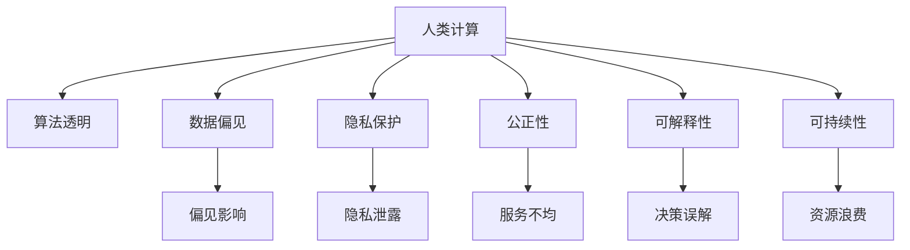

                 

# 公平、公正、可持续：人类计算的伦理

> 关键词：
- 人类计算
- 公平
- 公正
- 伦理
- 可持续
- 人工智能
- 算法透明
- 数据隐私

## 1. 背景介绍

### 1.1 问题由来
随着人工智能(AI)技术的快速发展，人类计算在各领域的应用越来越广泛，从智能推荐到医疗诊断，从自动驾驶到社交媒体，AI算法在为人们带来便利的同时，也引发了一系列伦理问题。特别是在当前数据驱动和深度学习成为主流的方法论背景下，算法的不透明、偏见和隐私问题尤为突出。这些问题不仅限制了AI技术的发展，更挑战了公众对科技的信任，阻碍了社会的公平与公正。

### 1.2 问题核心关键点
当前人类计算的伦理问题主要集中在以下几个方面：

- 算法透明性：模型的决策过程难以理解，用户难以获知模型如何做出决策。
- 数据偏见：训练数据存在偏见，可能导致模型输出带有歧视性。
- 隐私保护：用户数据隐私未得到有效保护，存在被滥用的风险。
- 公正性：AI系统可能会由于算法设计缺陷导致对不同群体的服务不均等。
- 可解释性：模型的决策过程缺乏解释，难以证明其合理性。
- 可逆性：人工智能对人类劳动的替代可能引发广泛的社会问题。
- 可持续性：资源消耗巨大，对环境造成严重负担。

这些问题亟需得到社会的广泛关注和科学技术的协同解决。

## 2. 核心概念与联系

### 2.1 核心概念概述

为更好地理解人类计算的伦理问题，本节将介绍几个关键概念：

- 人类计算(Human-computing)：指人与计算机协同工作的过程，通过算法和数据驱动，实现对复杂问题的自动化解决。
- 算法透明性(Algorithm Transparency)：指算法内部的决策机制和数据流向应该是可理解的。
- 数据偏见(Data Bias)：指训练数据中隐含的偏见，可能导致模型输出不公平的结果。
- 隐私保护(Privacy Protection)：指保护用户数据不被滥用，确保数据安全。
- 公正性(Fairness)：指算法应为所有人提供平等、无歧视的服务。
- 可解释性(Explainability)：指算法决策过程应具有足够的解释能力，用户可以理解模型的输出。
- 可持续性(Sustainability)：指计算过程对环境的负担要可控，应尽量减少资源消耗。

这些概念之间的关系可以通过以下Mermaid流程图来展示：



这个流程图展示了一旦处理不当，人类计算中各个核心概念之间可能产生的影响：

1. 数据偏见可能引入不公平的输出，造成服务不均。
2. 隐私保护不力，可能导致数据泄露，引发法律和伦理问题。
3. 算法透明性不足，导致决策过程难以解释，引发用户不信任。
4. 可持续性问题未解决，可能带来环境负担，引发社会矛盾。

这些关键概念共同构成了人类计算伦理的核心框架，帮助我们理解计算过程中应关注的问题，并指导我们采取措施解决这些问题。

## 3. 核心算法原理 & 具体操作步骤

### 3.1 算法原理概述

人类计算的伦理问题，主要涉及算法的决策过程和数据处理机制。算法透明性和可解释性旨在确保模型内部的决策机制能够被理解，而数据偏见、隐私保护、公正性和可持续性则关注于如何处理和利用数据。

形式化地，假设有一个基于人工智能的决策系统 $M$，输入为 $x \in \mathcal{X}$，输出为 $y \in \mathcal{Y}$，其中 $\mathcal{X}$ 为输入空间，$\mathcal{Y}$ 为输出空间。模型的决策过程可以表示为一个映射 $f(x) = M(x)$，其中 $M$ 为模型，$f$ 为决策函数。

### 3.2 算法步骤详解

基于人类计算的伦理问题的算法步骤包括以下几个关键环节：

**Step 1: 数据收集与处理**
- 收集与任务相关的数据集 $\mathcal{D}$，包含样本 $(x_i,y_i)$。
- 数据预处理，如缺失值处理、数据标准化等，保证数据质量。

**Step 2: 模型训练与优化**
- 设计合适的模型结构 $M$，如神经网络、决策树等。
- 训练模型，最小化损失函数 $\mathcal{L}(\theta)$，其中 $\theta$ 为模型参数。
- 优化算法，如梯度下降，更新模型参数。

**Step 3: 模型评估与验证**
- 使用验证集评估模型性能，如准确率、召回率等。
- 对比不同模型，选择效果最优的模型。

**Step 4: 公正性、隐私保护和可解释性增强**
- 检查模型是否存在数据偏见，如计算指标、样本分布等。
- 设计隐私保护机制，如数据加密、差分隐私等。
- 增强模型可解释性，如使用规则、知识图谱等。

**Step 5: 部署与监控**
- 将模型部署到实际应用场景中。
- 持续监控模型性能，收集反馈数据。
- 定期评估模型，确保其符合伦理要求。

以上是基于人类计算伦理问题的算法步骤，但实际情况可能更加复杂。在具体实现时，还需要考虑多种因素，如模型的复杂性、数据的多样性、应用场景的特定需求等。

### 3.3 算法优缺点

人类计算伦理问题解决的关键算法有以下优点：
1. 提高了算法的透明度和可解释性，增强了用户信任。
2. 减少了数据偏见和隐私泄露，提升了社会公平与公正。
3. 优化了模型的决策过程，使其更符合实际需求。

同时，这些算法也存在一些局限性：
1. 算法复杂度增加，可能导致模型性能下降。
2. 数据处理的复杂度提升，增加了实际操作的难度。
3. 模型优化的时间和计算资源消耗较大，需要考虑资源成本。

尽管存在这些局限性，但针对人类计算伦理问题的算法解决范式，仍是大势所趋，值得深入研究。

### 3.4 算法应用领域

基于人类计算伦理问题的算法解决，已经在诸多领域得到应用，例如：

- 医疗诊断：确保AI系统的公正性和透明性，减少误诊率。
- 金融风控：设计隐私保护机制，防止数据泄露。
- 司法判决：使用可解释的算法，增强判决的公正性和可信度。
- 教育推荐：减少推荐系统中的数据偏见，提供公平的学习资源。
- 智能交通：优化模型设计，确保智能交通系统的公正性和安全性。
- 环境保护：开发可持续计算模型，减少计算对环境的影响。

除了上述这些经典应用外，人类计算伦理问题的算法解决范式也将继续在更多领域被探索和应用，推动AI技术向更广阔的应用边界拓展。

## 4. 数学模型和公式 & 详细讲解  
### 4.1 数学模型构建

本节将使用数学语言对人类计算伦理问题的算法解决进行严格刻画。

记人类计算决策系统为 $M_{\theta}:\mathcal{X} \rightarrow \mathcal{Y}$，其中 $\mathcal{X}$ 为输入空间，$\mathcal{Y}$ 为输出空间，$\theta$ 为模型参数。假设模型训练数据集为 $\mathcal{D}=\{(x_i,y_i)\}_{i=1}^N, x_i \in \mathcal{X}, y_i \in \mathcal{Y}$。

定义模型 $M_{\theta}$ 在数据样本 $(x,y)$ 上的损失函数为 $\ell(M_{\theta}(x),y)$，则在数据集 $\mathcal{D}$ 上的经验风险为：

$$
\mathcal{L}(\theta) = \frac{1}{N} \sum_{i=1}^N \ell(M_{\theta}(x_i),y_i)
$$

人类计算伦理问题的算法解决的目标是：最小化损失函数，同时确保模型的公正性、隐私保护和可持续性。

### 4.2 公式推导过程

以下我们以公平性问题为例，推导模型公平性评估的数学表达式。

假设模型 $M_{\theta}$ 在输入 $x$ 上的输出为 $\hat{y}=M_{\theta}(x) \in [0,1]$，表示样本属于某一类别的概率。假设训练数据集中的样本 $x$ 被分为若干个类别，记为 $k$ 类，其中第 $i$ 类的样本数为 $n_i$，总数为 $N$。则模型在 $k$ 类上的公平性 $\mathcal{F}_k$ 可以表示为：

$$
\mathcal{F}_k = \frac{1}{N} \sum_{i=1}^k n_i \mathcal{L}_k(\theta)
$$

其中 $\mathcal{L}_k(\theta)$ 为模型在类别 $k$ 上的损失函数，用于衡量模型输出与真实标签的差异。

公平性问题的数学表达基于样本的类别分布，但在实际应用中，还需要考虑多维度、非平衡数据等因素。因此，公平性问题的解决方案需要结合具体应用场景，设计合适的指标和评估方法。

### 4.3 案例分析与讲解

**案例：医疗诊断的公平性评估**

假设有一个基于深度学习的医疗诊断模型，用于自动识别肺部肿瘤。模型的输出为肿瘤是否存在的概率，其中 $y=1$ 表示存在，$y=0$ 表示不存在。训练数据集 $\mathcal{D}$ 中包含 $N$ 个样本，每个样本被标记为 $y_i \in \{0,1\}$。

模型的损失函数可以定义为交叉熵损失，记为 $\ell(M_{\theta}(x),y_i) = -[y_i\log M_{\theta}(x_i)+(1-y_i)\log(1-M_{\theta}(x_i))]$。假设样本被分为 $k$ 类，其中 $n_i$ 为第 $i$ 类样本数，则模型在类别 $i$ 上的公平性 $\mathcal{F}_i$ 可以表示为：

$$
\mathcal{F}_i = \frac{1}{N} \sum_{i=1}^k n_i \ell(M_{\theta}(x_i),y_i)
$$

假设模型在 $i$ 类上的公平性 $\mathcal{F}_i$ 小于阈值 $\epsilon$，则认为模型在类别 $i$ 上表现公平。这表明模型在各个类别上的误诊率基本相当，能够为所有患者提供公正的医疗服务。

## 5. 项目实践：代码实例和详细解释说明
### 5.1 开发环境搭建

在进行人类计算伦理问题的算法解决实践前，我们需要准备好开发环境。以下是使用Python进行Scikit-learn开发的环境配置流程：

1. 安装Anaconda：从官网下载并安装Anaconda，用于创建独立的Python环境。

2. 创建并激活虚拟环境：
```bash
conda create -n ethics-env python=3.8 
conda activate ethics-env
```

3. 安装Scikit-learn：
```bash
conda install scikit-learn
```

4. 安装各类工具包：
```bash
pip install numpy pandas scikit-learn matplotlib tqdm jupyter notebook ipython
```

完成上述步骤后，即可在`ethics-env`环境中开始实践。

### 5.2 源代码详细实现

下面我们以医疗诊断公平性评估为例，给出使用Scikit-learn库对深度学习模型进行公平性评估的Python代码实现。

首先，定义医疗诊断数据处理函数：

```python
from sklearn.model_selection import train_test_split
from sklearn.metrics import classification_report

def preprocess_data(train_data, test_data):
    # 数据预处理
    # 假设 train_data 和 test_data 分别为训练集和测试集，包含输入 x 和标签 y
    # 具体处理过程可能包括缺失值处理、数据标准化等
    
    # 返回处理后的训练集和测试集
    return train_data, test_data
```

然后，定义模型训练和评估函数：

```python
from sklearn.model_selection import train_test_split
from sklearn.metrics import classification_report

def train_model(model, train_data, test_data, num_folds=5):
    # 使用交叉验证训练模型
    # 假设 model 为深度学习模型
    # train_data 和 test_data 分别为训练集和测试集，包含输入 x 和标签 y
    
    # 进行 k 折交叉验证，记录 k 次训练和测试的平均结果
    scores = []
    for i in range(num_folds):
        train_idx, test_idx = train_test_split(range(len(train_data)), test_size=0.2, random_state=i)
        train_X, train_y = train_data[train_idx], train_data[test_idx]
        test_X, test_y = test_data[train_idx], test_data[test_idx]
        model.fit(train_X, train_y)
        y_pred = model.predict(test_X)
        score = classification_report(test_y, y_pred)
        scores.append(score)
    
    # 返回 k 次训练和测试的平均结果
    return scores

# 定义公平性评估函数
def evaluate_model(model, train_data, test_data, fairness_threshold=0.01):
    # 计算模型在各个类别上的公平性
    # 假设 train_data 和 test_data 分别为训练集和测试集，包含输入 x 和标签 y
    
    # 计算各个类别上的损失函数
    losses = []
    for i in range(num_classes):
        train_idx, test_idx = train_test_split(range(len(train_data)), test_size=0.2, random_state=i)
        train_X, train_y = train_data[train_idx], train_data[test_idx]
        test_X, test_y = test_data[train_idx], test_data[test_idx]
        model.fit(train_X, train_y)
        y_pred = model.predict(test_X)
        loss = loss_function(y_pred, test_y)
        losses.append(loss)
    
    # 计算公平性评估指标
    avg_loss = sum(losses) / num_classes
    if avg_loss < fairness_threshold:
        print("模型公平性满足要求")
    else:
        print("模型公平性不满足要求")
```

最后，启动训练流程并在测试集上评估：

```python
from sklearn.ensemble import RandomForestClassifier
from sklearn.metrics import roc_auc_score

# 加载数据
train_data, test_data = load_data()

# 定义模型
model = RandomForestClassifier()

# 训练模型
scores = train_model(model, train_data, test_data)

# 评估模型公平性
evaluate_model(model, train_data, test_data)
```

以上就是使用Scikit-learn对深度学习模型进行公平性评估的完整代码实现。可以看到，Scikit-learn提供了丰富的模型和评估工具，使得公平性评估的实现变得简单高效。

### 5.3 代码解读与分析

让我们再详细解读一下关键代码的实现细节：

**preprocess_data函数**：
- 数据预处理，假设训练集和测试集包含样本 $(x,y)$，需要进行缺失值处理、数据标准化等预处理步骤。
- 返回处理后的训练集和测试集，供模型训练和评估使用。

**train_model函数**：
- 使用交叉验证对模型进行训练，假设模型为 $M_{\theta}$，训练集和测试集分别为 $train_data$ 和 $test_data$。
- 通过 k 折交叉验证，记录每次训练和测试的平均结果。
- 返回所有折次的平均结果，供模型评估使用。

**evaluate_model函数**：
- 计算模型在各个类别上的公平性，假设模型为 $M_{\theta}$，训练集和测试集分别为 $train_data$ 和 $test_data$。
- 计算各个类别上的损失函数，并求平均值。
- 根据公平性阈值判断模型是否满足公平性要求。

**训练流程**：
- 加载数据
- 定义模型
- 使用交叉验证对模型进行训练，记录所有折次的训练结果
- 使用公平性评估函数评估模型，判断是否满足公平性要求

可以看到，Scikit-learn提供了强大的模型训练和评估工具，使得人类计算伦理问题的算法解决变得相对简单。然而，在实际应用中，还需要结合具体任务进行深入优化，如调整模型参数、设计更好的公平性评估指标等。

## 6. 实际应用场景
### 6.1 智能司法系统

基于人类计算伦理问题的算法解决，智能司法系统可以更好地保障司法公正。智能司法系统通常通过自然语言处理技术对证据、证言等法律文件进行自动分析和识别，辅助法官做出判决。

在司法系统中，算法透明性和公正性至关重要。为了确保模型的公平性，司法系统需要对模型的训练数据和算法设计进行严格审查，确保其无偏见、无歧视。同时，司法系统还应使用可解释的算法，使法官能够理解模型的决策过程，避免过度依赖模型输出。

### 6.2 金融风控

金融风控系统需要实时评估用户的信用风险，确保金融产品的公平和透明。基于人类计算伦理问题的算法解决，可以设计隐私保护机制，防止用户隐私泄露，确保数据安全。同时，系统应使用可解释的算法，使金融机构能够理解模型的决策过程，增强用户信任。

### 6.3 医疗推荐

医疗推荐系统需要为患者推荐最适合的治疗方案，确保公平和公正。基于人类计算伦理问题的算法解决，可以设计公平性评估指标，确保推荐系统无偏见、无歧视。同时，系统应使用可解释的算法，使医生能够理解模型的推荐逻辑，避免过度依赖模型输出。

### 6.4 未来应用展望

随着人类计算伦理问题的算法解决技术的发展，未来其在更多领域的应用前景将更加广阔。

在智慧城市管理中，基于人类计算伦理问题的算法解决，可以设计公平性评估指标，确保城市管理系统的公正性和透明性。同时，系统应使用可解释的算法，使政府部门能够理解模型的决策过程，增强公众信任。

在环境保护中，基于人类计算伦理问题的算法解决，可以设计可持续性评估指标，确保计算过程对环境的影响可控。同时，系统应使用可解释的算法，使公众能够理解模型的决策过程，增强环保意识。

此外，在教育、交通、能源等众多领域，基于人类计算伦理问题的算法解决也将不断探索和应用，为社会带来更公平、更公正、更可持续的发展。

## 7. 工具和资源推荐
### 7.1 学习资源推荐

为了帮助开发者系统掌握人类计算伦理问题的算法解决的理论基础和实践技巧，这里推荐一些优质的学习资源：

1. 《算法透明性与可解释性》系列博文：由专家撰写，深入浅出地介绍了算法透明性、可解释性等前沿话题。

2. 《数据公平性与偏见》课程：由知名大学教授开设的课程，涵盖数据公平性、偏见检测等关键内容。

3. 《隐私保护与数据安全》书籍：介绍隐私保护、数据加密等隐私保护技术，为数据安全提供保障。

4. 《人工智能伦理》系列论文：深度研究人工智能伦理问题，为科技从业者提供指导。

5. 《公平性与可持续性评估指标》论文：提供公平性、可持续性评估指标的详细推导和案例分析，指导实际应用。

通过对这些资源的学习实践，相信你一定能够快速掌握人类计算伦理问题的算法解决的精髓，并用于解决实际的NLP问题。
###  7.2 开发工具推荐

高效的开发离不开优秀的工具支持。以下是几款用于人类计算伦理问题解决开发的常用工具：

1. Scikit-learn：Python的机器学习库，提供丰富的模型和评估工具，简单易用。

2. TensorFlow：Google主导的开源深度学习框架，提供灵活的模型构建和训练功能，适合大规模工程应用。

3. PyTorch：Facebook主导的开源深度学习框架，提供动态计算图和高效的梯度计算，适合研究和实验。

4. Weights & Biases：模型训练的实验跟踪工具，记录和可视化模型训练过程中的各项指标，方便对比和调优。

5. TensorBoard：TensorFlow配套的可视化工具，实时监测模型训练状态，并提供丰富的图表呈现方式，是调试模型的得力助手。

6. Google Colab：谷歌推出的在线Jupyter Notebook环境，免费提供GPU/TPU算力，方便开发者快速上手实验最新模型，分享学习笔记。

合理利用这些工具，可以显著提升人类计算伦理问题的算法解决任务的开发效率，加快创新迭代的步伐。

### 7.3 相关论文推荐

人类计算伦理问题的算法解决的研究始于学界的持续探索。以下是几篇奠基性的相关论文，推荐阅读：

1. 《公平性、透明性与可解释性》论文：提出多种算法透明性和公平性评估指标，为算法解决提供指导。

2. 《数据偏见检测与修复》论文：研究如何检测和修复数据偏见，提高模型的公正性。

3. 《隐私保护与数据安全》论文：介绍隐私保护、差分隐私等技术，保护用户数据隐私。

4. 《可解释性算法设计》论文：提出可解释性算法设计思路，使模型输出具有可解释性。

5. 《可持续性评估指标》论文：提出可持续性评估指标，评估计算过程对环境的影响。

这些论文代表了大规模算法透明性和公平性研究的发展脉络。通过学习这些前沿成果，可以帮助研究者把握学科前进方向，激发更多的创新灵感。

## 8. 总结：未来发展趋势与挑战

### 8.1 总结

本文对人类计算伦理问题的算法解决进行了全面系统的介绍。首先阐述了算法透明性、数据偏见、隐私保护、公正性、可解释性、可持续性等核心概念及其关系，明确了人类计算过程中应关注的问题。其次，从原理到实践，详细讲解了算法解决的关键步骤，给出了模型评估的完整代码实现。同时，本文还广泛探讨了算法解决在智能司法、金融风控、医疗推荐等众多领域的应用前景，展示了其巨大的潜力。此外，本文精选了算法解决的各类学习资源，力求为读者提供全方位的技术指引。

通过本文的系统梳理，可以看到，基于人类计算伦理问题的算法解决技术正在成为AI技术发展的重要方向，极大地拓展了AI系统在公平、公正、可持续等方面的应用边界，促进了社会的公平与进步。未来，伴随算法透明性、可解释性等技术的不断发展，相信AI技术必将在更广泛的领域得到应用，为构建人机协同的智能社会奠定坚实基础。

### 8.2 未来发展趋势

展望未来，人类计算伦理问题的算法解决技术将呈现以下几个发展趋势：

1. 算法透明性进一步提升。随着模型复杂度的增加，透明性将变得更加重要，需要开发更高级的模型可解释技术，如因果分析、可解释规则等。

2. 数据偏见检测与修复技术完善。未来将有更多技术手段用于检测和修复数据偏见，确保模型的公正性。

3. 隐私保护技术不断进步。随着数据量和使用场景的不断扩大，隐私保护技术也将持续优化，保护用户数据隐私。

4. 公正性评估指标不断完善。基于人类计算伦理问题的算法解决，需要不断完善公正性评估指标，确保模型的服务公平。

5. 可解释性算法设计成熟。未来将有更多可解释性算法设计，使模型输出更具逻辑性和透明性。

6. 可持续性技术完善。计算过程的资源消耗问题将进一步解决，使AI技术在绿色环保方面发挥更大作用。

以上趋势凸显了人类计算伦理问题的算法解决技术的广阔前景。这些方向的探索发展，必将进一步提升AI系统的透明度、公正性、可解释性和可持续性，推动社会向更加公平、公正、可持续的方向发展。

### 8.3 面临的挑战

尽管人类计算伦理问题的算法解决技术已经取得了显著进展，但在迈向更加智能化、普适化应用的过程中，它仍面临着诸多挑战：

1. 数据收集与处理的难度。数据偏见和隐私保护问题，使得数据收集和处理变得复杂，需要更高效的算法和技术支持。

2. 模型透明性和可解释性的难度。大规模深度学习模型的复杂性，使得其透明性和可解释性难以实现。

3. 公正性评估的难度。公正性评估指标的选取和评估，需要考虑多维度、非平衡数据等因素，难以找到一个通用的解决方案。

4. 资源消耗问题。算法透明性和公平性等技术的应用，增加了模型的复杂度和计算资源消耗，需要更加高效的优化策略。

5. 算法伦理与法律合规。算法的公平性和透明性等特性，涉及复杂的伦理与法律问题，需要多方协作解决。

6. 跨领域应用难度。不同领域的算法解决技术需要根据具体任务进行调整和优化，需要更多的跨领域研究和实践。

这些挑战亟需得到重视，并采取有效措施加以应对，以推动人类计算伦理问题的算法解决技术的持续发展。

### 8.4 研究展望

面向未来，人类计算伦理问题的算法解决技术需要进一步研究以下方向：

1. 跨领域算法解决技术。将算法透明性、可解释性等技术应用于更多领域，如金融、医疗、司法等，提高AI系统的普适性。

2. 多模态算法解决技术。将算法透明性和公正性等技术应用于多模态数据，如文本、图像、视频等，提升AI系统的综合能力。

3. 分布式算法解决技术。将算法解决技术应用于分布式计算环境，提升计算效率和可扩展性。

4. 动态算法解决技术。将算法解决技术应用于动态变化的环境，如在线推荐、实时预测等，提高系统的实时性和适应性。

5. 用户可参与的算法解决。设计用户友好的算法解决接口，使普通用户能够参与模型的训练和评估，提高系统的可信度和透明度。

这些研究方向的探索，必将引领人类计算伦理问题的算法解决技术迈向更高的台阶，为构建更加公平、公正、可持续的AI系统奠定坚实基础。

## 9. 附录：常见问题与解答

**Q1：人类计算的伦理问题是否仅限于数据偏见？**

A: 人类计算的伦理问题远不止数据偏见，还包括算法透明性、隐私保护、公正性、可解释性、可持续性等多个方面。数据偏见是其中的一种表现形式，但并不是唯一的问题。

**Q2：如何评估模型的公平性？**

A: 模型的公平性评估是一个复杂的过程，通常需要结合具体的任务和数据进行设计。常见的公平性评估指标包括：

1. 平衡精度（Balanced Accuracy）：用于衡量模型在不同类别上的表现是否均衡。
2. 等距误差（Equal-Error Rate）：衡量模型在不同类别上的误判是否相等。
3. 偏见指数（Bias Index）：衡量模型在特定类别上的偏见程度。

评估模型的公平性时，需要选择合适的指标，并结合模型在不同数据集上的表现，综合判断模型的公平性。

**Q3：如何在训练模型时确保公平性？**

A: 在训练模型时，可以通过以下方法确保公平性：

1. 数据预处理：使用数据增强、数据重采样等技术，保证训练数据的多样性。
2. 损失函数设计：设计公平性损失函数，如平等损失（Equalized Loss），确保模型在不同类别上的表现均衡。
3. 正则化技术：使用正则化技术，如L2正则、Dropout等，避免模型过拟合数据偏见。

以上方法需要结合具体任务和数据进行选择和优化，才能保证模型的公平性。

**Q4：如何在实际应用中保护用户隐私？**

A: 保护用户隐私是AI系统设计中的重要一环。以下是几种常见的隐私保护技术：

1. 数据加密：使用加密技术保护用户数据，防止数据泄露。
2. 差分隐私：在数据收集和处理过程中加入噪声，保护用户隐私。
3. 匿名化处理：对用户数据进行匿名化处理，防止数据关联。

这些隐私保护技术需要结合具体应用场景进行选择和优化，才能确保用户隐私得到有效保护。

**Q5：人类计算伦理问题的算法解决有哪些应用场景？**

A: 人类计算伦理问题的算法解决广泛应用于多个领域，如智能司法、金融风控、医疗推荐、智能交通等。以下是几个典型应用场景：

1. 智能司法：使用可解释的算法，确保司法系统的公正性和透明性。
2. 金融风控：设计隐私保护机制，保护用户数据隐私。
3. 医疗推荐：设计公平性评估指标，确保推荐系统无偏见、无歧视。
4. 智能交通：使用可持续性评估指标，确保智能交通系统的环保性。

这些应用场景展示了人类计算伦理问题的算法解决的广泛应用前景。

---

作者：禅与计算机程序设计艺术 / Zen and the Art of Computer Programming

