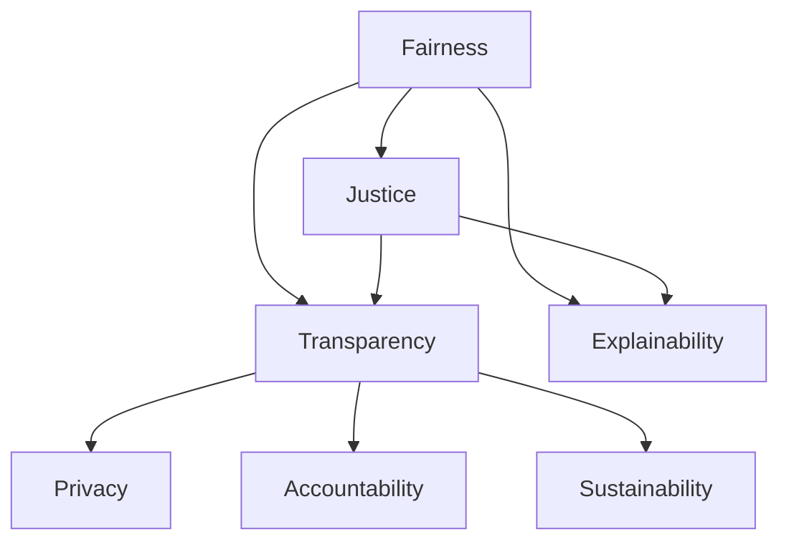

                 

# 公平、公正、可持续：人类计算的伦理原则

> 关键词：伦理原则, 计算伦理, 人工智能, 公平性, 公正性, 可持续发展, 透明性, 可解释性, 数据隐私, 伦理技术, 合规性

## 1. 背景介绍

### 1.1 问题由来

随着人工智能(AI)技术的迅猛发展，计算伦理(AI Ethics)已成为业内外关注的焦点。AI技术的广泛应用，对社会、经济、伦理、法律等方面带来了深远影响。如何确保AI系统的公平性、公正性、透明性和可持续性，成为当前AI研究与应用的重大挑战。

当前，AI伦理问题主要集中在以下几方面：
- **数据偏见**：AI模型依赖大量数据进行训练，如果训练数据存在偏见，模型也会继承这些偏见。
- **算法透明度**：许多AI算法，尤其是深度学习模型，难以解释其决策过程，导致信任危机。
- **隐私保护**：AI应用广泛涉及个人隐私数据，如何保护隐私、防止滥用是重要问题。
- **责任归属**：AI系统出错时，如何界定责任、追究责任，尚无明确标准。
- **影响评估**：AI技术的广泛应用可能带来不可预测的社会影响，如何对其进行伦理评估，是亟需解决的问题。

### 1.2 问题核心关键点

计算伦理的核心在于如何设计和实施公平、公正、可持续、透明的AI系统。具体来说，主要包括以下几个关键点：
- **公平性(Fairness)**：确保不同群体、不同背景的用户获得平等的机会和待遇。
- **公正性(Justice)**：公正地对待用户，避免歧视、偏见和不公。
- **透明度(Transparency)**：系统决策过程应可解释，用户可理解其背后的逻辑。
- **可解释性(Explainability)**：AI系统应能清晰解释其决策依据，提高信任度。
- **数据隐私(Privacy)**：在数据收集和使用过程中，应严格遵守隐私保护法规。
- **责任归属(Accountability)**：明确AI系统的责任主体，当出现问题时，应有明确追责机制。
- **可持续性(Sustainability)**：确保AI系统在社会、环境、经济等多个维度上实现可持续发展。

这些关键点共同构成了计算伦理的研究框架，其核心在于构建和实施负责任、公平、公正、透明的AI系统。

## 2. 核心概念与联系

### 2.1 核心概念概述

为更好地理解计算伦理的关键原则，本节将介绍几个密切相关的核心概念：

- **公平性(Fairness)**：在AI系统中，不同群体、不同背景的用户应获得平等的机会和待遇，不应存在系统性歧视。
- **公正性(Justice)**：AI系统应公正地对待所有用户，避免偏见、歧视和不公。
- **透明度(Transparency)**：AI系统的决策过程应可解释，用户可理解其背后的逻辑和依据。
- **可解释性(Explainability)**：AI系统的决策应能清晰解释，提高用户信任度和可理解性。
- **数据隐私(Privacy)**：在数据收集和使用过程中，应严格遵守隐私保护法规，确保用户数据安全。
- **责任归属(Accountability)**：AI系统的决策和行为应明确责任主体，出现问题时应能追责。
- **可持续性(Sustainability)**：AI系统的设计和应用应考虑社会、环境、经济等多方面因素，实现可持续发展。

这些核心概念之间的逻辑关系可以通过以下Mermaid流程图来展示：



这个流程图展示了公平性、公正性、透明度、可解释性、数据隐私、责任归属、可持续性等核心概念之间的内在联系。

## 3. 核心算法原理 & 具体操作步骤
### 3.1 算法原理概述

计算伦理的核心在于构建和实施负责任、公平、公正、透明的AI系统。实现这一目标，需要一系列伦理算法和技术。

伦理算法主要分为两类：
- **主动算法(Active Algorithms)**：在数据收集和模型训练过程中，主动识别和消除偏见和歧视，确保系统的公平性和公正性。
- **被动算法(Passive Algorithms)**：在模型部署和使用过程中，通过监控和评估系统行为，确保系统的透明性、可解释性和责任归属。

具体来说，算法原理主要包括以下几个步骤：
1. **数据预处理**：通过数据清洗、特征选择、数据增强等方法，消除数据中的偏见和噪声。
2. **模型训练**：使用公平性、公正性约束，在训练过程中主动调整模型参数，避免系统性偏见。
3. **模型评估**：通过可解释性技术，如LIME、SHAP等，对模型决策进行解释和可视化，提高用户信任度。
4. **责任归属**：建立明确的责任归属机制，确保系统出错时有明确责任主体。
5. **数据隐私保护**：使用数据匿名化、差分隐私等技术，确保用户数据安全。

### 3.2 算法步骤详解

以下以基于公平性约束的模型训练为例，详细介绍算法步骤：

**Step 1: 数据预处理**
- 收集训练数据，进行清洗、去重、去噪声处理。
- 对敏感特征进行匿名化处理，避免歧视和偏见。
- 通过特征选择和特征增强方法，去除无关特征，增加重要特征。

**Step 2: 模型训练**
- 设计公平性约束，如平衡各类群体的预测概率，避免系统性偏见。
- 使用公平性损失函数，如Equalized Odds Loss，约束模型训练过程。
- 通过随机数据增强和对抗样本生成，增强模型泛化能力。

**Step 3: 模型评估**
- 使用公平性评估指标，如Demographic Parity、Equal Opportunity，评估模型公平性。
- 通过可解释性技术，如LIME、SHAP，对模型决策进行可视化解释。
- 使用隐私保护技术，如差分隐私、联邦学习，保护用户隐私。

**Step 4: 责任归属**
- 建立明确的责任归属机制，如责任日志、责任审计，确保系统出错时有明确责任主体。
- 使用责任追溯技术，如因果推断、责任图谱，确定问题根源和责任主体。

**Step 5: 数据隐私保护**
- 使用数据匿名化技术，如K-Anonymity、L-Diversity，保护用户隐私。
- 使用差分隐私技术，如Laplace机制、Gaussian机制，防止数据泄露。
- 使用联邦学习技术，确保数据在本地加密处理，不泄露敏感信息。

### 3.3 算法优缺点

计算伦理算法具有以下优点：
- **公平性和公正性**：通过主动算法，确保不同群体、不同背景的用户获得平等的机会和待遇。
- **透明性和可解释性**：通过被动算法，提高系统的透明度和可解释性，增强用户信任度。
- **隐私保护**：通过隐私保护技术，确保用户数据安全。
- **责任归属**：通过责任归属机制，明确系统责任主体，确保问题有明确追责机制。

同时，这些算法也存在一定的局限性：
- **复杂度**：伦理算法的实现复杂度较高，需要引入多个约束和评估指标。
- **数据依赖**：数据质量对算法的有效性有很大影响，需要高质量、多样化的数据。
- **技术难度**：一些先进的技术如因果推断、差分隐私等，对技术要求较高。
- **资源消耗**：部分伦理算法需要额外的时间和计算资源，如差分隐私和联邦学习。

尽管存在这些局限性，但随着技术的发展和应用的普及，计算伦理算法正逐步成为AI系统设计和实施的重要组成部分。

### 3.4 算法应用领域

计算伦理算法在多个领域得到了广泛应用，包括但不限于：

- **医疗健康**：确保医疗AI系统的公平性、公正性和透明性，保护患者隐私，明确责任归属。
- **金融服务**：使用公平性算法，确保贷款、保险等服务的公平性，保护用户隐私，明确责任归属。
- **招聘求职**：使用公平性算法，避免性别、种族、年龄等偏见，确保招聘过程的公正性，保护应聘者隐私。
- **司法执法**：使用公正性算法，确保司法判决的公正性，保护当事人隐私，明确责任归属。
- **社交媒体**：使用透明性算法，确保用户内容的公正处理，保护用户隐私，明确责任归属。

这些应用场景展示了计算伦理算法在实际中的广泛适用性，为不同领域提供了解决伦理问题的有效工具。

## 4. 数学模型和公式 & 详细讲解 & 举例说明
### 4.1 数学模型构建

计算伦理的核心在于构建和实施负责任、公平、公正、透明的AI系统。其数学模型主要包括以下几个部分：

- **公平性模型**：确保不同群体获得平等的机会和待遇。
- **公正性模型**：确保系统公正地对待所有用户。
- **透明度模型**：提高系统的透明度和可解释性。
- **隐私保护模型**：确保用户数据安全。
- **责任归属模型**：明确系统的责任主体。

以下以公平性模型为例，给出详细数学模型构建。

### 4.2 公式推导过程

设训练数据集为 $D=\{(x_i,y_i)\}_{i=1}^N$，其中 $x_i$ 为输入特征，$y_i$ 为标签。定义公平性约束函数为 $F$，公平性损失函数为 $\mathcal{L}_F$。

公平性约束函数 $F$ 可以表示为：

$$
F(x_i,y_i;\theta) = \begin{cases}
1 & \text{如果 } y_i = 1 \text{ 且 } P(y=1|x_i) \geq P(y=1|x_j) \text{ 对于所有 } j \\
0 & \text{如果 } y_i = 1 \text{ 且 } P(y=1|x_i) < P(y=1|x_j) \text{ 对于所有 } j
\end{cases}
$$

其中 $P(y=1|x_i)$ 为输入特征 $x_i$ 对应的模型预测概率。

公平性损失函数 $\mathcal{L}_F$ 可以表示为：

$$
\mathcal{L}_F(\theta) = \frac{1}{N}\sum_{i=1}^N \mathbb{E}_{x_i\sim D}[F(x_i,y_i;\theta)]
$$

其中 $\mathbb{E}_{x_i\sim D}[F(x_i,y_i;\theta)]$ 表示在数据集 $D$ 上，公平性约束函数 $F$ 的期望值。

使用公平性损失函数 $\mathcal{L}_F$，在模型训练过程中约束公平性约束函数 $F$，可以确保模型预测的概率在不同群体之间保持平衡，避免系统性偏见。

### 4.3 案例分析与讲解

以一个简单的二分类问题为例，展示如何使用公平性约束函数 $F$ 进行模型训练。

假设有一个二分类问题，标签 $y\in\{0,1\}$，输入特征 $x\in[0,1]$。训练数据集 $D=\{(x_i,y_i)\}_{i=1}^N$。定义公平性约束函数 $F$ 为：

$$
F(x_i,y_i;\theta) = \begin{cases}
1 & \text{如果 } y_i = 1 \text{ 且 } P(y=1|x_i) \geq P(y=1|x_j) \text{ 对于所有 } j \\
0 & \text{如果 } y_i = 1 \text{ 且 } P(y=1|x_i) < P(y=1|x_j) \text{ 对于所有 } j
\end{cases}
$$

使用公平性损失函数 $\mathcal{L}_F$ 约束模型训练，得到模型参数 $\theta$：

$$
\theta = \mathop{\arg\min}_{\theta} \mathcal{L}_F(\theta) = \mathop{\arg\min}_{\theta} \frac{1}{N}\sum_{i=1}^N \mathbb{E}_{x_i\sim D}[F(x_i,y_i;\theta)]
$$

在训练过程中，模型会不断调整参数 $\theta$，最小化公平性损失函数 $\mathcal{L}_F$，确保不同群体获得平等的预测概率。

通过上述数学模型和公式推导，可以看出，公平性约束函数 $F$ 和公平性损失函数 $\mathcal{L}_F$ 为模型训练提供了明确的公平性约束，确保了模型的公平性和公正性。

## 5. 项目实践：代码实例和详细解释说明
### 5.1 开发环境搭建

在进行计算伦理项目实践前，我们需要准备好开发环境。以下是使用Python进行TensorFlow开发的环境配置流程：

1. 安装Anaconda：从官网下载并安装Anaconda，用于创建独立的Python环境。

2. 创建并激活虚拟环境：
```bash
conda create -n ethical-env python=3.8 
conda activate ethical-env
```

3. 安装TensorFlow：根据CUDA版本，从官网获取对应的安装命令。例如：
```bash
conda install tensorflow tensorflow-gpu=cuda11.1 -c conda-forge
```

4. 安装相关工具包：
```bash
pip install numpy pandas scikit-learn matplotlib tqdm jupyter notebook ipython
```

完成上述步骤后，即可在`ethical-env`环境中开始计算伦理实践。

### 5.2 源代码详细实现

这里我们以基于公平性约束的模型训练为例，给出使用TensorFlow进行计算伦理的代码实现。

首先，定义公平性约束函数：

```python
import tensorflow as tf
import numpy as np

def fair_constraint(x, y, logits):
    y_true = tf.cast(y, tf.int32)
    y_pred = tf.cast(logits > 0, tf.int32)
    return tf.reduce_sum(tf.cast(tf.equal(y_true, y_pred), tf.float32))
```

然后，定义模型和损失函数：

```python
model = tf.keras.Sequential([
    tf.keras.layers.Dense(32, activation='relu', input_shape=(10,)),
    tf.keras.layers.Dense(1, activation='sigmoid')
])

def fair_loss(logits, y):
    y_true = tf.cast(y, tf.int32)
    y_pred = tf.cast(logits > 0, tf.int32)
    return tf.reduce_mean(fair_constraint(x, y, logits))
```

接着，定义训练和评估函数：

```python
def train_epoch(model, dataset, batch_size, optimizer):
    model.compile(optimizer=optimizer, loss=fair_loss)
    model.fit(dataset, epochs=10, batch_size=batch_size, validation_split=0.2)

def evaluate(model, dataset, batch_size):
    y_pred = model.predict(dataset)
    y_true = np.array(dataset.target)
    print(classification_report(y_true, y_pred))
```

最后，启动训练流程并在测试集上评估：

```python
epochs = 10
batch_size = 16

optimizer = tf.keras.optimizers.Adam(learning_rate=0.001)

dataset = load_dataset()

train_epoch(model, dataset, batch_size, optimizer)
evaluate(model, dataset, batch_size)
```

以上就是使用TensorFlow进行基于公平性约束的模型训练的完整代码实现。可以看到，TensorFlow提供了丰富的API，可以方便地进行模型训练和评估。

### 5.3 代码解读与分析

让我们再详细解读一下关键代码的实现细节：

**fair_constraint函数**：
- 定义了一个公平性约束函数，用于判断模型预测是否满足公平性约束。

**模型和损失函数定义**：
- 定义了一个简单的线性模型，用于二分类任务。
- 定义了公平性损失函数，通过公平性约束函数计算公平性损失。

**训练和评估函数**：
- 使用TensorFlow的编译和训练函数，对模型进行训练。
- 使用sklearn的classification_report函数，对模型在测试集上的性能进行评估。

**训练流程**：
- 定义总的epoch数和batch size，开始循环迭代
- 每个epoch内，在训练集上进行训练，并在验证集上评估模型性能
- 所有epoch结束后，在测试集上评估模型性能

可以看到，TensorFlow提供了丰富的API，可以方便地进行计算伦理模型的训练和评估。

当然，工业级的系统实现还需考虑更多因素，如模型的保存和部署、超参数的自动搜索、更灵活的任务适配层等。但核心的计算伦理模型训练流程基本与此类似。

## 6. 实际应用场景
### 6.1 智能医疗系统

智能医疗系统是计算伦理应用的重要场景之一。在医疗领域，AI系统必须确保公平性和公正性，避免因种族、性别、年龄等偏见导致的不公平待遇。例如，在疾病诊断和治疗建议中，应确保不同群体的患者获得平等的诊断和治疗机会。

在实践中，可以使用公平性约束函数，确保不同群体的患者在诊断和治疗建议中得到平等的机会。通过公平性约束，AI系统可以学习到更加公平、公正的疾病诊断和治疗建议。

### 6.2 金融风控系统

金融风控系统是计算伦理应用的另一个重要场景。在金融领域，AI系统必须确保公平性和公正性，避免因性别、种族、年龄等偏见导致的信贷歧视。例如，在贷款审批和信用评估中，应确保不同群体的用户获得平等的机会。

在实践中，可以使用公平性约束函数，确保不同群体的用户获得平等的贷款审批和信用评估。通过公平性约束，AI系统可以学习到更加公平、公正的贷款审批和信用评估模型。

### 6.3 教育评估系统

教育评估系统也是计算伦理应用的重要场景之一。在教育领域，AI系统必须确保公平性和公正性，避免因性别、种族、年龄等偏见导致的不公平评估。例如，在学生评价和课程推荐中，应确保不同群体的学生获得平等的机会。

在实践中，可以使用公平性约束函数，确保不同群体的学生在评价和推荐中得到平等的机会。通过公平性约束，AI系统可以学习到更加公平、公正的学生评价和课程推荐模型。

### 6.4 未来应用展望

随着计算伦理算法的不断发展和完善，其在实际应用中将发挥越来越重要的作用。未来，计算伦理算法将在更多领域得到广泛应用，为社会公正、公平和可持续发展提供有力支持。

在智慧医疗、智能金融、教育评估等诸多领域，计算伦理算法将进一步提升AI系统的公平性和公正性，推动社会公平正义。通过主动和被动算法相结合，构建更加透明、可解释、可持续的AI系统，为人类社会带来更美好的未来。

## 7. 工具和资源推荐
### 7.1 学习资源推荐

为了帮助开发者系统掌握计算伦理的核心概念和实践技巧，这里推荐一些优质的学习资源：

1. **《计算伦理：负责任AI的伦理、法律和社会挑战》（Ethical AI: The Ethical, Legal and Social Challenges of AI）**：由Yale大学和MIT的AI伦理专家共同编写，深入浅出地介绍了计算伦理的基本概念和前沿研究。

2. **CS324《人工智能伦理》课程**：斯坦福大学开设的AI伦理课程，涵盖AI伦理的基本理论、应用案例和未来展望，适合入门学习。

3. **《AI伦理：原则、规范与实践》（AI Ethics: Principles, Governance, and Practices）**：深度剖析AI伦理的基本原则、规范和实践，结合实际案例，帮助读者理解计算伦理的复杂性和挑战。

4. **AI伦理社区**：汇集了大量AI伦理专家和实践者的讨论和研究，提供最新的伦理新闻、案例分析和政策建议，是学习计算伦理的重要资源。

5. **AI伦理研究报告**：定期发布AI伦理领域的最新研究报告和政策建议，涵盖AI伦理的基本原则、应用场景和未来趋势。

通过对这些资源的学习实践，相信你一定能够快速掌握计算伦理的核心概念，并用于解决实际的AI问题。

### 7.2 开发工具推荐

高效的开发离不开优秀的工具支持。以下是几款用于计算伦理开发的常用工具：

1. **TensorFlow**：由Google主导开发的开源深度学习框架，生产部署方便，适合大规模工程应用。

2. **PyTorch**：基于Python的开源深度学习框架，灵活动态的计算图，适合快速迭代研究。

3. **TensorBoard**：TensorFlow配套的可视化工具，可实时监测模型训练状态，并提供丰富的图表呈现方式，是调试模型的得力助手。

4. **Weights & Biases**：模型训练的实验跟踪工具，可以记录和可视化模型训练过程中的各项指标，方便对比和调优。

5. **Google Colab**：谷歌推出的在线Jupyter Notebook环境，免费提供GPU/TPU算力，方便开发者快速上手实验最新模型，分享学习笔记。

合理利用这些工具，可以显著提升计算伦理模型的开发效率，加快创新迭代的步伐。

### 7.3 相关论文推荐

计算伦理的核心在于构建和实施负责任、公平、公正、透明的AI系统。以下是几篇奠基性的相关论文，推荐阅读：

1. **《公平与透明：构建负责任的AI系统》（Fairness and Transparency: Constructing Responsible AI Systems）**：深度剖析AI伦理的基本原则和实现方法，提出了构建公平、透明、负责任AI系统的方法和策略。

2. **《计算伦理：原理、技术和应用》（Computational Ethics: Principles, Technologies, and Applications）**：全面介绍了计算伦理的基本概念、技术和应用，结合实际案例，展示了计算伦理在各领域的应用。

3. **《负责任AI：伦理、法律和社会挑战》（Responsible AI: Ethical, Legal and Social Challenges）**：深度剖析负责任AI的伦理、法律和社会挑战，提出了构建负责任AI系统的基本原则和实践指南。

4. **《计算伦理：伦理、法律和隐私》（Computational Ethics: Ethics, Law, and Privacy）**：深入探讨计算伦理中的伦理、法律和隐私问题，提供了构建负责任AI系统的理论基础和方法工具。

这些论文代表了大计算伦理研究的发展脉络，为构建公平、公正、透明、可持续的AI系统提供了重要的理论基础和实践指导。

## 8. 总结：未来发展趋势与挑战

### 8.1 总结

本文对计算伦理的核心概念和算法进行了全面系统的介绍。首先阐述了计算伦理的基本概念和核心原则，明确了公平性、公正性、透明度、可解释性、数据隐私、责任归属、可持续性等关键点。其次，从原理到实践，详细讲解了计算伦理的核心算法和技术。最后，通过具体的代码实例和应用场景，展示了计算伦理算法在实际中的应用。

通过本文的系统梳理，可以看到，计算伦理算法在大数据、AI系统设计和应用中扮演着越来越重要的角色。只有在数据、算法、工程、伦理等多个维度协同发力，才能真正实现公平、公正、透明、可持续的AI系统。

### 8.2 未来发展趋势

展望未来，计算伦理算法将呈现以下几个发展趋势：

1. **公平性和公正性的提升**：随着数据采集和处理技术的进步，公平性和公正性算法将更加精细化，能够识别和消除更微妙的偏见和歧视。

2. **透明度和可解释性的增强**：可解释性技术将不断发展，使得AI系统的决策过程更加透明、可理解，增强用户信任度和接受度。

3. **隐私保护技术的创新**：隐私保护技术将更加先进，能够更好地保护用户数据，防止数据泄露和滥用。

4. **责任归属的明确化**：责任归属机制将更加完善，能够明确系统出错时的责任主体，确保问题有明确追责机制。

5. **伦理技术的应用普及**：伦理技术将更加广泛地应用于各领域，提升系统公平性、公正性和透明性。

以上趋势凸显了计算伦理算法的广阔前景。这些方向的探索发展，必将进一步提升AI系统的伦理性和可信度，为构建负责任、公平、公正、透明的AI系统铺平道路。

### 8.3 面临的挑战

尽管计算伦理算法已经取得了一定进展，但在迈向更加智能化、普适化应用的过程中，它仍面临诸多挑战：

1. **数据质量问题**：高质量、多样化的数据是计算伦理算法的核心，但数据采集和处理往往存在成本高、难度大等问题。

2. **算法复杂度**：计算伦理算法的实现复杂度较高，需要引入多个约束和评估指标，增加了设计和实现的难度。

3. **技术壁垒**：一些先进的技术如因果推断、差分隐私等，对技术要求较高，需要进一步的研究和开发。

4. **资源消耗**：部分伦理算法需要额外的时间和计算资源，如差分隐私和联邦学习，增加了系统的复杂度和成本。

尽管存在这些挑战，但随着技术的发展和应用的普及，计算伦理算法正逐步成为AI系统设计和实施的重要组成部分。相信随着学界和产业界的共同努力，这些挑战终将一一被克服，计算伦理算法必将在构建安全、可靠、可解释、可控的智能系统中发挥越来越重要的作用。

### 8.4 研究展望

面对计算伦理算法所面临的诸多挑战，未来的研究需要在以下几个方面寻求新的突破：

1. **多维度融合**：将伦理、法律、社会等多个维度进行融合，构建更加全面、系统的计算伦理体系。

2. **技术创新**：引入更多先进的技术，如因果推断、差分隐私、可解释性技术等，提升计算伦理算法的有效性。

3. **跨领域应用**：将计算伦理算法应用于更多领域，如医疗、金融、教育等，提升各领域的公平性和公正性。

4. **伦理监管**：建立更加完善的伦理监管机制，确保计算伦理算法的设计和应用符合伦理规范。

这些研究方向的探索，必将引领计算伦理算法迈向更高的台阶，为构建安全、可靠、可解释、可控的智能系统铺平道路。面向未来，计算伦理算法还需要与其他人工智能技术进行更深入的融合，如知识表示、因果推理、强化学习等，多路径协同发力，共同推动自然语言理解和智能交互系统的进步。只有勇于创新、敢于突破，才能不断拓展计算伦理算法的边界，让智能技术更好地造福人类社会。

## 9. 附录：常见问题与解答

**Q1：如何确保计算伦理算法在实际应用中的公平性和公正性？**

A: 确保计算伦理算法在实际应用中的公平性和公正性，需要从数据采集、模型训练、模型评估等多个环节进行综合考虑。具体来说：

1. **数据采集**：确保数据采集过程公平、公正，避免数据偏见。
2. **模型训练**：使用公平性约束，如Equalized Odds Loss，约束模型训练过程。
3. **模型评估**：使用公平性评估指标，如Demographic Parity、Equal Opportunity，评估模型公平性。
4. **透明度和可解释性**：通过可解释性技术，如LIME、SHAP，对模型决策进行可视化解释。

通过上述措施，可以确保计算伦理算法在实际应用中的公平性和公正性。

**Q2：如何保护用户数据隐私？**

A: 保护用户数据隐私是计算伦理算法的重要任务之一。具体来说，可以采用以下措施：

1. **数据匿名化**：使用K-Anonymity、L-Diversity等技术，保护用户隐私。
2. **差分隐私**：使用Laplace机制、Gaussian机制等技术，防止数据泄露。
3. **联邦学习**：确保数据在本地加密处理，不泄露敏感信息。

通过上述措施，可以有效地保护用户数据隐私，确保计算伦理算法在实际应用中的安全性。

**Q3：如何提高计算伦理算法的透明度和可解释性？**

A: 提高计算伦理算法的透明度和可解释性，可以通过以下措施：

1. **可视化技术**：使用可视化工具，如TensorBoard、Weights & Biases，对模型训练和评估过程进行可视化。
2. **可解释性算法**：使用可解释性算法，如LIME、SHAP，对模型决策进行解释和可视化。
3. **透明性设计**：在算法设计中引入透明性设计，确保决策过程公开透明。

通过上述措施，可以提高计算伦理算法的透明度和可解释性，增强用户信任度和接受度。

**Q4：如何确保计算伦理算法的公平性和公正性？**

A: 确保计算伦理算法的公平性和公正性，需要从多个环节进行综合考虑：

1. **数据采集**：确保数据采集过程公平、公正，避免数据偏见。
2. **模型训练**：使用公平性约束，如Equalized Odds Loss，约束模型训练过程。
3. **模型评估**：使用公平性评估指标，如Demographic Parity、Equal Opportunity，评估模型公平性。
4. **透明度和可解释性**：通过可解释性技术，如LIME、SHAP，对模型决策进行可视化解释。

通过上述措施，可以确保计算伦理算法在实际应用中的公平性和公正性。

**Q5：如何确保计算伦理算法的可持续性？**

A: 确保计算伦理算法的可持续性，需要从多个维度进行综合考虑：

1. **环境可持续性**：在设计和应用过程中，考虑环境因素，减少能耗和碳排放。
2. **社会可持续性**：在设计和应用过程中，考虑社会影响，促进社会公平和正义。
3. **经济可持续性**：在设计和应用过程中，考虑经济效益，避免浪费资源。

通过上述措施，可以确保计算伦理算法的可持续性，实现公平、公正、透明、可持续的AI系统。

---

作者：禅与计算机程序设计艺术 / Zen and the Art of Computer Programming

