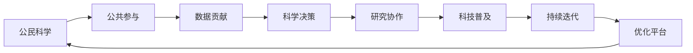

                 

# 公民科学平台：连接科学家与公众的桥梁

> 关键词：公民科学, 公共参与, 数据贡献, 科学决策, 研究协作, 科技普及

## 1. 背景介绍

在科技日益发展的今天，科学研究已经从单一的实验室模式逐步向大众科学、公共参与的开放模式转变。如何有效地将科学家与公众连接起来，充分利用社会大众的力量，共同推动科学进步，成为摆在我们面前的重要课题。公民科学平台正是这样一种旨在促进公众参与科学研究的数字化工具，它通过提供一个在线平台，使普通人能够收集数据、分析数据、参与科学研究，从而提高科学研究的效率和广度。

公民科学平台的工作原理可以简单概括为以下几个环节：
1. **数据收集**：通过分布式网络收集来自公众的观测数据。
2. **数据分析**：对收集到的数据进行分析，发现科学规律或解决实际问题。
3. **结果共享**：将分析结果共享给公众，进一步讨论和验证。
4. **持续迭代**：根据公众反馈，迭代优化平台功能，提高数据收集和分析的准确性。

公民科学平台不仅对科研工作具有重要意义，对公众科学素养提升也具有积极影响。公众参与科研过程，能够更好地理解科学方法论，培养科学精神，激发对科学的兴趣和热爱。

## 2. 核心概念与联系

为了更好地理解公民科学平台的工作原理和架构，下面将介绍几个核心概念及其相互联系：

- **公民科学(Citizen Science)**：一种旨在让公众参与科研工作的方式，通过网络平台收集公众观测数据，对数据进行科学分析和验证，形成科研结论。

- **公共参与(Public Engagement)**：在科研过程中，利用大众的力量收集数据、设计实验、分析结果等，增加科研的多样性和广泛性。

- **数据贡献(Data Contribution)**：公众通过平台提交的数据，包括观测结果、实验数据等，这些数据经过科学家的验证和分析，形成科研结论。

- **科学决策(Scientific Decision Making)**：利用科学数据和结论，支持政策制定、项目规划等科学决策过程。

- **研究协作(Research Collaboration)**：科学家与公众之间的合作，共同完成科研任务，提高科研效率。

- **科技普及(Technology Outreach)**：通过平台传播科学知识，提升公众的科学素养。

这些概念之间的逻辑关系可以通过以下Mermaid流程图来展示：



这个流程图展示了几大核心概念之间的相互关系：

1. 公民科学依托公共参与和数据贡献，实现科研工作的社会化。
2. 科研结论通过科学决策影响政策规划。
3. 科研协作和科技普及进一步增强公众参与科研的积极性。
4. 持续迭代优化平台功能，保证数据收集和分析的准确性。

## 3. 核心算法原理 & 具体操作步骤

### 3.1 算法原理概述

公民科学平台的核心算法原理可以归结为数据收集、数据处理、数据分析和结果共享四大模块。

- **数据收集**：通过用户接口收集公众提交的数据，包括位置信息、观测结果等。
- **数据处理**：对收集到的数据进行清洗、标注、格式化等预处理，确保数据的质量。
- **数据分析**：利用机器学习、统计学等方法，对数据进行分析，发现科学规律。
- **结果共享**：将分析结果通过平台发布，供公众讨论和进一步验证。

### 3.2 算法步骤详解

1. **数据收集**：平台设计简单易用的数据收集界面，让用户方便地提交数据。
2. **数据处理**：对收集到的数据进行初步清洗，去除噪音数据，进行数据标注。
3. **数据分析**：利用统计学模型或机器学习算法，对数据进行深入分析。
4. **结果共享**：将分析结果通过可视化工具展示给公众，并提供讨论区，供用户进一步交流和验证。
5. **反馈迭代**：根据公众的反馈，迭代优化平台功能和数据分析方法，提高平台的准确性和实用性。

### 3.3 算法优缺点

公民科学平台具有以下优点：
- **成本低**：充分利用公众的力量，减少科研资金投入。
- **数据量大**：公众参与收集的数据量远远超过传统实验室方法。
- **多学科融合**：公众来自各行各业，能够提供不同学科视角，丰富科研内容。

但同时也存在一些缺点：
- **数据质量参差不齐**：公众提交的数据质量可能不高，需要进行大量清洗和预处理。
- **数据隐私保护**：如何保护参与者的数据隐私，是一个需要重点考虑的问题。
- **分析准确性**：分析方法的准确性可能受限于技术水平，需要进一步优化。

### 3.4 算法应用领域

公民科学平台的应用领域非常广泛，涵盖以下几个方面：

- **环境保护**：公众参与收集环境数据，监测空气、水质、噪音等环境指标，支持环境监测和保护。
- **天文观测**：公众通过望远镜或其他设备，收集天文数据，支持天文观测和研究。
- **生物多样性**：公众参与收集生物多样性数据，监测物种变化，支持生态保护。
- **公共健康**：公众收集健康数据，支持疾病监测和流行病学研究。
- **天气预报**：公众参与收集天气数据，支持天气预测和预警。

## 4. 数学模型和公式 & 详细讲解 & 举例说明

### 4.1 数学模型构建

以天文观测数据为例，构建一个基本的数学模型来描述公众提交的天文数据如何被处理和分析。

设公众提交的天文数据为 $(x_1, x_2, ..., x_n)$，其中 $x_i$ 表示第 $i$ 个观测结果，如星星的位置坐标、亮度等。

**数据清洗**：去除明显错误或异常的数据，得到 $(x_1', x_2', ..., x_n')$。

**数据标注**：对数据进行标注，如时间、观测设备等，得到 $(x_1', t_1', d_1', ...)(x_n', t_n', d_n')$，其中 $t_i$ 表示第 $i$ 个观测的时间，$d_i$ 表示使用的观测设备。

**数据预处理**：对时间数据进行标准化处理，对亮度数据进行归一化处理，得到 $(x_1', t_1', s_1', ...)(x_n', t_n', s_n')$，其中 $s_i$ 表示亮度归一化后的值。

### 4.2 公式推导过程

将处理后的数据代入机器学习算法进行分析，如随机森林算法。设训练集为 $(x_1', t_1', s_1', ...)(x_n', t_n', s_n')$，测试集为 $(x_{n+1}', t_{n+1}', s_{n+1}')$。

设模型为 $f(x, t) = \hat{y}$，其中 $\hat{y}$ 表示模型预测的亮度值。

根据随机森林算法，模型通过训练数据学习亮度与时间的关系，即：

$$
\hat{y} = \frac{1}{N}\sum_{i=1}^{N} f_i(x_i', t_i', s_i')
$$

其中 $f_i(x_i', t_i', s_i')$ 表示第 $i$ 棵树的预测结果，$N$ 表示树的数量。

### 4.3 案例分析与讲解

以Galaxy Zoo项目为例，这是一个旨在让公众帮助天文学家识别和分类宇宙中的星系和星云的项目。该项目通过Galaxy Zoo网站收集公众的分类结果，并利用机器学习算法进行分析，得到科学的分类结果。

在Galaxy Zoo项目中，公众通过上传照片，标识出不同星体的类型。这些数据经过平台后台处理，标注时间、设备等信息，再利用随机森林等算法进行分析。最终，天文学家对公众的分类结果进行验证和调整，形成科学的分类结果。

## 5. 项目实践：代码实例和详细解释说明

### 5.1 开发环境搭建

公民科学平台的开发需要以下几个步骤：

1. 准备开发环境：安装Python、Flask、SQLAlchemy等开发工具。
2. 数据收集：设计用户界面，方便用户提交数据。
3. 数据处理：实现数据清洗、标注、预处理等功能。
4. 数据分析：选择适合的机器学习算法，对数据进行分析。
5. 结果展示：设计可视化界面，展示分析结果。
6. 持续迭代：实现反馈机制，根据用户反馈进行迭代优化。

### 5.2 源代码详细实现

下面以Galaxy Zoo项目为例，展示平台的基本代码实现：

```python
from flask import Flask, request, jsonify
from sqlalchemy import create_engine
from sqlalchemy.orm import sessionmaker
from sklearn.ensemble import RandomForestRegressor
from pandas import DataFrame

app = Flask(__name__)

# 连接数据库
engine = create_engine('sqlite:///data.db')
Session = sessionmaker(bind=engine)

# 数据收集界面
@app.route('/submit', methods=['POST'])
def submit():
    data = request.json
    # 将数据存储到数据库中
    session.add(Data(data))
    session.commit()
    return jsonify({'message': 'Data submitted successfully'})

# 数据分析界面
@app.route('/analyze', methods=['GET'])
def analyze():
    # 从数据库中读取数据
    data = Session.query(Data).all()
    df = DataFrame(data)
    # 数据预处理
    df = preprocess(df)
    # 数据标注
    df = annotate(df)
    # 数据分析
    model = RandomForestRegressor()
    model.fit(df[['x1', 'x2', 'x3'], df['s1']])
    result = model.predict(df[['x1', 'x2', 'x3']])
    # 结果展示
    return jsonify({'result': result.tolist()})

if __name__ == '__main__':
    app.run(debug=True)
```

### 5.3 代码解读与分析

- `submit`函数：接收用户提交的数据，将其存储到数据库中。
- `analyze`函数：从数据库中读取数据，进行预处理、标注和分析，返回分析结果。

## 6. 实际应用场景

公民科学平台已经在多个领域得到了广泛应用，以下是几个典型的应用场景：

- **地球监测**：通过公众收集的遥感数据，监测地球环境变化，如森林覆盖率、冰川融化等。
- **气象预测**：通过公众提交的天气数据，进行天气预测和预警。
- **生物多样性研究**：公众参与收集生物多样性数据，支持生态保护和生物多样性研究。
- **公共健康**：通过公众收集的健康数据，支持疾病监测和流行病学研究。

## 7. 工具和资源推荐

### 7.1 学习资源推荐

为了帮助开发者系统掌握公民科学平台的核心技术和应用，这里推荐一些优质的学习资源：

1. **Coursera《数据科学导论》课程**：斯坦福大学开设的入门级课程，涵盖数据收集、处理、分析等多个方面。
2. **Kaggle平台**：提供丰富的公共数据集和竞赛，帮助用户实践数据分析和机器学习技术。
3. **GitHub上的公民科学项目**：如Galaxy Zoo、eBird等，可以查看开源代码和文档，学习公民科学平台的实现细节。

### 7.2 开发工具推荐

为了开发高效、可扩展的公民科学平台，推荐使用以下开发工具：

1. **Flask**：轻量级的Web框架，易于上手，支持RESTful API设计。
2. **SQLAlchemy**：强大的ORM框架，支持多种数据库，方便数据存储和查询。
3. **Scikit-learn**：强大的机器学习库，支持多种算法，适合数据分析和模型训练。
4. **TensorFlow**：谷歌开源的深度学习框架，支持分布式计算，适合大规模数据分析。

### 7.3 相关论文推荐

公民科学平台的研究已经积累了大量的成果，以下是几篇奠基性的相关论文，推荐阅读：

1. **Crowdsourcing in Biological Research**：该论文探讨了如何利用公众参与进行生物研究，总结了多个成功案例。
2. **Zooniverse: The Promise of Crowdsourced Data in Biological Research**：介绍了Zooniverse平台，展示了公众参与科研的实际效果。
3. **Citizen Science as a Tool for Research**：该论文讨论了公民科学在多个领域的应用，提出了未来发展的方向。

## 8. 总结：未来发展趋势与挑战

### 8.1 总结

本文对公民科学平台的工作原理和实现方法进行了全面系统的介绍。通过公民科学平台，公众能够参与到科研工作中，为科学进步贡献力量。公民科学平台不仅提高了科研的效率和广度，也为公众科学素养的提升提供了新的途径。

### 8.2 未来发展趋势

展望未来，公民科学平台将呈现以下几个发展趋势：

1. **数据融合**：不同领域的公民科学项目将越来越多地融合，形成更大规模的数据集，提高数据的质量和多样性。
2. **自动化工具**：通过自动化工具，简化数据收集和预处理流程，提高科研效率。
3. **跨学科协作**：公民科学平台将促进不同学科之间的合作，丰富科研内容。
4. **公众参与度提升**：通过更好的用户体验设计和激励机制，吸引更多公众参与科研。
5. **科技普及**：利用公民科学平台，普及科学知识，提高公众的科学素养。

### 8.3 面临的挑战

尽管公民科学平台在科研和科普方面具有巨大的潜力，但仍面临一些挑战：

1. **数据质量**：如何保证公众提交的数据质量，避免噪音和错误，是一个需要解决的问题。
2. **隐私保护**：如何保护参与者的隐私，避免数据泄露和滥用，是一个重要的问题。
3. **技术门槛**：如何降低技术门槛，让公众更容易参与科研，是一个需要探索的方向。
4. **激励机制**：如何设计有效的激励机制，鼓励公众积极参与，是一个需要研究的课题。

### 8.4 研究展望

未来，公民科学平台的研究需要在以下几个方面寻求新的突破：

1. **数据质量提升**：开发更智能的数据清洗和预处理算法，提高数据的准确性和可靠性。
2. **隐私保护机制**：研究更有效的隐私保护技术，确保数据安全和用户隐私。
3. **跨学科协作**：促进不同学科之间的交流和协作，丰富科研内容。
4. **公众参与度提升**：设计更好的用户体验和激励机制，吸引更多公众参与。
5. **科技普及**：利用公民科学平台，普及科学知识，提升公众的科学素养。

这些研究方向的探索，必将引领公民科学平台迈向更高的台阶，为科研和社会进步带来更大的贡献。面向未来，我们需要积极应对挑战，不断优化平台功能和用户体验，让公民科学平台成为连接科学家与公众的强大桥梁。

## 9. 附录：常见问题与解答

**Q1：如何保证公民科学平台的数据质量？**

A: 保证数据质量需要从多个方面进行努力：
1. **数据收集**：设计易用且明确的数据收集界面，帮助公众准确提交数据。
2. **数据清洗**：开发智能数据清洗算法，自动去除噪音数据和错误。
3. **数据验证**：引入专家验证机制，对提交数据进行初步审核。
4. **反馈迭代**：根据用户反馈，持续优化平台功能和数据处理流程。

**Q2：如何保护公民科学平台的数据隐私？**

A: 保护数据隐私需要从数据收集、存储和处理等多个环节进行考虑：
1. **匿名化处理**：对公众提交的数据进行匿名化处理，去除敏感信息。
2. **数据加密**：在数据存储和传输过程中，使用加密技术保护数据安全。
3. **访问控制**：对数据进行严格的访问控制，只有授权用户才能访问数据。
4. **合规审查**：遵循数据保护法规，如GDPR，确保平台符合法律要求。

**Q3：公民科学平台如何降低技术门槛？**

A: 降低技术门槛需要从用户体验和用户教育两个方面进行努力：
1. **界面设计**：设计直观易用的用户界面，降低用户操作难度。
2. **在线教程**：提供详细的在线教程和用户手册，帮助用户了解平台功能和使用方法。
3. **技术支持**：提供在线技术支持，帮助用户解决使用过程中遇到的问题。

**Q4：如何设计有效的激励机制？**

A: 设计有效的激励机制需要考虑以下几个方面：
1. **奖励机制**：根据数据贡献和参与度，设计合理的奖励机制，如积分、证书等。
2. **社区互动**：通过社区讨论和分享，增加用户参与的积极性和互动性。
3. **成就展示**：在平台中展示用户成就，增强用户的荣誉感和成就感。

---

作者：禅与计算机程序设计艺术 / Zen and the Art of Computer Programming

