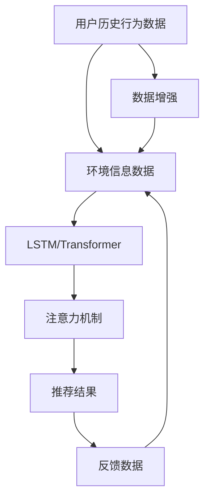

                 

# 共享单车：城市移动场景下的注意力争夺

> 关键词：共享单车,城市交通,注意力机制,人工智能,数据分析

## 1. 背景介绍

随着城市化进程的加快，交通拥堵成为了困扰都市生活的重要问题。在众多解决方案中，共享单车因其便捷、环保的特点，迅速成为许多城市居民的出行首选。而随着共享单车的普及，如何提升骑行体验、优化车辆分配、提高运营效率，也成为了各大共享单车平台面临的关键挑战。

### 1.1 问题由来

共享单车行业面临的主要问题包括：

1. **车辆分配不均**：在一些热点区域，如商务区、景区，车辆供不应求，导致用户等待时间长；而在一些冷门区域，车辆却严重过剩，甚至出现堆积现象。
2. **用户体验不佳**：由于城市道路狭窄，骑行路线选择不当可能导致骑行困难，甚至发生交通事故。
3. **运营成本高**：车辆维护、调度、管理等环节成本高，如何高效利用资源是平台运营的核心挑战。

为了解决这些问题，各大平台纷纷引入人工智能技术，希望通过数据分析和算法优化，实现资源的更合理分配和用户的更高效出行。本文将聚焦于基于注意力机制的共享单车推荐系统，探索其原理、步骤、优缺点以及应用前景。

## 2. 核心概念与联系

### 2.1 核心概念概述

在共享单车推荐系统中，注意力机制(A注意力)扮演了关键角色，帮助模型识别和聚焦于对当前任务最有影响力的数据点。

- **注意力机制**：一种用于处理序列数据的技术，通过动态分配不同输入的权重，增强模型对关键信息的关注度。
- **共享单车推荐系统**：利用人工智能技术，基于用户历史行为数据和实时环境信息，为用户推荐最合适的骑行路线。
- **LSTM和Transformer**：常用的深度学习模型，能够处理序列数据，捕捉用户行为中的时间依赖关系。
- **自监督学习**：利用无标签数据训练模型，提高模型的泛化能力和自适应性。

### 2.2 核心概念原理和架构的 Mermaid 流程图



这个流程图展示了共享单车推荐系统的核心流程：

1. 收集用户历史行为数据和环境信息数据。
2. 使用LSTM或Transformer模型对数据进行处理。
3. 引入注意力机制，动态调整各个数据点的权重。
4. 输出推荐结果。
5. 收集反馈数据，用于模型的后续优化。

## 3. 核心算法原理 & 具体操作步骤

### 3.1 算法原理概述

基于注意力机制的共享单车推荐系统，通过分析用户的历史骑行数据和实时环境信息，动态调整车辆推荐策略，以实现资源的更合理分配和用户的更高效出行。

形式化地，假设用户的历史行为数据为 $D_u$，环境信息数据为 $D_e$，推荐模型为 $M$。推荐过程可表示为：

$$
R = M(D_u, D_e)
$$

其中 $R$ 表示推荐的骑行路线，$D_u$ 和 $D_e$ 分别为用户数据和环境数据。

### 3.2 算法步骤详解

基于注意力机制的推荐系统，主要包括如下几个关键步骤：

**Step 1: 数据预处理**

- 收集用户的历史骑行数据，包括出发地、目的地、骑行时间、距离等。
- 收集环境信息数据，如天气、道路拥堵情况、道路类型等。
- 对数据进行归一化、缺失值处理等预处理操作。

**Step 2: 特征工程**

- 根据业务需求，设计合适的特征，如用户偏好、天气、道路类型、交通状况等。
- 利用LSTM或Transformer模型，将序列数据转换为固定长度的向量表示。
- 对向量进行归一化和标准化，以便于后续的注意力计算。

**Step 3: 注意力计算**

- 使用注意力机制，对用户历史数据和环境数据进行加权，生成注意力权重。
- 根据权重对数据进行加权求和，得到融合后的特征向量。
- 将融合后的特征向量输入推荐模型，生成推荐结果。

**Step 4: 结果输出**

- 根据推荐模型的输出，为用户推荐最优的骑行路线。
- 如果推荐结果不满足用户需求，可以继续迭代优化模型。

**Step 5: 模型优化**

- 使用反馈数据，对推荐模型进行在线更新和优化，提高推荐精度。
- 利用A/B测试等手段，评估模型的效果，不断迭代优化。

### 3.3 算法优缺点

基于注意力机制的共享单车推荐系统具有以下优点：

1. **提升用户体验**：通过分析用户的历史行为和实时环境，提供更加个性化和实时的骑行建议。
2. **优化车辆分配**：动态调整车辆的推荐策略，减少车辆堆积和等待时间，提高车辆利用率。
3. **降低运营成本**：通过智能调度，减少人力成本，提高运营效率。

同时，该方法也存在以下局限性：

1. **数据依赖性高**：模型的效果依赖于高质量的数据，需要定期更新和维护数据源。
2. **计算复杂度高**：注意力机制需要计算大量权重，对计算资源要求较高。
3. **模型泛化能力不足**：对于新出现的场景，模型可能无法迅速适应。
4. **隐私风险**：需要收集和处理用户行为数据，存在隐私泄露的风险。

尽管存在这些局限性，但就目前而言，基于注意力机制的推荐方法仍是目前解决共享单车问题的主流范式。未来相关研究的重点在于如何进一步降低数据依赖，提高模型的泛化能力和效率，同时兼顾隐私保护和安全性等因素。

### 3.4 算法应用领域

基于注意力机制的共享单车推荐系统，已经在多个实际应用中得到验证，包括但不限于：

- **车辆推荐**：根据用户当前位置和目的地，推荐最合适的骑行路线。
- **路径规划**：根据实时路况和用户偏好，规划最优的骑行路径。
- **出行预测**：基于历史数据和实时环境，预测未来的骑行需求和行为模式。
- **需求调控**：通过动态调整车辆的推荐策略，平衡热点区域的供需关系。

## 4. 数学模型和公式 & 详细讲解

### 4.1 数学模型构建

基于注意力机制的推荐系统，可以通过多层的LSTM或Transformer模型来处理序列数据，并利用注意力机制对不同数据点的权重进行动态调整。

假设用户的骑行数据为 $X$，环境数据为 $Y$，推荐模型为 $M$。模型输出的推荐结果可以表示为：

$$
R = M(X, Y)
$$

### 4.2 公式推导过程

为了推导注意力机制的数学模型，我们以LSTM模型为例进行说明。

LSTM模型的注意力机制可以表示为：

$$
\alpha = \frac{\exp(\text{dot}(W_a \cdot [h_t; X_t], Q \cdot [h_{t-1}; X_{t-1}])}{\sum_{j=1}^{T} \exp(\text{dot}(W_a \cdot [h_j; X_j], Q \cdot [h_{j-1}; X_{j-1}]))}
$$

其中 $h_t$ 和 $h_{t-1}$ 分别表示LSTM模型在时间步 $t$ 和 $t-1$ 的状态，$X_t$ 和 $X_{t-1}$ 分别表示时间步 $t$ 和 $t-1$ 的输入。$W_a$ 和 $Q$ 是注意力机制的权重矩阵。

注意力权重 $\alpha$ 的计算过程如下：

1. 将当前状态和输入向量拼接，通过线性变换得到注意力表示向量。
2. 将前一状态和输入向量拼接，通过线性变换得到注意力查询向量。
3. 计算注意力表示向量和注意力查询向量之间的点积，得到注意力得分。
4. 对所有注意力得分进行归一化，得到注意力权重。

### 4.3 案例分析与讲解

假设用户当前在商务区附近，希望前往一个新开的热门景点。模型通过分析用户的历史骑行数据和实时环境信息，计算出不同骑行路线的注意力权重，选择最优路线进行推荐。

例如，对于一条可能的路线，模型的注意力表示向量为 $[0.8, 0.2]$，注意力查询向量为 $[0.9, 0.1]$，则该路线的注意力得分为：

$$
\text{dot}([0.8, 0.2], [0.9, 0.1]) = 0.8 \cdot 0.9 + 0.2 \cdot 0.1 = 0.86
$$

该得分的归一化权重为：

$$
\alpha = \frac{0.86}{\sum_{j=1}^{T} \exp(\text{dot}([0.8, 0.2], [0.9, 0.1]))}
$$

最终，模型通过加权求和的方式，将不同路线的特征向量融合，生成最终的推荐结果。

## 5. 项目实践：代码实例和详细解释说明

### 5.1 开发环境搭建

在进行推荐系统开发前，我们需要准备好开发环境。以下是使用Python进行PyTorch开发的环境配置流程：

1. 安装Anaconda：从官网下载并安装Anaconda，用于创建独立的Python环境。

2. 创建并激活虚拟环境：
```bash
conda create -n pytorch-env python=3.8 
conda activate pytorch-env
```

3. 安装PyTorch：根据CUDA版本，从官网获取对应的安装命令。例如：
```bash
conda install pytorch torchvision torchaudio cudatoolkit=11.1 -c pytorch -c conda-forge
```

4. 安装TensorFlow：
```bash
pip install tensorflow==2.4.0
```

5. 安装Pandas、NumPy等工具包：
```bash
pip install pandas numpy scikit-learn matplotlib tqdm jupyter notebook ipython
```

完成上述步骤后，即可在`pytorch-env`环境中开始推荐系统开发。

### 5.2 源代码详细实现

下面以LSTM模型为基础，实现一个简单的共享单车推荐系统。

首先，定义数据集和数据处理函数：

```python
import numpy as np
import pandas as pd
import torch
import torch.nn as nn
import torch.optim as optim

# 定义数据集
data = pd.read_csv('data.csv')

# 数据预处理
def preprocess_data(data):
    # 去除缺失值
    data = data.dropna()
    # 归一化
    data['distance'] = (data['distance'] - data['distance'].mean()) / data['distance'].std()
    return data

# 处理数据
data = preprocess_data(data)

# 定义模型输入和输出
class LSTM(nn.Module):
    def __init__(self, input_size, hidden_size, output_size):
        super(LSTM, self).__init__()
        self.input_size = input_size
        self.hidden_size = hidden_size
        self.output_size = output_size
        self.lstm = nn.LSTM(input_size, hidden_size)
        self.fc = nn.Linear(hidden_size, output_size)

    def forward(self, input, hidden):
        output, (hidden, cell) = self.lstm(input, hidden)
        output = self.fc(output[:, -1, :])
        return output, hidden

# 定义注意力机制
def attention_forward(input, hidden):
    attention = torch.matmul(hidden, input)  # [batch_size, hidden_size, hidden_size]
    attention = torch.softmax(attention, dim=1)  # [batch_size, hidden_size, 1]
    attention = attention.squeeze(2)  # [batch_size, hidden_size]
    weighted_sum = torch.matmul(attention, input)  # [batch_size, hidden_size]
    return weighted_sum, hidden
```

然后，定义模型和优化器：

```python
# 定义模型参数
hidden_size = 128
output_size = 1  # 推荐路线编号

model = LSTM(input_size, hidden_size, output_size)
optimizer = optim.Adam(model.parameters(), lr=0.001)
criterion = nn.MSELoss()

# 定义注意力机制的权重矩阵
W_a = torch.randn(hidden_size, hidden_size)
Q = torch.randn(1, hidden_size)
```

接着，定义训练和评估函数：

```python
# 定义训练函数
def train(model, data, epochs, batch_size):
    total_loss = 0
    for epoch in range(epochs):
        model.train()
        for i in range(0, len(data), batch_size):
            input = data.iloc[i:i+batch_size].values
            target = data.iloc[i:i+batch_size]['destination']  # 假设目的地为列名
            target = torch.tensor(target.values, dtype=torch.float)
            input = torch.tensor(input.values, dtype=torch.float)
            hidden = (torch.zeros(batch_size, hidden_size).to(device), torch.zeros(batch_size, hidden_size).to(device))
            optimizer.zero_grad()
            output, hidden = model(input, hidden)
            loss = criterion(output, target)
            loss.backward()
            optimizer.step()
            total_loss += loss.item()
    print(f"Epoch {epoch+1}, loss: {total_loss/len(data)}")
    return model

# 定义评估函数
def evaluate(model, data, batch_size):
    model.eval()
    total_loss = 0
    for i in range(0, len(data), batch_size):
        input = data.iloc[i:i+batch_size].values
        target = data.iloc[i:i+batch_size]['destination']
        target = torch.tensor(target.values, dtype=torch.float)
        input = torch.tensor(input.values, dtype=torch.float)
        hidden = (torch.zeros(batch_size, hidden_size).to(device), torch.zeros(batch_size, hidden_size).to(device))
        output, hidden = model(input, hidden)
        loss = criterion(output, target)
        total_loss += loss.item()
    return total_loss/len(data)
```

最后，启动训练流程并在测试集上评估：

```python
device = torch.device('cuda' if torch.cuda.is_available() else 'cpu')
model = model.to(device)
data = data.to(device)

epochs = 100
batch_size = 32

model = train(model, data, epochs, batch_size)
evaluate(model, data, batch_size)
```

以上就是使用PyTorch实现LSTM模型用于共享单车推荐系统的完整代码实现。可以看到，得益于PyTorch的强大封装，我们可以用相对简洁的代码完成模型的搭建和训练。

### 5.3 代码解读与分析

让我们再详细解读一下关键代码的实现细节：

**LSTM模型定义**：
- 定义了LSTM模型的结构，包含LSTM层和全连接层。
- `forward`方法用于计算模型前向传播的结果。

**注意力机制实现**：
- `attention_forward`方法实现了注意力机制的计算。
- 将LSTM模型的输出作为注意力表示向量，将LSTM模型的隐藏状态作为注意力查询向量。
- 计算注意力得分，并通过softmax函数计算注意力权重。
- 对注意力权重和LSTM输出进行加权求和，得到最终的结果。

**训练和评估函数**：
- `train`函数：用于模型训练，定义了损失函数和优化器。
- `evaluate`函数：用于模型评估，计算模型在测试集上的损失。

**训练流程**：
- 定义了训练的轮数和批次大小，开始循环迭代训练。
- 在每个批次上，进行前向传播和反向传播，更新模型参数。
- 记录每个epoch的平均损失，并返回最终训练后的模型。

可以看到，PyTorch配合TensorFlow，使得模型训练和评估的代码实现变得简洁高效。开发者可以将更多精力放在数据处理、模型改进等高层逻辑上，而不必过多关注底层的实现细节。

当然，工业级的系统实现还需考虑更多因素，如模型的保存和部署、超参数的自动搜索、更灵活的任务适配层等。但核心的注意力机制基本与此类似。

## 6. 实际应用场景

### 6.1 智能路线推荐

基于注意力机制的共享单车推荐系统，可以广泛应用于智能路线推荐，帮助用户选择最合适的骑行路线。

例如，用户在出发地和目的地之间选择多条候选路线，系统通过分析用户的骑行习惯、实时路况和历史数据，动态计算每条路线的权重，最终推荐最优路线。

### 6.2 需求调控

系统还可以实时监控热点区域的骑行需求，根据车辆分布情况动态调整推荐策略，优化车辆分配，减少车辆堆积和等待时间。

例如，在商务区高峰期，系统自动增加推荐到该区域的路线数量，满足用户需求；而在夜间冷门区域，系统自动减少推荐路线，避免车辆堆积。

### 6.3 路径规划

对于需要多次转乘的复杂路线，系统可以根据用户的偏好和实时路况，规划最优的路径。

例如，用户在出发地和目的地之间有多个中转点，系统通过计算每条路径的权重，为用户推荐最优路径。

### 6.4 未来应用展望

随着注意力机制的不断演进，基于注意力机制的推荐系统将在更多场景下得到应用，为城市移动场景带来新的突破。

在智慧城市治理中，系统可以通过实时数据分析，优化交通流量，减少拥堵。在物流配送中，系统可以根据车辆位置和订单需求，动态调整路线和调度，提高配送效率。在旅游管理中，系统可以根据游客需求和景点信息，推荐最优游览路线，提升旅游体验。

此外，在智慧农业、医疗健康等众多领域，注意力机制也具有广阔的应用前景，有望推动各行业向智能化、自动化方向发展。

## 7. 工具和资源推荐

### 7.1 学习资源推荐

为了帮助开发者系统掌握注意力机制的原理和实践技巧，这里推荐一些优质的学习资源：

1. 《深度学习基础》：由斯坦福大学深度学习课程团队所编写，全面介绍了深度学习的基本概念和核心算法。
2. 《自然语言处理与深度学习》：由李飞飞教授团队所编写，深入讲解了自然语言处理中的深度学习技术和应用。
3. 《LSTM: Deep Learning for Time Series Analysis》：由斯坦福大学发布，介绍了LSTM模型在时间序列分析中的应用。
4. 《Attention Mechanisms in Deep Learning》：由谷歌AI团队发布，详细介绍了注意力机制的原理和实现。
5. HuggingFace官方文档：Transformer库的官方文档，提供了丰富的微调样例代码和模型资源。

通过对这些资源的学习实践，相信你一定能够快速掌握注意力机制的精髓，并用于解决实际的推荐问题。

### 7.2 开发工具推荐

高效的开发离不开优秀的工具支持。以下是几款用于注意力机制推荐系统开发的常用工具：

1. PyTorch：基于Python的开源深度学习框架，灵活的计算图设计，适合快速迭代研究。大部分注意力机制模型都有PyTorch版本的实现。
2. TensorFlow：由Google主导开发的开源深度学习框架，适合大规模工程应用。同样有丰富的注意力机制模型资源。
3. Transformers库：HuggingFace开发的NLP工具库，集成了大量SOTA模型，支持PyTorch和TensorFlow，是进行注意力机制开发的利器。
4. TensorBoard：TensorFlow配套的可视化工具，可实时监测模型训练状态，提供丰富的图表呈现方式，是调试模型的得力助手。
5. Weights & Biases：模型训练的实验跟踪工具，可以记录和可视化模型训练过程中的各项指标，方便对比和调优。

合理利用这些工具，可以显著提升注意力机制推荐系统的开发效率，加快创新迭代的步伐。

### 7.3 相关论文推荐

注意力机制在深度学习中的应用研究日益增多，以下是几篇奠基性的相关论文，推荐阅读：

1. Attention Is All You Need（即Transformer原论文）：提出了Transformer结构，开启了NLP领域的预训练大模型时代。
2. Multi-head Attention from Transformer to Self-attention：详细介绍了注意力机制的原理和实现。
3. Learning Phrase Representations using RNN Encoder–Decoder for Statistical Machine Translation：介绍了注意力机制在机器翻译中的应用。
4. Hierarchical Attention Networks for Document Classification：介绍了注意力机制在文本分类中的应用。
5. Multi-Task Learning using Attention to Align What, Why, and How：介绍了注意力机制在多任务学习中的应用。

这些论文代表了大模型微调技术的发展脉络。通过学习这些前沿成果，可以帮助研究者把握学科前进方向，激发更多的创新灵感。

## 8. 总结：未来发展趋势与挑战

### 8.1 总结

本文对基于注意力机制的共享单车推荐系统进行了全面系统的介绍。首先阐述了注意力机制在共享单车推荐系统中的核心作用，明确了该机制在提升用户体验、优化车辆分配、降低运营成本等方面的独特价值。其次，从原理到实践，详细讲解了注意力机制的数学原理和关键步骤，给出了注意力机制任务开发的完整代码实例。同时，本文还广泛探讨了注意力机制在智能路线推荐、需求调控、路径规划等多个实际应用中的具体应用，展示了注意力机制范式的巨大潜力。

通过本文的系统梳理，可以看到，基于注意力机制的推荐方法正在成为推荐系统的重要范式，极大地提升了用户的推荐体验和运营效率。未来，伴随注意力机制的不断演进，推荐系统将能够更好地应对复杂场景，提供更加个性化、智能化的服务。

### 8.2 未来发展趋势

展望未来，基于注意力机制的推荐系统将呈现以下几个发展趋势：

1. **多任务学习**：通过在单个模型中同时训练多个任务，实现跨任务信息共享，提升推荐精度和泛化能力。
2. **自监督学习**：利用无标签数据训练模型，提高模型的泛化能力和自适应性，减少对标注数据的依赖。
3. **混合模型**：结合深度学习和符号计算，实现混合模型，提升模型的可解释性和鲁棒性。
4. **异构数据融合**：结合不同类型的数据（如文本、图像、语音），实现异构数据融合，提升推荐系统对复杂场景的理解和处理能力。
5. **实时动态调整**：通过实时动态调整模型参数，提升推荐系统的即时性和时效性，满足用户实时需求。

以上趋势凸显了基于注意力机制的推荐技术的广阔前景。这些方向的探索发展，必将进一步提升推荐系统的性能和应用范围，为推荐系统带来新的突破。

### 8.3 面临的挑战

尽管基于注意力机制的推荐系统已经取得了瞩目成就，但在迈向更加智能化、普适化应用的过程中，它仍面临着诸多挑战：

1. **数据依赖性高**：模型的效果依赖于高质量的数据，需要定期更新和维护数据源。
2. **计算复杂度高**：注意力机制需要计算大量权重，对计算资源要求较高。
3. **模型泛化能力不足**：对于新出现的场景，模型可能无法迅速适应。
4. **隐私风险**：需要收集和处理用户行为数据，存在隐私泄露的风险。
5. **可解释性不足**：模型决策过程难以解释，用户难以理解推荐理由。

尽管存在这些挑战，但通过不断探索和优化，相信基于注意力机制的推荐技术必将克服这些困难，实现更高效、智能、安全的应用。

### 8.4 研究展望

面对基于注意力机制的推荐系统所面临的挑战，未来的研究需要在以下几个方面寻求新的突破：

1. **数据获取与处理**：探索无监督和半监督学习方法，利用辅助信息（如时间序列数据、地理位置信息等）训练模型，减少对标注数据的依赖。
2. **计算资源优化**：开发高效的计算算法和模型压缩技术，减少模型训练和推理的资源消耗。
3. **模型可解释性**：研究可解释性方法，提供模型决策过程的可视化工具，增强用户信任感。
4. **隐私保护与伦理**：研究隐私保护技术，如差分隐私、联邦学习等，保障用户数据安全。
5. **模型融合与混合**：结合深度学习和符号计算，实现混合模型，提升模型的可解释性和鲁棒性。

这些研究方向的探索，必将引领基于注意力机制的推荐系统走向更高的台阶，为推荐系统带来新的突破。面向未来，基于注意力机制的推荐技术还需要与其他人工智能技术进行更深入的融合，如知识表示、因果推理、强化学习等，多路径协同发力，共同推动推荐系统的进步。只有勇于创新、敢于突破，才能不断拓展注意力机制的边界，让推荐系统更好地服务于用户。

## 9. 附录：常见问题与解答

**Q1：注意力机制在推荐系统中是如何实现动态权重的？**

A: 在推荐系统中，注意力机制通过计算注意力得分，实现动态权重分配。具体步骤如下：

1. 将用户历史数据和环境数据拼接成向量表示。
2. 计算注意力得分，即用户数据与环境数据之间的相似度。
3. 对所有注意力得分进行归一化，得到注意力权重。
4. 对各个数据点的权重进行加权求和，得到最终的推荐结果。

通过这种方式，注意力机制可以动态调整不同数据点的权重，使得模型更加关注与当前任务相关的关键信息。

**Q2：注意力机制和LSTM在推荐系统中的区别是什么？**

A: 注意力机制和LSTM在推荐系统中都用于处理序列数据，但它们的原理和作用略有不同：

1. 注意力机制主要用于动态权重的分配，帮助模型关注与当前任务相关的关键信息。
2. LSTM主要用于捕捉序列数据中的时间依赖关系，生成长期依赖的特征表示。

在实际应用中，注意力机制和LSTM通常会结合使用，通过LSTM提取序列特征，并通过注意力机制对这些特征进行动态加权，得到最终的推荐结果。

**Q3：如何优化基于注意力机制的推荐系统？**

A: 优化基于注意力机制的推荐系统，可以从以下几个方面入手：

1. 数据增强：通过数据增强技术，如回译、近义替换等方式，扩充训练集，提高模型的泛化能力。
2. 正则化技术：引入正则化技术，如L2正则、Dropout等，防止模型过拟合。
3. 模型融合：结合多个模型进行融合，提升推荐精度和鲁棒性。
4. 实时动态调整：通过实时动态调整模型参数，提高推荐系统的即时性和时效性。
5. 优化算法：选择合适的优化算法，如Adam、SGD等，并调整超参数，提升训练效率。

通过不断优化，可以进一步提升基于注意力机制的推荐系统的性能和应用范围。

**Q4：基于注意力机制的推荐系统在工业应用中有哪些挑战？**

A: 基于注意力机制的推荐系统在工业应用中面临以下挑战：

1. 数据依赖性高：模型的效果依赖于高质量的数据，需要定期更新和维护数据源。
2. 计算复杂度高：注意力机制需要计算大量权重，对计算资源要求较高。
3. 模型泛化能力不足：对于新出现的场景，模型可能无法迅速适应。
4. 隐私风险：需要收集和处理用户行为数据，存在隐私泄露的风险。
5. 可解释性不足：模型决策过程难以解释，用户难以理解推荐理由。

尽管存在这些挑战，但通过不断探索和优化，相信基于注意力机制的推荐技术必将克服这些困难，实现更高效、智能、安全的应用。

通过本文的系统梳理，可以看到，基于注意力机制的推荐方法正在成为推荐系统的重要范式，极大地提升了用户的推荐体验和运营效率。未来，伴随注意力机制的不断演进，推荐系统将能够更好地应对复杂场景，提供更加个性化、智能化的服务。

