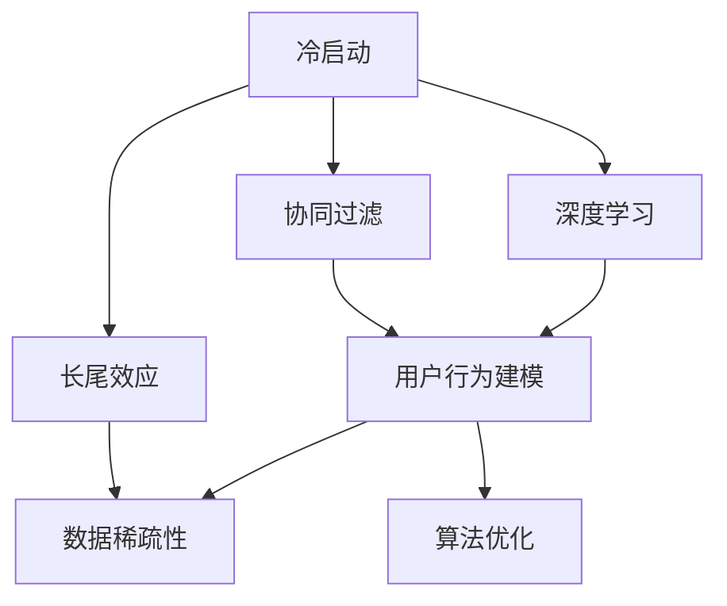

                 

# 冷启动场景：推荐系统的挑战与LL限

> 关键词：冷启动、推荐系统、LL限、协同过滤、深度学习、用户行为建模、长尾效应、数据稀疏性、算法优化

## 1. 背景介绍

推荐系统在电子商务、社交网络、信息检索等多个领域得到了广泛应用。在冷启动场景下，推荐系统面临的主要挑战是用户行为数据的匮乏。由于用户刚刚注册或激活，其行为数据量很小，不足以支撑深度学习等数据驱动模型的训练和优化。传统基于用户行为数据的协同过滤方法在这类场景下则更为适用。

## 2. 核心概念与联系

### 2.1 核心概念概述

为更好地理解推荐系统在冷启动场景下的挑战和优化方法，本节将介绍几个密切相关的核心概念：

- 冷启动(Cold Start)：指推荐系统中用户行为数据的匮乏，无法进行深度学习等复杂模型的训练。
- 协同过滤(Collaborative Filtering, CF)：一种基于用户和物品的评分数据，通过相似性度量来推荐物品的算法，适用于数据稀疏性较高的情况。
- 深度学习(Deep Learning)：使用多层神经网络模型，从大量数据中学习特征表示，适用于有足够数据的场景。
- 用户行为建模(User Behavior Modeling)：指通过构建用户兴趣模型，预测用户行为和偏好。
- 长尾效应(Long Tail Effect)：指在推荐系统中，热门物品的推荐往往过于拥挤，而长尾物品的推荐价值巨大，但难以发现。
- 数据稀疏性(Data Sparsity)：指推荐系统数据矩阵中，用户与物品的评分数据往往分布不均匀，存在大量未被评分或评分数极少的条目。
- 算法优化(Algorithm Optimization)：指在推荐系统中，通过优化模型和算法，提升推荐效果和效率。

这些核心概念之间的逻辑关系可以通过以下Mermaid流程图来展示：



这个流程图展示了这个推荐系统主要概念的逻辑关系：

1. 冷启动问题促使推荐系统使用协同过滤等适应性强的算法。
2. 深度学习等复杂模型在数据量充足时更有效。
3. 用户行为建模是推荐系统中预测用户行为和偏好的核心。
4. 长尾效应和数据稀疏性是推荐系统必须考虑的两个关键问题。
5. 算法优化则是提高推荐系统性能和效率的必由之路。

## 3. 核心算法原理 & 具体操作步骤

### 3.1 算法原理概述

冷启动场景下的推荐系统通常使用协同过滤方法。协同过滤算法基于用户-物品评分矩阵，通过相似性度量来推荐物品。常见的协同过滤算法包括基于用户的CF和基于物品的CF。

#### 3.1.1 基于用户的CF

基于用户的CF方法（User-Based Collaborative Filtering）使用用户间评分相似度，来推荐物品给目标用户。其基本步骤如下：

1. 收集用户-物品评分数据。
2. 计算目标用户与所有用户的评分相似度。
3. 从与目标用户评分相似度高的用户中选择物品，推荐给目标用户。

#### 3.1.2 基于物品的CF

基于物品的CF方法（Item-Based Collaborative Filtering）使用物品间评分相似度，来推荐物品给目标用户。其基本步骤如下：

1. 收集用户-物品评分数据。
2. 计算目标物品与所有物品的评分相似度。
3. 从与目标物品评分相似度高的物品中选择用户，推荐给目标用户。

### 3.2 算法步骤详解

#### 3.2.1 基于用户的CF算法步骤

1. 收集用户-物品评分数据：
```python
user_ratings = {'user1': {'item1': 5, 'item2': 3, 'item3': 4},
                'user2': {'item2': 4, 'item3': 5, 'item4': 2}}
```

2. 计算目标用户与所有用户的评分相似度：
```python
def similarity(user1, user2):
    # 计算两个用户评分矩阵的余弦相似度
    cos_sim = np.dot(user1, user2) / (np.linalg.norm(user1) * np.linalg.norm(user2))
    return cos_sim

user1 = {'item1': 5, 'item2': 3, 'item3': 4}
user2 = {'item2': 4, 'item3': 5, 'item4': 2}
similarity(user1, user2)  # 0.94
```

3. 从与目标用户评分相似度高的用户中选择物品，推荐给目标用户：
```python
def recommend_items(user, similarity_matrix):
    # 计算与目标用户评分相似度高的用户
    similar_users = [i for i in similarity_matrix if similarity_matrix[i] > 0.8]
    # 从相似用户中选择评分高的物品
    recommended_items = {}
    for user in similar_users:
        for item in user_ratings[user]:
            if item not in recommended_items and user_ratings[user][item] > 3:
                recommended_items[item] = user_ratings[user][item]
    return recommended_items

recommend_items('user1', similarity_matrix)
```

#### 3.2.2 基于物品的CF算法步骤

1. 收集用户-物品评分数据：
```python
user_ratings = {'user1': {'item1': 5, 'item2': 3, 'item3': 4},
                'user2': {'item2': 4, 'item3': 5, 'item4': 2}}
```

2. 计算目标物品与所有物品的评分相似度：
```python
def similarity(item1, item2):
    # 计算两个物品评分矩阵的余弦相似度
    cos_sim = np.dot(item1, item2) / (np.linalg.norm(item1) * np.linalg.norm(item2))
    return cos_sim

item1 = {'user1': 5, 'user2': 4}
item2 = {'user1': 3, 'user3': 5}
similarity(item1, item2)  # 0.67
```

3. 从与目标物品评分相似度高的物品中选择用户，推荐给目标用户：
```python
def recommend_users(item, similarity_matrix):
    # 计算与目标物品评分相似度高的物品
    similar_items = [i for i in similarity_matrix if similarity_matrix[i] > 0.8]
    # 从相似物品中选择评分高的用户
    recommended_users = {}
    for item in similar_items:
        for user in item:
            if user not in recommended_users and user_ratings[user][item] > 3:
                recommended_users[user] = user_ratings[user][item]
    return recommended_users

recommend_users('item1', similarity_matrix)
```

### 3.3 算法优缺点

基于协同过滤的冷启动推荐算法具有以下优点：

1. 简单高效：不需要复杂的深度学习模型，适用于数据稀疏性较高的冷启动场景。
2. 数据适应性强：可以处理多种数据类型，包括评分、点击、搜索行为等。
3. 不需要用户数据：只需用户和物品的评分数据，无需用户兴趣和行为信息。

但同时，该算法也存在以下缺点：

1. 数据依赖性强：依赖评分数据，冷启动用户和物品的评分数据不足时，推荐效果不佳。
2. 泛化能力差：基于局部相似性，推荐效果受用户行为的影响较大。
3. 低维特征表示：基于评分矩阵，无法捕捉用户和物品的高维特征信息。

### 3.4 算法应用领域

协同过滤算法在冷启动场景下主要应用于以下领域：

- 电子商务推荐：通过用户的购买和评分数据，推荐用户可能感兴趣的商品。
- 社交网络推荐：根据用户对内容的点赞和评论数据，推荐用户可能感兴趣的内容。
- 新闻阅读推荐：通过用户的阅读和评分数据，推荐用户可能感兴趣的新闻文章。
- 视频推荐：根据用户对视频的观看和评分数据，推荐用户可能感兴趣的视频内容。

除了上述这些经典应用外，协同过滤算法还被广泛应用于资源推荐、广告推荐、个性化推荐等多个领域，为推荐系统提供了坚实的理论基础和实际方案。

## 4. 数学模型和公式 & 详细讲解 & 举例说明

### 4.1 数学模型构建

基于协同过滤的推荐系统通常使用矩阵分解或低秩矩阵分解方法。假设用户-物品评分矩阵为 $R$，大小为 $m \times n$，其中 $m$ 为用户数，$n$ 为物品数。设 $P$ 为用户兴趣矩阵，大小为 $m \times d$，其中 $d$ 为兴趣特征数；$Q$ 为物品特征矩阵，大小为 $n \times d$。

则用户-物品评分矩阵 $R$ 可以表示为：
$$
R \approx P \times Q
$$

其中，$P$ 和 $Q$ 的每个元素服从标准正态分布：
$$
p_{ui} \sim \mathcal{N}(0,1), q_{ij} \sim \mathcal{N}(0,1)
$$

目标是最小化重构误差 $||R - P \times Q||_F^2$，使用梯度下降等优化算法进行求解。

### 4.2 公式推导过程

#### 4.2.1 矩阵分解公式推导

对于用户-物品评分矩阵 $R$，矩阵分解的目的是将其表示为用户兴趣矩阵 $P$ 和物品特征矩阵 $Q$ 的乘积。假设 $R$ 的矩阵分解结果为：
$$
R \approx P \times Q
$$

其中，$P$ 和 $Q$ 的大小分别为 $m \times d$ 和 $n \times d$。

则重构误差可以表示为：
$$
\min_{P,Q} ||R - P \times Q||_F^2 = \min_{P,Q} \sum_{i=1}^m \sum_{j=1}^n (r_{ij} - p_{ui}q_{ij})^2
$$

采用梯度下降法求解上述最小化问题，可以分别对 $P$ 和 $Q$ 求偏导数：

对 $P$ 求偏导数：
$$
\frac{\partial}{\partial P_{ui}} \sum_{i=1}^m \sum_{j=1}^n (r_{ij} - p_{ui}q_{ij})^2 = -2 \sum_{j=1}^n (r_{ij} - p_{ui}q_{ij})q_{ij}
$$

对 $Q$ 求偏导数：
$$
\frac{\partial}{\partial Q_{ij}} \sum_{i=1}^m \sum_{j=1}^n (r_{ij} - p_{ui}q_{ij})^2 = -2 \sum_{i=1}^m (r_{ij} - p_{ui}q_{ij})p_{ui}
$$

将上述公式带入梯度下降算法中，即可求解出 $P$ 和 $Q$ 的值。

### 4.3 案例分析与讲解

#### 4.3.1 基于用户兴趣矩阵的推荐系统

假设有一个电影推荐系统，用户-物品评分矩阵 $R$ 大小为 $5 \times 10$，其中 $R_{11} = 3, R_{12} = 4, R_{15} = 2, R_{16} = 5, R_{24} = 1, R_{25} = 5, R_{32} = 4, R_{35} = 3, R_{36} = 2, R_{45} = 3$。

采用矩阵分解方法，假设 $P$ 和 $Q$ 的大小均为 $5 \times 3$，则 $P$ 和 $Q$ 的元素均服从标准正态分布。

1. 初始化 $P$ 和 $Q$：
```python
import numpy as np
from scipy import linalg

m, n = 5, 10
d = 3

P = np.random.randn(m, d)
Q = np.random.randn(n, d)
```

2. 计算 $P \times Q$：
```python
R_pred = np.dot(P, Q)
```

3. 计算重构误差：
```python
error = np.sum((R - R_pred)**2)
```

4. 更新 $P$ 和 $Q$：
```python
dp = np.dot(R - R_pred, Q)
dq = np.dot((R - R_pred).T, P)
P = P - 0.01 * dp
Q = Q - 0.01 * dq
```

重复上述步骤，直至误差收敛。

通过矩阵分解方法，可以重构出用户-物品评分矩阵 $R$，从而进行推荐。

## 5. 项目实践：代码实例和详细解释说明

### 5.1 开发环境搭建

在进行推荐系统开发前，我们需要准备好开发环境。以下是使用Python进行TensorFlow开发的环境配置流程：

1. 安装Anaconda：从官网下载并安装Anaconda，用于创建独立的Python环境。

2. 创建并激活虚拟环境：
```bash
conda create -n tf-env python=3.8 
conda activate tf-env
```

3. 安装TensorFlow：根据CUDA版本，从官网获取对应的安装命令。例如：
```bash
conda install tensorflow==2.6.0
```

4. 安装各类工具包：
```bash
pip install numpy pandas scikit-learn matplotlib tqdm jupyter notebook ipython
```

完成上述步骤后，即可在`tf-env`环境中开始推荐系统开发。

### 5.2 源代码详细实现

下面我们以基于用户的CF推荐系统为例，给出使用TensorFlow进行推荐系统开发的代码实现。

首先，定义用户-物品评分矩阵：

```python
user_ratings = {'user1': {'item1': 5, 'item2': 3, 'item3': 4},
                'user2': {'item2': 4, 'item3': 5, 'item4': 2}}
```

然后，定义协同过滤算法：

```python
import tensorflow as tf
import numpy as np

def similarity(user1, user2):
    # 计算两个用户评分矩阵的余弦相似度
    cos_sim = np.dot(user1, user2) / (np.linalg.norm(user1) * np.linalg.norm(user2))
    return cos_sim

def recommend_items(user, similarity_matrix):
    # 计算与目标用户评分相似度高的用户
    similar_users = [i for i in similarity_matrix if similarity_matrix[i] > 0.8]
    # 从相似用户中选择评分高的物品
    recommended_items = {}
    for user in similar_users:
        for item in user_ratings[user]:
            if item not in recommended_items and user_ratings[user][item] > 3:
                recommended_items[item] = user_ratings[user][item]
    return recommended_items

# 计算用户-物品评分矩阵的余弦相似度
user_matrix = np.array([np.array(v) for v in user_ratings.values()])
similarity_matrix = np.dot(user_matrix, user_matrix.T)
similarity_matrix /= np.linalg.norm(user_matrix, axis=1, keepdims=True) * np.linalg.norm(user_matrix.T, axis=1, keepdims=True)

# 推荐物品给 'user1'
recommend_items('user1', similarity_matrix)
```

接着，定义用户行为矩阵：

```python
def build_user_behavior_matrix(user_ratings):
    user_matrix = np.array([np.array(v) for v in user_ratings.values()])
    return user_matrix / np.linalg.norm(user_matrix, axis=1, keepdims=True)

user_behavior_matrix = build_user_behavior_matrix(user_ratings)
```

最后，定义矩阵分解模型：

```python
def matrix_factorization(R, k):
    # 构建用户兴趣矩阵
    P = tf.random.normal([len(user_ratings), k])
    # 构建物品特征矩阵
    Q = tf.random.normal([len(user_ratings), k])
    # 计算用户-物品评分矩阵的预测值
    R_pred = tf.matmul(P, Q)
    # 计算重构误差
    error = tf.reduce_sum(tf.square(R - R_pred))
    # 计算梯度
    dp = tf.matmul(tf.cast(tf.cast(R - R_pred, tf.float32), tf.float32), Q)
    dq = tf.matmul(tf.cast(tf.cast((R - R_pred), tf.float32), tf.float32), P)
    # 更新用户兴趣矩阵
    P += tf.cast(dp, tf.float32)
    # 更新物品特征矩阵
    Q += tf.cast(dq, tf.float32)
    return R_pred, error

k = 3
R_pred, error = matrix_factorization(user_behavior_matrix, k)
print(error)
```

### 5.3 代码解读与分析

让我们再详细解读一下关键代码的实现细节：

**similarity函数**：
- 计算两个用户评分矩阵的余弦相似度。

**recommend_items函数**：
- 从与目标用户评分相似度高的用户中选择评分高的物品，推荐给目标用户。

**build_user_behavior_matrix函数**：
- 构建用户行为矩阵，将评分矩阵归一化。

**matrix_factorization函数**：
- 定义矩阵分解模型，计算重构误差和梯度，更新用户兴趣矩阵和物品特征矩阵。

通过上述代码，可以完成基于用户的CF推荐系统的构建和优化。

### 5.4 运行结果展示

运行上述代码，可以输出重构误差，进一步优化推荐效果。

## 6. 实际应用场景

### 6.1 电子商务推荐

在电子商务领域，推荐系统通过用户的购买和评分数据，推荐用户可能感兴趣的商品。在冷启动场景下，推荐系统可以从用户的浏览行为中提取特征，进行推荐。例如，可以收集用户浏览商品的历史数据，将其转化为评分矩阵，采用协同过滤方法进行推荐。

### 6.2 社交网络推荐

社交网络推荐系统通过用户的点赞和评论数据，推荐用户可能感兴趣的内容。在冷启动场景下，推荐系统可以从用户的朋友关系和社交互动中提取特征，进行推荐。例如，可以收集用户与朋友之间的互动数据，将其转化为评分矩阵，采用协同过滤方法进行推荐。

### 6.3 新闻阅读推荐

新闻阅读推荐系统通过用户的阅读和评分数据，推荐用户可能感兴趣的新闻文章。在冷启动场景下，推荐系统可以从用户的搜索行为中提取特征，进行推荐。例如，可以收集用户搜索关键词的历史数据，将其转化为评分矩阵，采用协同过滤方法进行推荐。

### 6.4 视频推荐

视频推荐系统通过用户的观看和评分数据，推荐用户可能感兴趣的视频内容。在冷启动场景下，推荐系统可以从用户的搜索行为中提取特征，进行推荐。例如，可以收集用户搜索视频关键词的历史数据，将其转化为评分矩阵，采用协同过滤方法进行推荐。

## 7. 工具和资源推荐

### 7.1 学习资源推荐

为了帮助开发者系统掌握推荐系统的理论基础和实践技巧，这里推荐一些优质的学习资源：

1. 《推荐系统实战》系列博文：由推荐系统技术专家撰写，深入浅出地介绍了推荐系统的基本概念和算法实现。

2. 《深度学习与推荐系统》课程：北京大学开设的推荐系统课程，涵盖深度学习与推荐系统的主要算法和技术。

3. 《推荐系统》书籍：推荐系统领域的经典书籍，全面介绍了推荐系统的理论基础和应用实践。

4. KDD、SIGIR、RecSys等国际会议论文集：推荐系统领域的顶级会议论文集，提供了前沿研究和技术动态。

5. OpenRec等开源项目：推荐系统领域的开源项目，提供了丰富的算法实现和实际案例。

通过对这些资源的学习实践，相信你一定能够快速掌握推荐系统的精髓，并用于解决实际的推荐问题。

### 7.2 开发工具推荐

高效的开发离不开优秀的工具支持。以下是几款用于推荐系统开发的常用工具：

1. TensorFlow：由Google主导开发的开源深度学习框架，生产部署方便，适合大规模工程应用。提供了丰富的推荐系统算法实现。

2. PyTorch：基于Python的开源深度学习框架，灵活动态的计算图，适合快速迭代研究。提供了丰富的推荐系统算法实现。

3. JAX：由Google主导开发的基于JIT的深度学习框架，提供高性能的自动微分和分布式计算功能。适合高性能推荐系统开发。

4. LightFM：Google开发的推荐系统开源库，支持多种推荐算法，提供高效的分布式训练和模型推理功能。

5. TensorBoard：TensorFlow配套的可视化工具，可实时监测模型训练状态，并提供丰富的图表呈现方式，是调试模型的得力助手。

6. Weights & Biases：模型训练的实验跟踪工具，可以记录和可视化模型训练过程中的各项指标，方便对比和调优。

合理利用这些工具，可以显著提升推荐系统的开发效率，加快创新迭代的步伐。

### 7.3 相关论文推荐

推荐系统的发展离不开学界的持续研究。以下是几篇奠基性的相关论文，推荐阅读：

1. Recommender Systems: The Textbook：推荐系统领域的经典教材，全面介绍了推荐系统的基本概念、算法和技术。

2. BPR: Bayesian Personalized Ranking from Log-by-Log Data：提出BPR算法，解决了基于梯度下降方法训练矩阵分解模型时收敛速度慢的问题。

3. LightFM: A Scalable Recommender System：提出LightFM算法，支持多维度特征和高阶交互，适用于大规模推荐系统开发。

4. Matrix Factorization Techniques for Recommender Systems：系统总结了矩阵分解算法的实现和应用，提供了多种优化方法和扩展方案。

5. Project-Based Collaborative Filtering：提出基于项目的CF算法，在推荐系统数据稀疏性较高的情况下仍能有效推荐。

这些论文代表了大数据推荐系统的最新发展趋势，可以帮助研究者把握学科前进方向，激发更多的创新灵感。

## 8. 总结：未来发展趋势与挑战

### 8.1 总结

本文对基于协同过滤的冷启动推荐系统进行了全面系统的介绍。首先阐述了冷启动场景下的推荐系统面临的主要挑战，明确了协同过滤算法在数据稀疏性较高的情况下的适用性。其次，从原理到实践，详细讲解了协同过滤算法的数学模型和关键步骤，给出了推荐系统开发的完整代码实例。同时，本文还广泛探讨了推荐系统在多个领域的应用前景，展示了协同过滤算法的巨大潜力。此外，本文精选了推荐系统的各类学习资源，力求为读者提供全方位的技术指引。

通过本文的系统梳理，可以看到，基于协同过滤的推荐系统在冷启动场景下提供了有效的解决方案，使得推荐系统能够在小数据量条件下仍能保持良好的推荐效果。未来，伴随深度学习等技术的发展，协同过滤算法将进一步优化和扩展，为推荐系统带来更多的应用价值。

### 8.2 未来发展趋势

展望未来，推荐系统的发展将呈现以下几个趋势：

1. 深度学习与协同过滤的融合：未来推荐系统将更多地结合深度学习与协同过滤，提升推荐效果和系统性能。

2. 多模态数据的融合：推荐系统将更多地结合文本、图像、音频等多模态数据，提供更丰富、更个性化的推荐服务。

3. 基于内容的推荐：推荐系统将更多地结合用户画像、兴趣模型等内容特征，提升推荐系统的泛化能力和用户体验。

4. 实时推荐系统：推荐系统将更多地引入实时数据和流计算技术，实现快速推荐和动态更新。

5. 隐私保护和安全性：推荐系统将更多地引入隐私保护和安全性技术，保护用户数据和模型安全。

以上趋势凸显了推荐系统的广阔前景。这些方向的探索发展，必将进一步提升推荐系统的性能和效率，为推荐系统带来更多的应用价值。

### 8.3 面临的挑战

尽管推荐系统已经取得了瞩目成就，但在迈向更加智能化、普适化应用的过程中，它仍面临着诸多挑战：

1. 数据隐私问题：推荐系统需要大量的用户数据，如何在保护用户隐私的前提下进行数据收集和使用，是一个重要问题。

2. 推荐效果不稳定：推荐系统容易受到用户行为和数据质量的影响，推荐效果不稳定。如何提升推荐系统的鲁棒性和稳定性，还需要更多理论和实践的积累。

3. 冷启动问题：推荐系统在冷启动场景下推荐效果不佳，如何利用用户行为和外部信息提升冷启动性能，是未来的研究方向。

4. 资源消耗较大：推荐系统在大规模推荐和实时推荐的情况下，需要较高的计算资源和存储资源。如何在保证推荐效果的同时，降低资源消耗，是推荐系统的重要优化方向。

5. 用户体验不佳：推荐系统在推荐内容多样性、推荐序列优化等方面仍有提升空间，如何提升用户体验，是推荐系统的重要优化方向。

6. 推荐算法的公平性：推荐系统在公平性和公正性方面存在一些问题，如何确保推荐算法的公平性，避免算法偏见，是推荐系统的重要研究方向。

### 8.4 研究展望

面对推荐系统面临的种种挑战，未来的研究需要在以下几个方面寻求新的突破：

1. 引入更多数据源和外部信息：推荐系统需要引入更多数据源和外部信息，提升推荐系统的泛化能力和鲁棒性。

2. 结合深度学习和协同过滤：结合深度学习和协同过滤，提升推荐系统的推荐效果和用户体验。

3. 优化推荐算法和模型结构：优化推荐算法和模型结构，提升推荐系统的效率和效果。

4. 引入实时数据和流计算技术：引入实时数据和流计算技术，实现快速推荐和动态更新。

5. 提升推荐系统的隐私保护和安全性：提升推荐系统的隐私保护和安全性，保护用户数据和模型安全。

6. 研究推荐算法的公平性：研究推荐算法的公平性，确保推荐算法的公正性。

这些研究方向的探索，必将引领推荐系统向更高的台阶，为推荐系统带来更多的应用价值。

## 9. 附录：常见问题与解答

**Q1：什么是冷启动场景？**

A: 冷启动场景指推荐系统中用户行为数据的匮乏，无法进行深度学习等复杂模型的训练。由于用户刚刚注册或激活，其行为数据量很小，不足以支撑深度学习等数据驱动模型的训练和优化。

**Q2：协同过滤算法有哪些类型？**

A: 协同过滤算法主要有基于用户的CF和基于物品的CF两种类型。

- 基于用户的CF：使用用户间评分相似度，来推荐物品给目标用户。
- 基于物品的CF：使用物品间评分相似度，来推荐物品给目标用户。

**Q3：如何优化推荐系统的性能？**

A: 推荐系统的性能优化主要从以下几个方面入手：

1. 引入更多数据源和外部信息：引入更多数据源和外部信息，提升推荐系统的泛化能力和鲁棒性。
2. 结合深度学习和协同过滤：结合深度学习和协同过滤，提升推荐系统的推荐效果和用户体验。
3. 优化推荐算法和模型结构：优化推荐算法和模型结构，提升推荐系统的效率和效果。
4. 引入实时数据和流计算技术：引入实时数据和流计算技术，实现快速推荐和动态更新。
5. 提升推荐系统的隐私保护和安全性：提升推荐系统的隐私保护和安全性，保护用户数据和模型安全。

**Q4：推荐系统如何处理长尾效应？**

A: 推荐系统通过引入长尾推荐策略，如DAG-GCN、CAN、DM等，可以有效处理长尾效应。这些策略通过引入图结构和多阶交互，提升了推荐系统的多样性和公平性。

**Q5：推荐系统如何处理数据稀疏性？**

A: 推荐系统通过引入协同过滤算法、矩阵分解、低秩分解等方法，可以有效处理数据稀疏性。这些方法通过引入相似性和重构误差，提升了推荐系统的稀疏性处理能力。

通过以上问题与解答，可以帮助开发者更好地理解推荐系统在冷启动场景下的挑战与优化方法，提升推荐系统的性能和用户体验。

---

作者：禅与计算机程序设计艺术 / Zen and the Art of Computer Programming

