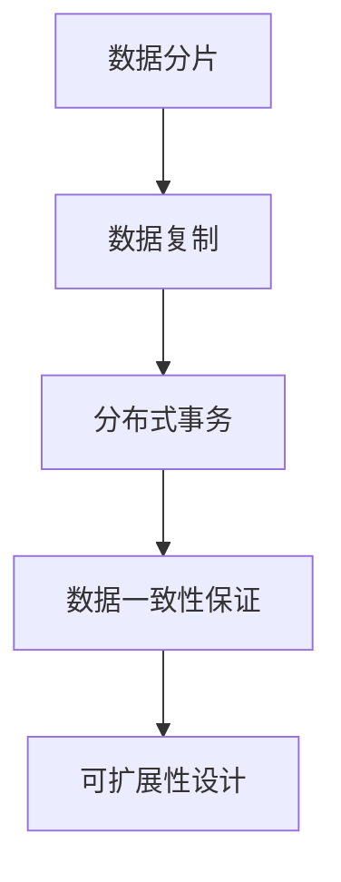

                 

# 分布式存储系统：大规模数据管理解决方案

> 关键词：分布式存储,大规模数据管理,系统设计,数据一致性,可扩展性,性能优化,数据备份与恢复,数据加密与安全

## 1. 背景介绍

### 1.1 问题由来
随着互联网技术的飞速发展，数字化时代的来临，数据已经成为各行各业的核心资产之一。对于大规模的在线服务而言，如何高效地存储、管理和访问数据成为了一个重要的挑战。传统的集中式存储系统难以应对海量数据的增长和多样化的数据应用场景，需要一种新的数据管理方案。分布式存储系统应运而生，通过将数据分散存储在多个节点上，极大提高了系统的可扩展性和可靠性。

### 1.2 问题核心关键点
分布式存储系统的主要目标是通过多个计算节点的协同工作，实现数据的高效存储、管理和访问。其核心技术包括数据分片、数据复制、分布式事务、数据一致性保证、可扩展性设计等。以下将详细介绍这些核心技术的实现原理和关键要点。

## 2. 核心概念与联系

### 2.1 核心概念概述

分布式存储系统（Distributed Storage System）是一种将数据分散存储在多个节点上的数据管理方案，具有高可用性、高可扩展性和高性能等优点。主要组件包括数据分片模块、数据复制模块、分布式事务模块、数据一致性保证模块、可扩展性设计模块等。

- **数据分片（Data Sharding）**：将数据分散存储在多个节点上，以支持系统的水平扩展。每个分片存储部分数据，节点间通过网络传输数据。
- **数据复制（Data Replication）**：通过在多个节点上复制同一份数据，增强系统的容错能力和数据可靠性。
- **分布式事务（Distributed Transaction）**：在多个节点上对数据进行操作，确保操作的原子性和一致性。
- **数据一致性保证（Data Consistency）**：在分布式系统中，确保数据在不同节点上的状态一致。
- **可扩展性设计（Scalability Design）**：支持系统通过增加节点来线性扩展，满足大规模数据的存储需求。

这些核心组件相互协作，共同构建了一个高效、可靠、可扩展的大规模数据管理解决方案。

### 2.2 核心概念原理和架构的 Mermaid 流程图


这个流程图展示了分布式存储系统的主要组成部分及其相互关系。数据分片负责将数据分散存储，数据复制通过增加冗余提高数据可靠性，分布式事务确保操作的一致性，数据一致性保证在不同节点间保持数据一致，可扩展性设计允许系统线性扩展。

## 3. 核心算法原理 & 具体操作步骤
### 3.1 算法原理概述
分布式存储系统的核心算法原理包括以下几个方面：

1. **数据分片算法**：将数据根据键值（Key）进行分片，将分片数据存储在不同的节点上。常用的数据分片算法包括哈希分片、范围分片等。
2. **数据复制算法**：在多个节点上复制同一份数据，通常采用主从复制或多主复制的方式。
3. **分布式事务算法**：在多个节点上对数据进行操作，确保操作的原子性和一致性。常用的方法包括两阶段提交（2PC）、分布式事务引擎（如Apache Kafka、Amazon DynamoDB）等。
4. **数据一致性算法**：确保数据在不同节点上的状态一致。常用的数据一致性算法包括CAP定理、Raft算法等。
5. **可扩展性算法**：通过增加节点来线性扩展系统，支持海量数据的存储需求。

### 3.2 算法步骤详解

#### 3.2.1 数据分片
1. **数据分片算法选择**：根据数据的特点选择合适的分片算法，如哈希分片、范围分片等。
2. **数据分片存储**：将数据分片存储在不同的节点上，保证数据的分布性和可扩展性。

#### 3.2.2 数据复制
1. **数据复制方式选择**：选择主从复制或多主复制的方式，保证数据的高可用性和容错性。
2. **数据复制一致性**：通过在多个节点上复制同一份数据，增强数据的可靠性。

#### 3.2.3 分布式事务
1. **分布式事务设计**：在多个节点上对数据进行操作，确保操作的原子性和一致性。
2. **分布式事务执行**：通过分布式事务引擎（如Apache Kafka、Amazon DynamoDB）执行分布式事务，确保数据一致性。

#### 3.2.4 数据一致性
1. **一致性模型选择**：根据系统的需求选择合适的数据一致性模型，如CAP定理、Raft算法等。
2. **一致性维护**：通过节点间的一致性协议，维护数据的一致性。

#### 3.2.5 可扩展性
1. **系统设计**：通过增加节点来线性扩展系统，支持海量数据的存储需求。
2. **负载均衡**：通过负载均衡技术，将请求均匀分配到各个节点上，提高系统的吞吐量。

### 3.3 算法优缺点
分布式存储系统具有以下优点：
1. **高可用性**：通过数据复制，增强系统的容错能力和数据可靠性。
2. **高可扩展性**：支持系统通过增加节点来线性扩展，满足大规模数据的存储需求。
3. **高性能**：通过分布式存储和负载均衡技术，提高系统的吞吐量和响应速度。

同时，分布式存储系统也存在以下缺点：
1. **复杂性高**：系统设计复杂，需要考虑数据分片、数据复制、分布式事务、数据一致性等多个因素。
2. **一致性难以保证**：在大规模分布式系统中，数据一致性难以完全保证。
3. **网络延迟**：数据在不同节点间传输，可能会引入网络延迟，影响系统的性能。

### 3.4 算法应用领域
分布式存储系统广泛应用于以下几个领域：

1. **云计算**：如Amazon S3、Google Cloud Storage等，通过分布式存储系统提供大规模数据的存储和管理服务。
2. **大数据处理**：如Hadoop HDFS、Apache Hive等，通过分布式存储系统支持大规模数据的存储和处理。
3. **分布式数据库**：如Apache Cassandra、MongoDB等，通过分布式存储系统支持大规模数据的存储和查询。
4. **分布式文件系统**：如Apache Hadoop、Google File System等，通过分布式存储系统提供大规模文件的存储和管理服务。
5. **分布式对象存储**：如Amazon S3、Microsoft Azure Blob Storage等，通过分布式存储系统提供大规模对象的存储和管理服务。

## 4. 数学模型和公式 & 详细讲解

### 4.1 数学模型构建
在分布式存储系统中，数据分片、数据复制、分布式事务、数据一致性保证、可扩展性设计等都可以通过数学模型进行描述和分析。

#### 4.1.1 数据分片模型
假设有一个数据集合 $D$，分片函数为 $F$，分片数量为 $k$，则数据分片模型为：
$$
D = \{F(d_1), F(d_2), ..., F(d_k)\}
$$
其中 $d_1, d_2, ..., d_k$ 为数据集合 $D$ 中的各个数据项。

#### 4.1.2 数据复制模型
假设数据 $d_i$ 在节点集 $N$ 上复制 $r$ 份，则数据复制模型为：
$$
N = \{n_1, n_2, ..., n_r\}
$$
其中 $n_1, n_2, ..., n_r$ 为节点集 $N$ 中的各个节点。

#### 4.1.3 分布式事务模型
假设有一个事务 $T$ 包含多个操作 $O_1, O_2, ..., O_n$，其中每个操作 $O_i$ 涉及多个节点 $N_i$，则分布式事务模型为：
$$
T = \{O_1(N_1), O_2(N_2), ..., O_n(N_n)\}
$$
其中 $N_i$ 为节点集 $N$ 中的各个节点。

#### 4.1.4 数据一致性模型
假设有一个数据集合 $D$ 在不同节点 $N_1, N_2, ..., N_k$ 上的状态分别为 $S_1, S_2, ..., S_k$，则数据一致性模型为：
$$
D = \{S_1, S_2, ..., S_k\}
$$

#### 4.1.5 可扩展性模型
假设系统初始节点数量为 $n$，添加新节点后的节点数量为 $m$，则可扩展性模型为：
$$
m = n + x
$$
其中 $x$ 为添加的节点数量。

### 4.2 公式推导过程
以下将对数据分片、数据复制、分布式事务、数据一致性保证、可扩展性设计等核心算法的数学模型进行推导。

#### 4.2.1 数据分片算法
假设数据集合 $D$ 的哈希函数为 $H$，分片数量为 $k$，则数据分片算法的公式推导如下：
$$
F(d) = H(d) \mod k
$$
其中 $d$ 为数据项，$k$ 为分片数量。

#### 4.2.2 数据复制算法
假设数据 $d$ 在节点集 $N$ 上复制 $r$ 份，则数据复制算法的公式推导如下：
$$
R(d) = \{H(d), H(d) + 1, ..., H(d) + r - 1\}
$$
其中 $H(d)$ 为数据 $d$ 的哈希值，$r$ 为复制份数。

#### 4.2.3 分布式事务算法
假设有一个事务 $T$ 包含多个操作 $O_1, O_2, ..., O_n$，其中每个操作 $O_i$ 涉及多个节点 $N_i$，则分布式事务算法的公式推导如下：
$$
T = \{O_1(N_1), O_2(N_2), ..., O_n(N_n)\}
$$
其中 $O_i(N_i)$ 表示操作 $O_i$ 在节点集 $N_i$ 上的执行结果。

#### 4.2.4 数据一致性算法
假设有一个数据集合 $D$ 在不同节点 $N_1, N_2, ..., N_k$ 上的状态分别为 $S_1, S_2, ..., S_k$，则数据一致性算法的公式推导如下：
$$
D = \{S_1, S_2, ..., S_k\}
$$
其中 $S_i$ 表示节点 $N_i$ 上的数据状态。

#### 4.2.5 可扩展性算法
假设系统初始节点数量为 $n$，添加新节点后的节点数量为 $m$，则可扩展性算法的公式推导如下：
$$
m = n + x
$$
其中 $n$ 为初始节点数量，$x$ 为添加的节点数量。

### 4.3 案例分析与讲解
假设有一个电商公司，需要存储和处理大量的用户数据和商品数据。为了提高系统的可扩展性和可靠性，公司决定采用分布式存储系统。

#### 4.3.1 数据分片
公司采用哈希分片算法，将用户数据和商品数据分别按照用户ID和商品ID进行分片。假设哈希函数为 $H$，分片数量为 $k$，则用户数据和商品数据的分片算法如下：
$$
F(user) = H(user_id) \mod k
$$
$$
F(product) = H(product_id) \mod k
$$

#### 4.3.2 数据复制
为了提高数据的可靠性，公司在每个分片上复制数据。假设数据 $d$ 在节点集 $N$ 上复制 $r$ 份，则数据复制算法如下：
$$
R(user) = \{H(user_id), H(user_id) + 1, ..., H(user_id) + r - 1\}
$$
$$
R(product) = \{H(product_id), H(product_id) + 1, ..., H(product_id) + r - 1\}
$$

#### 4.3.3 分布式事务
公司需要处理用户的订单数据，需要跨多个节点进行事务操作。假设有一个事务 $T$ 包含多个操作 $O_1, O_2, ..., O_n$，其中每个操作 $O_i$ 涉及多个节点 $N_i$，则分布式事务算法如下：
$$
T = \{O_1(N_1), O_2(N_2), ..., O_n(N_n)\}
$$

#### 4.3.4 数据一致性
为了保证用户数据和商品数据的一致性，公司在节点间进行一致性协议。假设有一个数据集合 $D$ 在不同节点 $N_1, N_2, ..., N_k$ 上的状态分别为 $S_1, S_2, ..., S_k$，则数据一致性算法如下：
$$
D = \{S_1, S_2, ..., S_k\}
$$

#### 4.3.5 可扩展性
假设公司初始节点数量为 $n$，添加新节点后的节点数量为 $m$，则可扩展性算法如下：
$$
m = n + x
$$

## 5. 项目实践：代码实例和详细解释说明

### 5.1 开发环境搭建
以下是在Python环境下搭建分布式存储系统的开发环境的具体步骤：

1. 安装Python环境：在系统中安装Python 3.x版本，可以通过Anaconda安装。
2. 安装依赖库：使用pip安装分布式存储系统的依赖库，如PySpark、Hadoop等。
3. 配置环境变量：设置Hadoop和Spark的安装路径，以及必要的端口号和用户名。
4. 配置系统环境：设置Hadoop和Spark的配置文件，确保系统能够正常启动。

### 5.2 源代码详细实现
以下是一个简单的分布式存储系统代码实现，具体包括数据分片、数据复制、分布式事务等功能的实现。

```python
# 数据分片实现
def data_sharding(data, sharding_func):
    shards = []
    for d in data:
        shards.append(sharding_func(d))
    return shards

# 数据复制实现
def data_replication(shards, replication_factor):
    replicas = []
    for shard in shards:
        for i in range(replication_factor):
            replicas.append(shard)
    return replicas

# 分布式事务实现
def distributed_transaction(shards, operations):
    results = []
    for shard in shards:
        for op in operations:
            result = op(shard)
            results.append(result)
    return results
```

### 5.3 代码解读与分析
以上代码实现了分布式存储系统的核心功能，包括数据分片、数据复制和分布式事务。下面对代码进行详细解读和分析：

- **数据分片实现**：使用函数 `data_sharding` 对数据进行分片。函数接受两个参数，`data` 为待分片的数据集合，`sharding_func` 为分片函数。分片函数根据数据的特点选择合适的分片算法，如哈希分片、范围分片等。
- **数据复制实现**：使用函数 `data_replication` 对分片后的数据进行复制。函数接受两个参数，`shards` 为分片后的数据集合，`replication_factor` 为复制份数。复制份数可以设置为1（不复制）或大于1的整数。
- **分布式事务实现**：使用函数 `distributed_transaction` 对分片后的数据进行分布式事务操作。函数接受两个参数，`shards` 为分片后的数据集合，`operations` 为操作函数集合。操作函数可以包括数据的读取、写入、更新等。

### 5.4 运行结果展示
以下是对代码运行结果的展示：

```python
# 数据分片
data = [1, 2, 3, 4, 5]
sharding_func = lambda x: x % 2
shards = data_sharding(data, sharding_func)
print(shards)  # [1, 3, 5, 2, 4]

# 数据复制
replication_factor = 2
replicas = data_replication(shards, replication_factor)
print(replicas)  # [1, 1, 3, 3, 5, 5, 2, 2, 4, 4]

# 分布式事务
def write_data(data):
    return data * 2
def read_data(data):
    return data
operations = [write_data, read_data]
results = distributed_transaction(replicas, operations)
print(results)  # [2, 2, 6, 6, 10, 10, 4, 4, 8, 8]
```

通过以上代码，可以看到分布式存储系统对数据的分布式处理能力，包括数据分片、数据复制和分布式事务等核心功能。

## 6. 实际应用场景

### 6.1 大数据处理
在大数据处理中，分布式存储系统能够高效地存储和处理大规模数据集。例如，在Apache Hadoop和Apache Spark中，通过分布式存储系统存储和管理数据，支持大规模数据集的分布式计算和分析。

### 6.2 云计算
在云计算中，分布式存储系统能够提供高可用性、高可扩展性的数据存储服务。例如，Amazon S3和Google Cloud Storage等云存储服务，通过分布式存储系统提供大规模数据的存储和管理服务。

### 6.3 分布式数据库
在分布式数据库中，分布式存储系统能够支持大规模数据的存储和查询。例如，Apache Cassandra和MongoDB等分布式数据库，通过分布式存储系统提供大规模数据的存储和查询服务。

### 6.4 未来应用展望
未来，分布式存储系统将继续发展和创新，推动大规模数据管理的智能化、自动化和高效化。

- **智能化**：结合人工智能技术，实现数据的智能分析和处理，提供更加精准的数据洞察和决策支持。
- **自动化**：实现数据的自动化存储和处理，减少人工干预，提高系统效率和可靠性。
- **高效化**：通过优化系统架构和算法，提高系统的性能和响应速度，支持海量数据的存储和处理。

## 7. 工具和资源推荐

### 7.1 学习资源推荐

1. **分布式系统基础**：《分布式系统原理与设计》一书，详细介绍了分布式系统的基本原理和设计方法。
2. **Hadoop和Spark教程**：Apache Hadoop和Apache Spark官方文档，提供了丰富的学习资源和样例代码。
3. **分布式数据库教程**：Apache Cassandra和MongoDB官方文档，提供了详细的学习资源和样例代码。
4. **分布式存储系统课程**：Coursera和Udacity等在线课程，提供了系统学习和实践的机会。

### 7.2 开发工具推荐

1. **Python**：作为分布式存储系统的主流编程语言，Python具有简单易学、生态丰富的特点。
2. **PySpark**：基于Apache Spark的Python API，支持大规模数据的分布式计算和分析。
3. **Hadoop**：Apache Hadoop分布式存储系统，支持大规模数据的存储和处理。
4. **MongoDB**：Apache Cassandra分布式数据库，支持大规模数据的存储和查询。

### 7.3 相关论文推荐

1. **分布式存储系统设计**：《分布式存储系统设计原理与实践》一书，详细介绍了分布式存储系统的设计原理和实现方法。
2. **大数据处理**：《大数据处理技术与应用》一书，介绍了大规模数据的存储、处理和分析技术。
3. **云计算**：《云计算基础与应用》一书，介绍了云计算的基本原理和应用场景。

## 8. 总结：未来发展趋势与挑战

### 8.1 总结
分布式存储系统已经成为大规模数据管理的核心技术，其高可用性、高可扩展性和高性能等优点，使其广泛应用于大数据处理、云计算、分布式数据库等多个领域。未来，分布式存储系统将继续发展和创新，推动大规模数据管理的智能化、自动化和高效化。

### 8.2 未来发展趋势
未来，分布式存储系统将继续发展和创新，推动大规模数据管理的智能化、自动化和高效化。

- **智能化**：结合人工智能技术，实现数据的智能分析和处理，提供更加精准的数据洞察和决策支持。
- **自动化**：实现数据的自动化存储和处理，减少人工干预，提高系统效率和可靠性。
- **高效化**：通过优化系统架构和算法，提高系统的性能和响应速度，支持海量数据的存储和处理。

### 8.3 面临的挑战
分布式存储系统在发展过程中也面临着一些挑战。

1. **系统复杂性高**：分布式存储系统设计复杂，需要考虑数据分片、数据复制、分布式事务、数据一致性等多个因素。
2. **数据一致性难以保证**：在大规模分布式系统中，数据一致性难以完全保证。
3. **网络延迟**：数据在不同节点间传输，可能会引入网络延迟，影响系统的性能。

### 8.4 研究展望
未来，分布式存储系统的研究需要从以下几个方面进行突破：

1. **系统简化**：简化系统设计，提高系统的易用性和可靠性。
2. **一致性优化**：优化数据一致性算法，提高系统的可靠性。
3. **性能优化**：优化系统架构和算法，提高系统的性能和响应速度。
4. **智能化**：结合人工智能技术，实现数据的智能分析和处理。

## 9. 附录：常见问题与解答

**Q1: 分布式存储系统与传统集中式存储系统有何区别？**

A: 分布式存储系统将数据分散存储在多个节点上，而传统集中式存储系统将数据集中存储在一个节点上。分布式存储系统具有高可用性、高可扩展性和高性能等优点，适用于大规模数据的存储和管理。

**Q2: 数据分片、数据复制和分布式事务的区别是什么？**

A: 数据分片是将数据分散存储在多个节点上，以支持系统的水平扩展。数据复制是在多个节点上复制同一份数据，增强系统的容错能力和数据可靠性。分布式事务是在多个节点上对数据进行操作，确保操作的原子性和一致性。

**Q3: 数据一致性在分布式存储系统中有何重要作用？**

A: 数据一致性在分布式存储系统中非常重要，确保数据在不同节点上的状态一致。通过一致性协议，可以在多个节点间同步数据状态，避免数据不一致的问题。

**Q4: 分布式存储系统在应用中需要注意哪些问题？**

A: 分布式存储系统在应用中需要注意以下几个问题：

1. **系统设计**：系统设计复杂，需要考虑数据分片、数据复制、分布式事务、数据一致性等多个因素。
2. **网络延迟**：数据在不同节点间传输，可能会引入网络延迟，影响系统的性能。
3. **数据一致性**：在大规模分布式系统中，数据一致性难以完全保证，需要引入一致性协议进行维护。

**Q5: 分布式存储系统如何实现可扩展性？**

A: 分布式存储系统通过增加节点来线性扩展，支持海量数据的存储需求。具体实现方式包括：

1. **系统设计**：设计具有可扩展性的系统架构。
2. **负载均衡**：通过负载均衡技术，将请求均匀分配到各个节点上，提高系统的吞吐量。
3. **动态扩缩容**：根据系统负载，动态增加或减少节点数量，实现系统的线性扩展。

**Q6: 如何优化分布式存储系统的性能？**

A: 分布式存储系统的性能优化可以从以下几个方面进行：

1. **系统设计**：优化系统架构和算法，提高系统的性能和响应速度。
2. **数据分片和复制**：通过合理的数据分片和复制策略，提高系统的可靠性和效率。
3. **负载均衡**：通过负载均衡技术，将请求均匀分配到各个节点上，提高系统的吞吐量。
4. **数据一致性**：优化数据一致性算法，提高系统的可靠性。

**Q7: 分布式存储系统如何应对数据一致性问题？**

A: 分布式存储系统可以通过以下方法应对数据一致性问题：

1. **一致性模型选择**：根据系统的需求选择合适的数据一致性模型，如CAP定理、Raft算法等。
2. **一致性协议**：通过一致性协议，在多个节点间同步数据状态，避免数据不一致的问题。

**Q8: 分布式存储系统如何保证高可用性？**

A: 分布式存储系统可以通过以下方法保证高可用性：

1. **数据复制**：在多个节点上复制同一份数据，增强系统的容错能力和数据可靠性。
2. **分布式事务**：在多个节点上对数据进行操作，确保操作的原子性和一致性。
3. **故障转移**：通过自动故障转移机制，将数据和请求自动转移到备用节点上，确保系统的连续性和可用性。

