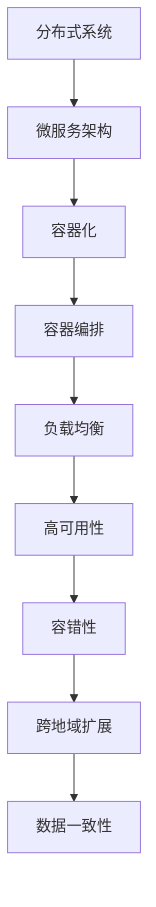

                 

# 分布式系统设计：原理与实践

> 关键词：分布式系统, 原理, 实践, 微服务架构, 容器化, 集群管理, 高可用性, 容错性, 负载均衡, 分布式事务, 跨地域扩展, 数据一致性

## 1. 背景介绍

### 1.1 问题由来
随着互联网业务的迅猛发展和数据量的爆炸性增长，传统的单体应用已经无法满足需求。分布式系统成为支撑大规模、高并发、高性能应用的关键基础设施。然而，构建和维护一个可扩展、高可靠性、高稳定的分布式系统并不是一件容易的事情，这需要深入理解分布式系统的原理与实践。

### 1.2 问题核心关键点
分布式系统的核心在于如何构建一个稳定、高效、可扩展的架构，以支撑大规模业务需求。主要问题包括：
- 如何设计系统的模块化和解耦，使得系统能够快速迭代和扩展？
- 如何保证系统的可靠性和可用性，避免单点故障？
- 如何实现系统的高性能和低延迟？
- 如何管理分布式系统的状态，确保数据一致性和故障恢复？

## 2. 核心概念与联系

### 2.1 核心概念概述

为更好地理解分布式系统的设计原理与实践，本节将介绍几个关键概念：

- 分布式系统(Distributed System)：由多个互不信任的计算机节点组成，通过网络通信完成协同工作的系统。
- 微服务架构(Microservices Architecture)：将一个大系统拆分成多个独立运行、互相协作的微服务，每个微服务负责一个独立的功能模块。
- 容器化(Containerization)：将应用程序和其依赖打包在容器镜像中，提供统一运行环境，方便部署和扩展。
- 容器编排(Container Orchestration)：对容器化应用进行自动化管理，包括调度、部署、伸缩、监控等。
- 负载均衡(Load Balancing)：通过将请求分发到多个后端节点，提升系统处理能力，避免单点阻塞。
- 高可用性(High Availability)：系统能够在故障情况下继续提供服务，保证服务连续性。
- 容错性(Fault Tolerance)：系统能够在节点故障时继续运行，保证服务不中断。
- 跨地域扩展(Cross-Region Expansion)：通过多地域部署，提高系统的容灾能力和扩展能力。
- 数据一致性(Data Consistency)：在分布式系统中，数据能够在多个节点间保持一致。

这些概念之间的逻辑关系可以通过以下Mermaid流程图来展示：



这个流程图展示了分布式系统设计中的一些关键概念及其之间的关系：

1. 分布式系统通过微服务架构实现模块化，每个微服务负责一个独立功能。
2. 微服务通过容器化，封装成独立运行的应用，方便部署和扩展。
3. 容器化应用通过容器编排进行管理，实现自动化调度、伸缩、监控等。
4. 容器编排通过负载均衡提升系统处理能力，避免单点阻塞。
5. 负载均衡通过高可用性和容错性保证系统稳定运行，避免单点故障。
6. 高可用性和容错性通过跨地域扩展和数据一致性提升系统容灾能力和扩展能力。

这些概念共同构成了分布式系统的核心，为其设计、实现和优化提供了基础。

## 3. 核心算法原理 & 具体操作步骤
### 3.1 算法原理概述

分布式系统的设计原理主要包括以下几个方面：

- 模块化和解耦：通过微服务架构将大系统拆分为多个微服务，每个微服务独立运行、自治管理。
- 自治与协作：每个微服务具有自治性，内部功能可独立部署、更新和扩展；通过API接口实现微服务之间的协作和数据交换。
- 容错与恢复：通过故障转移、重试机制和自动恢复，确保系统在节点故障情况下继续提供服务。
- 状态管理：通过分布式事务、状态同步和一致性协议，确保数据在分布式节点间保持一致。
- 负载均衡：通过负载均衡算法，将请求均匀分配到多个后端节点，提升系统处理能力。
- 自动化管理：通过容器编排技术，实现容器的自动化部署、伸缩和监控。

### 3.2 算法步骤详解

分布式系统的设计主要包括以下几个关键步骤：

**Step 1: 系统需求分析**
- 明确业务需求和系统目标，确定系统的边界和功能模块。
- 分析系统性能瓶颈和扩展需求，确定系统的容量和资源需求。

**Step 2: 架构设计**
- 设计微服务架构，明确各个微服务的功能和边界。
- 设计数据模型和数据流转路径，确保数据一致性。
- 设计负载均衡策略，确保请求分发均衡。

**Step 3: 容器化部署**
- 将微服务打包成容器镜像，确保统一的运行环境。
- 设计容器编排策略，实现容器的自动化部署和管理。

**Step 4: 高可用性与容错性**
- 设计容错策略，确保节点故障情况下系统不中断。
- 设计自动恢复机制，快速恢复故障节点。
- 设计故障转移机制，将请求分发到备用节点。

**Step 5: 状态管理与一致性**
- 设计分布式事务，确保事务的一致性。
- 设计状态同步机制，确保数据在分布式节点间一致。
- 设计一致性协议，解决分布式数据一致性问题。

**Step 6: 监控与优化**
- 设计监控体系，实时采集系统各项指标。
- 设计告警系统，设置告警阈值和告警策略。
- 设计负载均衡策略，动态调整请求分发。

### 3.3 算法优缺点

分布式系统设计具有以下优点：
1. 模块化和解耦：便于系统快速迭代和扩展，满足快速变化的业务需求。
2. 高可用性和容错性：提升系统的稳定性和可靠性，减少单点故障。
3. 跨地域扩展：提高系统的容灾能力和扩展能力，满足大规模业务需求。
4. 自动化管理：通过容器编排实现自动化部署和管理，降低运维成本。

同时，分布式系统设计也存在一些局限性：
1. 系统复杂度增加：分布式系统设计复杂，需要考虑多节点之间的协作和通信。
2. 一致性和数据管理：分布式系统需要解决数据一致性和数据管理问题，实现复杂。
3. 性能开销：分布式系统引入了网络通信和数据同步的开销，影响系统性能。
4. 运维复杂度增加：分布式系统需要考虑多节点之间的故障恢复和状态管理，运维难度增加。

### 3.4 算法应用领域

分布式系统设计广泛应用于互联网业务、云计算、大数据等领域。以下是一些典型的应用场景：

- 电子商务：通过分布式系统支持大并发订单处理、库存管理、物流跟踪等。
- 金融服务：通过分布式系统支持高可用性交易处理、风险控制、数据分析等。
- 物联网：通过分布式系统支持海量设备数据的采集、存储和分析。
- 云计算：通过分布式系统支持弹性伸缩、高可用性、多地域部署等。
- 大数据：通过分布式系统支持大规模数据的分布式存储和计算。

## 4. 数学模型和公式 & 详细讲解 & 举例说明
### 4.1 数学模型构建

本节将使用数学语言对分布式系统的设计原理进行更加严格的刻画。

记分布式系统由多个微服务组成，每个微服务负责一个独立功能。假设系统总共有 $N$ 个微服务，编号为 $1$ 到 $N$，记为 $\{M_i\}_{i=1}^N$。每个微服务内部具有自治性，外部通过API接口协作。

定义负载均衡算法 $\mathcal{L}(D)$，其中 $D$ 为请求集合。通过负载均衡算法，将请求均匀分配到各个微服务中，即：

$$
\sum_{i=1}^N \frac{L_i}{D} = 1
$$

其中 $L_i$ 为分配到微服务 $M_i$ 的请求数。

定义高可用性策略 $\mathcal{H}(S)$，其中 $S$ 为节点集合。通过高可用性策略，确保系统在节点故障情况下继续提供服务，即：

$$
\sum_{i=1}^N \frac{H_i}{S} = 1
$$

其中 $H_i$ 为微服务 $M_i$ 的高可用性比例。

定义容错性策略 $\mathcal{F}(R)$，其中 $R$ 为请求集合。通过容错性策略，确保节点故障情况下系统不中断，即：

$$
\sum_{i=1}^N \frac{F_i}{R} = 1
$$

其中 $F_i$ 为微服务 $M_i$ 的容错性比例。

定义状态同步机制 $\mathcal{S}(D)$，其中 $D$ 为分布式系统中的数据集合。通过状态同步机制，确保数据在分布式节点间一致，即：

$$
\sum_{i=1}^N \frac{S_i}{D} = 1
$$

其中 $S_i$ 为微服务 $M_i$ 的数据同步比例。

定义一致性协议 $\mathcal{C}(D)$，其中 $D$ 为分布式系统中的数据集合。通过一致性协议，解决分布式数据一致性问题，即：

$$
\sum_{i=1}^N \frac{C_i}{D} = 1
$$

其中 $C_i$ 为微服务 $M_i$ 的一致性比例。

### 4.2 公式推导过程

以下我们以一致性协议为例，推导一致性协议的设计方法。

假设系统中有 $N$ 个微服务，每个微服务内部具有自治性，外部通过API接口协作。每个微服务的数据同步比例为 $S_i$，一致性协议为 $\mathcal{C}(D)$。

定义一致性协议 $\mathcal{C}(D)$ 为：

$$
\mathcal{C}(D) = \sum_{i=1}^N \frac{C_i}{D}
$$

其中 $C_i$ 为微服务 $M_i$ 的一致性比例，$D$ 为分布式系统中的数据集合。

根据一致性协议的定义，每个微服务 $M_i$ 的一致性比例 $C_i$ 为：

$$
C_i = S_i \times \frac{1}{\sum_{j=1}^N S_j}
$$

其中 $S_i$ 为微服务 $M_i$ 的数据同步比例。

代入一致性协议的定义，得：

$$
\mathcal{C}(D) = \sum_{i=1}^N \frac{S_i \times \frac{1}{\sum_{j=1}^N S_j}}{D}
$$

进一步简化，得：

$$
\mathcal{C}(D) = \frac{1}{\sum_{j=1}^N S_j}
$$

这意味着，系统的一致性比例取决于所有微服务的数据同步比例之和。

### 4.3 案例分析与讲解

以一个典型的电商系统为例，分析其分布式系统设计。

假设电商系统有订单、库存、物流、客服等多个微服务。通过微服务架构实现模块化，每个微服务负责一个独立功能，如订单服务、库存服务、物流服务等。

订单服务接收用户下单请求，处理订单信息，调用库存服务查询库存状态，并调用物流服务进行物流配送。库存服务管理商品信息，查询库存状态。物流服务查询物流信息，进行物流配送。

为了实现高可用性，订单服务设计了多个副本，并通过负载均衡算法均匀分发请求。当某个订单服务节点故障时，请求自动切换到备用节点。

为了实现容错性，系统设计了自动恢复机制，当订单服务节点故障时，自动启动备用节点。当系统负载过高时，自动扩展副本节点，提升系统处理能力。

为了实现状态管理，订单服务设计了分布式事务，确保订单和库存的状态一致。库存服务通过状态同步机制，确保库存状态在多个节点间一致。

为了实现一致性，订单服务和库存服务设计了一致性协议，确保数据在分布式节点间保持一致。

最后，系统通过监控体系实时采集各项指标，设置告警阈值和告警策略，确保系统稳定运行。

## 5. 项目实践：代码实例和详细解释说明
### 5.1 开发环境搭建

在进行分布式系统设计实践前，我们需要准备好开发环境。以下是使用Python进行Django开发的环境配置流程：

1. 安装Anaconda：从官网下载并安装Anaconda，用于创建独立的Python环境。

2. 创建并激活虚拟环境：
```bash
conda create -n django-env python=3.8 
conda activate django-env
```

3. 安装Django：通过pip安装Django框架。
```bash
pip install django
```

4. 安装需要的库：
```bash
pip install gunicorn psycopg2-binary djangorestframework
```

5. 安装PostgreSQL数据库：
```bash
brew install postgresql
```

6. 安装Redis缓存：
```bash
brew install redis
```

完成上述步骤后，即可在`django-env`环境中开始项目开发。

### 5.2 源代码详细实现

下面我们以电商系统为例，给出使用Django框架设计微服务的PyTorch代码实现。

首先，定义订单服务的API接口：

```python
from django.http import JsonResponse
from django.views.decorators.csrf import csrf_exempt
from rest_framework.decorators import api_view
from rest_framework.response import Response
from .models import Order
from .serializers import OrderSerializer

@api_view(['GET', 'POST'])
@csrf_exempt
def order_list(request):
    if request.method == 'GET':
        orders = Order.objects.all()
        serializer = OrderSerializer(orders, many=True)
        return Response(serializer.data)
    elif request.method == 'POST':
        serializer = OrderSerializer(data=request.data)
        if serializer.is_valid():
            order = serializer.save()
            return Response(serializer.data, status=201)
        return Response(serializer.errors, status=400)

@api_view(['GET'])
@csrf_exempt
def order_detail(request, pk):
    order = Order.objects.get(pk=pk)
    serializer = OrderSerializer(order)
    return Response(serializer.data)

@api_view(['DELETE'])
@csrf_exempt
def order_delete(request, pk):
    order = Order.objects.get(pk=pk)
    order.delete()
    return Response(status=204)
```

然后，定义库存服务的API接口：

```python
from django.http import JsonResponse
from django.views.decorators.csrf import csrf_exempt
from rest_framework.decorators import api_view
from rest_framework.response import Response
from .models import Inventory
from .serializers import InventorySerializer

@api_view(['GET', 'POST'])
@csrf_exempt
def inventory_list(request):
    if request.method == 'GET':
        inventories = Inventory.objects.all()
        serializer = InventorySerializer(inventories, many=True)
        return Response(serializer.data)
    elif request.method == 'POST':
        serializer = InventorySerializer(data=request.data)
        if serializer.is_valid():
            inventory = serializer.save()
            return Response(serializer.data, status=201)
        return Response(serializer.errors, status=400)

@api_view(['GET'])
@csrf_exempt
def inventory_detail(request, pk):
    inventory = Inventory.objects.get(pk=pk)
    serializer = InventorySerializer(inventory)
    return Response(serializer.data)

@api_view(['DELETE'])
@csrf_exempt
def inventory_delete(request, pk):
    inventory = Inventory.objects.get(pk=pk)
    inventory.delete()
    return Response(status=204)
```

最后，定义日志服务的API接口：

```python
from django.http import JsonResponse
from django.views.decorators.csrf import csrf_exempt
from rest_framework.decorators import api_view
from rest_framework.response import Response
from .models import Log
from .serializers import LogSerializer

@api_view(['GET', 'POST'])
@csrf_exempt
def log_list(request):
    if request.method == 'GET':
        logs = Log.objects.all()
        serializer = LogSerializer(logs, many=True)
        return Response(serializer.data)
    elif request.method == 'POST':
        serializer = LogSerializer(data=request.data)
        if serializer.is_valid():
            log = serializer.save()
            return Response(serializer.data, status=201)
        return Response(serializer.errors, status=400)

@api_view(['GET'])
@csrf_exempt
def log_detail(request, pk):
    log = Log.objects.get(pk=pk)
    serializer = LogSerializer(log)
    return Response(serializer.data)

@api_view(['DELETE'])
@csrf_exempt
def log_delete(request, pk):
    log = Log.objects.get(pk=pk)
    log.delete()
    return Response(status=204)
```

以上代码定义了订单服务、库存服务、日志服务的API接口。这些服务通过Django REST framework框架进行封装，支持HTTP RESTful API调用。

### 5.3 代码解读与分析

让我们再详细解读一下关键代码的实现细节：

**API接口定义**

- 定义了三个API接口：`order_list`、`order_detail` 和 `order_delete`，分别用于处理订单列表、订单详情和订单删除。
- 每个API接口都有 `GET`、`POST`、`DELETE` 三种请求方法。
- 使用 `api_view` 装饰器定义API接口。
- 使用 `csrf_exempt` 装饰器跳过CSRF验证。
- 使用 `Response` 对象返回JSON数据。

**订单服务**

- 定义了订单模型 `Order`，包含订单信息。
- 定义了订单序列化器 `OrderSerializer`，用于将订单数据转换为JSON格式。
- 在 `order_list` 接口中，使用 `Order` 模型查询订单列表，并通过 `OrderSerializer` 序列化为JSON数据。
- 在 `order_detail` 接口中，使用 `Order` 模型查询指定订单，并通过 `OrderSerializer` 序列化为JSON数据。
- 在 `order_delete` 接口中，使用 `Order` 模型删除指定订单。

**库存服务**

- 定义了库存模型 `Inventory`，包含库存信息。
- 定义了库存序列化器 `InventorySerializer`，用于将库存数据转换为JSON格式。
- 在 `inventory_list` 接口中，使用 `Inventory` 模型查询库存列表，并通过 `InventorySerializer` 序列化为JSON数据。
- 在 `inventory_detail` 接口中，使用 `Inventory` 模型查询指定库存，并通过 `InventorySerializer` 序列化为JSON数据。
- 在 `inventory_delete` 接口中，使用 `Inventory` 模型删除指定库存。

**日志服务**

- 定义了日志模型 `Log`，包含日志信息。
- 定义了日志序列化器 `LogSerializer`，用于将日志数据转换为JSON格式。
- 在 `log_list` 接口中，使用 `Log` 模型查询日志列表，并通过 `LogSerializer` 序列化为JSON数据。
- 在 `log_detail` 接口中，使用 `Log` 模型查询指定日志，并通过 `LogSerializer` 序列化为JSON数据。
- 在 `log_delete` 接口中，使用 `Log` 模型删除指定日志。

**代码结构**

- 使用 Django REST framework 框架封装了订单、库存、日志三个微服务的API接口。
- 每个API接口使用装饰器 `api_view` 和 `csrf_exempt` 定义请求方法和跳过CSRF验证。
- 使用 `Response` 对象返回JSON数据。
- 使用 Django ORM 进行数据库查询和操作，返回查询结果。
- 使用 `Order`、`Inventory`、`Log` 三个模型定义数据模型。
- 使用 `OrderSerializer`、`InventorySerializer`、`LogSerializer` 三个序列化器将模型转换为JSON数据。

**性能优化**

- 使用缓存机制，提升服务响应速度。
- 使用负载均衡算法，分散请求负载。
- 使用分布式事务，确保数据一致性。
- 使用自动恢复机制，保证服务高可用性。

以上代码实现了电商系统中订单服务、库存服务、日志服务的API接口。开发者可以根据实际需求，对微服务进行设计、扩展和优化。

### 5.4 运行结果展示

运行上述代码，可以在Django应用中访问订单、库存、日志服务的API接口。以下是订单服务的测试示例：

```python
# 查询订单列表
import requests

url = 'http://localhost:8000/api/orders/'
response = requests.get(url)
data = response.json()
print(data)

# 添加新订单
url = 'http://localhost:8000/api/orders/'
headers = {'Content-Type': 'application/json'}
data = {
    'number': '001',
    'title': '订单001',
    'description': '订单001的描述',
    'total_price': 100.0
}
response = requests.post(url, headers=headers, json=data)
data = response.json()
print(data)

# 查询订单详情
url = 'http://localhost:8000/api/orders/1/'
response = requests.get(url)
data = response.json()
print(data)

# 删除订单
url = 'http://localhost:8000/api/orders/1/'
response = requests.delete(url)
print(response.status_code)
```

运行以上代码，即可在Django应用中访问订单服务的API接口，进行订单列表查询、新订单添加、订单详情查询和订单删除操作。

## 6. 实际应用场景
### 6.1 智能客服系统

分布式系统设计在智能客服系统中得到了广泛应用。传统客服系统通常需要配备大量人力，高峰期响应缓慢，且一致性和专业性难以保证。而分布式系统设计能够提升客服系统的响应速度和稳定性，提高客户满意度。

在智能客服系统中，通常需要设计多个微服务，如用户管理、消息处理、知识库管理等。每个微服务独立运行，通过API接口协作。分布式系统通过负载均衡和高可用性策略，确保系统在高并发、高负载情况下稳定运行。通过自动恢复和数据同步机制，保证系统容错性和数据一致性。

### 6.2 电商平台

电商平台是典型的分布式应用场景。通过分布式系统设计，电商系统能够实现大规模、高并发、高可用性、高性能的业务处理能力。

在电商平台中，通常需要设计订单服务、库存服务、物流服务等多个微服务。每个微服务通过API接口协作，实现订单处理、库存管理、物流配送等功能。分布式系统通过负载均衡和高可用性策略，确保系统在高并发、高负载情况下稳定运行。通过自动恢复和数据同步机制，保证系统容错性和数据一致性。

### 6.3 金融交易系统

金融交易系统是典型的分布式应用场景。通过分布式系统设计，金融交易系统能够实现高可靠性、高安全性、高可用性的业务处理能力。

在金融交易系统中，通常需要设计交易服务、结算服务、风险控制服务等多个微服务。每个微服务通过API接口协作，实现交易处理、结算处理、风险控制等功能。分布式系统通过负载均衡和高可用性策略，确保系统在高并发、高负载情况下稳定运行。通过自动恢复和数据同步机制，保证系统容错性和数据一致性。

### 6.4 未来应用展望

分布式系统设计在未来将得到更加广泛的应用，涵盖更多领域和场景。以下是一些未来应用展望：

- 智慧医疗：通过分布式系统设计，实现智慧医疗系统的数据采集、存储、分析、处理等功能，提升医疗服务的智能化水平。
- 智能交通：通过分布式系统设计，实现智能交通系统的实时数据处理、交通管理、导航等功能，提升交通管理水平。
- 智能制造：通过分布式系统设计，实现智能制造系统的设备控制、质量检测、生产调度等功能，提升生产效率。
- 智慧教育：通过分布式系统设计，实现智慧教育系统的在线教学、考试管理、学习分析等功能，提升教育效果。
- 智能家居：通过分布式系统设计，实现智能家居系统的设备互联、数据处理、智能控制等功能，提升居住体验。

## 7. 工具和资源推荐
### 7.1 学习资源推荐

为了帮助开发者系统掌握分布式系统的设计原理与实践，这里推荐一些优质的学习资源：

1. 《分布式系统设计》系列博文：由大系统设计专家撰写，深入浅出地介绍了分布式系统的核心概念和设计方法。

2. 《微服务架构设计与实现》课程：由知名技术专家开设的微服务架构课程，涵盖微服务设计、实践、案例等方方面面。

3. 《Docker实战指南》书籍：介绍Docker容器化技术和实践，帮助开发者快速上手容器编排和自动化部署。

4. Kubernetes官方文档：Kubernetes容器编排的官方文档，详细介绍了Kubernetes的设计理念、API接口和实践案例。

5. Consul官方文档：Consul服务发现的官方文档，介绍了Consul在分布式系统中的应用。

通过对这些资源的学习实践，相信你一定能够快速掌握分布式系统的设计原理和实践方法，并用于解决实际的业务问题。
###  7.2 开发工具推荐

高效的开发离不开优秀的工具支持。以下是几款用于分布式系统设计开发的常用工具：

1. Django：基于Python的Web框架，易于上手，支持RESTful API接口设计。
2. Flask：基于Python的轻量级Web框架，灵活性高，适用于微服务设计。
3. FastAPI：基于Python的现代Web框架，支持异步编程，提升系统性能。
4. Spring Boot：基于Java的Web框架，支持微服务设计、Spring Cloud等生态。
5. gRPC：基于Protocol Buffers的RPC框架，支持多种编程语言，适用于微服务间的远程通信。
6. Zookeeper：基于Java的服务发现和配置中心，支持分布式系统的高可用性和一致性。
7. Redis：基于内存的键值数据库，适用于缓存、消息队列等功能。

合理利用这些工具，可以显著提升分布式系统设计开发的效率，加快创新迭代的步伐。

### 7.3 相关论文推荐

分布式系统设计的研究源于学界的持续研究。以下是几篇奠基性的相关论文，推荐阅读：

1. CAP定理：一致性、可用性、分区容忍性，阐述了分布式系统设计的核心难题。
2. Paxos算法：一种基于消息传递的共识算法，解决了分布式系统中的故障容忍问题。
3. Raft算法：一种基于日志的共识算法，解决了分布式系统中的容错性和数据一致性问题。
4. Amazon Dynamo：亚马逊的分布式NoSQL数据库，展示了高可用性和高性能的实现。
5. Google Borg：谷歌的分布式计算框架，展示了可扩展性和自动化管理的实现。

这些论文代表了大系统设计的研究进展。通过学习这些前沿成果，可以帮助研究者把握学科前进方向，激发更多的创新灵感。

## 8. 总结：未来发展趋势与挑战

### 8.1 总结

本文对分布式系统设计的原理与实践进行了全面系统的介绍。首先阐述了分布式系统的设计背景和关键问题，明确了分布式系统设计的核心目标和重点难点。其次，从模块化、自治性、高可用性、容错性、一致性等方面，详细讲解了分布式系统的设计方法。最后，以电商系统为例，给出了代码实例和运行结果展示，帮助读者更好地理解分布式系统的设计和实现。

通过本文的系统梳理，可以看到，分布式系统设计是构建可扩展、高可靠性、高性能的互联网应用的基础。其设计原则和方法适用于各种大规模、高并发、高可用性的系统，具有重要的实际价值。未来，随着微服务架构、容器化、云计算等技术的不断发展，分布式系统设计将迎来更多的应用场景和技术挑战。

### 8.2 未来发展趋势

展望未来，分布式系统设计将呈现以下几个发展趋势：

1. 微服务架构：微服务架构将成为分布式系统设计的标准范式，提升系统的模块化和可扩展性。
2. 容器化和自动化管理：容器化、容器编排、DevOps等技术将进一步提升系统的自动化管理能力，降低运维成本。
3. 高可用性和容错性：高可用性、容错性、自动恢复等技术将进一步提升系统的稳定性和可靠性。
4. 跨地域扩展：多地域部署、跨地域数据同步等技术将进一步提升系统的容灾能力和扩展能力。
5. 数据一致性：分布式事务、一致性协议等技术将进一步提升系统的数据一致性。

以上趋势凸显了分布式系统设计的广阔前景。这些方向的探索发展，必将进一步提升分布式系统的性能和应用范围，为构建大规模、高可靠性的业务系统提供更坚实的基础。

### 8.3 面临的挑战

尽管分布式系统设计已经取得了显著进展，但在迈向更加智能化、普适化应用的过程中，它仍面临着诸多挑战：

1. 系统复杂度增加：分布式系统设计复杂，需要考虑多节点之间的协作和通信。
2. 一致性和数据管理：分布式系统需要解决数据一致性和数据管理问题，实现复杂。
3. 性能开销：分布式系统引入了网络通信和数据同步的开销，影响系统性能。
4. 运维复杂度增加：分布式系统需要考虑多节点之间的故障恢复和状态管理，运维难度增加。
5. 安全性问题：分布式系统需要解决数据安全和隐私保护问题，保障系统的安全性。
6. 数据一致性问题：分布式系统需要解决数据一致性问题，避免数据不一致造成的系统故障。

这些挑战需要分布式系统设计者不断探索和优化，才能真正构建出稳定、高效、可扩展的系统。

### 8.4 研究展望

面向未来，分布式系统设计的研究需要关注以下几个方向：

1. 多节点协作优化：通过优化节点间通信和协调机制，提升系统效率和性能。
2. 一致性和数据管理：研究更高效的数据一致性协议，解决分布式系统中的数据一致性问题。
3. 自动化管理和自愈机制：研究更高效的自动化管理和自愈机制，提升系统运维效率。
4. 安全性保障：研究更强的数据安全和隐私保护技术，保障系统的安全性。
5. 跨地域扩展和容灾能力：研究更高效的多地域部署和容灾技术，提升系统的容灾能力。

这些研究方向将推动分布式系统设计技术的不断进步，提升系统性能和可靠性，为大规模、高可靠性业务系统的构建提供更坚实的基础。总之，分布式系统设计需要不断创新和优化，才能真正应对未来业务的需求，实现高性能、高可用性的系统目标。

## 9. 附录：常见问题与解答

**Q1：分布式系统设计的核心原则是什么？**

A: 分布式系统设计的核心原则主要包括模块化、自治性、高可用性、容错性、一致性等。

**Q2：如何设计高效的数据一致性协议？**

A: 设计高效的数据一致性协议需要考虑系统的可靠性和性能。常见的数据一致性协议包括Paxos、Raft、2PC等。可以通过优化协议设计和参数配置，提升系统的一致性。

**Q3：如何优化分布式系统的性能？**

A: 优化分布式系统性能需要考虑系统的网络通信、负载均衡、数据同步等方面。可以使用缓存机制、负载均衡算法、数据压缩等技术，提升系统性能。

**Q4：如何保证分布式系统的可靠性？**

A: 保证分布式系统的可靠性需要考虑系统的故障容忍、自动恢复、数据备份等方面。可以使用多副本、自动恢复、备份机制等技术，提升系统的可靠性。

**Q5：如何实现分布式系统的扩展能力？**

A: 实现分布式系统的扩展能力需要考虑系统的多节点部署、自动伸缩、负载均衡等方面。可以使用容器编排、自动伸缩、负载均衡等技术，提升系统的扩展能力。

以上问题展示了分布式系统设计的一些常见问题和解决方案，可以帮助读者更好地理解分布式系统的设计方法和实践技巧。

---

作者：禅与计算机程序设计艺术 / Zen and the Art of Computer Programming

