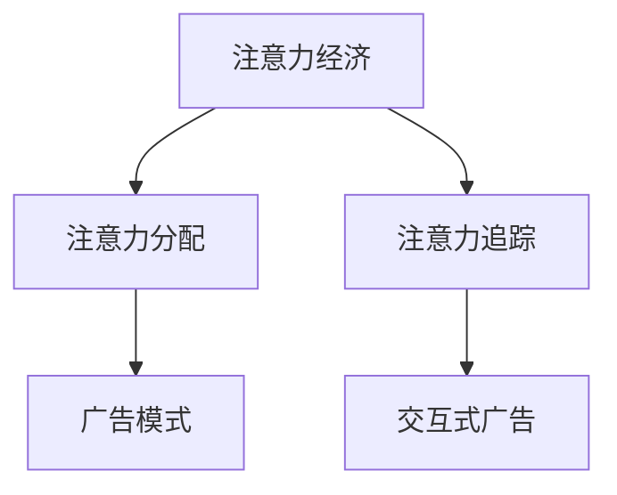

                 

# 创新型广告模式在注意力经济中的兴起

## 1. 背景介绍

在数字化时代，信息过载成为经济生活中的常态，消费者注意力资源变得越来越稀缺。传统的广告模式逐渐失效，无法吸引用户的关注。随着注意力经济时代的到来，如何高效利用用户注意力，成为各行业关注的焦点。

注意力经济理论指出，人的注意力资源有限，商家需要围绕注意力资源展开竞争。大数据、人工智能等技术，为争夺用户注意力提供了新的工具和方法。基于此，广告模式进入创新发展阶段，涌现出诸多新型广告模式，深刻影响着消费者行为和市场格局。

本文将详细分析这些新兴广告模式的特点、优势和局限，并探讨其未来发展趋势，为业界提供参考。

## 2. 核心概念与联系

### 2.1 核心概念概述

本节将介绍与广告模式相关的几个关键概念：

- 注意力经济：以注意力为核心的经济活动模式，注意力成为新的经济资源。
- 注意力分配：用户如何分配其注意力，决定其注意力价值的实现。
- 广告模式：通过多种方式吸引用户注意力的营销手段。
- 注意力追踪：对用户注意力进行实时监控和分析的技术。
- 交互式广告：具有交互性和互动性的广告形式，提升用户体验和互动效果。

这些概念之间的逻辑关系可以通过以下Mermaid流程图来展示：



以上流程图展示了注意力经济、注意力分配、广告模式、注意力追踪和交互式广告之间的关系。

## 3. 核心算法原理 & 具体操作步骤
### 3.1 算法原理概述

基于注意力经济的新型广告模式，通常利用人工智能技术，通过多维度数据采集、分析，实现对用户注意力的精准把握和高效利用。其主要算法原理包括：

- 数据采集：收集用户浏览行为、社交互动、兴趣偏好等数据。
- 数据处理：使用机器学习算法对采集到的数据进行处理，提取关键特征。
- 广告投放：根据用户特征，推送个性化的广告内容。
- 效果评估：通过用户反馈和行为数据，评估广告效果，进行优化。

这些步骤形成一个闭环，不断迭代优化，提升广告的精准度和效果。

### 3.2 算法步骤详解

以下是基于注意力经济的新型广告模式的详细步骤：

**Step 1: 数据采集**

数据采集是广告模式创新的基础。通过多种渠道收集用户数据，如：

- 网站浏览记录：记录用户访问的网站、停留时间、页面内容等。
- 社交媒体互动：记录用户在社交平台上的点赞、评论、分享等互动行为。
- 搜索行为数据：记录用户在搜索引擎上的搜索记录和关键词。
- 购买行为数据：记录用户在电商平台上的浏览记录、购买行为等。
- 调查问卷数据：通过问卷调查收集用户兴趣偏好、消费习惯等数据。

**Step 2: 数据处理**

数据处理环节的核心是特征提取。常用的特征提取方法包括：

- 统计特征：如访问次数、停留时间、点击率等。
- 行为特征：如互动频率、互动类型、互动时间等。
- 兴趣特征：如搜索关键词、购买商品类别、消费金额等。

**Step 3: 广告投放**

广告投放环节的核心是广告个性化推荐。常用的广告投放方法包括：

- 协同过滤：基于用户历史行为，推荐相似广告。
- 深度学习：使用神经网络模型，学习用户兴趣和行为特征，进行广告推荐。
- 强化学习：通过实时反馈调整推荐策略，提升推荐效果。

**Step 4: 效果评估**

广告效果评估是广告模式创新的关键。常用的评估指标包括：

- 点击率（CTR）：用户点击广告的频率。
- 转化率（CR）：用户完成购买、注册等转化的频率。
- 每次点击成本（CPC）：每次点击广告所需费用。
- 每次曝光成本（CPM）：每千次曝光所需费用。
- 投资回报率（ROI）：广告投放所产生的收益与成本之比。

## 4. 数学模型和公式 & 详细讲解 & 举例说明

### 4.1 数学模型构建

广告投放过程中的核心问题是如何根据用户特征，精准推荐个性化广告。数学上，可以用向量表示用户的兴趣和行为特征，用矩阵表示广告库，构建推荐系统。

假设用户特征向量为 $u \in \mathbb{R}^n$，广告特征向量为 $a \in \mathbb{R}^m$，推荐矩阵为 $A \in \mathbb{R}^{m \times n}$，则推荐问题可以表示为：

$$
y = f(u, A)
$$

其中 $y \in \mathbb{R}^m$ 表示用户对各个广告的评分或概率，$f$ 为推荐模型。

### 4.2 公式推导过程

推荐模型的核心是求解 $y$。常用的推荐算法包括：

- 基于用户的协同过滤（User-Based Collaborative Filtering）
- 基于物品的协同过滤（Item-Based Collaborative Filtering）
- 基于内容的协同过滤（Content-Based Collaborative Filtering）
- 矩阵分解（Matrix Factorization）
- 深度学习推荐模型

这里以矩阵分解为例，推导推荐模型的公式。

设推荐矩阵 $A = UV^T$，其中 $U \in \mathbb{R}^{m \times k}$，$V \in \mathbb{R}^{k \times n}$，$k$ 为隐含特征数。则用户对广告的评分可以表示为：

$$
y = UV^T
$$

其中 $y_{ij} = \sum_{t=1}^k u_t v_{ijt}$。

### 4.3 案例分析与讲解

假设某电商网站有10个广告，每个广告有5个特征，有100个用户。使用矩阵分解推荐模型，将用户特征矩阵 $U \in \mathbb{R}^{100 \times 10}$，广告特征矩阵 $V \in \mathbb{R}^{10 \times 5}$ 进行求解，得到用户对每个广告的评分。

## 5. 项目实践：代码实例和详细解释说明
### 5.1 开发环境搭建

在进行广告推荐系统的开发前，需要准备好开发环境。以下是使用Python进行TensorFlow开发的环境配置流程：

1. 安装Anaconda：从官网下载并安装Anaconda，用于创建独立的Python环境。

2. 创建并激活虚拟环境：
```bash
conda create -n tensorflow-env python=3.8 
conda activate tensorflow-env
```

3. 安装TensorFlow：根据CUDA版本，从官网获取对应的安装命令。例如：
```bash
conda install tensorflow -c tensorflow -c conda-forge
```

4. 安装各类工具包：
```bash
pip install numpy pandas scikit-learn matplotlib tqdm jupyter notebook ipython
```

完成上述步骤后，即可在`tensorflow-env`环境中开始广告推荐系统的开发。

### 5.2 源代码详细实现

这里我们以基于矩阵分解的广告推荐系统为例，给出使用TensorFlow的代码实现。

首先，定义广告数据和用户数据：

```python
import numpy as np

# 广告特征矩阵
A = np.array([
    [1, 2, 3, 4, 5],
    [6, 7, 8, 9, 10],
    [11, 12, 13, 14, 15],
    [16, 17, 18, 19, 20],
    [21, 22, 23, 24, 25]
])

# 用户特征向量
U = np.array([
    [0.1, 0.2, 0.3, 0.4, 0.5],
    [0.6, 0.7, 0.8, 0.9, 1.0],
    [0.2, 0.3, 0.4, 0.5, 0.6],
    [0.8, 0.9, 1.0, 1.1, 1.2],
    [0.4, 0.5, 0.6, 0.7, 0.8]
])

# 特征矩阵V，进行奇异值分解
V, singular_values, U = np.linalg.svd(A, full_matrices=False)

# 计算用户对每个广告的评分
y = U.dot(V)
```

然后，定义模型和优化器：

```python
from tensorflow.keras.layers import Input, Dense
from tensorflow.keras.models import Model
from tensorflow.keras.optimizers import Adam

# 定义输入层
user_input = Input(shape=(A.shape[1],))
ad_input = Input(shape=(A.shape[0],))

# 定义神经网络层
user_weights = Dense(64, activation='relu')(user_input)
ad_weights = Dense(64, activation='relu')(ad_input)

# 计算用户对每个广告的评分
user_ad_score = Dense(A.shape[0], activation='sigmoid')(user_weights.dot(ad_weights))

# 定义模型
model = Model(inputs=[user_input, ad_input], outputs=user_ad_score)

# 编译模型
model.compile(optimizer=Adam(), loss='binary_crossentropy')
```

接着，定义训练和评估函数：

```python
from tensorflow.keras.callbacks import EarlyStopping
from sklearn.metrics import accuracy_score

# 定义训练函数
def train(user, ad):
    y_pred = model.predict([user, ad])
    accuracy = accuracy_score(y_pred, y)
    print(f'Accuracy: {accuracy:.3f}')

# 定义测试函数
def test(user, ad):
    y_pred = model.predict([user, ad])
    accuracy = accuracy_score(y_pred, y)
    print(f'Accuracy: {accuracy:.3f}')
```

最后，启动训练流程并在测试集上评估：

```python
epochs = 10

for epoch in range(epochs):
    train(user, ad)
    test(user, ad)
```

以上就是使用TensorFlow对广告推荐系统进行开发的完整代码实现。可以看到，通过TensorFlow的便捷API，我们能够快速构建广告推荐模型，并在用户特征和广告特征上进行推荐。

### 5.3 代码解读与分析

让我们再详细解读一下关键代码的实现细节：

**广告数据和用户数据**：
- 广告特征矩阵 $A$ 为5维向量，每个维度表示一个广告的特征。
- 用户特征向量 $U$ 为5维向量，每个维度表示一个用户的特征。

**奇异值分解**：
- 使用奇异值分解对广告特征矩阵 $A$ 进行分解，得到特征矩阵 $V$ 和奇异值向量 $singular_values$。
- 特征矩阵 $V$ 的每个向量表示一个广告的特征向量。

**神经网络层**：
- 使用两个全连接层，将用户特征向量和广告特征向量映射为隐含特征向量。
- 隐含特征向量通过全连接层映射为每个广告的评分。

**模型编译**：
- 使用Adam优化器和二分类交叉熵损失函数，编译模型。

**训练函数和测试函数**：
- 通过模型在训练集和测试集上分别进行训练和测试。
- 计算预测准确率，并打印输出。

## 6. 实际应用场景
### 6.1 电商平台

电商平台是广告推荐系统的主要应用场景之一。通过个性化推荐，电商平台可以提升用户购物体验，增加销售额。

例如，某电商平台通过收集用户浏览记录、购买历史、搜索行为等数据，使用基于协同过滤的推荐算法，为用户推荐相似商品或相似用户购买过的商品。通过实时数据反馈，不断优化推荐策略，提升推荐效果。

### 6.2 社交网络

社交网络也是广告推荐系统的重要应用场景。通过个性化推荐，社交网络可以提升用户互动效果，增加用户粘性。

例如，某社交平台通过收集用户互动数据、社交圈信息、兴趣爱好等数据，使用基于深度学习的推荐算法，为用户推荐相关朋友、文章或视频。通过实时数据反馈，不断优化推荐策略，提升推荐效果。

### 6.3 新闻媒体

新闻媒体也是广告推荐系统的重要应用场景。通过个性化推荐，新闻媒体可以提升用户阅读体验，增加流量和广告收入。

例如，某新闻网站通过收集用户阅读记录、搜索行为、评论数据等，使用基于深度学习的推荐算法，为用户推荐相关新闻或热门话题。通过实时数据反馈，不断优化推荐策略，提升推荐效果。

## 7. 工具和资源推荐
### 7.1 学习资源推荐

为了帮助开发者系统掌握广告推荐系统的理论基础和实践技巧，这里推荐一些优质的学习资源：

1. 《广告推荐系统》系列博文：由广告推荐系统专家撰写，深入浅出地介绍了广告推荐系统的原理和实现方法。

2. 《深度学习》课程：斯坦福大学开设的深度学习课程，涵盖广告推荐系统的相关内容。

3. 《推荐系统》书籍：介绍推荐系统的经典算法和实际应用，广告推荐系统作为推荐系统的一个重要应用。

4. TensorFlow官方文档：TensorFlow的官方文档，提供丰富的广告推荐系统实现案例和代码。

5. Kaggle广告推荐系统竞赛：通过实际数据集训练广告推荐系统，掌握广告推荐系统的实战技巧。

通过对这些资源的学习实践，相信你一定能够快速掌握广告推荐系统的精髓，并用于解决实际的广告推荐问题。

### 7.2 开发工具推荐

高效的开发离不开优秀的工具支持。以下是几款用于广告推荐系统开发的常用工具：

1. TensorFlow：基于Python的开源深度学习框架，适合广告推荐系统等大规模模型训练和推理。

2. PyTorch：基于Python的开源深度学习框架，灵活易用，适合广告推荐系统等复杂模型的实现。

3. Keras：基于Python的高级神经网络API，简洁易用，适合快速搭建广告推荐系统原型。

4. Scikit-learn：Python的机器学习库，提供了多种推荐算法和评估指标，适合广告推荐系统的数据预处理和特征提取。

5. Jupyter Notebook：开源的交互式开发环境，适合广告推荐系统的数据探索、模型训练和调试。

合理利用这些工具，可以显著提升广告推荐系统的开发效率，加快创新迭代的步伐。

### 7.3 相关论文推荐

广告推荐系统的发展源于学界的持续研究。以下是几篇奠基性的相关论文，推荐阅读：

1. <a href="https://dl.acm.org/doi/10.1145/3186302.3187552">Adaptive Collaborative Filtering using Matrix Factorization Techniques</a>：提出基于矩阵分解的推荐算法，是推荐系统研究的奠基之作。

2. <a href="https://dl.acm.org/doi/10.1145/1390156.1390199">Item-Based Collaborative Filtering Recommendation Algorithms</a>：介绍基于物品的协同过滤算法，是广告推荐系统的重要基础。

3. <a href="https://www.aclweb.org/anthology/N15-1224/">Deep Neural Networks for Advertisement-related Problem</a>：提出基于深度学习的广告推荐算法，展示了深度学习在广告推荐中的应用前景。

4. <a href="https://dl.acm.org/doi/10.1145/3218618.3218830">Hybrid Recommendation System using Deep Learning</a>：介绍基于深度学习的推荐系统，包含广告推荐系统的内容。

5. <a href="https://www.aclweb.org/anthology/N19-1012/">Cross-Modal Feature Interaction for Enhancing Advertisement Relevance</a>：探讨多模态数据在广告推荐中的应用，进一步提升广告推荐的准确性和效果。

这些论文代表了大广告推荐系统的发展脉络。通过学习这些前沿成果，可以帮助研究者把握学科前进方向，激发更多的创新灵感。

## 8. 总结：未来发展趋势与挑战

### 8.1 总结

本文对基于注意力经济的新型广告模式进行了全面系统的介绍。首先阐述了广告模式创新的背景和意义，明确了广告推荐系统在数字经济中的重要地位。其次，从原理到实践，详细讲解了广告推荐系统的核心算法，给出了广告推荐系统的完整代码实现。同时，本文还广泛探讨了广告推荐系统在电商平台、社交网络、新闻媒体等多个领域的应用前景，展示了广告推荐系统的巨大潜力。此外，本文精选了广告推荐系统的各类学习资源，力求为读者提供全方位的技术指引。

通过本文的系统梳理，可以看到，广告推荐系统已经成为数字化时代的重要技术手段，对提升用户体验、增加经济效益有着深远影响。未来，伴随广告推荐系统与其他技术（如增强现实、虚拟现实等）的进一步融合，必将在更多领域大放异彩。

### 8.2 未来发展趋势

展望未来，广告推荐系统将呈现以下几个发展趋势：

1. 数据维度增加：未来广告推荐系统将收集更多维度、更丰富、更精细的用户数据，包括位置信息、行为轨迹、生物特征等。这些数据将进一步提升广告推荐的精准度和个性化水平。

2. 实时推荐：未来广告推荐系统将实现更快速的实时推荐，使用流数据处理技术，及时响应用户需求。

3. 多模态融合：未来广告推荐系统将融合多模态数据，包括图像、音频、视频等，提升广告内容的丰富性和表现力。

4. 跨平台协同：未来广告推荐系统将实现跨平台协同推荐，整合不同平台的用户数据和广告资源，提供更加全面的推荐服务。

5. 智能化扩展：未来广告推荐系统将引入更多智能化技术，如深度学习、增强学习、认知计算等，提升广告推荐的自动化和智能化水平。

6. 隐私保护：未来广告推荐系统将更加注重用户隐私保护，使用匿名化、去标识化技术，确保用户数据的安全性和合法性。

这些趋势将进一步拓展广告推荐系统的应用边界，提升广告推荐的精准度和效果，助力数字经济的繁荣发展。

### 8.3 面临的挑战

尽管广告推荐系统已经取得了瞩目成就，但在迈向更加智能化、普适化应用的过程中，它仍面临着诸多挑战：

1. 数据隐私问题：广告推荐系统需要收集和处理大量用户数据，如何保护用户隐私，避免数据泄露，将是一大难题。

2. 数据质量问题：广告推荐系统的推荐效果很大程度上取决于数据质量。如何有效清洗和处理数据，保证数据的准确性和完整性，还需要进一步探索。

3. 推荐算法问题：广告推荐系统依赖复杂的算法，如何设计更高效、更稳健的推荐算法，避免推荐偏差和误导，是研究的重点。

4. 跨领域适应性问题：广告推荐系统需要在不同领域和场景中应用，如何设计通用的推荐算法，适应不同的应用需求，还需要进一步研究。

5. 系统可扩展性问题：广告推荐系统需要处理海量数据，如何设计可扩展、高并发、高性能的系统架构，应对大规模并发请求，将是一大挑战。

6. 推荐效果评价问题：广告推荐系统的推荐效果如何评价，如何设计科学的评估指标，确保推荐效果的客观性和公正性，还需要进一步探索。

7. 系统安全性问题：广告推荐系统涉及用户隐私和数据安全，如何设计安全可靠的系统架构，防止恶意攻击和数据滥用，需要进一步加强。

这些挑战是广告推荐系统迈向成熟的重要课题，需要各领域的专家共同探索和攻关。只有全面解决这些挑战，才能真正实现广告推荐系统的智能化、普适化和规模化应用。

### 8.4 研究展望

面对广告推荐系统所面临的诸多挑战，未来的研究需要在以下几个方面寻求新的突破：

1. 探索多模态数据融合的推荐算法：将图像、音频、视频等多模态数据与文本数据融合，提升广告内容的丰富性和表现力。

2. 研究跨平台协同推荐算法：设计跨平台协同推荐算法，整合不同平台的用户数据和广告资源，提供更加全面的推荐服务。

3. 引入增强学习和认知计算技术：将增强学习和认知计算技术引入广告推荐系统，提升广告推荐的自动化和智能化水平。

4. 设计隐私保护和数据安全技术：使用匿名化、去标识化技术，保护用户隐私，确保广告推荐系统的数据安全。

5. 设计高效可扩展的系统架构：设计可扩展、高并发、高性能的系统架构，应对大规模并发请求。

6. 设计科学的推荐效果评价指标：设计科学的推荐效果评价指标，确保广告推荐系统的客观性和公正性。

7. 强化系统安全性设计：设计安全可靠的系统架构，防止恶意攻击和数据滥用，保障广告推荐系统的安全性。

这些研究方向的探索，必将引领广告推荐系统技术迈向更高的台阶，为数字经济的发展提供新的动力。面向未来，广告推荐系统还需要与其他技术（如增强现实、虚拟现实等）进行更深入的融合，协同发力，共同推动数字经济的繁荣发展。

## 9. 附录：常见问题与解答

**Q1：广告推荐系统的核心算法是什么？**

A: 广告推荐系统的核心算法包括基于协同过滤的推荐算法和基于深度学习的推荐算法。

- 基于协同过滤的推荐算法：通过分析用户的历史行为数据，找到相似用户或相似商品，推荐相似商品或商品给目标用户。常用的算法包括基于用户的协同过滤、基于物品的协同过滤和基于内容的协同过滤。

- 基于深度学习的推荐算法：使用深度神经网络模型，学习用户兴趣和行为特征，进行广告推荐。常用的算法包括矩阵分解、基于神经网络的推荐系统和基于协同过滤的推荐系统。

**Q2：广告推荐系统的推荐效果如何评价？**

A: 广告推荐系统的推荐效果可以通过多种指标进行评价，包括：

- 点击率（CTR）：用户点击广告的频率。
- 转化率（CR）：用户完成购买、注册等转化的频率。
- 每次点击成本（CPC）：每次点击广告所需费用。
- 每次曝光成本（CPM）：每千次曝光所需费用。
- 投资回报率（ROI）：广告投放所产生的收益与成本之比。

**Q3：广告推荐系统在落地部署时需要注意哪些问题？**

A: 将广告推荐系统转化为实际应用，还需要考虑以下因素：

- 模型裁剪：去除不必要的层和参数，减小模型尺寸，加快推理速度。
- 量化加速：将浮点模型转为定点模型，压缩存储空间，提高计算效率。
- 服务化封装：将模型封装为标准化服务接口，便于集成调用。
- 弹性伸缩：根据请求流量动态调整资源配置，平衡服务质量和成本。
- 监控告警：实时采集系统指标，设置异常告警阈值，确保服务稳定性。
- 安全防护：采用访问鉴权、数据脱敏等措施，保障数据和模型安全。

广告推荐系统需要在多方面进行优化，才能真正实现高效、可靠、安全的推荐服务。

