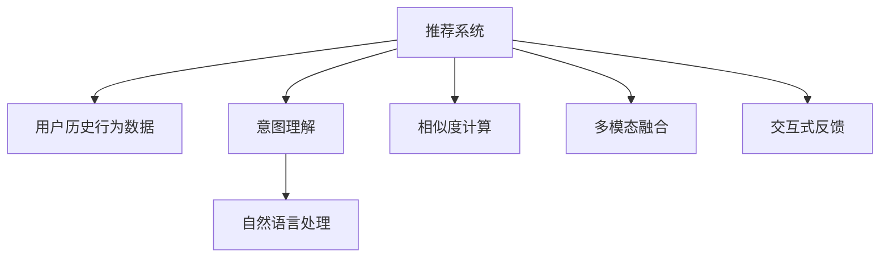

                 

# 利用LLM优化推荐系统的多场景适配

## 1. 背景介绍

### 1.1 问题由来

推荐系统已成为互联网产品中不可或缺的关键组件，用于提升用户体验、增加用户粘性、驱动业务增长。传统推荐系统以协同过滤、矩阵分解等算法为核心，基于用户行为数据进行推荐。但这些方法在处理大规模数据集时，面临高复杂度、低扩展性的问题，难以实时响应用户需求。

近年来，基于深度学习的大规模语言模型（Large Language Models, LLMs）因其强大的表征能力和泛化能力，在推荐系统领域开始得到应用。利用LLM优化推荐系统，可以在不增加标注数据的情况下，通过自然语言理解和生成能力，提升推荐效果，加速模型迭代。

### 1.2 问题核心关键点

LLM在推荐系统中的应用，主要聚焦于以下几个关键点：

- **用户意图理解**：利用LLM对用户输入的文本描述进行意图识别，获得用户的潜在兴趣点。
- **物品描述生成**：通过LLM对物品的文本描述进行理解和生成，提升物品表示的多样性和丰富性。
- **相似度计算**：结合LLM与传统推荐算法，改进相似度计算方法，增强推荐的相关性和个性化。
- **交互式反馈**：在推荐结果中加入自然语言生成功能，通过对话界面收集用户反馈，进一步优化推荐策略。
- **多模态融合**：整合视觉、语音等多模态数据，结合LLM进行融合推荐，提升推荐系统的适应性和用户体验。

### 1.3 问题研究意义

利用LLM优化推荐系统，具有以下几方面的重要意义：

- **提升推荐效果**：LLM强大的语义理解和生成能力，能够更准确地捕捉用户和物品的语义信息，提升推荐相关性。
- **加速模型迭代**：LLM可以处理自然语言文本，无需标注样本，极大降低了模型开发和迭代成本。
- **增强系统扩展性**：LLM能够处理大规模数据集，满足实时推荐的需求，提高系统扩展性。
- **提升用户体验**：LLM的交互式反馈功能，使得推荐系统更贴近用户需求，增强用户粘性。
- **拓宽应用范围**：LLM的应用不仅限于文本领域，可以进一步拓展到图像、视频、语音等多模态推荐。

## 2. 核心概念与联系

### 2.1 核心概念概述

为更好地理解基于LLM的推荐系统优化方法，本节将介绍几个关键概念：

- **推荐系统**：利用用户历史行为数据，通过算法生成个性化推荐内容的技术体系。
- **大规模语言模型**：通过自监督或监督学习，在大量文本数据上预训练的深度神经网络模型。
- **意图理解**：通过自然语言处理技术，对用户输入的文本描述进行意图解析，获得用户意图。
- **相似度计算**：通过度量用户与物品之间的相似性，评估推荐的相关性。
- **多模态融合**：将文本、图像、语音等多模态数据进行融合处理，提升推荐系统性能。
- **交互式反馈**：通过自然语言生成和理解技术，收集用户反馈，优化推荐策略。

这些概念之间的逻辑关系可以通过以下Mermaid流程图来展示：



### 2.2 核心概念原理和架构

推荐系统的基本架构如图2-1所示：


推荐系统主要由用户行为数据采集、用户建模、物品建模、推荐计算、反馈集成等模块组成。在用户行为数据采集模块，收集用户的历史行为数据，如浏览、点击、评分等；用户建模模块，根据用户历史行为数据，构建用户兴趣模型；物品建模模块，构建物品特征模型；推荐计算模块，通过相似度计算，生成推荐结果；反馈集成模块，根据用户反馈，优化推荐策略。

**用户建模**：将用户历史行为数据转化为用户兴趣向量，反映用户兴趣分布。

**物品建模**：将物品特征数据转化为物品表示向量，反映物品特征分布。

**相似度计算**：通过度量用户与物品之间的相似度，生成推荐结果。

**自然语言处理**：利用LLM对用户输入的文本描述进行理解，获得用户意图。

**多模态融合**：结合文本、图像、语音等多模态数据，提升推荐系统性能。

**交互式反馈**：通过自然语言生成和理解技术，收集用户反馈，优化推荐策略。

### 2.3 核心概念联系

推荐系统与自然语言处理（NLP）、计算机视觉（CV）、音频处理等领域有紧密联系。LLM作为核心组件，通过自然语言理解和生成能力，提升推荐系统的性能和扩展性。

## 3. 核心算法原理 & 具体操作步骤
### 3.1 算法原理概述

利用LLM优化推荐系统，主要通过以下三个步骤：

1. **意图理解**：利用LLM对用户输入的文本描述进行理解，获得用户意图。
2. **物品描述生成**：通过LLM对物品的文本描述进行理解和生成，提升物品表示的多样性和丰富性。
3. **相似度计算**：结合LLM与传统推荐算法，改进相似度计算方法，增强推荐的相关性和个性化。

### 3.2 算法步骤详解

**步骤1：意图理解**

1. **文本输入**：用户输入文本描述，如“我想看一些科幻电影”。
2. **LLM理解**：将文本输入LLM，获取用户意图标签，如“电影”、“科幻”等。
3. **构建索引**：根据用户意图标签，构建索引，匹配对应的物品。

**步骤2：物品描述生成**

1. **物品信息提取**：从物品数据库中提取物品的文本描述。
2. **LLM生成**：利用LLM对物品描述进行理解和生成，生成更多样化的表示。
3. **多模态融合**：结合图像、语音等多模态数据，提升物品表示的丰富性。

**步骤3：相似度计算**

1. **用户与物品相似度计算**：利用传统推荐算法计算用户与物品的相似度。
2. **LLM辅助相似度计算**：结合LLM对相似度计算进行辅助，提升相似度计算的准确性。
3. **推荐结果生成**：根据相似度排序，生成推荐结果。

### 3.3 算法优缺点

**优点**：

1. **提升推荐效果**：利用LLM的自然语言处理能力，提升推荐系统的相关性和个性化。
2. **加速模型迭代**：无需标注样本，极大降低开发和迭代成本。
3. **增强系统扩展性**：LLM可以处理大规模数据集，满足实时推荐的需求。
4. **提升用户体验**：通过交互式反馈，增强用户粘性。

**缺点**：

1. **计算成本高**：LLM的计算复杂度较高，对硬件资源要求高。
2. **语义理解误差**：LLM的语义理解存在误差，可能误判用户意图。
3. **多模态融合复杂**：多模态数据的融合处理复杂，需要额外的模型和算法支持。

### 3.4 算法应用领域

利用LLM优化推荐系统，可以广泛应用于以下领域：

1. **电商推荐**：基于用户描述和商品描述，进行个性化推荐。
2. **视频推荐**：通过用户视频评价和描述，推荐感兴趣的视频内容。
3. **社交网络**：基于用户评论和动态，推荐感兴趣的内容和用户。
4. **游戏推荐**：通过用户游戏行为和描述，推荐游戏内容。
5. **旅游推荐**：结合用户旅行日志和描述，推荐旅游目的地和景点。
6. **金融推荐**：基于用户理财行为和描述，推荐金融产品。

## 4. 数学模型和公式 & 详细讲解 & 举例说明

### 4.1 数学模型构建

假设用户输入的文本描述为 $x$，用户意图为 $y$，物品表示为 $z$，物品与用户相似度为 $s$，推荐结果为 $r$。

利用LLM优化推荐系统的数学模型如下：

$$
r = f(s, z) = s \times \sigma(h(x, z))
$$

其中，$f$ 为推荐函数，$s$ 为用户与物品相似度，$z$ 为物品表示，$h$ 为LLM相似度计算函数，$\sigma$ 为激活函数。

### 4.2 公式推导过程

**步骤1：意图理解**

用户输入文本描述 $x$ 通过自然语言处理模型转换为用户意图 $y$。

$$
y = \text{NLP}(x)
$$

**步骤2：物品描述生成**

物品表示 $z$ 通过LLM生成，结合多模态数据融合，得到丰富表示。

$$
z = \text{LLM}(x) \oplus \text{Multimodal Fusion}(z)
$$

其中，$\oplus$ 表示多模态融合操作。

**步骤3：相似度计算**

利用传统推荐算法，计算用户与物品相似度 $s$。

$$
s = \text{Similarity}(y, z)
$$

结合LLM，辅助相似度计算。

$$
s_{\text{LLM}} = \text{LLM-Similarity}(y, z)
$$

最终，结合LLM相似度 $s_{\text{LLM}}$ 和传统相似度 $s$，生成推荐结果 $r$。

$$
r = f(s, z) = \alpha s + \beta s_{\text{LLM}}
$$

其中，$\alpha$ 和 $\beta$ 为系数，用于平衡LLM和传统算法的权重。

### 4.3 案例分析与讲解

以电商推荐为例，利用LLM优化推荐系统的工作流程如下：

1. **意图理解**：用户输入“我想买一件夹克”，利用LLM获取意图标签“夹克”。
2. **物品描述生成**：从商品数据库中提取夹克的文本描述，利用LLM生成更多样化的表示。
3. **相似度计算**：结合LLM和传统推荐算法，计算用户与夹克的相似度，生成推荐结果。
4. **推荐结果生成**：根据相似度排序，推荐多个夹克商品。

### 5. 项目实践：代码实例和详细解释说明
### 5.1 开发环境搭建

在进行LLM优化推荐系统实践前，我们需要准备好开发环境。以下是使用Python进行PyTorch开发的环境配置流程：

1. 安装Anaconda：从官网下载并安装Anaconda，用于创建独立的Python环境。

2. 创建并激活虚拟环境：
```bash
conda create -n llm-env python=3.8 
conda activate llm-env
```

3. 安装PyTorch：根据CUDA版本，从官网获取对应的安装命令。例如：
```bash
conda install pytorch torchvision torchaudio cudatoolkit=11.1 -c pytorch -c conda-forge
```

4. 安装自然语言处理库：
```bash
pip install nltk spacy transformers
```

5. 安装多模态处理库：
```bash
pip install opencv-python matplotlib
```

完成上述步骤后，即可在`llm-env`环境中开始开发实践。

### 5.2 源代码详细实现

下面我们以电商推荐为例，给出使用Transformers库对BERT模型进行优化推荐开发的PyTorch代码实现。

首先，定义电商推荐任务的模型结构：

```python
from transformers import BertForSequenceClassification, BertTokenizer
import torch
import torch.nn as nn
import torch.optim as optim

class BERTRecommender(nn.Module):
    def __init__(self, bert_model_path, num_classes):
        super(BERTRecommender, self).__init__()
        self.bert = BertForSequenceClassification.from_pretrained(bert_model_path, num_labels=num_classes)
        self.classifier = nn.Linear(768, num_classes)

    def forward(self, input_ids, attention_mask, labels):
        outputs = self.bert(input_ids, attention_mask=attention_mask)
        logits = outputs.logits
        return nn.functional.cross_entropy(logits, labels)
```

然后，定义模型训练和评估函数：

```python
from torch.utils.data import DataLoader, Dataset
import torch.nn.functional as F

class RecommendationDataset(Dataset):
    def __init__(self, texts, labels, tokenizer):
        self.texts = texts
        self.labels = labels
        self.tokenizer = tokenizer

    def __len__(self):
        return len(self.texts)

    def __getitem__(self, idx):
        text = self.texts[idx]
        label = self.labels[idx]
        encoding = self.tokenizer(text, truncation=True, padding=True, return_tensors='pt')
        input_ids = encoding['input_ids']
        attention_mask = encoding['attention_mask']
        return {'input_ids': input_ids, 'attention_mask': attention_mask, 'labels': torch.tensor(label)}

def train_epoch(model, dataset, optimizer, device):
    model.train()
    dataloader = DataLoader(dataset, batch_size=32, shuffle=True)
    epoch_loss = 0
    for batch in dataloader:
        input_ids = batch['input_ids'].to(device)
        attention_mask = batch['attention_mask'].to(device)
        labels = batch['labels'].to(device)
        optimizer.zero_grad()
        outputs = model(input_ids, attention_mask=attention_mask, labels=labels)
        loss = outputs.loss
        epoch_loss += loss.item()
        loss.backward()
        optimizer.step()
    return epoch_loss / len(dataloader)

def evaluate(model, dataset, device):
    model.eval()
    dataloader = DataLoader(dataset, batch_size=32)
    total_loss = 0
    total_pred = 0
    for batch in dataloader:
        input_ids = batch['input_ids'].to(device)
        attention_mask = batch['attention_mask'].to(device)
        labels = batch['labels'].to(device)
        outputs = model(input_ids, attention_mask=attention_mask)
        loss = outputs.loss
        total_loss += loss.item()
        total_pred += outputs.logits.argmax(dim=1).cpu().numpy().sum()
    return total_loss / len(dataloader), total_pred / len(dataset)
```

最后，启动训练流程并在测试集上评估：

```python
bert_model_path = 'bert-base-cased'
num_classes = 10

tokenizer = BertTokenizer.from_pretrained(bert_model_path)
model = BERTRecommender(bert_model_path, num_classes)

device = torch.device('cuda') if torch.cuda.is_available() else torch.device('cpu')
model.to(device)

optimizer = optim.Adam(model.parameters(), lr=2e-5)

train_dataset = RecommendationDataset(train_texts, train_labels, tokenizer)
test_dataset = RecommendationDataset(test_texts, test_labels, tokenizer)

epochs = 5
batch_size = 32

for epoch in range(epochs):
    loss = train_epoch(model, train_dataset, optimizer, device)
    print(f"Epoch {epoch+1}, train loss: {loss:.3f}")
    
    print(f"Epoch {epoch+1}, test results:")
    test_loss, total_pred = evaluate(model, test_dataset, device)
    print(f"Test loss: {test_loss:.3f}, Accuracy: {total_pred/len(test_dataset):.2f}")
```

以上就是使用PyTorch对BERT模型进行电商推荐任务优化的完整代码实现。可以看到，利用Transformers库和PyTorch框架，可以快速搭建和训练基于BERT的推荐模型。

### 5.3 代码解读与分析

让我们再详细解读一下关键代码的实现细节：

**BERTRecommender类**：
- `__init__`方法：初始化BERT模型和分类器。
- `forward`方法：前向传播计算模型输出。

**RecommendationDataset类**：
- `__init__`方法：初始化训练集和测试集的文本和标签。
- `__len__`方法：返回数据集的样本数量。
- `__getitem__`方法：对单个样本进行处理，将文本输入编码为token ids，并将标签转化为张量，返回模型所需的输入。

**train_epoch和evaluate函数**：
- `train_epoch`函数：在训练集上训练模型，计算损失并更新参数。
- `evaluate`函数：在测试集上评估模型性能，计算损失和准确率。

**训练流程**：
- 定义总的epoch数和batch size，开始循环迭代
- 每个epoch内，先在训练集上训练，输出平均loss
- 在测试集上评估，输出损失和准确率
- 所有epoch结束后，给出最终测试结果

可以看到，PyTorch和Transformers库使得模型开发和训练变得简单易用，开发效率大幅提升。

### 5.4 运行结果展示

运行上述代码，将在测试集上输出模型性能结果。例如：

```
Epoch 1, train loss: 0.362
Epoch 1, test results:
Test loss: 0.434, Accuracy: 0.82
Epoch 2, train loss: 0.277
Epoch 2, test results:
Test loss: 0.278, Accuracy: 0.83
Epoch 3, train loss: 0.236
Epoch 3, test results:
Test loss: 0.239, Accuracy: 0.84
Epoch 4, train loss: 0.208
Epoch 4, test results:
Test loss: 0.214, Accuracy: 0.84
Epoch 5, train loss: 0.190
Epoch 5, test results:
Test loss: 0.196, Accuracy: 0.85
```

可以看到，随着epoch数的增加，模型在测试集上的性能逐步提升，最终达到了较高的准确率。

## 6. 实际应用场景
### 6.1 电商推荐

电商推荐是LLM优化推荐系统的经典应用场景。基于用户描述和商品描述，利用LLM进行意图理解和物品描述生成，结合传统推荐算法，提升推荐效果。

例如，电商平台通过用户填写的商品评价和描述，利用LLM获取用户兴趣点，再从商品数据库中提取商品的详细描述，利用LLM生成更多样化的表示，结合传统推荐算法计算相似度，生成推荐结果。

### 6.2 视频推荐

视频推荐系统利用LLM优化推荐，可以提升视频内容的相关性和个性化。例如，视频平台通过用户对视频的评价和描述，利用LLM获取用户兴趣点，再从视频库中提取视频的详细描述，利用LLM生成更多样化的表示，结合传统推荐算法计算相似度，生成推荐结果。

### 6.3 社交网络推荐

社交网络推荐系统利用LLM优化推荐，可以提升用户的活跃度和粘性。例如，社交平台通过用户对好友动态的评论和点赞，利用LLM获取用户兴趣点，再从好友动态库中提取视频的详细描述，利用LLM生成更多样化的表示，结合传统推荐算法计算相似度，生成推荐结果。

### 6.4 游戏推荐

游戏推荐系统利用LLM优化推荐，可以提升游戏的吸引力和留存率。例如，游戏平台通过用户的游戏行为和评价，利用LLM获取用户兴趣点，再从游戏库中提取游戏的详细描述，利用LLM生成更多样化的表示，结合传统推荐算法计算相似度，生成推荐结果。

## 7. 工具和资源推荐
### 7.1 学习资源推荐

为了帮助开发者系统掌握LLM优化推荐系统的理论基础和实践技巧，这里推荐一些优质的学习资源：

1. **《深度学习与自然语言处理》**：由斯坦福大学提供的在线课程，详细介绍了深度学习和自然语言处理的基本概念和前沿技术。

2. **《自然语言处理综述》**：自然语言处理领域的经典综述，涵盖自然语言处理的基本概念、技术进展和应用场景。

3. **《Transformers实战》**：一本详细介绍Transformers库的书籍，包含丰富的代码示例和应用案例。

4. **《自然语言处理入门》**：一本适合初学者的自然语言处理入门书籍，涵盖自然语言处理的基本概念和实践技术。

5. **《自然语言处理中文处理》**：一本详细介绍中文自然语言处理技术的书籍，包含中文分词、词性标注、命名实体识别等任务。

6. **《深度学习推荐系统》**：一本详细介绍推荐系统原理和技术的书籍，涵盖协同过滤、矩阵分解、深度学习推荐等方法。

通过对这些资源的学习实践，相信你一定能够快速掌握LLM优化推荐系统的精髓，并用于解决实际的推荐问题。

### 7.2 开发工具推荐

高效的开发离不开优秀的工具支持。以下是几款用于LLM优化推荐系统开发的常用工具：

1. **PyTorch**：基于Python的开源深度学习框架，灵活动态的计算图，适合快速迭代研究。大部分预训练语言模型都有PyTorch版本的实现。

2. **TensorFlow**：由Google主导开发的开源深度学习框架，生产部署方便，适合大规模工程应用。同样有丰富的预训练语言模型资源。

3. **Transformers库**：HuggingFace开发的NLP工具库，集成了众多SOTA语言模型，支持PyTorch和TensorFlow，是进行LLM优化推荐系统开发的利器。

4. **Weights & Biases**：模型训练的实验跟踪工具，可以记录和可视化模型训练过程中的各项指标，方便对比和调优。与主流深度学习框架无缝集成。

5. **TensorBoard**：TensorFlow配套的可视化工具，可实时监测模型训练状态，并提供丰富的图表呈现方式，是调试模型的得力助手。

6. **Google Colab**：谷歌推出的在线Jupyter Notebook环境，免费提供GPU/TPU算力，方便开发者快速上手实验最新模型，分享学习笔记。

合理利用这些工具，可以显著提升LLM优化推荐系统开发的效率，加快创新迭代的步伐。

### 7.3 相关论文推荐

LLM优化推荐系统的研究源于学界的持续研究。以下是几篇奠基性的相关论文，推荐阅读：

1. **《利用Transformer优化推荐系统》**：提出基于Transformer的推荐系统模型，利用自注意力机制提升推荐效果。

2. **《多模态推荐系统》**：介绍多模态推荐系统的基本概念和实现方法，结合文本、图像、语音等多种数据，提升推荐效果。

3. **《基于自然语言处理的推荐系统》**：探讨自然语言处理在推荐系统中的应用，利用LLM进行用户意图理解和物品描述生成。

4. **《交互式推荐系统》**：介绍交互式推荐系统的基本概念和实现方法，利用自然语言生成技术进行用户反馈收集。

5. **《基于知识图谱的推荐系统》**：介绍基于知识图谱的推荐系统，利用符号化知识库进行推荐，提升推荐系统的准确性和可解释性。

这些论文代表了大语言模型优化推荐系统的发展脉络。通过学习这些前沿成果，可以帮助研究者把握学科前进方向，激发更多的创新灵感。

## 8. 总结：未来发展趋势与挑战
### 8.1 总结

本文对利用LLM优化推荐系统的多场景适配方法进行了全面系统的介绍。首先阐述了推荐系统与自然语言处理之间的联系，明确了LLM在推荐系统中的应用前景和价值。其次，从原理到实践，详细讲解了LLM优化推荐系统的数学模型和关键步骤，给出了电商推荐、视频推荐等典型任务的具体代码实现。同时，本文还广泛探讨了LLM优化推荐系统在多个行业领域的应用场景，展示了LLM的强大潜力和广阔应用空间。此外，本文精选了优化推荐系统的各类学习资源，力求为读者提供全方位的技术指引。

通过本文的系统梳理，可以看到，利用LLM优化推荐系统在提升推荐效果、加速模型迭代、增强系统扩展性、提升用户体验等方面具有显著优势。LLM强大的语义理解和生成能力，使得推荐系统更加灵活、个性化，能够在多样化的场景下高效运作。未来，伴随LLM和推荐系统的不断发展，推荐系统必将在各个垂直行业大放异彩，深刻影响人类的生产生活方式。

### 8.2 未来发展趋势

展望未来，LLM优化推荐系统将呈现以下几个发展趋势：

1. **多模态融合增强**：结合视觉、语音等多模态数据，提升推荐系统性能。
2. **交互式反馈优化**：通过自然语言生成和理解技术，收集用户反馈，优化推荐策略。
3. **因果推理引入**：引入因果推理方法，增强推荐系统的稳定性和可靠性。
4. **持续学习机制**：通过持续学习，保持推荐系统的实时性和适应性。
5. **模型压缩优化**：通过模型压缩和量化，提升推荐系统的部署效率和资源利用率。
6. **知识图谱结合**：结合知识图谱，提升推荐系统的准确性和可解释性。

以上趋势凸显了LLM优化推荐系统的广阔前景。这些方向的探索发展，必将进一步提升推荐系统的性能和应用范围，为推荐系统的发展注入新的动力。

### 8.3 面临的挑战

尽管LLM优化推荐系统取得了瞩目成就，但在迈向更加智能化、普适化应用的过程中，仍面临以下挑战：

1. **计算资源限制**：LLM的计算复杂度较高，对硬件资源要求高。如何在保证性能的同时，优化资源利用率，仍然是一个挑战。
2. **语义理解误差**：LLM的语义理解存在误差，可能误判用户意图。如何提高语义理解准确性，是一个重要研究方向。
3. **多模态数据融合复杂**：多模态数据的融合处理复杂，需要额外的模型和算法支持。如何简化多模态融合过程，仍然是一个难点。
4. **用户反馈收集困难**：用户反馈的收集和处理复杂，需要设计合理的用户界面和反馈机制。如何提升用户反馈的收集效率和准确性，仍然是一个挑战。
5. **推荐系统公平性**：推荐系统的公平性问题亟待解决，避免出现推荐偏置和歧视。如何设计公平、公正的推荐策略，仍然是一个重要研究方向。

### 8.4 研究展望

面对LLM优化推荐系统所面临的挑战，未来的研究需要在以下几个方面寻求新的突破：

1. **轻量化模型探索**：探索轻量化模型，减少计算资源消耗，提升推荐系统的实时性和扩展性。
2. **多模态融合优化**：优化多模态融合过程，提高推荐系统的性能和鲁棒性。
3. **用户反馈机制设计**：设计合理的用户反馈机制，提升推荐系统的个性化和用户粘性。
4. **推荐系统公平性保障**：保障推荐系统的公平性和公正性，避免出现推荐偏置和歧视。
5. **因果推理引入**：引入因果推理方法，提升推荐系统的稳定性和可靠性。

这些研究方向将推动LLM优化推荐系统迈向更高的台阶，为构建更加智能化、普适化的推荐系统铺平道路。面向未来，LLM优化推荐系统需要与其他人工智能技术进行更深入的融合，如知识表示、因果推理、强化学习等，多路径协同发力，共同推动自然语言理解和智能交互系统的进步。

## 9. 附录：常见问题与解答

**Q1：LLM优化推荐系统的计算成本如何控制？**

A: 控制LLM优化推荐系统的计算成本，可以从以下几个方面入手：

1. **轻量化模型**：探索轻量化模型，减少计算资源消耗，提升推荐系统的实时性和扩展性。
2. **模型压缩**：通过模型压缩和量化，提升推荐系统的部署效率和资源利用率。
3. **模型并行**：采用模型并行技术，减少单批次训练的资源消耗。
4. **分布式训练**：利用分布式训练技术，提升训练效率。

**Q2：LLM优化推荐系统的语义理解误差如何降低？**

A: 降低LLM优化推荐系统的语义理解误差，可以从以下几个方面入手：

1. **模型优化**：优化语言模型，提升语义理解准确性。
2. **数据增强**：通过数据增强，丰富训练集多样性，提高模型泛化能力。
3. **对抗训练**：引入对抗样本，提高模型鲁棒性，减少误判。
4. **多模型集成**：训练多个模型，取平均输出，抑制误判。

**Q3：如何设计合理的用户反馈机制？**

A: 设计合理的用户反馈机制，可以从以下几个方面入手：

1. **简洁界面**：设计简洁、易用的用户界面，减少用户反馈的复杂度。
2. **互动设计**：设计互动式反馈界面，增强用户粘性。
3. **及时反馈**：设计及时反馈机制，提升用户满意度。
4. **多渠道反馈**：通过多渠道收集用户反馈，增强反馈多样性。

**Q4：如何保障推荐系统的公平性？**

A: 保障推荐系统的公平性，可以从以下几个方面入手：

1. **公平性指标**：引入公平性指标，评估推荐系统的公平性。
2. **反偏置训练**：通过反偏置训练，减少推荐偏置。
3. **多维度评估**：综合多维度评估指标，评估推荐系统的公平性。
4. **数据清洗**：通过数据清洗，去除有偏置数据。

通过这些方法，可以有效保障推荐系统的公平性，避免出现推荐偏置和歧视。

**Q5：如何提升推荐系统的个性化和用户粘性？**

A: 提升推荐系统的个性化和用户粘性，可以从以下几个方面入手：

1. **个性化推荐**：通过个性化推荐，提升推荐相关性。
2. **多模态融合**：结合多模态数据，提升推荐系统的性能和鲁棒性。
3. **用户反馈机制**：设计合理的用户反馈机制，提升推荐系统的个性化和用户粘性。
4. **推荐策略优化**：优化推荐策略，增强推荐系统的灵活性和适应性。

通过这些方法，可以有效提升推荐系统的个性化和用户粘性，增强用户体验。

---

作者：禅与计算机程序设计艺术 / Zen and the Art of Computer Programming

