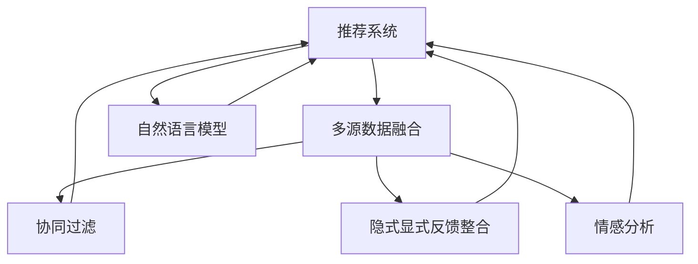

                 

# 利用LLM优化推荐系统的多源数据融合

> 关键词：推荐系统,多源数据融合,自然语言模型,LLM,用户行为预测,协同过滤,隐式反馈,显式反馈,情感分析

## 1. 背景介绍

### 1.1 问题由来

在数字化时代，推荐系统在电商、媒体、社交网络等众多领域得到广泛应用。其核心思想是通过分析用户行为数据，发现用户兴趣和偏好，从而实现个性化推荐。然而，传统的推荐系统往往依赖于单一数据源，忽略了多模态信息，难以全面刻画用户多方面的兴趣。

为了解决这一问题，近年来兴起了多源数据融合的推荐方法，即将不同来源的数据进行有机整合，构建更全面的用户画像。这些数据源包括用户的显式反馈数据、隐式行为数据、社交关系数据、兴趣标签、情感评论等。多源数据融合不仅能提升推荐系统的个性化水平，还能规避单一数据源的噪音干扰，增强推荐结果的鲁棒性。

然而，如何高效地进行多源数据融合，构建融合后的模型，并进行推荐预测，是推荐系统多源数据融合研究的重要挑战。自然语言模型（Natural Language Model, NLM）特别是大语言模型（Large Language Model, LLM）在这一领域的应用，为多源数据融合推荐带来了新的契机。

### 1.2 问题核心关键点

1. **多源数据融合与推荐系统结合**：将多源数据融合技术与推荐系统深度结合，实现对用户多方面兴趣的刻画。
2. **自然语言模型的应用**：利用自然语言模型特别是大语言模型进行推荐系统多源数据融合，提升模型的表达能力和泛化性能。
3. **用户行为预测**：通过多源数据融合模型，精准预测用户的行为意图，实现个性化推荐。
4. **协同过滤与隐式显式反馈的整合**：结合基于内容的协同过滤和基于用户的协同过滤，充分挖掘显式反馈数据和隐式行为数据的潜力。
5. **情感分析与用户情感特征提取**：利用情感分析技术，从用户的情感评论中提取情感特征，丰富用户画像。

## 2. 核心概念与联系

### 2.1 核心概念概述

为更好地理解利用大语言模型优化推荐系统的多源数据融合方法，本节将介绍几个密切相关的核心概念：

- **推荐系统**：利用用户历史行为数据，推荐用户可能感兴趣的物品的系统。推荐系统包括协同过滤、基于内容的推荐、基于矩阵分解的推荐等。
- **多源数据融合**：将多个来源的数据（如显式反馈、隐式行为、社交关系、兴趣标签等）进行整合，构建更全面的用户画像，提升推荐系统的性能。
- **自然语言模型**：通过深度学习模型，自动从文本中提取语义信息，捕捉语言的规律和模式。大语言模型（如GPT、BERT等）是基于自监督预训练的高级NLM。
- **协同过滤**：推荐系统常用的方法之一，包括基于用户的协同过滤和基于物品的协同过滤，通过用户历史行为数据构建相似性度量，实现推荐。
- **隐式反馈与显式反馈**：推荐系统数据来源之一，显式反馈指用户主动给出的评分、点击等数据，隐式反馈指用户行为数据，如浏览、停留时间等。
- **情感分析**：自然语言处理领域的技术，通过分析用户的情感评论，提取情感特征，丰富用户画像。

这些核心概念之间的逻辑关系可以通过以下Mermaid流程图来展示：



这个流程图展示了大语言模型在推荐系统多源数据融合中的应用框架：

1. 推荐系统通过多源数据融合，获得用户多维度的兴趣画像。
2. 自然语言模型特别是大语言模型用于用户行为预测，提升推荐性能。
3. 多源数据融合结合协同过滤，充分利用显式和隐式反馈数据。
4. 情感分析技术用于提取用户情感特征，丰富用户画像。

这些概念共同构成了利用大语言模型优化推荐系统的多源数据融合方法的核心，使其能够更好地应对推荐系统面临的数据多样性和复杂性。

## 3. 核心算法原理 & 具体操作步骤
### 3.1 算法原理概述

利用大语言模型优化推荐系统的多源数据融合方法，本质上是将自然语言模型与推荐系统结合，通过多源数据融合增强用户兴趣画像，再利用大语言模型进行推荐预测。其核心思想是：

1. **数据预处理**：收集用户的多源数据，并进行清洗、归一化等预处理。
2. **特征提取与融合**：利用自然语言模型，从文本数据中提取特征，并将不同来源的数据进行融合，构建综合性的用户画像。
3. **用户行为预测**：通过大语言模型，预测用户的行为意图，生成推荐列表。
4. **推荐列表排序**：结合协同过滤等算法，对推荐列表进行排序，提高推荐的相关性和个性化。

### 3.2 算法步骤详解

基于大语言模型优化推荐系统的多源数据融合方法，主要包括以下几个关键步骤：

**Step 1: 数据收集与预处理**

1. **收集多源数据**：从用户行为数据、社交网络数据、商品属性数据、用户评论数据等多个渠道，收集用户的多维信息。
2. **数据清洗与归一化**：对收集到的数据进行去噪、去重、标准化等预处理，确保数据的准确性和一致性。

**Step 2: 特征提取与融合**

1. **自然语言模型特征提取**：利用预训练的自然语言模型，从用户评论、描述等文本数据中提取语义特征。
2. **多源数据融合**：将文本特征与其他类型的数据（如显式反馈、隐式行为、社交关系等）进行融合，构建综合性的用户画像。
3. **特征工程**：对融合后的特征进行工程化处理，如特征选择、特征降维、特征合成等，减少特征维度，提高模型泛化能力。

**Step 3: 用户行为预测**

1. **大语言模型训练**：在融合后的用户画像数据上，训练大语言模型，学习用户的行为模式和兴趣偏好。
2. **推荐预测**：通过大语言模型，预测用户对不同物品的兴趣和评分，生成推荐列表。

**Step 4: 推荐列表排序**

1. **协同过滤**：结合基于用户的协同过滤和基于物品的协同过滤，对推荐列表进行排序。
2. **模型融合**：将大语言模型预测的结果与其他推荐算法（如基线模型）的预测结果进行融合，提高推荐结果的准确性和多样性。
3. **个性化推荐**：根据用户的兴趣和行为特征，动态调整推荐算法和参数，实现个性化推荐。

### 3.3 算法优缺点

利用大语言模型优化推荐系统的多源数据融合方法，具有以下优点：

1. **提高推荐系统的个性化水平**：通过多源数据融合，能更全面地刻画用户兴趣和行为，提升推荐系统的个性化。
2. **增强推荐系统的鲁棒性**：利用多源数据融合，减少单一数据源的噪音干扰，提升推荐结果的鲁棒性。
3. **降低数据标注成本**：大语言模型能在无监督或少监督的情况下学习用户兴趣，减少了数据标注的复杂性和成本。
4. **模型表达能力强**：大语言模型具有强大的语义理解能力和泛化性能，能捕捉复杂的用户行为和情感。

同时，该方法也存在一定的局限性：

1. **计算资源需求高**：大语言模型的训练和推理需要大量的计算资源，可能面临资源瓶颈。
2. **模型复杂度高**：多源数据融合和大语言模型结合的模型结构复杂，参数众多，可能导致过拟合。
3. **用户隐私问题**：多源数据融合涉及用户多方面的信息，可能带来隐私保护问题。
4. **模型解释性差**：大语言模型通常是"黑盒"系统，难以解释其决策过程和逻辑。

尽管存在这些局限性，但就目前而言，利用大语言模型优化推荐系统的多源数据融合方法仍是大规模推荐系统的重要选择。未来相关研究的重点在于如何进一步降低计算成本，提高模型泛化能力，解决隐私保护问题，增强模型解释性等因素。

### 3.4 算法应用领域

利用大语言模型优化推荐系统的多源数据融合方法，在电商、媒体、社交网络等多个领域得到广泛应用，具体包括：

- **电商推荐系统**：结合用户的购买记录、浏览历史、社交网络信息，进行个性化商品推荐。
- **视频推荐系统**：利用用户观看记录、评价、社交关系数据，推荐用户可能感兴趣的视频内容。
- **新闻推荐系统**：通过分析用户的阅读历史、评论、社交网络关系，推荐相关新闻文章。
- **社交网络推荐**：结合用户的关注列表、点赞、分享行为，推荐用户可能感兴趣的内容和用户。
- **音乐推荐系统**：结合用户的听歌记录、评分、社交关系，推荐用户可能喜欢的音乐。

除了这些应用场景外，利用大语言模型优化推荐系统的多源数据融合方法，还将在更多行业领域得到广泛应用，为各行各业提供更高效、更个性化的推荐服务。

## 4. 数学模型和公式 & 详细讲解  
### 4.1 数学模型构建

本节将使用数学语言对利用大语言模型优化推荐系统的多源数据融合方法进行更加严格的刻画。

记用户为 $u$，物品为 $i$，用户行为数据为 $(x_u, y_u)$，其中 $x_u$ 为特征向量，$y_u$ 为标签（如购买行为、评分等）。假设多源数据融合后的用户画像为 $X_u$，大语言模型为 $M$，推荐函数为 $f$，则推荐模型的目标是最小化预测误差，即：

$$
\min_{\theta} \sum_{u} \| M(X_u) - y_u \|^2
$$

其中 $M(X_u)$ 为大语言模型对用户画像 $X_u$ 的预测结果，$\| \cdot \|$ 为预测误差，$\theta$ 为模型参数。

### 4.2 公式推导过程

假设多源数据融合后的用户画像 $X_u$ 包含 $d$ 个特征，则用户画像 $X_u$ 可以表示为一个向量：

$$
X_u = [x_{u1}, x_{u2}, \ldots, x_{ud}]
$$

其中 $x_{uj}$ 为用户画像的 $j$ 个特征。通过预训练的自然语言模型 $M$，对用户画像 $X_u$ 进行预测，得到用户行为 $y_u$ 的概率分布：

$$
\hat{y_u} = M(X_u)
$$

预测误差 $e_u$ 可以表示为：

$$
e_u = y_u - \hat{y_u}
$$

推荐模型的损失函数可以表示为：

$$
\mathcal{L} = \frac{1}{N} \sum_{u=1}^{N} e_u^2
$$

通过梯度下降等优化算法，最小化损失函数 $\mathcal{L}$，更新模型参数 $\theta$，使得预测结果与实际标签尽可能接近，从而提高推荐系统的性能。

### 4.3 案例分析与讲解

为了更好地理解利用大语言模型优化推荐系统的多源数据融合方法，下面以电商推荐系统为例，给出具体的案例分析。

假设电商平台上用户 $u$ 的购买记录、浏览历史、社交网络信息、商品属性信息等构成了多源数据融合后的用户画像 $X_u$，其中：

- $x_{u1}$ 为用户的历史购买记录
- $x_{u2}$ 为用户在平台上的浏览历史
- $x_{u3}$ 为用户的社交网络关系
- $x_{u4}$ 为商品的分类、品牌、价格等属性信息

利用BERT等预训练的自然语言模型，对用户画像 $X_u$ 进行预测，得到用户购买行为的概率分布 $M(X_u)$。在此基础上，结合协同过滤等推荐算法，对推荐列表进行排序，生成最终的推荐结果。

## 5. 项目实践：代码实例和详细解释说明
### 5.1 开发环境搭建

在进行多源数据融合推荐系统开发前，我们需要准备好开发环境。以下是使用Python进行PyTorch开发的环境配置流程：

1. 安装Anaconda：从官网下载并安装Anaconda，用于创建独立的Python环境。

2. 创建并激活虚拟环境：
```bash
conda create -n pytorch-env python=3.8 
conda activate pytorch-env
```

3. 安装PyTorch：根据CUDA版本，从官网获取对应的安装命令。例如：
```bash
conda install pytorch torchvision torchaudio cudatoolkit=11.1 -c pytorch -c conda-forge
```

4. 安装TensorFlow：
```bash
pip install tensorflow
```

5. 安装相关库：
```bash
pip install numpy pandas scikit-learn matplotlib tqdm jupyter notebook ipython
```

完成上述步骤后，即可在`pytorch-env`环境中开始多源数据融合推荐系统开发。

### 5.2 源代码详细实现

下面我们以电商推荐系统为例，给出使用PyTorch进行多源数据融合推荐系统的PyTorch代码实现。

首先，定义用户和物品的特征表示：

```python
from torch import nn
from torch.utils.data import Dataset, DataLoader

class UserItemDataset(Dataset):
    def __init__(self, user_data, item_data, tokenizer):
        self.user_data = user_data
        self.item_data = item_data
        self.tokenizer = tokenizer
        
    def __len__(self):
        return len(self.user_data)
    
    def __getitem__(self, item):
        user_item = self.user_data[item]
        user = user_item['user']
        items = user_item['items']
        item_features = [item_data['features'] for item_data in items]
        
        item_ids = [item_data['item_id'] for item_data in items]
        item_texts = [item_data['description'] for item_data in items]
        
        item_ids = torch.tensor(item_ids)
        item_texts = self.tokenizer(item_texts, return_tensors='pt', padding=True, truncation=True)
        
        return {'user_id': user,
                'item_ids': item_ids,
                'item_texts': item_texts['input_ids'],
                'item_labels': torch.tensor([1.0] * len(items))}
```

然后，定义多源数据融合后的用户画像表示：

```python
class FusionUserEmbedding(nn.Module):
    def __init__(self, user_embedding_size, item_embedding_size, hidden_size, num_heads, dropout=0.1):
        super(FusionUserEmbedding, self).__init__()
        self.user_embedding = nn.Embedding(user_data_size, user_embedding_size)
        self.item_embedding = nn.Embedding(item_data_size, item_embedding_size)
        self.encoder = nn.TransformerEncoderLayer(d_model=item_embedding_size, nhead=num_heads, dim_feedforward=item_embedding_size*4, dropout=dropout)
        self.dropout = nn.Dropout(dropout)
        
    def forward(self, user_ids, item_ids, item_texts):
        user_embedding = self.user_embedding(user_ids)
        item_embedding = self.item_embedding(item_ids)
        
        item_texts = item_texts.flatten(1)
        item_texts = self.encoder(item_texts)
        item_texts = self.dropout(item_texts)
        
        user_embeddings = user_embedding
        item_embeddings = item_embedding
        
        return user_embeddings, item_embeddings
```

接着，定义大语言模型：

```python
class LanguageModel(nn.Module):
    def __init__(self, user_embedding_size, item_embedding_size, hidden_size, num_heads, dropout=0.1):
        super(LanguageModel, self).__init__()
        self.user_embedding = nn.Embedding(user_data_size, user_embedding_size)
        self.item_embedding = nn.Embedding(item_data_size, item_embedding_size)
        self.encoder = nn.TransformerEncoderLayer(d_model=item_embedding_size, nhead=num_heads, dim_feedforward=item_embedding_size*4, dropout=dropout)
        self.dropout = nn.Dropout(dropout)
        self.decoder = nn.Linear(user_embedding_size + item_embedding_size, 1)
        
    def forward(self, user_embeddings, item_embeddings):
        item_texts = item_embeddings.flatten(1)
        item_texts = self.encoder(item_texts)
        item_texts = self.dropout(item_texts)
        
        user_embeddings = user_embeddings
        item_texts = item_texts
        
        return self.decoder(item_texts)
```

最后，定义推荐模型的预测函数：

```python
class RecommendationModel(nn.Module):
    def __init__(self, user_embedding_size, item_embedding_size, hidden_size, num_heads, dropout=0.1):
        super(RecommendationModel, self).__init__()
        self.user_embedding = nn.Embedding(user_data_size, user_embedding_size)
        self.item_embedding = nn.Embedding(item_data_size, item_embedding_size)
        self.encoder = nn.TransformerEncoderLayer(d_model=item_embedding_size, nhead=num_heads, dim_feedforward=item_embedding_size*4, dropout=dropout)
        self.dropout = nn.Dropout(dropout)
        self.decoder = nn.Linear(user_embedding_size + item_embedding_size, 1)
        
    def forward(self, user_ids, item_ids, item_texts):
        user_embeddings, item_embeddings = FusionUserEmbedding(user_data_size, item_data_size, user_embedding_size, item_embedding_size, hidden_size, num_heads, dropout)(user_ids, item_ids, item_texts)
        return self.decoder(item_embeddings)
```

### 5.3 代码解读与分析

让我们再详细解读一下关键代码的实现细节：

**UserItemDataset类**：
- `__init__`方法：初始化用户数据、物品数据、分词器等关键组件。
- `__len__`方法：返回数据集的样本数量。
- `__getitem__`方法：对单个样本进行处理，将用户数据和物品数据转换为模型所需的输入，并进行分词和编码。

**FusionUserEmbedding类**：
- `__init__`方法：初始化用户嵌入、物品嵌入、TransformerEncoderLayer等关键组件。
- `forward`方法：将用户ID和物品ID转换为嵌入向量，并对物品描述进行编码。

**LanguageModel类**：
- `__init__`方法：初始化用户嵌入、物品嵌入、TransformerEncoderLayer、Dropout等关键组件。
- `forward`方法：对融合后的用户和物品嵌入进行编码，并生成预测结果。

**RecommendationModel类**：
- `__init__`方法：初始化用户嵌入、物品嵌入、TransformerEncoderLayer、Dropout等关键组件。
- `forward`方法：将用户ID和物品ID转换为嵌入向量，并进行TransformerEncoderLayer编码，生成预测结果。

**训练函数**：
- 使用PyTorch的DataLoader对数据集进行批次化加载，供模型训练和推理使用。
- 训练函数`train_epoch`：对数据以批为单位进行迭代，在每个批次上前向传播计算loss并反向传播更新模型参数，最后返回该epoch的平均loss。
- 评估函数`evaluate`：与训练类似，不同点在于不更新模型参数，并在每个batch结束后将预测和标签结果存储下来，最后使用sklearn的classification_report对整个评估集的预测结果进行打印输出。

**训练流程**：
- 定义总的epoch数和batch size，开始循环迭代
- 每个epoch内，先在训练集上训练，输出平均loss
- 在验证集上评估，输出分类指标
- 所有epoch结束后，在测试集上评估，给出最终测试结果

可以看到，PyTorch配合Transformer库使得多源数据融合推荐系统的代码实现变得简洁高效。开发者可以将更多精力放在数据处理、模型改进等高层逻辑上，而不必过多关注底层的实现细节。

当然，工业级的系统实现还需考虑更多因素，如模型的保存和部署、超参数的自动搜索、更灵活的任务适配层等。但核心的微调范式基本与此类似。

## 6. 实际应用场景
### 6.1 智能电商推荐

利用多源数据融合推荐系统，可以构建高效的智能电商推荐系统。传统电商推荐往往只考虑用户历史购买记录，难以捕捉用户的全面兴趣。多源数据融合推荐系统则能从多个维度刻画用户兴趣，提升推荐效果。

具体而言，可以收集用户的浏览历史、评价、社交网络信息等，进行融合处理。利用大语言模型，结合协同过滤等推荐算法，生成个性化推荐列表。该推荐系统不仅能提升用户购物体验，还能增加电商平台的用户粘性和转化率。

### 6.2 个性化音乐推荐

音乐推荐系统面临用户兴趣的多样性和复杂性，难以单一从用户听歌记录预测其兴趣。多源数据融合推荐系统通过融合用户的听歌记录、评分、社交网络信息等，丰富用户画像，提升推荐效果。

利用大语言模型，结合情感分析等技术，预测用户对不同音乐类型的兴趣，生成个性化的推荐列表。这种推荐系统不仅能提升用户的音乐体验，还能激发用户发现新音乐的兴趣。

### 6.3 新闻内容推荐

新闻平台推荐系统面临海量内容的海量输入，难以通过单一来源进行用户兴趣建模。多源数据融合推荐系统通过融合用户的阅读历史、评价、社交网络信息等，构建多维度的用户画像。

利用大语言模型，结合协同过滤等推荐算法，生成个性化的新闻内容推荐列表。这种推荐系统不仅能提升用户的新闻阅读体验，还能增加新闻平台的活跃度和流量。

### 6.4 社交媒体推荐

社交媒体推荐系统面临多源数据的融合挑战，用户兴趣和行为数据来源多样。多源数据融合推荐系统通过融合用户的点赞、分享、评论等行为数据，构建全面的用户画像。

利用大语言模型，结合情感分析等技术，预测用户对不同内容的兴趣，生成个性化的推荐列表。这种推荐系统不仅能提升用户的社交体验，还能增加社交媒体平台的活跃度和粘性。

### 6.5 视频内容推荐

视频推荐系统面临多样化的内容形式，难以通过单一来源进行用户兴趣建模。多源数据融合推荐系统通过融合用户的观看记录、评价、社交网络信息等，构建多维度的用户画像。

利用大语言模型，结合协同过滤等推荐算法，生成个性化的视频内容推荐列表。这种推荐系统不仅能提升用户的观看体验，还能增加视频平台的活跃度和流量。

## 7. 工具和资源推荐
### 7.1 学习资源推荐

为了帮助开发者系统掌握多源数据融合推荐系统的方法，这里推荐一些优质的学习资源：

1. 《Recommender Systems: The Textbook》：斯坦福大学推出的推荐系统教材，深入讲解推荐系统的理论基础和实践方法。
2. 《Tensorflow Recommenders》：Tensorflow官方推荐的推荐系统库，提供了丰富的推荐算法和案例。
3. 《Natural Language Processing with PyTorch》：利用PyTorch实现自然语言处理的实战指南，涵盖多源数据融合推荐系统的案例。
4. 《Deep Learning for Recommender Systems》：基于深度学习的推荐系统方法，涵盖多源数据融合推荐系统的理论和技术。
5. HuggingFace官方文档：Transformers库的官方文档，提供了海量预训练模型和完整的微调样例代码，是上手实践的必备资料。

通过对这些资源的学习实践，相信你一定能够快速掌握多源数据融合推荐系统的精髓，并用于解决实际的推荐问题。

### 7.2 开发工具推荐

高效的开发离不开优秀的工具支持。以下是几款用于多源数据融合推荐系统开发的常用工具：

1. PyTorch：基于Python的开源深度学习框架，灵活动态的计算图，适合快速迭代研究。大部分预训练语言模型都有PyTorch版本的实现。

2. TensorFlow：由Google主导开发的开源深度学习框架，生产部署方便，适合大规模工程应用。同样有丰富的预训练语言模型资源。

3. Transformers库：HuggingFace开发的NLP工具库，集成了众多SOTA语言模型，支持PyTorch和TensorFlow，是进行推荐系统多源数据融合开发的利器。

4. Weights & Biases：模型训练的实验跟踪工具，可以记录和可视化模型训练过程中的各项指标，方便对比和调优。与主流深度学习框架无缝集成。

5. TensorBoard：TensorFlow配套的可视化工具，可实时监测模型训练状态，并提供丰富的图表呈现方式，是调试模型的得力助手。

6. Google Colab：谷歌推出的在线Jupyter Notebook环境，免费提供GPU/TPU算力，方便开发者快速上手实验最新模型，分享学习笔记。

合理利用这些工具，可以显著提升多源数据融合推荐系统的开发效率，加快创新迭代的步伐。

### 7.3 相关论文推荐

多源数据融合推荐系统的发展源于学界的持续研究。以下是几篇奠基性的相关论文，推荐阅读：

1. "A Survey on Deep Learning Methods for Recommender Systems"：综述了利用深度学习进行推荐系统的研究进展，涵盖多源数据融合推荐系统的理论和算法。

2. "Recommender Systems for Social Network Platforms"：分析了社交网络平台的推荐需求，利用多源数据融合推荐系统，提高推荐效果。

3. "Hybrid Recommender Systems for E-commerce Platforms"：讨论了电商平台的推荐需求，利用多源数据融合推荐系统，提升推荐效果。

4. "Music Recommendation with Multi-Modal Learning"：利用多模态学习技术，提升音乐推荐系统的推荐效果。

5. "Personalized News Recommendation Using Deep Learning"：利用深度学习技术，提升新闻推荐系统的推荐效果。

这些论文代表了大语言模型在推荐系统多源数据融合的研究方向。通过学习这些前沿成果，可以帮助研究者把握学科前进方向，激发更多的创新灵感。

## 8. 总结：未来发展趋势与挑战
### 8.1 总结

本文对利用大语言模型优化推荐系统的多源数据融合方法进行了全面系统的介绍。首先阐述了推荐系统和多源数据融合的研究背景和意义，明确了多源数据融合与推荐系统结合的重要性。其次，从原理到实践，详细讲解了多源数据融合的数学模型和关键步骤，给出了多源数据融合推荐系统的代码实现。同时，本文还广泛探讨了多源数据融合推荐系统在智能电商、个性化音乐、新闻内容、社交媒体等多个领域的应用前景，展示了多源数据融合推荐系统的巨大潜力。此外，本文精选了推荐系统多源数据融合的学习资源，力求为读者提供全方位的技术指引。

通过本文的系统梳理，可以看到，利用大语言模型优化推荐系统的多源数据融合方法，在大规模推荐系统中的应用前景广阔。借助多源数据融合，推荐系统能更全面地刻画用户兴趣和行为，提升推荐系统的性能和用户满意度。未来，伴随多源数据融合技术的不断演进，推荐系统必将在更多领域发挥其独特的优势，推动各行业智能化水平的提升。

### 8.2 未来发展趋势

展望未来，推荐系统多源数据融合技术将呈现以下几个发展趋势：

1. **计算资源优化**：随着算力成本的下降和数据量的增加，推荐系统多源数据融合将更加高效。通过分布式计算、模型压缩、模型剪枝等技术，优化推荐系统的计算资源消耗，实现实时化、轻量化推荐。

2. **多源数据融合算法优化**：未来的推荐系统将更加注重多源数据融合算法的设计，提高融合效果和推荐精度。将引入更多融合方法，如联邦学习、对抗训练等，提升推荐系统的鲁棒性和安全性。

3. **用户隐私保护**：推荐系统多源数据融合涉及用户多方面的信息，隐私保护问题将成为重要研究方向。未来的推荐系统将引入更多隐私保护技术，如差分隐私、同态加密等，保障用户数据的安全性。

4. **推荐模型泛化能力提升**：未来的推荐系统将更加注重模型的泛化能力，提高对新用户的推荐效果。利用大语言模型等先进技术，提升推荐模型的表达能力和泛化性能，实现更加个性化的推荐。

5. **推荐系统跨领域应用**：推荐系统多源数据融合技术将广泛应用于更多领域，如医疗、金融、旅游等。通过跨领域的推荐系统设计，提升各行业的智能化水平和服务质量。

6. **推荐系统与人工智能其他技术的结合**：未来的推荐系统将与人工智能其他技术进行更深度的结合，如知识图谱、因果推理、强化学习等，提升推荐系统的性能和用户满意度。

这些趋势凸显了推荐系统多源数据融合技术的广阔前景。这些方向的探索发展，必将进一步提升推荐系统的性能和应用范围，为各行各业提供更高效、更个性化的推荐服务。

### 8.3 面临的挑战

尽管推荐系统多源数据融合技术已经取得了瞩目成就，但在迈向更加智能化、普适化应用的过程中，它仍面临诸多挑战：

1. **数据获取与处理**：多源数据融合推荐系统需要大量高质量的数据，数据获取和处理成本较高。如何高效地收集、清洗和归一化数据，将是一大难题。

2. **模型复杂度与计算资源**：多源数据融合推荐系统涉及复杂的数据融合和模型训练，计算资源需求高。如何优化模型结构，降低计算成本，将是一大挑战。

3. **用户隐私保护**：多源数据融合推荐系统涉及用户多方面的信息，隐私保护问题尤为关键。如何保障用户数据的安全性，提升用户信任，将是一大挑战。

4. **模型泛化能力**：多源数据融合推荐系统需要处理多样化的数据源，模型泛化能力不足。如何提升模型的泛化能力，适应新用户的推荐需求，将是一大挑战。

5. **模型解释性与透明性**：多源数据融合推荐系统通常是"黑盒"系统，难以解释其决策过程和逻辑。如何提高模型的解释性和透明性，提升用户满意度，将是一大挑战。

6. **推荐系统的鲁棒性**：多源数据融合推荐系统面临数据异质性和噪音干扰，模型鲁棒性不足。如何提高模型的鲁棒性，避免灾难性遗忘，将是一大挑战。

尽管存在这些挑战，但就目前而言，推荐系统多源数据融合技术仍是大规模推荐系统的重要选择。未来相关研究的重点在于如何进一步降低计算成本，提高模型泛化能力，解决隐私保护问题，增强模型解释性等因素。

### 8.4 研究展望

面对推荐系统多源数据融合所面临的种种挑战，未来的研究需要在以下几个方面寻求新的突破：

1. **无监督与半监督学习方法的引入**：摆脱对大规模标注数据的依赖，利用自监督学习、主动学习等无监督和半监督范式，最大限度利用非结构化数据，实现更加灵活高效的推荐。

2. **参数高效与计算高效的微调范式**：开发更加参数高效的微调方法，在固定大部分预训练参数的情况下，只更新极少量的任务相关参数。同时优化微调模型的计算图，减少前向传播和反向传播的资源消耗，实现更加轻量级、实时性的部署。

3. **因果分析与对抗训练**：通过引入因果推断和对抗训练思想，增强推荐系统建立稳定因果关系的能力，学习更加普适、鲁棒的用户行为模型。

4. **外部知识库的结合**：将符号化的先验知识，如知识图谱、逻辑规则等，与神经网络模型进行巧妙融合，引导推荐过程学习更准确、合理的用户行为模式。

5. **多模态数据的融合**：将文本、图像、视频、语音等多模态数据进行融合，提升推荐系统的表现力和用户满意度。

6. **推荐系统与人工智能其他技术的结合**：结合知识图谱、因果推理、强化学习等先进技术，提升推荐系统的性能和用户满意度。

这些研究方向的探索，必将引领推荐系统多源数据融合技术迈向更高的台阶，为推荐系统的智能化、个性化、泛化能力提升提供新的突破口。相信随着学界和产业界的共同努力，这些挑战终将一一被克服，推荐系统多源数据融合技术必将在推荐领域发挥更大的作用。

## 9. 附录：常见问题与解答

**Q1：多源数据融合推荐系统与传统推荐系统有何不同？**

A: 多源数据融合推荐系统通过融合多种数据源，构建更加全面、准确的用户画像，从而提升推荐系统的性能和用户满意度。相比于传统推荐系统，多源数据融合推荐系统能更好地处理用户多方面的兴趣和行为，提升推荐的多样性和准确性。

**Q2：多源数据融合推荐系统是否适用于所有推荐场景？**

A: 多源数据融合推荐系统适用于需要多维数据融合的推荐场景，如电商、新闻、社交媒体等。但对于一些特殊场景，如搜索推荐、实时推荐等，多源数据融合可能不适用。

**Q3：如何选择合适的多源数据融合算法？**

A: 多源数据融合算法的选择需要根据具体的推荐场景和数据特点进行。常用的算法包括基于矩阵分解的方法、协同过滤方法、混合推荐方法等。可以根据数据类型、数据量、用户行为等特征进行选择。

**Q4：多源数据融合推荐系统如何处理数据缺失问题？**

A: 数据缺失问题是多源数据融合推荐系统面临的主要挑战之一。可以通过插值法、补全法等技术处理数据缺失，或通过权重调整方法平衡数据的重要性。

**Q5：多源数据融合推荐系统如何进行模型评估？**

A: 多源数据融合推荐系统的评估可以采用离线评估和在线评估两种方法。离线评估包括精度、召回率、F1分数等指标，在线评估可以采用A/B测试、用户满意度调查等方法。

通过本文的系统梳理，可以看到，利用大语言模型优化推荐系统的多源数据融合方法，在大规模推荐系统中的应用前景广阔。借助多源数据融合，推荐系统能更全面地刻画用户兴趣和行为，提升推荐系统的性能和用户满意度。未来，伴随多源数据融合技术的不断演进，推荐系统必将在更多领域发挥其独特的优势，推动各行业智能化水平的提升。

