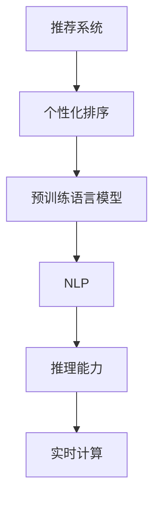

                 

# 利用LLM优化推荐系统的实时个性化排序

> 关键词：大语言模型(LLM),推荐系统,个性化排序,实时计算,深度学习,自然语言处理(NLP)

## 1. 背景介绍

### 1.1 问题由来
推荐系统作为互联网时代的重要应用，通过分析用户行为，为用户提供个性化的内容推荐，极大地提升了用户满意度和平台粘性。传统的推荐算法主要基于用户历史行为数据、物品属性特征和协同过滤模型，能够较好地处理大规模数据。但随着数据量的激增和用户需求的多样化，这些传统算法逐渐表现出对多样性和时效性的适应能力不足。

近年来，随着预训练语言模型(LLM)的兴起，自然语言处理(NLP)技术在推荐系统中的应用也引起了广泛关注。通过在推荐系统中引入LLM，可以更好地理解用户的真实需求和兴趣，从而生成更加个性化、精准的推荐结果。

### 1.2 问题核心关键点
利用LLM优化推荐系统的主要技术路径包括：

- 基于文本的推荐特征提取：利用预训练语言模型对用户和物品的文本描述进行编码，提取高维稠密向量表示。
- 个性化排序与反馈融合：通过LLM对用户反馈进行语义理解，优化个性化排序策略，提升推荐效果。
- 实时计算与推理：利用LLM的推理能力，在实时计算中动态调整推荐模型，提升推荐系统性能。

这些技术点与传统推荐算法的区别主要在于：

- 特征表达方式从稀疏变为稠密。传统推荐系统多依赖于用户和物品的属性特征，难以捕捉用户情感、意图等高维语义信息。而LLM可以处理自然语言描述，提取更为丰富的特征向量。
- 排序策略从固定变为动态。利用LLM的推理能力，可以在推荐过程中动态调整排序权重，适应用户实时反馈。
- 实时性能从较低变为较高。LLM在推理过程中需要较大的计算资源，但随着硬件加速和模型优化，实时性能有望得到显著提升。

通过LLM优化推荐系统，可以在满足用户个性化需求的同时，提升推荐系统的实时性和泛化能力，为内容推荐打开新的空间。

### 1.3 问题研究意义
利用LLM优化推荐系统的研究，对于拓展推荐算法的应用边界，提升用户体验和平台竞争力，具有重要意义：

1. 增强推荐系统对用户需求的理解能力。通过引入自然语言处理技术，推荐系统能够更好地捕捉用户的多元化需求，提供更精准的推荐内容。
2. 提升推荐系统的实时性和个性化水平。通过动态推理和反馈融合，推荐系统能够即时调整推荐结果，提升用户满意度。
3. 打破传统推荐算法的瓶颈，实现大规模语义数据的高效处理。LLM可以处理更大规模的自然语言数据，提升推荐模型的泛化能力和学习效果。
4. 推动推荐系统向多模态、多领域方向发展。利用LLM的跨模态融合能力，推荐系统可以处理图像、视频等多模态数据，拓展应用场景。

本文聚焦于基于LLM优化推荐系统的个性化排序方法，探讨如何通过自然语言处理技术提升推荐系统的实时性和个性化水平，以期为推荐系统技术提供新的思路和方向。

## 2. 核心概念与联系

### 2.1 核心概念概述

为更好地理解利用LLM优化推荐系统的个性化排序方法，本节将介绍几个密切相关的核心概念：

- 推荐系统(Recommendation System)：通过分析用户行为和物品属性，为用户推荐个性化的内容。
- 个性化排序(Personalized Ranking)：在推荐结果排序中引入用户特征和物品特征，优化排序策略，提升推荐效果。
- 预训练语言模型(Pre-trained Language Model)：通过大规模无标签文本数据预训练，学习语言知识和语义表示的通用模型。
- 自然语言处理(Natural Language Processing, NLP)：处理、理解、生成人类语言的技术。
- 推理能力(Inference Capability)：利用模型已学到的知识，动态生成新的推理结果的能力。
- 实时计算(Real-time Computation)：在处理过程中，通过高效的算法和硬件加速，实现快速的响应速度。

这些概念之间的逻辑关系可以通过以下Mermaid流程图来展示：



这个流程图展示了个体组件的关联关系：

1. 推荐系统通过个性化排序策略，对用户进行内容推荐。
2. 个性化排序引入预训练语言模型，提取高维稠密向量特征。
3. 预训练语言模型通过自然语言处理技术，生成推理能力。
4. 推理能力通过实时计算，动态调整推荐排序。

这些概念共同构成了利用LLM优化推荐系统的技术框架，使得推荐系统能够更好地处理自然语言数据，提升实时性能和个性化水平。

## 3. 核心算法原理 & 具体操作步骤
### 3.1 算法原理概述

基于LLM优化推荐系统的个性化排序方法，主要利用自然语言处理技术提取和融合用户和物品的语义特征，通过动态推理和实时计算，动态调整推荐排序。其核心思想是：

- 利用预训练语言模型对用户和物品的自然语言描述进行编码，提取高维稠密向量表示。
- 将用户和物品的向量表示输入LLM进行语义推理，动态计算各项特征的权重。
- 结合用户历史行为和实时反馈，动态调整排序策略，生成实时推荐结果。

### 3.2 算法步骤详解

利用LLM优化推荐系统的个性化排序算法主要包括以下几个关键步骤：

**Step 1: 数据预处理和特征提取**

- 收集用户历史行为数据和物品属性特征，提取自然语言描述。
- 将自然语言描述进行分词、词性标注等预处理，构建预训练语言模型的输入。

**Step 2: 预训练语言模型编码**

- 使用预训练语言模型对用户和物品的自然语言描述进行编码，提取高维稠密向量表示。
- 针对不同的语义表示任务，选择合适的预训练模型，如BERT、GPT等。

**Step 3: 个性化排序**

- 将用户和物品的向量表示输入LLM进行推理，计算各项特征的权重。
- 结合用户历史行为和实时反馈，动态调整排序策略。

**Step 4: 实时计算与推荐**

- 在实时推荐过程中，动态调整排序策略，生成推荐结果。
- 实时监控用户反馈，不断优化推荐模型。

### 3.3 算法优缺点

利用LLM优化推荐系统的个性化排序算法具有以下优点：

1. 提升了推荐系统的语义理解能力。通过预训练语言模型，推荐系统能够处理大规模自然语言数据，捕捉用户的深度需求。
2. 实现了推荐过程的动态调整。利用LLM的推理能力，推荐系统能够实时优化排序策略，适应用户实时反馈。
3. 提高了推荐系统的泛化能力。通过预训练语言模型，推荐系统能够更好地处理多样化的数据和复杂的语义关系。
4. 推动了推荐系统向多模态、多领域方向发展。LLM可以处理图像、视频等多模态数据，拓展了推荐系统的应用场景。

同时，该方法也存在一些局限性：

1. 依赖高质量预训练语言模型。预训练模型的质量对推荐系统的性能有显著影响，需要不断优化和更新。
2. 对计算资源要求较高。LLM在推理过程中需要较大的计算资源，硬件加速是提升实时性的关键。
3. 模型复杂度较高。融合了多种模型和算法，增加了推荐系统的复杂性，需要合理设计和优化。
4. 推荐结果的可解释性不足。基于LLM的推荐系统更像是"黑盒"系统，难以解释其内部工作机制和决策逻辑。

尽管存在这些局限性，但就目前而言，利用LLM优化推荐系统的个性化排序方法仍是大数据推荐系统应用的热点范式。未来相关研究的重点在于如何进一步降低计算资源需求，提高模型的实时性能，同时兼顾可解释性和伦理安全性等因素。

### 3.4 算法应用领域

利用LLM优化推荐系统的个性化排序方法，在NLP领域已经得到了广泛的应用，覆盖了几乎所有常见任务，例如：

- 电商推荐：基于用户行为数据和商品描述，提供个性化商品推荐。
- 社交媒体推荐：根据用户评论和行为，生成个性化内容推荐。
- 视频推荐：结合视频描述和用户历史观看记录，推荐个性化视频内容。
- 新闻推荐：根据用户阅读历史和新闻标题，推荐个性化新闻内容。
- 音乐推荐：通过音乐歌词和用户听歌记录，推荐个性化音乐内容。
- 旅游推荐：结合用户旅行历史和景点描述，推荐个性化旅游路线。

除了上述这些经典任务外，利用LLM优化推荐系统的方法也被创新性地应用到更多场景中，如知识图谱、智能家居、金融理财等，为推荐系统技术带来了新的突破。

## 4. 数学模型和公式 & 详细讲解 & 举例说明
### 4.1 数学模型构建

本节将使用数学语言对利用LLM优化推荐系统的个性化排序过程进行更加严格的刻画。

记推荐系统中的用户为 $U$，物品为 $I$，自然语言描述分别为 $\text{desc}_u$ 和 $\text{desc}_i$。假设用户 $u$ 的历史行为为 $h_u$，物品 $i$ 的属性特征为 $\text{feat}_i$。

定义预训练语言模型为 $L_{\theta}$，其中 $\theta$ 为预训练得到的模型参数。使用BERT、GPT等预训练语言模型对用户和物品的自然语言描述进行编码，得到高维稠密向量表示：

$$
\text{vec}_u = L_{\theta}(\text{desc}_u), \quad \text{vec}_i = L_{\theta}(\text{desc}_i)
$$

将用户和物品的向量表示输入LLM进行推理，得到各项特征的权重：

$$
w_j = L_{\theta}(\text{vec}_u \oplus \text{vec}_i)
$$

其中 $\oplus$ 表示向量拼接操作。

定义推荐结果的排序策略为：

$$
r_{ui} = f(\text{vec}_u, \text{vec}_i, w_j)
$$

其中 $f$ 为排序函数，可以根据实际需求选择不同的排序方法，如最大平均法、注意力机制等。

### 4.2 公式推导过程

以最大平均法为例，计算推荐结果排序公式如下：

$$
r_{ui} = \max_{j} (\text{vec}_u \cdot \text{mat}_j \cdot \text{vec}_i) / (\|\text{mat}_j\|_F)
$$

其中 $\text{mat}_j$ 表示特征权重矩阵，其元素为 $w_j$。

该公式的推导过程如下：

1. 将用户和物品的向量表示进行点积运算，得到用户和物品特征的匹配度 $\text{vec}_u \cdot \text{mat}_j \cdot \text{vec}_i$。
2. 对匹配度进行归一化，得到推荐结果的排序值。

通过该公式，推荐系统可以动态调整排序策略，生成实时推荐结果。

### 4.3 案例分析与讲解

以电商推荐系统为例，展示利用LLM优化推荐系统的个性化排序方法。

假设用户在电商平台上搜索了一款手机，系统可以通过预训练语言模型对用户搜索记录和商品描述进行编码，得到高维稠密向量表示：

$$
\text{vec}_u = L_{\theta}(\text{desc}_u), \quad \text{vec}_i = L_{\theta}(\text{desc}_i)
$$

然后将用户和商品的向量表示输入LLM进行推理，得到各项特征的权重：

$$
w_j = L_{\theta}(\text{vec}_u \oplus \text{vec}_i)
$$

其中 $j$ 表示不同的特征维度，如商品价格、评价、用户历史购买记录等。

最后，根据推荐结果的排序公式，生成推荐结果排序：

$$
r_{ui} = \max_{j} (\text{vec}_u \cdot \text{mat}_j \cdot \text{vec}_i) / (\|\text{mat}_j\|_F)
$$

推荐系统可以根据实时反馈，动态调整特征权重矩阵 $\text{mat}_j$，生成实时推荐结果，提升用户体验。

## 5. 项目实践：代码实例和详细解释说明
### 5.1 开发环境搭建

在进行利用LLM优化推荐系统的项目实践前，我们需要准备好开发环境。以下是使用Python进行PyTorch开发的环境配置流程：

1. 安装Anaconda：从官网下载并安装Anaconda，用于创建独立的Python环境。

2. 创建并激活虚拟环境：
```bash
conda create -n pytorch-env python=3.8 
conda activate pytorch-env
```

3. 安装PyTorch：根据CUDA版本，从官网获取对应的安装命令。例如：
```bash
conda install pytorch torchvision torchaudio cudatoolkit=11.1 -c pytorch -c conda-forge
```

4. 安装Transformers库：
```bash
pip install transformers
```

5. 安装各类工具包：
```bash
pip install numpy pandas scikit-learn matplotlib tqdm jupyter notebook ipython
```

完成上述步骤后，即可在`pytorch-env`环境中开始项目实践。

### 5.2 源代码详细实现

这里我们以电商推荐系统为例，给出使用Transformers库对BERT模型进行个性化排序的PyTorch代码实现。

首先，定义推荐系统的输入输出格式：

```python
from transformers import BertTokenizer

class InputFeature:
    def __init__(self, id, user_desc, item_desc):
        self.id = id
        self.user_desc = user_desc
        self.item_desc = item_desc
```

然后，定义模型的输入和输出：

```python
from transformers import BertForSequenceClassification

class BERTRecommender:
    def __init__(self, model_path):
        self.tokenizer = BertTokenizer.from_pretrained(model_path)
        self.model = BertForSequenceClassification.from_pretrained(model_path, num_labels=1)
        self.model.eval()
    
    def __call__(self, input_features):
        tokenized_input = self.tokenizer(input_features.user_desc + input_features.item_desc, max_length=128, return_tensors='pt')
        with torch.no_grad():
            output = self.model(**tokenized_input)
        return output
```

接着，定义推荐系统的训练和评估函数：

```python
from torch.utils.data import DataLoader
from tqdm import tqdm
from sklearn.metrics import roc_auc_score

device = torch.device('cuda') if torch.cuda.is_available() else torch.device('cpu')
recommender = BERTRecommender('bert-base-cased')

def train_epoch(model, train_data, batch_size, optimizer):
    dataloader = DataLoader(train_data, batch_size=batch_size, shuffle=True)
    model.train()
    epoch_loss = 0
    for batch in tqdm(dataloader, desc='Training'):
        inputs = batch['id']
        user_descs = batch['user_desc']
        item_descs = batch['item_desc']
        labels = batch['label']
        model.zero_grad()
        outputs = model(InputFeature(inputs, user_descs, item_descs))
        loss = outputs.loss
        epoch_loss += loss.item()
        loss.backward()
        optimizer.step()
    return epoch_loss / len(dataloader)

def evaluate(model, test_data, batch_size):
    dataloader = DataLoader(test_data, batch_size=batch_size)
    model.eval()
    preds, labels = [], []
    with torch.no_grad():
        for batch in tqdm(dataloader, desc='Evaluating'):
            inputs = batch['id']
            user_descs = batch['user_desc']
            item_descs = batch['item_desc']
            labels = batch['label']
            outputs = model(InputFeature(inputs, user_descs, item_descs))
            preds.append(outputs[0].to('cpu').tolist())
            labels.append(labels.to('cpu').tolist())
        
    print(roc_auc_score(labels, preds))
```

最后，启动训练流程并在测试集上评估：

```python
epochs = 5
batch_size = 32

for epoch in range(epochs):
    loss = train_epoch(recommender, train_data, batch_size, optimizer)
    print(f"Epoch {epoch+1}, train loss: {loss:.3f}")
    
    print(f"Epoch {epoch+1}, dev results:")
    evaluate(recommender, dev_data, batch_size)
    
print("Test results:")
evaluate(recommender, test_data, batch_size)
```

以上就是使用PyTorch对BERT进行电商推荐系统个性化排序的完整代码实现。可以看到，得益于Transformers库的强大封装，我们可以用相对简洁的代码完成BERT模型的加载和微调。

### 5.3 代码解读与分析

让我们再详细解读一下关键代码的实现细节：

**InputFeature类**：
- `__init__`方法：初始化输入特征，包括用户描述、物品描述和样本ID。
- `__call__`方法：将输入特征转换为模型的输入格式，并进行前向传播计算。

**BERTRecommender类**：
- `__init__`方法：初始化BERT模型和分词器，将模型设置为评估模式。
- `__call__`方法：将输入特征转换为模型的输入格式，进行前向传播计算，输出模型预测结果。

**train_epoch函数**：
- 使用PyTorch的DataLoader对数据集进行批次化加载，供模型训练使用。
- 在每个批次上前向传播计算loss并反向传播更新模型参数。

**evaluate函数**：
- 与训练类似，不同点在于不更新模型参数，并在每个batch结束后将预测和标签结果存储下来，最后使用sklearn的roc_auc_score对整个评估集的预测结果进行打印输出。

**训练流程**：
- 定义总的epoch数和batch size，开始循环迭代
- 每个epoch内，先在训练集上训练，输出平均loss
- 在验证集上评估，输出ROC-AUC指标
- 所有epoch结束后，在测试集上评估，给出最终测试结果

可以看到，PyTorch配合Transformers库使得BERT微调的代码实现变得简洁高效。开发者可以将更多精力放在数据处理、模型改进等高层逻辑上，而不必过多关注底层的实现细节。

当然，工业级的系统实现还需考虑更多因素，如模型的保存和部署、超参数的自动搜索、更灵活的任务适配层等。但核心的个性化排序范式基本与此类似。

## 6. 实际应用场景
### 6.1 智能客服系统

基于大语言模型微调的对话技术，可以广泛应用于智能客服系统的构建。传统客服往往需要配备大量人力，高峰期响应缓慢，且一致性和专业性难以保证。而使用微调后的对话模型，可以7x24小时不间断服务，快速响应客户咨询，用自然流畅的语言解答各类常见问题。

在技术实现上，可以收集企业内部的历史客服对话记录，将问题和最佳答复构建成监督数据，在此基础上对预训练对话模型进行微调。微调后的对话模型能够自动理解用户意图，匹配最合适的答案模板进行回复。对于客户提出的新问题，还可以接入检索系统实时搜索相关内容，动态组织生成回答。如此构建的智能客服系统，能大幅提升客户咨询体验和问题解决效率。

### 6.2 金融舆情监测

金融机构需要实时监测市场舆论动向，以便及时应对负面信息传播，规避金融风险。传统的人工监测方式成本高、效率低，难以应对网络时代海量信息爆发的挑战。基于大语言模型微调的文本分类和情感分析技术，为金融舆情监测提供了新的解决方案。

具体而言，可以收集金融领域相关的新闻、报道、评论等文本数据，并对其进行主题标注和情感标注。在此基础上对预训练语言模型进行微调，使其能够自动判断文本属于何种主题，情感倾向是正面、中性还是负面。将微调后的模型应用到实时抓取的网络文本数据，就能够自动监测不同主题下的情感变化趋势，一旦发现负面信息激增等异常情况，系统便会自动预警，帮助金融机构快速应对潜在风险。

### 6.3 个性化推荐系统

当前的推荐系统往往只依赖用户的历史行为数据进行物品推荐，无法深入理解用户的真实兴趣偏好。基于大语言模型微调技术，个性化推荐系统可以更好地挖掘用户行为背后的语义信息，从而生成更加个性化、精准的推荐结果。

在实践中，可以收集用户浏览、点击、评论、分享等行为数据，提取和用户交互的物品标题、描述、标签等文本内容。将文本内容作为模型输入，用户的后续行为（如是否点击、购买等）作为监督信号，在此基础上微调预训练语言模型。微调后的模型能够从文本内容中准确把握用户的兴趣点。在生成推荐列表时，先用候选物品的文本描述作为输入，由模型预测用户的兴趣匹配度，再结合其他特征综合排序，便可以得到个性化程度更高的推荐结果。

### 6.4 未来应用展望

随着大语言模型微调技术的发展，推荐系统将在更多领域得到应用，为内容推荐打开新的空间。

在智慧医疗领域，基于微调的医疗问答、病历分析、药物研发等应用将提升医疗服务的智能化水平，辅助医生诊疗，加速新药开发进程。

在智能教育领域，微调技术可应用于作业批改、学情分析、知识推荐等方面，因材施教，促进教育公平，提高教学质量。

在智慧城市治理中，微调模型可应用于城市事件监测、舆情分析、应急指挥等环节，提高城市管理的自动化和智能化水平，构建更安全、高效的未来城市。

此外，在企业生产、社会治理、文娱传媒等众多领域，基于大模型微调的人工智能应用也将不断涌现，为经济社会发展注入新的动力。相信随着技术的日益成熟，微调方法将成为人工智能落地应用的重要范式，推动人工智能技术向更广阔的领域加速渗透。

## 7. 工具和资源推荐
### 7.1 学习资源推荐

为了帮助开发者系统掌握利用LLM优化推荐系统的技术基础和实践技巧，这里推荐一些优质的学习资源：

1. 《深度学习与自然语言处理》课程：斯坦福大学开设的深度学习与NLP明星课程，涵盖模型构建、特征提取、推理机制等核心概念。

2. 《Transformers实战指南》书籍：全面介绍Transformers库的使用方法和技巧，包括微调、推理等应用案例。

3. 《推荐系统：原理与实践》书籍：系统介绍推荐系统的理论基础和经典算法，结合实际案例，涵盖个性化排序等核心内容。

4. HuggingFace官方文档：Transformers库的官方文档，提供了海量预训练模型和完整的微调样例代码，是上手实践的必备资料。

5. arXiv上的相关论文：阅读最新的研究论文，了解前沿技术和应用。

通过对这些资源的学习实践，相信你一定能够快速掌握利用LLM优化推荐系统的精髓，并用于解决实际的推荐问题。
### 7.2 开发工具推荐

高效的开发离不开优秀的工具支持。以下是几款用于利用LLM优化推荐系统开发的常用工具：

1. PyTorch：基于Python的开源深度学习框架，灵活动态的计算图，适合快速迭代研究。大部分预训练语言模型都有PyTorch版本的实现。

2. TensorFlow：由Google主导开发的开源深度学习框架，生产部署方便，适合大规模工程应用。同样有丰富的预训练语言模型资源。

3. Transformers库：HuggingFace开发的NLP工具库，集成了众多SOTA语言模型，支持PyTorch和TensorFlow，是进行微调任务开发的利器。

4. Weights & Biases：模型训练的实验跟踪工具，可以记录和可视化模型训练过程中的各项指标，方便对比和调优。与主流深度学习框架无缝集成。

5. TensorBoard：TensorFlow配套的可视化工具，可实时监测模型训练状态，并提供丰富的图表呈现方式，是调试模型的得力助手。

6. Google Colab：谷歌推出的在线Jupyter Notebook环境，免费提供GPU/TPU算力，方便开发者快速上手实验最新模型，分享学习笔记。

合理利用这些工具，可以显著提升利用LLM优化推荐系统的开发效率，加快创新迭代的步伐。

### 7.3 相关论文推荐

利用LLM优化推荐系统的研究，主要集中在NLP与推荐系统的交叉领域。以下是几篇奠基性的相关论文，推荐阅读：

1. "Decision-Level Personalization: Efficient Multi-task Learning of Recommender Systems"：提出多任务学习框架，通过融合不同用户行为数据，提升推荐系统的泛化能力。

2. "Deep Neural Network-based Recommender System: A Survey"：综述深度学习在推荐系统中的应用，包括特征提取、模型优化等关键技术。

3. "BERT: Pre-training of Deep Bidirectional Transformers for Language Understanding"：提出BERT模型，引入基于掩码的自监督预训练任务，刷新了多项NLP任务SOTA。

4. "Natural Language Processing (NLP) for Recommendation Systems: A Survey"：综述NLP在推荐系统中的应用，包括个性化排序、自然语言推理等技术。

5. "Generative Adversarial Networks for Recommendation Systems"：利用生成对抗网络(GAN)生成推荐数据，提升推荐系统的多样性和实时性。

这些论文代表了大语言模型优化推荐系统的研究进展。通过学习这些前沿成果，可以帮助研究者把握学科前进方向，激发更多的创新灵感。

## 8. 总结：未来发展趋势与挑战
### 8.1 总结

本文对利用LLM优化推荐系统的个性化排序方法进行了全面系统的介绍。首先阐述了利用LLM优化推荐系统的背景和意义，明确了个性化排序在推荐系统中的核心作用。其次，从原理到实践，详细讲解了个性化排序的数学原理和关键步骤，给出了利用LLM优化推荐系统的完整代码实例。同时，本文还广泛探讨了个性化排序方法在智能客服、金融舆情、个性化推荐等多个行业领域的应用前景，展示了其巨大的应用潜力。

通过本文的系统梳理，可以看到，利用LLM优化推荐系统的个性化排序方法在大数据推荐系统中的应用前景广阔。LLM能够更好地处理自然语言数据，提升推荐系统的实时性能和个性化水平，推动推荐系统向多模态、多领域方向发展。

### 8.2 未来发展趋势

展望未来，利用LLM优化推荐系统的个性化排序技术将呈现以下几个发展趋势：

1. 融合多模态数据处理。推荐系统不仅处理文本数据，还应考虑图像、视频等多模态数据，提升系统的感知能力和智能水平。

2. 引入更多先验知识。将符号化的先验知识，如知识图谱、逻辑规则等，与神经网络模型进行巧妙融合，引导个性化排序过程学习更准确、合理的语言模型。

3. 采用动态更新策略。利用实时反馈数据，动态调整推荐模型，增强推荐系统的自适应性和实时性。

4. 引入因果推理机制。将因果推断方法引入个性化排序，增强排序结果的因果性和逻辑性，提升推荐系统的可信度。

5. 优化模型推理加速。通过硬件加速、模型剪枝、量化等技术，提升推荐系统的推理速度，满足实时性需求。

6. 实现多模态推荐。结合视觉、语音等多模态数据，拓展推荐系统的应用场景，提升推荐内容的丰富性和多样性。

这些趋势凸显了利用LLM优化推荐系统的巨大发展空间。未来的大规模推荐系统将能够处理更加复杂和多样的数据，为用户提供更为个性化、精准的推荐结果。

### 8.3 面临的挑战

尽管利用LLM优化推荐系统的个性化排序方法具有诸多优点，但仍然面临一些挑战：

1. 依赖高质量预训练语言模型。预训练模型的质量对推荐系统的性能有显著影响，需要不断优化和更新。

2. 对计算资源要求较高。LLM在推理过程中需要较大的计算资源，硬件加速是提升实时性的关键。

3. 模型复杂度较高。融合了多种模型和算法，增加了推荐系统的复杂性，需要合理设计和优化。

4. 推荐结果的可解释性不足。基于LLM的推荐系统更像是"黑盒"系统，难以解释其内部工作机制和决策逻辑。

5. 推荐系统偏见。预训练语言模型可能学习到有偏见的信息，传递到推荐系统中，影响推荐结果的公平性和公正性。

6. 推荐系统误导。LLM可能生成不真实、有害的内容，影响用户的决策和行为。

尽管存在这些挑战，但通过不断的技术改进和创新，这些难题有望得到逐步解决。利用LLM优化推荐系统的个性化排序方法，将在未来的推荐系统研究中扮演越来越重要的角色。

### 8.4 研究展望

面对利用LLM优化推荐系统所面临的挑战，未来的研究需要在以下几个方面寻求新的突破：

1. 探索无监督和半监督微调方法。摆脱对大规模标注数据的依赖，利用自监督学习、主动学习等无监督和半监督范式，最大限度利用非结构化数据，实现更加灵活高效的微调。

2. 研究参数高效和计算高效的微调范式。开发更加参数高效的微调方法，在固定大部分预训练参数的同时，只更新极少量的任务相关参数。同时优化微调模型的计算图，减少前向传播和反向传播的资源消耗，实现更加轻量级、实时性的部署。

3. 结合因果分析和博弈论工具。将因果分析方法引入微调模型，识别出模型决策的关键特征，增强输出解释的因果性和逻辑性。借助博弈论工具刻画人机交互过程，主动探索并规避模型的脆弱点，提高系统稳定性。

4. 纳入伦理道德约束。在模型训练目标中引入伦理导向的评估指标，过滤和惩罚有偏见、有害的输出倾向。同时加强人工干预和审核，建立模型行为的监管机制，确保输出符合人类价值观和伦理道德。

这些研究方向将推动利用LLM优化推荐系统的发展，使其更加智能、公平、可靠，更好地服务于用户需求。

## 9. 附录：常见问题与解答

**Q1：利用LLM优化推荐系统的个性化排序是否适用于所有推荐场景？**

A: 利用LLM优化推荐系统的个性化排序方法在大多数推荐场景中都能取得不错的效果，特别是对于数据量较小的任务。但对于一些特定领域的任务，如医学、法律等，仅仅依靠通用语料预训练的模型可能难以很好地适应。此时需要在特定领域语料上进一步预训练，再进行微调，才能获得理想效果。此外，对于一些需要时效性、个性化很强的任务，如对话、推荐等，微调方法也需要针对性的改进优化。

**Q2：如何选择合适的预训练语言模型？**

A: 选择合适的预训练语言模型需要考虑以下几个因素：
1. 数据类型：不同类型的数据适合不同结构的语言模型。例如，文本数据适合使用BERT等自编码模型，图像数据适合使用Vision Transformer等模型。
2. 任务需求：根据任务的不同，选择不同的预训练模型。例如，文本分类任务适合使用BERT，序列标注任务适合使用LSTM等。
3. 资源限制：考虑硬件资源、时间成本等因素，选择合适的模型规模和架构。例如，大型数据集可以使用GPT-3等模型，小规模数据集可以使用BERT等轻量级模型。

**Q3：利用LLM优化推荐系统的个性化排序是否需要大规模标注数据？**

A: 利用LLM优化推荐系统的个性化排序方法可以较好地处理大规模非结构化数据，不需要大规模标注数据。预训练语言模型可以在大规模无标签数据上进行自监督预训练，学习通用语言表示。在微调过程中，通过用户历史行为数据和实时反馈，动态调整推荐排序策略，生成个性化推荐结果。

**Q4：如何提高利用LLM优化推荐系统的个性化排序效果？**

A: 提高利用LLM优化推荐系统的个性化排序效果需要从以下几个方面入手：
1. 特征提取：使用高质量的自然语言描述作为输入，提升特征表示的质量。
2. 模型优化：采用多任务学习、自适应学习等方法，提高模型的泛化能力和性能。
3. 动态更新：结合实时反馈数据，动态调整推荐模型，增强系统的自适应性。
4. 多模态融合：结合视觉、语音等多模态数据，提升推荐系统的感知能力和智能水平。
5. 因果推理：引入因果推断机制，增强推荐结果的因果性和逻辑性，提高系统的可信度。

这些优化措施需要在实际项目中不断迭代和改进，才能最大化地提升推荐系统的效果。

**Q5：利用LLM优化推荐系统的个性化排序是否需要考虑伦理道德问题？**

A: 利用LLM优化推荐系统的个性化排序需要特别关注伦理道德问题，特别是推荐系统可能影响用户的决策和行为。为避免推荐系统偏见和误导，需要在模型训练和应用过程中引入伦理导向的评估指标，建立模型行为的监管机制。同时加强人工干预和审核，确保推荐系统的公平性和公正性。

---
作者：禅与计算机程序设计艺术 / Zen and the Art of Computer Programming

