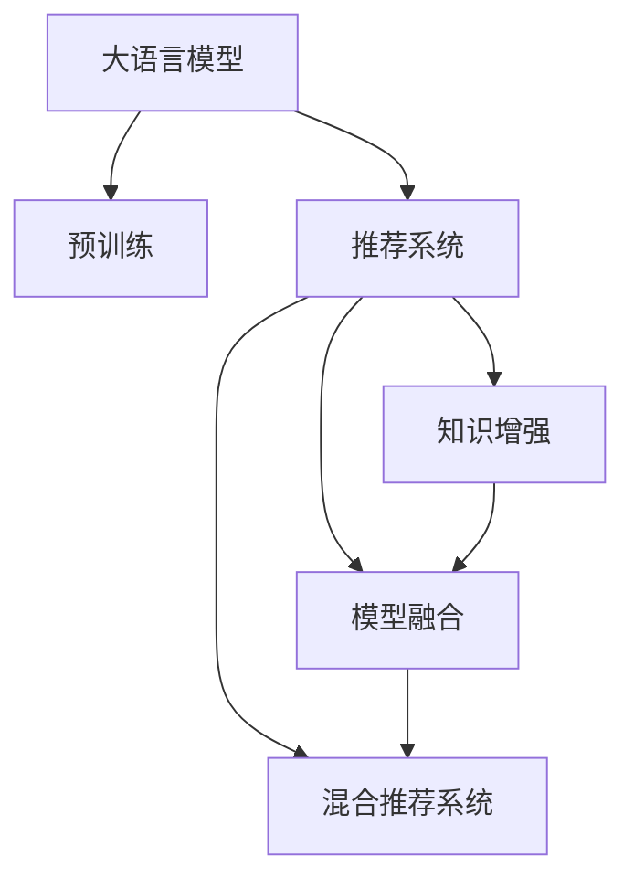

                 

## 1. 背景介绍

### 1.1 问题由来

在现代信息爆炸时代，面对海量的用户需求和数据，推荐系统成为互联网公司竞争力的关键。推荐算法旨在通过分析用户行为数据和物品属性数据，挖掘用户兴趣偏好，从而为用户提供个性化推荐内容。然而，在数据量激增的同时，推荐系统的复杂度和处理难度也在不断提升，传统的协同过滤、基于内容的推荐等方法逐渐陷入瓶颈。

### 1.2 问题核心关键点

推荐系统面临的核心挑战包括数据稀疏性、冷启动问题、动态变化的用户兴趣等。这些问题使得推荐系统难以精准把握用户的真实需求，推荐内容与用户期望偏差较大，用户体验下降。而大语言模型的出现，带来了新一轮的希望。

大语言模型，如BERT、GPT-3等，通过在大规模无标签文本数据上进行预训练，学习到丰富的语言知识和常识，具备强大的语义理解与生成能力。将大语言模型应用于推荐系统，能够充分利用模型学到的知识，有效应对推荐算法中的种种挑战。

## 2. 核心概念与联系

### 2.1 核心概念概述

为更好地理解大语言模型在推荐系统中的应用，本节将介绍几个密切相关的核心概念：

- **大语言模型(Large Language Models, LLMs)**：如BERT、GPT-3等，通过自监督学习任务预训练得到的大规模语言模型，能够从大量文本数据中学习到通用语言表示。

- **预训练(Pre-training)**：指在大规模无标签文本语料上，通过自监督学习任务训练大语言模型的过程。常见的预训练任务包括掩码语言模型、相对位置预测等。

- **推荐系统(Recommender Systems)**：通过分析用户行为数据和物品属性数据，为用户推荐个性化内容的系统。传统方法包括协同过滤、基于内容的推荐等。

- **知识增强(Knowledge Augmentation)**：通过融入知识图谱、外部规则等先验知识，提升推荐系统的性能。知识增强是大语言模型在推荐系统中发挥核心作用的重要手段。

- **模型融合(Model Fusion)**：将多种模型或算法进行组合，以获得更好的推荐效果。知识增强是模型融合中的一个重要组成部分。

- **混合推荐系统(Hybrid Recommender Systems)**：结合传统推荐方法和先进技术，实现性能和效率的平衡。大语言模型在混合推荐系统中可以与协同过滤、基于内容的推荐等方法协同工作。

这些核心概念之间的逻辑关系可以通过以下Mermaid流程图来展示：



这个流程图展示了大语言模型在推荐系统中的核心概念及其之间的关系：

1. 大语言模型通过预训练获得基础能力。
2. 推荐系统将模型应用于实际业务场景，实现个性化推荐。
3. 知识增强通过引入先验知识，提升推荐系统的性能。
4. 模型融合通过多种方法组合，实现更优推荐效果。
5. 混合推荐系统将传统方法和先进技术结合，构建更高性能的系统。

## 3. 核心算法原理 & 具体操作步骤

### 3.1 算法原理概述

利用大语言模型知识增强推荐系统，本质上是将大语言模型与推荐算法进行融合，将语言模型的通用知识应用于推荐任务，提升推荐的准确性和多样性。

形式化地，假设推荐系统需要预测用户 $u$ 对物品 $i$ 的评分 $p_{ui}$。使用大语言模型 $M_{\theta}$ 作为特征提取器，得到物品 $i$ 的表示向量 $v_i = M_{\theta}(i)$。则预测用户对物品的评分可表示为：

$$
p_{ui} = \sigma(\langle v_i, u \rangle)
$$

其中 $\sigma$ 为激活函数，$\langle \cdot, \cdot \rangle$ 为向量内积。该方法被称为大语言模型推荐，是一种基于语义理解的知识增强推荐方法。

### 3.2 算法步骤详解

利用大语言模型知识增强推荐系统的实现步骤如下：

**Step 1: 准备数据集和预训练模型**
- 收集用户行为数据和物品属性数据，准备推荐系统训练数据集。
- 选择合适的预训练语言模型 $M_{\theta}$，如BERT、GPT-3等，作为特征提取器。

**Step 2: 设计任务适配层**
- 在预训练模型的顶层设计合适的输出层和损失函数。对于评分预测任务，通常使用分类交叉熵损失函数。

**Step 3: 微调模型**
- 使用推荐系统训练数据集对预训练模型进行微调，最小化预测评分与真实评分之间的差异。

**Step 4: 评估与部署**
- 在测试集上评估微调后模型的评分预测效果。
- 使用微调后的模型对新用户和新物品进行推荐。

### 3.3 算法优缺点

利用大语言模型知识增强推荐系统具有以下优点：
1. 利用大语言模型的语义理解能力，能够从更广泛的语义空间中挖掘用户兴趣。
2. 能够在用户兴趣较为模糊时，利用模型推理得出合理推荐。
3. 能够自然地引入多模态信息，实现跨模态推荐。

同时，该方法也存在一定的局限性：
1. 对标注数据的需求较高。需要高质量、大规模的推荐数据集，获取成本较高。
2. 模型计算复杂度较高。大规模语言模型的推理速度较慢，可能影响实时推荐。
3. 存在潜在的知识偏差。模型可能学习到数据中的偏见，导致推荐结果偏颇。
4. 可解释性不足。推荐模型的决策过程较难解释，难以调试和优化。

尽管存在这些局限性，但就目前而言，利用大语言模型知识增强推荐系统仍是一种高效、有效的推荐方法。未来相关研究将集中在降低标注成本、提升计算效率、消除知识偏差和增强可解释性等方面。

### 3.4 算法应用领域

利用大语言模型知识增强推荐系统已经被广泛应用于以下几个领域：

- **电商推荐**：如Amazon、淘宝等电商平台，通过大语言模型实现商品推荐、广告投放等。
- **内容推荐**：如YouTube、Netflix等平台，使用大语言模型推荐视频、电影等内容。
- **音乐推荐**：如Spotify等音乐平台，利用大语言模型推荐个性化音乐播放列表。
- **新闻推荐**：如今日头条等新闻聚合平台，通过大语言模型实现个性化新闻推送。
- **社交网络推荐**：如Facebook、微博等社交平台，推荐用户感兴趣的内容和用户。

这些领域的大规模实践验证了利用大语言模型知识增强推荐系统的可行性和有效性，未来仍将在更多行业得到应用。

## 4. 数学模型和公式 & 详细讲解 & 举例说明

### 4.1 数学模型构建

假设推荐系统需要预测用户 $u$ 对物品 $i$ 的评分 $p_{ui}$，使用大语言模型 $M_{\theta}$ 作为特征提取器，得到物品 $i$ 的表示向量 $v_i = M_{\theta}(i)$。则预测用户对物品的评分可表示为：

$$
p_{ui} = \sigma(\langle v_i, u \rangle)
$$

其中 $\sigma$ 为激活函数，$\langle \cdot, \cdot \rangle$ 为向量内积。为了使模型能更精确地预测评分，可以利用多维线性变换对特征进行增强：

$$
p_{ui} = \sigma(\langle \Phi(v_i), \Phi(u) \rangle)
$$

其中 $\Phi(\cdot)$ 为特征映射函数，将特征向量映射到更高维空间。

### 4.2 公式推导过程

对于评分预测任务，目标是最小化预测评分 $p_{ui}$ 与真实评分 $y_{ui}$ 之间的均方误差：

$$
\mathcal{L} = \frac{1}{N} \sum_{i=1}^N \sum_{u=1}^M (p_{ui} - y_{ui})^2
$$

其中 $N$ 为物品数量，$M$ 为用户数量。利用梯度下降等优化算法，最小化损失函数，得到最优模型参数 $\theta$。

### 4.3 案例分析与讲解

以Amazon商品推荐为例，使用大语言模型实现商品推荐。首先，收集Amazon商品数据和用户行为数据，准备训练集和测试集。然后，使用BERT作为预训练模型，在推荐系统训练数据集上进行微调。最后，在测试集上评估微调后的模型，并使用其进行商品推荐。

具体步骤如下：
1. 准备数据集：收集Amazon商品数据和用户行为数据，将数据划分为训练集和测试集。
2. 设计任务适配层：在BERT模型的顶层添加线性分类器，使用均方误差损失函数。
3. 微调模型：在训练集上对BERT模型进行微调，最小化预测评分与真实评分之间的差异。
4. 评估与部署：在测试集上评估微调后的模型，并使用其进行商品推荐。

## 5. 项目实践：代码实例和详细解释说明

### 5.1 开发环境搭建

在进行大语言模型推荐系统开发前，我们需要准备好开发环境。以下是使用Python进行PyTorch开发的环境配置流程：

1. 安装Anaconda：从官网下载并安装Anaconda，用于创建独立的Python环境。

2. 创建并激活虚拟环境：
```bash
conda create -n pytorch-env python=3.8 
conda activate pytorch-env
```

3. 安装PyTorch：根据CUDA版本，从官网获取对应的安装命令。例如：
```bash
conda install pytorch torchvision torchaudio cudatoolkit=11.1 -c pytorch -c conda-forge
```

4. 安装Transformers库：
```bash
pip install transformers
```

5. 安装各类工具包：
```bash
pip install numpy pandas scikit-learn matplotlib tqdm jupyter notebook ipython
```

完成上述步骤后，即可在`pytorch-env`环境中开始推荐系统开发。

### 5.2 源代码详细实现

下面我们以Amazon商品推荐为例，给出使用Transformers库对BERT模型进行推荐系统微调的PyTorch代码实现。

首先，定义评分预测任务的数据处理函数：

```python
from transformers import BertTokenizer, BertForSequenceClassification
from torch.utils.data import Dataset
import torch

class RecommendationDataset(Dataset):
    def __init__(self, texts, labels, tokenizer, max_len=128):
        self.texts = texts
        self.labels = labels
        self.tokenizer = tokenizer
        self.max_len = max_len
        
    def __len__(self):
        return len(self.texts)
    
    def __getitem__(self, item):
        text = self.texts[item]
        label = self.labels[item]
        
        encoding = self.tokenizer(text, return_tensors='pt', max_length=self.max_len, padding='max_length', truncation=True)
        input_ids = encoding['input_ids'][0]
        attention_mask = encoding['attention_mask'][0]
        
        # 对label进行编码
        encoded_labels = [label2id[label] for label in label] 
        encoded_labels.extend([label2id['0']] * (self.max_len - len(encoded_labels)))
        labels = torch.tensor(encoded_labels, dtype=torch.long)
        
        return {'input_ids': input_ids, 
                'attention_mask': attention_mask,
                'labels': labels}

# 标签与id的映射
label2id = {'0': 0, '1': 1, '2': 2, '3': 3}
id2label = {v: k for k, v in label2id.items()}

# 创建dataset
tokenizer = BertTokenizer.from_pretrained('bert-base-cased')

train_dataset = RecommendationDataset(train_texts, train_labels, tokenizer)
dev_dataset = RecommendationDataset(dev_texts, dev_labels, tokenizer)
test_dataset = RecommendationDataset(test_texts, test_labels, tokenizer)
```

然后，定义模型和优化器：

```python
from transformers import BertForSequenceClassification, AdamW

model = BertForSequenceClassification.from_pretrained('bert-base-cased', num_labels=len(label2id))

optimizer = AdamW(model.parameters(), lr=2e-5)
```

接着，定义训练和评估函数：

```python
from torch.utils.data import DataLoader
from tqdm import tqdm
from sklearn.metrics import mean_squared_error

device = torch.device('cuda') if torch.cuda.is_available() else torch.device('cpu')
model.to(device)

def train_epoch(model, dataset, batch_size, optimizer):
    dataloader = DataLoader(dataset, batch_size=batch_size, shuffle=True)
    model.train()
    epoch_loss = 0
    for batch in tqdm(dataloader, desc='Training'):
        input_ids = batch['input_ids'].to(device)
        attention_mask = batch['attention_mask'].to(device)
        labels = batch['labels'].to(device)
        model.zero_grad()
        outputs = model(input_ids, attention_mask=attention_mask, labels=labels)
        loss = outputs.loss
        epoch_loss += loss.item()
        loss.backward()
        optimizer.step()
    return epoch_loss / len(dataloader)

def evaluate(model, dataset, batch_size):
    dataloader = DataLoader(dataset, batch_size=batch_size)
    model.eval()
    preds, labels = [], []
    with torch.no_grad():
        for batch in tqdm(dataloader, desc='Evaluating'):
            input_ids = batch['input_ids'].to(device)
            attention_mask = batch['attention_mask'].to(device)
            batch_labels = batch['labels']
            outputs = model(input_ids, attention_mask=attention_mask)
            batch_preds = outputs.logits.argmax(dim=1).to('cpu').tolist()
            batch_labels = batch_labels.to('cpu').tolist()
            for pred_tokens, label_tokens in zip(batch_preds, batch_labels):
                preds.append(pred_tokens[:len(label_tokens)])
                labels.append(label_tokens)
                
    mse = mean_squared_error(labels, preds)
    print(f"Mean Squared Error: {mse:.3f}")
```

最后，启动训练流程并在测试集上评估：

```python
epochs = 5
batch_size = 16

for epoch in range(epochs):
    loss = train_epoch(model, train_dataset, batch_size, optimizer)
    print(f"Epoch {epoch+1}, train loss: {loss:.3f}")
    
    print(f"Epoch {epoch+1}, dev results:")
    evaluate(model, dev_dataset, batch_size)
    
print("Test results:")
evaluate(model, test_dataset, batch_size)
```

以上就是使用PyTorch对BERT进行Amazon商品推荐微调的完整代码实现。可以看到，得益于Transformers库的强大封装，我们可以用相对简洁的代码完成BERT模型的加载和微调。

### 5.3 代码解读与分析

让我们再详细解读一下关键代码的实现细节：

**RecommendationDataset类**：
- `__init__`方法：初始化文本、标签、分词器等关键组件。
- `__len__`方法：返回数据集的样本数量。
- `__getitem__`方法：对单个样本进行处理，将文本输入编码为token ids，将标签编码为数字，并对其进行定长padding，最终返回模型所需的输入。

**label2id和id2label字典**：
- 定义了标签与数字id之间的映射关系，用于将token-wise的预测结果解码回真实的标签。

**训练和评估函数**：
- 使用PyTorch的DataLoader对数据集进行批次化加载，供模型训练和推理使用。
- 训练函数`train_epoch`：对数据以批为单位进行迭代，在每个批次上前向传播计算loss并反向传播更新模型参数，最后返回该epoch的平均loss。
- 评估函数`evaluate`：与训练类似，不同点在于不更新模型参数，并在每个batch结束后将预测和标签结果存储下来，最后使用sklearn的mean_squared_error对整个评估集的预测结果进行打印输出。

**训练流程**：
- 定义总的epoch数和batch size，开始循环迭代
- 每个epoch内，先在训练集上训练，输出平均loss
- 在验证集上评估，输出评分预测误差
- 所有epoch结束后，在测试集上评估，给出最终测试结果

可以看到，PyTorch配合Transformers库使得BERT微调的代码实现变得简洁高效。开发者可以将更多精力放在数据处理、模型改进等高层逻辑上，而不必过多关注底层的实现细节。

当然，工业级的系统实现还需考虑更多因素，如模型的保存和部署、超参数的自动搜索、更灵活的任务适配层等。但核心的微调范式基本与此类似。

## 6. 实际应用场景

### 6.1 电商推荐

利用大语言模型知识增强的电商推荐系统，能够为用户提供精准的商品推荐，提高用户满意度和转化率。Amazon等电商平台已经采用了类似的推荐技术，取得了显著成效。

具体而言，电商推荐系统可以通过收集用户浏览、点击、购买等行为数据，将其输入到大语言模型中，学习用户兴趣和物品特征。然后，使用微调后的模型预测用户对不同商品的评分，推荐评分较高的商品给用户，实现个性化推荐。

### 6.2 内容推荐

内容推荐系统在视频、音乐、新闻等平台有广泛应用。通过大语言模型对用户行为和物品属性进行分析，可以为用户提供更加符合其兴趣的推荐内容，提升平台的用户粘性和留存率。

例如，在YouTube上，利用大语言模型分析用户观影记录和观看历史，推荐用户感兴趣的视频内容。在Netflix上，通过大语言模型推荐用户喜欢的电影和电视剧。在今日头条等新闻聚合平台，通过大语言模型推荐用户感兴趣的新闻内容。

### 6.3 音乐推荐

音乐推荐系统在Spotify等平台有广泛应用。通过大语言模型对用户听歌记录和音乐属性进行分析，可以为用户推荐个性化的音乐播放列表，提升用户满意度和平台活跃度。

具体而言，Spotify可以收集用户听歌记录、评价等信息，利用大语言模型分析用户喜好，推荐相似风格的音乐。通过微调后的模型，Spotify可以更准确地推荐用户感兴趣的音乐，提升用户体验。

### 6.4 未来应用展望

随着大语言模型和推荐算法的发展，基于知识增强的推荐系统将在更多领域得到应用，为各行各业带来变革性影响。

在智慧医疗领域，推荐系统可以辅助医生推荐适合患者的治疗方案、药品等，提升医疗服务效率和质量。

在智能教育领域，推荐系统可以推荐适合学生的学习资源、作业、视频等，提升学习效果。

在智慧城市治理中，推荐系统可以推荐城市事件、公共服务、基础设施等，提高城市管理水平。

此外，在企业生产、社会治理、文娱传媒等众多领域，基于大语言模型知识增强的推荐系统也将不断涌现，为经济社会发展注入新的动力。相信随着技术的日益成熟，推荐系统必将在更广阔的应用领域大放异彩。

## 7. 工具和资源推荐

### 7.1 学习资源推荐

为了帮助开发者系统掌握大语言模型知识增强推荐理论基础和实践技巧，这里推荐一些优质的学习资源：

1. 《深度学习理论与实践》系列博文：由大模型技术专家撰写，深入浅出地介绍了深度学习理论、推荐系统算法等内容。

2. CS231n《深度学习视觉识别》课程：斯坦福大学开设的视觉识别明星课程，有Lecture视频和配套作业，带你入门深度学习与推荐系统。

3. 《推荐系统理论与实践》书籍：推荐系统领域的经典著作，涵盖推荐算法原理、实验设计等内容。

4. KDD Cup比赛：推荐系统领域的重要赛事，涵盖推荐算法创新、实验设计等，助力科研和技术进步。

5. RecSys社区：推荐系统领域的专业社区，汇集了全球顶级科研人员和产业从业者，提供丰富的学习资源和交流平台。

通过对这些资源的学习实践，相信你一定能够快速掌握大语言模型知识增强推荐技术的精髓，并用于解决实际的推荐问题。

### 7.2 开发工具推荐

高效的开发离不开优秀的工具支持。以下是几款用于大语言模型知识增强推荐系统开发的常用工具：

1. PyTorch：基于Python的开源深度学习框架，灵活动态的计算图，适合快速迭代研究。大部分预训练语言模型都有PyTorch版本的实现。

2. TensorFlow：由Google主导开发的开源深度学习框架，生产部署方便，适合大规模工程应用。同样有丰富的预训练语言模型资源。

3. Transformers库：HuggingFace开发的NLP工具库，集成了众多SOTA语言模型，支持PyTorch和TensorFlow，是进行推荐系统微调的重要工具。

4. Weights & Biases：模型训练的实验跟踪工具，可以记录和可视化模型训练过程中的各项指标，方便对比和调优。与主流深度学习框架无缝集成。

5. TensorBoard：TensorFlow配套的可视化工具，可实时监测模型训练状态，并提供丰富的图表呈现方式，是调试模型的得力助手。

6. Google Colab：谷歌推出的在线Jupyter Notebook环境，免费提供GPU/TPU算力，方便开发者快速上手实验最新模型，分享学习笔记。

合理利用这些工具，可以显著提升大语言模型知识增强推荐系统开发的效率，加快创新迭代的步伐。

### 7.3 相关论文推荐

大语言模型和知识增强推荐技术的发展源于学界的持续研究。以下是几篇奠基性的相关论文，推荐阅读：

1. Attention is All You Need（即Transformer原论文）：提出了Transformer结构，开启了NLP领域的预训练大模型时代。

2. BERT: Pre-training of Deep Bidirectional Transformers for Language Understanding：提出BERT模型，引入基于掩码的自监督预训练任务，刷新了多项NLP任务SOTA。

3. Large-Scale Pre-training for Object Detection：利用大模型在大规模图像数据上进行预训练，提升了图像识别任务的效果。

4. Knowledge Graphs for Recommendation Systems：提出知识图谱与推荐系统的融合方法，利用知识图谱丰富推荐系统的信息维度。

5. Semantic Similarity Search in Graph Neural Networks：提出基于图神经网络的语义相似度搜索方法，增强推荐系统的多模态融合能力。

这些论文代表了大语言模型知识增强推荐技术的发展脉络。通过学习这些前沿成果，可以帮助研究者把握学科前进方向，激发更多的创新灵感。

## 8. 总结：未来发展趋势与挑战

### 8.1 总结

本文对利用大语言模型知识增强推荐系统的方法进行了全面系统的介绍。首先阐述了大语言模型和推荐系统的研究背景和意义，明确了知识增强在拓展推荐算法性能方面的独特价值。其次，从原理到实践，详细讲解了知识增强推荐系统的数学原理和关键步骤，给出了推荐系统开发的完整代码实例。同时，本文还广泛探讨了知识增强在电商、内容、音乐、新闻等多个行业领域的应用前景，展示了知识增强范式的巨大潜力。此外，本文精选了知识增强推荐系统的学习资源，力求为读者提供全方位的技术指引。

通过本文的系统梳理，可以看到，利用大语言模型知识增强推荐系统已经展现出显著的效果，特别是在处理复杂推荐场景中表现出色。未来，伴随大语言模型和推荐算法的进一步演进，知识增强推荐技术必将在更多领域得到应用，为经济社会发展注入新的动力。

### 8.2 未来发展趋势

展望未来，利用大语言模型知识增强推荐系统将呈现以下几个发展趋势：

1. 知识图谱与推荐系统的深度融合：知识图谱将成为推荐系统的重要知识来源，丰富推荐系统的信息维度。

2. 多模态融合：推荐系统将充分利用图像、音频、视频等多模态信息，提升推荐的全面性和多样性。

3. 知识增强的实时化：推荐系统将能够实时更新知识库，动态调整推荐策略，提高推荐的时效性和灵活性。

4. 跨领域推荐：推荐系统将能够跨领域、跨模态地进行知识融合，提升推荐的泛化性和普适性。

5. 可解释性与公平性：推荐系统将更加注重可解释性和公平性，增强用户的信任和满意度。

以上趋势凸显了知识增强推荐系统的广阔前景。这些方向的探索发展，必将进一步提升推荐系统的性能和应用范围，为经济社会发展带来更多新的机遇。

### 8.3 面临的挑战

尽管利用大语言模型知识增强推荐系统已经取得了显著成效，但在迈向更加智能化、普适化应用的过程中，它仍面临着诸多挑战：

1. 标注成本瓶颈：推荐系统通常需要大量标注数据，标注成本较高。如何降低标注成本，获取高质量标注数据，仍然是一个重要问题。

2. 动态性问题：用户兴趣和物品属性随时变化，推荐系统需要快速响应。如何在动态变化中保持推荐系统的稳定性和准确性，是一个难题。

3. 实时性问题：推荐系统需要实时响应用户请求，计算复杂度较高，如何优化计算效率，提升实时响应能力，是一个重要挑战。

4. 数据隐私问题：推荐系统需要收集和处理大量用户数据，如何保护用户隐私，确保数据安全，是一个重要课题。

5. 可解释性问题：推荐系统的决策过程较难解释，难以调试和优化。如何增强推荐系统的可解释性，增强用户信任，是一个重要方向。

6. 公平性问题：推荐系统可能存在偏见和歧视，如何消除偏见，确保公平性，是一个重要课题。

这些挑战需要学术界和产业界共同努力，积极应对并寻求突破。只有解决好这些问题，知识增强推荐技术才能真正发挥其应有的价值。

### 8.4 研究展望

面对利用大语言模型知识增强推荐系统所面临的种种挑战，未来的研究需要在以下几个方面寻求新的突破：

1. 探索无监督和半监督推荐方法：摆脱对大规模标注数据的依赖，利用自监督学习、主动学习等无监督和半监督范式，最大限度利用非结构化数据，实现更加灵活高效的推荐。

2. 研究参数高效推荐方法：开发更加参数高效的推荐算法，在固定大部分预训练参数的同时，只更新极少量的任务相关参数。同时优化推荐模型的计算图，减少前向传播和反向传播的资源消耗，实现更加轻量级、实时性的部署。

3. 引入因果推断与对抗学习：通过引入因果推断和对抗学习思想，增强推荐模型建立稳定因果关系的能力，学习更加普适、鲁棒的语言表征，从而提升模型泛化性和抗干扰能力。

4. 融入更多先验知识：将符号化的先验知识，如知识图谱、逻辑规则等，与神经网络模型进行巧妙融合，引导推荐过程学习更准确、合理的知识表示。

5. 结合因果分析和博弈论工具：将因果分析方法引入推荐模型，识别出模型决策的关键特征，增强推荐模型的可解释性。借助博弈论工具刻画人机交互过程，主动探索并规避模型的脆弱点，提高系统稳定性。

6. 纳入伦理道德约束：在推荐模型中引入伦理导向的评估指标，过滤和惩罚有偏见、有害的输出倾向。同时加强人工干预和审核，建立模型行为的监管机制，确保输出符合人类价值观和伦理道德。

这些研究方向的探索，必将引领知识增强推荐技术迈向更高的台阶，为构建安全、可靠、可解释、可控的智能系统铺平道路。面向未来，知识增强推荐技术还需要与其他人工智能技术进行更深入的融合，如知识表示、因果推理、强化学习等，多路径协同发力，共同推动自然语言理解和智能交互系统的进步。只有勇于创新、敢于突破，才能不断拓展语言模型的边界，让智能技术更好地造福人类社会。

## 9. 附录：常见问题与解答

**Q1：利用大语言模型知识增强推荐系统是否适用于所有推荐场景？**

A: 利用大语言模型知识增强推荐系统在处理复杂推荐场景中表现出色，但在一些特殊场景中可能存在局限性。例如，对于实时性要求极高的场景（如实时广告投放），推荐系统需要快速响应，而大语言模型的推理速度较慢，可能无法满足需求。此外，对于冷启动用户和物品，由于缺乏足够的行为数据，大语言模型可能难以精准推荐。

**Q2：如何降低知识增强推荐系统对标注数据的需求？**

A: 降低知识增强推荐系统对标注数据的需求，可以通过无监督和半监督推荐方法来实现。利用自监督学习、主动学习等无监督和半监督范式，最大限度利用非结构化数据，减少对标注样本的依赖。例如，可以使用图像、音频等非结构化数据进行预训练，然后利用推荐系统训练数据进行微调。

**Q3：推荐系统如何平衡准确性和多样性？**

A: 推荐系统需要在准确性和多样性之间寻找平衡。为了提高推荐多样性，可以在预测评分时引入多样性惩罚项，促使模型推荐更多样化的物品。同时，可以在损失函数中加入负采样技术，增加负样本的权重，降低热门物品的推荐概率。此外，可以通过多模型融合等方式，提升推荐系统的多样性。

**Q4：如何提高知识增强推荐系统的实时性？**

A: 提高知识增强推荐系统的实时性，可以通过优化模型结构和算法实现。例如，可以使用剪枝、量化等方法减少模型参数，提升推理速度。同时，可以采用混合精度训练、异步计算等技术，提高计算效率。此外，可以使用分布式计算、流式处理等方法，实现推荐系统的实时响应。

**Q5：如何保护用户隐私？**

A: 保护用户隐私是推荐系统的重要课题。推荐系统需要采取数据脱敏、匿名化等技术手段，防止用户隐私泄露。同时，可以采用差分隐私等技术，限制数据对个人用户的曝光程度。此外，可以设计隐私保护模型，在推荐过程中保护用户隐私。

这些问题的解答，能够帮助开发者更好地理解大语言模型知识增强推荐系统的优势与局限，以及在实际应用中需要注意的事项。相信随着技术的不断演进，知识增强推荐系统将在更多领域得到广泛应用，为社会发展和人类福祉带来更多新的机遇。

---

作者：禅与计算机程序设计艺术 / Zen and the Art of Computer Programming

