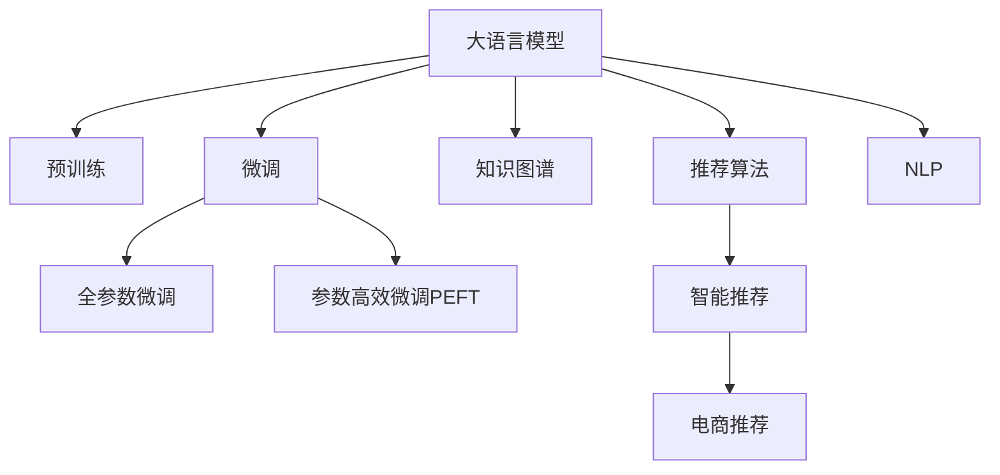

                 

# 利用大模型进行候选商品二次选择

> 关键词：大语言模型,商品推荐系统,自然语言处理(NLP),数据挖掘,知识图谱,推荐算法,智能推荐

## 1. 背景介绍

### 1.1 问题由来

在电商行业中，如何准确地向用户推荐他们可能感兴趣的商品，是提升用户体验和销售转化率的关键。传统的推荐算法如协同过滤、矩阵分解等，虽然能够取得不错的效果，但受限于用户行为数据不足、冷启动问题等局限，难以应对长尾商品、个性化需求等问题。而通过大模型进行二次推荐，能够有效提升推荐精度，满足更多个性化需求。

### 1.2 问题核心关键点

利用大语言模型进行候选商品二次选择的关键点在于：

- 如何构建高质量的数据集：包括用户历史行为数据、商品属性数据、用户评论数据等。
- 如何设计合适的特征表示：将文本数据转化为数字向量，以便模型进行匹配和计算。
- 如何选择合适的大模型：考虑模型规模、预训练任务、参数更新策略等因素。
- 如何优化推荐算法：结合多种算法思想，如知识图谱、协同过滤、强化学习等，提高推荐效果。
- 如何处理推荐系统中的冷启动问题：利用用户画像、多模态数据等技术，突破数据瓶颈。

### 1.3 问题研究意义

利用大语言模型进行候选商品二次选择，对于提升电商推荐系统的精度和覆盖率，具有重要意义：

1. 拓展推荐系统的覆盖范围：大模型能够利用丰富的语言知识，识别出更多长尾商品，弥补传统算法的不足。
2. 增强推荐系统的个性化能力：大模型能够理解用户的自然语言描述和评论，提供更贴合的推荐结果。
3. 提高推荐系统的时效性：大模型通过实时处理用户输入，能够快速提供推荐结果，满足用户即时需求。
4. 推动电商智能化转型：利用大模型优化推荐系统，可以带动电商平台的业务模式创新，提升竞争力和用户体验。
5. 促进数据价值的最大化：大模型能够利用用户评论等多模态数据，提升数据分析的深度和广度。

## 2. 核心概念与联系

### 2.1 核心概念概述

为更好地理解利用大模型进行候选商品二次选择的原理，本节将介绍几个密切相关的核心概念：

- 大语言模型(Large Language Model, LLM)：以自回归(如GPT)或自编码(如BERT)模型为代表的大规模预训练语言模型。通过在大规模无标签文本语料上进行预训练，学习通用的语言表示，具备强大的语言理解和生成能力。

- 预训练(Pre-training)：指在大规模无标签文本语料上，通过自监督学习任务训练通用语言模型的过程。常见的预训练任务包括言语建模、遮挡语言模型等。预训练使得模型学习到语言的通用表示。

- 微调(Fine-tuning)：指在预训练模型的基础上，使用下游任务的少量标注数据，通过有监督地训练来优化模型在特定任务上的性能。通常只需要调整顶层分类器或解码器，并以较小的学习率更新全部或部分的模型参数。

- 迁移学习(Transfer Learning)：指将一个领域学习到的知识，迁移应用到另一个不同但相关的领域的学习范式。大模型的预训练-微调过程即是一种典型的迁移学习方式。

- 知识图谱(Knowledge Graph)：一种语义化的数据表示方式，由节点和边构成，用于存储和查询语义信息。知识图谱能够提供更丰富的语义信息，帮助模型更好地理解用户需求和商品属性。

- 推荐算法(Recommendation Algorithm)：用于推荐系统中的各种算法模型，如协同过滤、内容推荐、混合推荐等。推荐算法是推荐系统核心竞争力所在。

- 自然语言处理(NLP)：研究如何使计算机理解、处理和生成人类语言的技术。NLP在大模型推荐系统中扮演了重要的角色。

- 智能推荐(Recommendation System)：利用算法对用户进行个性化推荐，提升用户体验和销售转化率。智能推荐技术已经广泛应用于电商、社交、视频等多个领域。

这些核心概念之间的逻辑关系可以通过以下Mermaid流程图来展示：



这个流程图展示了大语言模型的核心概念及其之间的关系：

1. 大语言模型通过预训练获得基础能力。
2. 微调是对预训练模型进行任务特定的优化，可以分为全参数微调和参数高效微调（PEFT）。
3. 知识图谱为模型提供了更丰富的语义信息。
4. 推荐算法是推荐系统的核心，与大模型结合提升了推荐效果。
5. NLP技术帮助模型理解用户的自然语言描述和评论。
6. 智能推荐系统通过大模型进行二次选择，进一步提升推荐精度。

## 3. 核心算法原理 & 具体操作步骤

### 3.1 算法原理概述

利用大语言模型进行候选商品二次选择的核心思想是：将用户的历史行为数据和评论信息，转化为文本形式输入到模型中，通过预训练语言模型的语义理解和匹配能力，在用户输入的新商品描述下，生成最相关的商品推荐。

具体而言，流程如下：

1. 收集用户历史行为数据和商品属性数据，构建商品-属性矩阵，生成用户-商品评分。
2. 利用自然语言处理技术，将用户评论和商品描述转化为数字向量。
3. 将用户行为评分和商品向量作为输入，预训练语言模型输出每个商品的匹配度得分。
4. 根据匹配度得分对商品进行排序，选择得分最高的商品进行推荐。

### 3.2 算法步骤详解

下面详细介绍利用大模型进行候选商品二次选择的完整步骤：

**Step 1: 数据收集与预处理**
- 收集用户的历史行为数据，包括浏览、点击、购买等行为数据。
- 收集商品属性数据，如品牌、价格、类别等。
- 收集用户评论数据，包含对商品的评价、使用体验等。
- 对数据进行清洗和标准化处理，去除噪声和异常值，转换格式为模型所需输入。

**Step 2: 特征提取**
- 将商品属性数据转化为数字向量，例如使用词袋模型(Bag of Words)或TF-IDF模型。
- 对用户评论和商品描述进行文本分词和向量化，例如使用Word2Vec、GloVe等。
- 利用知识图谱技术，将商品属性数据与语义信息进行关联，提升向量表示的语义丰富度。

**Step 3: 模型选择与训练**
- 选择合适的预训练语言模型，如BERT、GPT-3等，作为二次推荐的"特征提取器"。
- 准备训练数据集，包括用户行为评分、商品向量、用户评论等。
- 在预训练模型的基础上，进行微调，优化模型在推荐任务上的性能。
- 微调过程中，可以设置合适的正则化技术，如L2正则、Dropout等，避免过拟合。

**Step 4: 商品匹配与推荐**
- 将用户输入的新商品描述作为文本输入，利用微调后的预训练模型生成向量表示。
- 将用户行为评分和商品向量作为输入，预训练语言模型输出每个商品的匹配度得分。
- 根据匹配度得分对商品进行排序，选择得分最高的商品进行推荐。

**Step 5: 效果评估与优化**
- 在验证集上评估推荐模型的效果，例如使用准确率、召回率、F1值等指标。
- 根据评估结果，调整模型超参数、优化算法、正则化策略等，进一步提升模型性能。
- 周期性在测试集上评估推荐效果，及时调整推荐策略，满足用户变化的需求。

### 3.3 算法优缺点

利用大模型进行候选商品二次选择的方法，具有以下优点：
1. 通用性强：预训练模型可以适应各种商品和用户特征，具有较好的泛化能力。
2. 性能提升显著：通过微调优化，能够显著提升推荐系统的精度和覆盖率。
3. 可解释性强：利用自然语言处理技术，可以解释推荐结果的生成过程，提高用户满意度。
4. 适应性广：能够处理多模态数据，如文本、图像、语音等，提升推荐系统多样性。

同时，该方法也存在一些局限性：
1. 数据依赖度高：推荐系统效果依赖于高质量的数据，数据收集和处理成本较高。
2. 计算资源需求大：大模型和微调过程需要较高的计算资源，尤其是对于大规模商品库。
3. 实时性要求高：实时处理用户输入和生成推荐结果，对系统性能和架构有较高要求。
4. 个性化难以把控：尽管利用大模型增强了推荐系统个性化能力，但如何精细化控制个性化程度，仍需进一步优化。
5. 冷启动问题：对于新用户和新商品，推荐系统难以快速提供准确推荐。

尽管存在这些局限性，但利用大语言模型进行二次推荐，在大数据和复杂场景下，具有显著的性能优势，是电商推荐系统的重要技术手段。

### 3.4 算法应用领域

利用大语言模型进行候选商品二次选择的方法，已经在电商推荐系统中得到了广泛应用。具体包括：

- 商品搜索推荐：用户输入搜索关键词，利用大模型生成候选商品列表。
- 个性化推荐：基于用户历史行为和评论，生成个性化商品推荐。
- 实时个性化推荐：在用户浏览页面时，实时生成商品推荐。
- 长尾商品推荐：利用大模型的泛化能力，挖掘更多长尾商品，提升商品覆盖率。
- 跨域推荐：利用不同领域知识图谱，跨领域推荐商品，满足多场景需求。

除了上述这些经典应用外，大模型二次推荐还被创新性地应用于社交推荐、视频推荐、个性化广告等多个领域，为推荐系统带来了全新的突破。随着预训练语言模型和微调方法的不断进步，相信基于大模型的推荐技术将在更多领域得到应用，进一步提升用户的体验和满意度。

## 4. 数学模型和公式 & 详细讲解

### 4.1 数学模型构建

本节将使用数学语言对利用大模型进行候选商品二次选择的模型构建过程进行更加严格的刻画。

记用户历史行为数据为 $X$，商品属性数据为 $A$，用户评论数据为 $C$。预训练语言模型为 $M_{\theta}$，其中 $\theta$ 为模型参数。商品向量表示为 $\text{vec}_{i}$，用户行为评分为 $y_i$。

定义推荐模型的目标函数为：

$$
\min_{\theta} \mathcal{L}(y, M_{\theta}(X, A, C))
$$

其中，$y = (y_1, y_2, \dots, y_n)$ 为商品向量的向量，$M_{\theta}(X, A, C)$ 为预训练语言模型对用户输入 $X$、商品属性 $A$、用户评论 $C$ 的输出，即商品的匹配度得分向量。

### 4.2 公式推导过程

以下我们以BERT模型为例，推导推荐模型的计算公式。

假设用户输入的搜索关键词 $X$ 和商品描述 $C$ 都通过BERT模型编码，得到对应的向量表示 $\text{vec}_X$ 和 $\text{vec}_C$。假设商品属性向量为 $\text{vec}_A$。则推荐模型的输出为：

$$
\text{score}_i = M_{\theta}(\text{vec}_X, \text{vec}_C, \text{vec}_A)
$$

其中 $\text{score}_i$ 为商品 $i$ 的匹配度得分。

根据BERT模型的输出机制，推荐模型的计算公式为：

$$
\text{score}_i = \text{softmax}(\text{Attention}(\text{vec}_X, \text{vec}_C, \text{vec}_A))
$$

其中，$\text{Attention}(\cdot)$ 为BERT模型的注意力机制，用于计算输入向量之间的相似度，$\text{softmax}(\cdot)$ 将注意力分数归一化，得到商品的匹配度得分。

在实际应用中，为了简化计算，通常只保留BERT模型中与输入最相关的部分，如顶层输出向量，作为推荐模型的输入。这样不仅提高了计算效率，也提升了模型的泛化能力。

### 4.3 案例分析与讲解

下面以商品搜索推荐为例，分析推荐模型的具体实现过程。

假设用户输入的搜索关键词为 "运动鞋"，预训练语言模型输出向量表示为 $\text{vec}_X$。接下来，查询数据库中所有商品的属性信息，生成商品属性向量 $\text{vec}_A$。

假设用户评论中提到 "舒适度"，预训练语言模型输出评论向量表示为 $\text{vec}_C$。根据商品属性和评论信息，生成匹配度向量 $\text{vec}_A$ 和 $\text{vec}_C$。

然后，将 $\text{vec}_X$、$\text{vec}_A$、$\text{vec}_C$ 输入到预训练语言模型中，计算每个商品的匹配度得分 $\text{score}_i$。最后，根据得分对商品进行排序，选择得分最高的商品进行推荐。

## 5. 项目实践：代码实例和详细解释说明

### 5.1 开发环境搭建

在进行二次推荐实践前，我们需要准备好开发环境。以下是使用Python进行PyTorch开发的环境配置流程：

1. 安装Anaconda：从官网下载并安装Anaconda，用于创建独立的Python环境。

2. 创建并激活虚拟环境：
```bash
conda create -n pytorch-env python=3.8 
conda activate pytorch-env
```

3. 安装PyTorch：根据CUDA版本，从官网获取对应的安装命令。例如：
```bash
conda install pytorch torchvision torchaudio cudatoolkit=11.1 -c pytorch -c conda-forge
```

4. 安装Transformers库：
```bash
pip install transformers
```

5. 安装各类工具包：
```bash
pip install numpy pandas scikit-learn matplotlib tqdm jupyter notebook ipython
```

完成上述步骤后，即可在`pytorch-env`环境中开始二次推荐实践。

### 5.2 源代码详细实现

下面我们以商品搜索推荐为例，给出使用Transformers库对BERT模型进行二次推荐的PyTorch代码实现。

首先，定义数据处理函数：

```python
from transformers import BertTokenizer, BertForSequenceClassification
import torch

class Dataset:
    def __init__(self, data):
        self.data = data
        self.tokenizer = BertTokenizer.from_pretrained('bert-base-cased')
        
    def __len__(self):
        return len(self.data)
    
    def __getitem__(self, item):
        text, label = self.data[item]
        encoding = self.tokenizer(text, return_tensors='pt')
        return {'input_ids': encoding['input_ids'].flatten(), 
                'attention_mask': encoding['attention_mask'].flatten(), 
                'labels': torch.tensor(label, dtype=torch.long)}
```

然后，定义模型和优化器：

```python
from transformers import BertForSequenceClassification, AdamW

model = BertForSequenceClassification.from_pretrained('bert-base-cased', num_labels=1)

optimizer = AdamW(model.parameters(), lr=2e-5)
```

接着，定义训练和评估函数：

```python
from torch.utils.data import DataLoader
from tqdm import tqdm
from sklearn.metrics import accuracy_score

device = torch.device('cuda') if torch.cuda.is_available() else torch.device('cpu')
model.to(device)

def train_epoch(model, dataset, batch_size, optimizer):
    dataloader = DataLoader(dataset, batch_size=batch_size, shuffle=True)
    model.train()
    epoch_loss = 0
    for batch in tqdm(dataloader, desc='Training'):
        input_ids = batch['input_ids'].to(device)
        attention_mask = batch['attention_mask'].to(device)
        labels = batch['labels'].to(device)
        model.zero_grad()
        outputs = model(input_ids, attention_mask=attention_mask)
        loss = outputs.loss
        epoch_loss += loss.item()
        loss.backward()
        optimizer.step()
    return epoch_loss / len(dataloader)

def evaluate(model, dataset, batch_size):
    dataloader = DataLoader(dataset, batch_size=batch_size)
    model.eval()
    preds, labels = [], []
    with torch.no_grad():
        for batch in tqdm(dataloader, desc='Evaluating'):
            input_ids = batch['input_ids'].to(device)
            attention_mask = batch['attention_mask'].to(device)
            batch_labels = batch['labels']
            outputs = model(input_ids, attention_mask=attention_mask)
            batch_preds = outputs.predictions.argmax(dim=1).to('cpu').tolist()
            batch_labels = batch_labels.to('cpu').tolist()
            for pred, label in zip(batch_preds, batch_labels):
                preds.append(pred)
                labels.append(label)
    
    print(f'Accuracy: {accuracy_score(labels, preds)}')
```

最后，启动训练流程并在测试集上评估：

```python
epochs = 5
batch_size = 16

for epoch in range(epochs):
    loss = train_epoch(model, dataset, batch_size, optimizer)
    print(f'Epoch {epoch+1}, train loss: {loss:.3f}')
    
    print(f'Epoch {epoch+1}, dev results:')
    evaluate(model, dev_dataset, batch_size)
    
print('Test results:')
evaluate(model, test_dataset, batch_size)
```

以上就是使用PyTorch对BERT进行商品搜索推荐微调的完整代码实现。可以看到，得益于Transformers库的强大封装，我们可以用相对简洁的代码完成BERT模型的加载和微调。

### 5.3 代码解读与分析

让我们再详细解读一下关键代码的实现细节：

**Dataset类**：
- `__init__`方法：初始化数据集和分词器，将数据集划分为训练集和验证集。
- `__len__`方法：返回数据集的样本数量。
- `__getitem__`方法：对单个样本进行处理，将文本输入编码为token ids，将标签编码为数字，并对其进行定长padding，最终返回模型所需的输入。

**BertForSequenceClassification类**：
- 指定模型为序列分类模型，单标签二分类任务。

**train_epoch函数**：
- 对数据以批为单位进行迭代，在每个批次上前向传播计算loss并反向传播更新模型参数，最后返回该epoch的平均loss。

**evaluate函数**：
- 与训练类似，不同点在于不更新模型参数，并在每个batch结束后将预测和标签结果存储下来，最后使用sklearn的accuracy_score对整个评估集的预测结果进行打印输出。

**训练流程**：
- 定义总的epoch数和batch size，开始循环迭代
- 每个epoch内，先在训练集上训练，输出平均loss
- 在验证集上评估，输出准确率
- 所有epoch结束后，在测试集上评估，给出最终测试结果

可以看到，PyTorch配合Transformers库使得BERT微调的代码实现变得简洁高效。开发者可以将更多精力放在数据处理、模型改进等高层逻辑上，而不必过多关注底层的实现细节。

当然，工业级的系统实现还需考虑更多因素，如模型的保存和部署、超参数的自动搜索、更灵活的任务适配层等。但核心的二次推荐范式基本与此类似。

## 6. 实际应用场景
### 6.1 智能客服系统

基于大语言模型进行二次推荐的智能客服系统，可以在用户咨询时，根据输入的自然语言描述，实时生成个性化的商品推荐。

在技术实现上，可以收集客服对话中的商品信息，构建历史商品推荐记录。对于新用户的咨询请求，利用大模型对输入文本进行理解，生成商品推荐列表，并实时推送给用户。

### 6.2 电商个性化推荐

基于大语言模型的商品搜索推荐技术，已经在电商推荐系统中得到了广泛应用。通过对用户输入的搜索关键词和商品描述，利用大模型生成商品推荐列表，提升用户满意度和转化率。

### 6.3 视频内容推荐

基于大语言模型的二次推荐技术，也被应用于视频内容推荐。通过对用户评论和视频描述进行匹配，生成相关视频推荐列表，丰富用户观看体验。

### 6.4 未来应用展望

随着大语言模型和推荐算法的不断进步，基于二次推荐的智能推荐系统将在更多领域得到应用，为推荐系统带来新的突破。

在智慧医疗领域，基于大语言模型的医疗推荐系统可以辅助医生推荐药物、治疗方案等，提升医疗服务质量。

在智能教育领域，利用大语言模型进行课程推荐、作业推荐，提升个性化学习效果。

在智慧城市治理中，基于大语言模型的交通推荐系统可以提高公共交通效率，改善城市交通状况。

此外，在企业生产、金融服务、娱乐传媒等众多领域，基于大模型的推荐技术也将不断涌现，为各行各业提供更精准、多样化的推荐服务。

## 7. 工具和资源推荐
### 7.1 学习资源推荐

为了帮助开发者系统掌握大语言模型微调的理论基础和实践技巧，这里推荐一些优质的学习资源：

1. 《Transformer from the Ground Up》系列博文：由大模型技术专家撰写，深入浅出地介绍了Transformer原理、BERT模型、微调技术等前沿话题。

2. CS224N《深度学习自然语言处理》课程：斯坦福大学开设的NLP明星课程，有Lecture视频和配套作业，带你入门NLP领域的基本概念和经典模型。

3. 《Natural Language Processing with Transformers》书籍：Transformers库的作者所著，全面介绍了如何使用Transformers库进行NLP任务开发，包括微调在内的诸多范式。

4. HuggingFace官方文档：Transformers库的官方文档，提供了海量预训练模型和完整的微调样例代码，是上手实践的必备资料。

5. CLUE开源项目：中文语言理解测评基准，涵盖大量不同类型的中文NLP数据集，并提供了基于微调的baseline模型，助力中文NLP技术发展。

通过对这些资源的学习实践，相信你一定能够快速掌握大语言模型二次推荐的精髓，并用于解决实际的推荐问题。
###  7.2 开发工具推荐

高效的开发离不开优秀的工具支持。以下是几款用于大语言模型二次推荐开发的常用工具：

1. PyTorch：基于Python的开源深度学习框架，灵活动态的计算图，适合快速迭代研究。大部分预训练语言模型都有PyTorch版本的实现。

2. TensorFlow：由Google主导开发的开源深度学习框架，生产部署方便，适合大规模工程应用。同样有丰富的预训练语言模型资源。

3. Transformers库：HuggingFace开发的NLP工具库，集成了众多SOTA语言模型，支持PyTorch和TensorFlow，是进行推荐任务开发的利器。

4. Weights & Biases：模型训练的实验跟踪工具，可以记录和可视化模型训练过程中的各项指标，方便对比和调优。与主流深度学习框架无缝集成。

5. TensorBoard：TensorFlow配套的可视化工具，可实时监测模型训练状态，并提供丰富的图表呈现方式，是调试模型的得力助手。

6. Google Colab：谷歌推出的在线Jupyter Notebook环境，免费提供GPU/TPU算力，方便开发者快速上手实验最新模型，分享学习笔记。

合理利用这些工具，可以显著提升大语言模型微调任务的开发效率，加快创新迭代的步伐。

### 7.3 相关论文推荐

大语言模型和推荐算法的发展源于学界的持续研究。以下是几篇奠基性的相关论文，推荐阅读：

1. Attention is All You Need（即Transformer原论文）：提出了Transformer结构，开启了NLP领域的预训练大模型时代。

2. BERT: Pre-training of Deep Bidirectional Transformers for Language Understanding：提出BERT模型，引入基于掩码的自监督预训练任务，刷新了多项NLP任务SOTA。

3. Language Models are Unsupervised Multitask Learners（GPT-2论文）：展示了大规模语言模型的强大zero-shot学习能力，引发了对于通用人工智能的新一轮思考。

4. Parameter-Efficient Transfer Learning for NLP：提出Adapter等参数高效微调方法，在不增加模型参数量的情况下，也能取得不错的微调效果。

5. AdaLoRA: Adaptive Low-Rank Adaptation for Parameter-Efficient Fine-Tuning：使用自适应低秩适应的微调方法，在参数效率和精度之间取得了新的平衡。

6. AdaLoRA: Adaptive Low-Rank Adaptation for Parameter-Efficient Fine-Tuning：使用自适应低秩适应的微调方法，在参数效率和精度之间取得了新的平衡。

这些论文代表了大语言模型微调技术的发展脉络。通过学习这些前沿成果，可以帮助研究者把握学科前进方向，激发更多的创新灵感。

## 8. 总结：未来发展趋势与挑战

### 8.1 总结

本文对利用大语言模型进行候选商品二次选择的方法进行了全面系统的介绍。首先阐述了二次推荐的背景和意义，明确了微调在大推荐系统中的应用价值。其次，从原理到实践，详细讲解了微调的数学模型和具体步骤，给出了微调任务开发的完整代码实例。同时，本文还广泛探讨了二次推荐在电商、客服、视频等多个领域的应用前景，展示了微调范式的巨大潜力。此外，本文精选了微调技术的各类学习资源，力求为读者提供全方位的技术指引。

通过本文的系统梳理，可以看到，利用大语言模型进行二次推荐，已经成为电商推荐系统的重要技术手段，显著提升了推荐系统的精度和个性化能力。未来，伴随预训练语言模型和微调方法的不断进步，基于大模型的推荐技术将在更多领域得到应用，进一步提升用户的体验和满意度。

### 8.2 未来发展趋势

展望未来，大语言模型二次推荐技术将呈现以下几个发展趋势：

1. 模型规模持续增大。随着算力成本的下降和数据规模的扩张，预训练语言模型的参数量还将持续增长。超大规模语言模型蕴含的丰富语言知识，有望支撑更加复杂多变的推荐场景。

2. 推荐算法日趋多样。除了传统的基于相似性匹配的推荐算法外，未来会涌现更多基于协同过滤、知识图谱、强化学习等算法思想的推荐范式，提高推荐效果。

3. 个性化推荐力度增强。利用大语言模型增强推荐系统的个性化能力，通过理解用户自然语言描述和评论，提供更贴合的推荐结果。

4. 实时推荐系统建设。构建实时推荐系统，满足用户即时需求，提升用户体验。

5. 多模态推荐技术提升。结合图像、视频、语音等多模态数据，提升推荐系统多样性，满足更多用户需求。

6. 推荐系统跨域扩展。跨领域推荐技术的应用，将提升推荐系统的覆盖范围和效果，满足不同场景下的推荐需求。

以上趋势凸显了大语言模型二次推荐技术的广阔前景。这些方向的探索发展，必将进一步提升推荐系统的性能和应用范围，为电商推荐系统带来新的突破。

### 8.3 面临的挑战

尽管大语言模型二次推荐技术已经取得了瞩目成就，但在迈向更加智能化、普适化应用的过程中，它仍面临着诸多挑战：

1. 数据依赖度高。推荐系统效果依赖于高质量的数据，数据收集和处理成本较高。

2. 计算资源需求大。大模型和微调过程需要较高的计算资源，尤其是对于大规模商品库。

3. 实时性要求高。实时处理用户输入和生成推荐结果，对系统性能和架构有较高要求。

4. 个性化难以把控。尽管利用大模型增强了推荐系统个性化能力，但如何精细化控制个性化程度，仍需进一步优化。

5. 冷启动问题。对于新用户和新商品，推荐系统难以快速提供准确推荐。

尽管存在这些挑战，但利用大语言模型进行二次推荐，在大数据和复杂场景下，具有显著的性能优势，是电商推荐系统的重要技术手段。

### 8.4 研究展望

面对大语言模型二次推荐所面临的挑战，未来的研究需要在以下几个方面寻求新的突破：

1. 探索无监督和半监督推荐方法。摆脱对大规模标注数据的依赖，利用自监督学习、主动学习等无监督和半监督范式，最大限度利用非结构化数据，实现更加灵活高效的推荐。

2. 研究参数高效和计算高效的推荐范式。开发更加参数高效的推荐方法，在固定大部分预训练参数的同时，只更新极少量的任务相关参数。同时优化推荐模型的计算图，减少前向传播和反向传播的资源消耗，实现更加轻量级、实时性的部署。

3. 引入因果和对比学习范式。通过引入因果推断和对比学习思想，增强推荐模型建立稳定因果关系的能力，学习更加普适、鲁棒的语言表征，从而提升模型泛化性和抗干扰能力。

4. 融合更多先验知识。将符号化的先验知识，如知识图谱、逻辑规则等，与神经网络模型进行巧妙融合，引导推荐过程学习更准确、合理的语言模型。同时加强不同模态数据的整合，实现视觉、语音等多模态信息与文本信息的协同建模。

5. 结合因果分析和博弈论工具。将因果分析方法引入推荐模型，识别出模型决策的关键特征，增强输出解释的因果性和逻辑性。借助博弈论工具刻画人机交互过程，主动探索并规避模型的脆弱点，提高系统稳定性。

6. 纳入伦理道德约束。在模型训练目标中引入伦理导向的评估指标，过滤和惩罚有偏见、有害的输出倾向。同时加强人工干预和审核，建立模型行为的监管机制，确保输出符合人类价值观和伦理道德。

这些研究方向的探索，必将引领大语言模型二次推荐技术迈向更高的台阶，为推荐系统带来新的突破。面向未来，大语言模型二次推荐技术还需要与其他人工智能技术进行更深入的融合，如知识表示、因果推理、强化学习等，多路径协同发力，共同推动推荐系统的进步。只有勇于创新、敢于突破，才能不断拓展推荐系统的边界，让智能推荐系统更好地服务于用户。

## 9. 附录：常见问题与解答

**Q1：大语言模型二次推荐是否适用于所有推荐场景？**

A: 大语言模型二次推荐在大多数推荐场景上都能取得不错的效果，特别是对于数据量较小的任务。但对于一些特定领域的任务，如医学、法律等，仅依靠通用语料预训练的模型可能难以很好地适应。此时需要在特定领域语料上进一步预训练，再进行微调，才能获得理想效果。此外，对于一些需要时效性、个性化很强的任务，如对话、推荐等，微调方法也需要针对性的改进优化。

**Q2：推荐系统中的冷启动问题如何解决？**

A: 推荐系统中的冷启动问题可以通过以下方式解决：
1. 利用用户画像：收集用户基本信息和行为数据，建立用户画像，提升模型对新用户的推荐效果。
2. 多模态数据融合：结合用户评论、行为数据、社交网络等多种数据源，丰富用户画像，提升推荐精度。
3. 上下文感知推荐：利用上下文信息，如时间、位置、设备等，增强推荐系统对新用户的适应能力。
4. 个性化推荐算法：结合协同过滤、内容推荐、混合推荐等算法思想，提升新用户的推荐效果。

**Q3：利用大语言模型进行二次推荐时，如何选择合适的模型和参数？**

A: 选择合适的模型和参数，需要考虑以下因素：
1. 数据集规模：对于大规模数据集，可以选择参数较多的模型，如BERT、GPT等。对于小规模数据集，可以选择参数较小的模型，如DistilBERT、MobileBERT等。
2. 任务类型：对于序列分类任务，可以选择序列分类模型，如BertForSequenceClassification。对于回归任务，可以选择回归模型，如BertForRegression。
3. 预训练任务：不同的预训练任务会带来不同的语言知识，选择与任务匹配的预训练任务，如语言模型、掩码语言模型等。
4. 超参数调整：在微调过程中，需要不断调整学习率、批大小、迭代轮数等超参数，找到最优的模型性能。

**Q4：推荐系统中的数据处理和特征提取方法有哪些？**

A: 推荐系统中的数据处理和特征提取方法包括以下几种：
1. 词袋模型(Bag of Words)：将文本数据转化为词频向量，简单高效。
2. TF-IDF模型：利用词频和逆文档频率计算文本向量，考虑词语的语境信息。
3. Word2Vec模型：将文本数据转化为词向量，考虑词语的语义信息。
4. GloVe模型：利用全局词频统计计算文本向量，考虑词语的语义信息。
5. BertEmbeddings模型：利用BERT模型输出文本向量，考虑词语的语义和上下文信息。
6. 知识图谱嵌入模型：将商品属性和语义信息关联，生成多维向量，提升特征表示的语义丰富度。

**Q5：推荐系统中的实时推荐和离线推荐有什么区别？**

A: 推荐系统中的实时推荐和离线推荐有以下区别：
1. 数据规模：实时推荐需要处理大规模实时数据，而离线推荐仅需要处理静态数据。
2. 延迟时间：实时推荐需要快速处理和响应用户请求，而离线推荐可以离线计算，没有时间限制。
3. 推荐策略：实时推荐需要根据用户实时行为和上下文信息进行动态调整，而离线推荐则根据静态模型进行推荐。
4. 系统架构：实时推荐需要高效的分布式架构，支持高并发和低延迟，而离线推荐则采用简单的集中式架构。

通过理解这些区别，可以更好地选择适合的推荐算法和系统架构，满足不同场景下的推荐需求。

**Q6：推荐系统中的多模态数据融合方法有哪些？**

A: 推荐系统中的多模态数据融合方法包括以下几种：
1. 特征拼接：将不同模态的特征进行拼接，提升特征的丰富度。
2. 特征交叉：将不同模态的特征进行交叉，生成新的特征向量。
3. 融合算法：使用加权平均、K近邻等融合算法，综合不同模态的特征信息。
4. 协同过滤：结合协同过滤算法，利用用户行为数据和物品属性数据进行推荐。
5. 知识图谱嵌入：将知识图谱中的语义信息与物品属性和用户特征进行融合，提升推荐效果。

合理利用多模态数据融合方法，可以提升推荐系统的多样性和精度，满足更多用户需求。

---

作者：禅与计算机程序设计艺术 / Zen and the Art of Computer Programming

