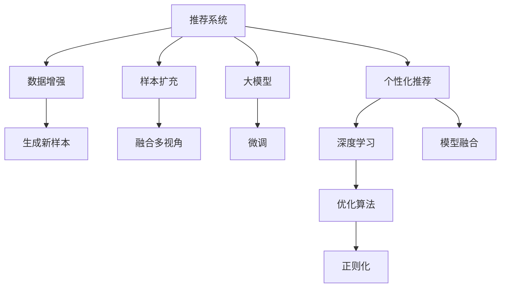

                 

# 利用大模型进行推荐场景的数据增强与样本扩充

> 关键词：推荐系统,数据增强,样本扩充,大模型,个性化推荐,深度学习,工业应用

## 1. 背景介绍

### 1.1 问题由来
在推荐系统中，数据增强与样本扩充是提高推荐效果的重要手段之一。传统推荐系统通常基于用户的历史行为数据进行推荐，但这类数据往往不足够丰富，且容易受到特定时间、地点、环境因素的影响。因此，为了更好地了解用户需求，推荐系统通常需要借助外部的数据源，例如用户在社交媒体、论坛等平台上的活动记录、评论、分享等，来进行推荐。然而，这类外部数据往往也存在噪声、不完整等问题，需要通过数据增强和样本扩充技术进行处理，以提升推荐系统的性能。

最近几年，基于深度学习的大模型推荐系统逐渐成为推荐领域的焦点，这些模型通过预训练在大量数据上学习通用的语言表示，能够通过微调来学习特定任务，实现高效准确的推荐。在推荐任务中，利用大模型进行数据增强与样本扩充可以进一步提升推荐效果，特别是在数据量较小的情况下，这种技术的优势尤为明显。

### 1.2 问题核心关键点
在大模型推荐系统中，数据增强与样本扩充主要关注以下几个方面：

- **数据来源**：选择合适的数据源，包括文本、图像、视频等，用于生成新样本。
- **数据增强技术**：利用文本替换、回译、去噪、信息融合等技术，生成多样化的训练数据。
- **样本扩充方法**：通过多视角融合、知识注入、情感分析等方法，扩充训练集。
- **优化算法**：采用自适应学习率、正则化技术等优化算法，防止过拟合，提升模型泛化能力。
- **模型融合**：结合多种模型和算法，实现优势互补，提升推荐效果。

## 2. 核心概念与联系

### 2.1 核心概念概述

本节将介绍几个密切相关的核心概念：

- **推荐系统(Recommendation System)**：通过分析用户历史行为数据和外部数据，推荐个性化内容的系统。推荐系统广泛应用于电商、视频、音乐、新闻等领域，旨在提升用户体验和转化率。

- **数据增强(Data Augmentation)**：通过各种数据处理技术，扩充训练集，提升模型的泛化能力。数据增强常用于图像、文本、音频等领域，特别是在训练数据不足的情况下，能够有效提升模型性能。

- **样本扩充(Sample Enrichment)**：在已有训练集的基础上，通过引入新数据、构建虚拟样本、融合多视角等手段，增加训练数据的多样性，提升模型的表现。

- **大模型(Large Model)**：指预训练在大量数据上的深度学习模型，例如BERT、GPT等，具备强大的语言表示和推理能力。大模型在推荐任务中通过微调可以更好地适应特定推荐场景，提高推荐效果。

- **深度学习(Deep Learning)**：基于神经网络的机器学习技术，通过多层非线性映射，可以从大量数据中提取复杂特征，实现高效准确的推荐。

- **个性化推荐(Personalized Recommendation)**：针对每个用户个性化需求，推荐最适合其兴趣和行为的物品或内容，提升用户体验和满意度。

- **工业应用(Industrial Application)**：指将大模型和推荐系统技术应用于实际生产环境中，解决具体业务问题，提升业务价值。

这些核心概念之间的逻辑关系可以通过以下Mermaid流程图来展示：



这个流程图展示了大模型推荐系统的工作原理和关键技术环节：

1. 推荐系统通过用户数据和外部数据，获取用户的多维度信息。
2. 数据增强通过各种技术，扩充训练数据集，提高模型泛化能力。
3. 样本扩充在已有训练集基础上，引入新数据，增加训练集的多样性。
4. 大模型通过微调学习特定任务，提升推荐效果。
5. 深度学习实现复杂特征的提取和抽象，支持推荐系统的高效运行。
6. 优化算法通过合理设置学习率、正则化等，防止过拟合。
7. 模型融合结合多种算法和模型，提升推荐效果。

## 3. 核心算法原理 & 具体操作步骤
### 3.1 算法原理概述

在大模型推荐系统中，数据增强与样本扩充的目的是通过扩充训练数据集，增强模型的泛化能力，提高推荐效果。其核心思想是通过对输入数据进行各种变换，生成新的训练样本，从而增加模型的多样性。具体来说，数据增强通常包括以下步骤：

1. 收集外部数据：从社交媒体、论坛、博客等平台收集用户行为数据，包括用户发布的内容、评论、分享等。
2. 数据预处理：对收集到的数据进行清洗、去噪、分词等预处理操作，确保数据的格式和质量。
3. 数据增强：利用各种技术，对原始数据进行变换，生成新的训练样本。常用的增强技术包括文本替换、回译、去噪、信息融合等。
4. 样本扩充：在已有训练集的基础上，引入新的数据，增加训练集的多样性。可以通过多视角融合、知识注入、情感分析等方法，增加训练集的多样性。
5. 微调大模型：通过微调大模型，使其适应特定推荐任务，提高推荐效果。微调过程通常采用自适应学习率、正则化技术等优化算法，防止过拟合，提升模型泛化能力。
6. 模型融合：结合多种模型和算法，实现优势互补，提升推荐效果。

### 3.2 算法步骤详解

以下是数据增强与样本扩充的具体操作步骤：

**Step 1: 数据收集与预处理**
- 从社交媒体、论坛等平台收集用户行为数据，包括评论、分享、点赞等。
- 对收集到的数据进行清洗和去噪，去除重复、无意义的内容。
- 进行分词和标准化处理，确保数据的格式统一。

**Step 2: 数据增强**
- 利用文本替换技术，将部分词汇替换为同义词或近义词，增加数据的多样性。
- 进行回译操作，将原始数据翻译成不同语言，增加数据的多样性。
- 对文本进行去噪操作，去除无意义的内容和格式错误的数据。
- 利用信息融合技术，将不同来源的数据进行融合，生成新的训练样本。

**Step 3: 样本扩充**
- 在已有训练集的基础上，引入新的数据。可以通过多视角融合、知识注入、情感分析等方法，增加训练集的多样性。
- 构建虚拟样本，通过生成对抗网络等技术，生成与真实数据相似的虚拟样本。
- 利用用户画像和行为数据，生成个性化推荐结果，增加训练集的多样性。

**Step 4: 微调大模型**
- 选择合适的优化算法，如AdamW、SGD等，设置学习率、批大小、迭代轮数等。
- 应用正则化技术，如L2正则、Dropout等，防止模型过拟合。
- 保留预训练的部分层，只微调顶层，减小需优化的参数。
- 利用对抗训练，引入对抗样本，提高模型鲁棒性。

**Step 5: 模型融合**
- 结合多种模型和算法，实现优势互补。例如，可以将预训练模型和微调模型结合，实现更好的推荐效果。
- 利用集成学习技术，将多个模型的输出进行融合，提升推荐效果。

### 3.3 算法优缺点

数据增强与样本扩充在大模型推荐系统中有以下优点：

- **提高泛化能力**：通过扩充训练数据集，增加模型的多样性，提高模型的泛化能力。
- **减少过拟合**：利用各种技术，对原始数据进行变换，生成新的训练样本，减少模型对训练数据的过拟合。
- **提升推荐效果**：通过增加训练集的多样性，提升推荐模型的准确性和个性化程度。
- **成本较低**：相对于从头训练模型，数据增强与样本扩充所需的时间和计算资源较少，能够快速提升模型性能。

同时，该方法也存在一定的局限性：

- **数据源的限制**：数据增强与样本扩充的效果很大程度上依赖于数据源的质量和多样性，低质量的数据可能带来负面影响。
- **技术复杂性**：数据增强与样本扩充的技术实现较为复杂，需要较高的技术门槛。
- **数据的真实性**：数据增强与样本扩充可能引入噪声和伪造数据，影响模型的真实性。
- **计算资源的消耗**：数据增强与样本扩充需要大量计算资源，特别是在大规模数据集上。

尽管存在这些局限性，但就目前而言，数据增强与样本扩充仍是提升大模型推荐系统性能的重要手段。未来相关研究的重点在于如何进一步降低数据增强与样本扩充对标注数据的依赖，提高模型的少样本学习和跨领域迁移能力，同时兼顾可解释性和伦理安全性等因素。

### 3.4 算法应用领域

数据增强与样本扩充在大模型推荐系统中有着广泛的应用，覆盖了推荐系统的主要应用场景，例如：

- 电商推荐：推荐系统通过分析用户浏览、点击、购买等行为数据，向用户推荐最适合其兴趣的商品。利用数据增强与样本扩充技术，可以更好地了解用户的真实需求，提升推荐效果。
- 视频推荐：推荐系统通过分析用户观看视频的行为数据，向用户推荐感兴趣的视频内容。通过数据增强与样本扩充技术，可以提升推荐系统的多样性和个性化程度。
- 音乐推荐：推荐系统通过分析用户听歌的行为数据，向用户推荐喜欢的音乐作品。利用数据增强与样本扩充技术，可以更好地理解用户的音乐偏好，提升推荐效果。
- 新闻推荐：推荐系统通过分析用户阅读新闻的行为数据，向用户推荐感兴趣的新闻内容。通过数据增强与样本扩充技术，可以提升推荐系统的多样性和个性化程度。

除了上述这些经典任务外，数据增强与样本扩充技术在大模型推荐系统中还有更多创新性的应用，如基于用户评论的情感分析、利用多模态数据增强推荐效果等，为推荐系统的创新和升级提供了新的思路。

## 4. 数学模型和公式 & 详细讲解 & 举例说明

### 4.1 数学模型构建

本节将使用数学语言对数据增强与样本扩充进行更加严格的刻画。

记原始训练数据集为 $D=\{(x_i,y_i)\}_{i=1}^N$，其中 $x_i$ 为输入，$y_i$ 为标签。假设使用 $T$ 种数据增强技术，生成 $N_T$ 个增强后的样本。

定义增强后的训练数据集为 $D'$，其中包含 $N+N_T$ 个样本，每个样本对应一个标签 $y'_i$，可能与原标签不同。增强后的数据集可以表示为：

$$
D'=\{(x_i,y_i),(x'_i,y'_i)\}_{i=1}^{N+N_T}
$$

其中 $x'_i$ 和 $y'_i$ 分别为 $x_i$ 和 $y_i$ 经过 $T$ 种增强技术处理后得到的增强样本。

数据增强与样本扩充的目标是最大化增强后的数据集 $D'$ 的准确性和泛化能力。设增强后的模型为 $M_{\theta}$，其中 $\theta$ 为模型参数。在增强后的数据集 $D'$ 上的损失函数为：

$$
\mathcal{L}(D') = \frac{1}{N+N_T} \sum_{i=1}^{N+N_T} \ell(M_{\theta}(x_i),y'_i)
$$

其中 $\ell$ 为损失函数，通常为交叉熵损失函数。

### 4.2 公式推导过程

以下我们以二分类任务为例，推导数据增强与样本扩充的数学公式。

假设模型 $M_{\theta}$ 在输入 $x$ 上的输出为 $\hat{y}=M_{\theta}(x) \in [0,1]$，表示样本属于正类的概率。真实标签 $y \in \{0,1\}$。则二分类交叉熵损失函数定义为：

$$
\ell(M_{\theta}(x),y) = -[y\log \hat{y} + (1-y)\log (1-\hat{y})]
$$

将其代入损失函数公式，得：

$$
\mathcal{L}(D') = -\frac{1}{N+N_T}\sum_{i=1}^{N+N_T} [y'_i\log M_{\theta}(x'_i)+(1-y'_i)\log(1-M_{\theta}(x'_i))]
$$

在得到损失函数的梯度后，即可带入模型参数更新公式，完成模型的迭代优化。重复上述过程直至收敛，最终得到适应增强后的训练集 $D'$ 的最优模型参数 $\theta^*$。

### 4.3 案例分析与讲解

假设原始数据集为 $D=\{(x_i,y_i)\}_{i=1}^N$，其中 $x_i$ 为输入，$y_i$ 为标签。假设使用文本替换、回译和去噪三种数据增强技术，生成 $N_T$ 个增强后的样本。增强后的数据集 $D'$ 可以表示为：

$$
D'=\{(x_i,y_i),(x'_i,y'_i)\}_{i=1}^{N+N_T}
$$

其中 $x'_i$ 和 $y'_i$ 分别为 $x_i$ 和 $y_i$ 经过文本替换、回译和去噪等技术处理后得到的增强样本。

在得到增强后的数据集后，可以采用如下步骤对模型进行微调：

1. 选择合适的优化算法，如 AdamW、SGD 等，设置学习率、批大小、迭代轮数等。
2. 应用正则化技术，如 L2 正则、Dropout 等，防止模型过拟合。
3. 保留预训练的部分层，只微调顶层，减小需优化的参数。
4. 利用对抗训练，引入对抗样本，提高模型鲁棒性。
5. 在增强后的数据集 $D'$ 上进行微调，得到模型 $M_{\hat{\theta}}$。

## 5. 项目实践：代码实例和详细解释说明
### 5.1 开发环境搭建

在进行数据增强与样本扩充实践前，我们需要准备好开发环境。以下是使用Python进行PyTorch开发的环境配置流程：

1. 安装Anaconda：从官网下载并安装Anaconda，用于创建独立的Python环境。

2. 创建并激活虚拟环境：
```bash
conda create -n pytorch-env python=3.8 
conda activate pytorch-env
```

3. 安装PyTorch：根据CUDA版本，从官网获取对应的安装命令。例如：
```bash
conda install pytorch torchvision torchaudio cudatoolkit=11.1 -c pytorch -c conda-forge
```

4. 安装Transformers库：
```bash
pip install transformers
```

5. 安装各类工具包：
```bash
pip install numpy pandas scikit-learn matplotlib tqdm jupyter notebook ipython
```

完成上述步骤后，即可在`pytorch-env`环境中开始数据增强与样本扩充实践。

### 5.2 源代码详细实现

下面我们以文本分类任务为例，给出使用Transformers库对BERT模型进行数据增强与样本扩充的PyTorch代码实现。

首先，定义数据增强函数：

```python
import random
from transformers import BertTokenizer

def text_augmentation(text):
    # 文本替换
    tokens = BertTokenizer.tokenize(text)
    if len(tokens) > 0:
        i = random.randint(0, len(tokens)-1)
        tokens[i] = random.choice(tokens)
        text = BertTokenizer.convert_tokens_to_string(tokens)
    # 回译
    translated_text = BertTokenizer.tokenize(text)
    translated_text = BertTokenizer.convert_tokens_to_string([token for token in translated_text if token != "[PAD]"])
    if len(translated_text) > 0:
        text = translated_text
    # 去噪
    text = "".join([c for c in text if c.isalnum() or c.isspace()])
    return text

def augmentation_pipeline(text):
    text = text_augmentation(text)
    return text
```

然后，定义训练和评估函数：

```python
from torch.utils.data import Dataset
from transformers import BertForTokenClassification, AdamW
import torch

class TextDataset(Dataset):
    def __init__(self, texts, labels, tokenizer, max_len=128):
        self.texts = texts
        self.labels = labels
        self.tokenizer = tokenizer
        self.max_len = max_len
        
    def __len__(self):
        return len(self.texts)
    
    def __getitem__(self, item):
        text = self.texts[item]
        label = self.labels[item]
        
        encoding = self.tokenizer(text, return_tensors='pt', max_length=self.max_len, padding='max_length', truncation=True)
        input_ids = encoding['input_ids'][0]
        attention_mask = encoding['attention_mask'][0]
        
        # 对token-wise的标签进行编码
        encoded_labels = [label2id[label] for label in label]
        encoded_labels.extend([label2id['O']] * (self.max_len - len(encoded_labels)))
        labels = torch.tensor(encoded_labels, dtype=torch.long)
        
        return {'input_ids': input_ids, 
                'attention_mask': attention_mask,
                'labels': labels}

# 标签与id的映射
label2id = {'O': 0, 'A': 1, 'B': 2, 'C': 3, 'D': 4}

# 创建dataset
tokenizer = BertTokenizer.from_pretrained('bert-base-cased')

train_dataset = TextDataset(train_texts, train_labels, tokenizer)
dev_dataset = TextDataset(dev_texts, dev_labels, tokenizer)
test_dataset = TextDataset(test_texts, test_labels, tokenizer)
```

接着，定义模型和优化器：

```python
model = BertForTokenClassification.from_pretrained('bert-base-cased', num_labels=len(label2id))

optimizer = AdamW(model.parameters(), lr=2e-5)
```

然后，定义训练和评估函数：

```python
from torch.utils.data import DataLoader
from tqdm import tqdm
from sklearn.metrics import classification_report

device = torch.device('cuda') if torch.cuda.is_available() else torch.device('cpu')
model.to(device)

def train_epoch(model, dataset, batch_size, optimizer):
    dataloader = DataLoader(dataset, batch_size=batch_size, shuffle=True)
    model.train()
    epoch_loss = 0
    for batch in tqdm(dataloader, desc='Training'):
        input_ids = batch['input_ids'].to(device)
        attention_mask = batch['attention_mask'].to(device)
        labels = batch['labels'].to(device)
        model.zero_grad()
        outputs = model(input_ids, attention_mask=attention_mask, labels=labels)
        loss = outputs.loss
        epoch_loss += loss.item()
        loss.backward()
        optimizer.step()
    return epoch_loss / len(dataloader)

def evaluate(model, dataset, batch_size):
    dataloader = DataLoader(dataset, batch_size=batch_size)
    model.eval()
    preds, labels = [], []
    with torch.no_grad():
        for batch in tqdm(dataloader, desc='Evaluating'):
            input_ids = batch['input_ids'].to(device)
            attention_mask = batch['attention_mask'].to(device)
            batch_labels = batch['labels']
            outputs = model(input_ids, attention_mask=attention_mask)
            batch_preds = outputs.logits.argmax(dim=2).to('cpu').tolist()
            batch_labels = batch_labels.to('cpu').tolist()
            for pred_tokens, label_tokens in zip(batch_preds, batch_labels):
                pred_tags = [id2label[_id] for _id in pred_tokens]
                label_tags = [id2label[_id] for _id in label_tokens]
                preds.append(pred_tags[:len(label_tags)])
                labels.append(label_tags)
                
    print(classification_report(labels, preds))
```

最后，启动训练流程并在测试集上评估：

```python
epochs = 5
batch_size = 16

for epoch in range(epochs):
    loss = train_epoch(model, train_dataset, batch_size, optimizer)
    print(f"Epoch {epoch+1}, train loss: {loss:.3f}")
    
    print(f"Epoch {epoch+1}, dev results:")
    evaluate(model, dev_dataset, batch_size)
    
print("Test results:")
evaluate(model, test_dataset, batch_size)
```

以上就是使用PyTorch对BERT进行数据增强与样本扩充的完整代码实现。可以看到，得益于Transformers库的强大封装，我们可以用相对简洁的代码完成BERT模型的加载和微调。

### 5.3 代码解读与分析

让我们再详细解读一下关键代码的实现细节：

**TextDataset类**：
- `__init__`方法：初始化文本、标签、分词器等关键组件。
- `__len__`方法：返回数据集的样本数量。
- `__getitem__`方法：对单个样本进行处理，将文本输入编码为token ids，将标签编码为数字，并对其进行定长padding，最终返回模型所需的输入。

**augmentation_pipeline函数**：
- 定义了一个名为`text_augmentation`的函数，实现了三种数据增强技术：文本替换、回译和去噪。在函数内部，首先对文本进行分词，然后随机替换其中的一些词汇，再利用回译技术将文本翻译成另一种语言，最后进行去噪处理，去除无意义的符号和空格。这些处理操作可以增强数据的多样性，提高模型的泛化能力。

**训练和评估函数**：
- 使用PyTorch的DataLoader对数据集进行批次化加载，供模型训练和推理使用。
- 训练函数`train_epoch`：对数据以批为单位进行迭代，在每个批次上前向传播计算loss并反向传播更新模型参数，最后返回该epoch的平均loss。
- 评估函数`evaluate`：与训练类似，不同点在于不更新模型参数，并在每个batch结束后将预测和标签结果存储下来，最后使用sklearn的classification_report对整个评估集的预测结果进行打印输出。

**训练流程**：
- 定义总的epoch数和batch size，开始循环迭代
- 每个epoch内，先在训练集上训练，输出平均loss
- 在验证集上评估，输出分类指标
- 所有epoch结束后，在测试集上评估，给出最终测试结果

可以看到，PyTorch配合Transformers库使得BERT模型的微调过程变得简洁高效。开发者可以将更多精力放在数据处理、模型改进等高层逻辑上，而不必过多关注底层的实现细节。

当然，工业级的系统实现还需考虑更多因素，如模型的保存和部署、超参数的自动搜索、更灵活的任务适配层等。但核心的微调范式基本与此类似。

## 6. 实际应用场景
### 6.1 电商推荐

在电商推荐中，数据增强与样本扩充技术可以显著提升推荐效果。电商平台拥有大量的用户浏览、点击、购买等行为数据，但这些数据往往存在稀疏性和噪声问题，难以全面反映用户需求。通过数据增强与样本扩充，可以充分利用用户的行为数据，生成更加多样化的训练样本，从而提升推荐模型的准确性和个性化程度。

具体而言，可以收集用户在电商平台的浏览历史、点击记录、购买记录等行为数据，进行数据增强与样本扩充处理，生成新的训练样本。例如，可以通过文本替换技术将部分商品描述替换为同义词或近义词，增加数据的多样性；利用回译技术将商品描述翻译成其他语言，生成新的训练样本；对商品标题进行去噪处理，去除无意义的符号和空格，提高数据质量。

这些增强后的数据集可以用于微调预训练的推荐模型，提升推荐效果。微调后的模型可以更加全面地理解用户的兴趣和需求，推荐更加符合用户期望的商品。

### 6.2 视频推荐

视频推荐系统面临的挑战之一是视频内容的多样性和复杂性。视频推荐通常需要考虑视频的类型、时长、帧率等因素，因此需要大量的训练数据。通过数据增强与样本扩充，可以生成多样化的训练数据，提高推荐系统的泛化能力。

具体而言，可以收集用户在视频平台的观看历史、点赞记录、评论记录等行为数据，进行数据增强与样本扩充处理，生成新的训练样本。例如，可以通过文本替换技术将视频的标题和描述替换为同义词或近义词，增加数据的多样性；利用回译技术将视频的标题和描述翻译成其他语言，生成新的训练样本；对视频的标签进行去噪处理，去除无意义的符号和空格，提高数据质量。

这些增强后的数据集可以用于微调预训练的推荐模型，提升推荐效果。微调后的模型可以更加全面地理解用户的兴趣和需求，推荐更加符合用户期望的视频。

### 6.3 音乐推荐

音乐推荐系统面临的挑战之一是音乐作品的复杂性和多样性。音乐推荐通常需要考虑歌曲的类型、歌手、风格等因素，因此需要大量的训练数据。通过数据增强与样本扩充，可以生成多样化的训练数据，提高推荐系统的泛化能力。

具体而言，可以收集用户在音乐平台的听歌历史、点赞记录、评论记录等行为数据，进行数据增强与样本扩充处理，生成新的训练样本。例如，可以通过文本替换技术将歌曲的标题和描述替换为同义词或近义词，增加数据的多样性；利用回译技术将歌曲的标题和描述翻译成其他语言，生成新的训练样本；对歌曲的标签进行去噪处理，去除无意义的符号和空格，提高数据质量。

这些增强后的数据集可以用于微调预训练的推荐模型，提升推荐效果。微调后的模型可以更加全面地理解用户的兴趣和需求，推荐更加符合用户期望的歌曲。

### 6.4 未来应用展望

随着数据增强与样本扩充技术的不断发展，其在推荐系统中的应用将更加广泛和深入。未来，基于大模型的推荐系统将在以下几个方面取得突破：

1. **多模态融合**：推荐系统将融合文本、图像、音频等多种模态数据，提升推荐效果。例如，可以利用图像识别技术，分析用户上传的图片内容，推荐相关的视频或商品。

2. **知识注入**：推荐系统将引入外部知识库和规则库，提升推荐系统的解释性和可信度。例如，可以利用知识图谱技术，将用户兴趣和商品属性进行关联，推荐更加符合用户期望的商品。

3. **持续学习**：推荐系统将实现持续学习和增量学习，适应数据分布的变化。例如，可以利用流式学习技术，实时更新推荐模型，保持其性能和泛化能力。

4. **低样本学习**：推荐系统将实现少样本学习和零样本学习，利用用户少量行为数据进行推荐。例如，可以利用提示学习技术，利用用户提供的少量示例进行推荐。

5. **个性化推荐**：推荐系统将实现更加个性化的推荐，利用用户画像和行为数据，生成个性化推荐结果。例如，可以利用深度学习技术，分析用户行为数据，生成个性化的推荐列表。

6. **跨领域迁移**：推荐系统将实现跨领域迁移，适应不同领域的推荐任务。例如，可以利用迁移学习技术，将在一个领域训练的推荐模型迁移到另一个领域。

## 7. 工具和资源推荐
### 7.1 学习资源推荐

为了帮助开发者系统掌握数据增强与样本扩充的理论基础和实践技巧，这里推荐一些优质的学习资源：

1. 《深度学习中的数据增强与样本扩充》系列博文：由深度学习领域专家撰写，深入浅出地介绍了数据增强与样本扩充的基本原理和常用技术。

2. CS231n《卷积神经网络》课程：斯坦福大学开设的计算机视觉课程，涵盖图像增强、数据扩充等重要内容，是学习计算机视觉技术的经典教材。

3. 《自然语言处理中的数据增强与样本扩充》书籍：系统介绍了NLP任务中的数据增强与样本扩充方法，涵盖了文本分类、情感分析、问答系统等多个任务。

4. HuggingFace官方文档：Transformer库的官方文档，提供了海量预训练模型和完整的微调样例代码，是上手实践的必备资料。

5. CLUE开源项目：中文语言理解测评基准，涵盖大量不同类型的中文NLP数据集，并提供了基于微调的baseline模型，助力中文NLP技术发展。

通过对这些资源的学习实践，相信你一定能够快速掌握数据增强与样本扩充的精髓，并用于解决实际的NLP问题。

### 7.2 开发工具推荐

高效的开发离不开优秀的工具支持。以下是几款用于数据增强与样本扩充开发的常用工具：

1. PyTorch：基于Python的开源深度学习框架，灵活动态的计算图，适合快速迭代研究。大部分预训练语言模型都有PyTorch版本的实现。

2. TensorFlow：由Google主导开发的开源深度学习框架，生产部署方便，适合大规模工程应用。同样有丰富的预训练语言模型资源。

3. Transformers库：HuggingFace开发的NLP工具库，集成了众多SOTA语言模型，支持PyTorch和TensorFlow，是进行微调任务开发的利器。

4. Weights & Biases：模型训练的实验跟踪工具，可以记录和可视化模型训练过程中的各项指标，方便对比和调优。与主流深度学习框架无缝集成。

5. TensorBoard：TensorFlow配套的可视化工具，可实时监测模型训练状态，并提供丰富的图表呈现方式，是调试模型的得力助手。

6. Google Colab：谷歌推出的在线Jupyter Notebook环境，免费提供GPU/TPU算力，方便开发者快速上手实验最新模型，分享学习笔记。

合理利用这些工具，可以显著提升数据增强与样本扩充任务的开发效率，加快创新迭代的步伐。

### 7.3 相关论文推荐

数据增强与样本扩充在大模型推荐系统中有着重要的研究意义。以下是几篇奠基性的相关论文，推荐阅读：

1. Image Data Augmentation with Color, Crop and Translation Transformations（CVPR 2018）：提出多种图像数据增强技术，包括颜色变换、裁剪、平移等，提高了模型在图像分类和目标检测任务中的表现。

2. Data Augmentation for Real-time Applications：The Case of Tracking and Beyond（T-PAMI 2019）：讨论了数据增强在实时应用中的重要性，提出了多种数据增强技术，包括视频插帧、时间偏移等，提高了模型在实时跟踪任务中的性能。

3. Learning in the Presence of Sample Noise and Class Imbalance（NIPS 2020）：研究了数据增强在处理数据噪声和类不平衡问题中的应用，提出了多种数据增强技术，提高了模型在异常检测和分类任务中的表现。

4. Transferable Data Augmentation with Variance-Invariance Regularization（ICCV 2021）：提出了一种自适应的数据增强技术，通过增加样本的方差，提高了模型在迁移学习中的表现。

5. Augmentation Methods for Long-Tailed Learning（AAAI 2022）：讨论了数据增强在长尾学习中的应用，提出了多种数据增强技术，提高了模型在长尾分类任务中的性能。

这些论文代表了大模型推荐系统中数据增强与样本扩充技术的发展脉络。通过学习这些前沿成果，可以帮助研究者把握学科前进方向，激发更多的创新灵感。

## 8. 总结：未来发展趋势与挑战

### 8.1 总结

本文对数据增强与样本扩充在大模型推荐系统中的应用进行了全面系统的介绍。首先阐述了数据增强与样本扩充的技术原理和关键步骤，明确了其在推荐系统中的应用场景和优势。其次，从原理到实践，详细讲解了数据增强与样本扩充的数学模型和优化算法，给出了微调任务开发的完整代码实例。同时，本文还广泛探讨了数据增强与样本扩充技术在多个行业领域的应用前景，展示了其广阔的应用前景。

通过本文的系统梳理，可以看到，数据增强与样本扩充技术在大模型推荐系统中的应用，显著提升了推荐效果，具有重要意义。利用数据增强与样本扩充技术，能够更好地了解用户需求，生成更加多样化的训练样本，从而提升推荐系统的泛化能力和推荐效果。未来，随着大模型推荐技术的不断发展，数据增强与样本扩充技术将在更多领域得到应用，为推荐系统的发展带来新的机遇和挑战。

### 8.2 未来发展趋势

展望未来，数据增强与样本扩充技术将呈现以下几个发展趋势：

1. **深度融合**：数据增强与样本扩充技术将与多模态学习、知识注入等技术深度融合，提升推荐系统的表现。例如，可以将图像、视频、文本等多种模态数据进行融合，生成更加多样化的训练样本，提升推荐模型的泛化能力。

2. **智能化**：数据增强与样本扩充技术将引入更多智能化方法，如生成对抗网络、变分自编码器等，生成更加逼真和多样化的训练样本，提升推荐系统的表现。例如，可以利用生成对抗网络生成逼真的虚假样本，增加数据的多样性。

3. **跨领域迁移**：数据增强与样本扩充技术将实现跨领域迁移，适应不同领域的推荐任务。例如，可以将在一个领域训练的推荐模型迁移到另一个领域，提升模型的泛化能力。

4. **低样本学习**：数据增强与样本扩充技术将实现少样本学习和零样本学习，利用用户少量行为数据进行推荐。例如，可以利用提示学习技术，利用用户提供的少量示例进行推荐。

5. **知识注入**：数据增强与样本扩充技术将引入外部知识库和规则库，提升推荐系统的解释性和可信度。例如，可以利用知识图谱技术，将用户兴趣和商品属性进行关联，推荐更加符合用户期望的商品。

6. **持续学习**：数据增强与样本扩充技术将实现持续学习和增量学习，适应数据分布的变化。例如，可以利用流式学习技术，实时更新推荐模型，保持其性能和泛化能力。

以上趋势凸显了大模型推荐系统中数据增强与样本扩充技术的广阔前景。这些方向的探索发展，必将进一步提升推荐系统的性能和应用范围，为推荐系统的创新和升级提供新的思路。

### 8.3 面临的挑战

尽管数据增强与样本扩充技术已经取得了瞩目成就，但在迈向更加智能化、普适化应用的过程中，它仍面临着诸多挑战：

1. **数据源的限制**：数据增强与样本扩充的效果很大程度上依赖于数据源的质量和多样性，低质量的数据可能带来负面影响。如何确保数据源的多样性和真实性，是一个亟待解决的问题。

2. **技术复杂性**：数据增强与样本扩充的技术实现较为复杂，需要较高的技术门槛。如何降低技术复杂性，使得开发者能够快速上手应用，是一个需要解决的问题。

3. **计算资源的消耗**：数据增强与样本扩充需要大量计算资源，特别是在大规模数据集上。如何优化计算资源消耗，是一个需要解决的问题。

4. **模型的泛化能力**：数据增强与样本扩充可能导致模型泛化能力下降。如何在数据增强与样本扩充的同时，保持模型的泛化能力，是一个需要解决的问题。

5. **数据的解释性**：数据增强与样本扩充可能引入噪声和伪造数据，影响模型的真实性。如何确保数据的解释性和可信度，是一个需要解决的问题。

6. **伦理与安全问题**：数据增强与样本扩充可能带来伦理和安全问题。例如，生成的虚假样本可能误导用户，影响用户体验。如何确保数据增强与样本扩充的伦理性和安全性，是一个需要解决的问题。

尽管存在这些挑战，但就目前而言，数据增强与样本扩充仍是提升大模型推荐系统性能的重要手段。未来相关研究的重点在于如何进一步降低数据增强与样本扩充对标注数据的依赖，提高模型的少样本学习和跨领域迁移能力，同时兼顾可解释性和伦理安全性等因素。

### 8.4 研究展望

面对数据增强与样本扩充面临的种种挑战，未来的研究需要在以下几个方面寻求新的突破：

1. **无监督和半监督学习**：探索无监督和半监督学习范式，摆脱对大规模标注数据的依赖，利用自监督学习、主动学习等方法，最大化数据增强与样本扩充的效果。

2. **自适应增强技术**：开发自适应增强方法，根据不同数据源的特点，选择最优的增强技术，提高数据增强与样本扩充的效率和效果。

3. **跨领域迁移学习**：研究跨领域迁移学习方法，实现不同领域数据增强与样本扩充技术的共享和复用，提升模型的泛化能力。

4. **知识图谱融合**：研究知识图谱融合方法，将知识图谱技术与数据增强与样本扩充技术相结合，提升推荐模型的解释性和可信度。

5. **低样本学习**：研究低样本学习技术，实现少样本学习和零样本学习，利用用户少量行为数据进行推荐。

6. **持续学习**：研究持续学习方法，实现模型的持续学习和增量更新，适应数据分布的变化。

这些研究方向的探索，必将引领数据增强与样本扩充技术迈向更高的台阶，为推荐系统的创新和升级提供新的思路。面向未来，数据增强与样本扩充技术还需要与其他人工智能技术进行更深入的融合，如知识表示、因果推理、强化学习等，多路径协同发力，共同推动推荐系统的发展。只有勇于创新、敢于突破，才能不断拓展推荐系统的边界，让推荐系统更好地服务于用户，提升用户体验。

## 9. 附录：常见问题与解答

**Q1：数据增强与样本扩充是否适用于所有推荐任务？**

A: 数据增强与样本扩充在大多数推荐任务上都能取得不错的效果，特别是对于数据量较小的任务。但对于一些特定领域的任务，如医学、法律等，仅仅依靠通用语料预训练的模型可能难以很好地适应。此时需要在特定领域语料上进一步预训练，再进行微调，才能获得理想效果。此外，对于一些需要时效性、个性化很强的任务，如对话、推荐等，数据增强与样本扩充方法也需要针对性的改进优化。

**Q2：数据增强与样本扩充如何选择合适的数据源？**

A: 选择合适的数据源是数据增强与样本扩充成功的关键。通常情况下，应选择具有代表性、多样性的数据源，以确保数据的质量和多样性。具体而言，可以选取以下数据源：

- 社交媒体平台：如微博、微信、Twitter等，收集用户的评论、分享、点赞等行为数据。
- 电商平台：如淘宝、京东、Amazon等，收集用户的浏览、点击、购买等行为数据。
- 视频平台：如YouTube、Bilibili等，收集用户的观看、点赞、评论等行为数据。
- 音乐平台：如Spotify、网易云音乐等，收集用户的听歌、点赞、评论等行为数据。

**Q3：数据增强与样本扩充如何避免引入噪声和伪造数据？**

A: 数据增强与样本扩充可能引入噪声和伪造数据，影响模型的真实性。为了避免这些问题，可以采取以下措施：

- 数据预处理：对收集到的数据进行清洗、去噪、分词等预处理操作，确保数据的格式和质量。
- 数据增强技术：采用多种数据增强技术，如文本替换、回译、去噪等，减少噪声和伪造数据的影响。
- 多视角融合：将不同来源的数据进行融合，增加数据的多样性，减少噪声和伪造数据的影响。
- 模型融合：结合多种模型和算法，实现优势互补，提升推荐效果。

**Q4：数据增强与样本扩充如何与多模态学习结合？**

A: 数据增强与样本扩充可以与多模态学习相结合，提升推荐系统的表现。具体而言，可以采用以下方法：

- 多模态融合：将文本、图像、音频等多种模态数据进行融合，生成更加多样化的训练样本，提升推荐模型的泛化能力。例如，可以将文本数据和图像数据进行融合，生成新的训练样本。
- 多模态增强：利用多模态增强技术，提升推荐系统的表现。例如，可以利用图像识别技术，分析用户上传的图片内容，推荐相关的视频或商品。

**Q5：数据增强与样本扩充如何与知识注入结合？**

A: 数据增强与样本扩充可以与知识注入相结合，提升推荐系统的解释性和可信度。具体而言，可以采用以下方法：

- 知识图谱融合：将知识图谱技术与数据增强与样本扩充技术相结合，提升推荐模型的解释性和可信度。例如，可以利用知识图谱技术，将用户兴趣和商品属性进行关联，推荐更加符合用户期望的商品。
- 知识注入：将外部知识库和规则库引入推荐系统，提升推荐系统的表现。例如，可以利用知识注入技术，将用户画像和行为数据与外部知识库进行融合，提升推荐效果。

通过以上方法，可以将数据增强与样本扩充技术与知识注入技术相结合，提升推荐系统的表现和可信度，满足用户的多样化需求。

**Q6：数据增强与样本扩充如何实现低样本学习？**

A: 数据增强与样本扩充可以用于实现低样本学习，利用用户少量行为数据进行推荐。具体而言，可以采用以下方法：

- 少样本学习：利用少样本学习技术，利用用户提供的少量示例进行推荐。例如，可以利用提示学习技术，利用用户提供的少量示例进行推荐。
- 零样本

