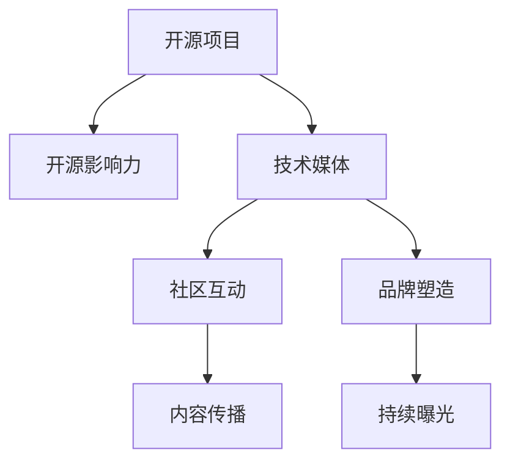

                 

# 利用开源影响力获得技术媒体曝光机会

在当前的数字化时代，技术媒体成为了技术创新、产品发布和市场推广的重要平台。借助技术媒体的影响力，可以将自己的技术成果、产品和创新想法迅速传播出去，吸引关注和讨论，进一步提升品牌知名度和市场竞争力。然而，技术媒体的关注并非易事，尤其是在开源社区日益壮大的今天，如何获得并维持媒体曝光机会成为了许多开发者和企业的核心议题。

本文旨在探讨如何通过开源影响力，在技术媒体上获得更多的曝光机会。首先，我们将介绍开源项目在媒体曝光中的关键作用，并阐述开源影响力的内涵和构建途径。接着，我们将通过实例分析，详细讨论开源项目的媒体曝光策略，包括社区互动、内容传播和品牌塑造等方面。最后，我们将总结开源影响力的未来发展趋势和面临的挑战，以及如何通过持续的努力和创新，提升开源项目在技术媒体上的曝光度。

## 1. 背景介绍

### 1.1 技术媒体的力量
技术媒体不仅仅是新闻的传播平台，更是创新和市场趋势的引领者。从TechCrunch、Wired到IEEE Spectrum，再到各类专业博客和技术论坛，技术媒体在各行各业中都有着举足轻重的影响。一个成功获得技术媒体曝光的项目，往往能够吸引更多的开发者、投资人和客户，推动其技术理念和产品发展。

### 1.2 开源项目的角色
开源项目以其开放、协作、共享的精神，推动了技术创新和知识传播。开源社区不仅聚集了全球顶尖的技术人才，还孕育出了许多颠覆性的技术解决方案。通过开源项目，开发者可以将自己的技术成果免费分享给全世界，同时也能借助开源社区的影响力，提升项目的知名度和市场接受度。

## 2. 核心概念与联系

### 2.1 核心概念概述

为更好地理解如何利用开源影响力获得技术媒体曝光机会，本节将介绍几个关键概念及其相互之间的联系：

- **开源项目(Open Source Project)**：是指软件代码或其他形式的技术资源被公开，允许任何人自由地使用、修改和分发的项目。开源项目促进了技术交流和合作，推动了技术创新和普及。

- **开源影响力(Source Code Influence)**：指开源项目通过代码质量、社区活跃度、文档完备性等因素，对技术社区和媒体的影响能力。开源影响力不仅体现在技术水平上，还涵盖了社区文化和品牌建设等方面。

- **技术媒体(Tech Media)**：包括但不限于TechCrunch、IEEE Spectrum、Wired等各类专注于技术创新的新闻网站、博客和论坛。技术媒体的关注和报道能够极大地提升开源项目的影响力。

- **社区互动(Community Engagement)**：指开发者通过编写代码、参与讨论、组织活动等方式，与开源项目社区成员互动，建立良好的关系和信任。

- **内容传播(Content Dissemination)**：指通过博客、视频、播客等方式，将开源项目的成果和技术理念传播给更广泛的用户群体。

- **品牌塑造(Branding)**：指通过持续的技术创新、高质量的代码和活跃的社区活动，塑造开源项目的品牌形象和市场定位。

这些核心概念之间的联系可以通过以下Mermaid流程图来展示：



这个流程图展示了大语言模型的核心概念及其之间的关系：

1. 开源项目通过优质的代码和技术理念吸引开发者关注，形成社区影响力。
2. 技术媒体通过报道开源项目，提升其知名度和关注度。
3. 社区互动增强开发者黏性，形成活跃的社区文化。
4. 内容传播扩大开源项目的受众范围，提高其影响力。
5. 品牌塑造通过持续的努力和创新，增强开源项目的市场价值。
6. 持续的曝光和传播，进一步巩固开源项目的市场地位。

## 3. 核心算法原理 & 具体操作步骤
### 3.1 算法原理概述

利用开源影响力获得技术媒体曝光机会，本质上是构建开源项目的社区生态，吸引媒体关注的过程。其核心思想是：通过高质量的开源代码和技术理念，吸引开发者和媒体的注意，并通过社区互动、内容传播和品牌塑造等多渠道，不断提升开源项目的曝光度和市场价值。

具体而言，开源影响力的大小通常由以下几个因素决定：
- 代码质量：代码是否模块化、可读性、维护性和可扩展性。
- 社区活跃度：社区成员的活跃程度、贡献大小和互动频率。
- 文档完备性：项目文档是否详细、易读、易于使用和维护。
- 技术创新：项目是否解决实际问题，是否具有前瞻性。
- 用户体验：项目是否易于使用、稳定、可靠。

### 3.2 算法步骤详解

基于开源影响力的构建和提升，获取技术媒体曝光的策略一般包括以下几个关键步骤：

**Step 1: 打造高质量的开源项目**
- 选择具有潜力的技术方向，并制定详细的产品规划。
- 编写高质量的代码，确保代码的可读性、可维护性和可扩展性。
- 制定详细的项目文档，包括使用指南、API文档、示例代码等。

**Step 2: 建立活跃的社区生态**
- 在开源平台如GitHub、GitLab等上创建项目仓库，并及时更新。
- 定期发布项目进展，包括代码更新、文档更新、里程碑达成等。
- 鼓励社区成员参与讨论，解答疑问，解决问题，促进知识共享。

**Step 3: 进行内容传播**
- 在技术博客、论坛、社交媒体上发布项目的进展和技术文章。
- 制作视频、播客、Webinar等形式的多媒体内容，传播项目理念和技术亮点。
- 通过GitHub Pages等工具，搭建项目网站，提供项目的详细信息和使用指南。

**Step 4: 塑造品牌形象**
- 保持项目的持续创新，解决实际问题，发布高质量的代码和技术成果。
- 积极参与开源社区和相关技术论坛，提升项目的曝光度和知名度。
- 建立项目品牌标识，如LOGO、口号、价值观等，增强品牌识别度。

**Step 5: 获取媒体曝光**
- 通过技术媒体报道、社区推荐等方式，提升项目的知名度。
- 主动与技术媒体联系，提供项目的背景故事和技术亮点，争取报道机会。
- 在获得媒体曝光后，持续维护与媒体的关系，保持项目的热度和话题性。

### 3.3 算法优缺点

利用开源影响力获取技术媒体曝光机会，具有以下优点：
1. 开放协作：开源项目汇聚全球开发者，能够获得更多的创意和资源。
2. 快速迭代：开源社区的快速响应和反馈机制，使项目能够迅速改进和优化。
3. 品牌宣传：开源项目通过高质量的代码和创新技术，能够自然地建立品牌形象。
4. 低成本推广：相比于传统广告和市场推广，开源影响力成本更低，效果更持久。

同时，该方法也存在一些局限性：
1. 对技术水平要求高：需要具备较强的技术实力和项目管理能力。
2. 对时间投入大：维护高质量的开源项目需要持续的时间和精力投入。
3. 对媒体关系依赖强：获取媒体曝光需要在媒体关系建立上下功夫。
4. 品牌塑造难度大：需要时间积累和持续努力，短期内难以见效。

尽管存在这些局限性，但就目前而言，利用开源影响力获取技术媒体曝光机会，仍是构建技术品牌和推广技术创新的重要途径。

### 3.4 算法应用领域

利用开源影响力的策略不仅适用于软件开源项目，同样适用于其他领域的技术创新和产品推广。以下是一些具体的应用场景：

- **智能硬件**：通过开源硬件设计、电路板布局和软件实现，吸引开发者和媒体关注，推动硬件产品的市场化。
- **物联网(IoT)**：在开源平台上发布IoT设备和协议，促进开发者协作，提升IoT设备的普及度。
- **大数据和人工智能**：发布开源的数据集、算法和模型，吸引数据科学家和开发者，推动大数据和AI技术的创新应用。
- **区块链**：开发开源的区块链应用，通过社区协作和媒体报道，推动区块链技术的普及和应用。
- **游戏开发**：在开源平台上发布游戏引擎和游戏素材，吸引游戏开发者和玩家，推动游戏技术的进步和游戏产品的多样化。

## 4. 数学模型和公式 & 详细讲解  
### 4.1 数学模型构建

本节将使用数学语言对利用开源影响力获取技术媒体曝光机会的策略进行更加严格的刻画。

设开源项目的技术影响力 $I$ 由代码质量 $Q$、社区活跃度 $A$、文档完备性 $D$、技术创新 $T$ 和用户体验 $U$ 组成，记为 $I = Q \times A \times D \times T \times U$。假设这些因素通过不同的权重 $w_1, w_2, w_3, w_4, w_5$ 进行加权，则技术影响力可以表示为：

$$
I = w_1 Q + w_2 A + w_3 D + w_4 T + w_5 U
$$

在获取技术媒体曝光的过程中，媒体曝光度 $E$ 与技术影响力 $I$ 成正比，即 $E \propto I$。媒体曝光度 $E$ 可通过以下公式计算：

$$
E = \alpha I
$$

其中 $\alpha$ 为媒体曝光的放大系数，取决于媒体的关注度和影响力。

### 4.2 公式推导过程

根据上述模型，我们可以通过提升开源项目的代码质量、社区活跃度、文档完备性、技术创新和用户体验，来提升其技术影响力，从而获得更多的媒体曝光度。以下是具体的推导过程：

- 代码质量 $Q$：假设代码质量为 $Q$，则提升代码质量至 $Q'$，对技术影响力的影响为 $\Delta I_{Q} = Q' - Q$。
- 社区活跃度 $A$：假设社区活跃度为 $A$，则提升社区活跃度至 $A'$，对技术影响力的影响为 $\Delta I_{A} = A' - A$。
- 文档完备性 $D$：假设文档完备性为 $D$，则提升文档完备性至 $D'$，对技术影响力的影响为 $\Delta I_{D} = D' - D$。
- 技术创新 $T$：假设技术创新为 $T$，则提升技术创新至 $T'$，对技术影响力的影响为 $\Delta I_{T} = T' - T$。
- 用户体验 $U$：假设用户体验为 $U$，则提升用户体验至 $U'$，对技术影响力的影响为 $\Delta I_{U} = U' - U$。

将这些变化带入媒体曝光度公式，得：

$$
\Delta E = \alpha \Delta I = \alpha (\Delta I_{Q} + \Delta I_{A} + \Delta I_{D} + \Delta I_{T} + \Delta I_{U})
$$

这表明，通过提升代码质量、社区活跃度、文档完备性、技术创新和用户体验，可以显著提升开源项目的媒体曝光度。

### 4.3 案例分析与讲解

下面我们以GitHub上的TensorFlow项目为例，具体分析其如何通过开源影响力的提升，获得技术媒体的广泛关注。

TensorFlow是一个开源的机器学习框架，由Google开发和维护。自2015年发布以来，TensorFlow迅速吸引了全球开发者和研究者的关注，成为深度学习领域的重要工具。其开源影响力的提升主要体现在以下几个方面：

- **代码质量**：TensorFlow的代码质量高，模块化设计、注释清晰，易于理解和维护。
- **社区活跃度**：TensorFlow拥有活跃的GitHub社区，定期发布项目进展、更新日志和开发者指南。
- **文档完备性**：TensorFlow的文档详尽，包括用户手册、API文档、教程、示例代码等。
- **技术创新**：TensorFlow不断推出新的功能和改进，推动了深度学习技术的进步。
- **用户体验**：TensorFlow提供了多平台支持，易于部署和使用。

通过这些因素的综合作用，TensorFlow不仅在技术社区获得了高度认可，还吸引了大量技术媒体的关注和报道。例如，TechCrunch、Wired等知名媒体多次报道TensorFlow的发展和应用，帮助TensorFlow迅速提升知名度和影响力。

## 5. 项目实践：代码实例和详细解释说明
### 5.1 开发环境搭建

在进行开源影响力推广实践前，我们需要准备好开发环境。以下是使用GitHub进行开源项目推广的环境配置流程：

1. 安装Git：从官网下载并安装Git客户端，用于版本控制和代码管理。
2. 创建GitHub账户：注册GitHub账户，并通过GitHub Desktop或命令行工具进行项目创建和管理。
3. 创建和克隆项目：在GitHub上创建新项目，并通过Git clone命令将其克隆到本地。
4. 配置GitHub Pages：通过GitHub Pages部署项目页面，使其可通过URL访问。
5. 发布代码更新：定期推送代码更新，通过Pull Request和Issues功能与社区成员互动。

完成上述步骤后，即可在GitHub上发布和维护开源项目，利用开源影响力获取技术媒体的关注和报道。

### 5.2 源代码详细实现

这里我们以一个简单的开源项目为例，展示如何在GitHub上发布和维护开源项目，并吸引技术媒体的关注。

首先，创建一个新的GitHub仓库，并上传项目代码和文档：

```bash
git init
git remote add origin https://github.com/yourusername/yourproject.git
git add .
git commit -m "Initial commit"
git push -u origin master
```

然后，通过GitHub Pages搭建项目网站，方便访问和展示：

```bash
git remote add gh-pages https://github.com/yourusername/yourproject.git
gh-pages -u origin gh-pages
```

接着，定期发布项目进展和技术文章，吸引社区成员和媒体关注：

```bash
git checkout gh-pages
echo "<html><head><title>My Project</title></head><body><h1>Welcome to My Project</h1></body></html>" > index.html
git add .
git commit -m "Add project homepage"
git push gh-pages
```

最后，利用GitHub的Pull Request和Issues功能，与社区成员互动，提升项目的活跃度：

```bash
git checkout master
git pull origin master
git checkout -b feature-branch
# 在feature-branch上进行代码修改
git commit -m "Add feature"
git push origin feature-branch
git checkout master
git merge feature-branch
git push
```

## 6. 实际应用场景
### 6.1 智能硬件

开源智能硬件项目通过开放的硬件设计和软件实现，吸引了大量开发者和媒体的关注。例如，Arduino开源平台，通过发布各种开源硬件和电路设计，吸引了全球电子爱好者的参与和讨论。这些项目通过高质量的代码和技术支持，不断提升自己的曝光度和市场接受度。

### 6.2 物联网(IoT)

IoT项目通过在开源平台上发布设备协议和硬件设计，吸引了大量的IoT开发者和社区成员。例如，TensorFlow Lite项目，通过发布轻量级机器学习库，支持各类IoT设备，推动了IoT技术的普及和应用。

### 6.3 大数据和人工智能

大数据和AI项目通过发布开源的数据集、算法和模型，吸引了数据科学家和开发者。例如，Apache Spark项目，通过发布高性能大数据处理框架，获得了广泛的关注和应用。

### 6.4 区块链

区块链项目通过在开源平台上发布开源应用和协议，吸引了开发者和社区成员。例如，Ethereum项目，通过发布以太坊区块链平台，推动了区块链技术的普及和应用。

### 6.5 游戏开发

游戏开发项目通过在开源平台上发布游戏引擎和素材，吸引了游戏开发者和玩家。例如，Unity3D项目，通过发布开源游戏引擎，推动了游戏技术的进步和游戏产品的多样化。

## 7. 工具和资源推荐
### 7.1 学习资源推荐

为了帮助开发者系统掌握如何利用开源影响力获取技术媒体曝光机会，这里推荐一些优质的学习资源：

1. GitHub官方文档：GitHub的使用指南，包括仓库创建、代码管理、Pull Request、Issues等功能的详细介绍。
2. GitHub Pages教程：GitHub Pages的使用教程，帮助开发者搭建项目网站，提升项目的曝光度。
3. PR撰写指南：GitHub的Pull Request撰写指南，帮助开发者撰写高质量的Pull Request，与社区成员互动。
4. 开源社区案例分析：GitHub上成功开源项目的案例分析，帮助开发者借鉴经验和教训。
5. 技术媒体采访指南：如何与技术媒体联系、接受采访、发布技术文章等指南，帮助开发者提升项目的曝光度。

通过对这些资源的学习实践，相信你一定能够快速掌握如何利用开源影响力获取技术媒体曝光机会，并用于推广自己的开源项目。

### 7.2 开发工具推荐

高效的开发离不开优秀的工具支持。以下是几款用于开源项目推广开发的常用工具：

1. GitHub：全球领先的代码托管平台，提供强大的版本控制和社区协作功能。
2. GitLab：企业级的代码托管平台，支持私有仓库和持续集成/持续部署(CI/CD)。
3. GitHub Pages：基于GitHub的静态网站托管服务，方便开发者发布项目文档和代码。
4. Jenkins：开源的持续集成/持续部署工具，支持多种语言和框架的自动化构建和测试。
5. Jekyll：静态网站生成工具，支持Markdown语法，方便开发者发布博客和技术文章。

合理利用这些工具，可以显著提升开源项目的推广效率，加快创新迭代的步伐。

### 7.3 相关论文推荐

开源项目影响力的提升源于学界的持续研究。以下是几篇奠基性的相关论文，推荐阅读：

1. "Open Source as a Platform for Innovation"：探讨开源平台如何促进技术创新和协作。
2. "Community Dynamics in Open Source Software Development"：分析开源社区的形成和演化机制。
3. "Influence of Social Media on Open Source Software Adoption"：研究社交媒体对开源软件采用率的影响。
4. "Open Source Software Evolution"：研究开源软件的演化过程和影响因素。
5. "Open Source and the Future of Software"：探讨开源在未来的发展趋势和应用前景。

这些论文代表了大语言模型微调技术的发展脉络。通过学习这些前沿成果，可以帮助研究者把握学科前进方向，激发更多的创新灵感。

## 8. 总结：未来发展趋势与挑战
### 8.1 总结

本文对利用开源影响力获取技术媒体曝光机会进行了全面系统的介绍。首先，阐述了开源项目在媒体曝光中的关键作用，明确了开源影响力的内涵和构建途径。其次，通过实例分析，详细讨论了开源项目的媒体曝光策略，包括社区互动、内容传播和品牌塑造等方面。最后，总结了开源影响力的未来发展趋势和面临的挑战，以及如何通过持续的努力和创新，提升开源项目在技术媒体上的曝光度。

通过本文的系统梳理，可以看到，利用开源影响力获取技术媒体曝光机会，对于提升开源项目的影响力、推广技术和产品具有重要意义。未来，伴随开源社区和技术的不断进步，开源项目的影响力和媒体曝光机会将进一步提升，成为技术创新和产品推广的重要手段。

### 8.2 未来发展趋势

展望未来，利用开源影响力获取技术媒体曝光机会，将呈现以下几个发展趋势：

1. 社区多样化：开源社区将更加多样化，涵盖不同的语言、文化和地域，吸引全球开发者和用户。
2. 开源生态完善：开源项目将通过生态系统的建设，增强项目的生命力和影响力。
3. 媒体渠道丰富：除了技术博客和新闻网站，社交媒体、视频平台等新兴渠道也将成为开源项目曝光的重要平台。
4. 技术创新加速：开源项目将持续推动技术创新，提升项目的市场价值和媒体关注度。
5. 品牌合作深化：开源项目将与技术媒体、企业和其他合作伙伴建立深度合作关系，实现共赢发展。

### 8.3 面临的挑战

尽管利用开源影响力获取技术媒体曝光机会取得了一定的成效，但在迈向更加智能化、普适化应用的过程中，它仍面临着诸多挑战：

1. 开源项目的管理：开源项目的长期管理和维护需要投入大量时间和精力。
2. 开源项目的竞争：开源社区中项目众多，如何脱颖而出，获得更多关注和资源。
3. 开源项目的推广：如何通过有效的推广策略，提升项目的曝光度和知名度。
4. 开源项目的合规性：开源项目的开源协议和合规性问题，需要严格遵守。
5. 开源项目的版权问题：开源项目中涉及的版权和知识产权问题，需要谨慎处理。

### 8.4 研究展望

面对开源影响力获取技术媒体曝光机会所面临的挑战，未来的研究需要在以下几个方面寻求新的突破：

1. 开源项目的社区管理：建立完善的项目管理体系，提高项目的维护和更新效率。
2. 开源项目的推广策略：制定更有效的推广策略，提升项目的曝光度和知名度。
3. 开源项目的品牌建设：通过持续的技术创新和高质量的代码，塑造开源项目的品牌形象。
4. 开源项目的合规性保障：确保开源项目的合规性，避免法律和知识产权问题。
5. 开源项目的国际化推广：推动开源项目的国际化进程，吸引全球开发者和用户。

这些研究方向的探索，必将引领开源影响力获取技术媒体曝光机会的技术和实践不断进步，为开源项目的推广和应用提供新的思路和方法。

## 9. 附录：常见问题与解答
----------------------------------------------------------------

**Q1：如何选择合适的开源平台进行项目发布？**

A: 选择开源平台时，应考虑以下几个因素：
1. 用户基础：选择用户基础大、活跃度高、社区支持好的平台，如GitHub、GitLab等。
2. 功能支持：选择功能丰富、易于使用的平台，如GitHub提供Pull Request、Issues、Wiki等功能。
3. 社区文化：选择社区文化和价值观与项目相符的平台，如Apache Foundation支持开源项目和非商业性。

**Q2：如何提升开源项目的社区活跃度？**

A: 提升社区活跃度的方法包括：
1. 定期发布代码更新和项目进展，吸引社区成员关注。
2. 鼓励社区成员参与讨论和贡献，建立良好的互动关系。
3. 组织线上和线下活动，增强社区成员的归属感和参与感。
4. 解答社区成员的问题，提供技术支持和帮助。

**Q3：如何利用开源项目的媒体曝光机会？**

A: 利用开源项目的媒体曝光机会的方法包括：
1. 通过技术博客、论坛、社交媒体发布项目进展和技术文章，吸引媒体关注。
2. 主动联系技术媒体，提供项目的背景故事和技术亮点，争取报道机会。
3. 发布高质量的代码和技术成果，吸引媒体和开发者关注。

**Q4：如何保护开源项目的知识产权和合规性？**

A: 保护开源项目的知识产权和合规性的方法包括：
1. 选择合适开源协议，如Apache、MIT等，明确项目的开源属性。
2. 遵循开源协议的规定，确保项目的合规性。
3. 处理涉及的版权和知识产权问题，避免法律风险。

**Q5：如何构建开源项目的品牌形象？**

A: 构建开源项目的品牌形象的方法包括：
1. 保持项目的持续创新，发布高质量的代码和技术成果。
2. 建立项目品牌标识，如LOGO、口号、价值观等。
3. 通过社区活动、技术文章、技术演讲等方式，传播项目理念和技术亮点。

---

作者：禅与计算机程序设计艺术 / Zen and the Art of Computer Programming

