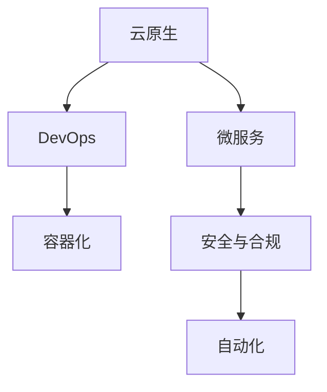

                 

# 利用开源经验提供技术架构咨询

> 关键词：技术架构咨询, 开源经验, 云原生, DevOps, 微服务, 容器化, 安全与合规, 自动化

## 1. 背景介绍

在当今快速发展的数字化时代，企业的技术架构需适应各种变化和挑战，从传统单体应用向云原生、微服务、DevOps等现代化架构演进。本文将介绍如何利用开源社区的经验和最佳实践，为企业提供高效、安全、可扩展的技术架构咨询。

## 2. 核心概念与联系

### 2.1 核心概念概述

技术架构咨询的核心在于帮助企业构建适应未来发展的技术架构，包括但不限于：
- 云原生（Cloud Native）：通过容器化、微服务化、DevOps等技术，实现敏捷、可扩展的系统架构。
- 微服务（Microservices）：将单体应用拆分为独立的服务，提高系统的灵活性和可维护性。
- DevOps：通过持续集成/持续部署（CI/CD）、自动化测试、监控等，提升软件开发和运维的效率和质量。
- 容器化（Containerization）：使用Docker等容器技术，封装应用程序和依赖，实现跨平台和环境的快速部署。
- 安全与合规：确保应用和数据的安全性，遵守法律法规和行业标准。

这些概念之间的联系可以下图表示：



## 3. 核心算法原理 & 具体操作步骤
### 3.1 算法原理概述

技术架构咨询的算法原理基于以下三点：
1. 评估现有架构：通过一系列指标（如可用性、性能、可扩展性等）对现有系统进行评估。
2. 设计新架构：基于评估结果，结合最佳实践和开源社区经验，设计新的技术架构。
3. 实施与优化：通过持续集成和部署（CI/CD）等自动化手段，逐步实施新架构，并不断优化和调整。

### 3.2 算法步骤详解

技术架构咨询的步骤如下：
1. **需求分析**：与企业沟通，理解其业务需求和技术现状。
2. **架构设计**：根据需求，设计新的技术架构，包括服务拆分、容器化、DevOps流程等。
3. **实施规划**：制定详细的实施计划，包括资源分配、技术选型、风险管理等。
4. **实施执行**：逐步执行实施计划，引入新架构，并逐步替换现有系统。
5. **评估优化**：定期评估新架构的表现，根据反馈进行优化和调整。

### 3.3 算法优缺点

**优点**：
- 利用开源社区的最佳实践，降低技术风险。
- 引入自动化工具，提高开发和运维效率。
- 提供灵活可扩展的架构，适应未来业务需求。

**缺点**：
- 需投入大量时间和资源进行架构设计和实施。
- 可能需要改写大量现有代码，涉及高风险。
- 对技术团队的成熟度要求较高，需具备一定水平。

### 3.4 算法应用领域

技术架构咨询广泛应用于以下领域：
- 金融：交易系统、风险管理、客户服务。
- 电商：订单处理、库存管理、客户支持。
- 医疗：患者信息管理、电子病历、药品管理。
- 政府：公共服务、政务数据、安全监控。

## 4. 数学模型和公式 & 详细讲解 & 举例说明

### 4.1 数学模型构建

架构评估通常使用各种度量指标，包括：
- 可用性（A）：系统正常运行的时间占总运行时间的比例。
- 性能（P）：系统响应时间、吞吐量、延迟等性能指标。
- 可扩展性（S）：系统能否按需扩展以适应负载变化。

### 4.2 公式推导过程

可用性的公式为：

$$
A = \frac{T}{T+D}
$$

其中 $T$ 为正常运行时间，$D$ 为故障时间。

性能的计算可以使用响应时间和吞吐量等指标。以响应时间为例，公式为：

$$
P = \frac{1}{\sigma}
$$

其中 $\sigma$ 为标准差，表示响应时间的稳定性。

可扩展性的度量可以通过模拟负载变化，评估系统是否能够保持服务质量。假设负载为 $L$，系统容量为 $C$，可扩展性的公式为：

$$
S = \frac{C}{L}
$$

### 4.3 案例分析与讲解

以电商系统为例，假设现有系统可用性为 $0.9$，响应时间为 $100ms$，吞吐量为 $10000 req/s$。在业务量增长 $10\%$ 后，系统是否能够保持原有性能？

1. **计算现有可用性和性能**：
   - 可用性 $A = 0.9$
   - 响应时间 $P = 100ms$
   - 吞吐量 $S = 10000 req/s$

2. **预测负载变化后性能**：
   - 假设负载增长 $10\%$，变为 $110$，保持原有响应时间和吞吐量。
   - 响应时间 $P' = 100ms$
   - 吞吐量 $S' = 11000 req/s$

   根据公式，新系统的可用性和性能为：
   - 可用性 $A' = \frac{110}{110+10} = 0.9$
   - 响应时间 $P' = \frac{1}{\sigma'}$
   - 吞吐量 $S' = \frac{C}{L'}$

3. **评估可扩展性**：
   - 新系统是否能够按需扩展以适应负载增长？

通过这些计算，可以评估现有系统的性能，并决定是否需要引入新架构。

## 5. 项目实践：代码实例和详细解释说明
### 5.1 开发环境搭建

以下是使用Docker和Kubernetes进行容器化和微服务架构的实践步骤：

1. **安装Docker**：从官网下载并安装Docker。
2. **创建Dockerfile**：编写Dockerfile定义应用及其依赖。
3. **构建Docker镜像**：运行 `docker build -t image_name .` 命令构建镜像。
4. **运行Docker容器**：运行 `docker run -d image_name` 命令运行容器。
5. **安装Kubernetes**：安装Minikube或Kubernetes集群。
6. **部署Kubernetes服务**：使用 `kubectl run` 命令部署应用。

### 5.2 源代码详细实现

以下是一个简单的Node.js应用的Dockerfile和Kubernetes配置文件：

**Dockerfile**：

```dockerfile
FROM node:14
WORKDIR /app
COPY package*.json ./
RUN npm install
COPY . .
EXPOSE 8080
CMD [ "npm", "start" ]
```

**Kubernetes配置文件**：

```yaml
apiVersion: v1
kind: Service
metadata:
  name: app-service
spec:
  selector:
    app: app
  ports:
    - protocol: TCP
      port: 80
      targetPort: 8080

apiVersion: v1
kind: Deployment
metadata:
  name: app-deployment
spec:
  replicas: 3
  selector:
    matchLabels:
      app: app
  template:
    metadata:
      labels:
        app: app
    spec:
      containers:
      - name: app-container
        image: app-image
        ports:
        - containerPort: 8080
```

### 5.3 代码解读与分析

- **Dockerfile**：定义了Node.js应用及其依赖的构建过程。`FROM node:14` 指定了基础镜像，`WORKDIR /app` 指定工作目录。`COPY` 命令复制应用及其依赖到容器内。`RUN npm install` 安装应用依赖。`COPY . .` 复制应用代码到容器中。`EXPOSE` 命令指定应用监听的端口。`CMD [ "npm", "start" ]` 启动应用。

- **Kubernetes配置文件**：定义了Service和Deployment两个Kubernetes对象。Service用于暴露应用服务，Deployment用于管理容器实例。

通过这些配置文件，可以实现应用的容器化，并通过Kubernetes进行部署和扩展。

### 5.4 运行结果展示

启动Docker容器和Kubernetes服务后，可以通过访问Service的IP地址来访问应用。通过Kubernetes提供的资源监控工具，可以实时查看应用性能和资源使用情况，进行优化调整。

## 6. 实际应用场景
### 6.1 智能客服系统

智能客服系统通过云原生和微服务架构，实现高效的自动化交互和知识管理。使用Docker容器化后，可以轻松扩展系统容量，支持高并发请求。结合DevOps实践，实现快速迭代和持续交付。

### 6.2 金融交易平台

金融交易平台需要高可用性、高性能和低延迟的系统架构。通过容器化和微服务，实现模块化、独立的服务，支持水平扩展。结合安全与合规要求，使用自动化工具进行安全检测和合规检查，保障数据安全。

### 6.3 电商订单系统

电商订单系统涉及订单处理、库存管理、客户支持等多个模块。通过微服务架构，实现各模块独立运行，提高系统的灵活性和可维护性。使用DevOps流程，实现自动化测试和部署，提高开发效率和系统稳定性。

### 6.4 未来应用展望

未来，云原生和微服务架构将继续扩展应用范围，深入各行各业。结合自动化工具和开源经验，企业可以更快地构建、部署和优化系统，适应未来业务需求和市场变化。

## 7. 工具和资源推荐
### 7.1 学习资源推荐

- **Docker官方文档**：全面介绍Docker的安装、使用和最佳实践。
- **Kubernetes官方文档**：提供Kubernetes的安装、使用和管理指南。
- **OpenShift文档**：介绍基于Kubernetes的云平台OpenShift的安装和使用。
- **Docker Swarm文档**：介绍Docker Swarm的安装和管理。
- **Kubernetes最佳实践**：提供Kubernetes的架构、安全和性能最佳实践。

### 7.2 开发工具推荐

- **Docker**：用于构建、打包和部署应用。
- **Kubernetes**：用于容器编排和管理。
- **Helm**：用于应用打包和发布。
- **Prometheus**：用于系统监控和告警。
- **Grafana**：用于监控数据的可视化展示。
- **Jenkins**：用于持续集成和部署。
- **Ansible**：用于自动化配置和部署。

### 7.3 相关论文推荐

- **Cloud Native Computing Foundation (CNCF)**：提供云原生技术栈的架构和最佳实践。
- **Docker 2.0 Architecture**：介绍Docker 2.0架构和设计。
- **Kubernetes - Scheduling**：介绍Kubernetes的调度算法和实现。
- **Cloud-Native Microservices**：介绍云原生微服务架构的设计和实现。
- **DevOps Infrastructure as Code**：介绍DevOps和IaC的实践和工具。

## 8. 总结：未来发展趋势与挑战
### 8.1 研究成果总结

技术架构咨询利用开源经验，帮助企业构建高效、安全、可扩展的技术架构。通过云计算、容器化、微服务、DevOps等技术，企业可以实现自动化和持续交付，提升效率和质量。

### 8.2 未来发展趋势

未来技术架构咨询将朝着以下几个方向发展：
- 全栈自动化：实现从开发到运维的全栈自动化。
- 多云平台集成：支持多种云平台，实现多云环境下的无缝集成。
- 安全与合规：增强系统的安全性和合规性，保障数据和应用的安全。
- 持续学习与优化：通过持续学习和优化，提升系统的性能和稳定性。

### 8.3 面临的挑战

技术架构咨询面临的挑战包括：
- 技术选型和架构设计：选择合适的技术栈和架构设计，需要综合考虑业务需求和技术现状。
- 团队培训与转型：需要培训和转型团队，掌握新技术和工具。
- 安全和合规：需要确保新架构的安全性和合规性，满足法律法规和行业标准。

### 8.4 研究展望

未来的研究将在以下几个方面寻求新的突破：
- 自动化工具的优化：开发更加高效、易用的自动化工具。
- 新架构的评估与优化：建立更科学的架构评估和优化方法。
- 跨领域的融合：将技术架构咨询与大数据、人工智能等领域融合，提供更全面的技术解决方案。

## 9. 附录：常见问题与解答

**Q1: 如何选择合适的容器化和微服务架构？**

A: 选择合适的架构需考虑业务需求、技术栈、团队能力等多方面因素。通常先进行需求分析，制定架构设计方案，再进行详细设计和技术选型。

**Q2: DevOps与持续集成/持续部署（CI/CD）的区别是什么？**

A: DevOps是软件开发和运维的实践和文化，强调自动化和持续交付。CI/CD是DevOps中的重要组成部分，通过自动化测试和部署，实现快速迭代和交付。

**Q3: 如何保障云原生架构的安全性和合规性？**

A: 通过安全审计、自动化安全检测、合规检查等手段，保障系统的安全性和合规性。同时，结合DevSecOps实践，将安全性和合规性融入到开发和运维的各个环节。

**Q4: 如何提升DevOps流程的效率和质量？**

A: 引入持续集成/持续部署（CI/CD）工具，实现自动化测试和部署。使用版本控制和代码审查工具，提升代码质量和开发效率。引入监控和告警工具，实时监测系统状态，保障系统稳定运行。

通过不断探索和实践，我们相信技术架构咨询将帮助企业构建更加高效、安全、可扩展的系统架构，实现数字化转型的目标。

