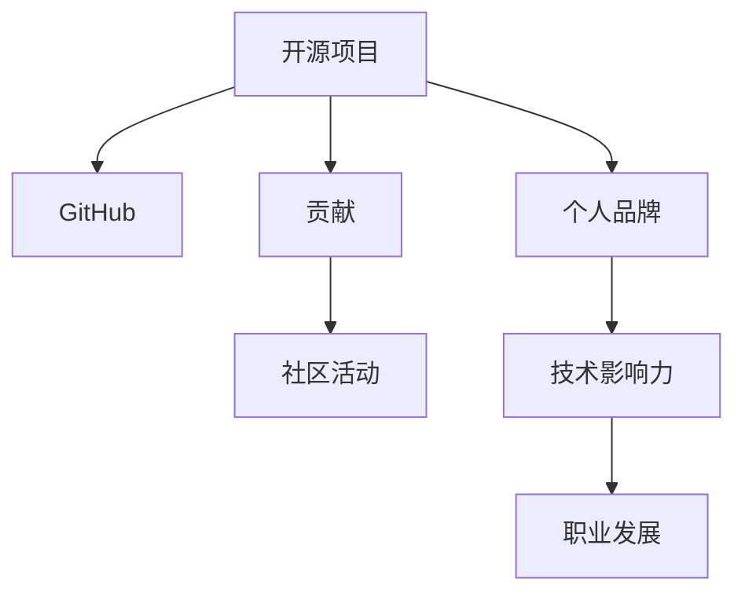

                 

# 利用开源贡献建立个人品牌和影响力

## 1. 背景介绍

在当今数字化时代，开源贡献已成为程序员和软件工程师建立个人品牌和影响力的重要途径。开源社区汇聚了全球最优秀的软件开发者，为每一个参与者提供了展示技术、协作交流的平台。通过在开源项目中积极贡献代码、修复漏洞、编写文档，不仅能够提升自身技术水平，还能在同行中树立良好形象，获得更广泛的认可和支持。

### 1.1 问题由来

随着开源技术的普及，越来越多的人意识到开源的重要性。参与开源贡献不仅能提升技术能力，还能通过贡献展示自己的技能，甚至在企业招聘中作为加分项。然而，对于许多初学者来说，如何有效地在开源社区中建立自己的品牌，依然是一大难题。

### 1.2 问题核心关键点

本文将探讨如何通过开源贡献建立个人品牌和影响力的核心策略。核心关键点包括：

- 选择合适的开源项目。
- 了解项目的贡献流程和规范。
- 积极参与项目的日常维护和社区活动。
- 通过高质量的贡献获得社区认可。
- 在开源社区中建立个人品牌。

### 1.3 问题研究意义

建立个人品牌和影响力不仅有助于开发者在职业发展中脱颖而出，还能在社区中获得更多的支持，推动项目的持续发展。高质量的开源贡献不仅能提升自己的技术能力，还能带来更多的学习和合作机会。

## 2. 核心概念与联系

### 2.1 核心概念概述

为更好地理解开源贡献的机制和影响，本节将介绍几个密切相关的核心概念：

- 开源项目(Open Source Project)：指在开源许可下公开共享代码、文档和资源的项目，任何人都可以访问、修改和使用。

- GitHub：全球最大的开源代码托管平台，提供丰富的社区和协作工具，是开发者展示和分享代码的理想场所。

- 贡献(Contribution)：指开发者提交的代码、修复的漏洞、编写的文档等，能够为项目增加价值和功能。

- 社区活动(Community Activities)：指参与开源项目的讨论、会议、培训等活动，促进技术交流和项目合作。

- 个人品牌(Personal Brand)：指开发者在开源社区中的知名度和影响力，基于其技术贡献和社区活动形成的个人声誉。

这些核心概念之间的逻辑关系可以通过以下Mermaid流程图来展示：



这个流程图展示了开源项目与开发者之间的关系：

1. 开源项目为开发者提供展示和贡献的平台。
2. 贡献活动在项目中增加个人影响力。
3. 社区活动加强个人与社区的互动。
4. 个人品牌通过贡献和活动得到提升。
5. 影响力推动职业发展。

## 3. 核心算法原理 & 具体操作步骤

### 3.1 算法原理概述

开源贡献的算法原理相对简单，核心在于找到合适的开源项目，积极参与其中，通过高质量的代码和文档贡献，建立个人品牌和影响力。

具体来说，开源贡献的过程包括以下步骤：

1. 选择目标开源项目。
2. 学习项目贡献流程和规范。
3. 实施高质量的代码和文档贡献。
4. 参与社区活动，建立良好互动。
5. 持续维护和推广个人贡献。

### 3.2 算法步骤详解

#### 3.2.1 选择目标开源项目

选择目标开源项目是开源贡献的第一步。以下是几个关键因素：

- 项目流行度：选择流行且活跃的项目，更容易获得关注和反馈。
- 项目类型：选择与自身技能匹配的项目，提升贡献效率。
- 项目贡献者：选择欢迎新人且友好的项目，降低入门难度。
- 项目社区：选择活跃且社区支持良好的项目，获得更多帮助和支持。

#### 3.2.2 学习项目贡献流程和规范

了解并遵守项目的贡献流程和规范，是成功贡献的关键。以下是常见的贡献规范：

- 使用Issue和Pull Request(PR)进行问题跟踪和代码提交。
- 编写详细的PR标题和描述，清晰说明贡献内容。
- 遵循项目的代码风格和编码规范。
- 提交代码前，确保通过测试和代码审查。

#### 3.2.3 实施高质量的代码和文档贡献

高质量的贡献能够获得更多认可和支持。以下是提高贡献质量的建议：

- 详细记录Bug和需求，提供清晰的代码修复和功能增强方案。
- 编写文档和注释，解释代码逻辑和实现细节。
- 测试代码，确保贡献的稳定性和可靠性。
- 提交PR前，尽量确保代码通过单元测试和集成测试。

#### 3.2.4 参与社区活动

积极参与社区活动，能够提升个人在开源项目中的可见度，获得更多的交流和学习机会。以下是常见的社区活动：

- 参加讨论和会议，了解项目最新动态和问题。
- 参与社区组织的活动，如Hackathon、Kaggle比赛等。
- 与其他贡献者建立联系，共享经验和资源。

#### 3.2.5 持续维护和推广个人贡献

持续维护个人贡献，展示自己的技术实力和责任心，能够长期保持个人品牌和影响力的提升。以下是一些建议：

- 定期更新和改进个人贡献，持续提升贡献质量。
- 推广个人贡献，通过博客、社交媒体等渠道分享经验。
- 参与其他项目，展示多样化的技术能力。

### 3.3 算法优缺点

开源贡献的主要优点包括：

- 提升技术水平：通过参与项目，学习最新技术和最佳实践。
- 建立社区网络：与全球开发者交流，扩大人脉和资源。
- 展示个人能力：通过贡献获得认可，提升职业发展机会。
- 增加项目价值：通过高质量的贡献，提升项目功能和性能。

主要缺点包括：

- 时间成本：高质量的贡献需要大量时间精力投入。
- 贡献难度：需要具备一定的技术能力和沟通技巧。
- 持续投入：开源贡献需要长期坚持和持续改进。

### 3.4 算法应用领域

开源贡献在软件开发、数据分析、机器学习、云计算等众多领域中都有广泛应用，成为开发者展示和提升技术能力的重要手段。

## 4. 数学模型和公式 & 详细讲解 & 举例说明

### 4.1 数学模型构建

本节将使用数学语言对开源贡献的机制进行更加严格的刻画。

假设开发者在开源项目 $P$ 中贡献 $n$ 次，每次贡献的质量记为 $w_i$，社区对每次贡献的评价为 $r_i$。则开发者在项目 $P$ 中的影响力 $I$ 可以表示为：

$$
I = \sum_{i=1}^{n} w_i \cdot r_i
$$

其中 $r_i$ 为社区对贡献的评价分数，$w_i$ 为贡献的质量权重。

### 4.2 公式推导过程

由于社区对贡献的评价存在主观性，公式可进一步细化：

$$
r_i = k \cdot \alpha_i + (1-k) \cdot f_i
$$

其中 $k$ 为社区评价的主观权重，$\alpha_i$ 为贡献者对本次贡献的主观评价分数，$f_i$ 为社区对本次贡献的客观评价分数（如贡献的复杂度、修复的漏洞数量等）。

将 $r_i$ 代入 $I$ 的公式中，得：

$$
I = \sum_{i=1}^{n} w_i \cdot (k \cdot \alpha_i + (1-k) \cdot f_i)
$$

### 4.3 案例分析与讲解

以一个GitHub贡献者为例，假设他贡献了5次代码，每次贡献的质量和社区评价如下表所示：

| 贡献编号 | 质量分数 $w_i$ | 主观评价分数 $\alpha_i$ | 客观评价分数 $f_i$ | 主观权重 $k$ |
|---|---|---|---|---|
| 1 | 0.8 | 4 | 10 | 0.6 |
| 2 | 0.9 | 5 | 12 | 0.5 |
| 3 | 0.7 | 3 | 8 | 0.7 |
| 4 | 0.6 | 2 | 5 | 0.8 |
| 5 | 0.9 | 6 | 15 | 0.6 |

代入公式，计算总影响力 $I$：

$$
I = 0.8 \cdot 0.6 \cdot 4 + 0.9 \cdot 0.5 \cdot 5 + 0.7 \cdot 0.7 \cdot 3 + 0.6 \cdot 0.8 \cdot 2 + 0.9 \cdot 0.6 \cdot 6 \approx 10.5
$$

可以看出，通过高质量的贡献和高评价，该开发者在开源项目中建立了较强的影响力。

## 5. 项目实践：代码实例和详细解释说明

### 5.1 开发环境搭建

在进行开源贡献实践前，我们需要准备好开发环境。以下是使用Python进行GitHub贡献的开发环境配置流程：

1. 安装GitHub Desktop：从官网下载并安装GitHub Desktop，用于方便地管理和提交代码。
2. 配置GitHub账号：在GitHub Desktop中登录自己的账号，设置SSH密钥。
3. 安装Git和GitHub CLI：从Git官网下载安装Git，并从GitHub官网下载安装GitHub CLI，用于命令行操作。

### 5.2 源代码详细实现

这里以参与一个开源项目为例，演示如何进行代码贡献。

首先，选择一个感兴趣的开源项目，并通过GitHub Desktop克隆项目代码：

```bash
git clone https://github.com/example/project.git
cd project
```

然后，在本地环境中修改代码，并提交PR：

```bash
git add .
git commit -m "Add feature X"
git push origin master
```

在GitHub Desktop中，创建一个新的PR，填写PR标题和描述，提交PR请求：


### 5.3 代码解读与分析

**GitHub PR**：
- 标题和描述：清晰明了，解释本次贡献的内容和动机。
- 贡献内容：通过Git diff工具查看，确保代码提交符合项目规范。
- 讨论和反馈：与项目维护者进行互动，获取反馈和指导。

**Git diff**：
Git diff用于比较代码变更，是开发者进行代码审查和版本控制的重要工具。

```bash
git diff --staged
git diff --cached --staged path/to/modified/file
```

### 5.4 运行结果展示

运行结果展示在GitHub PR中，开发者可以查看PR的状态和反馈。常见状态包括：

- 待审：PR尚未经过代码审查。
- 已审：PR已经提交了代码审查。
- 已合并：PR已经通过了代码审查，并被合并到项目中。
- 已关闭：PR被标记为关闭，不再接受新的修改和反馈。

## 6. 实际应用场景

### 6.1 软件开发

开源贡献在软件开发中具有广泛应用，开发者通过贡献代码和修复漏洞，提升自身技术水平，获得同行认可，促进项目进展。

### 6.2 数据分析

数据分析项目通常需要大量数据处理和算法优化。通过贡献代码和算法，开发者能够展示技术能力，获得更多资源和合作机会。

### 6.3 机器学习

机器学习项目依赖大量的数据和算法模型。通过开源贡献，开发者可以共享数据集和模型，提升整个社区的学术和应用水平。

### 6.4 云计算

云计算项目涉及资源管理和服务部署。通过开源贡献，开发者可以展示对云平台和技术架构的理解，获得更多合作和推广机会。

## 7. 工具和资源推荐

### 7.1 学习资源推荐

为帮助开发者系统掌握开源贡献的理论基础和实践技巧，以下是一些优质学习资源：

1. GitHub官方文档：提供全面的GitHub使用指南和开发工具介绍，是新手入门的首选资源。
2. "Pro Git"书籍：详细讲解Git版本控制系统的原理和实践技巧。
3. "Python for Data Science Handbook"：展示如何使用Python进行数据科学和数据分析。
4. "Effective TensorFlow"课程：由Google提供的TensorFlow实战教程，覆盖各种深度学习应用。
5. "Open Source For Everyone"课程：由GitHub和Microsoft合作推出的开源入门课程，适合初学者学习。

### 7.2 开发工具推荐

高效的开源贡献离不开优秀的工具支持。以下是几款常用的开源贡献开发工具：

1. GitHub Desktop：GitHub官方提供的桌面版客户端，简单易用，适合新手和轻量级项目。
2. Git：全球最流行的版本控制系统，支持各种平台和开发环境。
3. GitHub CLI：GitHub官方提供的命令行工具，适用于高级用户和脚本自动化。
4. VS Code：微软推出的轻量级代码编辑器，支持Git、GitHub等插件，适合多语言开发。
5. Jupyter Notebook：用于编写和分享代码、文档和数据分析的交互式环境，支持Python、R等多种语言。

### 7.3 相关论文推荐

开源贡献领域的研究成果不断涌现，以下是几篇具有代表性的相关论文：

1. "Open Source Software, Open Hardware: A Manifesto"：阐述开源硬件和软件的重要性及其对社会的影响。
2. "Collaborative Software Development in Open Source Projects: A Multi-Case Study"：分析多个开源项目中的协作模式和贡献机制。
3. "Impact of Open Source Communities on Software Development"：评估开源社区对软件开发的影响和贡献。
4. "A Survey of GitHub Features and Contributions"：总结GitHub的最新功能和开源贡献趋势。
5. "Open Source Contributions: Trends and Challenges"：探讨开源贡献的现状和未来发展方向。

## 8. 总结：未来发展趋势与挑战

### 8.1 研究成果总结

本文对开源贡献的机制和影响进行了全面系统的介绍。通过开源贡献，开发者不仅能够提升自身技术能力，还能在开源社区中建立良好声誉，获得更多合作机会和职业发展机会。高质量的贡献能够显著提升开发者在项目中的影响力，推动项目的持续发展。

### 8.2 未来发展趋势

开源贡献领域正呈现以下几个发展趋势：

1. 贡献形式多样化：除了代码贡献，还包括文档、测试、设计等，多样化形式更加贴合项目需求。
2. 协作方式社区化：开源项目越来越重视社区合作，通过多种形式促进社区交流和技术共享。
3. 技术标准规范化：开源项目在贡献规范和技术标准上不断完善，提升社区整体水平。
4. 生态系统构建：开源项目和工具越来越多，形成更完整的技术生态系统，促进技术创新和应用。
5. 社会影响力增强：开源贡献不仅提升个人影响力，还能推动社会和行业技术进步。

### 8.3 面临的挑战

尽管开源贡献对开发者有很大益处，但也面临一些挑战：

1. 项目选择困难：选择合适的项目可能需要花费大量时间进行调研和评估。
2. 贡献难度大：高质量的贡献需要技术实力和沟通技巧，对新手不友好。
3. 时间投入高：开源贡献需要大量时间精力投入，容易与日常工作冲突。
4. 社区反馈低：部分项目社区活跃度低，缺乏互动和反馈，影响贡献效果。

### 8.4 研究展望

未来的研究可以从以下几个方向展开：

1. 贡献机制优化：进一步研究和优化开源项目的贡献流程和规范，提升贡献效率和质量。
2. 社区互动增强：探索如何通过社区活动和互动，促进技术交流和项目合作。
3. 技术融合创新：将开源贡献与其他技术手段结合，如知识图谱、深度学习等，提升贡献价值。
4. 多平台兼容：研究如何在不同平台和工具中实现开源贡献，降低开发门槛。
5. 社会影响力提升：探讨如何通过开源贡献，推动技术创新和行业发展，提升社会影响力。

## 9. 附录：常见问题与解答

**Q1：如何选择合适的开源项目？**

A: 选择开源项目需要考虑项目流行度、项目类型、贡献者友好度和社区活跃度。可以浏览GitHub的热门项目，查找与自身技能匹配的项目，选择活跃且有社区支持的开放源码。

**Q2：开源贡献如何提升个人品牌？**

A: 通过高质量的代码和文档贡献，积极参与社区活动，建立与社区的互动和合作关系，持续维护和推广个人贡献，能够在开源社区中提升个人品牌和影响力。

**Q3：如何平衡开源贡献与日常工作？**

A: 合理规划时间，优先选择与自身职业相关的项目，利用业余时间进行贡献。选择贡献难度适中的项目，提升贡献效率。

**Q4：如何进行高质量的代码贡献？**

A: 编写详细的PR标题和描述，确保代码符合项目规范和风格。提交前进行测试和代码审查，确保贡献的稳定性和可靠性。

**Q5：如何获得社区的认可和反馈？**

A: 积极参与社区讨论和会议，展示自己的技术实力和贡献成果。与其他贡献者建立联系，互相学习和支持。

---

作者：禅与计算机程序设计艺术 / Zen and the Art of Computer Programming

