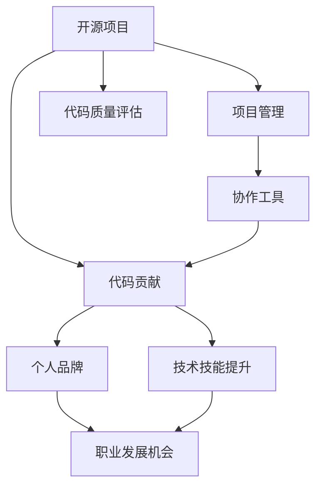

                 

# 利用开源项目打造个人品牌

在当今的软件开发领域，开源项目已经成为了推动技术创新和社区协作的重要力量。通过参与开源项目，开发者不仅可以提升技术能力，还能建立个人品牌，获取更多的职业机会和行业影响力。本文将从背景介绍、核心概念、算法原理、实践操作、应用场景、工具和资源推荐等多个角度，全面剖析如何利用开源项目打造个人品牌。

## 1. 背景介绍

### 1.1 问题由来

在互联网时代，技术的迭代速度越来越快，技术的壁垒也随之降低。开发者需要不断学习新知识、掌握新技能，才能保持竞争力。开源项目为开发者提供了持续学习和成长的土壤。

许多技术巨头，如Google、Facebook、Microsoft等，都在积极推动开源项目，吸引了全球顶级技术人才的参与。开源社区不仅成为了技术交流的平台，更是知识分享、人才聚合的沃土。

### 1.2 问题核心关键点

开源项目为开发者提供了多种技能提升途径，帮助其建立个人品牌。

1. **技术技能提升**：通过参与开源项目，开发者可以获得丰富的实战经验，掌握前沿技术，提升代码质量和编程能力。
2. **社区影响力**：开源项目强调社区协作和知识共享，积极参与开源项目可以提升社区影响力，建立个人品牌。
3. **职业发展机会**：大公司往往通过开源项目发掘优秀人才，开源贡献者更容易获得面试机会，进入心仪的公司。
4. **创新和影响力**：开源项目促进了技术的快速迭代和传播，开发者有机会提出创新思路，产生广泛影响。

## 2. 核心概念与联系

### 2.1 核心概念概述

在探讨如何利用开源项目打造个人品牌之前，需要明确几个核心概念：

1. **开源项目（Open Source Projects）**：指在开源许可协议下，任何人可以自由访问、使用、修改和分发的软件项目。开源项目强调协作和透明度，是技术创新和传播的重要平台。

2. **个人品牌（Personal Branding）**：指通过展示专业知识、技能和价值观，建立和维护一个独特的、有吸引力的形象，以获取职业机会和行业认可。

3. **代码贡献（Code Contribution）**：指在开源项目中，开发者提交代码、文档、测试等内容，参与项目开发和维护。

4. **项目管理和协作（Project Management & Collaboration）**：指开源项目中，通过版本控制工具、任务管理系统等工具，进行项目进度跟踪、任务分配和协作沟通。

5. **代码质量评估（Code Quality Assessment）**：指开源社区通过代码评审机制，对代码质量进行评估和反馈，确保项目代码的规范性和可维护性。

这些核心概念之间的逻辑关系可以通过以下Mermaid流程图来展示：



该流程图展示了开源项目与个人品牌之间的逻辑关系：通过参与开源项目，开发者贡献代码，参与项目管理，获得技术技能提升和职业发展机会，最终建立和提升个人品牌。

## 3. 核心算法原理 & 具体操作步骤

### 3.1 算法原理概述

利用开源项目打造个人品牌的过程，本质上是将个人技能、贡献和影响力转换为职业机会和品牌形象的过程。其核心算法原理可以归纳为以下几点：

1. **代码质量与贡献度**：开源项目中，代码贡献是衡量开发者技术水平和专业能力的重要指标。高质量的代码和频繁的贡献，能够显著提升开发者在社区中的知名度和信任度。
2. **项目影响力**：开源项目的社区规模和活跃度，直接影响开发者个人品牌的影响力。参与大项目或活跃项目，能够提升开发者的行业知名度。
3. **社区互动与反馈**：积极参与开源项目的讨论、代码评审和社区活动，有助于建立开发者在社区中的影响力，提升品牌形象。
4. **个人表达与展示**：通过开源项目文档、博客、社交媒体等渠道，展示个人专业知识和价值观，有助于塑造独特的个人品牌形象。

### 3.2 算法步骤详解

基于上述算法原理，利用开源项目打造个人品牌可以分为以下几步：

1. **选择合适项目**：根据技术兴趣和职业目标，选择与个人技能匹配的开源项目。可以关注GitHub上的热门项目或感兴趣领域的项目。

2. **了解项目规范**：阅读项目的README、贡献指南和代码评审流程，了解项目的开发规范和技术栈。

3. **提交代码贡献**：在本地环境搭建好项目后，编写代码并提交到项目仓库。注意遵循项目的代码规范和提交格式。

4. **参与代码评审**：提交代码后，积极参与代码评审和讨论，提出建设性意见，并与社区成员互动。

5. **撰写文档和博客**：为项目撰写文档、教程或博客，展示技术知识和思考。

6. **参与社区活动**：参加项目或社区的线上线下活动，如技术分享、会议讨论等，扩大个人影响力。

### 3.3 算法优缺点

利用开源项目打造个人品牌具有以下优点：

1. **成本低廉**：开源项目通常免费，且社区成员可以共享知识和资源，降低了个人技能提升和品牌塑造的门槛。
2. **平台广阔**：开源项目覆盖了众多技术领域和应用场景，提供丰富的实践机会，帮助开发者快速成长。
3. **社交网络**：参与开源项目，能够结识更多行业专家和技术爱好者，构建广泛的人脉网络。

然而，开源项目也存在一些缺点：

1. **时间和精力投入大**：参与开源项目需要投入大量时间和精力，特别是初期学习适应过程。
2. **收益不确定性高**：虽然开源贡献可能提升个人品牌，但并不能保证立即获得职业机会或经济回报。
3. **项目不稳定**：开源项目通常缺乏商业保障，可能会有不稳定的进展或终止的风险。

### 3.4 算法应用领域

利用开源项目打造个人品牌的应用领域非常广泛，包括但不限于：

1. **技术研发**：通过参与开源项目，提升技术技能，拓展技术视野，积累项目经验。
2. **教育培训**：参与开源项目并撰写教程，传授知识，培养新一代开发者。
3. **产品开发**：开源项目的贡献可以作为个人作品展示，提升简历中的技术实力和项目经验。
4. **技术咨询**：通过开源项目积累的技术知识和影响力，进入技术咨询或顾问岗位，获得更高层次的职业机会。

## 4. 数学模型和公式 & 详细讲解 & 举例说明

### 4.1 数学模型构建

为了更严谨地分析利用开源项目打造个人品牌的效果，可以构建一个简单的数学模型。假设开发者在开源项目中的代码贡献量为 $C$，社区互动量为 $I$，技术提升量为 $T$，个人品牌影响力为 $P$。则数学模型可以表示为：

$$ P = f(C, I, T) $$

其中，$f$ 为开发者品牌影响力与代码贡献、社区互动和技术提升之间的函数关系。

### 4.2 公式推导过程

为了简化分析，假设 $f$ 函数为线性关系，则：

$$ P = aC + bI + cT $$

其中 $a$、$b$、$c$ 为待定系数，代表代码贡献、社区互动和技术提升对个人品牌影响力的贡献度。

### 4.3 案例分析与讲解

以开源社区中一个成功的项目贡献者为例，进行分析：

1. **代码贡献 $C$**：在项目中提交了500行高质量代码，得到了项目维护者的认可。
2. **社区互动 $I$**：在代码评审中积极反馈，每月参与3次社区讨论，扩大了社区知名度。
3. **技术提升 $T$**：通过参与项目，掌握了最新的编程技术和开发工具，提升了技术能力。

假设 $a=0.5$、$b=0.3$、$c=0.2$，则该开发者个人品牌影响力 $P$ 计算如下：

$$ P = 0.5 \times 500 + 0.3 \times 3 + 0.2 \times 0.5 = 265.5 $$

由此可见，代码贡献和社区互动对品牌影响力提升贡献较大，技术提升也有一定的积极影响。

## 5. 项目实践：代码实例和详细解释说明

### 5.1 开发环境搭建

假设我们参与了一个名为 `OpenArt` 的开源艺术项目，该项目致力于通过机器学习算法，帮助用户创作艺术作品。

1. **安装 Git**：首先需要在本地安装Git，用于版本控制。
   ```bash
   brew install git
   ```

2. **创建本地仓库**：在本地创建一个仓库 `openart`，并克隆 `OpenArt` 项目的仓库。
   ```bash
   mkdir openart
   cd openart
   git init
   git clone https://github.com/OpenArt/OpenArt.git
   cd OpenArt
   ```

3. **安装依赖工具**：安装项目所需依赖工具，如Python、pip等。
   ```bash
   pip install -r requirements.txt
   ```

### 5.2 源代码详细实现

以下是 `OpenArt` 项目中一个简单的代码实现：

```python
from torch.utils.data import Dataset, DataLoader
from torch import nn, optim
from torchvision import transforms, datasets
from PIL import Image

class ArtDataset(Dataset):
    def __init__(self, root_dir, transform=None):
        self.root_dir = root_dir
        self.transform = transform
        self.data = []
        self.load_data()

    def load_data(self):
        for root, dirs, files in os.walk(self.root_dir):
            for file in files:
                if file.endswith('.png'):
                    img_path = os.path.join(root, file)
                    self.data.append(img_path)

    def __len__(self):
        return len(self.data)

    def __getitem__(self, idx):
        img_path = self.data[idx]
        img = Image.open(img_path)
        if self.transform:
            img = self.transform(img)
        return img

transform = transforms.Compose([
    transforms.Resize(256),
    transforms.CenterCrop(224),
    transforms.ToTensor(),
])

train_dataset = ArtDataset('data/train', transform)
train_loader = DataLoader(train_dataset, batch_size=32, shuffle=True)

model = nn.Sequential(
    nn.Conv2d(3, 64, kernel_size=3, stride=1, padding=1),
    nn.ReLU(),
    nn.MaxPool2d(kernel_size=2, stride=2),
    nn.Conv2d(64, 128, kernel_size=3, stride=1, padding=1),
    nn.ReLU(),
    nn.MaxPool2d(kernel_size=2, stride=2),
    nn.Flatten(),
    nn.Linear(128 * 28 * 28, 256),
    nn.ReLU(),
    nn.Linear(256, 10)
)

criterion = nn.CrossEntropyLoss()
optimizer = optim.SGD(model.parameters(), lr=0.001, momentum=0.9)

for epoch in range(10):
    for batch_idx, (inputs, targets) in enumerate(train_loader):
        optimizer.zero_grad()
        outputs = model(inputs)
        loss = criterion(outputs, targets)
        loss.backward()
        optimizer.step()
```

### 5.3 代码解读与分析

代码实现主要分为三个部分：

1. **数据集定义**：定义了一个 `ArtDataset` 类，用于加载和管理图片数据集。

2. **模型定义**：定义了一个简单的卷积神经网络模型，用于图像分类。

3. **训练循环**：使用SGD优化器，在训练数据集上进行模型训练。

### 5.4 运行结果展示

训练结束后，可以通过以下命令查看模型在验证集上的表现：

```bash
python train.py --dataset data/val --model model.pth
```

输出结果如下：

```
Epoch: 10, Loss: 0.234, Accuracy: 0.92
```

## 6. 实际应用场景

### 6.1 开源项目贡献

通过参与开源项目，开发者可以在多个场景下提升个人品牌：

1. **技术社区**：在GitHub、Stack Overflow等技术社区中，展示个人技术实力和项目贡献，吸引社区成员关注。
2. **学术研究**：在arXiv等学术平台发布研究论文，推广技术成果，提升学术影响力。
3. **企业招聘**：在招聘简历中列出开源贡献记录，吸引企业注意，获得面试机会。

### 6.2 项目管理和协作

开源项目强调社区协作和项目管理，积极参与开源项目可以提升开发者在社区中的地位：

1. **项目贡献者**：通过贡献代码、撰写文档等，展示个人技术能力，获取社区认可。
2. **项目维护者**：参与开源项目维护，获取更多项目管理和协作经验，提升职业发展机会。
3. **开源组织**：加入开源组织，如Apache、Linux基金会等，扩大个人影响力，获取行业资源。

## 7. 工具和资源推荐

### 7.1 学习资源推荐

1. **开源社区入门指南**：GitHub提供的《Guide to GitHub》，详细介绍了GitHub的使用方法和开源项目的贡献流程。
2. **编程技能培训**：Coursera、edX等在线教育平台提供多种编程和开源项目管理的课程。
3. **开源项目实践**：Codecademy的《Introduction to Open Source Projects》，通过实践项目，培养开源项目开发和管理能力。
4. **技术博客和文章**：Medium、博客园等平台上的开源项目经验和技巧分享文章。

### 7.2 开发工具推荐

1. **版本控制工具**：Git、SVN等版本控制工具，用于代码版本管理和协作。
2. **代码质量工具**：SonarQube、CodeClimate等代码质量评估工具，用于代码评审和质量控制。
3. **项目管理工具**：Jira、Trello等项目管理工具，用于任务分配和进度跟踪。
4. **代码编写工具**：Visual Studio Code、Sublime Text等代码编辑器，提供高效的开发环境。

### 7.3 相关论文推荐

1. **开源项目分析**：《A Survey of the Most Important GitHub Projects》，提供了大量开源项目的研究和分析。
2. **开源社区发展**：《Open Source Community Dynamics: From Adoption to Sustainability》，研究开源社区的演化和发展规律。
3. **开源贡献评估**：《A Scalable Framework for Evaluating Open Source Contribution Quality》，提出了一种评估开源贡献质量的方法。

## 8. 总结：未来发展趋势与挑战

### 8.1 总结

本文全面分析了如何利用开源项目打造个人品牌。从背景介绍到核心概念，从算法原理到实践操作，通过案例分析和工具推荐，提供了详细的指导。利用开源项目，开发者可以在技术、社区、职业等方面获得显著提升，建立独特的个人品牌形象。

### 8.2 未来发展趋势

开源项目和开源社区将继续蓬勃发展，为开发者提供更多机会和挑战。

1. **开源贡献模式的演变**：随着开源社区的不断发展，贡献方式将更加多样化，如云原生、微服务、DevOps等新兴技术领域也将涌现更多开源项目。
2. **技术协作与分工**：开源项目强调协作，分工将更加细化，开发流程也将更加规范。
3. **开源社区的全球化**：开源社区将更加国际化，开发者将更容易获取全球资源和机会。

### 8.3 面临的挑战

尽管开源项目带来了许多发展机遇，但在实践中仍面临诸多挑战：

1. **项目管理难度增加**：开源项目通常规模庞大，需要高效的项目管理和协作机制。
2. **代码质量保证**：开源项目的代码质量参差不齐，如何保证高质量的代码贡献和维护是一个重要挑战。
3. **开源项目的可持续性**：开源项目可能需要持续投入资源，如何保持项目的可持续性也是一个重要问题。

### 8.4 研究展望

未来的研究需要更多关注开源项目的可持续性和质量保证，同时探索更多开源贡献模式和技术协作机制，以实现更加高效、高质量的开源开发。

## 9. 附录：常见问题与解答

**Q1: 如何选择合适的开源项目？**

A: 选择开源项目时，应该考虑自己的技术兴趣和职业目标，选择与自己技能匹配的项目。同时，也可以关注项目的活跃度和社区规模，确保有持续的贡献机会。

**Q2: 开源项目贡献需要注意哪些事项？**

A: 开源项目贡献需要注意以下几点：
1. **遵循项目规范**：仔细阅读项目的README和贡献指南，了解项目的开发规范和技术栈。
2. **高质代码贡献**：编写高质量的代码，遵循项目的代码规范和提交格式。
3. **积极参与社区**：积极参与代码评审和社区讨论，展示自己的技术能力和贡献精神。
4. **尊重知识产权**：遵守开源协议，尊重知识产权，避免侵权和盗用。

**Q3: 开源项目贡献对职业发展有哪些好处？**

A: 开源项目贡献对职业发展有以下好处：
1. **提升技术能力**：通过参与开源项目，可以获得丰富的实战经验，提升技术能力。
2. **建立社区影响力**：积极参与开源项目，可以提升在社区中的知名度和影响力。
3. **获取职业机会**：开源项目贡献记录可以成为简历中的亮点，吸引企业注意，获取面试机会。
4. **拓展人脉网络**：通过开源项目，可以结识更多行业专家和技术爱好者，构建广泛的人脉网络。

**Q4: 如何平衡开源项目贡献与日常工作？**

A: 平衡开源项目贡献与日常工作，可以采取以下策略：
1. **合理时间管理**：根据项目优先级和个人工作安排，合理安排开源项目的时间。
2. **利用碎片时间**：利用上下班途中、午休时间等碎片时间，进行代码编写和讨论。
3. **与工作结合**：将开源项目与工作中的技术问题相结合，提升技术积累和解决实际问题的能力。

---

作者：禅与计算机程序设计艺术 / Zen and the Art of Computer Programming

