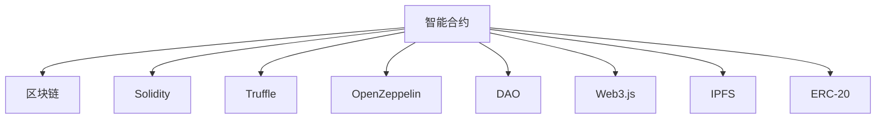

                 

## 1. 背景介绍

### 1.1 问题由来
随着区块链技术的成熟，智能合约作为一种去中心化的自动化执行协议，正逐渐成为数字经济的基础设施。智能合约可以自动执行、存储数据、执行合约，无需第三方中介，极大地提升了交易效率和安全性。

然而，智能合约的开发、部署和治理，相比传统的中心化应用，存在诸多挑战：

1. **高复杂度**：智能合约通常涉及复杂的业务逻辑和财务计算，编程难度较大。
2. **低调试性**：一旦部署在区块链上，智能合约难以像中心化应用一样进行调试和测试。
3. **可扩展性差**：智能合约的语言和框架限制，使得代码难以扩展和维护。
4. **安全性问题**：由于区块链上数据的不可篡改性，一旦部署错误，就难以修复，可能导致重大损失。

为了应对这些挑战，本文将探讨利用技术优势进行智能合约开发的最佳实践，通过前沿技术手段，提升智能合约的开发效率、安全性和可扩展性。

### 1.2 问题核心关键点
智能合约开发的关键在于：

1. **开发环境的选择**：选择合适的编程语言和开发工具，提升开发效率和代码质量。
2. **治理机制的构建**：建立有效的治理机制，确保智能合约的更新和维护。
3. **安全漏洞的防范**：采用先进的安全技术，防范常见的智能合约安全漏洞。
4. **跨链互操作性**：实现不同区块链平台之间的互操作性，提升智能合约的适用性和普及度。
5. **扩展性设计**：设计可扩展的智能合约框架，支持未来的业务需求。

这些关键点共同构成了智能合约开发的核心挑战，需要通过技术手段进行逐一解决。

## 2. 核心概念与联系

### 2.1 核心概念概述

为更好地理解利用技术优势进行智能合约开发的方法，本节将介绍几个关键概念：

- **智能合约**：基于区块链技术，实现自动化执行、存储数据、执行合约的协议。
- **区块链**：分布式账本技术，通过去中心化的方式记录和验证交易数据。
- **Solidity**：以太坊官方支持的编程语言，用于开发智能合约。
- **Truffle**：用于Solidity智能合约开发、测试和部署的工具。
- **OpenZeppelin**：提供可复用的智能合约库和安全工具。
- **DAO**：分布式自治组织，通过智能合约实现自治管理。
- **Web3.js**：用于连接区块链和Web应用的JavaScript库。
- **IPFS**：分布式文件系统，用于存储智能合约的数据和代码。
- **ERC-20**：以太坊标准代币协议，定义了智能合约中的代币实现。

这些核心概念之间的逻辑关系可以通过以下Mermaid流程图来展示：



这个流程图展示了一些关键概念之间的联系：

1. 智能合约基于区块链技术实现，可以存储数据和执行合约。
2. Solidity是用于开发智能合约的编程语言，由以太坊官方支持。
3. Truffle是一个集成开发环境(IDEE)，用于Solidity智能合约的开发、测试和部署。
4. OpenZeppelin提供了可复用的智能合约库和安全工具，提高了智能合约的安全性和开发效率。
5. DAO是一种通过智能合约实现的自治管理组织，可以通过智能合约进行自治决策。
6. Web3.js是一个连接区块链和Web应用的JavaScript库，支持智能合约的交互和操作。
7. IPFS是一个分布式文件系统，用于存储智能合约的数据和代码。
8. ERC-20是以太坊标准代币协议，定义了智能合约中的代币实现。

这些概念共同构成了智能合约开发的基础框架，使得开发者可以高效、安全地构建和部署智能合约。

## 3. 核心算法原理 & 具体操作步骤
### 3.1 算法原理概述

智能合约的开发过程通常包括设计合约结构、实现业务逻辑、测试和部署等步骤。通过选择合适的开发环境和工具，可以显著提升智能合约的开发效率和安全性。

- **设计合约结构**：选择合适的智能合约框架和模板，定义合约的接口和状态。
- **实现业务逻辑**：根据业务需求，编写智能合约的代码，实现具体功能。
- **测试和部署**：在测试环境中测试智能合约的功能和安全性，部署到区块链上。

### 3.2 算法步骤详解

以下是智能合约开发的具体操作步骤：

1. **环境准备**：
   - 安装Solidity编译器和以太坊钱包工具。
   - 创建以太坊账户和私钥。
   - 配置Truffle环境，连接以太坊测试网络。

2. **合约设计**：
   - 选择合适的智能合约模板或框架，如OpenZeppelin的库。
   - 设计合约的接口和状态，定义函数和数据结构。
   - 编写合约代码，实现具体功能。

3. **测试和调试**：
   - 在Truffle环境中，编译合约并部署到测试网络上。
   - 编写测试脚本，测试合约的功能和安全性。
   - 使用Solidity调试工具，调试合约的逻辑和状态。

4. **部署和验证**：
   - 在Truffle环境中，编译合约并部署到主网络上。
   - 使用Web3.js或其他客户端工具，测试合约的功能和安全性。
   - 验证合约的正确性和安全性，确保符合预期。

### 3.3 算法优缺点

利用技术优势进行智能合约开发，具有以下优点：

1. **高效开发**：使用Solidity和Truffle等工具，可以快速构建和部署智能合约，提升开发效率。
2. **代码质量**：OpenZeppelin提供了可复用的智能合约库和安全工具，提升了代码的质量和安全性。
3. **安全性**：Solidity和OpenZeppelin等工具，提供了丰富的安全措施和最佳实践，防范了常见的智能合约安全漏洞。
4. **跨链互操作性**：使用IPFS等技术，可以实现不同区块链平台之间的互操作性，提升了智能合约的适用性和普及度。
5. **扩展性设计**：选择合适的智能合约框架和模板，可以支持未来的业务需求，提升了系统的扩展性。

然而，该方法也存在一些缺点：

1. **学习成本**：使用Solidity等新兴技术，需要学习新的编程语言和工具，增加了学习的难度。
2. **复杂性**：智能合约的业务逻辑和财务计算复杂，需要较高的编程水平。
3. **维护成本**：智能合约的更新和维护较为复杂，需要专业的开发团队。
4. **安全风险**：智能合约的安全漏洞可能导致重大损失，需要高度的安全意识和防范措施。

### 3.4 算法应用领域

智能合约开发技术可以应用于多个领域，如金融、供应链、物联网等，具体包括：

- **金融合约**：例如抵押贷款合约、股权众筹合约、保险合约等。
- **供应链合约**：例如供应链金融合约、供应链管理合约等。
- **物联网合约**：例如物联网设备管理合约、设备共享合约等。
- **电子投票合约**：例如代币持有者投票合约、社区治理合约等。

## 4. 数学模型和公式 & 详细讲解  
### 4.1 数学模型构建

智能合约开发涉及到诸多数学和计算问题，以下是一些常见的数学模型和公式：

- **函数调用和转账**：
  - 智能合约函数调用：
   $$
   f(x) = \text{solCall}(\text{address}, \text{functionName}, \text{params})
   $$
  - 以太坊转账：
   $$
   \text{transfer}(\text{to}, \text{value})
   $$

- **智能合约的安全性**：
  - 使用Solidity的安全最佳实践，防范重入攻击、溢出攻击等。
  - 使用OpenZeppelin的安全工具，检查和修复安全漏洞。

- **智能合约的扩展性**：
  - 使用Solidity的继承和多继承机制，构建可扩展的智能合约框架。
  - 使用OpenZeppelin的库和模板，支持未来的业务需求。

### 4.2 公式推导过程

以下是一些常见的数学推导过程：

- **智能合约的部署成本**：
  - 计算智能合约部署到以太坊主网络的费用：
   $$
   \text{cost} = \text{gasPrice} \times \text{gasUsed}
   $$
  - 计算智能合约部署到IPFS的费用：
   $$
   \text{cost} = \text{fileSize} \times \text{uploadCost}
   $$

- **智能合约的调用成本**：
  - 计算智能合约函数调用的费用：
   $$
   \text{cost} = \text{gasPrice} \times \text{gasUsed}
   $$
  - 计算智能合约转账的费用：
   $$
   \text{cost} = \text{transferFee}
   $$

- **智能合约的性能优化**：
  - 使用Solidity的优化技术，如循环展开、变量复用等，提升智能合约的性能。
  - 使用Truffle的优化工具，如Truffle Optimizer，检测和修复性能问题。

### 4.3 案例分析与讲解

以下是一些智能合约开发的案例分析：

- **抵押贷款合约**：使用Solidity和OpenZeppelin的库，实现抵押贷款的自动放款、还款和违约处理。
- **供应链金融合约**：使用Solidity和Truffle，实现供应链的融资、物流和清算管理。
- **物联网设备管理合约**：使用Solidity和IPFS，实现物联网设备的注册、监控和更新管理。

## 5. 项目实践：代码实例和详细解释说明
### 5.1 开发环境搭建

以下是智能合约开发环境搭建的具体步骤：

1. **安装Solidity编译器和以太坊钱包工具**：
   - 安装Solidity编译器：
    ```bash
    brew install solc
    ```
   - 安装以太坊钱包工具：
    ```bash
    brew install ethereum
    ```

2. **创建以太坊账户和私钥**：
   - 生成以太坊账户：
    ```bash
    eth account new
    ```
   - 保存私钥：
    ```bash
    eth account export <address>
    ```

3. **配置Truffle环境**：
   - 安装Truffle：
    ```bash
    npm install -g truffle
    ```
   - 配置Truffle网络：
    ```bash
    truffle init
    ```

### 5.2 源代码详细实现

以下是智能合约开发的源代码实现：

```solidity
pragma solidity ^0.8.0;

contract MyContract {
    // 合约状态
    uint256 public balance;

    // 合约函数
    function add(uint256 amount) public {
        balance += amount;
    }

    function transfer(address receiver, uint256 amount) public {
        require(balance >= amount, "Insufficient balance");
        balance -= amount;
        receiver.balance += amount;
    }
}
```

### 5.3 代码解读与分析

以下是源代码的详细解读和分析：

- **合约状态**：定义了合约的公共变量`balance`，用于存储账户余额。
- **合约函数**：
  - `add`函数：增加账户余额。
  - `transfer`函数：转账到其他账户。
  - 使用`require`语句，进行余额检查，确保转账成功。
- **接口和数据结构**：使用`public`关键字，定义了合约的接口和数据结构，使其他合约可以调用和读取数据。

### 5.4 运行结果展示

以下是智能合约的运行结果展示：

```javascript
const { ethers } = require('ethers');

async function main() {
    const { ethers } = require('ethers');
    const { network } = require('hardhat');

    const signers = await ethers.getSigners();
    const [deployer] = signers;

    const contractAddress = "0x..."; // 合约地址
    const contract = new ethers.Contract(contractAddress, MyContract.abi, deployer);

    // 部署智能合约
    const balance = await contract.balance();

    // 转账
    const receiver = signers[1];
    await contract.transfer(receiver.address, ethers.utils.parseEther("0.1"));

    // 验证余额
    const receiverBalance = await receiver.getBalance();
    console.log(`Receiver balance: ${receiverBalance}`);
}

main()
    .then(() => process.exit(0))
    .catch((error) => {
        console.error(error);
        process.exit(1);
    });
```

## 6. 实际应用场景
### 6.1 智能合约开发与金融合约

在金融领域，智能合约可以用于自动放款、自动理财、保险理赔等场景，极大地提升了金融服务的效率和安全性。

### 6.2 智能合约开发与供应链金融

在供应链金融领域，智能合约可以实现货物流转、账款结算、融资等业务，提升供应链的透明度和效率。

### 6.3 智能合约开发与物联网

在物联网领域，智能合约可以实现设备管理、数据共享、安全认证等业务，推动物联网技术的普及和应用。

### 6.4 智能合约开发与电子投票

在电子投票领域，智能合约可以实现投票规则的自动化执行，确保投票过程的公平性和透明性。

## 7. 工具和资源推荐
### 7.1 学习资源推荐

以下是一些智能合约开发的优质学习资源：

1. **《Solidity编程语言》**：由Solidity官方编写，全面介绍了Solidity编程语言的语法和用法。
2. **《Truffle官方文档》**：Truffle的官方文档，提供了详细的开发、测试和部署指南。
3. **《OpenZeppelin官方文档》**：OpenZeppelin的官方文档，提供了丰富的智能合约库和安全工具。
4. **《智能合约安全指南》**：由以太坊基金会编写，介绍了常见的智能合约安全漏洞和防范措施。
5. **《以太坊白皮书》**：以太坊官方编写的白皮书，介绍了区块链和智能合约的基本原理和技术实现。

### 7.2 开发工具推荐

以下是一些智能合约开发的常用工具：

1. **Solidity编译器**：用于编译Solidity代码，生成字节码。
2. **Truffle框架**：用于Solidity智能合约的开发、测试和部署。
3. **Web3.js库**：用于连接区块链和Web应用的JavaScript库。
4. **IPFS**：用于分布式文件系统，存储智能合约的数据和代码。
5. ** Remix IDE**：用于Solidity智能合约的开发和测试。

### 7.3 相关论文推荐

以下是几篇关于智能合约开发的重要论文：

1. **《Smart Contracts: Contracts of the Future》**：由Gavin Wood等编写，介绍了智能合约的基本原理和技术实现。
2. **《Blockchain Technology and Smart Contracts》**：由Daniel Larsson编写，介绍了区块链和智能合约的基本原理和应用场景。
3. **《Blockchain-Based Contracts for the Real World》**：由Andrew Marshall等编写，介绍了智能合约在现实世界中的应用场景和挑战。

## 8. 总结：未来发展趋势与挑战
### 8.1 总结

本文对利用技术优势进行智能合约开发的方法进行了全面系统的介绍。首先阐述了智能合约开发的背景和意义，明确了开发环境、治理机制、安全性、跨链互操作性和扩展性等关键点。其次，从算法原理到具体实现，详细讲解了智能合约开发的数学模型和代码实现。最后，探讨了智能合约在金融、供应链、物联网和电子投票等领域的实际应用，并给出了一些常用的开发工具和推荐的学习资源。

通过本文的系统梳理，可以看到，利用技术优势进行智能合约开发，可以显著提升智能合约的开发效率、安全性和可扩展性。得益于Solidity和Truffle等工具，智能合约开发变得更加高效和可控。同时，OpenZeppelin等安全工具和最佳实践，为智能合约的安全性提供了强有力的保障。未来，随着技术的不断进步，智能合约将会在更多领域得到广泛应用，推动数字经济的发展。

### 8.2 未来发展趋势

展望未来，智能合约开发技术将呈现以下几个发展趋势：

1. **标准化和互操作性**：智能合约的标准化协议和互操作性技术将进一步发展，推动不同区块链平台之间的互操作性。
2. **安全性和隐私保护**：智能合约的安全性和隐私保护技术将不断提升，防范常见的安全漏洞和隐私泄露风险。
3. **自动化和智能化**：智能合约的自动化和智能化水平将不断提高，支持更多的业务场景和复杂逻辑。
4. **可扩展性和易用性**：智能合约的扩展性和易用性将进一步提升，降低开发和维护成本。
5. **跨链互操作性**：智能合约的跨链互操作性技术将不断成熟，支持更多的跨链应用场景。

以上趋势凸显了智能合约开发技术的广阔前景。这些方向的探索发展，必将进一步提升智能合约的性能和应用范围，为数字经济的发展注入新的动力。

### 8.3 面临的挑战

尽管智能合约开发技术已经取得了一定的进展，但在迈向更加智能化、普适化应用的过程中，仍面临诸多挑战：

1. **复杂性和学习成本**：智能合约的业务逻辑和财务计算复杂，需要较高的编程水平和学习成本。
2. **安全性问题**：智能合约的安全漏洞可能导致重大损失，防范和修复安全漏洞难度较大。
3. **跨链互操作性**：不同区块链平台之间的互操作性仍需进一步发展，现有技术存在一定的瓶颈。
4. **扩展性和维护性**：智能合约的扩展性和维护性需进一步提升，支持未来的业务需求和系统更新。
5. **隐私保护**：智能合约的数据和代码存储在区块链上，隐私保护仍需进一步加强。

正视智能合约开发面临的这些挑战，积极应对并寻求突破，将是大规模应用智能合约的重要保障。相信随着学界和产业界的共同努力，这些挑战终将一一被克服，智能合约必将在构建数字经济基础设施中发挥越来越重要的作用。

### 8.4 研究展望

面对智能合约开发所面临的挑战，未来的研究需要在以下几个方面寻求新的突破：

1. **自动化和智能化**：开发自动化和智能化的智能合约开发工具，降低开发和维护成本。
2. **跨链互操作性**：开发跨链互操作性协议和标准，支持不同区块链平台之间的互操作性。
3. **安全性和隐私保护**：研究智能合约的安全性技术和隐私保护技术，防范常见的安全漏洞和隐私泄露风险。
4. **标准化和易用性**：制定智能合约的标准化协议和互操作性标准，提升智能合约的易用性。
5. **扩展性和维护性**：研究可扩展的智能合约框架和工具，支持未来的业务需求和系统更新。

这些研究方向将引领智能合约开发技术迈向更高的台阶，为数字经济的发展提供更加坚实的技术基础。

## 9. 附录：常见问题与解答

**Q1：如何选择合适的智能合约框架？**

A: 选择合适的智能合约框架，需要考虑以下几个因素：
1. **功能完备性**：选择功能完备、可复用的框架，减少重复开发。
2. **安全性**：选择安全性高的框架，防范常见的智能合约安全漏洞。
3. **易用性**：选择易用性高的框架，降低开发和维护成本。
4. **社区支持**：选择有活跃社区支持的框架，便于获取帮助和技术支持。
5. **扩展性**：选择可扩展性高的框架，支持未来的业务需求和系统更新。

**Q2：如何防范智能合约的安全漏洞？**

A: 防范智能合约的安全漏洞，需要遵循以下几个原则：
1. **代码审查**：定期进行代码审查，检测和修复安全漏洞。
2. **安全性测试**：进行安全性测试，如自动化测试、渗透测试等，发现和修复漏洞。
3. **使用安全工具**：使用OpenZeppelin等安全工具，检查和修复安全漏洞。
4. **遵循最佳实践**：遵循Solidity和OpenZeppelin的安全最佳实践，防范常见安全漏洞。
5. **持续改进**：随着技术的发展，定期更新和改进智能合约的安全性措施。

**Q3：如何提高智能合约的可扩展性？**

A: 提高智能合约的可扩展性，需要遵循以下几个原则：
1. **使用模块化设计**：采用模块化设计，降低代码的耦合度，便于扩展和维护。
2. **使用继承和多继承**：使用继承和多继承机制，构建可扩展的智能合约框架。
3. **使用事件和回调**：使用事件和回调机制，实现智能合约的异步处理和扩展。
4. **使用智能合约库**：使用OpenZeppelin等智能合约库，提升智能合约的扩展性和可复用性。
5. **使用治理机制**：使用DAO等治理机制，支持智能合约的更新和维护。

这些方法可以帮助开发者构建可扩展的智能合约，支持未来的业务需求和系统更新。

---

作者：禅与计算机程序设计艺术 / Zen and the Art of Computer Programming

