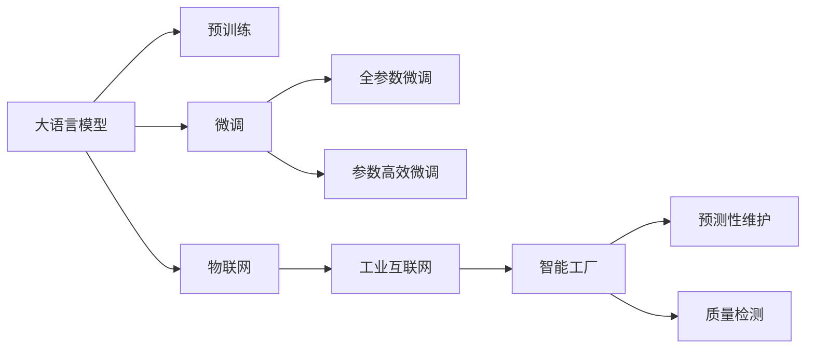

                 

## 1. 背景介绍

随着工业4.0的兴起，智能制造、智慧工厂等概念不断涌现，制造业正处于一场颠覆性的变革之中。如何利用先进的IT技术优势，打造智能工厂，实现生产过程的数字化、网络化、智能化，成为当前企业关注的焦点。在这方面，大语言模型微调技术提供了强大的支撑，为企业创业开辟了新的道路。

## 2. 核心概念与联系

### 2.1 核心概念概述

- **大语言模型（Large Language Models, LLMs）**：基于Transformer架构的预训练语言模型，如GPT-3、BERT等。通过大规模无监督学习，学习到丰富的语言知识和常识，具备强大的文本理解与生成能力。

- **微调（Fine-tuning）**：在预训练模型的基础上，利用少量标注数据进行有监督学习，使模型在特定任务上表现出色。适用于各类NLP任务，如问答、分类、翻译等。

- **智能工厂**：结合云计算、物联网、大数据、人工智能等先进技术，实现工厂生产全过程的智能化、可视化、自动化，提升生产效率，降低成本，提高品质。

- **物联网（IoT）**：通过传感器、智能设备、网络通信等技术，实现工厂设备和生产环境的互联互通。

- **工业互联网（Industrial Internet）**：将物联网、云计算、大数据、人工智能等技术与实体制造产业深度融合，构建全产业链生态体系。

- **预测性维护（Predictive Maintenance）**：利用机器学习和大数据分析技术，对生产设备的运行状态进行实时监控和预测，提前发现故障并进行维护，减少停机时间。

- **质量检测（Quality Control）**：通过图像识别、语音识别等技术，对生产过程中的产品质量进行实时检测和反馈，保证产品质量符合标准。

### 2.2 核心概念原理和架构的 Mermaid 流程图



此流程图展示了大语言模型微调与智能工厂的关系：

1. 大语言模型通过预训练获取通用的语言知识。
2. 利用微调技术，使模型适应特定任务，如设备运行状态的监控与预测。
3. 物联网、工业互联网与智能工厂构成上下游关系，利用设备数据进行模型微调。
4. 预测性维护和质量检测应用微调后的模型，实现智能化生产。

## 3. 核心算法原理 & 具体操作步骤

### 3.1 算法原理概述

智能工厂中的智能决策大多基于自然语言理解和处理。大语言模型微调可以应用于生产调度、设备维护、质量控制等多个环节，提升生产效率和产品质量。

### 3.2 算法步骤详解

**Step 1: 数据准备与模型选择**

1. **数据收集**：从工厂的传感器、控制系统、监控摄像头等设备中收集生产数据，如温度、湿度、压力、振动、图像、视频等。
2. **数据预处理**：清洗、归一化、分类、标注等数据预处理操作。
3. **模型选择**：根据任务需求，选择合适的预训练语言模型，如BERT、GPT等。

**Step 2: 模型微调**

1. **任务适配**：根据生产任务，设计合适的输出层和损失函数。例如，对于预测性维护，设计一个二分类任务，判断设备是否出现故障。
2. **训练集划分**：将数据集划分为训练集、验证集和测试集。
3. **模型微调**：
   - 选择适合的学习率、优化器、正则化方法。
   - 进行多轮迭代训练，逐步优化模型参数。
   - 在验证集上监控模型性能，防止过拟合。

**Step 3: 部署与监控**

1. **模型部署**：将微调后的模型部署到工厂的物联网设备和工业互联网平台中，实现实时预测和质量检测。
2. **性能监控**：定期评估模型在实际生产环境中的性能，收集反馈数据。
3. **模型迭代优化**：根据新数据和新反馈，对模型进行持续微调，保持模型性能。

### 3.3 算法优缺点

**优点**：
1. **适应性强**：大语言模型微调可以适应各类生产任务，灵活调整输出层和损失函数。
2. **部署便捷**：基于预训练模型微调后的模型部署相对简单，可快速上线。
3. **效果显著**：在预测性维护和质量检测任务中，微调模型效果显著，提升生产效率和产品质量。
4. **成本低**：相比从头训练模型，微调所需的数据量和计算资源更少，节省成本。

**缺点**：
1. **数据依赖**：微调模型对标注数据的依赖较高，数据质量直接决定模型性能。
2. **模型泛化**：微调模型可能对未见过的数据泛化效果较差。
3. **技术门槛**：微调过程需要一定的IT技术基础，非技术团队难以独立完成。
4. **模型解释性**：微调模型作为"黑盒"，难以解释其内部决策过程，不易调试和维护。

### 3.4 算法应用领域

智能工厂中，大语言模型微调主要应用于以下场景：

1. **预测性维护**：通过监控设备状态数据，预测设备故障，提前进行维护。
2. **生产调度**：优化生产流程，减少生产时间，提高生产效率。
3. **质量检测**：实时检测产品质量，提升产品合格率。
4. **设备异常检测**：检测设备运行异常，及时进行维护。
5. **故障诊断**：分析设备故障数据，诊断故障原因，指导设备维修。
6. **生产优化**：利用自然语言处理技术，优化生产参数设置。
7. **员工培训**：利用智能问答系统，辅助员工学习和培训。

## 4. 数学模型和公式 & 详细讲解 & 举例说明

### 4.1 数学模型构建

假设生产设备的数据表示为 $x=(x_1, x_2, ..., x_n)$，设备状态标签为 $y$。将设备状态数据输入微调后的模型 $M_{\theta}$，输出概率分布 $P(y|x; \theta)$，损失函数为交叉熵损失：

$$
L(M_{\theta}, y) = -y \log P(y|x; \theta) - (1-y) \log (1-P(y|x; \theta))
$$

微调目标是最小化经验风险：

$$
\theta^* = \mathop{\arg\min}_{\theta} \mathcal{L}(M_{\theta}, D)
$$

其中 $D$ 为训练数据集，$\mathcal{L}$ 为经验损失函数。

### 4.2 公式推导过程

- **输入数据标准化**：将设备状态数据 $x$ 标准化，使其符合模型输入要求。
- **模型输出概率计算**：将标准化后的输入数据 $x$ 输入微调模型，得到设备状态概率分布 $P(y|x; \theta)$。
- **损失函数计算**：根据真实标签 $y$ 和模型输出概率 $P(y|x; \theta)$ 计算交叉熵损失。
- **梯度下降**：使用梯度下降算法更新模型参数 $\theta$，使得损失函数最小化。

### 4.3 案例分析与讲解

以预测性维护为例，假设生产设备的数据表示为振动数据 $x$，设备状态标签为 $y$。微调模型后，输入振动数据，输出设备故障概率 $P(y|x; \theta)$。在训练集 $D$ 上训练模型，最小化损失函数 $L(M_{\theta}, y)$。在测试集上评估模型性能，根据实际设备振动数据进行预测性维护。

## 5. 项目实践：代码实例和详细解释说明

### 5.1 开发环境搭建

1. **环境安装**：安装Python 3.7以上版本，安装PyTorch、TensorFlow等深度学习框架。
2. **数据集准备**：准备生产设备的数据集，进行清洗和标注。
3. **模型部署**：将微调后的模型部署到物联网设备和工业互联网平台。

### 5.2 源代码详细实现

```python
import torch
import torch.nn as nn
import torch.optim as optim

class PredictiveMaintenance(nn.Module):
    def __init__(self, input_size, hidden_size, output_size):
        super(PredictiveMaintenance, self).__init__()
        self.fc1 = nn.Linear(input_size, hidden_size)
        self.fc2 = nn.Linear(hidden_size, output_size)
        self.softmax = nn.Softmax(dim=1)

    def forward(self, x):
        x = self.fc1(x)
        x = torch.relu(x)
        x = self.fc2(x)
        return self.softmax(x)

# 数据准备与模型选择
input_size = 64
hidden_size = 128
output_size = 2

model = PredictiveMaintenance(input_size, hidden_size, output_size)

# 模型微调
criterion = nn.CrossEntropyLoss()
optimizer = optim.Adam(model.parameters(), lr=0.001)

# 训练集划分
train_data = ...
train_labels = ...
test_data = ...
test_labels = ...

# 模型训练
for epoch in range(10):
    for i, (data, label) in enumerate(train_loader):
        data, label = data.to(device), label.to(device)
        optimizer.zero_grad()
        output = model(data)
        loss = criterion(output, label)
        loss.backward()
        optimizer.step()
    
    with torch.no_grad():
        test_output = model(test_data)
        test_loss = criterion(test_output, test_labels)

# 模型部署
device = torch.device("cuda:0" if torch.cuda.is_available() else "cpu")
model.to(device)
```

### 5.3 代码解读与分析

**PredictiveMaintenance类**：
- `__init__`方法：初始化全连接层和激活函数。
- `forward`方法：定义模型前向传播计算过程。

**模型训练**：
- 使用交叉熵损失函数 `nn.CrossEntropyLoss`。
- 采用Adam优化器，设置合适的学习率。
- 通过数据迭代训练，不断优化模型参数。

**模型部署**：
- 将模型部署到GPU/TPU等高性能设备上。
- 使用 `model.to(device)` 将模型迁移到GPU设备。

## 6. 实际应用场景

### 6.1 智能工厂运营

智能工厂中的许多决策都可以通过大语言模型微调来解决。例如，设备故障预测、生产流程优化、员工培训等，都可以通过微调模型实时获取决策支持。

**案例1：设备故障预测**

通过振动、温度等传感器数据，微调模型能够实时监控设备状态，预测设备故障。工厂能够提前安排维护，减少停机时间，提升生产效率。

**案例2：生产流程优化**

利用历史生产数据，微调模型可以优化生产流程，减少物料浪费，提高生产效率。

**案例3：员工培训**

通过智能问答系统，微调模型可以辅助员工学习和培训，提高员工技能水平。

### 6.2 供应链管理

智能工厂中的供应链管理涉及复杂的流程和协作，大语言模型微调可以提升供应链的透明度和效率。

**案例1：需求预测**

通过微调模型分析历史订单数据和市场需求，准确预测未来订单量，优化库存管理。

**案例2：供应商管理**

利用微调模型评估供应商绩效，优化供应商选择和合作关系。

**案例3：物流优化**

通过微调模型实时监控物流状态，优化物流路径和运输方式，提高物流效率。

### 6.3 质量控制

质量控制是大工厂生产中的重要环节，微调模型可以实时检测产品质量，提高产品合格率。

**案例1：产品检测**

通过微调模型分析产品图像，检测产品缺陷，减少次品率。

**案例2：产品分类**

利用微调模型对产品进行分类和标记，提高产品质量控制。

**案例3：故障诊断**

通过微调模型分析设备运行数据，诊断设备故障，提高设备可靠性。

### 6.4 未来应用展望

随着智能工厂的不断发展和微调技术的进步，未来的应用场景将更加广泛和深入。例如，智能仓储、智能物流、智能安全等，都可通过微调模型实现智能化管理。

## 7. 工具和资源推荐

### 7.1 学习资源推荐

- **Coursera课程**：《Deep Learning Specialization》：涵盖深度学习基础知识和实践技能。
- **Udacity课程**：《Artificial Intelligence for Robotics》：介绍AI在机器人中的应用。
- **DeepLearning.AI课程**：《AI for Everyone》：深入浅出地介绍AI基础知识。
- **书目推荐**：《深度学习》by Ian Goodfellow。
- **GitHub资源**：搜索项目`predictive_maintenance`或`factory_intelligence`，获取相关代码和文档。

### 7.2 开发工具推荐

- **PyTorch**：强大的深度学习框架，支持GPU加速。
- **TensorFlow**：功能丰富的深度学习框架，支持分布式训练。
- **Jupyter Notebook**：交互式编程环境，支持数据可视化。
- **TensorBoard**：可视化工具，监控模型训练和推理性能。
- **AWS SageMaker**：云平台，提供AI模型训练、部署、监控等服务。

### 7.3 相关论文推荐

- **"Deep Learning for Industrial Monitoring and Diagnostics"**：介绍深度学习在工业设备故障诊断中的应用。
- **"Predictive Maintenance in Manufacturing with Industrial Internet of Things"**：利用物联网技术实现设备预测性维护。
- **"Natural Language Processing in Industry"**：介绍NLP技术在工业自动化中的应用。
- **"Industrial Internet of Things: Technology, Future Trends, and Applications"**：介绍工业物联网技术的发展和应用。

## 8. 总结：未来发展趋势与挑战

### 8.1 研究成果总结

本文详细介绍了大语言模型微调技术在智能工厂中的应用，通过实例展示了微调模型的强大效果。通过系统梳理，读者可以全面了解微调技术的原理、步骤、优缺点及应用场景，进一步开拓创业思路。

### 8.2 未来发展趋势

- **模型规模扩大**：预训练模型的规模将不断扩大，提升模型的语言理解能力和知识表示能力。
- **算法优化**：新的优化算法和正则化技术将不断涌现，提升微调模型的训练效率和性能。
- **领域特定微调**：更多针对特定行业的微调模型将被开发，提升行业定制化应用效果。
- **跨模态微调**：微调模型将支持跨模态数据融合，提升智能化水平。
- **端到端集成**：微调模型将与其他AI技术深度融合，实现端到端智能应用。

### 8.3 面临的挑战

- **数据质量**：微调模型对标注数据的依赖高，需要高质量数据支持。
- **模型泛化**：微调模型在未见过的数据上泛化效果差。
- **技术门槛**：微调模型训练需要一定的技术基础，非技术团队难以独立完成。
- **模型解释性**：微调模型作为"黑盒"，难以解释其内部决策过程。
- **安全性**：微调模型可能学习有害信息，需采取措施保障数据和模型安全。

### 8.4 研究展望

未来的研究应注重以下方向：
- **无监督和半监督学习**：通过无监督和半监督学习，减少对标注数据的依赖。
- **跨领域迁移学习**：开发跨领域迁移学习技术，提升模型泛化能力。
- **多模态融合**：支持多模态数据融合，提升模型应用范围。
- **模型压缩与优化**：优化模型结构，提升推理速度和计算效率。
- **知识驱动的微调**：将专家知识与模型融合，提升模型性能。

## 9. 附录：常见问题与解答

**Q1：如何选择合适的微调模型？**

A: 根据应用场景和任务需求，选择适合的预训练模型。例如，针对设备故障预测，选择BERT或GPT等通用模型；针对供应链管理，选择相关领域专业模型。

**Q2：微调过程中如何设置学习率？**

A: 根据任务需求，设置合适的学习率。一般建议从0.001开始，逐步减小，直到模型收敛。可以使用学习率衰减策略，如Cosine Anneling。

**Q3：如何缓解过拟合问题？**

A: 数据增强、正则化、早停策略等可以有效缓解过拟合问题。

**Q4：微调模型在落地部署时需要注意哪些问题？**

A: 模型裁剪、量化加速、服务化封装、弹性伸缩、性能监控、安全防护等问题都需要考虑。

---

作者：禅与计算机程序设计艺术 / Zen and the Art of Computer Programming

