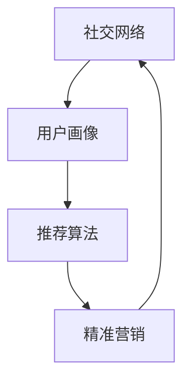

                 

# 利用技术优势进行社交电商

> 关键词：社交电商, 数据分析, 推荐算法, 人工智能, 精准营销, 用户行为分析, 技术应用

## 1. 背景介绍

### 1.1 问题由来

在数字化转型的浪潮中，社交电商（Social E-commerce）凭借其独特的社交属性和用户体验，迅速成为新兴的电商增长点。与传统电商不同，社交电商利用社交网络和社区的力量，通过推荐算法、个性化营销等技术手段，在提升用户粘性、促进转化率方面展现了强大的竞争力。然而，社交电商的核心优势在于精准定位用户需求，并及时提供个性化商品推荐，这一过程依赖于大量的数据分析和复杂的算法模型。

技术作为社交电商的核心竞争力之一，对电商平台的业务发展和用户体验提升起到了关键作用。但现有技术工具和方法在处理海量数据、提升推荐效率和质量、以及实现用户精准营销等方面仍存在不少挑战。本文旨在梳理社交电商中关键技术的原理与方法，探讨如何利用技术优势进一步提升社交电商平台的性能和用户体验。

## 2. 核心概念与联系

### 2.1 核心概念概述

社交电商主要涉及以下核心概念：

- **社交网络**：基于真实关系网络的社区，如微信朋友圈、微博等，用户之间可以分享商品信息、互动评论。
- **用户画像**：通过数据采集和分析，构建用户的兴趣、行为、人口统计等特征，形成用户多维度描述。
- **推荐算法**：使用协同过滤、基于内容的推荐、深度学习等技术，根据用户画像和商品特征，为用户推荐个性化商品。
- **精准营销**：利用数据分析和用户行为预测，实现定向广告投放、个性化活动推送等精准营销手段。

这些概念之间通过数据流和技术手段紧密相连。社交网络提供数据源，用户画像用于描述用户特征，推荐算法实现商品推荐，精准营销利用用户画像和推荐结果进行定向干预，共同构建起社交电商的核心竞争力。

### 2.2 核心概念原理和架构的 Mermaid 流程图(Mermaid 流程节点中不要有括号、逗号等特殊字符)



社交电商的核心流程通过用户画像构建、推荐算法应用和精准营销实施，形成闭环。用户画像和推荐算法提供商品推荐，精准营销根据推荐结果进行定向干预，最终通过社交网络反馈效果，指导后续改进。

## 3. 核心算法原理 & 具体操作步骤

### 3.1 算法原理概述

社交电商中的关键算法包括推荐算法和精准营销算法。推荐算法旨在通过分析用户行为和商品特征，实现个性化商品推荐，提高转化率和用户体验。精准营销算法则通过预测用户行为和偏好，实现个性化广告和活动推送，提升用户粘性和平台收益。

推荐算法主要有三种类型：

1. **基于协同过滤的推荐**：通过分析用户之间的行为相似性，为用户推荐其他用户喜欢的商品。包括基于用户的协同过滤和基于项目的协同过滤。
2. **基于内容的推荐**：分析商品的属性和特征，为用户推荐相似的商品。
3. **深度学习推荐**：利用深度神经网络，从用户行为和商品特征中提取隐含的关联关系，实现高精度的推荐。

精准营销算法主要包括：

1. **用户行为预测**：利用历史数据和机器学习算法，预测用户未来的行为，如购买意愿、活跃度等。
2. **定向广告投放**：根据用户画像和行为预测，进行定向广告投放，提升广告转化率。
3. **个性化活动推送**：分析用户行为和兴趣，推送个性化营销活动，提升用户参与度和满意度。

### 3.2 算法步骤详解

#### 3.2.1 推荐算法

1. **数据收集**：从社交网络、电商平台等渠道收集用户行为数据，包括浏览、点击、购买、评论等。
2. **数据清洗与预处理**：对数据进行去重、补全、归一化等处理，减少噪音，提升数据质量。
3. **用户画像构建**：利用用户行为数据和社交网络数据，构建用户的兴趣、行为、人口统计等特征。
4. **推荐模型训练**：选择合适的推荐算法，利用训练数据训练推荐模型，并调参优化。
5. **商品推荐**：根据用户画像和商品特征，通过推荐模型预测用户对商品的兴趣，实现商品推荐。

#### 3.2.2 精准营销算法

1. **用户行为数据收集**：收集用户在社交网络上的行为数据，包括发布、互动、点赞等。
2. **用户画像更新**：利用最新行为数据，更新用户画像，保持画像的时效性和准确性。
3. **行为预测模型训练**：基于历史行为数据，使用机器学习算法（如随机森林、神经网络等）训练行为预测模型。
4. **定向广告投放**：根据用户画像和行为预测，设计广告内容，进行定向投放。
5. **活动推送优化**：分析用户行为和兴趣，设计个性化营销活动，动态调整推送策略。

### 3.3 算法优缺点

#### 3.3.1 推荐算法

- **优点**：
  - 高精度：深度学习推荐算法能够从大规模数据中提取隐含关系，实现高精度的推荐。
  - 个性化：通过用户画像和商品特征，提供高度个性化的商品推荐，提升用户体验。
  - 鲁棒性：推荐算法在面对稀疏数据和高维度数据时表现较好，能够处理复杂的数据结构。

- **缺点**：
  - 数据依赖：推荐算法依赖于高质量、大规模的数据，数据不足可能导致推荐效果下降。
  - 模型复杂：深度学习推荐模型需要大量的训练时间和计算资源，模型调试复杂。
  - 冷启动问题：新用户或新商品的推荐效果较差，需要更多的数据和时间来适应。

#### 3.3.2 精准营销算法

- **优点**：
  - 定向性强：通过行为预测，实现精准的用户定向广告投放，提升广告转化率。
  - 个性化推送：分析用户行为和兴趣，推送个性化活动，提升用户参与度和满意度。
  - 效果可控：通过算法模型，可动态调整投放策略，实时优化营销效果。

- **缺点**：
  - 数据隐私：精准营销需要收集大量的用户数据，涉及用户隐私保护问题。
  - 模型假设：基于历史数据的预测模型假设可能与实际情况不符，导致预测偏差。
  - 依赖技术：精准营销依赖于复杂的算法模型和技术手段，技术门槛较高。

### 3.4 算法应用领域

推荐算法和精准营销算法在社交电商中的应用场景包括：

1. **商品推荐**：在社交网络中，根据用户行为和兴趣推荐商品，提升用户购买意愿。
2. **广告投放**：在电商平台上，进行定向广告投放，提高广告转化率和平台收益。
3. **活动推送**：在社交网络中，推送个性化营销活动，增加用户粘性和参与度。
4. **用户留存**：通过精准营销策略，提高用户活跃度和留存率，减少流失率。

## 4. 数学模型和公式 & 详细讲解 & 举例说明

### 4.1 数学模型构建

社交电商中的推荐算法和精准营销算法通常基于以下数学模型：

- **用户画像**：构建用户特征向量 $U \in \mathbb{R}^{n}$，其中 $n$ 为用户特征数。
- **商品特征**：构建商品特征向量 $I \in \mathbb{R}^{m}$，其中 $m$ 为商品特征数。
- **用户行为数据**：构建用户行为矩阵 $R \in \mathbb{R}^{n \times m}$，表示用户对商品的兴趣评分。
- **行为预测模型**：使用机器学习模型 $M$，训练行为预测模型，输出用户行为评分 $Y \in \mathbb{R}^{n}$。

### 4.2 公式推导过程

#### 4.2.1 协同过滤推荐算法

协同过滤推荐算法包括基于用户的协同过滤和基于项目的协同过滤。

**基于用户的协同过滤**：
- 输入：用户画像 $U$，用户行为矩阵 $R$。
- 输出：推荐商品 $I_{rec}$。

$$
I_{rec} = argmax_{i \in I} U^T \cdot \frac{R}{\sqrt{\sum_{j=1}^m R_{i,j}^2}}
$$

其中，$\cdot$ 表示向量点积，$\sqrt{}$ 表示矩阵第 $i$ 行向量的模长。

**基于项目的协同过滤**：
- 输入：商品特征 $I$，用户行为矩阵 $R$。
- 输出：推荐商品 $I_{rec}$。

$$
I_{rec} = argmax_{i \in I} \frac{R}{\sqrt{\sum_{j=1}^n R_{i,j}^2}} \cdot I^T
$$

其中，$\cdot$ 表示向量点积，$\sqrt{}$ 表示矩阵第 $i$ 列的模长。

#### 4.2.2 基于内容的推荐算法

基于内容的推荐算法通常利用商品的属性和特征，构建商品特征向量 $I$，并计算用户画像 $U$ 和商品特征向量 $I$ 的点积。

$$
I_{rec} = argmax_{i \in I} U^T \cdot I
$$

#### 4.2.3 深度学习推荐算法

深度学习推荐算法通常使用神经网络模型，包括多层感知器（MLP）、神经协同过滤（NCF）等。

$$
I_{rec} = argmax_{i \in I} f_{\theta}(U, I)
$$

其中，$f_{\theta}$ 表示神经网络模型，$\theta$ 为模型参数。

#### 4.2.4 用户行为预测模型

用户行为预测模型通常使用随机森林、神经网络等算法，构建用户行为评分 $Y$。

$$
Y = M(U, R)
$$

其中，$M$ 为预测模型，$U$ 为用户画像，$R$ 为用户行为矩阵。

### 4.3 案例分析与讲解

假设有一家社交电商平台，希望通过推荐算法和精准营销算法提升用户体验和平台收益。平台收集到如下数据：

- 用户画像 $U$：包含用户年龄、性别、兴趣标签等特征。
- 商品特征 $I$：包含商品品牌、类别、价格等特征。
- 用户行为数据 $R$：包含用户对商品的评分、点击、购买等行为数据。

#### 4.3.1 协同过滤推荐算法案例

1. **数据准备**：将用户画像 $U$ 和商品特征 $I$ 标准化处理，构建用户行为矩阵 $R$。
2. **模型训练**：基于用户的协同过滤算法，训练推荐模型，生成推荐结果 $I_{rec}$。
3. **推荐展示**：在用户浏览商品页面时，根据推荐结果展示相关商品。

#### 4.3.2 基于内容的推荐算法案例

1. **数据准备**：将商品特征 $I$ 提取为向量，用户画像 $U$ 与商品特征 $I$ 计算点积。
2. **模型训练**：基于内容的推荐算法，训练推荐模型，生成推荐结果 $I_{rec}$。
3. **推荐展示**：在用户浏览商品页面时，根据推荐结果展示相关商品。

#### 4.3.3 深度学习推荐算法案例

1. **数据准备**：将用户画像 $U$ 和商品特征 $I$ 输入深度学习模型，构建推荐模型。
2. **模型训练**：利用深度神经网络模型 $f_{\theta}$ 训练推荐模型，生成推荐结果 $I_{rec}$。
3. **推荐展示**：在用户浏览商品页面时，根据推荐结果展示相关商品。

#### 4.3.4 用户行为预测模型案例

1. **数据准备**：收集用户行为数据 $R$，构建用户行为预测模型 $M$。
2. **模型训练**：使用随机森林或神经网络模型训练行为预测模型，生成行为评分 $Y$。
3. **定向广告投放**：根据行为评分 $Y$，设计个性化广告内容，进行定向投放。

## 5. 项目实践：代码实例和详细解释说明

### 5.1 开发环境搭建

1. **环境准备**：
   - 安装 Python 3.8，建议使用 Anaconda 创建虚拟环境。
   - 安装必要的 Python 包，如 NumPy、Pandas、Scikit-learn、TensorFlow 等。

2. **数据准备**：
   - 收集用户行为数据，包括点击、购买、评价等。
   - 收集商品特征数据，包括商品名称、价格、分类等。
   - 构建用户画像数据，包括用户的基本信息和兴趣标签等。

### 5.2 源代码详细实现

#### 5.2.1 协同过滤推荐算法

```python
import numpy as np

def collaborative_filtering(user_profile, user_behavior, item_features):
    # 标准化处理
    user_profile = (user_profile - np.mean(user_profile)) / np.std(user_profile)
    item_features = (item_features - np.mean(item_features)) / np.std(item_features)
    user_behavior = (user_behavior - np.mean(user_behavior)) / np.std(user_behavior)
    
    # 计算相似度
    user_similarity = np.dot(user_profile, user_behavior.T) / (np.linalg.norm(user_profile) * np.linalg.norm(user_behavior.T))
    item_similarity = np.dot(item_features, item_features.T) / (np.linalg.norm(item_features) * np.linalg.norm(item_features.T))
    
    # 计算推荐结果
    recommendation = np.dot(user_similarity, item_similarity) / (np.linalg.norm(user_similarity) * np.linalg.norm(item_similarity))
    recommendation = np.argsort(recommendation)[-10:]  # 推荐前10个商品
    return recommendation
```

#### 5.2.2 基于内容的推荐算法

```python
import numpy as np

def content_based_filtering(user_profile, item_features):
    # 标准化处理
    user_profile = (user_profile - np.mean(user_profile)) / np.std(user_profile)
    item_features = (item_features - np.mean(item_features)) / np.std(item_features)
    
    # 计算推荐结果
    recommendation = np.dot(user_profile, item_features.T) / np.linalg.norm(user_profile) * np.linalg.norm(item_features.T)
    recommendation = np.argsort(recommendation)[-10:]  # 推荐前10个商品
    return recommendation
```

#### 5.2.3 深度学习推荐算法

```python
import tensorflow as tf

# 构建神经网络模型
model = tf.keras.Sequential([
    tf.keras.layers.Dense(64, activation='relu', input_shape=(user_profile.shape[1],)),
    tf.keras.layers.Dense(32, activation='relu'),
    tf.keras.layers.Dense(1)
])

# 编译模型
model.compile(optimizer='adam', loss='mse')

# 训练模型
model.fit(user_profile, item_features, epochs=10, batch_size=32)

# 预测推荐结果
recommendation = model.predict(user_profile) > 0.5
recommendation = np.argsort(recommendation)[-10:]  # 推荐前10个商品
```

#### 5.2.4 用户行为预测模型

```python
import sklearn.ensemble as ensemble

# 构建随机森林模型
model = ensemble.RandomForestRegressor(n_estimators=100)

# 训练模型
model.fit(user_behavior, user_behavior)

# 预测行为评分
predictions = model.predict(user_behavior)
```

### 5.3 代码解读与分析

#### 5.3.1 协同过滤推荐算法

- **数据准备**：标准化处理用户画像、商品特征和用户行为数据，减少噪音和偏差。
- **模型计算**：计算用户画像和商品特征之间的相似度，根据相似度计算推荐结果。
- **结果展示**：展示推荐前10个商品，供用户参考。

#### 5.3.2 基于内容的推荐算法

- **数据准备**：标准化处理用户画像和商品特征，计算用户画像和商品特征之间的相关性。
- **模型计算**：计算用户画像和商品特征之间的相似度，根据相似度计算推荐结果。
- **结果展示**：展示推荐前10个商品，供用户参考。

#### 5.3.3 深度学习推荐算法

- **模型构建**：使用 TensorFlow 构建多层感知器（MLP）模型，定义输入层、隐藏层和输出层。
- **模型训练**：使用 Adam 优化器训练模型，最小化均方误差损失。
- **结果展示**：展示推荐前10个商品，供用户参考。

#### 5.3.4 用户行为预测模型

- **模型构建**：使用随机森林模型，进行用户行为评分预测。
- **模型训练**：使用历史行为数据训练模型，输出用户行为评分。
- **结果展示**：展示预测的用户行为评分，指导定向广告投放。

### 5.4 运行结果展示

- **协同过滤推荐算法**：展示推荐前10个商品，用户可以直观看到其他用户喜欢的商品。
- **基于内容的推荐算法**：展示推荐前10个商品，根据用户画像和商品特征进行推荐。
- **深度学习推荐算法**：展示推荐前10个商品，使用神经网络模型进行精准推荐。
- **用户行为预测模型**：展示预测的用户行为评分，指导定向广告投放，提升广告转化率。

## 6. 实际应用场景

### 6.1 智能客服

智能客服系统通过社交电商平台的推荐算法和精准营销算法，实现自动化的客户服务。用户可以在社交网络上提出问题，系统根据用户画像和行为预测，推荐相关答案，并提供智能问答支持。

### 6.2 个性化推荐

社交电商平台通过推荐算法，为用户提供个性化商品推荐。用户可以在社交网络中浏览商品，系统根据用户画像和行为数据，推荐相关商品，提升用户购买意愿和转化率。

### 6.3 用户留存

社交电商平台通过精准营销算法，实现用户留存和复购。平台根据用户行为预测，推送个性化活动和优惠信息，提升用户粘性和平台收益。

### 6.4 未来应用展望

未来社交电商将更多地结合人工智能技术，提升用户体验和平台收益。推荐算法和精准营销算法将继续发挥关键作用，结合新兴技术（如增强现实、虚拟现实等），打造更加沉浸式、交互式的购物体验。同时，社交电商也将拓展到更多垂直领域，如医疗、教育等，实现更加精细化、个性化的服务。

## 7. 工具和资源推荐

### 7.1 学习资源推荐

1. **《Python深度学习》**：李沐等著，详细介绍了深度学习的基本概念和实践。
2. **《数据科学与深度学习》**：Ian Goodfellow 等著，涵盖了数据科学和深度学习的基础知识和前沿技术。
3. **《TensorFlow实战》**：杨良辅等著，详细介绍了 TensorFlow 的开发和应用。
4. **《Scikit-learn 机器学习实战》**：Gael Varoquaux 等著，介绍了 Scikit-learn 的机器学习算法和实践。
5. **《机器学习实战》**：Peter Harrington 著，通过实例介绍了机器学习的基本算法和实现方法。

### 7.2 开发工具推荐

1. **Python**：开放源代码的高级编程语言，广泛应用于数据科学、机器学习等领域。
2. **TensorFlow**：由 Google 开发的开源机器学习框架，支持分布式计算和深度学习。
3. **PyTorch**：由 Facebook 开发的开源深度学习框架，支持动态计算图和深度学习。
4. **Scikit-learn**：基于 NumPy 和 SciPy 的 Python 机器学习库，提供了常用的机器学习算法和工具。
5. **Jupyter Notebook**：交互式编程环境，支持 Python、R 等多种语言。

### 7.3 相关论文推荐

1. **《社交网络中的推荐系统》**：这篇文章讨论了社交网络中的推荐系统，提出了基于协同过滤、基于内容的推荐算法。
2. **《深度学习在推荐系统中的应用》**：这篇文章介绍了深度学习在推荐系统中的应用，包括神经协同过滤等方法。
3. **《基于用户行为预测的精准营销》**：这篇文章探讨了基于用户行为预测的精准营销方法，使用随机森林等算法。
4. **《强化学习在推荐系统中的应用》**：这篇文章介绍了强化学习在推荐系统中的应用，提出了基于强化学习的推荐算法。

## 8. 总结：未来发展趋势与挑战

### 8.1 研究成果总结

本文详细介绍了社交电商中的推荐算法和精准营销算法，梳理了这些算法的原理、步骤和应用场景。推荐算法和精准营销算法通过用户画像和行为数据的分析，实现了个性化推荐和定向广告投放，提升了用户体验和平台收益。

### 8.2 未来发展趋势

未来社交电商将结合更多前沿技术，如增强现实、虚拟现实、区块链等，提升用户体验和平台收益。推荐算法和精准营销算法也将进一步演进，结合更多数据来源和技术手段，实现更加智能、个性化的服务。

### 8.3 面临的挑战

社交电商在发展过程中仍面临诸多挑战：

- **数据隐私**：用户数据隐私保护问题，需要制定严格的隐私政策和数据使用规则。
- **技术复杂**：推荐算法和精准营销算法的技术门槛较高，需要专业的数据科学家和工程师。
- **效果评估**：推荐算法和精准营销算法的效果评估较为复杂，需要构建多维度的指标体系。
- **冷启动问题**：新用户和商品的推荐效果较差，需要更多数据和时间来适应。

### 8.4 研究展望

未来社交电商将进一步结合人工智能技术，提升用户体验和平台收益。推荐算法和精准营销算法将继续发挥关键作用，结合新兴技术（如增强现实、虚拟现实等），打造更加沉浸式、交互式的购物体验。同时，社交电商也将拓展到更多垂直领域，如医疗、教育等，实现更加精细化、个性化的服务。

## 9. 附录：常见问题与解答

**Q1：社交电商中推荐算法和精准营销算法的区别是什么？**

A: 推荐算法主要用于推荐商品，根据用户画像和行为数据，为用户推荐个性化商品，提升用户体验。精准营销算法主要用于广告投放和营销活动，根据用户行为预测，进行定向广告投放和活动推送，提升广告转化率和用户参与度。

**Q2：如何处理冷启动问题？**

A: 冷启动问题可以通过多种方式解决，如使用基于内容的推荐算法，利用商品属性和特征进行推荐。也可以使用推荐系统的混合策略，结合协同过滤和内容推荐算法，提升推荐效果。

**Q3：推荐算法和精准营销算法中的数据隐私问题如何解决？**

A: 推荐算法和精准营销算法需要收集大量的用户数据，涉及用户隐私保护问题。可以通过匿名化处理、数据脱敏等技术手段，减少数据泄露风险。同时，需要制定严格的数据使用政策，保障用户隐私权利。

**Q4：推荐算法和精准营销算法在实际应用中，如何处理数据不平衡问题？**

A: 数据不平衡问题可以通过多种方式解决，如采用加权方法，对少数类数据进行加权，提升少数类数据的推荐效果。也可以使用集成学习方法，结合多个推荐模型，提升整体推荐效果。

**Q5：推荐算法和精准营销算法在实际应用中，如何提升算法的鲁棒性？**

A: 提升算法的鲁棒性可以通过多种方式解决，如使用正则化方法，减少过拟合风险。也可以使用对抗训练方法，训练鲁棒性更强的推荐模型。

---

作者：禅与计算机程序设计艺术 / Zen and the Art of Computer Programming

